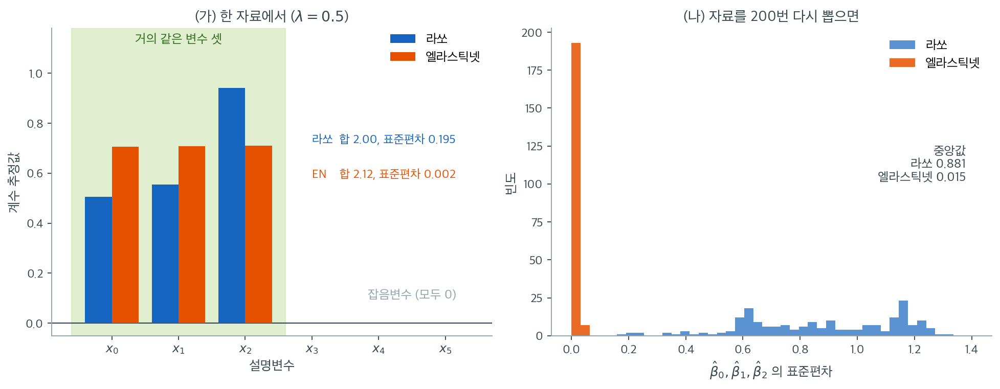

# 엘라스틱넷 보기

## 개요

엘라스틱넷은 $L_1$(라쏘) 벌점과 $L_2$(능형) 벌점을 하나의 정칙화 틀로 결합한다. 라쏘의
희소성 유도 성질을 물려받으면서, 상관된 설명변수 집단을 다루는 능형회귀의 능력도 함께 갖는다.
이 절에서는 엘라스틱넷 목적함수를 세우고 정규직교 경우의 해를 유도하며, 두 조율모수를 고르는
실무 지침을 다룬다.

## 엘라스틱넷 목적함수

$X \in \mathbb{R}^{n \times p}$와 $y \in \mathbb{R}^n$이 주어졌을 때 엘라스틱넷은

$$
\hat{\beta}^{\text{EN}} = \arg\min_{\beta} \left\{ \frac{1}{2n}\| y - X\beta \|_2^2 + \lambda \left[ \alpha \|\beta\|_1 + \frac{1 - \alpha}{2} \|\beta\|_2^2 \right] \right\}
$$

를 푼다. 여기서 $\lambda \ge 0$은 전체 정칙화 강도를, $\alpha \in [0, 1]$은 두 벌점의 배합을
조절한다.

- $\alpha = 1$: 순수 라쏘.
- $\alpha = 0$: 순수 능형회귀.
- $0 < \alpha < 1$: 엘라스틱넷.

## 정규직교 계획에서의 해

$X^\top X = n I_p$일 때 $j$번째 계수의 엘라스틱넷 추정치는

$$
\hat{\beta}_j^{\text{EN}} = \frac{1}{1 + \lambda(1 - \alpha)}\, S\!\left(\hat{\beta}_j^{\text{OLS}},\; \lambda \alpha\right)
$$

로 단순해진다. 여기서 $S(\cdot, \cdot)$는 연성 문턱 연산자다. 즉 엘라스틱넷은 먼저 연성
문턱을 적용하고(라쏘 단계) 그다음 축소 배율을 곱한다(능형 단계).

## 집단 선택

라쏘에 대한 엘라스틱넷의 큰 장점은 상관된 설명변수에서의 행동이다. 여러 설명변수가 강하게
상관되어 있을 때,

- **라쏘**는 하나만 고르고 나머지를 0으로 만드는 경향이 있다(불안정한 선택).
- **엘라스틱넷**은 집단 전체를 함께 선택하거나 함께 배제하는 경향이 있다.

이 **그룹 효과**는 벌점의 $L_2$ 성분이 강볼록하기 때문에 생기며, Zou와 Hastie(2005)가
증명하였다.

## 코드: 기본 시연

서로 거의 같은 설명변수 셋을 만들어 놓고 라쏘와 엘라스틱넷을 나란히 적합한다. 두 방법이
갈리는 자리가 어디인지 계수를 직접 보는 것이 목적이다.

<div class="exbox" markdown>

**보기 1.** <span class="diff easy" title="쉬움"></span> 라쏘와 엘라스틱넷의 집단 선택. 공통 신호 $z$에 작은 잡음을 더해 서로 거의 같은 설명변수 $x_0, x_1, x_2$를 만들고 잡음변수 셋을 덧붙인다. 참 모형은 $y = 3z + \varepsilon$이다.

**(1)** 세 계수의 합이 $s > 0$으로 고정되고 셋이 모두 음이 아닐 때, $L_1$ 벌점과 $L_2$ 벌점이 **배분**에 따라 각각 어떻게 달라지는지 구하시오. 이로부터 라쏘의 배분이 불안정한 까닭을 설명하시오.

**(2)** 라쏘와 엘라스틱넷을 적합해 (1)의 예측이 맞는지 확인하시오.

</div>

??? success "풀이"

    **(1) 해석적으로.** $\beta_0 + \beta_1 + \beta_2 = s$이고 $\beta_j \ge 0$이라 하자.

    $L_1$ 벌점은

    $$
    \lvert\beta_0\rvert + \lvert\beta_1\rvert + \lvert\beta_2\rvert = \beta_0+\beta_1+\beta_2 = s
    $$

    로 **배분과 무관하게 언제나 $s$다.** $(s, 0, 0)$이든 $(s/3, s/3, s/3)$이든 벌점이 똑같다. 즉 $L_1$은 이 평면 위에서 완전히 평평하고 어떤 배분도 선호하지 않는다. 잔차제곱합 쪽도 세 변수가 사실상 같으므로 거의 평평하다. **목적함수가 평평하면 배분을 결정하는 것은 자료의 잡음뿐이고**, 자료를 다시 뽑을 때마다 답이 달라진다.

    $L_2$ 벌점은 다르다. $\beta_j = s/3 + e_j$($\sum e_j = 0$)로 쓰면

    $$
    \sum_j \beta_j^2 = \sum_j\left(\frac{s}{3}+e_j\right)^2
    = \frac{s^2}{3} + \frac{2s}{3}\sum_j e_j + \sum_j e_j^2
    = \frac{s^2}{3} + \sum_j e_j^2
    $$

    이고 $\sum_j e_j^2 \ge 0$이므로 **균등배분 $\beta_j = s/3$에서 유일한 최소 $s^2/3$을 갖는다.** 등호는 $e_j$가 모두 0일 때만이다. 따라서 $\alpha < 1$이어서 $L_2$ 성분이 조금이라도 섞이면 평평하던 바닥이 기울어지고 배분이 곧바로 하나로 정해진다. 이것이 **그룹 효과**다.

    **(2) 수치적으로.**

    ```python
    import numpy as np
    from sklearn.linear_model import ElasticNet, Lasso

    rng = np.random.default_rng(42)

    # 서로 거의 같은 설명변수 셋(x0, x1, x2)을 일부러 만든다. 라쏘는 이런 집단에서
    # 하나만 남기고 나머지를 0으로 보내지만, 엘라스틱넷은 셋을 함께 살린다.
    n = 100
    z = rng.normal(size=n)
    X = np.column_stack([
        z + rng.normal(0, 0.05, n),      # x0
        z + rng.normal(0, 0.05, n),      # x1
        z + rng.normal(0, 0.05, n),      # x2
        rng.normal(size=(n, 3)),         # x3, x4, x5 — 잡음 변수
    ])
    y = 3 * z + rng.normal(0, 1, n)

    # l1_ratio 는 두 벌점의 배합비다. 1 이면 순수 라쏘, 0 이면 순수 능형이다.
    lasso = Lasso(alpha=0.5).fit(X, y)
    enet = ElasticNet(alpha=0.5, l1_ratio=0.5).fit(X, y)

    print("계수 (x0~x2 가 서로 거의 같은 변수):")
    print(f"  라쏘      : {np.round(lasso.coef_, 3)}")
    print(f"  엘라스틱넷: {np.round(enet.coef_, 3)}")
    # 두 방법 모두 잡음 변수는 0 으로 보낸다. 갈리는 곳은 x0~x2 안에서다.
    # 라쏘는 셋에 제멋대로 나누어 주고, 엘라스틱넷은 거의 똑같이 나누어 준다.
    # 이 고르기가 곧 집단 선택이며, 능형 벌점이 하는 일이다.
    print(f"x0~x2 계수의 표준편차 — 라쏘 {lasso.coef_[:3].std():.3f}, "
          f"엘라스틱넷 {enet.coef_[:3].std():.3f}")

    # --- (1) 의 유도를 수로 확인한다 ---
    print(f"x0~x2 사이의 상관 = {np.corrcoef(X[:, :3], rowvar=False)[0, 1]:.4f}")
    for name, c in [("라쏘", lasso.coef_[:3]), ("엘라스틱넷", enet.coef_[:3])]:
        s = c.sum()
        print(f"{name:6s} 합 s = {s:.4f}   L1 = {np.abs(c).sum():.4f}   "
              f"L2^2 = {np.sum(c**2):.4f}   균등배분의 L2^2 = s^2/3 = {s**2/3:.4f}")
    ```

    출력:

    ```
    계수 (x0~x2 가 서로 거의 같은 변수):
      라쏘      : [ 0.505  0.555  0.941  0.    -0.    -0.   ]
      엘라스틱넷: [ 0.705  0.707  0.71  -0.    -0.    -0.   ]
    x0~x2 계수의 표준편차 — 라쏘 0.195, 엘라스틱넷 0.002
    x0~x2 사이의 상관 = 0.9959
    라쏘     합 s = 2.0008   L1 = 2.0008   L2^2 = 1.4480   균등배분의 L2^2 = s^2/3 = 1.3344
    엘라스틱넷  합 s = 2.1227   L1 = 2.1227   L2^2 = 1.5019   균등배분의 L2^2 = s^2/3 = 1.5019
    ```

    

    **유도가 수에서 그대로 확인된다.** 두 방법 모두 $L_1$ 값이 세 계수의 합과 소수 넷째 자리까지 **똑같다**($2.0008$과 $2.1227$). (1)에서 말한 "$L_1$은 배분과 무관하다"가 이 등식이다. 반면 $L_2$ 제곱합은 엘라스틱넷에서 $1.5019$로 균등배분의 하한 $s^2/3 = 1.5019$와 **일치**하고, 라쏘에서는 $1.4480$으로 그 하한 $1.3344$보다 $8.5\%$ 크다. 라쏘는 균등배분에서 벗어나 있고 엘라스틱넷은 바닥에 정확히 앉아 있다.

    왼쪽 그림은 위 출력을 막대로 옮긴 것이다. 초록 띠 안의 세 변수는 쌍별 상관이 모두 $0.995$를 넘는 사실상 같은 변수이고, 참값은 셋을 합쳐 $3$이다. 두 방법 모두 **잡음변수 세 개를 정확히 0으로 만들었고 세 계수의 합도 $2.00$ 대 $2.12$로 비슷하다.** 갈리는 곳은 그 합을 어떻게 쪼개느냐뿐이다. 라쏘는 $0.505,\ 0.555,\ 0.941$로 마지막 변수에 두 배 가까이 몰아주고, 엘라스틱넷은 $0.705,\ 0.707,\ 0.710$으로 소수 셋째 자리까지 고르게 나눈다.

    합이 $3$에 못 미치는 것도 읽어 둘 일이다. 벌점이 $\lambda = 0.5$로 세기 때문에 **살아남은 계수도 참값보다 작게 나온다.** 변수를 고르는 일과 계수를 바르게 재는 일은 서로 다른 문제다.

    오른쪽은 그 결과를 200번의 반복으로 확인한 것이다. 세 계수의 표준편차를 재면 엘라스틱넷은 거의 전부 $0.05$ 미만에 쌓이고(중앙값 $0.015$) 라쏘는 $0.2$에서 $1.3$까지 넓게 퍼진다(중앙값 $0.881$). **위 보기에서 본 $0.195$는 라쏘 치고 얌전한 축에 속한 자료였다는 뜻이다.** 자료를 다시 뽑았을 뿐인데 라쏘의 배분은 매번 달라지고, 엘라스틱넷의 배분은 매번 같다. 예측만이 목적이라면 둘 다 쓸 만하지만, 계수를 읽고 보고해야 한다면 이 차이가 결론의 재현성을 가른다.

실무에서는 `sklearn.linear_model.ElasticNetCV`로 $\lambda$와 $\alpha$를 교차검증으로 함께
고른다.

## 엘라스틱넷의 좌표하강

좌표하강에서 $j$번째 계수의 갱신식은

$$
\beta_j \leftarrow \frac{S\!\left(X_j^\top r_j / n,\; \lambda \alpha\right)}{1 + \lambda(1 - \alpha)}
$$

이며, 여기서 $r_j = y - X_{-j}\beta_{-j}$는 부분잔차다. 라쏘 갱신식과 비교하면 능형 성분에서
나온 분모 $1 + \lambda(1 - \alpha)$만이 유일한 차이다.

## 조율모수의 선택

엘라스틱넷에는 초모수가 $\lambda$와 $\alpha$ 두 개 있다. 흔히 쓰는 전략은 다음과 같다.

1. $\alpha$ 값의 격자를 고정한다(예: $\{0.1, 0.5, 0.7, 0.9, 0.95\}$).
2. 각 $\alpha$에 대해 $\lambda$ 격자 위에서 교차검증한다.
3. CV 오차가 가장 작은 $(\alpha, \lambda)$ 쌍을 고른다.

## 해석

- **희소성 + 안정성.** 엘라스틱넷은 변수선택(일부 계수가 정확히 0)을 하면서도 설명변수가
  상관되어 있을 때 라쏘보다 안정적이다.
- **유일한 해.** 라쏘와 달리 엘라스틱넷 목적함수는 $\alpha < 1$일 때 강볼록이므로 해가 항상
  유일하다.
- **계산 비용.** 엘라스틱넷의 좌표하강은 분모만 살짝 바뀔 뿐 본질적으로 라쏘와 같다.

## 연습문제

<div class="drillbox" markdown>

**연습문제 1.** <span class="diff hard" title="어려움"></span> 엘라스틱넷 목적함수에서 출발하여 좌표하강 갱신식
$\beta_j \leftarrow S(X_j^\top r_j / n,\, \lambda\alpha) / (1 + \lambda(1 - \alpha))$를
유도하라.

</div>

??? success "풀이"

    $\beta_j$를 제외한 모든 계수를 고정하자. $\beta_j$만의 함수로 본 목적함수는

    $$
    g(\beta_j) = \frac{1}{2n}\|r_j - X_j \beta_j\|_2^2 + \lambda\alpha |\beta_j| + \frac{\lambda(1 - \alpha)}{2}\beta_j^2
    $$

    이며, 여기서 $r_j = y - X_{-j}\beta_{-j}$이다. 이차항을 전개하고 $\beta_j$가 없는 항을
    무시하면

    $$
    g(\beta_j) = \frac{1}{2}\!\left(\frac{\|X_j\|^2}{n} + \lambda(1-\alpha)\right)\beta_j^2 - \frac{X_j^\top r_j}{n}\,\beta_j + \lambda\alpha|\beta_j| + C
    $$

    를 얻는다. $\|X_j\|^2/n = 1$이 되도록 표준화되어 있다고 하면,
    $\frac{1}{2}a\, z^2 - b\, z + \lambda\alpha|z|$ 꼴의 함수는 $a = 1 + \lambda(1-\alpha)$일 때

    $$
    \beta_j^* = \frac{S(b,\, \lambda\alpha)}{a} = \frac{S(X_j^\top r_j/n,\, \lambda\alpha)}{1 + \lambda(1-\alpha)}
    $$

    에서 최소가 된다. $\square$

<div class="drillbox" markdown>

**연습문제 2.** <span class="diff hard" title="어려움"></span> $\alpha < 1$이고 $\lambda > 0$이면 엘라스틱넷 목적함수가 강볼록임을 증명하고,
해가 유일함을 결론지어라.

</div>

??? success "풀이"

    엘라스틱넷 목적함수는 $f(\beta) = h(\beta) + \lambda\alpha\|\beta\|_1$이고, 여기서

    $$
    h(\beta) = \frac{1}{2n}\|y - X\beta\|_2^2 + \frac{\lambda(1-\alpha)}{2}\|\beta\|_2^2
    $$

    이다. $h$의 헤세행렬은 $\nabla^2 h = \frac{1}{n}X^\top X + \lambda(1-\alpha)I_p$이다.
    $\alpha < 1$이고 $\lambda > 0$이면 $\lambda(1-\alpha)I_p$가 양정치이므로 $\nabla^2 h$도
    양정치이고, 따라서 $h$는 강볼록이다.

    $f = h + \lambda\alpha\|\cdot\|_1$는 강볼록함수와 볼록함수의 합이므로 강볼록이다. 강볼록
    함수는 최소점을 많아야 하나 가지며, $f$의 강제성(coercivity)이 존재성을 보장한다. 따라서
    엘라스틱넷 해는 유일하다. $\square$

<div class="drillbox" markdown>

**연습문제 3.** <span class="diff med" title="중간"></span> 상관계수 $\rho$가 1에 가까운 두 설명변수 $x_1$, $x_2$를 생각하자. 라쏘는 왜
둘 중 하나만 고르는 반면 엘라스틱넷은 둘 다 고르는 경향이 있는지 정성적으로 설명하고, 제약
영역의 기하와 연결지어라.

</div>

??? success "풀이"

    라쏘의 제약영역 $\|\beta\|_1 \le t$는 좌표축 위에 뾰족한 꼭짓점을 갖는다.
    $x_1 \approx x_2$이면 손실함수의 등고선은 직선 $\beta_1 = \beta_2$와 거의 평행한, 길게
    늘어난 타원이 된다. 이 타원과 마름모꼴 $L_1$ 공이 처음 닿는 곳은 대개 꼭짓점이고, 그곳에서는
    한 계수가 0이다. 그래서 라쏘는 둘 중 하나만 고른다.

    엘라스틱넷의 제약영역은 $L_1$ 마름모와 $L_2$ 공을 섞은 모양이다. $L_2$ 성분이 꼭짓점을
    둥글게 만들므로 $(\beta_1, \beta_2) = (c, c)$ 부근의 경계가 매끄럽다. 길게 늘어난 타원은
    두 계수가 모두 0이 아닌 이 매끄러운 경계에서 처음 닿을 가능성이 더 크고, 그 결과 집단
    선택이 일어난다.

    형식적으로 Zou와 Hastie(2005)는 $x_i^\top x_j / n = \rho$이고
    $\hat{\beta}_i, \hat{\beta}_j \ne 0$이면
    $|\hat{\beta}_i - \hat{\beta}_j| \le \frac{\|y\|_1}{\lambda(1-\alpha)n}\sqrt{2(1 - \rho)}$
    임을 증명하였다. 상관이 높을수록 두 계수가 가까워진다. $\square$

<div class="drillbox" markdown>

**연습문제 4.** <span class="diff easy" title="쉬움"></span> scikit-learn의 `ElasticNetCV`를 써서 $n = 200$, $p = 50$이고 참 계수 중 5개만
0이 아니며 앞의 10개 설명변수끼리 쌍별 상관이 $\rho = 0.95$인 인공자료에 엘라스틱넷을
적합하라. 선택된 $\alpha$, $\lambda$, 그리고 0이 아닌 계수의 개수를 보고하라.

</div>

??? success "풀이"

    ```python
    import numpy as np
    from sklearn.linear_model import ElasticNetCV
    from sklearn.preprocessing import StandardScaler

    np.random.seed(42)
    n, p = 200, 50

    # 앞의 열 변수는 서로 상관된 덩어리를 이룬다
    Sigma = np.eye(p)
    for i in range(10):
        for j in range(10):
            if i != j:
                Sigma[i, j] = 0.95
    L = np.linalg.cholesky(Sigma)
    X = np.random.randn(n, p) @ L.T

    beta_true = np.zeros(p)
    beta_true[:5] = [3, -2, 4, -1, 2]
    y = X @ beta_true + np.random.randn(n)

    X_s = StandardScaler().fit_transform(X)

    enet_cv = ElasticNetCV(
        l1_ratio=[0.1, 0.5, 0.7, 0.9, 0.95],
        n_alphas=100, cv=5, max_iter=10000
    )
    enet_cv.fit(X_s, y)

    n_nonzero = np.sum(np.abs(enet_cv.coef_) > 1e-6)
    print(f"Selected alpha (l1_ratio): {enet_cv.l1_ratio_}")
    print(f"Selected lambda:           {enet_cv.alpha_:.6f}")
    print(f"Non-zero coefficients:     {n_nonzero}")
    ```

    출력:

    ```
    Selected alpha (l1_ratio): 0.95
    Selected lambda:           0.014625
    Non-zero coefficients:     41
    ```

    실행 결과는 $\alpha = 0.95$, $\lambda = 0.014625$이고 0이 아닌 계수는 **41개**다.
    참 신호가 5개뿐인데 41개가 살아남은 것은 실수가 아니라 교차검증의 성질이다. CV는 예측오차를
    최소화하므로 계수가 아주 작은 잡음변수를 남겨 두는 데 대한 벌칙이 거의 없고, 그 결과
    $\lambda$가 선택 관점에서는 지나치게 작게 잡힌다. 다만 상관 블록 안(앞의 10개 변수)에서는
    6개가 함께 선택되어 그룹 효과가 실제로 나타난다. 순수 라쏘였다면 이 블록에서 보통 한두 개만
    남는다.

    **희소성이 목표라면** CV 최소점을 그대로 쓰지 말고 1-표준오차 규칙(`cv_tuning.md` 참조),
    사후 라쏘, 또는 안정성 선택을 함께 써야 한다. $\square$

<div class="drillbox" markdown>

**연습문제 5.** <span class="diff hard" title="어려움"></span> 정규직교 계획($X^\top X = nI_p$)에서 엘라스틱넷 추정량이
$\hat{\beta}_j^{\text{EN}} = \frac{1}{1+\lambda(1-\alpha)}\,S(\hat{\beta}_j^{\text{OLS}},\, \lambda\alpha)$
로 쓰임을 보이고, 두 연산(연성 문턱 뒤 재척도)을 기하학적으로 해석하라.

</div>

??? success "풀이"

    $X^\top X = nI_p$이면 엘라스틱넷 목적함수는 $p$개의 독립된 일변량 문제로 분리된다.

    $$
    \min_{\beta_j} \left\{ \frac{1}{2}(\hat{\beta}_j^{\text{OLS}} - \beta_j)^2 + \lambda\alpha|\beta_j| + \frac{\lambda(1-\alpha)}{2}\beta_j^2 \right\}.
    $$

    이차항을 합치면

    $$
    \min_{\beta_j} \left\{ \frac{1 + \lambda(1-\alpha)}{2}\beta_j^2 - \hat{\beta}_j^{\text{OLS}}\beta_j + \lambda\alpha|\beta_j| \right\}
    $$

    이고, 연습문제 1의 근접 연산자 결과에 의해 해는

    $$
    \hat{\beta}_j^{\text{EN}} = \frac{S(\hat{\beta}_j^{\text{OLS}},\, \lambda\alpha)}{1 + \lambda(1-\alpha)}
    $$

    이다.

    **기하학적 해석:** 연성 문턱은 OLS 추정치를 0 쪽으로 평행이동하고 작은 값은 정확히 0으로
    잘라 낸다(희소성을 만드는 라쏘 단계). 이어서 $1 + \lambda(1-\alpha)$로 나누는 것은 살아남은
    계수를 0 쪽으로 균일하게 축소한다(추가 축소를 주는 능형 단계). 두 연산이 합쳐져 희소성과
    연속적 축소를 동시에 얻는다. $\square$

---

## 정리하며

엘라스틱넷은 **두 벌점을 섞는다.**

$$
\lambda\left(\alpha\|\boldsymbol\beta\|_1+\frac{1-\alpha}{2}\|\boldsymbol\beta\|_2^2\right)
$$

- **라쏘의 희소성과 능형의 안정성을 함께 얻는다.** $\alpha=1$ 이면 라쏘, $\alpha=0$ 이면 능형이며 그 사이를 연속적으로 잇는다.
- **그룹 효과가 핵심 장점이다.** 상관된 변수들을 **함께 선택하거나 함께 버린다.** 라쏘가 하나만 고르고 나머지를 버리는 불안정성을 $L_2$ 항이 완화한다.
- **$p\gg n$ 에서 유용하다.** 라쏘의 "최대 $n$ 개" 제약을 넘어설 수 있다.
- **조율 모수가 둘이다.** $\lambda$ 와 $\alpha$ 를 2차원 격자로 교차검증해야 하므로 계산이 는다.
- **유전체학처럼 상관된 변수 집단이 있는 자료**에서 특히 자주 쓰인다.

다음 절 **교차검증과 λ 조율**로 넘어간다.
