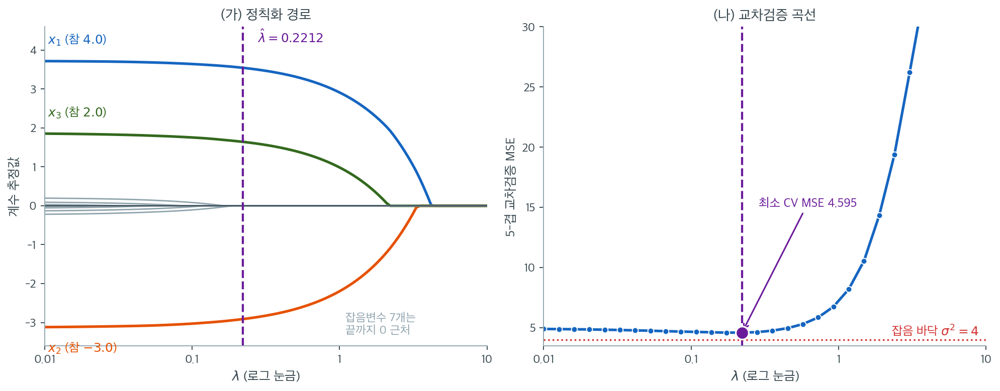

# 라쏘 회귀 보기

## 개요

라쏘(Least Absolute Shrinkage and Selection Operator) 회귀는 최소제곱 목적함수에 $L_1$
벌점을 더한다. 이 벌점은 계수를 축소할 뿐 아니라 일부를 정확히 0으로 만든다. 이 절에서는
좌표하강으로 라쏘를 처음부터 구현하고, 정칙화 경로를 시각화하며, 교차검증으로 조율모수
$\lambda$를 선택한다.

## 라쏘 목적함수

$X \in \mathbb{R}^{n \times p}$와 $y \in \mathbb{R}^n$이 주어졌을 때 라쏘는

$$
\hat{\beta}^{\text{lasso}} = \arg\min_{\beta} \left\{ \frac{1}{2n}\| y - X\beta \|_2^2 + \lambda \sum_{j=1}^{p} |\beta_j| \right\}
$$

를 푼다. 능형회귀와 달리 $L_1$ 벌점 $\lambda \|\beta\|_1$은 희소한 해를 만든다. $\lambda$가
충분히 크면 일부 계수가 정확히 0이 된다.

## 연성 문턱 연산자

라쏘 좌표하강의 핵심 구성요소는 **연성 문턱**(근접) 연산자다.

$$
S(\rho,\, \lambda) = \text{sign}(\rho)\, \max(|\rho| - \lambda,\, 0) =
\begin{cases}
\rho - \lambda & \text{if } \rho > \lambda, \\
0 & \text{if } |\rho| \le \lambda, \\
\rho + \lambda & \text{if } \rho < -\lambda.
\end{cases}
$$

## 코드: 좌표하강 해법기

다음은 순환 좌표하강으로 라쏘를 푸는 순수 NumPy 구현이다.

<div class="exbox" markdown>

**보기 1.** <span class="diff easy" title="쉬움"></span> 좌표하강으로 라쏘 풀기. 나머지 계수를 고정한 채 $\beta_j$ 하나만 최적화하는 일을 돌아가며 되풀이한다.

**(1)** $\beta_j$에 대한 일변량 문제를 풀어 갱신식을 유도하시오. 아래 코드는 `beta[j] = soft_threshold(rho_j, lam)` 로 끝나는데, 이 한 줄이 옳으려면 $X$에 어떤 조건이 필요한가.

**(2)** 구현을 scikit-learn의 `Lasso` 와 맞추어 확인하시오.

</div>

??? success "풀이"

    **(1) 해석적으로.** 부분잔차를 $r_j = y - X\beta + x_j\beta_j$라 두면 $\beta_j$만 남긴 목적함수는

    $$
    f(\beta_j) = \frac{1}{2n}\lVert r_j - x_j\beta_j\rVert_2^2 + \lambda\lvert\beta_j\rvert + \text{상수}
    $$

    이다. 제곱항을 펼치고 $\beta_j$와 무관한 부분을 상수로 묶으면

    $$
    f(\beta_j) = \frac{a_j}{2}\beta_j^2 - \rho_j\beta_j + \lambda\lvert\beta_j\rvert + \text{상수},
    \qquad
    a_j = \frac{\lVert x_j\rVert_2^2}{n},
    \quad
    \rho_j = \frac{x_j^\top r_j}{n}
    $$

    이다. $a_j > 0$이므로 $f$는 강볼록이고 최솟값이 하나뿐이다. $\beta_j \ne 0$인 곳에서 미분하면 $a_j\beta_j - \rho_j + \lambda\operatorname{sign}(\beta_j) = 0$이고, $\beta_j = 0$이 최적일 조건은 하위기울기가 0을 품는 것, 곧 $\lvert\rho_j\rvert \le \lambda$다. 셋을 합치면

    $$
    \hat\beta_j = \frac{1}{a_j}\,S(\rho_j, \lambda),
    \qquad
    S(\rho,\lambda) = \operatorname{sign}(\rho)\,(\lvert\rho\rvert - \lambda)_+
    $$

    이다. **분모 $a_j$가 코드에는 없다.** 그러므로 이 구현이 옳으려면

    $$
    a_j = \frac{\lVert x_j\rVert_2^2}{n} = 1 \quad \text{(모든 } j\text{)}
    $$

    이어야 하고, 이는 각 열을 평균 0·표준편차 1로 **표준화했을 때** 정확히 성립한다(모분산 꼴로 $n$으로 나누는 표준화여야 한다). 코드가 `X` 를 미리 표준화하라고 적어 둔 것은 벌점의 공평성 때문만이 아니라 **갱신식 자체가 그것을 가정하기 때문**이다.

    **(2) 수치적으로.**

    ```python
    import numpy as np

    def soft_threshold(rho, lam):
        """연성 문턱 연산자. 좌표하강의 갱신식에 쓰인다.

        |rho| 가 lam 보다 작으면 0 으로 보내고, 크면 그만큼 깎아 0 쪽으로 당긴다.
        라쏘가 계수를 정확히 0 으로 만들 수 있는 까닭이 이 평평한 구간에 있다.
        능형의 갱신식에는 이런 구간이 없어 0 이 될 수 없다.
        """
        if rho > lam:
            return rho - lam
        elif rho < -lam:
            return rho + lam
        return 0.0

    def lasso_cd(X, y, lam, max_iter=1000, tol=1e-6):
        """좌표하강으로 라쏘를 푼다.

        L1 벌점은 0 에서 미분이 되지 않아 정규방정식 같은 닫힌 해가 없다.
        대신 계수를 하나씩 돌아가며 나머지를 고정한 채 최적화하면, 각 단계가
        연성 문턱 한 줄로 끝난다. 라쏘의 표준적인 푸는 법이다.

        매개변수
        --------
        X   : (n, p) 설계행렬. 미리 표준화해야 한다.
        y   : (n,)   반응벡터
        lam : L1 벌점 모수

        돌려주는 값
        ----------
        beta : (p,) 계수벡터
        """
        n, p = X.shape
        beta = np.zeros(p)
        for _ in range(max_iter):
            beta_old = beta.copy()
            for j in range(p):
                # j 번째 변수의 몫만 되살린 부분잔차. 나머지 변수의 설명은
                # 이미 빼 놓은 상태이므로, 여기에 j 만 단순회귀하는 셈이 된다.
                r_j = y - X @ beta + X[:, j] * beta[j]
                rho_j = X[:, j] @ r_j / n
                beta[j] = soft_threshold(rho_j, lam)
            if np.max(np.abs(beta - beta_old)) < tol:
                break
        return beta

    # --- (1) 의 조건과 결과를 확인한다 ---
    from sklearn.linear_model import Lasso

    np.random.seed(42)
    n, p = 150, 10
    X_raw = np.random.randn(n, p)
    beta_true = np.array([4.0, -3.0, 2.0] + [0.0] * 7)
    y = X_raw @ beta_true + np.random.randn(n) * 2
    X = (X_raw - X_raw.mean(axis=0)) / X_raw.std(axis=0)

    print("||x_j||^2 / n =", np.round((X ** 2).sum(axis=0) / n, 6))
    for lam in (1.0, 0.2212, 0.05):
        mine = lasso_cd(X, y, lam)
        sk = Lasso(alpha=lam, max_iter=100000, tol=1e-12).fit(X, y).coef_
        print(f"lam = {lam:<7} 최대 차이 = {np.abs(mine - sk).max():.3e}")
    ```

    출력:

    ```
    ||x_j||^2 / n = [1. 1. 1. 1. 1. 1. 1. 1. 1. 1.]
    lam = 1.0     최대 차이 = 2.753e-08
    lam = 0.2212  최대 차이 = 4.225e-08
    lam = 0.05    최대 차이 = 6.010e-08
    ```

    **$a_j = \lVert x_j\rVert^2/n$이 열 개 모두 정확히 1이다.** `np.std` 가 기본적으로 $n$으로 나누므로 표준화의 부산물로 이 조건이 공짜로 따라온다. 그래서 분모를 생략한 갱신식이 옳고, 세 $\lambda$에서 scikit-learn과 $10^{-8}$ 수준까지 같은 답이 나온다. 남은 차이는 수렴 판정 `tol=1e-6` 때문이지 식이 달라서가 아니다.

    만약 `X_raw` 를 그대로 넣었다면 $a_j \ne 1$이므로 같은 코드가 **틀린 답**을 준다. 표준화는 벌점을 공평하게 걸기 위한 권고이기 전에 이 구현의 **전제조건**이다.

    각 단계에서 알고리즘은 부분잔차 $r_j = y - X\beta + X_j \beta_j$를 계산하고, 일변량 최소제곱 기울기 $\rho_j = X_j^\top r_j / n$을 구한 뒤 연성 문턱을 적용한다.

## 코드: 정칙화 경로

$\lambda$ 격자를 큰 값에서 작은 값으로 훑으면 계수들이 어떤 순서로 모형에 들어오는지 볼 수 있다.

<div class="exbox" markdown>

**보기 2.** <span class="diff easy" title="쉬움"></span> 계수 경로 구하기. 보기 1의 해법기를 $\lambda$ 격자 위에서 되풀이해 경로를 얻는다.

**(1)** 경로가 모두 0에서 출발하는 지점 $\lambda_{\max}$를 구하고, 격자로 읽은 "변수가 들어온 $\lambda$"가 **참 꺾임점과 다를 수밖에 없는** 까닭을 말하시오.

**(2)** 격자가 준 진입 $\lambda$와 LARS가 준 정확한 꺾임점을 나란히 놓고 비교하시오.

</div>

??? success "풀이"

    **(1) 해석적으로.** 보기 1의 갱신식에서 모든 $\beta_j$가 0일 때 $r_j = y$이므로 $\rho_j = x_j^\top y / n$이다. 연성 문턱이 모든 좌표를 0으로 두려면 $\lvert\rho_j\rvert \le \lambda$가 모든 $j$에서 성립해야 하므로

    $$
    \lambda_{\max} = \max_j \frac{\lvert x_j^\top y\rvert}{n}
    $$

    이고, 영벡터는 이 $\lambda$ 이상에서 고정점이 된다. 이 값보다 조금 낮추면 최댓값을 달성하던 좌표가 처음으로 0을 벗어난다.

    경로의 참 꺾임점은 이렇게 **연속적인 $\lambda$**에 대해 정의된다. 그러나 `lasso_path` 는 미리 정한 유한한 격자점에서만 해를 구하므로, 진입을 감지하는 자리는 언제나 **꺾임점 아래 첫 격자점**이다. 따라서 격자로 읽은 진입 $\lambda$는 참값보다 **반드시 작거나 같다.** 격자를 촘촘히 할수록 가까워지지만 같아지지는 않는다.

    **(2) 수치적으로.**

    ```python
    def lasso_path(X, y, lambdas):
        """lambda 격자 위에서 계수 경로를 구한다.

        lambda 를 크게 잡으면 모든 계수가 0 이고, 줄여 갈수록 하나씩 살아난다.
        먼저 살아나는 변수가 그만큼 중요하다는 뜻이라, 경로 그림 자체가
        변수 선택의 이야기를 담는다.
        """
        coefs = []
        for lam in lambdas:
            beta = lasso_cd(X, y, lam)
            coefs.append(beta.copy())
        return np.array(coefs)

    # --- (1) 의 lambda_max 와 꺾임점을 확인한다 ---
    lambdas = np.logspace(1, -2, 60)
    path = lasso_path(X, y, lambdas)
    n_nz = (np.abs(path) > 1e-8).sum(axis=1)

    lam_max = np.abs(X.T @ (y - y.mean())).max() / n
    print(f"이론 lambda_max = {lam_max:.4f}")
    print(f"격자에서 계수가 모두 0 인 가장 작은 lambda = "
          f"{lambdas[n_nz == 0][-1]:.4f},  바로 다음 격자점 = {lambdas[(n_nz > 0).argmax()]:.4f}")

    from sklearn.linear_model import lars_path
    knots, active, _ = lars_path(X, y - y.mean(), method='lasso')
    print("정확한 꺾임점 앞 넷 =", np.round(knots[:4], 4))
    print("그 자리에서 들어온 변수 =", [f"x{j+1}" for j in active[:4]])
    print("격자가 준 진입 lambda  =",
          [f"{lambdas[(np.abs(path[:, j]) > 1e-8).argmax()]:.4f}" for j in range(4)])
    ```

    출력:

    ```
    이론 lambda_max = 4.2017
    격자에서 계수가 모두 0 인 가장 작은 lambda = 4.4062,  바로 다음 격자점 = 3.9194
    정확한 꺾임점 앞 넷 = [4.2017 3.3635 2.1672 0.1892]
    그 자리에서 들어온 변수 = ['x1', 'x2', 'x3', 'x4']
    격자가 준 진입 lambda  = ['3.9194', '3.1012', '1.9415', '0.1867']
    ```

    **유도한 $\lambda_{\max} = 4.2017$이 LARS의 첫 꺾임점과 소수 넷째 자리까지 같다.** 격자는 이 값을 $4.4062$와 $3.9194$ 사이에 가두기만 할 뿐 집어내지 못한다. 두 격자점의 비가 $10^{3/59} = 1.124$이기 때문이다.

    네 변수의 진입을 나란히 놓으면 **격자값이 언제나 참 꺾임점보다 작다.** $4.2017 > 3.9194$, $3.3635 > 3.1012$, $2.1672 > 1.9415$, $0.1892 > 0.1867$로 네 번 모두 그렇고, 이는 (1)에서 말한 그대로다. 우연이 아니라 격자 탐색의 구조가 보장하는 방향이다.

    들어오는 순서가 $x_1, x_2, x_3$으로 참 계수의 크기 $(4, -3, 2)$ 순서와 같다는 점, 그리고 네 번째 진입이 $2.1672$에서 $0.1892$로 **열 배 넘게 떨어진 뒤에야** 일어난다는 점이 이 자료의 신호가 깨끗하다는 증거다.

## 코드: 교차검증으로 람다 선택

5-겹 교차검증으로 각 후보 $\lambda$의 예측오차를 추정한다.

<div class="exbox" markdown>

**보기 3.** <span class="diff easy" title="쉬움"></span> 교차검증 MSE. 함수의 주석은 "벌점이 강할수록 훈련오차는 반드시 커진다"고 적어 두었다.

**(1)** 그 "반드시"를 증명하시오. 곧 $\lambda_1 < \lambda_2$이면 두 해의 잔차제곱합이 $\mathrm{RSS}(\hat\beta_{\lambda_1}) \le \mathrm{RSS}(\hat\beta_{\lambda_2})$임을 보이시오. 이로부터 $\lambda$를 훈련오차로 고를 수 없는 까닭이 나오는가.

**(2)** 훈련오차와 교차검증 오차를 나란히 계산해 확인하고, 이 구현에서 눈여겨볼 점을 지적하시오.

</div>

??? success "풀이"

    **(1) 해석적으로.** $L(\beta,\lambda) = \frac{1}{2n}\mathrm{RSS}(\beta) + \lambda\lVert\beta\rVert_1$라 두고 $\hat\beta_1 = \hat\beta_{\lambda_1}$, $\hat\beta_2 = \hat\beta_{\lambda_2}$라 하자. 각자가 자기 $\lambda$에서 최소이므로

    $$
    L(\hat\beta_1,\lambda_1) \le L(\hat\beta_2,\lambda_1),
    \qquad
    L(\hat\beta_2,\lambda_2) \le L(\hat\beta_1,\lambda_2)
    $$

    이다. 두 부등식을 더하면 $\frac{1}{2n}\mathrm{RSS}$ 항이 양변에서 같아져 모두 지워지고

    $$
    \lambda_1\lVert\hat\beta_1\rVert_1 + \lambda_2\lVert\hat\beta_2\rVert_1
    \;\le\;
    \lambda_1\lVert\hat\beta_2\rVert_1 + \lambda_2\lVert\hat\beta_1\rVert_1
    $$

    곧 $(\lambda_2-\lambda_1)\big(\lVert\hat\beta_2\rVert_1 - \lVert\hat\beta_1\rVert_1\big) \le 0$만 남는다. $\lambda_2 > \lambda_1$이므로

    $$
    \lVert\hat\beta_2\rVert_1 \le \lVert\hat\beta_1\rVert_1
    $$

    이다. 이것을 첫 부등식에 넣으면

    $$
    \frac{\mathrm{RSS}(\hat\beta_1)}{2n}
    \le \frac{\mathrm{RSS}(\hat\beta_2)}{2n} + \lambda_1\big(\lVert\hat\beta_2\rVert_1 - \lVert\hat\beta_1\rVert_1\big)
    \le \frac{\mathrm{RSS}(\hat\beta_2)}{2n}
    $$

    이 되어 $\mathrm{RSS}(\hat\beta_1) \le \mathrm{RSS}(\hat\beta_2)$다. **훈련오차는 $\lambda$에 대해 비감소함수다.**

    그러므로 훈련오차를 최소화하는 $\lambda$는 언제나 격자의 **가장 작은 값**이고, 선택 기준으로 쓸 수 없다. 자료를 떼어 두고 재는 수밖에 없으며 그것이 교차검증이다.

    **(2) 수치적으로.**

    ```python
    def cv_lasso(X, y, lambdas, folds=5):
        """lambda 마다 k겹 교차검증 MSE 를 구한다.

        벌점이 강할수록 훈련오차는 반드시 커진다. 그러니 lambda 는 훈련자료가
        아니라 떼어 놓은 자료에서 재야 고를 수 있다.
        """
        n = len(y)
        indices = np.arange(n)
        np.random.shuffle(indices)
        fold_size = n // folds
        cv_mse = np.zeros(len(lambdas))

        for k in range(folds):
            val_idx = indices[k * fold_size:(k + 1) * fold_size]
            train_idx = np.setdiff1d(indices, val_idx)
            X_tr, y_tr = X[train_idx], y[train_idx]
            X_va, y_va = X[val_idx], y[val_idx]
            for i, lam in enumerate(lambdas):
                beta = lasso_cd(X_tr, y_tr, lam)
                pred = X_va @ beta
                cv_mse[i] += np.mean((y_va - pred) ** 2)
        return cv_mse / folds

    # --- (1) 의 단조성을 확인한다 ---
    np.random.seed(42)
    grid = np.logspace(1, -2, 30)
    train_mse = np.array([np.mean((y - X @ lasso_cd(X, y, l)) ** 2) for l in grid])
    print(f"훈련 MSE 가 lambda 에 대해 단조증가인가? "
          f"{bool(np.all(np.diff(train_mse[::-1]) >= -1e-12))}")
    print("훈련 MSE (lambda = 10, 1, 0.2212, 0.01):",
          [f"{np.mean((y - X @ lasso_cd(X, y, l)) ** 2):.3f}" for l in (10, 1, 0.2212, 0.01)])

    cv = cv_lasso(X, y, grid)
    print(f"CV MSE  최솟값 {cv.min():.3f} at lambda = {grid[cv.argmin()]:.4f}")
    print(f"CV MSE  양 끝: lambda = {grid[0]:.2f} -> {cv[0]:.3f},  "
          f"lambda = {grid[-1]:.2f} -> {cv[-1]:.3f}")
    ```

    출력:

    ```
    훈련 MSE 가 lambda 에 대해 단조증가인가? True
    훈련 MSE (lambda = 10, 1, 0.2212, 0.01): ['35.154', '6.848', '4.398', '4.157']
    CV MSE  최솟값 4.622 at lambda = 0.1743
    CV MSE  양 끝: lambda = 10.00 -> 35.154,  lambda = 0.01 -> 4.964
    ```

    **단조성이 격자 30점 전체에서 성립한다.** 훈련 MSE는 $\lambda$가 줄수록 $35.154 \to 6.848 \to 4.398 \to 4.157$로 끝까지 내려가고, 훈련오차만 보면 가장 작은 $\lambda$가 언제나 이긴다.

    교차검증 곡선은 다르다. $\lambda = 10$에서 $35.154$(계수가 전부 0이라 훈련오차와 같다)로 시작해 $\lambda = 0.1743$에서 $4.622$로 바닥을 치고, $\lambda = 0.01$에서 $4.964$로 **다시 올라간다.** 훈련오차가 $4.398$에서 $4.157$로 내려가는 바로 그 구간에서 검증오차는 거꾸로 간다. 이 어긋남이 과적합이고, 교차검증이 하는 일은 그것을 드러내는 것이다.

    같은 자료인데 보기 4가 보고하는 $\hat\lambda = 0.2212$, 최소 CV MSE $4.774$와 여기의 $0.1743$, $4.622$가 다르다. **겹을 나누는 난수가 다르기 때문이다.** 보기 4는 자료를 새로 뽑느라 난수를 소비한 뒤 겹을 나누고, 여기서는 씨앗을 고정한 직후에 나눈다. 아래 셋째 항목이 지적하는 바로 그 취약함이며, 한 번의 교차검증이 고른 $\lambda$를 소수점까지 믿어서는 안 된다는 뜻이기도 하다.

    **구현에서 눈여겨볼 점 셋.**

    - `np.random.shuffle` 이 전역 난수 상태를 쓴다. 함수 안에 씨앗이 없으므로 **호출 전에 씨앗을 고정하지 않으면 결과가 매번 달라진다.** 위 코드가 재현되는 것은 바로 앞에서 `np.random.seed(42)` 를 불렀기 때문이다.
    - `fold_size = n // folds` 라서 $n$이 `folds` 로 나누어떨어지지 않으면 **나머지 관측이 어느 검증 겹에도 들어가지 않는다.** 여기서는 $150 = 5 \times 30$이라 버려지는 것이 없지만 일반적으로는 손실이다.
    - 표준화를 **함수 바깥에서 전체 자료로** 해 두었다. 엄밀하게는 훈련 겹의 평균과 표준편차만 써야 하며, 지금 꼴은 검증 겹의 정보가 조금 새어 든다. $n$이 크면 영향이 작지만 원리상 결함이다.

## 코드: 전체 시연

설명변수 10개 중 3개만 실제로 관련 있는 인공자료를 만들어 전체 절차를 돌려 본다.

<div class="exbox" markdown>

**보기 4.** <span class="diff easy" title="쉬움"></span> 경로와 교차검증 실행. $n = 150$, $p = 10$이고 참 계수는 $(4, -3, 2, 0, \dots, 0)$, 잡음은 $N(0, 2^2)$이다. 설계는 독립 표준정규라 거의 직교다.

**(1)** 설계가 **정확히** 직교라면($X^\top X/n = I$) 라쏘 해가 최소제곱 해의 무엇이 되는가. 이로부터 교차검증이 고른 $\hat\lambda$에서 세 계수가 얼마가 될지 예측하시오. 또 교차검증 MSE가 내려갈 수 없는 바닥은 얼마인가.

**(2)** 전체 절차를 돌려 두 예측을 확인하시오.

</div>

??? success "풀이"

    **(1) 해석적으로.** $X^\top X/n = I$이면 보기 1의 갱신식에서 $\rho_j = x_j^\top(y - X\beta)/n + \beta_j$이고 비대각 성분이 없으므로 한 바퀴만 돌면 수렴한다. 그 값은

    $$
    \hat\beta_j^{\text{lasso}} = S\!\left(\hat\beta_j^{\text{OLS}},\, \lambda\right)
    = \operatorname{sign}(\hat\beta_j^{\text{OLS}})\left(\lvert\hat\beta_j^{\text{OLS}}\rvert - \lambda\right)_+
    $$

    이다. **라쏘는 최소제곱 해를 연성 문턱에 통과시킨 것**이고, 살아남은 계수는 절댓값이 정확히 $\lambda$만큼 깎인다. 이 자료는 완전히 직교하지는 않으므로 등식이 아니라 좋은 근사다.

    바닥은 잡음에서 온다. 잡음이 $N(0, 2^2)$이므로 새 관측에 대한 예측오차는 $\sigma^2 = 4$ 아래로 내려갈 수 없다(cv_tuning 절의 보기와 같은 논증이다). 교차검증 MSE가 $4$에 얼마나 가까운지가 곧 추정이 얼마나 잘되었는지의 척도다.

    **(2) 수치적으로.**

    ```python
    import matplotlib.pyplot as plt

    np.random.seed(42)

    # 열 변수 중 참으로 쓰이는 것은 앞의 셋뿐이다. 교차검증으로 고른 라쏘가
    # 그 셋을 찾아내는지 보는 것이 목적이다.
    n, p = 150, 10
    X_raw = np.random.randn(n, p)
    beta_true = np.array([4.0, -3.0, 2.0, 0, 0, 0, 0, 0, 0, 0])
    y = X_raw @ beta_true + np.random.randn(n) * 2

    # L1 벌점은 계수의 크기를 그대로 재므로, 변수의 단위가 다르면 벌점이
    # 불공평하게 걸린다. 표준화는 선택이 아니라 필수다.
    X_mean = X_raw.mean(axis=0)
    X_std = X_raw.std(axis=0)
    X = (X_raw - X_mean) / X_std

    # lambda 격자는 로그 눈금으로 잡는다. 벌점이 곱셈으로 작동하기 때문이다.
    lambdas = np.logspace(1, -2, 60)
    path = lasso_path(X, y, lambdas)

    # 교차검증으로 lambda 고르기
    lambdas_cv = np.logspace(1, -2, 30)
    mse_cv = cv_lasso(X, y, lambdas_cv)
    best_idx = int(np.argmin(mse_cv))
    best_lam = lambdas_cv[best_idx]

    beta_best = lasso_cd(X, y, best_lam)
    n_nonzero = np.sum(np.abs(beta_best) > 1e-8)

    print(f"Best lambda (5-fold CV):  {best_lam:.4f}")
    print(f"Non-zero coefficients:    {n_nonzero}  (true: 3)")
    print(f"Min CV MSE:               {mse_cv[best_idx]:.3f}")

    # --- 직교 근사가 예측하는 축소량과 견준다 ---
    from sklearn.linear_model import LinearRegression
    ols = LinearRegression().fit(X, y).coef_
    pred = np.sign(ols) * np.maximum(np.abs(ols) - best_lam, 0)
    print(f"X'X/n 이 단위행렬에서 벗어난 최대 크기 = {np.abs(X.T @ X / n - np.eye(p)).max():.4f}")
    print(f"  최소제곱          {np.round(ols[:3], 4)}")
    print(f"  연성문턱 예측      {np.round(pred[:3], 4)}")
    print(f"  라쏘 실제          {np.round(beta_best[:3], 4)}")
    print(f"잡음 바닥 sigma^2 = 4,  최소 CV MSE = {mse_cv[best_idx]:.3f}  "
          f"(차이 {mse_cv[best_idx] - 4:.3f})")
    ```

    출력:

    ```
    Best lambda (5-fold CV):  0.2212
    Non-zero coefficients:    3  (true: 3)
    Min CV MSE:               4.774
    X'X/n 이 단위행렬에서 벗어난 최대 크기 = 0.1857
      최소제곱          [ 3.7252 -3.129   1.8683]
      연성문턱 예측      [ 3.504  -2.9078  1.6471]
      라쏘 실제          [ 3.5463 -2.9119  1.6434]
    잡음 바닥 sigma^2 = 4,  최소 CV MSE = 4.774  (차이 0.774)
    ```

    **직교 근사가 잘 맞는다.** 연성 문턱이 예측한 $(3.504,\ -2.908,\ 1.647)$과 실제 라쏘 해 $(3.546,\ -2.912,\ 1.643)$의 차이가 셋 다 $0.05$ 아래다. $X^\top X/n$의 비대각 성분이 최대 $0.186$으로 0이 아니기 때문에 정확히 같지는 않으며, 가장 크게 어긋난 첫 계수의 차이 $0.042$가 그 비직교성의 값이다.

    추정된 계수 $(3.546,\, -2.912,\, 1.643,\, 0, \dots, 0)$은 참값 $(4, -3, 2, 0, \dots, 0)$을 모두 0 쪽으로 축소한 값이다. **그런데 축소의 출발점은 참값이 아니라 최소제곱 추정값이다.** 최소제곱이 이미 $(3.725, -3.129, 1.868)$로 참값에서 흔들려 있었고, 라쏘는 거기서 다시 $\hat\lambda = 0.2212$씩 깎았다. 두 몫을 섞어 "라쏘의 편향"이라 부르면 안 된다.

    최소 CV MSE $4.774$는 잡음 바닥 $4$보다 $0.774$ 높다. **어떤 방법도 $4$ 아래로는 내려갈 수 없으므로** 이 자료에서 남은 개선의 여지는 그 $0.774$뿐이다. 모형을 더 다듬기 전에 잡음 바닥부터 가늠해 보아야 하는 이유다.

    

    같은 자료를 그림으로 옮긴 것이다. 왼쪽 경로에서 굵은 세 선이 참 변수, 가는 회색 일곱 선이 잡음변수다. 오른쪽에서 고른 $\hat\lambda = 0.2212$를 두 그림에 보라색 세로선으로 표시했다.

    **경로를 오른쪽에서 왼쪽으로 읽어야 한다.** $\lambda_{\max} = 4.20$보다 큰 곳에서는 모든 계수가 0이다. $\lambda$를 낮추면 $x_1$이 가장 먼저 들어오고 $x_2$, $x_3$이 뒤따르며(보기 2에서 꺾임점을 $4.2017$, $3.3635$, $2.1672$로 정확히 구했다) 들어오는 순서가 참 계수의 크기 순서 $(4.0,\ 3.0,\ 2.0)$와 같다. 반면 잡음변수 일곱 개는 $\lambda = 0.19$ 아래로 내려가야 겨우 움직이기 시작한다. **신호와 잡음 사이에 $2.17$부터 $0.19$까지 열 배 넘는 빈 구간이 있고, 교차검증이 고른 $0.2212$가 그 구간 안에 들어온다.** 변수선택이 성공하는 자료란 이런 간격이 있는 자료다.

    오른쪽 CV 곡선은 왼쪽이 평평하고 오른쪽이 가파른 L자다. 과소정칙화는 싸고 과대정칙화는 비싸다. $\lambda$를 키우면 계수가 축소될 뿐 아니라 변수가 아예 사라지기 때문이다.

## 해석

- **희소성.** 최적 $\lambda$에서 라쏘는 실제로 관련 있는 설명변수 3개를 정확히 찾아내고 나머지
  7개를 0으로 만든다.
- **정칙화 경로.** $\lambda$가 작아짐에 따라 계수들이 하나씩 모형에 들어온다. 들어오는 순서는
  대개 변수의 중요도를 반영한다.
- **교차검증 곡선.** CV MSE 곡선은 보통 U자 모양이다. $\lambda$가 너무 크면 과소적합(편향이
  크고), 너무 작으면 과적합(분산이 크다). 최소점이 둘의 균형을 맞춘다.
- **능형회귀와의 비교.** 능형회귀라면 10개 설명변수를 모두 작지만 0이 아닌 계수로 남긴다.
  라쏘는 정확한 희소성을 얻는다.

## 연습문제

<div class="drillbox" markdown>

**연습문제 1.** <span class="diff med" title="중간"></span> $S(\rho, \lambda)$가 $\lambda |\cdot|$의 근접 연산자임을 손으로 확인하라. 즉
$S(\rho, \lambda) = \arg\min_{z} \left\{ \frac{1}{2}(z - \rho)^2 + \lambda |z| \right\}$
임을 보여라.

</div>

??? success "풀이"

    $g(z) = \frac{1}{2}(z - \rho)^2 + \lambda |z|$라 하고 세 경우로 나눈다.

    **경우 1: $z > 0$.** $g(z) = \frac{1}{2}(z-\rho)^2 + \lambda z$이고
    $g'(z) = z - \rho + \lambda = 0$에서 $z^* = \rho - \lambda$를 얻는다. 이 값이 양수인 것은
    $\rho > \lambda$일 때뿐이다.

    **경우 2: $z < 0$.** $g(z) = \frac{1}{2}(z-\rho)^2 - \lambda z$이고
    $g'(z) = z - \rho - \lambda = 0$에서 $z^* = \rho + \lambda$를 얻는다. 이 값이 음수인 것은
    $\rho < -\lambda$일 때뿐이다.

    **경우 3: $z = 0$.** 부분미분 조건 $0 \in \{-\rho\} + \lambda[-1, 1]$은
    $|\rho| \le \lambda$를 요구한다.

    셋을 합치면 $z^* = \text{sign}(\rho)\max(|\rho| - \lambda, 0) = S(\rho, \lambda)$이다.
    $\square$

<div class="drillbox" markdown>

**연습문제 2.** <span class="diff med" title="중간"></span> 좌표하강 알고리즘에서 $\beta_j$를 갱신하기 전에 부분잔차
$r_j = y - X\beta + X_j \beta_j$를 계산해야 하는 이유를 설명하라. 대신 전체 잔차
$r = y - X\beta$를 쓰면 무엇이 잘못되는가?

</div>

??? success "풀이"

    $\beta_j$에 대한 좌표하강 갱신은 다른 계수를 모두 고정한 채 라쏘 목적함수를 $\beta_j$에
    대해 최소화하는 것이다. 부분잔차 $r_j$는 현재 적합에서 $j$번째 변수의 기여를 제거하므로,
    갱신은 $X_j$와 **$X_j$ 자신의 기여를 뺀** 잔차 사이의 상관에만 의존하게 된다.

    전체 잔차 $r = y - X\beta$를 쓰면 $X_j \beta_j$가 이미 빠져 있는 상태이므로 $j$번째 변수의
    기여를 이중으로 차감하는 셈이 되어 갱신이 편향된다. 구체적으로 $\rho_j$가
    $X_j^\top(y - X_{-j}\beta_{-j})/n$이 아니라 $X_j^\top(y - X\beta)/n$이 되고, 반복열은 라쏘
    해로 수렴하지 않는다. $\square$

<div class="drillbox" markdown>

**연습문제 3.** <span class="diff med" title="중간"></span> `lasso_cd` 함수가 온기 시작(즉 항상 0에서 출발하는 대신 초기값 $\beta^{(0)}$을
받도록)을 지원하도록 수정하라. 온기 시작이 정칙화 경로 계산을 왜 빠르게 하는지 설명하라.

</div>

??? success "풀이"

    ```python
    def lasso_cd_warm(X, y, lam, beta_init=None, max_iter=1000, tol=1e-6):
        n, p = X.shape
        beta = beta_init.copy() if beta_init is not None else np.zeros(p)
        for _ in range(max_iter):
            beta_old = beta.copy()
            for j in range(p):
                r_j = y - X @ beta + X[:, j] * beta[j]
                rho_j = X[:, j] @ r_j / n
                beta[j] = soft_threshold(rho_j, lam)
            if np.max(np.abs(beta - beta_old)) < tol:
                break
        return beta
    ```

    $\lambda$를 큰 값에서 작은 값으로 훑으며 정칙화 경로를 계산할 때, 해 사상의 연속성에 의해
    $\lambda_k$에서의 해는 $\lambda_{k+1}$에서의 해와 가깝다. 직전 해를 초기값으로 쓰면 좌표하강
    반복 횟수가 수백에서 몇 회로 줄어드는 것이 보통이다. $\square$

<div class="drillbox" markdown>

**연습문제 4.** <span class="diff med" title="중간"></span> 관측치보다 설명변수가 많은 자료($n = 100$, $p = 200$)에서 계수 5개만 0이 아니게
생성하라. 교차검증으로 고른 $\lambda$에서 라쏘를 적합하고, 선택된 변수 중 참양성과 위양성의
개수를 보고하라.

</div>

??? success "풀이"

    ```python
    import numpy as np

    np.random.seed(0)
    n, p = 100, 200
    X = np.random.randn(n, p)
    X = (X - X.mean(0)) / X.std(0)
    beta_true = np.zeros(p)
    beta_true[:5] = [3, -2, 4, -1, 2]
    y = X @ beta_true + np.random.randn(n) * 1.5

    lambdas_cv = np.logspace(1, -2, 30)
    mse_cv = cv_lasso(X, y, lambdas_cv)
    best_lam = lambdas_cv[np.argmin(mse_cv)]
    beta_hat = lasso_cd(X, y, best_lam)

    selected = np.abs(beta_hat) > 1e-8
    true_support = np.abs(beta_true) > 0

    tp = np.sum(selected & true_support)
    fp = np.sum(selected & ~true_support)
    print(f"True positives:  {tp}/5")
    print(f"False positives: {fp}")
    ```

    출력:

    ```
    True positives:  5/5
    False positives: 11
    ```

    실행 결과는 $\hat{\lambda} = 0.2807$에서 참양성 5/5, 위양성 11개(선택된 변수 총 16개)다.
    즉 라쏘는 $p > n$인 고차원 희소 상황에서도 참
    신호를 **모두** 되찾지만, 예측오차를 최소화하는 $\lambda$는 잡음변수도 상당수 함께
    들여보낸다. 이는 라쏘 자체의 결함이라기보다 교차검증이 **예측**을 최적화하기 때문이다.
    지지집합을 정확히 복원하려면 더 큰 $\lambda$(1-표준오차 규칙)나 사후 라쏘, 안정성 선택
    같은 추가 절차가 필요하다. $\square$

<div class="drillbox" markdown>

**연습문제 5.** <span class="diff med" title="중간"></span> $X$의 열이 완전계수(full column rank)이면 라쏘 해가 유일하지만, $X$의 열이
일차종속이면 유일하지 않을 수 있음을 증명하라.

</div>

??? success "풀이"

    라쏘 목적함수는

    $$
    f(\beta) = \frac{1}{2n}\|y - X\beta\|_2^2 + \lambda \|\beta\|_1
    $$

    이다. 첫 항은 헤세행렬이 $\frac{1}{n}X^\top X$인 볼록 이차식이다. $X$가 완전계수이면
    $X^\top X$는 양정치이므로 $f$는 **강볼록**이다. 강볼록 함수는 최소점을 많아야 하나 가지므로
    해가 유일하다.

    $X$의 열이 일차종속이면 $X^\top X$는 양반정치일 뿐이다. 이차항은 볼록이지만 강볼록이 아니고
    $L_1$ 항 역시 볼록이지만 강볼록이 아니다. 합은 볼록이므로 최소점의 집합은 볼록집합이지만,
    한 점보다 많을 수 있다.

    **반례:** $X = [x \mid x]$(동일한 두 열)라 하자. 이때 $X\beta = x(\beta_1 + \beta_2)$이므로
    목적함수는 $s = \beta_1 + \beta_2$에만 의존하고, 주어진 $s$에 대해 $\|\beta\|_1$은
    $\beta_1, \beta_2$의 부호가 같을 때 최솟값 $|s|$를 갖는다. 따라서 문제는

    $$
    \min_{s}\ \frac{1}{2n}\|y - sx\|_2^2 + \lambda |s|
    $$

    로 환원되고, 그 최적해 $s^*$는 유일하다. 그러나 원래 문제의 해집합은
    $\{(\beta_1, \beta_2) : \beta_1 + \beta_2 = s^*,\ \beta_1\beta_2 \ge 0\}$이라는 선분 전체다.
    예컨대 $s^* = 1$이면 $(\alpha, 1-\alpha)$가 모든 $\alpha \in [0,1]$에 대해 최적이다.
    즉 해가 유일하지 않다. $\square$

---

## 정리하며

라쏘를 **실제로 적합**해 보았다.

- **정칙화 경로에서 계수가 하나씩 $0$ 에 닿는다.** 능형의 매끄러운 수축과 달리 꺾인 선이며, 각 꺾임이 변수 하나가 들어오거나 나가는 지점이다.
- **$\lambda$ 가 충분히 크면 모든 계수가 $0$ 이다.** 그 임계값이 $\lambda_{\max}=\max_j|\mathbf x_j^\top\mathbf y|/n$ 이며, 경로의 출발점이 된다.
- **표준화가 결과를 바꾼다.** `sklearn` 의 `Lasso` 는 자동으로 표준화하지 않으므로 파이프라인에 `StandardScaler` 를 넣어야 한다. **빠뜨리면 단위가 큰 변수가 살아남는다.**
- **선택된 변수 집합이 $\lambda$ 에 따라 달라진다.** 하나의 "옳은" 집합이 있는 것이 아니며, 교차검증이 고른 $\lambda$ 에서의 집합일 뿐이다.
- **잡음 변수가 뽑히는 일이 흔하다.** 13장의 단계적 선택과 같은 문제이며, 안정성 선택 같은 보완이 있다.

다음 절 **주택가격 자료의 라쏘 정칙화 경로**로 넘어간다.
