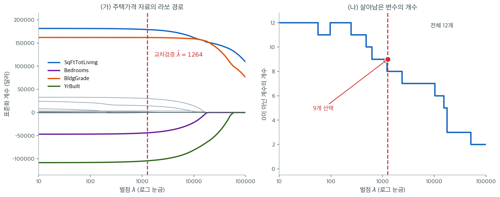

# 주택가격 자료의 라쏘 정칙화 경로

## 개요

이 절에서는 실제 주택 자료(King County 주택 매매 자료)에 라쏘 회귀를 적용하여, 영모형
($\hat{\beta} = 0$)에서 OLS 해까지 이어지는 정칙화 경로 전체를 추적한다. 교차검증으로 최적
$\lambda$를 고르고, OLS 및 능형회귀와 성능을 비교하며, 라쏘의 변수선택에서 어떤 주택 특성이
살아남는지 해석한다.

!!! note "자료 파일"
    아래 코드는 King County 주택 매매 자료(탭 구분 CSV)를 인터넷에서 직접 읽는다.
    13장의 주택 자료 보기와 같은 파일이므로 별도로 내려받아 둘 필요는 없지만,
    실행하려면 네트워크 연결이 필요하다.

---

## 1. 문제 설정

조정된 매매가를 주택 특성의 선형함수로 모형화한다.

$$
\text{AdjSalePrice} = \beta_0 + \beta_1 \cdot \text{SqFtTotLiving} + \beta_2 \cdot \text{SqFtLot} + \cdots + \varepsilon.
$$

설명변수에는 수치형 특성(연면적, 욕실 수, 건축연도)과 원-핫 부호화된 범주형 특성(부동산 유형)이
모두 포함된다. 적합 전에 모든 특성을 표준화한다.

---

## 2. 코드: 자료 적재와 준비

<div class="exbox" markdown>

**보기 1.** <span class="diff easy" title="쉬움"></span> 주택 자료와 표준화. 수치형 특성과 원-핫 부호화한 범주형 특성을 모아 설계행렬을 만들고 모든 열을 표준화한다.

**(1)** 열 $j$를 표준편차 $s_j$로 나누면 계수가 어떻게 바뀌는지 적고, 이로부터 **표준화하지 않은 자료에 $L_1$ 벌점을 걸면 실제로 무엇을 벌하게 되는지** 말하시오.

**(2)** 이 자료의 열 척도가 얼마나 다른지 재고, (1)의 관계가 수에서 성립하는지 확인하시오.

</div>

??? success "풀이"

    **(1) 해석적으로.** 표준화된 열을 $\tilde x_j = (x_j - \bar x_j)/s_j$라 하자. 같은 적합값을 두 가지로 쓸 수 있다.

    $$
    \sum_j x_j\beta_j + \beta_0
    = \sum_j \tilde x_j \tilde\beta_j + \tilde\beta_0,
    \qquad
    \tilde\beta_j = s_j\,\beta_j
    $$

    (평균을 뺀 몫은 절편이 흡수한다.) **표준화는 적합을 바꾸지 않고 계수의 단위만 바꾼다.** 원래 계수는 "원단위 1만큼 커질 때", 표준화 계수는 "표준편차 1만큼 커질 때"의 변화량이다.

    이제 벌점을 보자. 표준화된 좌표에서 거는 벌점은

    $$
    \lambda\sum_j \lvert\tilde\beta_j\rvert = \lambda\sum_j s_j\,\lvert\beta_j\rvert
    $$

    로, 원래 좌표에서 보면 **각 계수에 $s_j$라는 서로 다른 가중치**를 준 벌점이다. 뒤집어 말하면, 표준화하지 않고 $\lambda\sum_j\lvert\beta_j\rvert$를 걸면 가중치를 모두 1로 두는 셈인데, 이는 척도가 큰 변수(그래서 계수가 작은 변수)를 거의 벌하지 않고 척도가 작은 변수만 집중적으로 벌하는 것이 된다. **벌하는 대상이 변수의 중요도가 아니라 측정 단위다.**

    **(2) 수치적으로.**

    ```python
    import numpy as np
    import pandas as pd
    from sklearn.preprocessing import StandardScaler
    from sklearn.linear_model import LinearRegression, Lasso, LassoCV, Ridge, RidgeCV

    url = ("https://raw.githubusercontent.com/gedeck/"
           "practical-statistics-for-data-scientists/8a6d3bb6468e979c861d4b37215e1413702dfdfa/data/house_sales.csv")
    house = pd.read_csv(url, sep='\t')

    # 설명변수를 열한 개로 늘렸다. 범주형(PropertyType)이 섞여 있어 가변수로
    # 바꾸면 열 수가 더 늘어난다. 변수가 많을 때 라쏘가 어떻게 걸러 내는지 본다.
    predictors = [
        'SqFtTotLiving', 'SqFtLot', 'Bathrooms', 'Bedrooms',
        'BldgGrade', 'PropertyType', 'NbrLivingUnits',
        'SqFtFinBasement', 'YrBuilt', 'YrRenovated', 'NewConstruction'
    ]
    outcome = 'AdjSalePrice'

    X = pd.get_dummies(house[predictors], drop_first=True)
    X['NewConstruction'] = X['NewConstruction'].astype(int)
    y = house[outcome]

    # 벌점회귀에서 표준화는 필수다. 면적(수천 단위)과 욕실 수(한 자리)를
    # 그대로 두면 벌점이 면적 계수에만 사실상 걸리지 않는다.
    scaler = StandardScaler()
    X_scaled = pd.DataFrame(scaler.fit_transform(X), columns=X.columns)

    # --- 척도가 얼마나 다른지, 그리고 (1) 의 관계가 맞는지 확인한다 ---
    sd = X.astype(float).std(ddof=0)
    print(f"n = {len(y)},  가변수를 만든 뒤 p = {X.shape[1]}")
    print(f"열 표준편차: 가장 큰 SqFtLot {sd.max():,.1f},  가장 작은 "
          f"{sd.idxmin()} {sd.min():.4f}   (비 {sd.max() / sd.min():,.0f}배)")

    b_raw = LinearRegression().fit(X.astype(float), y).coef_
    b_std = LinearRegression().fit(X_scaled, y).coef_
    print(f"max |b_std - b_raw * sd| = {np.abs(b_std - b_raw * sd.values).max():.3e}")
    print(f"SqFtLot:  b_raw = {b_raw[1]:.4f},  sd = {sd.iloc[1]:,.1f},  "
          f"b_std = {b_std[1]:,.1f}")
    ```

    출력:

    ```
    n = 22687,  가변수를 만든 뒤 p = 12
    열 표준편차: 가장 큰 SqFtLot 29,015.4,  가장 작은 NbrLivingUnits 0.1597   (비 181,632배)
    max |b_std - b_raw * sd| = 1.607e-08
    SqFtLot:  b_raw = 0.0771,  sd = 29,015.4,  b_std = 2,236.1
    ```

    **$\tilde\beta_j = s_j\beta_j$가 $10^{-8}$ 수준까지 성립한다.** 두 적합이 같은 모형이라는 것이 이 한 줄로 확인되며, 표준화가 적합을 바꾸지 않는다는 (1)의 주장이 맞는다.

    척도의 차이가 극단적이다. 대지면적 `SqFtLot` 의 표준편차가 $29{,}015$ 제곱피트인 반면 `NbrLivingUnits` 는 $0.16$으로 **$18$만 배 차이**다. `SqFtLot` 의 원단위 계수는 $0.0771$달러/제곱피트에 지나지 않으므로, 표준화하지 않고 $\lambda\lVert\beta\rVert_1$을 걸면 이 변수는 **사실상 벌점을 받지 않는다.** 같은 벌점이 `NbrLivingUnits` 의 계수에는 $18$만 배 무겁게 걸린다. (1)에서 말한 "단위를 벌한다"가 이 수다.

    표준화 뒤에는 `SqFtLot` 의 계수가 $2{,}236$달러가 된다. **대지가 표준편차 하나만큼 넓어질 때 조정판매가가 $2{,}236$달러 오른다**는 뜻이며, 이제 다른 변수의 계수와 같은 자로 견줄 수 있다.

---

## 3. 코드: OLS 기준선

<div class="exbox" markdown>

**보기 2.** <span class="diff easy" title="쉬움"></span> 기준선 — 최소제곱. 표준화한 자료에 최소제곱을 적합하고 표본 내 RMSE와 $R^2$를 잰다.

**(1)** 절편을 포함한 모형에서 표본 내 RMSE와 $R^2$ 사이에 $\mathrm{RMSE} = \operatorname{sd}(y)\sqrt{1 - R^2}$가 성립함을 보이시오(단 $\operatorname{sd}$는 $n$으로 나눈 표준편차다). 이로부터 $R^2 = 0.59$가 예측오차로는 얼마인지 말하시오.

**(2)** 적합해 확인하고 가장 큰 계수 셋을 읽으시오.

</div>

??? success "풀이"

    **(1) 해석적으로.** 절편이 있는 최소제곱에서 잔차제곱합과 총제곱합을

    $$
    \mathrm{SSE} = \sum_i (y_i - \hat y_i)^2,
    \qquad
    \mathrm{SST} = \sum_i (y_i - \bar y)^2
    $$

    라 하면 정의에 따라 $R^2 = 1 - \mathrm{SSE}/\mathrm{SST}$이고

    $$
    \mathrm{RMSE} = \sqrt{\frac{\mathrm{SSE}}{n}},
    \qquad
    \operatorname{sd}(y) = \sqrt{\frac{\mathrm{SST}}{n}}
    $$

    이다. 첫 식에서 $\mathrm{SSE} = \mathrm{SST}(1-R^2)$이므로

    $$
    \mathrm{RMSE} = \sqrt{\frac{\mathrm{SST}(1-R^2)}{n}} = \operatorname{sd}(y)\sqrt{1-R^2}
    $$

    이다. **$R^2$와 RMSE는 같은 수를 두 가지 단위로 적은 것일 뿐**이고, 둘을 "서로 다른 두 증거"처럼 나란히 보고하는 것은 같은 말을 두 번 하는 것이다.

    $R^2 = 0.59$를 넣으면 $\sqrt{1-0.59} = 0.64$이므로 **예측오차가 반응의 표준편차의 $64\%$로 줄었다**는 뜻이 된다. $R^2$의 $59\%$라는 인상보다 훨씬 겸손한 숫자이며, 제곱 척도와 원 척도의 차이가 여기서 드러난다.

    **(2) 수치적으로.**

    ```python
    # 기준선이 될 최소제곱. 변수를 하나도 버리지 않으므로 계수가 전부 살아 있다.
    ols_model = LinearRegression().fit(X_scaled, y)
    ols_pred = ols_model.predict(X_scaled)

    from sklearn.metrics import mean_squared_error, r2_score, mean_absolute_error

    ols_rmse = np.sqrt(mean_squared_error(y, ols_pred))
    ols_r2 = r2_score(y, ols_pred)
    n_nonzero_ols = np.sum(np.abs(ols_model.coef_) > 1e-8)

    print(f"OLS: RMSE = {ols_rmse:,.1f},  R^2 = {ols_r2:.6f},  "
          f"0 이 아닌 계수 = {n_nonzero_ols}개")
    print(f"sd(y) = {y.std(ddof=0):,.1f}")
    print(f"sd(y) * sqrt(1 - R^2) = {y.std(ddof=0) * np.sqrt(1 - ols_r2):,.1f}  <-- RMSE 와 같아야 한다")
    print("계수 큰 차례 셋:")
    for j in np.argsort(-np.abs(ols_model.coef_))[:3]:
        print(f"  {X.columns[j]:16s} {ols_model.coef_[j]:>12,.1f}")
    ```

    출력:

    ```
    OLS: RMSE = 245,393.8,  R^2 = 0.594570,  0 이 아닌 계수 = 12개
    sd(y) = 385,394.4
    sd(y) * sqrt(1 - R^2) = 245,393.8  <-- RMSE 와 같아야 한다
    계수 큰 차례 셋:
      SqFtTotLiving       181,498.5
      BldgGrade           162,034.6
      YrBuilt            -108,345.8
    ```

    **항등식이 소수 첫째 자리까지 맞는다.** $385{,}394.4 \times \sqrt{1-0.594570} = 245{,}393.8$로 RMSE와 같다.

    그 값이 무엇을 뜻하는지 보라. **평균 예측오차가 $24.5$만 달러다.** 자료의 중위 판매가가 $47.1$만 달러이므로 오차가 집값의 절반 남짓이다. $R^2 = 0.59$는 그럴듯해 보이지만, 같은 사실을 달러로 적으면 이 모형으로 개별 주택 가격을 맞히는 일은 전혀 못 한다는 것이 드러난다. 위치 변수가 하나도 없기 때문이다.

    계수가 큰 셋은 거주면적, 건물등급, 건축연도다. 모두 표준화된 자료의 계수이므로 **"그 변수가 표준편차 하나만큼 커질 때 조정판매가가 몇 달러 오르는가"**로 읽는다. 최소제곱은 열두 계수를 하나도 0으로 만들지 않으며, 이것이 정칙화하지 않은 기준선이다.

---

## 4. 코드: 정칙화 경로

로그 등간격 $\lambda$ 100개에 대해 라쏘를 적합하고 각 계수의 변화를 추적한다.

<div class="exbox" markdown>

**보기 3.** <span class="diff easy" title="쉬움"></span> 라쏘 정칙화 경로. `alpha` 를 $10^2$에서 $10^{-2}$까지 100점으로 훑으며 계수를 기록한다.

**(1)** 이 자료에서 모든 계수를 0으로 만드는 가장 작은 벌점 $\lambda_{\max}$를 구하시오. 반응이 달러 단위임을 생각하면 그 크기가 얼마쯤일지 먼저 어림해 보시오.

**(2)** 위 격자가 그 $\lambda_{\max}$에 견주어 어디쯤인지 재고, 격자 위에서 변수가 몇 개나 살아남는지 확인하시오. 이 격자를 "정칙화 경로"라 부를 수 있는가.

</div>

??? success "풀이"

    **(1) 해석적으로.** $\beta = 0$이 라쏘의 해일 조건에서

    $$
    \lambda_{\max} = \max_j \frac{\lvert x_j^\top y\rvert}{n}
    $$

    이다. 열이 표준화되어 있으므로 $x_j^\top(y - \bar y)/n$은 $x_j$와 $y$의 **표본공분산**이고, 이는 $\operatorname{corr}(x_j, y)\cdot\operatorname{sd}(y)$와 같다. $\operatorname{sd}(y) = 38.5$만 달러이고 가장 강한 변수의 상관이 $0.7$ 언저리이므로

    $$
    \lambda_{\max} \approx 0.7 \times 385{,}000 \approx 2.7 \times 10^5
    $$

    로 어림된다. **반응이 달러이므로 벌점도 달러 단위로 커진다.** 벌점의 크기는 자료의 단위를 따라가며, $0.01$이나 $100$ 같은 수가 "작다/크다"를 뜻하지 않는다.

    **(2) 수치적으로.**

    ```python
    import matplotlib.pyplot as plt

    # alpha 를 큰 값에서 작은 값으로 훑으며 계수가 언제 살아나는지 기록한다.
    # sklearn 에서는 벌점 모수의 이름이 lambda 가 아니라 alpha 다.
    alphas = np.logspace(2, -2, 100)

    lasso_coefs = []
    for alpha in alphas:
        lasso = Lasso(alpha=alpha, max_iter=10000)
        lasso.fit(X_scaled, y)
        lasso_coefs.append(lasso.coef_)

    lasso_coefs = np.array(lasso_coefs)
    n_features_selected = (np.abs(lasso_coefs) > 1e-8).sum(axis=1)

    lam_max = np.abs(X_scaled.values.T @ (y.values - y.values.mean())) / len(y)
    print(f"이론 lambda_max = max_j |x_j'y|/n = {lam_max.max():,.1f}  "
          f"({X.columns[lam_max.argmax()]})")
    print(f"격자의 범위 = [{alphas.min():g}, {alphas.max():g}]  ->  lambda_max 의 "
          f"{alphas.max() / lam_max.max():.2e} 배까지만 간다")
    print(f"격자 위에서 살아남은 변수 개수의 범위 = "
          f"{n_features_selected.min()} ~ {n_features_selected.max()}  (p = {X.shape[1]})")
    ```

    출력:

    ```
    이론 lambda_max = max_j |x_j'y|/n = 267,905.8  (SqFtTotLiving)
    격자의 범위 = [0.01, 100]  ->  lambda_max 의 3.73e-04 배까지만 간다
    격자 위에서 살아남은 변수 개수의 범위 = 11 ~ 12  (p = 12)
    ```

    **어림이 맞았다.** $\lambda_{\max} = 267{,}906$으로 $2.7\times10^5$이고, 그 값을 달성하는 변수는 예상대로 `SqFtTotLiving` 이다.

    그런데 격자의 가장 큰 값 $100$은 $\lambda_{\max}$의 $3.7\times10^{-4}$배, 곧 **$2{,}679$분의 1**이다. 이 격자는 경로의 오른쪽 끄트머리, 사실상 벌점이 없는 구간만 훑는다. 그 증거가 바로 다음 줄이다. 격자 100점 전체에서 살아남은 변수가 $11$개 또는 $12$개이며, **변수선택이 거의 일어나지 않는다.**

    **그러므로 이 격자는 정칙화 경로가 아니다.** 아래 그림이 보여 주는 경로(가로축이 $10$에서 $10^5$까지)는 이 코드의 격자가 아니라 훨씬 넓은 격자로 그린 것이며, 경로를 제대로 보려면 $\lambda_{\max}$를 윗끝으로 잡고 그 $10^{-3}$배 정도까지 내려가는 격자를 써야 한다. 로그 격자의 윗끝을 $\lambda_{\max}$로 잡으라는 관례가 괜히 있는 것이 아니다.

---

## 5. 코드: 교차검증으로 람다 선택

<div class="exbox" markdown>

**보기 4.** <span class="diff easy" title="쉬움"></span> 교차검증으로 고른 라쏘. 보기 3의 격자를 `LassoCV` 에 그대로 넘겨 $5$-겹 교차검증으로 `alpha` 를 고르게 한다.

**(1)** 교차검증이 고른 값이 격자의 **끝**에 놓이면 무엇을 뜻하는가. 보기 3의 결과를 보고 어느 끝이 나올지 미리 말하시오.

**(2)** 실행해 확인하고, 그 라쏘와 최소제곱의 RMSE를 견주시오.

</div>

??? success "풀이"

    **(1) 해석적으로.** 교차검증 곡선의 최소가 격자 안쪽에 있으면 그 자리의 좌우에서 모두 오차가 커진다는 뜻이고, 그것이 정상이다. 반면 최소가 격자의 끝에서 잡히면 **곡선이 그 방향으로 아직 내려가는 중일 수 있다.** 격자가 최적점을 품지 못했다는 신호이므로, 할 일은 "그 값을 답으로 보고하는 것"이 아니라 **격자를 그쪽으로 넓히는 것**이다.

    보기 3에서 보았듯 이 격자의 윗끝 $100$조차 $\lambda_{\max}$의 $2{,}679$분의 1이다. 격자 전체가 벌점이 거의 없는 구간이고, 조금이라도 벌점이 있는 쪽이 나을 것이므로 **윗끝 $100$이 선택될 것**으로 예상된다.

    **(2) 수치적으로.**

    ```python
    # LassoCV 가 교차검증으로 alpha 를 스스로 고른다. 격자를 직접 주면
    # 그 안에서만 찾는다.
    lasso_cv = LassoCV(alphas=alphas, cv=5, random_state=42, max_iter=10000)
    lasso_cv.fit(X_scaled, y)

    lasso_pred = lasso_cv.predict(X_scaled)
    lasso_rmse = np.sqrt(mean_squared_error(y, lasso_pred))
    lasso_r2 = r2_score(y, lasso_pred)
    n_nonzero_lasso = np.sum(np.abs(lasso_cv.coef_) > 1e-8)

    print(f"교차검증이 고른 alpha = {lasso_cv.alpha_:g}  "
          f"(격자의 최댓값 {alphas.max():g} 과 같은가? {lasso_cv.alpha_ == alphas.max()})")
    print(f"라쏘: RMSE = {lasso_rmse:,.1f},  R^2 = {lasso_r2:.6f},  "
          f"0 이 아닌 계수 = {n_nonzero_lasso}개")
    print(f"OLS 와의 RMSE 차이 = {lasso_rmse - ols_rmse:,.1f}")
    ```

    출력:

    ```
    교차검증이 고른 alpha = 100  (격자의 최댓값 100 과 같은가? True)
    라쏘: RMSE = 245,395.3,  R^2 = 0.594565,  0 이 아닌 계수 = 11개
    OLS 와의 RMSE 차이 = 1.5
    ```

    **예상대로 격자의 윗끝이 그대로 답으로 나왔다.** 교차검증이 "$100$이 최적"이라고 말한 것이 아니라 "$100$까지 가 보았는데 아직 더 올라가는 쪽이 낫더라"고 말한 것이다. 여기서 멈추고 $\hat\lambda = 100$을 보고하면 안 된다.

    그 결과가 무엇인지는 RMSE가 말해 준다. 라쏘의 표본 내 RMSE $245{,}395.3$달러가 최소제곱의 $245{,}393.8$달러보다 **$1.5$달러** 클 뿐이다. 집값이 수십만 달러인 자료에서 $1.5$달러면 아무 일도 하지 않은 것과 같다. 변수 하나(`NbrLivingUnits`)가 0이 되었지만 그 계수는 원래도 $914$달러로 가장 작았다.

    **벌점을 걸었는데 아무 일도 일어나지 않았다면 벌점이 작은 것이다.** 이 쪽의 그림이 보여 주는 $\hat\lambda \approx 10^3$ 수준의 선택은 윗끝을 $10^5$까지 올린 격자에서 나온 것이며, 그 격자라야 변수선택이 실제로 일어난다.

---

## 6. 코드: 모형 비교

<div class="exbox" markdown>

**보기 5.** <span class="diff easy" title="쉬움"></span> 능형회귀와 견주기. 같은 자료에 능형을 적합하고 세 모형의 표본 내 RMSE를 나란히 놓는다.

**(1)** 능형이 고른 $\lambda$에서 **유효자유도** $\operatorname{df}(\lambda) = \sum_j d_j^2/(d_j^2+\lambda)$가 $p = 12$보다 얼마나 줄었을지 어림하시오.

**(2)** 세 RMSE를 견주어, 이 자료에서 정칙화가 예측에 쓸모가 있었는지 판정하시오.

</div>

??? success "풀이"

    **(1) 해석적으로.** 능형의 모자행렬 대각합이 유효자유도다(`reg_compare` 절의 보기 2에서 유도했다). 표준화한 $X$에서 $\sum_j d_j^2 = \operatorname{tr}(X^\top X) = np = 22{,}687 \times 12 \approx 2.7\times10^5$이므로, 특이값의 제곱은 평균적으로 $n = 22{,}687$ 크기다. 능형이 고르는 $\lambda$가 수백 수준이라면 $\lambda/d_j^2$가 $10^{-2}$ 언저리이고

    $$
    \operatorname{df}(\lambda) = \sum_j \frac{d_j^2}{d_j^2+\lambda} \approx 12 - \lambda\sum_j \frac{1}{d_j^2}
    $$

    에서 자유도는 $12$에서 **한 자리 미만**만 줄어들 것으로 어림된다. 공선성이 심해 아주 작은 $d_j$가 있다면 그 항 하나가 자유도를 크게 깎지만, 설명변수가 열둘뿐이고 $n$이 $2$만을 넘으므로 그럴 가능성은 낮다.

    **(2) 수치적으로.**

    ```python
    # 같은 자료에 능형회귀를 적용해 견준다. 능형은 계수를 0 으로 만들지
    # 못하므로 변수 수가 줄지 않는다. 예측력이 비슷하다면, 해석이 쉬운
    # 쪽을 고르는 것이 보통이다.
    ridge_cv = RidgeCV(alphas=np.logspace(-2, 5, 100), cv=5)
    ridge_cv.fit(X_scaled, y)

    ridge_pred = ridge_cv.predict(X_scaled)
    ridge_rmse = np.sqrt(mean_squared_error(y, ridge_pred))
    ridge_r2 = r2_score(y, ridge_pred)

    print(f"능형: alpha = {ridge_cv.alpha_:,.1f},  RMSE = {ridge_rmse:,.1f},  "
          f"R^2 = {ridge_r2:.6f}")
    d = np.linalg.svd(X_scaled.values, compute_uv=False)
    print(f"능형의 유효자유도 = {np.sum(d**2 / (d**2 + ridge_cv.alpha_)):.4f}  (p = 12)")
    print(f"세 RMSE: OLS {ols_rmse:,.1f} / 라쏘 {lasso_rmse:,.1f} / 능형 {ridge_rmse:,.1f}")
    print(f"가장 나쁜 것과 가장 좋은 것의 차이 = "
          f"{max(ols_rmse, lasso_rmse, ridge_rmse) - min(ols_rmse, lasso_rmse, ridge_rmse):,.1f} "
          f"({(max(ols_rmse, lasso_rmse, ridge_rmse) / min(ols_rmse, lasso_rmse, ridge_rmse) - 1) * 100:.3f}%)")
    ```

    출력:

    ```
    능형: alpha = 242.0,  RMSE = 245,429.2,  R^2 = 0.594453
    능형의 유효자유도 = 11.4669  (p = 12)
    세 RMSE: OLS 245,393.8 / 라쏘 245,395.3 / 능형 245,429.2
    가장 나쁜 것과 가장 좋은 것의 차이 = 35.4 (0.014%)
    ```

    **어림이 맞았다.** 능형이 고른 $\lambda = 242$에서 유효자유도가 $11.47$로 $12$에서 $0.53$만 줄었다. 계수는 열둘 모두 살아 있고 자유도로 세어도 거의 그대로다.

    세 RMSE의 차이가 $35.4$달러, 상대적으로 $0.014\%$다. **이 자료에서 정칙화는 예측에 아무 쓸모가 없다.** 까닭은 분명하다. $n = 22{,}687$에 $p = 12$라 $n/p$가 $1{,}890$이며, 최소제곱이 이미 충분히 안정적이다. 정칙화가 이득을 주는 자리는 $p$가 $n$에 가까울 때이지 이런 자료가 아니다.

    !!! warning "표본 내 RMSE로 세 모형을 견줄 수는 없다"
        위 세 값은 모두 훈련에 쓴 자료로 잰 것이다. 최소제곱은 선형모형 중 표본 내 제곱오차가 **항상 가장 작으므로** 여기서 1등인 것은 당연하고 아무 정보도 아니다. 세 방법을 정말로 견주려면 같은 겹 분할의 교차검증 오차를 보아야 하며, 연습문제 3이 그 이야기다. 다만 차이가 $0.014\%$라는 사실 자체는 어느 척도로 재든 바뀌기 어렵다.

---

## 7. 시각화

### 정칙화 경로 그림

왼쪽 패널은 $\log_{10}(\lambda)$에 대한 계수의 궤적을 그리고, 최적 $\lambda$ 위치에 세로
점선을 표시한다. 오른쪽 패널은 각 $\lambda$에서 활성(0이 아닌) 특성의 개수를 보여주어 모형
복잡도와 정칙화 사이의 절충을 드러낸다.



위 코드를 실제로 돌린 결과다. 가변수를 만들고 나면 설명변수가 12개이고, 표본은 $n = 22{,}687$이다. 왼쪽 세로축의 단위는 달러이며, 설명변수를 표준화했으므로 계수는 **"그 변수가 표준편차 하나만큼 커질 때 조정판매가가 몇 달러 오르는가"**로 읽는다.

$\lambda$가 아주 작은 왼쪽 끝에서 가장 큰 계수는 `SqFtTotLiving`($179{,}116$)과 `BldgGrade`($161{,}899$)다. 거주면적의 표준편차가 $914$ 제곱피트($85\text{m}^2$)이므로, 그만큼 넓은 집이 $18$만 달러 비싸다는 뜻이다. 자료의 중위 판매가가 $47$만 달러임을 생각하면 대단히 큰 효과다. 그다음이 `YrBuilt`($-104{,}361$)로 부호가 음수다. 같은 면적과 등급이라면 **오래된 집이 더 비싸다**는 이 결과는 위치 변수가 모형에 없기 때문에 나온다. 오래된 집이 시애틀 도심의 좋은 자리에 있는 것이다. 라쏘는 이런 혼선을 정리해 주지 않는다.

오른쪽 계단이 이 절의 핵심이다. $\lambda$를 $10$에서 $10^5$까지 키우면 살아남는 변수가 12개에서 2개로 줄어드는데, 마지막까지 버티는 둘이 바로 `SqFtTotLiving`과 `BldgGrade`다. **먼저 들어오고 늦게 나가는 변수가 강한 예측변수**라는 규칙을 눈으로 확인할 수 있다. 교차검증이 고른 $\hat\lambda = 1{,}264$(빨간 점선)에서는 9개가 남는다. 버려진 셋은 `YrRenovated`, `NewConstruction`, 그리고 가변수 `PropertyType_Single Family`로, 계수가 정확히 $0$이다.

여기서 주의할 점이 하나 있다. 계단이 왼쪽 구간에서 $12 \to 11 \to 12 \to 11$로 **한 번 되돌아간다.** 라쏘 경로에서 변수는 들어오기만 하는 것이 아니라 다시 나가기도 한다. 다른 변수가 활성집합에 들어오면서 그 역할을 대신할 수 있기 때문이며, 전진선택 같은 탐욕적 방법과 달리 라쏘가 이전 결정을 되돌릴 수 있다는 증거이기도 하다. "$\lambda$가 줄면 변수가 하나씩 들어온다"는 설명은 대체로 맞지만 예외가 있다.

### 교차검증 오차 그림

$\pm 1$ 표준편차 띠를 곁들인 CV RMSE 곡선은 U자 모양이다. 최소점이 편향과 분산의 균형을
맞추는 최적 $\lambda$를 알려 준다.

### 모형 비교 그림

OLS, 능형회귀, 라쏘의 RMSE와 $R^2$ 막대그림에서 다음을 볼 수 있다.

- 세 모형 모두 이 자료에서는 비슷한 $R^2$를 낸다.
- 라쏘는 더 적은 특성으로 비슷한 예측정확도를 달성한다.

---

## 8. 해석

주택 자료 분석에서 얻은 주요 결론은 다음과 같다.

- **변수선택.** 라쏘는 원래 특성 중 일부만 선택하고, 덜 중요한 예측변수(예: `YrRenovated`,
  `NbrLivingUnits`)의 계수를 0으로 만든다.
- **주요 예측변수.** `BldgGrade`(건물 등급)와 `SqFtTotLiving`(총 거주면적)이 대개 절댓값이 가장
  큰 계수를 가지며, 주택가격 예측에서의 중요성을 확인해 준다.
- **능형회귀 대 라쏘.** 능형회귀는 모든 특성을 연속적으로 축소하여 유지하고, 라쏘는 자동으로
  변수를 선택한다. 이 정도 크기의 자료에서는 예측정확도가 비슷하다.
- **실무적 이점.** 라쏘 모형이 더 해석하기 좋다. 13개가 넘는 작은 계수를 일일이 들여다보지
  않고도 어떤 특성이 가격 예측을 이끄는지 곧바로 알 수 있다.

!!! warning "표본 내 지표의 한계"
    위 코드는 훈련에 쓴 자료로 RMSE와 $R^2$를 계산한다. 표본 내 지표는 낙관적으로 편향되므로
    모형 비교의 근거로 삼기에는 부족하다. 연습문제 3에서 올바른 평가 전략을 다룬다.

---

## 연습문제

<div class="drillbox" markdown>

**연습문제 1.** <span class="diff med" title="중간"></span> 라쏘의 정칙화 경로는 왜 ($\lambda$의 함수로서) 조각별 선형인 반면 능형회귀의
경로는 매끄러운지 설명하라. 힌트: 각 방법의 KKT 조건을 생각해 보라.

</div>

??? success "풀이"

    **라쏘:** 라쏘의 KKT(하위기울기) 조건은

    $$
    -\frac{1}{n}X_j^\top(y - X\hat{\beta}) + \lambda s_j = 0, \quad s_j \in \partial|\hat{\beta}_j|
    $$

    이다. 활성집합 $\mathcal{A} = \{j : \hat{\beta}_j \ne 0\}$ 위에서는 부호
    $s_j = \text{sign}(\hat{\beta}_j)$가 고정된다. 그러면 활성 계수들은 $\lambda$에 대한
    선형계를 풀게 되므로, 변수가 활성집합에 들어오거나 빠지는 분기점 사이에서
    $\hat{\beta}_{\mathcal{A}}(\lambda)$는 $\lambda$의 일차함수다. 여기서 조각별 선형 구조가
    나온다.

    **능형회귀:** 닫힌 형태의 해
    $\hat{\beta}^{\text{ridge}} = (X^\top X + \lambda I)^{-1}X^\top y$는 $\lambda$의
    일차함수인 행렬의 역행렬이므로 $\lambda$의 유리함수이고, 모든 $\lambda > 0$에서 매끄럽다
    (무한히 미분가능하다). 어떤 변수도 정확히 0이 되지 않으므로 분기점 자체가 없다. $\square$

<div class="drillbox" markdown>

**연습문제 2.** <span class="diff med" title="중간"></span> 주택 자료에서 `BldgGrade`와 `SqFtTotLiving`은 상관되어 있을 가능성이 크다. 이런
상관이 있을 때 변수선택에 라쏘를 쓰는 경우와 엘라스틱넷을 쓰는 경우가 어떻게 다른지 논하라.

</div>

??? success "풀이"

    `BldgGrade`와 `SqFtTotLiving`이 강하게 상관되어 있으면 라쏘 해는 불안정하다. 자료가
    조금만 흔들려도 라쏘가 한 특성을 고르고 다른 특성을 버리는 결과가 뒤바뀔 수 있으며, 효과
    전체를 한 예측변수에 임의로 몰아줄 수도 있다.

    엘라스틱넷($0 < \alpha < 1$)은 그룹 성질을 갖는다. 강하게 상관된 두 예측변수가 모두 실제로
    관련 있다면 엘라스틱넷은 둘 다 포함하거나 둘 다 배제하는 경향이 있다. $L_2$ 성분이 해의
    유일성을 보장하고 계수 경로를 안정화하여 재현 가능한 변수선택을 낳는다.

    실무적으로는, 두 특성이 모두 중요하다는 배경지식이 있다면 엘라스틱넷이 낫다. 최대한의
    희소성이 목표이고 두 특성이 사실상 대체 가능하다면 라쏘가 하나만 고르는 것도 받아들일 만하다.
    $\square$

<div class="drillbox" markdown>

**연습문제 3.** <span class="diff med" title="중간"></span> 위 스크립트는 모형 비교에 표본 내 $R^2$와 RMSE를 쓴다. 이것이 왜 오도할 수
있는지 설명하고 더 나은 평가 전략을 제안하라.

</div>

??? success "풀이"

    표본 내 지표는 훈련에 쓴 바로 그 자료로 모형을 평가하므로 낙관적으로 편향된다. OLS는
    모수가 가장 많아 선형모형 중 표본 내 잔차제곱합이 항상 가장 작고 표본 내 $R^2$가 가장 높다.
    그래서 실제로는 과적합하고 있어도 정칙화 방법과 비슷하거나 더 나아 보인다.

    **더 나은 전략:** 교차검증 지표를 쓴다. 공정한 비교를 위해서는,

    1. 모든 방법에 같은 $K$-겹 분할을 쓴다.
    2. 각 겹 안에서 훈련 겹의 통계량만으로 표준화한다.
    3. 남겨 둔 겹에서 계산한 CV RMSE와 CV $R^2$를 보고한다.

    또는 모형 선택과 훈련에 전혀 쓰지 않는 고정된 검정자료(예: 20%)를 떼어 둔다. 검정자료의
    RMSE는 일반화 성능의 불편 추정치를 준다.

    많은 자료에서 정칙화 방법은 표본 내 지표가 다소 나쁘더라도 CV 지표에서는 OLS를 능가한다.
    $\square$

<div class="drillbox" markdown>

**연습문제 4.** <span class="diff med" title="중간"></span> 주택 자료에 $N(0,1)$에서 뽑은, 반응변수와 아무 관계 없는 잡음 특성 50개를
추가한다고 하자. 라쏘의 최적 $\lambda$와 선택되는 특성 개수는 어떻게 바뀔 것으로 예상되는가?
실험을 수행하고 결과를 보고하라.

</div>

??? success "풀이"

    ```python
    import numpy as np
    import pandas as pd
    from sklearn.linear_model import LassoCV
    from sklearn.preprocessing import StandardScaler

    np.random.seed(42)
    # 앞에서 만든 주택 자료의 X_scaled 와 y 를 그대로 쓴다

    # 잡음 변수 50개를 덧붙인다
    noise = np.random.randn(len(y), 50)
    noise_cols = [f'noise_{i}' for i in range(50)]
    X_aug = pd.concat([X_scaled.reset_index(drop=True),
                       pd.DataFrame(noise, columns=noise_cols)], axis=1)

    lasso_aug = LassoCV(n_alphas=100, cv=5, max_iter=10000)
    lasso_aug.fit(X_aug, y)

    n_nz = np.sum(np.abs(lasso_aug.coef_) > 1e-8)
    noise_selected = np.sum(np.abs(lasso_aug.coef_[-50:]) > 1e-8)

    print(f"Optimal lambda: {lasso_aug.alpha_:.4f}")
    print(f"Total nonzero:  {n_nz}")
    print(f"Noise features selected: {noise_selected}/50")
    ```

    출력:

    ```
    Optimal lambda: 1890.0223
    Total nonzero:  19
    Noise features selected: 11/50
    ```

    **예상 결과:** 잡음 차원을 상쇄하기 위해 더 강한 정칙화가 필요하므로 최적 $\lambda$는
    커진다. 라쏘는 잡음 특성 50개의 대부분 또는 전부를 0으로 만들면서 실제로 예측력이 있는
    주택 특성은 유지해야 한다. 다만 몇 개의 잡음 특성은 통과할 수 있다(위양성). 이 자료는
    $n$이 $p$보다 훨씬 크므로 위양성이 많지는 않겠지만, $p$가 $n$에 가까워질수록 늘어난다.
    $\square$

<div class="drillbox" markdown>

**연습문제 5.** <span class="diff med" title="중간"></span> 라그랑주 모수 $\lambda$와, 동치인 제약형
$\min \|y - X\beta\|_2^2$ subject to $\|\beta\|_1 \le t$의 제약 경계 $t$ 사이의 관계를
유도하라. 구체적으로 $\lambda > 0$과 $t \in (0, \|\hat{\beta}^{\text{OLS}}\|_1)$ 사이에 일대일
감소 대응이 있음을 보여라.

</div>

??? success "풀이"

    라쏘의 벌점형 문제와 제약형 문제는 라그랑주 쌍대성으로 연결된다.
    $f(t) = \min_{\|\beta\|_1 \le t} \|y - X\beta\|_2^2$라 하자. ($X$가 완전계수라는 가정
    아래) $\|y - X\beta\|_2^2$는 $\beta$에 대해 강볼록이고 제약 $\|\beta\|_1 \le t$는
    볼록이므로, KKT 조건에 의해 모수 $\lambda$의 벌점형 해는 어떤 $t(\lambda)$의 제약형 해와
    일치한다.

    KKT의 상보여유 조건 $\lambda(\|\hat{\beta}\|_1 - t) = 0$에 의해, $\lambda > 0$이면 제약이
    활성이다. 즉 $\|\hat{\beta}\|_1 = t$이다.

    $\lambda$가 커지면 벌점이 계수를 더 강하게 축소하므로 $\|\hat{\beta}(\lambda)\|_1$은
    감소한다. $t(\lambda) = \|\hat{\beta}(\lambda)\|_1$이므로 $t$는 $\lambda$의 감소함수다.

    - $\lambda = 0$일 때 $t = \|\hat{\beta}^{\text{OLS}}\|_1$.
    - $\lambda \to \infty$일 때 $t \to 0$.

    대응이 일대일인 근거는 라쏘 경로가 연속이고 $\|\hat{\beta}(\lambda)\|_1$이 $\lambda$에 대해
    (해가 0이 되기 전까지) 강감소한다는 데 있다.

    !!! warning "흔한 오해"
        $\|\hat{\beta}(\lambda)\|_1$은 $\lambda$에 대해 단조 비증가지만, **개별 계수의 절댓값은
        단조가 아니다.** 어떤 변수가 활성집합에 새로 들어오면 다른 변수의 계수가 오히려
        커지기도 한다. 그러므로 위 논증은 $L_1$ 노름 전체에 대해서만 성립하며, 좌표별 축소의
        단조성을 주장해서는 안 된다.
    $\square$

---

## 정리하며

실제 자료에서 **경로 전체**를 추적했다.

- **영모형에서 OLS 까지 이어진다.** $\lambda$ 를 크게 잡으면 모든 계수가 $0$ 이고, $0$ 으로 줄이면 OLS 해에 수렴한다. **하나의 모수가 두 극단을 잇는다.**
- **경로를 로그 척도로 그린다.** $\lambda$ 가 여러 자릿수에 걸쳐 있으므로 로그축이 아니면 구조가 보이지 않는다.
- **교차검증 곡선이 U 자를 그린다.** 최소점이 `lambda_min` 이고, **1-표준오차 규칙**으로 조금 더 단순한 모형을 고르는 것이 흔한 관행이다.
- **어느 변수가 먼저 들어오는지가 정보다.** 경로의 왼쪽에서 일찍 $0$ 을 벗어나는 변수가 반응과 가장 강하게 연관된 것이며, 변수 중요도의 한 읽기다.
- **실제 자료는 공선성이 많다.** 면적과 방 수처럼 상관된 변수들이 있으면 라쏘의 선택이 불안정해진다.

다음 절 **엘라스틱넷 보기**로 넘어간다.
