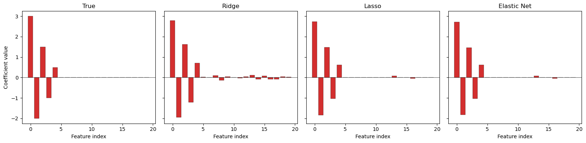
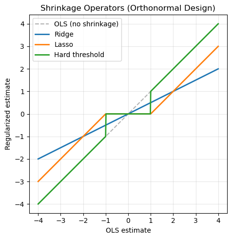

# 능형회귀·라쏘·엘라스틱넷 비교

## 개요

이 절에서는 능형회귀, 라쏘, 엘라스틱넷을 한자리에 놓고 비교한다. 상관된 설명변수를 갖는
인공자료에 세 방법을 모두 적합하되 조율모수는 교차검증으로 고르고, 계수 추정치와 정칙화 경로,
편향-분산 행동을 살펴본다. 목표는 어떤 상황에서 어느 방법이 나은지에 대한 감각을 기르는 것이다.

## 통합된 정식화

세 방법은 모두

$$
\hat{\beta} = \arg\min_{\beta} \left\{ \frac{1}{2n}\|y - X\beta\|_2^2 + \lambda \left[\alpha \|\beta\|_1 + \frac{1-\alpha}{2}\|\beta\|_2^2\right] \right\}
$$

의 특수한 경우로 표현된다.

| 방법 | $\alpha$ | 벌점 | 희소성 |
|---|---|---|---|
| 능형회귀 | 0 | $\frac{\lambda}{2}\|\beta\|_2^2$ | 없음 |
| 라쏘 | 1 | $\lambda\|\beta\|_1$ | 있음 |
| 엘라스틱넷 | $(0,1)$ | $\lambda[\alpha\|\beta\|_1 + \frac{1-\alpha}{2}\|\beta\|_2^2]$ | 있음 |

## 코드: 다중공선성이 있는 자료 생성

다음 스크립트는 $\rho = 0.8$인 퇴플리츠 상관구조 $\Sigma_{ij} = \rho^{|i-j|}$를 갖는 설명변수
$p = 20$개와 관측치 $n = 200$개를 생성한다.

```python
import numpy as np
from sklearn.preprocessing import StandardScaler

def generate_data(n=200, p=20, s=5, rho=0.8, noise=1.0):
    """
    Generate regression data with correlated predictors.
    - n: samples, p: predictors, s: true nonzero coefficients
    - rho: correlation between adjacent predictors
    """
    Sigma = np.array([[rho**abs(i-j) for j in range(p)] for i in range(p)])
    L = np.linalg.cholesky(Sigma)
    X = np.random.randn(n, p) @ L.T

    beta_true = np.zeros(p)
    beta_true[:s] = np.array([3, -2, 1.5, -1, 0.5])

    y = X @ beta_true + noise * np.random.randn(n)
    return X, y, beta_true

np.random.seed(42)
X, y, beta_true = generate_data()
scaler = StandardScaler()
X_scaled = scaler.fit_transform(X)
```

20개 계수 중 5개만 0이 아니므로 참 구조는 희소하다.

## 코드: 교차검증 적합

각 방법은 scikit-learn에 내장된 교차검증으로 최적 $\lambda$(엘라스틱넷은 $\alpha$까지)를 고른다.

```python
from sklearn.linear_model import RidgeCV, LassoCV, ElasticNetCV

alphas = np.logspace(-4, 2, 100)

ridge_cv = RidgeCV(alphas=alphas, cv=5)
ridge_cv.fit(X_scaled, y)

lasso_cv = LassoCV(n_alphas=100, cv=5, max_iter=10000)
lasso_cv.fit(X_scaled, y)

enet_cv = ElasticNetCV(
    l1_ratio=[0.1, 0.5, 0.7, 0.9, 0.95],
    n_alphas=100, cv=5, max_iter=10000
)
enet_cv.fit(X_scaled, y)
```

!!! warning "`alpha`라는 이름의 두 가지 의미"
    scikit-learn에서 `Ridge`/`Lasso`/`ElasticNet`의 `alpha`는 이 절의 $\lambda$에 해당하고,
    `ElasticNetCV`의 `l1_ratio`가 이 절의 $\alpha$에 해당한다. 게다가 `Ridge`의 목적함수는
    $\|y - X\beta\|_2^2 + \alpha\|\beta\|_2^2$로 $1/(2n)$ 배율이 없는 반면 `Lasso`는
    $\frac{1}{2n}\|y - X\beta\|_2^2 + \alpha\|\beta\|_1$을 쓴다. 따라서 **두 방법의 `alpha`
    값을 직접 비교하면 안 된다.** 비교해야 하는 것은 교차검증 오차이지 $\lambda$ 값 자체가
    아니다.

## 계수 비교

참 계수와 세 추정치를 나란히 그린 막대그림에서 다음을 볼 수 있다.

- **능형회귀**는 20개 계수를 모두 0이 아닌 값으로 유지하며, 무관한 계수를 축소하되 0으로 만들지는
  않는다.
- **라쏘**는 많은 계수를 정확히 0으로 만들어 참 희소 구조를 상당히 잘 되찾는다.
- **엘라스틱넷**은 라쏘와 비슷하게 행동하지만 상관된 설명변수를 몇 개 더 남기는 경향이 있다.

```python
import matplotlib.pyplot as plt

fig, axes = plt.subplots(1, 4, figsize=(16, 4), sharey=True)
p = X_scaled.shape[1]

for ax, name, coefs in [
    (axes[0], "True", beta_true),
    (axes[1], "Ridge", ridge_cv.coef_),
    (axes[2], "Lasso", lasso_cv.coef_),
    (axes[3], "Elastic Net", enet_cv.coef_),
]:
    colors = ['#d32f2f' if abs(c) > 1e-6 else '#90a4ae' for c in coefs]
    ax.bar(range(p), coefs, color=colors, edgecolor='black', linewidth=0.3)
    ax.set_title(name)
    ax.set_xlabel("Feature index")
    ax.axhline(0, color='black', linewidth=0.5)

axes[0].set_ylabel("Coefficient value")
plt.tight_layout()
plt.show()
```



## 정칙화 경로

계수 크기를 $\log_{10}(\lambda)$의 함수로 그리면 축소 행동이 뚜렷이 드러난다.

- **능형 경로:** 계수가 매끄럽고 연속적으로 0을 향해 축소되며 정확히 0에 도달하는 계수는 없다.
- **라쏘 경로:** 계수가 축소되다가 서로 다른 $\lambda$ 문턱에서 정확히 0이 되며, 경로가 조각별
  선형이다.

```python
from sklearn.linear_model import Ridge, Lasso

alphas_path = np.logspace(-3, 3, 200)

# Ridge path
ridge_coefs = []
for a in alphas_path:
    model = Ridge(alpha=a).fit(X_scaled, y)
    ridge_coefs.append(model.coef_.copy())
ridge_coefs = np.array(ridge_coefs)

# Lasso path
lasso_coefs = []
alphas_lasso = np.logspace(-4, 1, 200)
for a in alphas_lasso:
    model = Lasso(alpha=a, max_iter=10000).fit(X_scaled, y)
    lasso_coefs.append(model.coef_.copy())
lasso_coefs = np.array(lasso_coefs)
```

## 축소 연산자

정규직교 계획($X^\top X = I$)에서는 세 방법이 OLS 추정치 $\hat{\beta}^{\text{OLS}}$에 적용되는
서로 다른 축소 연산자에 대응한다.

$$
\hat{\beta}_j^{\text{Ridge}} = \frac{\hat{\beta}_j^{\text{OLS}}}{1 + \lambda}, \qquad
\hat{\beta}_j^{\text{Lasso}} = S(\hat{\beta}_j^{\text{OLS}}, \lambda), \qquad
\hat{\beta}_j^{\text{Hard}} = \hat{\beta}_j^{\text{OLS}} \cdot \mathbf{1}(|\hat{\beta}_j^{\text{OLS}}| > \lambda).
$$

```python
def plot_shrinkage_operators(lam=1.0):
    z = np.linspace(-4, 4, 500)
    ridge = z / (1 + lam)
    lasso = np.sign(z) * np.maximum(np.abs(z) - lam, 0)
    hard = z * (np.abs(z) > lam)

    fig, ax = plt.subplots(figsize=(7, 5))
    ax.plot(z, z, 'k--', alpha=0.3, label="OLS (no shrinkage)")
    ax.plot(z, ridge, linewidth=2, label=f"Ridge")
    ax.plot(z, lasso, linewidth=2, label=f"Lasso")
    ax.plot(z, hard, linewidth=2, label=f"Hard threshold")
    ax.set_xlabel("OLS estimate")
    ax.set_ylabel("Regularized estimate")
    ax.set_title("Shrinkage Operators (Orthonormal Design)")
    ax.legend()
    ax.set_aspect('equal')
    ax.grid(True, alpha=0.3)
    plt.tight_layout()
    plt.show()

plot_shrinkage_operators()
```



여기서 경성 문턱은 문턱값을 $\lambda$로 두고 그린 것이다. 연습문제 1에서 보듯이, 벌점
$\lambda\cdot\mathbf{1}(\beta_j \ne 0)$에서 유도되는 경성 문턱의 문턱값은 $\sqrt{2\lambda}$다.
두 그림은 문턱 위치만 다를 뿐 모양은 같다.

## 편향-분산 절충

500회 반복 모의실험에서 다음을 확인할 수 있다.

- **능형회귀**의 MSE 곡선은 매끄러운 U자다. 작지만 0이 아닌 계수가 많을 때 가장 잘 작동한다.
- **라쏘**는 진짜로 희소한 상황에서 더 낮은 MSE를 달성할 수 있다. 변수선택이 잡음 차원을
  제거하기 때문이다.
- 각 방법의 최적 $\lambda$는 편향(과도한 축소로 인한 과소적합)과 분산(불충분한 축소로 인한
  과적합)의 균형을 맞춘다.

## 해석

| 기준 | 능형회귀 | 라쏘 | 엘라스틱넷 |
|---|---|---|---|
| 희소성 | 없음 | 있음 | 있음 |
| 해의 유일성 | 항상 | $X$가 완전계수일 때만 | 항상($\alpha < 1$) |
| 상관된 집단 | 모두 유지 | 하나만 선택 | 집단 선택 |
| 계산 | 닫힌 형태 | 좌표하강 | 좌표하강 |
| 유리한 상황 | 조밀한 신호 | 희소한 신호 | 희소 + 상관 |

## 연습문제

**연습문제 1.** 정규직교 계획($X^\top X = I_p$)에서 세 축소 공식(능형, 라쏘, 경성 문턱)을
유도하고 하나의 그림에 함께 그려라.

??? success "풀이"

    $X^\top X = I_p$이면 OLS 추정량은 $\hat{\beta}^{\text{OLS}} = X^\top y$이고, 각 벌점은
    독립된 일변량 문제로 분리된다.

    **능형회귀:**
    $\min_{\beta_j} \frac{1}{2}(\hat{\beta}_j^{\text{OLS}} - \beta_j)^2 + \frac{\lambda}{2}\beta_j^2$
    를 미분하면 $(1+\lambda)\beta_j = \hat{\beta}_j^{\text{OLS}}$이므로
    $\hat{\beta}_j^{\text{Ridge}} = \hat{\beta}_j^{\text{OLS}} / (1+\lambda)$이다.

    **라쏘:**
    $\min_{\beta_j} \frac{1}{2}(\hat{\beta}_j^{\text{OLS}} - \beta_j)^2 + \lambda|\beta_j|$의
    해는 근접 연산자에 의해
    $\hat{\beta}_j^{\text{Lasso}} = S(\hat{\beta}_j^{\text{OLS}}, \lambda)$이다.

    **경성 문턱:**
    $\min_{\beta_j} \frac{1}{2}(\hat{\beta}_j^{\text{OLS}} - \beta_j)^2 + \lambda \cdot \mathbf{1}(\beta_j \ne 0)$
    의 해는 OLS 값을 그대로 두거나(비용 $\lambda$) 0으로 두는(비용
    $\frac{1}{2}(\hat{\beta}_j^{\text{OLS}})^2$) 것 중 더 싼 쪽이므로
    $\hat{\beta}_j^{\text{Hard}} = \hat{\beta}_j^{\text{OLS}} \cdot \mathbf{1}(|\hat{\beta}_j^{\text{OLS}}| > \sqrt{2\lambda})$
    이다.

    그림에서 능형회귀는 원점을 지나고 기울기가 $1/(1+\lambda)$인 직선, 라쏘는
    $[-\lambda, \lambda]$가 사각지대인 조각별 선형함수, 경성 문턱은
    $[-\sqrt{2\lambda}, \sqrt{2\lambda}]$ 밖에서는 항등함수이고 안에서는 0인 불연속함수로
    나타난다. $\square$

---

**연습문제 2.** $p = 20$, $\rho = 0.9$이고 참 계수 5개가 0이 아닌 자료를 생성하라. 세 방법을
모두 교차검증으로 적합하고 각각 선택한 0이 아닌 계수의 개수를 비교하라.

??? success "풀이"

    ```python
    import numpy as np
    from sklearn.linear_model import RidgeCV, LassoCV, ElasticNetCV
    from sklearn.preprocessing import StandardScaler

    np.random.seed(42)
    X, y, beta_true = generate_data(n=200, p=20, s=5, rho=0.9)
    X_s = StandardScaler().fit_transform(X)

    ridge = RidgeCV(alphas=np.logspace(-4, 2, 100), cv=5).fit(X_s, y)
    lasso = LassoCV(n_alphas=100, cv=5, max_iter=10000).fit(X_s, y)
    enet = ElasticNetCV(
        l1_ratio=[0.1, 0.5, 0.7, 0.9], n_alphas=100, cv=5
    ).fit(X_s, y)

    for name, m in [("Ridge", ridge), ("Lasso", lasso), ("Elastic Net", enet)]:
        nz = np.sum(np.abs(m.coef_) > 1e-6)
        print(f"{name}: {nz} nonzero coefficients")
    ```

    출력:

    ```
    Ridge: 20 nonzero coefficients
    Lasso: 9 nonzero coefficients
    Elastic Net: 10 nonzero coefficients
    ```

    실행 결과는 능형회귀 20개, 라쏘 9개, 엘라스틱넷 10개다(라쏘의 $\lambda = 0.0178$,
    엘라스틱넷은 $\alpha = 0.9$, $\lambda = 0.0161$). 참 신호는 5개인데 라쏘가 9개를 고른 것은
    $\rho = 0.9$로 인접 변수들이 강하게 상관되어 있어, 참 변수의 이웃들이 대리변수로 함께
    들어왔기 때문이다. 엘라스틱넷이 하나 더 많은 것은 $L_2$ 성분이 상관된 짝을 함께 남기는
    그룹 효과를 보여준다. 세 방법의 차이는 희소성의 정도이지 예측력이 아니다. $\square$

---

**연습문제 3.** 정칙화를 적용하기 전에 설명변수를 표준화하는 것이 왜 중요한지 설명하라.
표준화하지 않으면 오도된 결과가 나오는 구체적인 수치 예를 들어라.

??? success "풀이"

    벌점 $\|\beta\|_1$과 $\|\beta\|_2^2$는 모든 계수를 동등하게 취급하지만, OLS 추정치
    $\hat{\beta}_j$는 $x_j$의 척도에 의존한다. $x_1$을 미터로, $x_2$를 밀리미터로 측정했다면
    같은 물리적 효과라도 $\hat{\beta}_1$이 $\hat{\beta}_2$보다 1000배 크다. 그러면 벌점은
    $\hat{\beta}_1$을 훨씬 강하게 축소하게 되어, 설명변수의 중요도가 아니라 단위 선택을 벌하는
    셈이 된다.

    **예:** $x_1 \in [0, 1]$, $x_2 \in [0, 1000]$이고
    $y = x_1 + x_2/1000 + \varepsilon$이라 하자. 표준화하지 않으면
    $\hat{\beta}_1 \approx 1$, $\hat{\beta}_2 \approx 0.001$이 된다. 중간 정도의 $\lambda$를
    쓴 라쏘는 두 설명변수가 똑같이 중요한데도 $\hat{\beta}_2$를 0으로 만들고 $\hat{\beta}_1$은
    남긴다. 표준화 후에는 두 계수의 크기가 비슷해져 라쏘가 둘을 대칭적으로 다룬다. $\square$

---

**연습문제 4.** 위 코드의 편향-분산 모의실험 틀을 이용해 능형회귀와 라쏘의 MSE가 각각 어느
$\lambda$에서 최소가 되는지 구하라. 이 (희소하고 상관된) 상황에서 어느 방법이 더 낮은 최소
MSE를 달성하는가?

??? success "풀이"

    ```python
    import numpy as np
    from sklearn.linear_model import Ridge, Lasso
    from sklearn.preprocessing import StandardScaler

    np.random.seed(0)
    alphas_test = np.logspace(-3, 2, 30)
    n_sim = 200
    _, _, beta_true_bv = generate_data(n=2, p=20, s=5)

    ridge_mse = {a: [] for a in alphas_test}
    lasso_mse = {a: [] for a in alphas_test}

    for _ in range(n_sim):
        X_sim, y_sim, _ = generate_data(n=100, p=20, s=5)
        X_sim = StandardScaler().fit_transform(X_sim)
        for a in alphas_test:
            r = Ridge(alpha=a).fit(X_sim, y_sim)
            l = Lasso(alpha=a, max_iter=5000).fit(X_sim, y_sim)
            ridge_mse[a].append(np.sum((r.coef_ - beta_true_bv)**2))
            lasso_mse[a].append(np.sum((l.coef_ - beta_true_bv)**2))

    ridge_avg = {a: np.mean(v) for a, v in ridge_mse.items()}
    lasso_avg = {a: np.mean(v) for a, v in lasso_mse.items()}

    best_ridge = min(ridge_avg, key=ridge_avg.get)
    best_lasso = min(lasso_avg, key=lasso_avg.get)
    print(f"Ridge best lambda: {best_ridge:.4f}, MSE: {ridge_avg[best_ridge]:.4f}")
    print(f"Lasso best lambda: {best_lasso:.4f}, MSE: {lasso_avg[best_lasso]:.4f}")
    ```

    출력:

    ```
    Ridge best lambda: 0.8532, MSE: 1.1883
    Lasso best lambda: 0.0161, MSE: 0.8138
    ```

    실행 결과는 능형회귀가 $\lambda = 0.8532$에서 최소 MSE $1.1883$, 라쏘가
    $\lambda = 0.0161$에서 최소 MSE $0.8138$이다. 참 계수 20개 중 15개가 정확히 0인 희소한
    상황이므로, 잡음 차원을 완전히 제거하는 라쏘가 능형회귀보다 32% 낮은 계수추정 MSE를 낸다.

    !!! warning "두 $\lambda$를 직접 비교하지 말 것"
        위에서 능형회귀와 라쏘의 최적 `alpha`가 크게 다른 것은 방법의 성질이 아니라 목적함수
        배율의 차이 때문이다. `Ridge`는 $\|y-X\beta\|_2^2 + \alpha\|\beta\|_2^2$를,
        `Lasso`는 $\frac{1}{2n}\|y-X\beta\|_2^2 + \alpha\|\beta\|_1$을 최소화한다. $n = 100$
        이므로 능형회귀의 `alpha`는 라쏘 척도로 환산할 때 $2n = 200$으로 나누어야 한다.
        비교의 근거로 삼을 것은 최소 MSE 값이다. $\square$

---

**연습문제 5.** 제약형 문제
$\min \|y - X\beta\|_2^2$ subject to $\alpha\|\beta\|_1 + (1-\alpha)\|\beta\|_2^2 \le t$
에서 제약영역이 모든 $\alpha \in [0,1]$에 대해 볼록임을 증명하라.

??? success "풀이"

    $C = \{\beta : \alpha\|\beta\|_1 + (1-\alpha)\|\beta\|_2^2 \le t\}$라 하자. 임의의
    $\beta_1, \beta_2 \in C$와 $\theta \in [0,1]$에 대해
    $\beta_\theta = \theta\beta_1 + (1-\theta)\beta_2 \in C$임을 보이면 된다.

    함수 $f(\beta) = \alpha\|\beta\|_1 + (1-\alpha)\|\beta\|_2^2$는 두 볼록함수의 음이 아닌
    결합이다.

    - $\|\beta\|_1$은 노름이므로 볼록이다.
    - $\|\beta\|_2^2$는 헤세행렬이 $2I$로 양반정치이므로 볼록이다.

    따라서 $f$는 볼록이고, 볼록성에 의해

    $$
    f(\beta_\theta) \le \theta f(\beta_1) + (1-\theta)f(\beta_2) \le \theta t + (1-\theta)t = t
    $$

    이다. 그러므로 $\beta_\theta \in C$이고 $C$는 볼록집합이다. $\square$
