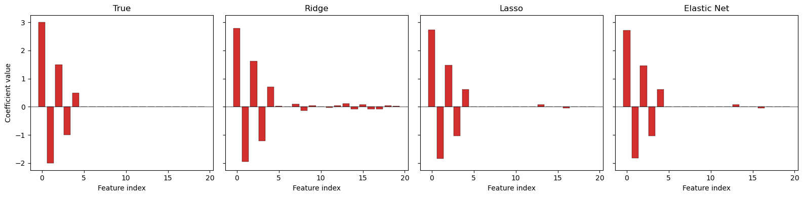
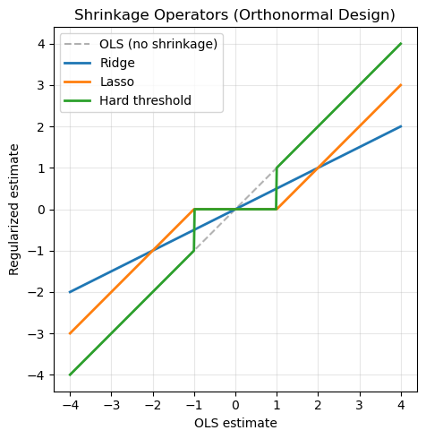

# 능형회귀·라쏘·엘라스틱넷 비교

## 개요

이 절에서는 능형회귀, 라쏘, 엘라스틱넷을 한자리에 놓고 비교한다. 상관된 설명변수를 갖는
인공자료에 세 방법을 모두 적합하되 조율모수는 교차검증으로 고르고, 계수 추정치와 정칙화 경로,
편향-분산 행동을 살펴본다. 목표는 어떤 상황에서 어느 방법이 나은지에 대한 감각을 기르는 것이다.

## 통합된 정식화

세 방법은 모두

$$
\hat{\beta} = \arg\min_{\beta} \left\{ \frac{1}{2n}\|y - X\beta\|_2^2 + \lambda \left[\alpha \|\beta\|_1 + \frac{1-\alpha}{2}\|\beta\|_2^2\right] \right\}
$$

의 특수한 경우로 표현된다.

| 방법 | $\alpha$ | 벌점 | 희소성 |
|---|---|---|---|
| 능형회귀 | 0 | $\frac{\lambda}{2}\|\beta\|_2^2$ | 없음 |
| 라쏘 | 1 | $\lambda\|\beta\|_1$ | 있음 |
| 엘라스틱넷 | $(0,1)$ | $\lambda[\alpha\|\beta\|_1 + \frac{1-\alpha}{2}\|\beta\|_2^2]$ | 있음 |

## 코드: 다중공선성이 있는 자료 생성

다음 스크립트는 $\rho = 0.8$인 퇴플리츠 상관구조 $\Sigma_{ij} = \rho^{|i-j|}$를 갖는 설명변수
$p = 20$개와 관측치 $n = 200$개를 생성한다.

<div class="exbox" markdown>

**보기 1.** <span class="diff easy" title="쉬움"></span> 상관된 설명변수 자료 만들기. 독립인 표준정규 행벡터 $z$에 퇴플리츠 행렬 $\Sigma_{ij} = \rho^{\lvert i-j\rvert}$의 콜레스키 인수 $L$($\Sigma = LL^\top$)을 붙여 $x = Lz$로 설명변수를 만든다. $p = 20$, $\rho = 0.8$이고 참 계수는 $\beta = (3, -2, 1.5, -1, 0.5, 0, \dots, 0)$, 잡음은 $N(0,1)$이다.

**(1)** 이렇게 만든 $x$의 공분산이 정말 $\Sigma$임을 보이고, 신호의 분산 $\beta^\top\Sigma\beta$와 모형이 설명할 수 있는 최대 비율(이론적 $R^2$)을 구하시오.

**(2)** $n = 200$으로 한 번 뽑은 자료에서 표본상관과 $\operatorname{Var}(y)$가 (1)의 값과 맞는지 확인하시오.

</div>

??? success "풀이"

    **(1) 해석적으로.** $z$의 성분이 독립이고 분산이 1이므로 $E[zz^\top] = I_p$다. 따라서

    $$
    \operatorname{Cov}(x) = E[Lz(Lz)^\top] = L\,E[zz^\top]\,L^\top = LL^\top = \Sigma
    $$

    이다. 콜레스키 인수가 하는 일은 이것뿐이다. **독립인 잡음에 원하는 상관을 입힌다.** 이웃한 변수의 상관은 $\rho = 0.8$, 두 칸 떨어지면 $\rho^2 = 0.64$, 세 칸이면 $\rho^3 = 0.512$로 지수적으로 줄어든다.

    신호의 분산은 이차형식이다. $\beta$가 앞 다섯 자리에만 값을 가지므로 $5 \times 5$ 블록만 계산하면 된다.

    $$
    \beta^\top\Sigma\beta = \sum_i \beta_i^2 + 2\sum_{i<j} \beta_i\beta_j\,\rho^{\,j-i}
    $$

    첫 항은 $9 + 4 + 2.25 + 1 + 0.25 = 16.5$다. 둘째 항은 간격별로 묶는다.

    | 간격 | $\sum \beta_i\beta_j$ | $\rho^{\,\text{간격}}$ | 곱 |
    |---:|---:|---:|---:|
    | 1 | $-6-3-1.5-0.5 = -11$ | $0.8$ | $-8.8$ |
    | 2 | $4.5+2+0.75 = 7.25$ | $0.64$ | $4.64$ |
    | 3 | $-3-1 = -4$ | $0.512$ | $-2.048$ |
    | 4 | $1.5$ | $0.4096$ | $0.6144$ |

    합이 $-5.5936$이고 두 배 하면 $-11.1872$이므로

    $$
    \beta^\top\Sigma\beta = 16.5 - 11.1872 = 5.3128
    $$

    이다. **부호가 번갈아 가는 계수와 양의 상관이 만나 신호가 깎였다.** 계수제곱합이 $16.5$인데 실제 신호분산은 그 3분의 1에 못 미친다. 잡음분산이 1이므로

    $$
    \operatorname{Var}(y) = 5.3128 + 1 = 6.3128,
    \qquad
    R^2_{\max} = \frac{5.3128}{6.3128} = 0.8416
    $$

    이다. 어떤 방법을 쓰더라도 이 자료에서 설명할 수 있는 몫은 $84\%$가 한계다.

    **(2) 수치적으로.**

    ```python
    import numpy as np
    from sklearn.preprocessing import StandardScaler

    def generate_data(n=200, p=20, s=5, rho=0.8, noise=1.0):
        """서로 상관된 설명변수를 갖는 회귀자료를 만든다.

        이웃한 변수끼리 rho, 두 칸 떨어지면 rho^2 로 상관이 줄어드는 구조다.
        콜레스키 분해로 독립 정규에 이 상관을 입힌다. 세 벌점회귀가 갈리는
        곳이 바로 이런 상관 구조에서다.

        n: 관측 수, p: 변수 수, s: 참으로 0 이 아닌 계수의 수
        rho: 이웃한 변수 사이의 상관
        """
        Sigma = np.array([[rho**abs(i-j) for j in range(p)] for i in range(p)])
        L = np.linalg.cholesky(Sigma)
        X = np.random.randn(n, p) @ L.T

        beta_true = np.zeros(p)
        beta_true[:s] = np.array([3, -2, 1.5, -1, 0.5])

        y = X @ beta_true + noise * np.random.randn(n)
        return X, y, beta_true

    np.random.seed(42)
    X, y, beta_true = generate_data()
    scaler = StandardScaler()
    X_scaled = scaler.fit_transform(X)

    # --- 유도한 값이 맞는지 확인한다 ---
    rho, p = 0.8, 20
    Sigma = np.array([[rho**abs(i-j) for j in range(p)] for i in range(p)])

    R = np.corrcoef(X, rowvar=False)
    for lag in (1, 2, 3):
        emp = np.mean([R[i, i+lag] for i in range(p - lag)])
        print(f"상관 lag {lag}:  이론 {rho**lag:.4f}   표본평균 {emp:.4f}")

    sig2 = beta_true @ Sigma @ beta_true
    print(f"신호분산 b'Sb = {sig2:.4f},   Var(y) 이론 = {sig2 + 1:.4f},  표본 = {y.var(ddof=1):.4f}")
    print(f"이론 R^2 = {sig2 / (sig2 + 1):.4f}")
    ```

    출력:

    ```
    상관 lag 1:  이론 0.8000   표본평균 0.7943
    상관 lag 2:  이론 0.6400   표본평균 0.6348
    상관 lag 3:  이론 0.5120   표본평균 0.5093
    신호분산 b'Sb = 5.3128,   Var(y) 이론 = 6.3128,  표본 = 6.1189
    이론 R^2 = 0.8416
    ```

    세 간격의 표본상관 $0.7943$, $0.6348$, $0.5093$이 이론값 $0.8$, $0.64$, $0.512$와 맞는다. 상관계수 하나의 표준오차가 대략 $(1-\rho^2)/\sqrt n = 0.36/\sqrt{200} = 0.025$이므로 어긋남 $0.006$은 몬테카를로 오차 안이다.

    $\beta^\top\Sigma\beta$가 코드에서도 정확히 $5.3128$로 나와 손계산과 맞는다. 표본분산은 $6.1189$로 이론값 $6.3128$보다 조금 작은데, $n = 200$에서 분산의 표준오차가 $\operatorname{Var}(y)\sqrt{2/(n-1)} = 0.63$이므로 $0.19$의 차이는 역시 설명된다.

20개 계수 중 5개만 0이 아니므로 참 구조는 희소하다.

## 코드: 교차검증 적합

각 방법은 scikit-learn에 내장된 교차검증으로 최적 $\lambda$(엘라스틱넷은 $\alpha$까지)를 고른다.

<div class="exbox" markdown>

**보기 2.** <span class="diff easy" title="쉬움"></span> 세 방법을 교차검증으로 적합. 보기 1의 자료에 능형·라쏘·엘라스틱넷을 적합하되 벌점은 모두 $5$-겹 교차검증으로 고른다.

**(1)** 능형 해 $\hat\beta = (X^\top X + \lambda I)^{-1}X^\top y$를 쓰면 유효자유도가 $\operatorname{df}(\lambda) = \sum_j d_j^2/(d_j^2+\lambda)$임을 보이고, 이 값이 $\lambda = 0$과 $\lambda \to \infty$에서 각각 얼마가 되는지 말하시오.

**(2)** 세 방법이 고른 벌점과 살아남은 계수의 개수를 구하고, 능형이 고른 `alpha` 를 라쏘의 `alpha` 와 **직접 견주어서는 안 되는** 까닭을 수로 보이시오.

</div>

??? success "풀이"

    **(1) 해석적으로.** $X$의 특이값분해를 $X = UDV^\top$($D = \operatorname{diag}(d_1,\dots,d_p)$)라 하면

    $$
    X(X^\top X + \lambda I)^{-1}X^\top
    = UD(D^2+\lambda I)^{-1}DU^\top
    = U\operatorname{diag}\!\left(\frac{d_j^2}{d_j^2+\lambda}\right)U^\top
    $$

    이다. 적합값을 만드는 이 행렬이 능형의 모자행렬이고, 그 대각합이 유효자유도다.

    $$
    \operatorname{df}(\lambda) = \operatorname{tr}\!\left[X(X^\top X+\lambda I)^{-1}X^\top\right]
    = \sum_{j=1}^p \frac{d_j^2}{d_j^2+\lambda}
    $$

    $\lambda = 0$이면 항마다 1이 되어 $\operatorname{df}(0) = p$로 최소제곱과 같고, $\lambda \to \infty$이면 모든 항이 0으로 가서 $\operatorname{df} \to 0$이다. **벌점이 모수의 개수를 연속적으로 줄인다.** 능형은 계수를 하나도 버리지 않지만 자유도는 확실히 줄어든다는 것이 요점이고, 이 식은 0장 모자행렬의 대각합과 같은 구조다.

    **(2) 수치적으로.** 배율 문제가 먼저다. scikit-learn의 `Ridge` 는 $\|y-X\beta\|_2^2 + \alpha\|\beta\|_2^2$를, `Lasso` 는 $\frac{1}{2n}\|y-X\beta\|_2^2 + \alpha\|\beta\|_1$을 최소화한다. 잔차항의 배율이 $2n$배 다르므로 능형의 `alpha` 를 라쏘 척도로 옮기려면 $2n = 400$으로 나누어야 한다.

    ```python
    from sklearn.linear_model import RidgeCV, LassoCV, ElasticNetCV

    # 세 방법 모두 교차검증으로 벌점을 고른다. 엘라스틱넷은 벌점의 세기와
    # 배합비(l1_ratio) 둘을 함께 골라야 하므로 격자가 2차원이 된다.
    alphas = np.logspace(-4, 2, 100)

    ridge_cv = RidgeCV(alphas=alphas, cv=5)
    ridge_cv.fit(X_scaled, y)

    lasso_cv = LassoCV(n_alphas=100, cv=5, max_iter=10000)
    lasso_cv.fit(X_scaled, y)

    enet_cv = ElasticNetCV(
        l1_ratio=[0.1, 0.5, 0.7, 0.9, 0.95],
        n_alphas=100, cv=5, max_iter=10000
    )
    enet_cv.fit(X_scaled, y)

    for name, m in [("Ridge", ridge_cv), ("Lasso", lasso_cv), ("ElasticNet", enet_cv)]:
        nz = np.sum(np.abs(m.coef_) > 1e-6)
        err = np.sum((m.coef_ - beta_true) ** 2)
        print(f"{name:11s} alpha={m.alpha_:.4f}  0이 아닌 계수 {nz:2d}개  "
              f"||b-b_true||^2 = {err:.4f}")
    print(f"엘라스틱넷이 고른 l1_ratio = {enet_cv.l1_ratio_}")
    print(f"능형의 alpha 를 라쏘 척도로 = {ridge_cv.alpha_ / (2 * len(y)):.6f}")

    # 능형은 닫힌 꼴이 있다. 직접 풀어 sklearn 과 맞춰 본다.
    beta_cf = np.linalg.solve(X_scaled.T @ X_scaled + ridge_cv.alpha_ * np.eye(20),
                              X_scaled.T @ (y - y.mean()))
    print(f"닫힌 꼴과 sklearn 능형 계수의 최대 차이 = {np.abs(beta_cf - ridge_cv.coef_).max():.2e}")
    d = np.linalg.svd(X_scaled, compute_uv=False)
    print(f"유효자유도 df(lambda) = {np.sum(d**2 / (d**2 + ridge_cv.alpha_)):.4f}  (p = 20)")
    ```

    출력:

    ```
    Ridge       alpha=0.7565  0이 아닌 계수 20개  ||b-b_true||^2 = 0.2300
    Lasso       alpha=0.0240  0이 아닌 계수  8개  ||b-b_true||^2 = 0.1178
    ElasticNet  alpha=0.0253  0이 아닌 계수  8개  ||b-b_true||^2 = 0.1323
    엘라스틱넷이 고른 l1_ratio = 0.95
    능형의 alpha 를 라쏘 척도로 = 0.001891
    닫힌 꼴과 sklearn 능형 계수의 최대 차이 = 2.66e-15
    유효자유도 df(lambda) = 19.6479  (p = 20)
    ```

    **닫힌 꼴이 소수점 열다섯째 자리까지 맞는다.** 능형에는 반복 알고리즘이 필요 없다는 것이 이 한 줄로 확인된다.

    유효자유도는 $19.6479$다. 계수가 20개 모두 살아 있지만 자유도로 세면 $20$이 아니라 $19.65$이고, 교차검증이 고른 벌점이 이만큼 약하다는 뜻이다. 상관이 강해 작은 특이값이 있었다면 같은 $\lambda$에서도 자유도가 훨씬 많이 깎였을 것이다.

    `alpha` 비교의 함정이 수로 드러난다. 겉보기에는 능형 $0.7565$가 라쏘 $0.0240$의 서른 배처럼 보이지만, 라쏘 척도로 환산한 능형의 벌점은 $0.0019$로 오히려 라쏘의 $8$분의 1이다. **두 숫자는 애초에 같은 단위가 아니다.** 비교해야 할 것은 벌점값이 아니라 교차검증 오차이고, 여기서는 계수추정 오차 $\|\hat\beta - \beta\|^2$가 라쏘 $0.1178$, 엘라스틱넷 $0.1323$, 능형 $0.2300$으로 희소한 참 구조를 반영한다.

!!! warning "`alpha`라는 이름의 두 가지 의미"
    scikit-learn에서 `Ridge`/`Lasso`/`ElasticNet`의 `alpha`는 이 절의 $\lambda$에 해당하고,
    `ElasticNetCV`의 `l1_ratio`가 이 절의 $\alpha$에 해당한다. 게다가 `Ridge`의 목적함수는
    $\|y - X\beta\|_2^2 + \alpha\|\beta\|_2^2$로 $1/(2n)$ 배율이 없는 반면 `Lasso`는
    $\frac{1}{2n}\|y - X\beta\|_2^2 + \alpha\|\beta\|_1$을 쓴다. 따라서 **두 방법의 `alpha`
    값을 직접 비교하면 안 된다.** 비교해야 하는 것은 교차검증 오차이지 $\lambda$ 값 자체가
    아니다.

## 계수 비교

참 계수와 세 추정치를 나란히 그린 막대그림에서 다음을 볼 수 있다.

- **능형회귀**는 20개 계수를 모두 0이 아닌 값으로 유지하며, 무관한 계수를 축소하되 0으로 만들지는
  않는다.
- **라쏘**는 많은 계수를 정확히 0으로 만들어 참 희소 구조를 상당히 잘 되찾는다.
- **엘라스틱넷**은 라쏘와 비슷하게 행동하지만 상관된 설명변수를 몇 개 더 남기는 경향이 있다.

<div class="exbox" markdown>

**보기 3.** <span class="diff easy" title="쉬움"></span> 계수를 나란히 그리기. 참 계수와 세 추정치를 네 칸에 나란히 그리시오. 그림에서 세 방법의 성격 차이로 무엇을 읽어 낼 수 있는가. 또 이 그림이 **보여 주지 못하는 것**은 무엇인가.

</div>

??? success "풀이"

    **유도할 답은 없다.** 그려서 읽는 것이 전부인 보기이므로, 그림에서 실제로 읽히는 것을 수와 함께 적는다.

    ```python
    import matplotlib.pyplot as plt

    # 참 계수와 세 방법의 계수를 나란히 그린다. 0 이 아닌 계수를 붉게 칠해
    # 어느 방법이 몇 개를 살렸는지 한눈에 보이게 한다. 능형은 회색 막대가
    # 하나도 없을 것이다 — 정확히 0 이 되지 못하기 때문이다.
    fig, axes = plt.subplots(1, 4, figsize=(16, 4), sharey=True)
    p = X_scaled.shape[1]

    for ax, name, coefs in [
        (axes[0], "True", beta_true),
        (axes[1], "Ridge", ridge_cv.coef_),
        (axes[2], "Lasso", lasso_cv.coef_),
        (axes[3], "Elastic Net", enet_cv.coef_),
    ]:
        colors = ['#d32f2f' if abs(c) > 1e-6 else '#90a4ae' for c in coefs]
        ax.bar(range(p), coefs, color=colors, edgecolor='black', linewidth=0.3)
        ax.set_title(name)
        ax.set_xlabel("Feature index")
        ax.axhline(0, color='black', linewidth=0.5)

    axes[0].set_ylabel("Coefficient value")
    plt.tight_layout()
    plt.show()

    for name, coefs in [("True", beta_true), ("Ridge", ridge_cv.coef_),
                        ("Lasso", lasso_cv.coef_), ("ElasticNet", enet_cv.coef_)]:
        nz = np.where(np.abs(coefs) > 1e-6)[0]
        print(f"{name:11s} 0이 아닌 자리 {list(nz)}")
        print(f"{'':11s}  앞 다섯 계수 {np.round(coefs[:5], 3)}")
    ```

    출력:

    ```
    True        0이 아닌 자리 [0, 1, 2, 3, 4]
                 앞 다섯 계수 [ 3.  -2.   1.5 -1.   0.5]
    Ridge       0이 아닌 자리 [0, 1, 2, 3, 4, 5, 6, 7, 8, 9, 10, 11, 12, 13, 14, 15, 16, 17, 18, 19]
                 앞 다섯 계수 [ 2.791 -1.942  1.628 -1.21   0.705]
    Lasso       0이 아닌 자리 [0, 1, 2, 3, 4, 6, 13, 16]
                 앞 다섯 계수 [ 2.737 -1.849  1.486 -1.038  0.626]
    ElasticNet  0이 아닌 자리 [0, 1, 2, 3, 4, 6, 13, 16]
                 앞 다섯 계수 [ 2.722 -1.827  1.468 -1.026  0.621]
    ```

    

    **읽을 것 셋.**

    첫째, **능형 칸만 오른쪽 절반에 잔물결이 남아 있다.** 자리 5번부터 19번까지 참값이 모두 0인데 능형은 $-0.136$에서 $0.123$ 사이의 작은 값을 열다섯 개 모두 붙여 놓았다. 라쏘와 엘라스틱넷 칸의 같은 구간은 바닥이 평평하다. 이것이 $L_2$와 $L_1$의 차이를 눈으로 보는 가장 짧은 방법이다.

    둘째, **라쏘가 남긴 세 개의 거짓 양성**이 자리 6, 13, 16에 있다. 계수는 각각 $0.010$, $0.080$, $-0.042$로 참 신호 중 가장 작은 $0.5$에 견주어도 한참 작다. 참 변수의 이웃이 상관 $\rho = 0.8$로 끌려 들어온 것이고, 이 자료의 희소성 회복은 완벽하지 않다.

    셋째, **라쏘는 살아남은 계수도 참값보다 작게 준다.** $3 \to 2.737$, $-2 \to -1.849$로 모두 0 쪽으로 밀려 있다. 연성 문턱화가 크기와 무관하게 $\lambda$만큼 깎기 때문이고, 능형의 $2.791$보다도 작다. **변수를 고르는 대가로 남은 계수에 편향이 생긴다.**

    **이 그림이 가리는 것.** 막대그림은 계수 하나하나의 **불확실성**을 전혀 보이지 않는다. 자리 13의 $0.080$이 자료를 다시 뽑아도 살아남을지 이 그림만으로는 알 수 없다. 또 이것은 **표본 하나의 결과**이므로 "라쏘가 8개를 고른다"가 아니라 "이 표본에서 8개를 골랐다"로 읽어야 한다.

    !!! note "엘라스틱넷이 라쏘와 같은 집합을 골랐다"
        본문은 엘라스틱넷이 상관된 설명변수를 몇 개 더 남기는 경향이 있다고 적었으나, 이 표본에서는 **둘이 똑같은 8개**를 골랐다. 교차검증이 `l1_ratio = 0.95` 를 택해 벌점의 95%가 $L_1$이었기 때문이다. 그룹 효과는 $\alpha$가 작을 때 뚜렷해지며, 연습문제 2의 $\rho = 0.9$ 자료에서는 엘라스틱넷이 하나를 더 남긴다.

## 정칙화 경로

계수 크기를 $\log_{10}(\lambda)$의 함수로 그리면 축소 행동이 뚜렷이 드러난다.

- **능형 경로:** 계수가 매끄럽고 연속적으로 0을 향해 축소되며 정확히 0에 도달하는 계수는 없다.
- **라쏘 경로:** 계수가 축소되다가 서로 다른 $\lambda$ 문턱에서 정확히 0이 되며, 경로가 조각별
  선형이다.

<div class="exbox" markdown>

**보기 4.** <span class="diff easy" title="쉬움"></span> 능형과 라쏘의 경로. 벌점을 넓은 구간에서 훑으며 계수가 어떻게 변하는지 기록한다.

**(1)** 라쏘의 모든 계수가 정확히 0이 되는 가장 작은 벌점 $\lambda_{\max}$를 하위기울기 조건에서 유도하시오. 능형에는 그런 $\lambda$가 있는가.

**(2)** 격자로 훑은 경로와 LARS가 준 정확한 꺾임점에서 (1)의 $\lambda_{\max}$를 확인하시오.

</div>

??? success "풀이"

    **(1) 해석적으로.** 라쏘의 목적함수 $\frac{1}{2n}\|y-X\beta\|_2^2 + \lambda\|\beta\|_1$가 $\beta = 0$에서 최솟값을 가질 조건을 쓴다. $\lvert\beta_j\rvert$는 0에서 미분할 수 없으므로 하위기울기를 쓰며, $\partial\lvert\beta_j\rvert\big|_{\beta_j=0} = [-1, 1]$이다. 최적성 조건은

    $$
    -\frac{1}{n}x_j^\top(y - X\cdot 0) + \lambda s_j = 0,
    \qquad s_j \in [-1, 1]
    $$

    이고, 이는 모든 $j$에 대해 $\lvert x_j^\top y\rvert / n \le \lambda$라는 뜻이다. 따라서

    $$
    \lambda_{\max} = \max_j \frac{\lvert x_j^\top y\rvert}{n}
    $$

    이고, $\lambda \ge \lambda_{\max}$이면 해가 정확히 영벡터다. **처음 들어오는 변수는 반응과 상관이 가장 큰 변수**이며, 그 변수가 들어오는 자리가 바로 $\lambda_{\max}$다.

    능형에는 그런 문턱이 없다. 해가 $(X^\top X + \lambda I)^{-1}X^\top y$로 $\lambda$의 유리함수여서 $X^\top y \ne 0$인 한 어떤 유한한 $\lambda$에서도 0이 되지 않는다. $\lambda \to \infty$에서 0으로 **다가갈** 뿐이다.

    **(2) 수치적으로.**

    ```python
    from sklearn.linear_model import Ridge, Lasso

    alphas_path = np.logspace(-3, 3, 200)

    # 능형 경로: 계수가 부드럽게 0 으로 다가가되 닿지는 않는다.
    ridge_coefs = []
    for a in alphas_path:
        model = Ridge(alpha=a).fit(X_scaled, y)
        ridge_coefs.append(model.coef_.copy())
    ridge_coefs = np.array(ridge_coefs)

    # 라쏘 경로: 계수가 하나씩 0 에 닿아 그대로 머문다. 두 그림의 이 차이가
    # 곧 변수 선택을 하느냐 못 하느냐의 차이다.
    lasso_coefs = []
    alphas_lasso = np.logspace(-4, 1, 200)
    for a in alphas_lasso:
        model = Lasso(alpha=a, max_iter=10000).fit(X_scaled, y)
        lasso_coefs.append(model.coef_.copy())
    lasso_coefs = np.array(lasso_coefs)

    print(f"능형 경로에서 계수가 정확히 0 인 횟수 = {(ridge_coefs == 0).sum()}")
    print(f"능형 경로의 |계수| 최솟값 = {np.abs(ridge_coefs).min():.3e}  (0 이 아니다)")

    n_nz = (np.abs(lasso_coefs) > 1e-8).sum(axis=1)
    print(f"라쏘 경로의 0 아닌 계수 개수: {n_nz[0]} (alpha=1e-4) -> {n_nz[-1]} (alpha=10)")

    lam_max = np.abs(X_scaled.T @ (y - y.mean())).max() / len(y)
    print(f"이론 lambda_max = max_j |x_j'y|/n = {lam_max:.4f}")
    print(f"격자에서 모든 계수가 0 이 된 가장 작은 alpha = "
          f"{alphas_lasso[np.where(n_nz == 0)[0][0]]:.4f}")

    # LARS 는 꺾임점을 격자 없이 정확히 찾아 준다.
    from sklearn.linear_model import lars_path
    knots, _, _ = lars_path(X_scaled, y - y.mean(), method='lasso')
    print(f"LARS 가 찾은 꺾임점 {len(knots)}개, 가장 큰 것 = {knots[0]:.4f}")
    ```

    출력:

    ```
    능형 경로에서 계수가 정확히 0 인 횟수 = 0
    능형 경로의 |계수| 최솟값 = 9.924e-05  (0 이 아니다)
    라쏘 경로의 0 아닌 계수 개수: 20 (alpha=1e-4) -> 0 (alpha=10)
    이론 lambda_max = max_j |x_j'y|/n = 1.9458
    격자에서 모든 계수가 0 이 된 가장 작은 alpha = 1.9792
    LARS 가 찾은 꺾임점 23개, 가장 큰 것 = 1.9458
    ```

    **LARS가 준 가장 큰 꺾임점 $1.9458$이 유도한 $\lambda_{\max} = \max_j\lvert x_j^\top y\rvert/n$과 소수 넷째 자리까지 같다.** 격자가 준 $1.9792$는 조금 크지만, 이는 유도가 틀려서가 아니라 로그 격자 200점의 간격이 $10^{5/199} = 1.059$배여서 $1.9458$ 바로 위 격자점이 $1.9792$이기 때문이다. **해석적으로 푼 답은 정확하고, 격자는 격자만큼만 정확하다.**

    능형 쪽은 $\alpha = 10^3$까지 밀어붙여도 정확히 0이 된 계수가 하나도 없다. 가장 작은 절댓값이 $9.9\times10^{-5}$로 0에 가깝지만 0은 아니다. **이 한 줄이 "능형은 변수선택을 못 한다"는 말의 전부다.**

    꺾임점이 23개라는 것도 읽어 둘 만하다. 변수가 20개뿐이니 한 번에 하나씩 들어오기만 했다면 $\lambda_{\max}$와 $0$을 포함해 21개여야 한다. 실제 활성집합의 크기를 세어 보면 $0,1,2,\dots,19,19,19,20$으로 **19에서 세 번 머문다.** 변수가 하나 들어오는 동안 다른 하나가 빠졌다는 뜻이고, 라쏘 경로가 단조로운 전진선택이 아니라는 증거다.

## 축소 연산자

정규직교 계획($X^\top X = I$)에서는 세 방법이 OLS 추정치 $\hat{\beta}^{\text{OLS}}$에 적용되는
서로 다른 축소 연산자에 대응한다.

$$
\hat{\beta}_j^{\text{Ridge}} = \frac{\hat{\beta}_j^{\text{OLS}}}{1 + \lambda}, \qquad
\hat{\beta}_j^{\text{Lasso}} = S(\hat{\beta}_j^{\text{OLS}}, \lambda), \qquad
\hat{\beta}_j^{\text{Hard}} = \hat{\beta}_j^{\text{OLS}} \cdot \mathbf{1}(|\hat{\beta}_j^{\text{OLS}}| > \lambda).
$$

<div class="exbox" markdown>

**보기 5.** <span class="diff easy" title="쉬움"></span> 축소 연산자 그리기. 위 세 식을 $\lambda = 1$에서 한 그림에 그린다.

**(1)** 최소제곱 추정값이 $2.5$, $0.6$, $-3.0$일 때 세 연산자가 각각 무엇을 돌려주는지 손으로 계산하시오.

**(2)** 그림을 그려 (1)을 확인하고, 세 곡선의 모양에서 각 방법의 편향이 어떻게 다른지 읽으시오.

</div>

??? success "풀이"

    **(1) 해석적으로.** $\lambda = 1$을 세 식에 그대로 넣는다.

    능형은 $z/(1+\lambda) = z/2$이므로 $2.5 \mapsto 1.25$, $0.6 \mapsto 0.3$, $-3 \mapsto -1.5$다. **크기와 무관하게 절반으로 줄인다.**

    라쏘는 연성 문턱화 $\operatorname{sign}(z)(\lvert z\rvert - 1)_+$다. $2.5 \mapsto 1.5$, $-3 \mapsto -2$로 $1$씩 깎이고, $0.6$은 $\lvert z\rvert < \lambda$이므로 $0$이 된다.

    경성 문턱은 $z\cdot\mathbf 1(\lvert z\rvert > 1)$이므로 $2.5 \mapsto 2.5$, $-3 \mapsto -3$으로 **그대로 두거나** $0.6 \mapsto 0$으로 **통째로 버린다.**

    여기서 세 방법의 편향이 갈린다. $\lvert z\rvert$가 클 때 능형의 편향은 $z/2$로 **$z$에 비례해 커지고**, 라쏘의 편향은 $1$로 **일정하며**, 경성 문턱의 편향은 $0$이다. 큰 계수를 다치지 않게 하는 순서는 경성 문턱, 라쏘, 능형이다. 대신 경성 문턱은 $z = \pm 1$에서 $1$만큼 **뛴다.** 불연속이라는 대가를 치르는 것이며, 자료가 조금만 흔들려도 추정값이 널뛴다.

    **(2) 수치적으로.**

    ```python
    def plot_shrinkage_operators(lam=1.0):
        """정규직교 설계에서 세 축소 연산자가 최소제곱 추정값을 어떻게 바꾸는지 그린다.

        설계행렬이 정규직교이면 세 방법의 해가 최소제곱 추정값의 간단한 함수로
        나온다. 능형은 일정 비율로 줄이고(직선), 라쏘는 일정 크기만큼 깎아
        작은 값은 0 으로 보내며(꺾인 직선), 경성 문턱은 문턱 아래를 통째로
        0 으로 만든다(계단).
        """
        z = np.linspace(-4, 4, 500)
        ridge = z / (1 + lam)
        lasso = np.sign(z) * np.maximum(np.abs(z) - lam, 0)
        hard = z * (np.abs(z) > lam)

        fig, ax = plt.subplots(figsize=(7, 5))
        ax.plot(z, z, 'k--', alpha=0.3, label="OLS (no shrinkage)")
        ax.plot(z, ridge, linewidth=2, label=f"Ridge")
        ax.plot(z, lasso, linewidth=2, label=f"Lasso")
        ax.plot(z, hard, linewidth=2, label=f"Hard threshold")
        ax.set_xlabel("OLS estimate")
        ax.set_ylabel("Regularized estimate")
        ax.set_title("Shrinkage Operators (Orthonormal Design)")
        ax.legend()
        ax.set_aspect('equal')
        ax.grid(True, alpha=0.3)
        plt.tight_layout()
        plt.show()

    plot_shrinkage_operators()

    # (1) 에서 손으로 계산한 세 값을 그대로 확인한다.
    def shrink(z, lam=1.0):
        return (z / (1 + lam),
                np.sign(z) * np.maximum(np.abs(z) - lam, 0),
                z * (np.abs(z) > lam))

    for z0 in (2.5, 0.6, -3.0):
        r, l, h = shrink(np.array(z0))
        print(f"OLS {z0:+.1f}  ->  능형 {r:+.3f}   라쏘 {l:+.3f}   경성 {h:+.3f}")
    ```

    출력:

    ```
    OLS +2.5  ->  능형 +1.250   라쏘 +1.500   경성 +2.500
    OLS +0.6  ->  능형 +0.300   라쏘 +0.000   경성 +0.000
    OLS -3.0  ->  능형 -1.500   라쏘 -2.000   경성 -3.000
    ```

    

    아홉 개 값이 (1)의 손계산과 모두 맞는다.

    그림에서 읽을 것은 **세 곡선이 대각선(축소 없음)에서 떨어지는 방식**이다. 능형은 기울기 $1/2$인 직선이라 오른쪽으로 갈수록 대각선에서 **점점 멀어진다.** 라쏘는 대각선과 평행한 직선이라 벌어진 폭이 어디서나 $1$로 **일정하다.** 경성 문턱은 $\lvert z\rvert > 1$에서 대각선과 **포개진다.**

    **능형만 $0.6$을 살려 둔다.** 세 곡선 중 원점 근처에서 0이 아닌 것은 능형뿐이고, 이것이 능형이 희소해를 주지 못하는 이유를 한 점에서 보여 준다.

    여기서 경성 문턱은 문턱값을 $\lambda$로 두고 그린 것이다. 연습문제 1에서 보듯이, 벌점 $\lambda\cdot\mathbf{1}(\beta_j \ne 0)$에서 유도되는 경성 문턱의 문턱값은 $\sqrt{2\lambda}$다. 두 그림은 문턱 위치만 다를 뿐 모양은 같다.

## 편향-분산 절충

500회 반복 모의실험에서 다음을 확인할 수 있다.

- **능형회귀**의 MSE 곡선은 매끄러운 U자다. 작지만 0이 아닌 계수가 많을 때 가장 잘 작동한다.
- **라쏘**는 진짜로 희소한 상황에서 더 낮은 MSE를 달성할 수 있다. 변수선택이 잡음 차원을
  제거하기 때문이다.
- 각 방법의 최적 $\lambda$는 편향(과도한 축소로 인한 과소적합)과 분산(불충분한 축소로 인한
  과적합)의 균형을 맞춘다.

## 해석

| 기준 | 능형회귀 | 라쏘 | 엘라스틱넷 |
|---|---|---|---|
| 희소성 | 없음 | 있음 | 있음 |
| 해의 유일성 | 항상 | $X$가 완전계수일 때만 | 항상($\alpha < 1$) |
| 상관된 집단 | 모두 유지 | 하나만 선택 | 집단 선택 |
| 계산 | 닫힌 형태 | 좌표하강 | 좌표하강 |
| 유리한 상황 | 조밀한 신호 | 희소한 신호 | 희소 + 상관 |

## 연습문제

<div class="drillbox" markdown>

**연습문제 1.** <span class="diff hard" title="어려움"></span> 정규직교 계획($X^\top X = I_p$)에서 세 축소 공식(능형, 라쏘, 경성 문턱)을
유도하고 하나의 그림에 함께 그려라.

</div>

??? success "풀이"

    $X^\top X = I_p$이면 OLS 추정량은 $\hat{\beta}^{\text{OLS}} = X^\top y$이고, 각 벌점은
    독립된 일변량 문제로 분리된다.

    **능형회귀:**
    $\min_{\beta_j} \frac{1}{2}(\hat{\beta}_j^{\text{OLS}} - \beta_j)^2 + \frac{\lambda}{2}\beta_j^2$
    를 미분하면 $(1+\lambda)\beta_j = \hat{\beta}_j^{\text{OLS}}$이므로
    $\hat{\beta}_j^{\text{Ridge}} = \hat{\beta}_j^{\text{OLS}} / (1+\lambda)$이다.

    **라쏘:**
    $\min_{\beta_j} \frac{1}{2}(\hat{\beta}_j^{\text{OLS}} - \beta_j)^2 + \lambda|\beta_j|$의
    해는 근접 연산자에 의해
    $\hat{\beta}_j^{\text{Lasso}} = S(\hat{\beta}_j^{\text{OLS}}, \lambda)$이다.

    **경성 문턱:**
    $\min_{\beta_j} \frac{1}{2}(\hat{\beta}_j^{\text{OLS}} - \beta_j)^2 + \lambda \cdot \mathbf{1}(\beta_j \ne 0)$
    의 해는 OLS 값을 그대로 두거나(비용 $\lambda$) 0으로 두는(비용
    $\frac{1}{2}(\hat{\beta}_j^{\text{OLS}})^2$) 것 중 더 싼 쪽이므로
    $\hat{\beta}_j^{\text{Hard}} = \hat{\beta}_j^{\text{OLS}} \cdot \mathbf{1}(|\hat{\beta}_j^{\text{OLS}}| > \sqrt{2\lambda})$
    이다.

    그림에서 능형회귀는 원점을 지나고 기울기가 $1/(1+\lambda)$인 직선, 라쏘는
    $[-\lambda, \lambda]$가 사각지대인 조각별 선형함수, 경성 문턱은
    $[-\sqrt{2\lambda}, \sqrt{2\lambda}]$ 밖에서는 항등함수이고 안에서는 0인 불연속함수로
    나타난다. $\square$

<div class="drillbox" markdown>

**연습문제 2.** <span class="diff med" title="중간"></span> $p = 20$, $\rho = 0.9$이고 참 계수 5개가 0이 아닌 자료를 생성하라. 세 방법을
모두 교차검증으로 적합하고 각각 선택한 0이 아닌 계수의 개수를 비교하라.

</div>

??? success "풀이"

    ```python
    import numpy as np
    from sklearn.linear_model import RidgeCV, LassoCV, ElasticNetCV
    from sklearn.preprocessing import StandardScaler

    np.random.seed(42)
    X, y, beta_true = generate_data(n=200, p=20, s=5, rho=0.9)
    X_s = StandardScaler().fit_transform(X)

    ridge = RidgeCV(alphas=np.logspace(-4, 2, 100), cv=5).fit(X_s, y)
    lasso = LassoCV(n_alphas=100, cv=5, max_iter=10000).fit(X_s, y)
    enet = ElasticNetCV(
        l1_ratio=[0.1, 0.5, 0.7, 0.9], n_alphas=100, cv=5
    ).fit(X_s, y)

    for name, m in [("Ridge", ridge), ("Lasso", lasso), ("Elastic Net", enet)]:
        nz = np.sum(np.abs(m.coef_) > 1e-6)
        print(f"{name}: {nz} nonzero coefficients")
    ```

    출력:

    ```
    Ridge: 20 nonzero coefficients
    Lasso: 9 nonzero coefficients
    Elastic Net: 10 nonzero coefficients
    ```

    실행 결과는 능형회귀 20개, 라쏘 9개, 엘라스틱넷 10개다(라쏘의 $\lambda = 0.0178$,
    엘라스틱넷은 $\alpha = 0.9$, $\lambda = 0.0161$). 참 신호는 5개인데 라쏘가 9개를 고른 것은
    $\rho = 0.9$로 인접 변수들이 강하게 상관되어 있어, 참 변수의 이웃들이 대리변수로 함께
    들어왔기 때문이다. 엘라스틱넷이 하나 더 많은 것은 $L_2$ 성분이 상관된 짝을 함께 남기는
    그룹 효과를 보여준다. 세 방법의 차이는 희소성의 정도이지 예측력이 아니다. $\square$

<div class="drillbox" markdown>

**연습문제 3.** <span class="diff med" title="중간"></span> 정칙화를 적용하기 전에 설명변수를 표준화하는 것이 왜 중요한지 설명하라.
표준화하지 않으면 오도된 결과가 나오는 구체적인 수치 예를 들어라.

</div>

??? success "풀이"

    벌점 $\|\beta\|_1$과 $\|\beta\|_2^2$는 모든 계수를 동등하게 취급하지만, OLS 추정치
    $\hat{\beta}_j$는 $x_j$의 척도에 의존한다. $x_1$을 미터로, $x_2$를 밀리미터로 측정했다면
    같은 물리적 효과라도 $\hat{\beta}_1$이 $\hat{\beta}_2$보다 1000배 크다. 그러면 벌점은
    $\hat{\beta}_1$을 훨씬 강하게 축소하게 되어, 설명변수의 중요도가 아니라 단위 선택을 벌하는
    셈이 된다.

    **예:** $x_1 \in [0, 1]$, $x_2 \in [0, 1000]$이고
    $y = x_1 + x_2/1000 + \varepsilon$이라 하자. 표준화하지 않으면
    $\hat{\beta}_1 \approx 1$, $\hat{\beta}_2 \approx 0.001$이 된다. 중간 정도의 $\lambda$를
    쓴 라쏘는 두 설명변수가 똑같이 중요한데도 $\hat{\beta}_2$를 0으로 만들고 $\hat{\beta}_1$은
    남긴다. 표준화 후에는 두 계수의 크기가 비슷해져 라쏘가 둘을 대칭적으로 다룬다. $\square$

<div class="drillbox" markdown>

**연습문제 4.** <span class="diff med" title="중간"></span> 위 코드의 편향-분산 모의실험 틀을 이용해 능형회귀와 라쏘의 MSE가 각각 어느
$\lambda$에서 최소가 되는지 구하라. 이 (희소하고 상관된) 상황에서 어느 방법이 더 낮은 최소
MSE를 달성하는가?

</div>

??? success "풀이"

    ```python
    import numpy as np
    from sklearn.linear_model import Ridge, Lasso
    from sklearn.preprocessing import StandardScaler

    np.random.seed(0)
    alphas_test = np.logspace(-3, 2, 30)
    n_sim = 200
    _, _, beta_true_bv = generate_data(n=2, p=20, s=5)

    ridge_mse = {a: [] for a in alphas_test}
    lasso_mse = {a: [] for a in alphas_test}

    for _ in range(n_sim):
        X_sim, y_sim, _ = generate_data(n=100, p=20, s=5)
        X_sim = StandardScaler().fit_transform(X_sim)
        for a in alphas_test:
            r = Ridge(alpha=a).fit(X_sim, y_sim)
            l = Lasso(alpha=a, max_iter=5000).fit(X_sim, y_sim)
            ridge_mse[a].append(np.sum((r.coef_ - beta_true_bv)**2))
            lasso_mse[a].append(np.sum((l.coef_ - beta_true_bv)**2))

    ridge_avg = {a: np.mean(v) for a, v in ridge_mse.items()}
    lasso_avg = {a: np.mean(v) for a, v in lasso_mse.items()}

    best_ridge = min(ridge_avg, key=ridge_avg.get)
    best_lasso = min(lasso_avg, key=lasso_avg.get)
    print(f"Ridge best lambda: {best_ridge:.4f}, MSE: {ridge_avg[best_ridge]:.4f}")
    print(f"Lasso best lambda: {best_lasso:.4f}, MSE: {lasso_avg[best_lasso]:.4f}")
    ```

    출력:

    ```
    Ridge best lambda: 0.8532, MSE: 1.1883
    Lasso best lambda: 0.0161, MSE: 0.8138
    ```

    실행 결과는 능형회귀가 $\lambda = 0.8532$에서 최소 MSE $1.1883$, 라쏘가
    $\lambda = 0.0161$에서 최소 MSE $0.8138$이다. 참 계수 20개 중 15개가 정확히 0인 희소한
    상황이므로, 잡음 차원을 완전히 제거하는 라쏘가 능형회귀보다 32% 낮은 계수추정 MSE를 낸다.

    !!! warning "두 $\lambda$를 직접 비교하지 말 것"
        위에서 능형회귀와 라쏘의 최적 `alpha`가 크게 다른 것은 방법의 성질이 아니라 목적함수
        배율의 차이 때문이다. `Ridge`는 $\|y-X\beta\|_2^2 + \alpha\|\beta\|_2^2$를,
        `Lasso`는 $\frac{1}{2n}\|y-X\beta\|_2^2 + \alpha\|\beta\|_1$을 최소화한다. $n = 100$
        이므로 능형회귀의 `alpha`는 라쏘 척도로 환산할 때 $2n = 200$으로 나누어야 한다.
        비교의 근거로 삼을 것은 최소 MSE 값이다. $\square$

<div class="drillbox" markdown>

**연습문제 5.** <span class="diff med" title="중간"></span> 제약형 문제
$\min \|y - X\beta\|_2^2$ subject to $\alpha\|\beta\|_1 + (1-\alpha)\|\beta\|_2^2 \le t$
에서 제약영역이 모든 $\alpha \in [0,1]$에 대해 볼록임을 증명하라.

</div>

??? success "풀이"

    $C = \{\beta : \alpha\|\beta\|_1 + (1-\alpha)\|\beta\|_2^2 \le t\}$라 하자. 임의의
    $\beta_1, \beta_2 \in C$와 $\theta \in [0,1]$에 대해
    $\beta_\theta = \theta\beta_1 + (1-\theta)\beta_2 \in C$임을 보이면 된다.

    함수 $f(\beta) = \alpha\|\beta\|_1 + (1-\alpha)\|\beta\|_2^2$는 두 볼록함수의 음이 아닌
    결합이다.

    - $\|\beta\|_1$은 노름이므로 볼록이다.
    - $\|\beta\|_2^2$는 헤세행렬이 $2I$로 양반정치이므로 볼록이다.

    따라서 $f$는 볼록이고, 볼록성에 의해

    $$
    f(\beta_\theta) \le \theta f(\beta_1) + (1-\theta)f(\beta_2) \le \theta t + (1-\theta)t = t
    $$

    이다. 그러므로 $\beta_\theta \in C$이고 $C$는 볼록집합이다. $\square$

---

## 정리하며

세 정칙화를 **같은 자료에서** 견주었다.

| | 계수 | 변수선택 | 상관 집단 |
|---|---|---|---|
| 능형 | 축소, $0$ 아님 | 없음 | 고르게 나눠 가짐 |
| 라쏘 | 일부 정확히 $0$ | 있음 | 하나만 선택 |
| 엘라스틱넷 | 일부 $0$ | 있음 | **함께 선택** |

- **상관된 설명변수가 차이를 드러낸다.** 그런 자료를 일부러 만들어 비교하면 세 방법의 성격이 선명하게 갈린다.
- **예측 성능은 대체로 비슷하다.** 큰 차이는 **어떤 계수 구조를 주느냐**에 있으며, 해석과 후속 사용이 선택을 정한다.
- **조율 모수를 모두 교차검증으로 고른다.** 공정한 비교의 전제이며, 고정된 $\lambda$ 로 비교하면 의미가 없다.
- **정칙화 경로를 나란히 그리는 것이 이해를 돕는다.** 능형의 매끄러운 수축, 라쏘의 꺾임, 엘라스틱넷의 중간 모양이 한눈에 보인다.
- **선택 기준은 목적이다.** 희소한 모형이 필요하면 라쏘·엘라스틱넷, 모든 변수를 유지하되 안정성을 원하면 능형이다.

**이것으로 18장이 끝난다.** OLS 의 한계에서 시작해 능형·라쏘·엘라스틱넷의 세 벌점과 그 기하·베이즈 해석, 교차검증을 통한 조율, 그리고 차원축소 접근까지 보았다.

다음 장 **로지스틱 회귀**로 넘어간다. 반응이 이진일 때의 회귀이며, 여기서 익힌 정칙화가 거기서도 그대로 쓰인다.
