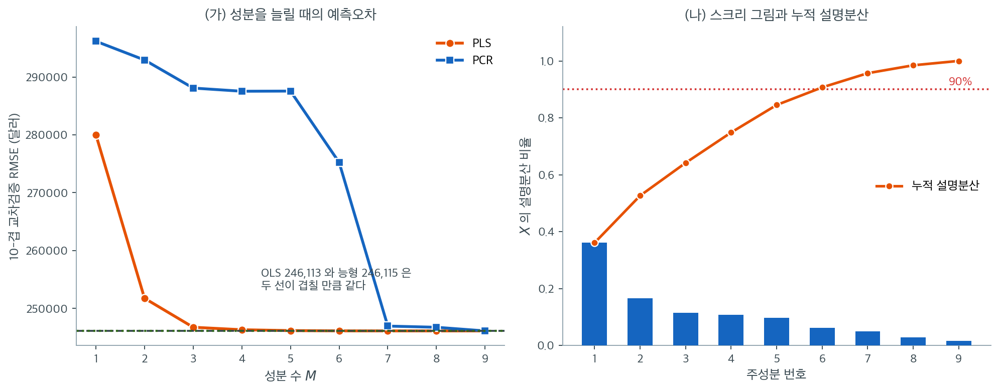

# 주성분회귀와 부분최소제곱 보기

## 개요

주성분회귀(PCR)와 부분최소제곱(PLS)은 회귀에 대한 차원축소 접근법이다. PCR은 먼저
PCA(비지도 방법)로 설명변수 공간을 축소한 뒤 선행 주성분에 반응변수를 회귀시킨다. PLS는
반응변수와의 공분산이 큰 방향을 설명변수 공간에서 찾는다(지도 방법). 이 절에서는 두 방법을
주택 자료에 적용하고 OLS 및 능형회귀와 비교한다.

## 주성분회귀(PCR)

### 착상

PCR은 두 단계로 진행된다.

1. **차원축소.** $X$의 주성분 $Z_1, \dots, Z_M$을 계산한다. 여기서 $Z_m = X v_m$이고
   $v_m$은 $X^\top X$의 $m$번째 고유벡터다.
2. **회귀.** $Z_1, \dots, Z_M$ 위에 $y$를 OLS로 회귀시킨다.

성분의 개수 $M \le p$는 교차검증으로 고르는 조율모수다.

### 수학적 정식화

$X = U D V^\top$를 SVD라 하자. 주성분은 $Z = XV = UD$다. $M$개 성분을 쓰는 PCR은

$$
\hat{y}^{\text{PCR}} = Z_M (Z_M^\top Z_M)^{-1} Z_M^\top y = \sum_{m=1}^{M} z_m \frac{z_m^\top y}{\|z_m\|^2}
$$

를 적합한다. 여기서 $Z_M = [z_1 \mid \cdots \mid z_M]$은 처음 $M$개 주성분을 담는다.

### 능형회귀와의 관계

PCR과 능형회귀는 모두 주성분 방향을 따라 축소하지만 방식이 다르다.

- **능형회귀**는 $m$번째 성분을 $d_m^2/(d_m^2 + \lambda)$배로 축소하며, 이 인자는 연속이다.
- **PCR**은 성분을 살리거나(인자 1) 버리거나(인자 0) 둘 중 하나이며, 이는 이산적이다.

따라서 능형회귀는 PCR의 "매끄러운" 판본이라 할 수 있다.

## 부분최소제곱(PLS)

### 착상

PCA가 $X$만의 분산이 최대인 방향을 찾는 것과 달리, PLS는 $X$ 공간에서 $y$와 가장 상관이 큰
방향을 찾는다. PLS 성분 $T_1, \dots, T_M$은 반복적으로 구성된다.

1. 가중벡터 $w_m = X^\top y / \|X^\top y\|$를 계산한다($y$와의 공분산이 최대인 방향).
2. 성분 $t_m = X w_m$을 만든다.
3. 축소(deflate): $X$와 $y$를 $t_m$에 회귀시킨 잔차로 각각 대체한다.
4. 반복한다.

### PLS가 PCR보다 나은 경우

PLS는 다음과 같은 상황에서 PCR을 능가하는 경향이 있다.

- $X$에서 분산이 가장 큰 방향이 반응변수와 정렬되어 있지 않을 때.
- 적은 수의 지도 성분만으로 $X$--$y$ 관계를 충분히 포착할 수 있을 때.

## 코드: 자료 적재와 OLS 기준선

<div class="exbox" markdown>

**보기 1.** <span class="diff easy" title="쉬움"></span> 주택 자료와 최소제곱 기준선. King County 주택 자료에서 수치형 변수 아홉 개만 골라 표준화하고 최소제곱을 적합한다.

**(1)** 표준화한 $X$의 주성분 고윳값의 합이 얼마인지 말하시오.

**(2)** 주성분을 **전부** 써서 PCR을 하면 OLS와 무엇이 달라지는가. 근거를 들고 코드로 확인하시오.

</div>

??? success "풀이"

    **(1) 해석적으로.** 열을 표준화했으므로 $X^\top X/(n-1)$은 상관행렬이고 대각원소가 모두 1이다. 고윳값의 합은 대각합과 같으므로

    $$
    \sum_{m=1}^{p}\lambda_m = \operatorname{tr}(R) = p = 9
    $$

    다. **고윳값 하나가 1이면 그 성분이 "변수 하나만큼"의 분산을 설명한다**는 뜻이고, 성분을 몇 개 남길지 고를 때 흔히 쓰는 눈금이 여기서 나온다.

    **(2) 해석적으로.** $X = UDV^\top$에서 주성분은 $Z = XV$다. $V$는 직교행렬이므로 **$Z$의 열이 뻗는 공간과 $X$의 열이 뻗는 공간이 같다.** 최소제곱 적합값은 $y$를 그 공간 위로 사영한 것이고 사영은 좌표계에 의존하지 않으므로

    $$
    \hat y^{\text{PCR}}_{M=p} = \hat y^{\text{OLS}}
    $$

    가 **정확히** 성립한다. 근사가 아니라 항등식이다.

    그러므로 PCR이 하는 일은 새로운 모형을 만드는 것이 아니라 **좌표계를 분산 순서로 돌려 놓고 뒤쪽을 잘라 내는 것**이다. 자르지 않으면 OLS와 같다.

    **(1)(2) 수치적으로.**

    ```python
    import numpy as np
    import pandas as pd
    from sklearn.preprocessing import StandardScaler
    from sklearn.linear_model import LinearRegression
    from sklearn.metrics import mean_squared_error, r2_score

    url = ("https://raw.githubusercontent.com/gedeck/"
           "practical-statistics-for-data-scientists/master/data/house_sales.csv")
    house = pd.read_csv(url, sep='\t')

    # 수치형 변수만 쓴다. 주성분은 분산을 기준으로 방향을 찾으므로
    # 범주형 가변수를 섞으면 뜻이 흐려진다.
    numeric_features = [
        'SqFtTotLiving', 'SqFtLot', 'Bathrooms', 'Bedrooms',
        'BldgGrade', 'NbrLivingUnits', 'SqFtFinBasement', 'YrBuilt', 'YrRenovated'
    ]
    X = house[numeric_features].values
    y = house['AdjSalePrice'].values

    scaler = StandardScaler()
    X_scaled = scaler.fit_transform(X)

    ols_model = LinearRegression().fit(X_scaled, y)
    ols_r2 = r2_score(y, ols_model.predict(X_scaled))
    ols_rmse = np.sqrt(mean_squared_error(y, ols_model.predict(X_scaled)))

    print(f"n = {len(y)}, p = {X_scaled.shape[1]}")
    print(f"OLS: R^2 = {ols_r2:.6f},  RMSE = {ols_rmse:,.1f}")
    d = np.linalg.svd(X_scaled, compute_uv=False)
    lam = d ** 2 / (len(y) - 1)
    print(f"상관행렬 고윳값의 합 = {lam.sum():.6f}  (p = {X_scaled.shape[1]})")
    print(f"고윳값: {np.round(lam, 4)}")
    ```

    출력:

    ```
    n = 22687, p = 9
    OLS: R^2 = 0.593225,  RMSE = 245,800.5
    상관행렬 고윳값의 합 = 9.000397  (p = 9)
    고윳값: [3.2464 1.4904 1.0379 0.9616 0.87   0.5566 0.4485 0.25   0.1388]
    ```

    **고윳값의 합이 $9.0004$로 $p = 9$와 맞는다.** $10^{-4}$의 어긋남은 `StandardScaler` 가 $n$으로 나누는 반면 여기서 $n-1$로 나누었기 때문이며, $n = 22{,}687$에서 그 비는 $1.000044$다.

    고윳값이 $3.25$에서 $0.14$까지 퍼져 있다. 가장 큰 성분이 변수 세 개 몫의 분산을 담고 가장 작은 성분은 변수 하나의 $7$분의 1에 지나지 않는다. **설명변수들이 서로 상관되어 있다는 뜻**이며, 차원축소를 시도해 볼 만한 자료라는 신호다.

    OLS의 표본 내 $R^2$는 $0.5932$, RMSE는 $245{,}801$달러다.

## 코드: 교차검증을 곁들인 PCR

<div class="exbox" markdown>

**보기 2.** <span class="diff easy" title="쉬움"></span> 주성분회귀. 성분 수 $M$을 $1$에서 $9$까지 늘리며 $10$-겹 교차검증 RMSE를 잰다.

**(1)** 능형회귀와 PCR이 주성분 방향을 축소하는 방식을 각각 식으로 적고, PCA가 **반응변수를 보지 않는다**는 사실에서 어떤 위험이 따라오는지 말하시오.

**(2)** CV 곡선을 구해 그 위험이 이 자료에서 실제로 일어나는지 확인하시오.

</div>

??? success "풀이"

    **(1) 해석적으로.** $X = UDV^\top$에서 $m$번째 주성분 방향의 기여에 붙는 인자를 적으면

    $$
    \text{능형: } \frac{d_m^2}{d_m^2+\lambda} \in (0,1),
    \qquad
    \text{PCR: } \mathbf 1(m \le M) \in \{0, 1\}
    $$

    이다. **능형은 연속적으로 깎고 PCR은 켜거나 끈다.** 능형이 PCR의 매끄러운 판본이라 불리는 까닭이다.

    위험은 $M$을 **무엇으로 고르느냐**에서 온다. PCA는 $X$의 분산만 보고 성분을 정렬하므로, 분산이 작은 성분이 $y$를 잘 설명하더라도 뒤쪽으로 밀린다. 그 성분을 쓰려면 앞의 쓸모없는 성분을 **모두 먼저 넣어야 한다.** "누적 설명분산 $90\%$에서 끊는다" 같은 경험칙은 $y$를 한 번도 보지 않은 기준이므로 그런 성분을 통째로 버릴 수 있다.

    **(2) 수치적으로.**

    ```python
    from sklearn.decomposition import PCA
    from sklearn.model_selection import cross_val_score, KFold

    # 주성분회귀(PCR): 먼저 주성분을 뽑고 그중 앞의 M 개로 회귀한다.
    # 주성분은 반응 y 를 전혀 보지 않고 X 의 분산만 보고 정해진다는 점이
    # 아래 PLS 와 갈리는 지점이다.
    pca = PCA()
    X_pca = pca.fit_transform(X_scaled)

    explained_var = pca.explained_variance_ratio_
    cumsum_var = np.cumsum(explained_var)

    kfold = KFold(n_splits=10, shuffle=True, random_state=42)
    pcr_mse_scores = []

    # 몇 개의 성분을 쓸지는 교차검증으로 고른다.
    for M in range(1, X_scaled.shape[1] + 1):
        reg = LinearRegression()
        cv_scores = cross_val_score(
            reg, X_pca[:, :M], y,
            cv=kfold, scoring='neg_mean_squared_error'
        )
        pcr_mse_scores.append(-cv_scores.mean())

    M_opt_pcr = np.argmin(pcr_mse_scores) + 1
    pcr_cv_rmse = np.sqrt(pcr_mse_scores[M_opt_pcr - 1])

    print("성분별 설명분산:", np.round(explained_var, 4))
    print("누적 설명분산:  ", np.round(cumsum_var, 4))
    print("PCR CV RMSE:", [f"{np.sqrt(m):,.0f}" for m in pcr_mse_scores])
    print(f"M_opt(PCR) = {M_opt_pcr},  CV RMSE = {pcr_cv_rmse:,.1f}")

    # 모든 성분을 쓰면 OLS 와 같아야 한다 (보기 1 의 (2))
    r2_full = r2_score(y, LinearRegression().fit(X_pca, y).predict(X_pca))
    print(f"모든 성분을 쓴 PCR 의 R^2 = {r2_full:.10f},  OLS = {ols_r2:.10f},  "
          f"차이 {abs(r2_full - ols_r2):.2e}")
    ```

    출력:

    ```
    성분별 설명분산: [0.3607 0.1656 0.1153 0.1068 0.0967 0.0618 0.0498 0.0278 0.0154]
    누적 설명분산:   [0.3607 0.5263 0.6416 0.7485 0.8451 0.907  0.9568 0.9846 1.    ]
    PCR CV RMSE: ['296,154', '292,911', '287,749', '287,519', '287,529', '275,200', '246,949', '246,740', '246,113']
    M_opt(PCR) = 9,  CV RMSE = 246,113.3
    모든 성분을 쓴 PCR 의 R^2 = 0.5932245909,  OLS = 0.5932245909,  차이 1.11e-16
    ```

    **보기 1의 (2)가 소수 열째 자리까지 확인된다.** 모든 성분을 쓴 PCR과 OLS의 $R^2$가 $0.5932245909$로 같고 차이가 $1.1\times10^{-16}$, 곧 부동소수점의 바닥이다. 사영은 좌표계에 의존하지 않는다는 항등식 그대로다.

    **(1)에서 말한 위험이 이 자료에서 그대로 일어난다.** CV RMSE가 $M = 1$부터 $6$까지 $296{,}154$에서 $275{,}200$으로 거의 내려오지 않다가, **$M = 7$에서 $246{,}949$로 한 번에 떨어진다.** 그런데 $7$번 성분이 설명하는 분산은 $4.98\%$뿐이다. 분산으로는 일곱째로 큰 성분이 집값 예측에는 결정적인 것이다.

    경험칙의 위험도 수로 드러난다. 누적 설명분산이 $M = 6$에서 $90.7\%$라 "$90\%$에서 끊는다"는 규칙을 따르면 $M = 6$에서 멈추게 되고, 그 자리의 RMSE $275{,}200$은 최적 $246{,}113$보다 **$12\%$ 나쁘다.** $X$만 보고 고른 기준이 $y$에 대해 아무것도 보장하지 않는다는 말의 값이 이 $12\%$다.

    결국 교차검증이 고른 것은 $M = 9$, 곧 **아무것도 버리지 않는 것**이다. 이 자료에서 PCR은 할 일이 없다.

    설명분산의 스크리 그림을 보면 $X$의 변동 대부분을 몇 개의 성분이 포착하는지 가늠할 수 있다.

    !!! warning "이 코드의 자료 누설"
        위 코드는 `PCA()`를 전체 자료에 한 번 적합한 뒤 그 성분으로 교차검증한다. 주성분이 검증
        겹의 정보를 이미 반영하므로 CV 오차가 낙관적으로 편향된다. 엄밀하게 하려면 표준화와 PCA를
        모두 `Pipeline` 안에 넣어 각 겹의 훈련자료에서만 적합해야 한다.

## 코드: 교차검증을 곁들인 PLS

<div class="exbox" markdown>

**보기 3.** <span class="diff easy" title="쉬움"></span> 부분최소제곱. 같은 자료에 PLS를 성분 수를 늘려 가며 적합한다.

**(1)** PLS의 **첫** 성분 가중벡터 $w_1 \propto X^\top y$를 직접 계산해, 어느 변수가 그 방향을 지배하는지 말하시오. 이것이 PCA의 첫 성분과 어떻게 다른가.

**(2)** PLS의 CV 곡선을 PCR의 것과 견주시오.

</div>

??? success "풀이"

    **(1) 해석적으로.** $w_1 = X^\top y/\lVert X^\top y\rVert$이고 $X$가 표준화되어 있으므로 $X^\top y$의 $j$번째 성분은 $x_j$와 $y$의 **표본공분산에 $n-1$을 곱한 것**, 곧 $\operatorname{corr}(x_j, y)$에 비례한다. 따라서

    $$
    w_{1j} \propto \operatorname{corr}(x_j,\, y)
    $$

    로 **$y$와 상관이 큰 변수가 그대로 큰 가중을 받는다.** PCA의 첫 성분은 이 자리에 $y$ 대신 $X$ 자신의 분산구조가 들어간다. 바로 이 한 글자 차이가 지도 차원축소와 비지도 차원축소를 가른다.

    집값과 가장 상관이 큰 변수는 거주면적과 건물등급일 것이므로, $w_1$이 그 둘에 쏠릴 것으로 기대된다.

    **(2) 수치적으로.**

    ```python
    from sklearn.cross_decomposition import PLSRegression

    # 부분최소제곱(PLS): 성분을 찾을 때 y 와의 공분산까지 함께 본다.
    # 그래서 같은 성분 수라면 대개 PCR 보다 낫지만, y 를 보고 방향을 정한
    # 만큼 과적합의 여지도 생긴다.
    pls_mse_scores = []
    for M in range(1, X_scaled.shape[1] + 1):
        pls = PLSRegression(n_components=M)
        cv_scores = cross_val_score(
            pls, X_scaled, y,
            cv=kfold, scoring='neg_mean_squared_error'
        )
        pls_mse_scores.append(-cv_scores.mean())

    M_opt_pls = np.argmin(pls_mse_scores) + 1
    pls_cv_rmse = np.sqrt(pls_mse_scores[M_opt_pls - 1])

    # (1) 의 첫 가중벡터를 직접 계산해 본다
    w1 = X_scaled.T @ (y - y.mean())
    w1 = w1 / np.linalg.norm(w1)
    print("PLS 첫 성분의 가중 w1:")
    for nm, v in sorted(zip(numeric_features, w1), key=lambda t: -abs(t[1])):
        print(f"  {nm:16s} {v:+.4f}")
    print("PLS CV RMSE:", [f"{np.sqrt(m):,.0f}" for m in pls_mse_scores])
    print(f"M_opt(PLS) = {M_opt_pls},  CV RMSE = {pls_cv_rmse:,.1f}")
    ```

    출력:

    ```
    PLS 첫 성분의 가중 w1:
      SqFtTotLiving    +0.5786
      BldgGrade        +0.5623
      Bathrooms        +0.4404
      Bedrooms         +0.2598
      SqFtFinBasement  +0.2478
      SqFtLot          +0.1142
      YrRenovated      +0.0897
      YrBuilt          +0.0684
      NbrLivingUnits   +0.0188
    PLS CV RMSE: ['280,028', '251,752', '246,747', '246,317', '246,167', '246,123', '246,116', '246,113', '246,113']
    M_opt(PLS) = 8,  CV RMSE = 246,113.2
    ```

    **예상대로 거주면적($+0.579$)과 건물등급($+0.562$)이 첫 성분을 지배한다.** 두 변수만으로 가중벡터 길이의 제곱을 $65\%$ 채우고, 가장 작은 `NbrLivingUnits` 는 $+0.019$로 사실상 0이다. PLS의 첫 성분은 **"집이 얼마나 크고 좋은가"**라는 한 축이며, 그것을 사람이 정해 준 것이 아니라 $X^\top y$가 정했다.

    **PLS는 성분 셋으로 사실상 끝난다.** RMSE가 $280{,}028 \to 251{,}752 \to 246{,}747$로 떨어지고, 그 $246{,}747$은 변수 아홉 개를 다 쓴 $246{,}113$보다 **$0.26\%$ 높을 뿐**이다. 같은 성분 셋으로 PCR은 $287{,}749$에 머물렀으니 **$17\%$ 차이**다.

    차이의 출처는 (1)의 한 줄이다. PLS의 첫 성분은 $y$와의 상관을 보고 만들어지고, PCR의 첫 성분은 $X$의 분산만 보고 만들어진다. 이 자료에서 $X$의 분산이 가장 큰 방향이 집값과 잘 정렬되어 있지 않았고, 그 어긋남이 네 성분어치의 손해로 나타났다.

## 코드: 비교용 능형회귀

<div class="exbox" markdown>

**보기 4.** <span class="diff easy" title="쉬움"></span> 능형회귀와 견주기. 같은 자료에 능형회귀를 적합해 네 방법을 한자리에 놓는다.

**(1)** 능형이 고른 $\lambda$에서 유효자유도 $\operatorname{df}(\lambda) = \sum_m d_m^2/(d_m^2+\lambda)$가 $p = 9$에서 얼마나 줄지 어림하시오.

**(2)** 네 방법의 성적이 서로 구별되는가. 구별되지 않는다면 그 까닭을 $p/n$으로 설명하시오.

</div>

??? success "풀이"

    **(1) 해석적으로.** 표준화한 $X$에서 $\sum_m d_m^2 = \operatorname{tr}(X^\top X) = np = 22{,}687 \times 9 \approx 2 \times 10^5$이고, 보기 1에서 본 상관행렬 고윳값이 $3.25$에서 $0.14$ 사이이므로 $d_m^2 = (n-1)\lambda_m$은 $3{,}100$에서 $73{,}600$ 사이다. 능형이 고르는 $\lambda$가 수백 수준이라면 가장 작은 성분조차 $d_m^2/(d_m^2+\lambda) \approx 0.9$이므로 **자유도는 $9$에서 한 자리 미만만 줄어든다.**

    **(2) 해석적으로.** $n = 22{,}687$에 $p = 9$라 $p/n = 0.0004$다. 최소제곱 계수의 분산이 $\sigma^2/n$ 규모이므로 **추정 잡음이 애초에 거의 없고, 정칙화가 깎아 줄 분산 자체가 없다.** 편향을 조금이라도 사면 손해다. 따라서 네 방법이 같은 자리에 모이는 것이 정상이다.

    **(1)(2) 수치적으로.**

    ```python
    from sklearn.linear_model import RidgeCV

    # 능형회귀와도 견준다. 셋 다 상관된 변수를 다루는 방법이지만, 능형은
    # 변수를 그대로 두고 계수만 줄이는 반면 PCR·PLS 는 변수를 적은 수의
    # 성분으로 갈아 끼운다.
    ridge_cv = RidgeCV(alphas=np.logspace(-2, 5, 100), cv=10)
    ridge_cv.fit(X_scaled, y)
    ridge_r2 = r2_score(y, ridge_cv.predict(X_scaled))
    ridge_rmse = np.sqrt(mean_squared_error(y, ridge_cv.predict(X_scaled)))

    print(f"능형: alpha = {ridge_cv.alpha_:,.2f},  R^2 = {ridge_r2:.6f},  RMSE = {ridge_rmse:,.1f}")
    print(f"유효자유도 = {np.sum(d**2 / (d**2 + ridge_cv.alpha_)):.4f}  (p = 9)")
    print(f"OLS RMSE {ols_rmse:,.1f} / 능형 {ridge_rmse:,.1f}  -> 차이 {ridge_rmse - ols_rmse:,.1f}")
    ```

    출력:

    ```
    능형: alpha = 335.16,  R^2 = 0.593056,  RMSE = 245,851.5
    유효자유도 = 8.7301  (p = 9)
    OLS RMSE 245,800.5 / 능형 245,851.5  -> 차이 51.0
    ```

    **어림이 맞았다.** 능형이 고른 $\lambda = 335$에서 유효자유도가 $8.73$으로 $9$에서 $0.27$만 줄었다. 계수 아홉 개가 모두 살아 있고 자유도로 세어도 거의 그대로다.

    네 방법의 성적은 **구별되지 않는다.** 교차검증 RMSE로 보면 OLS와 모든 성분을 쓴 PCR이 $246{,}113$, PLS의 최적도 $246{,}113$이고, 표본 내 RMSE로 보면 OLS $245{,}801$에 능형 $245{,}852$로 차이가 **$51$달러**다. 집값이 수십만 달러인 자료에서 $51$달러면 아무 일도 하지 않은 것과 같다.

    (2)에서 말한 그대로다. $p/n = 9/22{,}687 = 0.0004$이므로 최소제곱이 이미 충분히 안정적이고, 정칙화나 차원축소가 깎아 줄 분산 자체가 없다. **이 자료에서 네 방법을 견주는 일의 쓸모는 "차이가 없다"를 확인하는 데 있다.** 차원축소의 값어치는 $p$가 $n$에 가까워질 때, 곧 화학계량학이나 분광학처럼 $p \gg n$인 자리에서 나타난다.

## 모형 비교

| 모형 | 초모수 | 핵심 성질 |
|---|---|---|
| OLS | 없음 | 불편이지만 분산이 가장 큼 |
| 능형회귀 | $\lambda$ | 연속적 축소, 모든 특성 유지 |
| PCR | $M$(성분 수) | 비지도 차원축소 |
| PLS | $M$(성분 수) | 지도 차원축소 |

주택 자료에서 PCR과 PLS는 더 적은 유효모수로 OLS에 근접한 $R^2$를 낸다. PLS는 반응변수와
관련된 방향을 직접 겨냥하므로 대개 PCR보다 적은 성분을 필요로 한다.



수치형 변수 9개, $n = 22{,}687$인 주택 자료에서 성분 수를 1부터 9까지 늘리며 10-겹 교차검증 RMSE를 잰 것이다(PCA를 겹 안에서 다시 적합하는 파이프라인을 썼다). 가로 점선이 OLS와 능형회귀의 수준이다.

**PLS는 성분 3개로 사실상 끝난다.** RMSE가 $280{,}028 \to 251{,}752 \to 246{,}747$로 떨어지고, 그 $246{,}747$은 변수 아홉 개를 모두 쓰는 OLS의 $246{,}113$보다 겨우 $0.3\%$ 높다. 반면 PCR은 6개까지도 $275{,}237$에 머물다가 **7번째 성분에서 $246{,}949$로 급락한다.** 성분 여섯 개를 쓴 PCR이 성분 두 개를 쓴 PLS($251{,}752$)보다도 나쁘다.

오른쪽이 그 급락의 이유를 설명한다. 7번 주성분은 $X$의 분산을 $5\%$밖에 설명하지 못하는 작은 성분인데, 집값 예측에는 결정적이다. PCA는 분산 순서로 성분을 내놓으므로 그 성분을 쓰려면 앞의 여섯 개를 먼저 다 넣어야 한다. **누적 설명분산이 $90\%$를 넘는 지점(6번 성분)에서 끊는 흔한 경험칙을 따랐다면 가장 중요한 성분을 통째로 버렸을 것이다.**

마지막으로 OLS와 능형회귀가 $246{,}113$과 $246{,}115$로 구별되지 않는다는 점도 읽어야 한다. $n$이 $2$만이 넘고 $p$가 9개뿐이라 $p/n \approx 0.0004$인 이 자료에서는 정칙화든 차원축소든 얻을 것이 없다. 네 방법이 모두 같은 자리에 모이는 것이 정상이며, **차원축소의 값어치는 $p$가 $n$에 가까워질 때 나타난다.**

## 해석

- **PCR**은 $X$의 분산을 거의 설명하지 못하는 주성분을 버리는데, 그 성분이 $y$와 관련이
  있을 수도 없을 수도 있다. 분산이 작은 성분이 반응변수를 잘 예측하는 경우도 가능하며, 그때
  PCR은 그 성분을 놓친다.
- **PLS**는 $y$와의 공분산을 직접 겨냥하므로 대개 더 적은 성분으로 충분하다. 그래서 $p \gg n$인
  화학계량학이나 분광학에서 특히 유용하다.
- **능형회귀**는 이산적인 성분 선택 대신 연속적 축소로 비슷한 결과를 얻는다. 닫힌 형태의 해가
  있어 계산도 더 싸다.
- **방법의 선택**은 목적에 달려 있다. 잠재성분 관점의 해석이 중요하면 PCR이나 PLS를, 원래
  특성 전부를 쓰는 예측이 좋다면 능형회귀를 쓴다.

## 연습문제

<div class="drillbox" markdown>

**연습문제 1.** <span class="diff med" title="중간"></span> $M = p$개 성분을 쓰는 PCR이 OLS와 동치임을 보여라.

</div>

??? success "풀이"

    주성분은 $Z = XV$이고, 여기서 $V$는 $X^\top X$의 고유벡터로 이루어진 $p \times p$
    직교행렬이다. $M = p$이면 PCR은 $Z$의 모든 열에 $y$를 회귀시킨다.

    $$
    \hat{\beta}^{\text{PCR}} = V (Z^\top Z)^{-1} Z^\top y.
    $$

    $Z = XV$이고 $V$가 직교($V^\top V = I$)이므로

    $$
    Z^\top Z = V^\top X^\top X V = D^2
    $$

    이며, $D^2 = \text{diag}(d_1^2, \dots, d_p^2)$는 고유값을 담는다. 또한
    $Z^\top y = V^\top X^\top y$이므로

    $$
    \hat{\beta}^{\text{PCR}} = V D^{-2} V^\top X^\top y = (V D^2 V^\top)^{-1} X^\top y = (X^\top X)^{-1} X^\top y = \hat{\beta}^{\text{OLS}}
    $$

    이다. 성분을 모두 남기면 버려지는 정보가 없다. $\square$

<div class="drillbox" markdown>

**연습문제 2.** <span class="diff med" title="중간"></span> 설명변수의 표준화가 PCR에는 필수적이지만 OLS에는 반드시 필요하지 않은 이유를
설명하라. 표준화하지 않으면 PCR에서 무엇이 잘못되는가?

</div>

??? success "풀이"

    PCA는 분산이 최대인 방향을 찾는다. 설명변수의 척도가 서로 다르면(예: 면적은 수천 단위,
    침실 수는 한 자릿수) 선행 주성분은 예측력과 무관하게 분산이 큰(척도가 큰) 변수에 지배된다.

    **예:** `SqFtLot`이 1,000에서 500,000까지, `Bedrooms`가 1에서 6까지 변한다면, 첫 주성분은
    단지 수치적 분산이 크다는 이유만으로 거의 전적으로 `SqFtLot`과 정렬된다. 그러면 PCR은
    침실 수가 더 예측력이 높더라도 대지면적에 근거해 회귀하게 된다.

    OLS에는 이런 문제가 없다. 중간에 분산 최대화 단계를 거치지 않고 잔차제곱합을 직접
    최소화하기 때문이다. OLS 계수는 각 설명변수의 척도에 맞추어 자동으로 조정된다. (수치
    안정성을 위해 표준화는 여전히 좋은 습관이지만, OLS의 적합값 자체는 바뀌지 않는다.)
    $\square$

<div class="drillbox" markdown>

**연습문제 3.** <span class="diff med" title="중간"></span> 주택 보기에서 최적 PCR이 $p = 9$개 중 $M = 7$개 성분을 쓴다고 하자. 이는 자료에
대해 무엇을 말해 주는가? PLS는 더 많은 성분을 필요로 할까, 더 적은 성분을 필요로 할까?

</div>

??? success "풀이"

    PCR이 9개 중 7개 성분을 필요로 한다면, 마지막 두 주성분이 $X$의 분산은 거의 설명하지
    못하면서도 $y$를 예측하는 데 유용한 정보를 담고 있다는 뜻이다. 이를 버리면 예측이 조금
    나빠진다. 즉 자료의 신호가 저차원 부분공간에 몰려 있지 않고 설명변수 공간의 여러 방향에
    퍼져 있음을 시사한다.

    PLS는 **더 적은** 성분을 필요로 할 가능성이 크다. $X$만의 분산이 아니라 $y$와의 공분산을
    최대화하는 방향을 만들기 때문이다. 어떤 방향이 $X$의 분산을 거의 설명하지 못하더라도
    $y$와 강하게 연관되어 있으면 PLS는 그 방향을 일찍 집어낸다. 경험적으로 PLS는 2--5개
    성분만으로 7개 성분을 쓴 PCR과 비슷하거나 더 나은 성능을 내는 경우가 많다. $\square$

<div class="drillbox" markdown>

**연습문제 4.** <span class="diff med" title="중간"></span> scikit-learn의 PCA를 쓰지 않고, 중심화·척도화한 계획행렬의 SVD를 이용해 PCR을
직접 구현하라. 작은 시험자료에서 구현 결과가 scikit-learn과 일치함을 확인하라.

</div>

??? success "풀이"

    ```python
    import numpy as np
    from sklearn.preprocessing import StandardScaler
    from sklearn.decomposition import PCA
    from sklearn.linear_model import LinearRegression

    np.random.seed(42)
    n, p = 50, 5
    X = np.random.randn(n, p)
    beta_true = np.array([3, -1, 2, 0, 0])
    y = X @ beta_true + np.random.randn(n) * 0.5

    # 표준화. 벌점회귀에서는 필수다
    X_s = StandardScaler().fit_transform(X)

    # 특이값분해로 직접 구현한 주성분회귀
    U, D, Vt = np.linalg.svd(X_s, full_matrices=False)
    M = 3  # number of components
    Z = U[:, :M] * D[:M]  # first M principal components
    y_bar = y.mean()                                  # intercept
    gamma = np.linalg.lstsq(Z, y - y_bar, rcond=None)[0]
    beta_pcr_manual = Vt[:M].T @ gamma
    y_pred_manual = X_s @ beta_pcr_manual + y_bar

    # sklearn 으로 같은 일 하기
    pca = PCA(n_components=M)
    Z_sk = pca.fit_transform(X_s)
    reg = LinearRegression().fit(Z_sk, y)
    y_pred_sk = reg.predict(Z_sk)

    print(f"Max prediction difference: {np.max(np.abs(y_pred_manual - y_pred_sk)):.2e}")
    ```

    출력:

    ```
    Max prediction difference: 9.77e-15
    ```

    실행하면 최대 예측 차이는 $9.8 \times 10^{-15}$로 기계 엡실론 수준이며, 두 구현이 동치임을
    확인해 준다.

    !!! warning "절편을 빠뜨리면"
        `np.linalg.lstsq(Z, y)`처럼 $y$를 중심화하지 않고 그대로 회귀시키면 절편이 빠진다.
        반면 scikit-learn의 `LinearRegression`은 기본적으로 절편을 적합하므로, 두 예측값은
        정확히 $\bar{y}$만큼 어긋난다. 위 자료에서는 $\bar{y} = 0.3189$이고 실제로 최대 차이가
        $0.319$로 나온다. $Z$의 열은 중심화되어 있지만 $y$는 그렇지 않다는 점을 놓치기 쉽다.

    !!! note "부호 규약"
        `np.linalg.svd`와 `PCA`는 특이벡터의 부호 규약이 다를 수 있어 $v_m$과 $\gamma_m$의
        부호가 뒤집혀 나올 수 있다. 그러나 곱 $z_m \gamma_m$은 부호에 불변이므로 **예측값**은
        정확히 일치한다. 성분별 계수를 직접 비교할 때는 부호를 맞춰 주어야 한다.
    $\square$

<div class="drillbox" markdown>

**연습문제 5.** <span class="diff hard" title="어려움"></span> 첫 PLS 방향 $w_1$이 $\|w\| = 1$ 아래에서 $\text{Cov}(Xw, y)^2$을 최대화함을
증명하고, 이것이 $w_1 \propto X^\top y$와 동치임을 보여라.

</div>

??? success "풀이"

    구하고자 하는 것은

    $$
    w_1 = \arg\max_{\|w\|=1} \left[\text{Cov}(Xw, y)\right]^2
    $$

    이다. $X$와 $y$가 중심화되어 있다고 하면
    $\text{Cov}(Xw, y) = \frac{1}{n-1}(Xw)^\top y = \frac{1}{n-1}w^\top X^\top y$이다.
    $\|w\| = 1$ 아래에서 $[w^\top X^\top y]^2$을 최대화하는 것은 $|w^\top X^\top y|$를
    최대화하는 것과 같다.

    코시-슈바르츠 부등식에 의해

    $$
    |w^\top (X^\top y)| \le \|w\| \cdot \|X^\top y\| = \|X^\top y\|
    $$

    이고, 등호는 $w \propto X^\top y$일 때 성립한다. 따라서

    $$
    w_1 = \frac{X^\top y}{\|X^\top y\|}
    $$

    이다. 즉 첫 PLS 방향은 각 설명변수와 반응변수의 주변공분산을 모은 벡터를 정규화한 것에
    지나지 않는다. $\square$

---

## 정리하며

PCR 과 PLS 의 **결정적 차이**는 $\mathbf y$ 를 보느냐다.

| | 성분을 고르는 기준 |
|---|---|
| PCR | $\mathbf X$ 의 분산만 (**비지도**) |
| PLS | $\mathbf X$ 와 $\mathbf y$ 의 공분산 (**지도**) |

- **PLS 는 반응과의 관련성을 함께 본다.** 그래서 대개 **더 적은 성분으로 같은 예측 성능**을 낸다.
- **PCR 이 뒤처지는 전형적 상황.** 분산이 큰 방향이 $\mathbf y$ 와 무관할 때이며, 인공자료로 그런 경우를 만들어 보면 차이가 뚜렷하다.
- **PLS 는 과대적합 위험이 조금 더 크다.** $\mathbf y$ 를 쓰므로 성분 선택 자체가 자료에 적응하며, 교차검증이 더 중요하다.
- **둘 다 해석이 어렵다.** 성분에 실질적 의미를 붙이기 힘든 것은 마찬가지다.
- **능형·라쏘와 목적이 겹친다.** 실무에서는 정칙화 쪽이 더 널리 쓰이지만, 화학계량학처럼 $p\gg n$ 이 극단적인 분야에서는 PLS 가 표준이다.

다음 절 **정칙화 비교 (코드)** 로 18장을 마무리한다.
