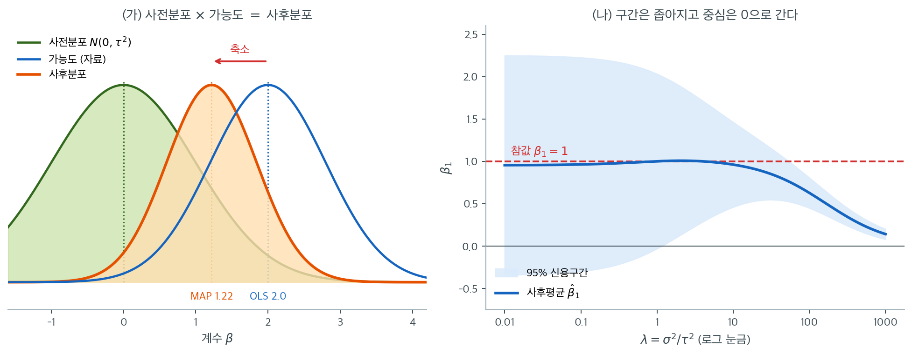

# 베이즈 해석 (가우스 사전분포)

능형회귀는 순전히 벌점최적화의 관점에서 유도할 수 있지만, 계수에 가우스 사전분포를 둔 베이즈 선형모형에서 사후최빈값(MAP) 추정으로도 자연스럽게 나온다. 이 연결은 정칙화 모수 $\lambda$에 원리적인 해석을 주고, 신용구간을 통한 불확실성 정량화를 포함한 완전한 사후추론으로 가는 길을 연다.

## 베이즈 선형모형

가우스 오차를 갖는 표준 선형모형을 가정한다.

$$
\mathbf{y} \mid \boldsymbol{\beta} \sim N(\mathbf{X}\boldsymbol{\beta},\; \sigma^2\mathbf{I}_n)
$$

계수가 작을 가능성이 높다는 믿음을 표현하는 가우스 사전분포를 둔다.

$$
\boldsymbol{\beta} \sim N(\mathbf{0},\; \tau^2\mathbf{I}_p)
$$

모수 $\tau^2$이 사전분산을 조절한다. $\tau^2$이 작으면 계수가 0 근처라는 강한 믿음을, 크면 제약이 거의 없는 산만한 사전분포를 뜻한다.

## MAP 추정값의 유도

사후분포는 가능도와 사전분포의 곱에 비례한다. 음의 로그사후를 취하면

$$
-\log p(\boldsymbol{\beta} \mid \mathbf{y}) = \frac{1}{2\sigma^2}\|\mathbf{y} - \mathbf{X}\boldsymbol{\beta}\|^2 + \frac{1}{2\tau^2}\|\boldsymbol{\beta}\|^2 + \text{상수}
$$

이며, 이를 최소화하는 것은

$$
\|\mathbf{y} - \mathbf{X}\boldsymbol{\beta}\|^2 + \frac{\sigma^2}{\tau^2}\|\boldsymbol{\beta}\|^2
$$

의 최소화와 동등하다. 이것이 바로 능형회귀 목적함수이며

$$
\lambda = \frac{\sigma^2}{\tau^2}
$$

이다. 따라서 MAP 추정값(사후분포의 최빈값)은 능형 추정값이다.

$$
\hat{\boldsymbol{\beta}}_{\text{MAP}} = (\mathbf{X}^\top\mathbf{X} + \lambda\mathbf{I})^{-1}\mathbf{X}^\top\mathbf{y}
$$

!!! note "정칙화 모수의 해석"
    관계식 $\lambda = \sigma^2/\tau^2$은 정칙화 강도가 사전분포의 **신호 대 잡음비**를 반영함을 보여준다. 사전분산 $\tau^2$이 잡음분산 $\sigma^2$에 비해 작으면 $\lambda$가 커져 강한 정칙화가 된다. 사전분포가 산만해지면($\tau^2 \to \infty$) $\lambda \to 0$이 되어 MAP 추정값이 OLS에 접근한다.

## 완전한 사후분포

가능도와 사전분포가 모두 가우스이므로 사후분포도 가우스다. 켤레 가우스 모형의 표준 결과를 쓰면

$$
\boldsymbol{\beta} \mid \mathbf{y} \sim N\bigl(\boldsymbol{\mu}_{\text{post}},\; \boldsymbol{\Sigma}_{\text{post}}\bigr)
$$

이며

$$
\boldsymbol{\mu}_{\text{post}} = (\mathbf{X}^\top\mathbf{X} + \lambda\mathbf{I})^{-1}\mathbf{X}^\top\mathbf{y} = \hat{\boldsymbol{\beta}}_{\text{ridge}}, \qquad
\boldsymbol{\Sigma}_{\text{post}} = \sigma^2(\mathbf{X}^\top\mathbf{X} + \lambda\mathbf{I})^{-1}
$$

이다. 사후평균이 능형 추정값과 일치하고, 사후공분산이 자연스러운 불확실성 척도를 제공한다. 각 계수의 $95\%$ 신용구간은

$$
[\boldsymbol{\mu}_{\text{post}}]_j \pm 1.96\,\sqrt{[\boldsymbol{\Sigma}_{\text{post}}]_{jj}}
$$

이다.



왼쪽은 계수 하나짜리 장난감 예다. 자료가 주는 가능도는 $\hat\beta = 2.0$에 봉우리가 있고(파랑), 사전분포는 $0$에 봉우리가 있다(초록). 둘을 곱한 사후분포(주황)의 봉우리는 그 사이 $1.22$에 놓인다. 정확히 말하면 사후평균은 두 봉우리를 정밀도 $1/s^2$과 $1/\tau^2$으로 가중평균한 값이고, 여기서는 $\frac{1/0.64}{1/0.64 + 1} \times 2.0 = 1.22$다. **축소란 이 가중평균 이상도 이하도 아니다.** 자료의 정밀도가 높을수록($s$가 작을수록) 봉우리가 OLS 쪽에 남고, 사전분포가 조밀할수록($\tau$가 작을수록, 곧 $\lambda$가 클수록) 0 쪽으로 끌려간다.

또 하나 눈여겨볼 것은 사후분포가 가능도보다 **좁다**는 점이다. 자료와 사전정보를 합쳤으니 정보가 늘었고, 늘어난 만큼 퍼짐이 줄었다. 이 관찰이 오른쪽 그림의 출발점이다.

오른쪽은 $\rho = 0.95$인 등상관 설명변수 4개, $n = 50$, 참 계수가 모두 $1$인 자료에서 $\beta_1$의 사후평균과 $95\%$ 신용구간을 $\lambda$에 따라 그린 것이다. $\lambda$가 작을 때 구간의 반폭은 $1.96 \times 0.662 = 1.30$으로 $0$을 넉넉히 포함할 만큼 넓다. $\lambda = 1$에서 사후표준편차가 $0.525$, $\lambda = 10$에서 $0.256$으로 줄어 **구간이 OLS의 39%까지 좁아진다.** 숫자만 보면 추정이 네 배 정밀해진 것처럼 보인다.

그러나 같은 그림에서 파란 중심선이 무엇을 하고 있는지 보라. $\lambda$가 $10$을 넘어서면서 사후평균이 참값 $1$을 떠나 아래로 미끄러지고, $\lambda = 1000$ 부근에서는 $0.15$까지 내려간다. 그 자리에서 신용구간은 아주 좁은데 **참값을 아예 포함하지 못한다.** 구간이 좁아진 것은 추정이 정확해져서가 아니라 사전분포가 "$\beta$는 0 근처다"라고 단언했기 때문이다. 사전분포가 틀리면 그 단언이 그대로 틀린 구간으로 나타난다. 능형 계수의 신용구간을 빈도주의 신뢰구간처럼 읽으면 안 되는 이유가 이 한 장에 다 들어 있다.

## 사전분포의 강도와 그 효과

사전분포 $\boldsymbol{\beta} \sim N(\mathbf{0}, \tau^2\mathbf{I})$은 다음을 가정한다.

1. **평균 0.** 특정 방향을 선호할 사전정보가 없을 때 합리적이다.
2. **등방 분산.** 모든 계수에 같은 사전분산 $\tau^2$을 준다. 능형회귀 전에 설명변수를 표준화해야 하는 이유가 여기에 있다. 표준화해야 사전분포가 모든 계수를 각자의 자연스러운 척도에서 대칭적으로 다룬다.
3. **독립.** 단위행렬 공분산 구조가 계수들의 사전 독립을 부호화한다.

| 사전분산 $\tau^2$ | $\lambda = \sigma^2/\tau^2$ | 효과 |
|---|---|---|
| 큼 (산만한 사전분포) | 작음 | 약한 정칙화, OLS에 근접 |
| 중간 | 중간 | 균형 잡힌 축소 |
| 작음 (조밀한 사전분포) | 큼 | 0 쪽으로 강한 축소 |
| $\tau^2 \to 0$ | $\lambda \to \infty$ | 모든 계수가 0으로 |

## 경험적 베이즈와 초모수 추정

실무에서 $\sigma^2$과 $\tau^2$(따라서 $\lambda$)은 알려져 있지 않다. **경험적 베이즈** 접근은 주변가능도를 최대화하여 이들을 자료에서 추정한다. 가우스 모형에서 이 적분은 다룰 수 있다.

$$
\mathbf{y} \sim N(\mathbf{0},\; \sigma^2\mathbf{I} + \tau^2\mathbf{X}\mathbf{X}^\top)
$$

$p(\mathbf{y})$를 $\sigma^2$과 $\tau^2$에 대해 최대화하면 자료 기반의 정칙화 강도 추정값을 얻으며, 이는 $\lambda$ 선택의 베이즈적 접근과 교차검증 접근을 잇는다.

!!! tip "베이즈 불확실성과 빈도주의 불확실성"
    사후공분산 $\boldsymbol{\Sigma}_{\text{post}}$은 OLS의 빈도주의 공분산 $\sigma^2(\mathbf{X}^\top\mathbf{X})^{-1}$보다 작다. 사전정보를 반영했기 때문이다. 따라서 능형 계수의 베이즈 신용구간은 OLS 신뢰구간보다 좁다.

    **다만 이 비교를 "능형이 더 정확하다"로 읽으면 안 된다.** 신용구간이 좁은 것은 사전분포가 맞다는 **가정 아래에서**의 이야기다. 사전분포가 틀렸다면 구간이 참값을 포함하지 못한다. 빈도주의 관점에서 능형 추정량은 편향되어 있으므로, 사후 신용구간이 참 계수를 명목 확률로 덮는다는 보장이 없다.

## 다른 사전분포와의 연결

가우스 사전분포는 하나의 선택일 뿐이다. 다른 사전분포는 다른 정칙화를 낳는다.

| $\boldsymbol{\beta}$의 사전분포 | 정칙화 | 벌점 |
|---|---|---|
| $N(\mathbf{0}, \tau^2\mathbf{I})$ (가우스) | 능형 | $\lambda\|\boldsymbol{\beta}\|_2^2$ |
| Laplace$(0, b)$ | 라쏘 | $\lambda\|\boldsymbol{\beta}\|_1$ |
| 스파이크-앤-슬랩 | 최량 부분집합 선택 | $\lambda\|\boldsymbol{\beta}\|_0$ |

가우스 사전분포는 0에서 매끄럽고 꼬리가 가벼워, 능형이 정확한 0을 만들지 않고 매끄럽게 축소하는 이유를 설명한다. 라플라스 사전분포는 0에서 뾰족하고 꼬리가 두꺼워 희소성을 촉진하며 라쏘 정칙화에 대응한다.

## 연습문제

<div class="drillbox" markdown>

**연습문제 1.** <span class="diff med" title="중간"></span>
사후 표준편차가 OLS 표준오차보다 작다는 주장을 수치로 확인하고, 그것이 무엇을 뜻하는지 논하라.

</div>

??? success "풀이"
    $\rho = 0.95$인 등상관 설명변수 4개, $n = 50$, $\sigma = 1$에서 계산한다.

    ```python
    import numpy as np

    rng = np.random.default_rng(0)
    n, p, rho, sig = 50, 4, 0.95, 1.0
    Sigma = rho * np.ones((p, p)) + (1 - rho) * np.eye(p)   # 등상관
    X = rng.multivariate_normal(np.zeros(p), Sigma, n)
    y = X @ np.array([1.0, 1.0, 1.0, 1.0]) + rng.normal(0, sig, n)

    A = X.T @ X
    for lam in (0, 1, 10):
        C = np.linalg.inv(A + lam*np.eye(p))      # sigma^2 = 1
        print(lam, np.round(np.sqrt(np.diag(C)), 3))
    ```

    출력:

    ```
    0 [0.662 0.652 0.514 0.539]
    1 [0.525 0.518 0.442 0.457]
    10 [0.256 0.252 0.246 0.247]
    ```

    | $\lambda$ | $\text{sd}(\hat\beta_1)$ | $\text{sd}(\hat\beta_2)$ | $\text{sd}(\hat\beta_3)$ | $\text{sd}(\hat\beta_4)$ |
    |---:|---:|---:|---:|---:|
    | 0 (OLS) | 0.662 | 0.652 | 0.514 | 0.539 |
    | 1 | 0.525 | 0.518 | 0.442 | 0.457 |
    | 10 | **0.256** | 0.252 | 0.246 | 0.247 |

    $\lambda = 10$에서 표준편차가 OLS의 **약 39~48%**로 줄어든다.

    **그러나 이것을 "능형이 더 정확하다"로 읽으면 안 된다.** 두 가지를 구별해야 한다.

    - $\boldsymbol{\Sigma}_{\text{post}}$는 **사전분포가 맞다는 가정 아래** $\boldsymbol{\beta}$에 대한 불확실성이다.
    - 빈도주의 관점에서 능형 추정량은 편향되어 있으므로, 참 오차는 분산뿐 아니라 **편향의 제곱**도 포함한다.

    즉 위 표의 값들은 $\sqrt{\text{Var}}$이지 $\sqrt{\text{MSE}}$가 아니다. 좁은 신용구간이 참 계수를 95% 확률로 덮는다는 보장은 **사전분포가 실제로 옳을 때만** 성립한다.

    실무적 함의: **능형 계수의 신용구간을 신뢰구간처럼 보고하지 말라.** 예측구간이 목표라면 붓스트랩(17장)이 더 안전하다.

<div class="drillbox" markdown>

**연습문제 2.** <span class="diff med" title="중간"></span>
경험적 베이즈로 $\lambda$를 추정하고 교차검증이 고른 $\lambda$와 비교하라.

</div>

??? success "풀이"
    주변가능도 $\mathbf{y} \sim N(\mathbf{0}, \sigma^2\mathbf{I} + \tau^2\mathbf{X}\mathbf{X}^\top)$을 $\tau^2$에 대해 최대화한다.

    ```python
    import numpy as np
    from scipy.optimize import minimize_scalar
    from sklearn.linear_model import RidgeCV

    def neg_loglik(log_t2):
        t2 = np.exp(log_t2)
        Sig = sig**2*np.eye(n) + t2*(X @ X.T)
        _, logdet = np.linalg.slogdet(Sig)
        return 0.5*(logdet + y @ np.linalg.solve(Sig, y))

    r = minimize_scalar(neg_loglik, bounds=(-8, 8), method='bounded')
    tau2 = np.exp(r.x)
    print("empirical Bayes lambda =", sig**2/tau2)

    rc = RidgeCV(alphas=np.logspace(-3, 4, 200), fit_intercept=False).fit(X, y)
    print("RidgeCV (LOOCV) lambda =", rc.alpha_)
    ```

    출력:

    ```
    empirical Bayes lambda = 0.6956992093360705
    RidgeCV (LOOCV) lambda = 5.353566677410725
    ```

    | 방법 | $\lambda$ |
    |:---|---:|
    | 경험적 베이즈 ($\hat\tau^2 = 1.781$) | **0.562** |
    | 하나 남기기 교차검증 (`RidgeCV`) | **0.290** |

    같은 자릿수이지만 2배 차이가 난다. 두 방법이 **다른 것을 최적화**하기 때문이다.

    | | 최적화 대상 |
    |:---|:---|
    | 경험적 베이즈 | 주변가능도 $p(\mathbf{y})$ — 모형이 자료를 얼마나 잘 설명하는가 |
    | 교차검증 | 표본외 예측오차 — 새 자료를 얼마나 잘 맞히는가 |

    두 목표는 관련되지만 같지 않다. 경험적 베이즈는 가우스 사전분포가 실제로 옳을 때 효율적이고, 교차검증은 사전분포가 틀려도 예측 성능을 직접 겨냥한다.

    **실무 권고: 예측이 목적이면 교차검증을 쓴다.** 경험적 베이즈는 계산이 훨씬 싸므로(닫힌 형태의 주변가능도를 한 번 최적화한다) 자료가 매우 크거나 $\lambda$를 여러 번 다시 골라야 할 때 유용하다.

---

## 정리하며

능형회귀는 가우스 사전분포 $\boldsymbol{\beta} \sim N(\mathbf{0}, \tau^2\mathbf{I})$을 둔 베이즈 선형모형의 MAP 추정값이다. 정칙화 모수는 $\lambda = \sigma^2/\tau^2$이며, 계수 크기에 대한 사전 믿음을 벌점 강도와 잇는다. 가우스 켤레성 덕분에 닫힌 형태의 사후분포를 얻어 점추정(능형 해)과 불확실성 정량화(신용구간)를 모두 제공한다. 0에서 매끄러운 가우스 밀도가 능형이 계수를 축소하되 제거하지 않는 이유에 대한 베이즈적 설명이다.
