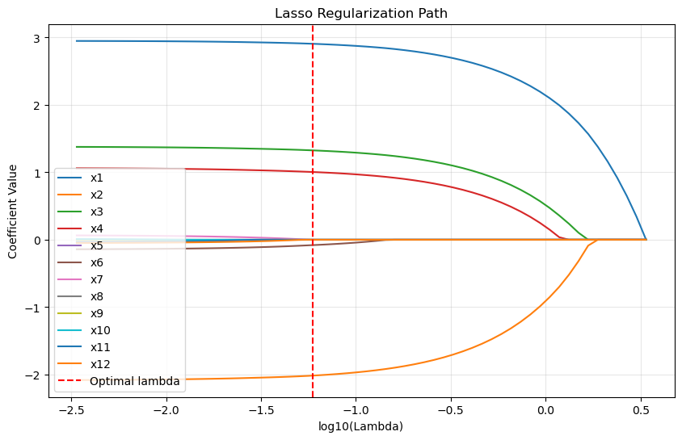

# 정칙화 경로


## 개요

**정칙화 경로**는 정칙화 모수 $\lambda$가 큰 값(강한 정칙화, 희소해)에서 작은 값(약한 정칙화, OLS에 근접)으로 변할 때 모형 계수가 어떻게 달라지는지를 추적한다. 정칙화 경로를 이해하는 것은 다음에 필수적이다.

1. **편향-분산 절충의 시각화** — 정칙화가 강해질 때 계수가 어떻게 축소되는지 본다
2. **변수선택** — 정칙화 수준마다 어떤 변수가 선택되는지 확인한다
3. **모형 복잡도의 이해** — 각 $\lambda$에서 몇 개의 변수가 "활성"인지 관찰한다
4. **최적 $\lambda$의 선택** — 교차검증과 결합하여 최적 정칙화 강도를 고른다

---

## 라쏘의 정칙화 경로

$$\text{minimize} \quad \frac{1}{2n}\|y - X\beta\|^2_2 + \lambda \|\beta\|_1$$

$\lambda$가 커지면

- 더 많은 계수가 정확히 0으로 축소된다
- 모형이 더 희소해진다
- 편향이 커지고 분산이 줄어든다
- 예측오차가 U자 곡선을 그린다(최적 $\lambda$에서 최소)

---

## 라쏘 경로의 주요 성질

### 변수 활성화 순서

1. $\lambda$가 아주 크면 모든 계수가 0이다
2. $\lambda$가 줄면 변수가 하나씩 모형에 들어온다
3. 진입 순서가 L1 정칙화 아래에서의 변수 중요도를 반영한다
4. $\lambda$가 아주 작으면 모든 변수가 활성이 된다(OLS 해에 근접)

### 변수선택의 단조성

라쏘 경로에서 한 번 0이 아니게 된 변수는 $\lambda$가 줄어드는 동안 대체로 계속 0이 아니다. 이 "호모토피" 구조가 계산에 유용하다.

!!! warning "단조성은 보장되지 않는다"
    "대체로"라는 단서가 중요하다. **변수가 활성집합에 들어왔다가 다시 나가는 일이 실제로 일어난다.** 상관된 설명변수가 있으면 특히 그렇다.

    구체적인 예를 하나 확인했다($n = 40$, $p = 8$, 상관된 쌍 포함, 씨앗 191).

    | 변수 | 진입 $\lambda$ | 이탈 구간 |
    |---:|---:|:---|
    | 3 | 0.1113 | $\lambda \in [0.0237,\ 0.0611]$에서 다시 0 |
    | 6 | — | 역시 이탈 구간 존재 |

    변수 3이 $\lambda = 0.111$에서 들어왔다가 $\lambda$가 더 줄어들자 잠시 0으로 돌아가고, 이후 다시 활성화된다.

    **왜 그런가.** 상관된 다른 변수가 활성화되면서 그 변수가 설명하던 몫을 가져가면, 원래 변수의 부분상관이 문턱 아래로 떨어질 수 있다. LARS 알고리즘이 "변수 제거" 단계를 명시적으로 포함하는 이유가 이것이다.

    실무적 함의: **"경로에 일찍 등장한 변수가 더 중요하다"는 해석을 조심해야 한다.** 진입 순서는 상관 구조에 좌우되며 안정적인 중요도 순위가 아니다.

### 자유도

경로 위 어느 점에서든 유효자유도는

$$\text{eDoF}(\lambda) = \text{0이 아닌 계수의 개수}$$

이다. 능형회귀와 달리 이 관계가 정확히 성립하므로 라쏘가 모형선택에 특히 유용하다.

---

## 정칙화 경로의 계산

### 알고리즘: 온기 시작을 이용한 좌표하강

```
초기화: β = 0

λ를 큰 값부터 작은 값 순으로:
    이전 해에서 β를 초기화 (온기 시작)
    각 좌표 j에 대해:
        부분잔차 계산: r_j = y - X β + X_j β_j
        연성 문턱 적용: β_j = soft_threshold(X_j^T r_j / n, λ)
    수렴할 때까지 반복
```

온기 시작은 이전 해를 활용해 계산을 가속한다. 인접한 $\lambda$의 해는 비슷하므로 최적해 근처에서 출발하게 된다.

### 복잡도

- **단일 $\lambda$**: 반복당 $O(np)$
- **전체 경로** ($M$개 $\lambda$): 순차 계산 시 $O(M \times np \times \text{반복})$
- **효율적 구현**: 온기 시작 덕분에 전체 경로가 단일 문제를 푸는 것과 비슷한 시간에 끝난다

---

## 경로의 실용적 해석

### 주택가격

!!! note "아래 표는 예시용 수치다"
    실제 자료에서 계산한 값이 아니라, 경로의 전형적 양상을 보이기 위한 예시다. 실제 수치가 필요하면 [라쏘 주택 정칙화 경로](../lasso/lasso_housing_regularization_path.md)의 계산을 보라.

변수 12개로 주택가격을 예측하는 라쏘 경로는 대략 다음과 같은 모습이다.

| $\lambda$ (척도조정) | 0이 아닌 계수 | 선택된 변수 | RMSE |
|---|---|---|---|
| 10.0 | 0 | (없음) | 340,000 |
| 5.0 | 1 | SqFtTotLiving | 280,000 |
| 2.0 | 4 | SqFtTotLiving, BldgGrade, YrBuilt, Bathrooms | 240,000 |
| 1.0 | 7 | + SqFtLot, Bedrooms, NbrLivingUnits | 225,000 |
| 0.5 | 10 | + SqFtFinBasement, YrRenovated | 220,000 |
| 0.1 | 12 | 전체 변수 (OLS에 근접) | 218,000 |

**읽어야 할 점:**

- 가장 중요한 변수(SqFtTotLiving)가 먼저 들어온다
- 건물 등급과 건축연도가 그다음이다
- 덜 중요한 변수(YrRenovated)는 작은 $\lambda$에서 들어온다
- RMSE는 계속 줄지만 변수 7개를 넘으면 개선이 둔화된다

마지막 항목이 실무적으로 중요하다. **변수 7개에서 12개로 늘리며 얻는 개선이 $225{,}000 \to 218{,}000$으로 3%에 불과하다.** 1-표준오차 규칙이 이런 상황에서 더 단순한 모형을 고르게 해 준다.

### 경로 위에서의 교차검증

각 $\lambda$를 따로 최적화하는 대신, 미리 계산한 경로 위에서 각 $\lambda$의 CV 오차를 구한다.

```
경로 위의 각 lambda에 대해:
    각 CV 겹에 대해:
        훈련 겹에서 적합
        검증 겹에서 예측
        오차 기록
    겹에 걸쳐 평균
CV 오차가 최소인 lambda 선택
```

각 $\lambda$에서 처음부터 다시 적합하는 것보다 훨씬 빠르다.

---

## 경로의 시각화

### 그림 1: 계수 대 λ

<div class="exbox" markdown>

**보기 1.** <span class="diff easy" title="쉬움"></span> 라쏘 정칙화 경로 그리기. 참으로 관련 있는 변수 넷 $(3, -2, 1.5, 1)$과 잡음 변수 여덟, $n = 200$인 자료에서 경로를 그린다.

**(1)** 경로가 시작하는 $\lambda_{\max}$를 하위기울기 조건에서 유도하고, **가장 먼저** 모형에 들어오는 변수가 어느 것인지 말하시오.

**(2)** 경로를 실제로 계산해 (1)을 확인하고, 변수가 들어오는 **순서**가 $\lvert x_j^\top y\rvert$의 순서와 같은지 따지시오.

</div>

??? success "풀이"

    **(1) 해석적으로.** $\beta = 0$이 라쏘의 해일 조건은 모든 $j$에 대해

    $$
    \frac{\lvert x_j^\top y\rvert}{n} \le \lambda
    $$

    이다. 목적함수 $\frac{1}{2n}\lVert y - X\beta\rVert_2^2 + \lambda\lVert\beta\rVert_1$을 $\beta = 0$에서 하위미분하면 $-x_j^\top y/n + \lambda s_j = 0$, $s_j \in [-1,1]$이 나오고, $s_j$를 $[-1,1]$ 안에서 고를 수 있어야 하기 때문이다. 따라서

    $$
    \lambda_{\max} = \frac{1}{n}\lVert X^\top y\rVert_\infty = \max_j \frac{\lvert x_j^\top y\rvert}{n}
    $$

    이고, 이 최댓값을 **달성하는** 변수가 $\lambda$를 조금 낮출 때 가장 먼저 조건을 깨고 들어온다. 참 계수가 가장 큰 $x_1$이 그 자리일 것으로 기대된다.

    그 뒤로는 사정이 다르다. 두 번째 변수가 들어오는 조건은 $\lvert x_j^\top y\rvert$가 아니라 **잔차와의 상관** $\lvert x_j^\top(y - X\hat\beta)\rvert$가 $n\lambda$에 닿는 것이다. $x_1$이 들어오면서 잔차가 바뀌었으므로, 둘째부터는 주변상관의 순서와 어긋날 수 있다.

    **(2) 수치적으로.**

    ```python
    import matplotlib.pyplot as plt
    import numpy as np
    from sklearn.linear_model import lasso_path, LassoCV

    # 예시 자료: 참으로 관련 있는 변수 4개와 잡음 변수 8개
    rng = np.random.default_rng(0)
    n, n_features = 200, 12
    X = rng.normal(0, 1, (n, n_features))
    beta = np.array([3.0, -2.0, 1.5, 1.0] + [0.0] * 8)
    y = X @ beta + rng.normal(0, 1, n)
    feature_names = [f"x{j+1}" for j in range(n_features)]

    # lasso_path 는 격자 위의 계수를 한꺼번에 계산한다. 하나씩 적합하는
    # 것보다 훨씬 빠른데, 앞 lambda 의 해를 다음 계산의 출발점으로 쓰기 때문이다.
    lambdas, coefs, _ = lasso_path(X, y, n_alphas=60)
    lasso_coefs = coefs.T                       # (n_lambda, n_features)
    # 교차검증으로 고른 lambda. 그림의 붉은 세로선이 이 자리다.
    lambda_opt = LassoCV(cv=5, random_state=0).fit(X, y).alpha_
    print(f"최적 lambda = {lambda_opt:.4f}, "
          f"그때 0이 아닌 계수 = {(np.abs(lasso_coefs[np.argmin(np.abs(lambdas - lambda_opt))]) > 1e-9).sum()}개")

    # --- (1) 을 확인한다 ---
    marg = np.abs(X.T @ y) / n
    print(f"이론 lambda_max = |X'y|_inf/n = {marg.max():.6f}  (달성하는 변수 "
          f"{feature_names[marg.argmax()]})")
    print(f"lasso_path 가 쓴 가장 큰 lambda = {lambdas[0]:.6f}")

    entered = []
    for i in range(len(lambdas)):
        for j in np.where(np.abs(lasso_coefs[i]) > 1e-12)[0]:
            if j not in entered:
                entered.append(j)
    print("경로에서 들어온 순서:", [feature_names[j] for j in entered])
    print("주변상관이 큰 순서  :", [feature_names[j] for j in np.argsort(-marg)])

    # 가로축이 오른쪽에서 왼쪽으로 갈수록 벌점이 약해진다. 가장 먼저 0 에서
    # 떨어져 나오는 선이 그만큼 중요한 변수다.
    fig, ax = plt.subplots(figsize=(10, 6))
    for j in range(n_features):
        ax.plot(np.log10(lambdas), lasso_coefs[:, j], label=feature_names[j])

    ax.axvline(np.log10(lambda_opt), color='red', linestyle='--', label='Optimal lambda')
    ax.set_xlabel('log10(Lambda)')
    ax.set_ylabel('Coefficient Value')
    ax.set_title('Lasso Regularization Path')
    ax.legend()
    ax.grid(True, alpha=0.3)
    plt.show()
    ```

    출력:

    ```
    최적 lambda = 0.0589, 그때 0이 아닌 계수 = 6개
    이론 lambda_max = |X'y|_inf/n = 3.381446  (달성하는 변수 x1)
    lasso_path 가 쓴 가장 큰 lambda = 3.381446
    경로에서 들어온 순서: ['x1', 'x2', 'x3', 'x4', 'x6', 'x7', 'x12', 'x8', 'x11', 'x10', 'x5']
    주변상관이 큰 순서  : ['x1', 'x3', 'x2', 'x4', 'x9', 'x8', 'x6', 'x11', 'x5', 'x12', 'x10', 'x7']
    ```

    

    **유도한 $\lambda_{\max}$가 코드와 소수 여섯째 자리까지 같다.** `lasso_path` 가 격자의 출발점으로 쓰는 값이 바로 $\lVert X^\top y\rVert_\infty / n$이기 때문이다. 그 최댓값을 달성하는 변수도 예상대로 $x_1$이고, 그림에서 가장 오른쪽에서 0을 벗어나는 선이 그것이다.

    **둘째 물음의 답은 "아니다"이다.** 경로의 진입 순서는 $x_1, x_2, x_3, x_4, \dots$인데 주변상관의 순서는 $x_1, x_3, x_2, x_4, \dots$로 $x_2$와 $x_3$이 바뀌어 있다. (1)에서 말한 그대로, 첫 변수만 주변상관이 정하고 그다음부터는 **잔차와의 상관**이 정하기 때문이다. $x_3$의 주변상관 $1.7438$이 $x_2$의 $1.7312$보다 컸지만, $x_1$을 모형에 넣고 남은 잔차에 대해서는 순서가 뒤집혔다.

    **"진입 순서가 곧 변수 중요도"라는 흔한 해석은 그래서 조심해서 써야 한다.** 참 계수의 크기가 $3, 2, 1.5, 1$로 뚜렷이 갈리는 이 자료에서조차 둘째와 셋째가 뒤바뀌었다. 잡음변수 $x_6, x_7, x_{12}$가 참 변수 넷 바로 뒤에 들어온다는 점도 함께 보아야 하며, 경로의 왼쪽 끝에 가까운 진입은 신호의 증거로 읽을 수 없다.

    이 그림이 드러내는 것은 각 $\lambda$에서 어떤 변수가 활성인지(변수선택), 계수가 어떻게 변하는지(축소 방향), 변수가 들어오는 순서와 시점(희소성)이다. 반면 **보이지 않는 것**은 각 계수의 불확실성이고, 어느 진입이 재현될지는 이 한 장으로 알 수 없다.

### 그림 2: 교차검증 오차

CV 오차를 $\log_{10}\lambda$에 대해 그리고 $\lambda_{\min}$과 $\lambda_{1\text{SE}}$를 수직선으로 표시한다. 오차막대(겹에 걸친 표준오차)를 함께 그리면 두 선택의 차이가 통계적으로 의미 있는지 눈으로 판단할 수 있다.

## 연습문제

<div class="drillbox" markdown>

**연습문제 1.** <span class="diff med" title="중간"></span>
"한 번 활성화된 변수는 계속 활성이다"라는 단조성 주장의 반례를 찾아라.

</div>

??? success "풀이"
    ```python
    import numpy as np
    from sklearn.linear_model import lasso_path

    for seed in range(400):
        rng = np.random.default_rng(seed)
        n, p = 40, 8
        z = rng.normal(size=n); X = rng.normal(size=(n, p))
        for j in (0, 1):
            X[:, j] = 0.97*z + 0.24*X[:, j]        # 상관된 쌍을 심는다
        X -= X.mean(0); X /= X.std(0)
        y = X @ np.array([2., -1.5, 1., 0, 0, 0, 0, 0]) + rng.normal(0, 1, n)
        y -= y.mean()

        al, co, _ = lasso_path(X, y, n_alphas=400, eps=1e-4)
        act = np.abs(co) > 1e-10                   # alphas 는 내림차순
        for j in range(p):
            a = act[j]
            if a.any():
                first = np.argmax(a)
                if (~a[first:]).any():             # 들어왔다가 다시 나갔다
                    print(seed, j, al[first])
    ```

    출력:

    ```
    0 5 0.14533826609464778
    11 5 0.15786584474888607
    17 4 0.09202967459332306
    21 6 0.061069059642378826
    25 7 0.16421747457563748
    29 5 0.09564176701389139
    50 7 0.09730101859849617
    52 6 0.05433921418806813
    58 6 0.12649580495042542
    63 5 0.1043991390582132
    65 7 0.1198087071175573
    69 7 0.1431149082333018
    76 4 0.19972704832311491
    84 5 0.06438456630443766
    85 5 0.11036365221675698
    86 3 0.21939444206651912
    92 3 0.11055859553245179
    112 3 0.13206922855124728
    113 6 0.08963310275833748
    123 4 0.159097754880989
    125 7 0.1957833488148913
    131 7 0.10063797222812551
    139 7 0.21460541428412652
    145 6 0.09374445725601274
    155 6 0.33155757071949243
    156 5 0.22273319823792345
    157 7 0.11203435018956415
    163 3 0.05913989250888755
    175 4 0.10079236477418044
    178 3 0.13363708694140472
    189 5 0.14856785880590306
    190 6 0.06945283080164662
    191 3 0.11129934784097824
    191 6 0.13081816657941317
    209 3 0.08457451796537765
    213 5 0.06431316913202441
    222 4 0.16212979243501816
    225 3 0.055643548259800626
    234 3 0.08604905805395764
    237 7 0.03398257045596872
    240 3 0.0450833345465129
    242 6 0.05067978100402035
    244 5 0.10773201019537812
    247 4 0.12893923879438057
    251 6 0.09736210952221452
    255 3 0.12362506735084454
    256 6 0.04118519202458965
    268 7 0.11470218232705999
    276 3 0.15128605341184065
    277 4 0.08656337296250692
    281 3 0.06593893748768749
    285 6 0.11464589169125029
    286 4 0.09359497516288097
    290 7 0.09852991247798647
    294 4 0.23125151384530612
    294 5 0.12985480309523229
    313 5 0.056255704840079954
    316 3 0.09631940754632905
    336 4 0.23152612303627923
    336 6 0.15637738063367923
    346 6 0.19008193966893952
    351 3 0.13850693003946973
    357 5 0.14522496498588258
    369 7 0.14005648694419903
    376 3 0.12844247001873285
    376 7 0.18158693094111125
    383 4 0.14710885846787092
    388 5 0.04534325659264666
    390 3 0.04752451383824699
    396 6 0.17224112905995362
    398 6 0.22224528098855587
    ```

    **씨앗 191에서 변수 2개가 활성집합을 떠난다.**

    | 변수 | 진입 $\lambda$ | 다시 0이 되는 구간 |
    |---:|---:|:---|
    | 3 | 0.1113 | $\lambda \in [0.0237,\ 0.0611]$ |
    | 6 | — | 역시 이탈 구간이 있다 |

    **기제.** 변수 3이 처음 들어올 때는 잔차와의 상관이 문턱을 넘었기 때문이다. $\lambda$가 더 줄어 상관된 변수 0과 1이 본격적으로 활성화되면, 이들이 잔차의 상당 부분을 흡수한다. 그 결과 변수 3의 **부분** 상관이 다시 문턱 아래로 떨어진다.

    **LARS 알고리즘이 명시적으로 "제거" 단계를 갖는 이유가 이것이다.** 순수한 전진 선택이라면 이런 후퇴가 불가능하지만, 라쏘의 KKT 조건은 활성집합에서 변수가 빠지는 것을 허용한다.

    **해석에 대한 함의가 크다.** 경로에서 변수가 등장하는 순서를 "중요도 순위"로 읽는 관행이 흔하지만, 이 예는 그 순서가 안정적이지 않음을 보여준다. 상관 구조가 조금만 달라도 순서가 바뀐다. 중요도를 논하려면 안정성 선택 같은 재표집 기반 방법이 필요하다.

<div class="drillbox" markdown>

**연습문제 2.** <span class="diff med" title="중간"></span>
$\lambda_{\max}$에서 시작하는 로그 격자를 쓰는 이유는 무엇인가? 선형 격자를 쓰면 어떤 문제가 생기는가?

</div>

??? success "풀이"
    **로그 격자를 쓰는 이유는 계수 경로가 $\log\lambda$에 대해 대략 균등하게 변하기 때문이다.**

    라쏘 경로에서 활성 변수의 개수는 $\lambda$가 절반이 될 때마다 대략 일정한 수씩 늘어난다. 즉 $\text{df}$가 $\log\lambda$의 대략 선형 함수다. 따라서 $\log\lambda$에 균등한 격자를 쓰면 $\text{df}$의 해상도가 고르게 확보된다.

    **선형 격자의 문제.** $\lambda \in \{0, 0.1, 0.2, \ldots, 3.5\}$처럼 잡았다고 하자($\lambda_{\max} = 3.5$).

    | 구간 | 격자점 수 | 일어나는 일 |
    |:---|---:|:---|
    | $\lambda \in [1.75,\ 3.5]$ | 18개 | 활성 변수 0–1개, 거의 아무 일도 없다 |
    | $\lambda \in [0,\ 0.1]$ | 2개 | 활성 변수가 5개에서 20개로 폭증 |

    **격자의 절반이 아무 정보도 없는 구간에 낭비되고, 정작 중요한 구간은 두 점으로 건너뛴다.**

    $\lambda_{\max}$에서 시작하는 이유도 분명하다. $\lambda > \lambda_{\max}$에서는 해가 항상 $\mathbf{0}$이므로 계산할 가치가 없다([라쏘의 정식화](../lasso/formulation.md) 연습문제 2에서 확인했다).

    표준 관행은 $\lambda_{\max}$에서 $10^{-3}\lambda_{\max}$ 또는 $10^{-4}\lambda_{\max}$까지 100개 점을 로그 균등하게 잡는 것이며, `sklearn`의 `lasso_path(eps=1e-3)`와 `glmnet`의 기본값이 정확히 이것이다.

---

## 정리하며

정칙화 경로는 $\lambda$가 변할 때 계수가 어떻게 움직이는지를 보여주며, 변수 활성화 순서, 편향-분산 절충, 모형 복잡도를 한눈에 드러낸다. 라쏘 경로는 $\lambda$에 대해 조각별 선형이고 유효자유도가 활성 변수의 개수와 정확히 같다. 온기 시작을 쓴 좌표하강으로 전체 경로를 단일 문제 수준의 비용에 계산할 수 있으며, 그 위에서 교차검증을 수행하는 것이 표준 절차다.
