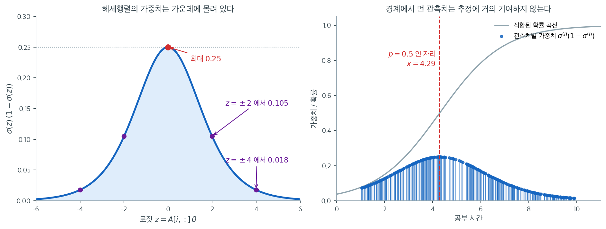

# 최대가능도 추정


## 교차엔트로피 손실의 기울기

교차엔트로피 손실은

$$
\ell = -\sum_{i=1}^{n}\bigl[y^{(i)}\log\sigma^{(i)} + (1-y^{(i)})\log(1-\sigma^{(i)})\bigr]
$$

이다. 시그모이드의 도함수 $\sigma'(z)=\sigma(z)(1-\sigma(z))$를 쓰면
$\boldsymbol{\theta}$에 대한 기울기가 깔끔한 행렬식으로 정리된다.

### 성분별 유도

$$
\frac{\partial\ell}{\partial\boldsymbol{\theta}}
= -\sum_{i=1}^{n}\left[
  \frac{y^{(i)}}{\sigma^{(i)}}\,\sigma^{(i)}(1-\sigma^{(i)})\,A[i,:]^\top
  - \frac{1-y^{(i)}}{1-\sigma^{(i)}}\,\sigma^{(i)}(1-\sigma^{(i)})\,A[i,:]^\top
\right]
$$

시그모이드 항이 약분되어

$$
\nabla\ell = \sum_{i=1}^{n}\bigl(\sigma^{(i)}-y^{(i)}\bigr)\,A[i,:]^\top
$$

만 남는다.

### 행렬 형태

잔차를 열벡터 $\boldsymbol{\sigma}-\mathbf{y}$로 쓰고 계획행렬의 행을 쌓으면

$$
\nabla\ell = A^\top(\boldsymbol{\sigma}-\mathbf{y})
$$

이다. 이는 제곱손실을 쓰는 선형회귀의 기울기와 같은 형태이며, 잔차
$\hat{\mathbf{y}}-\mathbf{y}$가 $\boldsymbol{\sigma}-\mathbf{y}$로 바뀐 것뿐이다.

## 헤세행렬

기울기를 한 번 더 미분하면

$$
\nabla^2\ell
= \sum_{i=1}^{n}\sigma^{(i)}(1-\sigma^{(i)})\;A[i,:]^\top\,A[i,:]
= A^\top B\, A
$$

이고, 여기서 $B$는 $n\times n$ 대각행렬

$$
B = \operatorname{diag}\!\bigl(\sigma^{(1)}(1-\sigma^{(1)}),\;\ldots,\;\sigma^{(n)}(1-\sigma^{(n)})\bigr)
$$

이다. $B$의 모든 대각원소가 $0<\sigma(1-\sigma)\le\tfrac14$을 만족하므로, 헤세행렬은 임의의
$\boldsymbol{\theta}$에 대해 **양반정치**이고 교차엔트로피 손실이 볼록임을 확인해 준다.

### 가중치가 말하는 것

$B$의 대각원소 $\sigma^{(i)}(1-\sigma^{(i)})$는 단순히 "양수라서 볼록하다"는 확인용 부품이
아니다. 이 값은 관측치 $i$가 추정에 얼마나 기여하는지를 재는 저울이다. 아래 그림의 왼쪽이 그
저울의 모양이고, 오른쪽은 같은 저울을 19.1절의 공부 시간 자료 300건에 얹어 본 것이다.



왼쪽에서 보듯 가중치는 $z=0$, 즉 $p=0.5$에서 최대 $0.25$를 찍고 양쪽으로 빠르게 줄어든다.
$z=\pm 2$($p \approx 0.12$ 또는 $0.88$)에서 이미 $0.105$로 절반 아래이고, $z=\pm 4$
($p \approx 0.018$)에서는 $0.018$로 최댓값의 $7\%$에 불과하다. 헤세행렬
$A^TBA$는 이 가중치로 잰 $A[i,:]^TA[i,:]$의 합이므로, 모형이 이미 확신하고 있는 관측치는
곡률에 거의 아무것도 보태지 않는다.

오른쪽 그림이 그 결과다. 적합된 모형에서 $p=0.5$가 되는 자리는 공부 시간 $x = 4.29$이고,
가중치 막대가 그 근처에서 가장 높다. 예측확률이 $0.25$와 $0.75$ 사이인 관측치는 92건으로
전체의 $30.7\%$뿐인데, 이들이 총 가중치의 $53.0\%$를 차지한다. 반대로 $\hat p$가 $0.05$보다
작거나 $0.95$보다 큰 64건은 전체의 $21.3\%$나 되지만 가중치 합에서는 $4.5\%$밖에 기여하지
못한다. 10시간을 공부해 거의 확실히 합격하는 학생은 계수를 정하는 데 사실상 발언권이 없다.

이 사실은 실무적으로 두 가지를 함의한다. 첫째, 로지스틱 회귀의 표준오차는 표본크기 $n$보다
**경계 근처에 놓인 관측치의 수**에 더 민감하다. 사건이 아주 드문 자료에서 $n$을 늘려도 표준오차가
잘 줄지 않는 이유가 여기에 있다. 둘째, $\|\boldsymbol{\theta}\|$가 커져 모든 $\hat p$가 0이나
1로 몰리면 $B \to 0$이 되어 헤세행렬이 무너진다. 완전분리에서 표준오차가 폭발하는 현상과
[뉴턴-랩슨](algorithms.md)이 발산하는 현상은 모두 이 한 장의 그림에서 읽힌다.

## 경사하강

1차 갱신식은

$$
\boldsymbol{\theta} \leftarrow \boldsymbol{\theta} - \alpha\,\nabla\ell
= \boldsymbol{\theta} - \alpha\,A^\top(\boldsymbol{\sigma}-\mathbf{y})
$$

이며, $\alpha$는 학습률이다.

## 뉴턴법과 IRLS

뉴턴(2차) 갱신은 헤세행렬을 이용한다.

$$
\boldsymbol{\theta}
= \boldsymbol{\theta}_0 - (A^TBA)^{-1}\,A^\top(\boldsymbol{\sigma}-\mathbf{y})
$$

이는 **가중최소제곱**의 정규방정식으로 다시 쓸 수 있다. *작업 반응변수*를

$$
\mathbf{z} = A\boldsymbol{\theta}_0 - B^{-1}(\boldsymbol{\sigma}-\mathbf{y})
$$

로 정의하면 갱신식은

$$
\boldsymbol{\theta} = (A^TBA)^{-1}\,A^TB\,\mathbf{z}
$$

가 된다. 이는 가중최소제곱 문제
$\min_{\boldsymbol{\theta}}\|B^{1/2}(\mathbf{z}-A\boldsymbol{\theta})\|^2$의 해와 정확히 같다.

### 반복재가중최소제곱(IRLS)

가중행렬 $B$가 (($\boldsymbol{\sigma}$를 통해) 현재의 모수벡터 $\boldsymbol{\theta}$에
의존하므로, 정규방정식을 반복 적용하며 각 단계에서 $B$와 $\mathbf{z}$를 다시 계산해야 한다.
이 절차를 **반복재가중최소제곱(IRLS)**이라 한다(Rubin, 1983).

!!! info "IRLS 알고리즘"

    1. $\boldsymbol{\theta}_0$을 초기화한다.
    2. $\boldsymbol{\sigma} = \sigma(A\boldsymbol{\theta}_0)$을 계산한다.
    3. $B = \operatorname{diag}(\sigma^{(i)}(1-\sigma^{(i)}))$을 만든다.
    4. 작업 반응변수 $\mathbf{z} = A\boldsymbol{\theta}_0 - B^{-1}(\boldsymbol{\sigma}-\mathbf{y})$
       를 계산한다.
    5. $\boldsymbol{\theta} = (A^TBA)^{-1}A^TB\mathbf{z}$를 푼다.
    6. $\boldsymbol{\theta}_0 \leftarrow \boldsymbol{\theta}$로 놓고 수렴할 때까지 반복한다.

IRLS는 보통 적은 반복으로 수렴하며, 많은 고전적 로지스틱 회귀 해법기의 바탕이 되는
알고리즘이다.

## 구현: 경사하강으로 하는 로지스틱 회귀

다음 NumPy 구현은 1차 경사하강만으로 로지스틱 회귀를 처음부터 학습시킨다.

### 자료 적재

<div class="exbox" markdown>

**보기 1.** <span class="diff easy" title="쉬움"></span> 이 자료는 분리되기 직전이다. 보험 가입 여부 자료 $27$건을 읽어 절반씩 나눈다. 설명변수는 나이 하나다.

**(1)** 훈련자료를 나이순으로 늘어놓았을 때, 두 범주를 세로선 하나로 완전히 가를 수 있는가? 가르지 못하게 막는 관측이 몇 개이며 어느 것인가?

**(2)** 그 관측을 지우면 최대가능도추정이 어떻게 되는지 확인하시오.

</div>

??? success "풀이"

    **(1) 해석적으로.** `train_size=0.5`에 $n = 27$이므로 훈련 $\lfloor 13.5\rfloor = 13$건, 시험 $14$건이다. 훈련자료를 나이순으로 늘어놓으면

    $$
    22^{(0)}\;23^{(0)}\;25^{(0)}\;\mathbf{25^{(1)}}\;27^{(0)}\;28^{(0)}
    \;\Big|\;
    50^{(1)}\;54^{(1)}\;55^{(1)}\;56^{(1)}\;60^{(1)}\;61^{(1)}\;62^{(1)}
    $$

    이다(위첨자가 가입 여부). 나이 $28$과 $50$ 사이 어디에 선을 그어도 **굵게 쓴 $(25, 1)$ 하나만 틀린다.** 가르지 못하게 막는 관측이 정확히 하나다.

    **그 하나를 지우면 자료가 완전히 분리된다.** 그러면 최대가능도추정이 **존재하지 않는다.** 까닭은 이렇다. 어떤 $(\beta_0, \beta_1)$이 모든 관측을 옳은 쪽에 놓는다고 하자. 곧 모든 $i$에 대해

    $$
    y_i = 1 \Rightarrow \beta_0 + \beta_1 x_i > 0,
    \qquad
    y_i = 0 \Rightarrow \beta_0 + \beta_1 x_i < 0
    $$

    이다. 그러면 $c > 1$에 대해 $(c\beta_0, c\beta_1)$은 모든 선형예측자의 절댓값을 $c$배로 키우므로 모든 $\hat p_i$를 옳은 끝($0$ 또는 $1$)에 더 가깝게 민다. 따라서

    $$
    \ell(c\boldsymbol\beta) > \ell(\boldsymbol\beta)
    \quad\text{이고}\quad
    \ell(c\boldsymbol\beta) \uparrow 0 \;(c \to \infty)
    $$

    이다. **로그가능도가 위로 $0$에 점근하며 끝없이 커지되 $0$에 닿지 못하므로 최대가 달성되지 않는다.** 계수가 무한으로 발산한다. 이것이 정칙화가 필요한 가장 분명한 이유다.

    **(2) 수치적으로.**

    ```python
    import pandas as pd
    from sklearn.model_selection import train_test_split

    def load_data(seed=1):
        """보험 가입 여부 자료를 읽어 훈련·시험으로 나눈다.

        설명변수는 나이 하나, 반응은 가입 여부(0/1)다. 자료가 27건뿐이라
        절반씩 나눈다.
        """
        url = ('https://raw.githubusercontent.com/codebasics/py/'
               '3ee4bde332ae7a10499c2679900094fa22ae191f/ML/7_logistic_reg/insurance_data.csv')
        df = pd.read_csv(url)
        x = df[['age']].values.reshape((-1, 1))
        y = df.bought_insurance.values.reshape((-1,))
        x_train, x_test, y_train, y_test = train_test_split(
            x, y, train_size=0.5, random_state=seed)
        return x_train, x_test, y_train, y_test


    import numpy as np
    import statsmodels.api as sm

    x_tr, x_te, y_tr, y_te = load_data()
    print(f"훈련 {len(y_tr)}건(가입 {y_tr.sum()}, 비율 {y_tr.mean():.4f}),  "
          f"시험 {len(y_te)}건(가입 {y_te.sum()}, 비율 {y_te.mean():.4f})")
    order = np.argsort(x_tr.ravel())
    print("나이순:", list(zip(x_tr.ravel()[order].tolist(), y_tr[order].tolist())))

    # (25, 1) 하나를 빼면 완전분리가 된다.
    keep = ~((x_tr.ravel() == 25) & (y_tr == 1))
    x2, y2 = x_tr[keep], y_tr[keep]
    A2 = sm.add_constant(x2)
    for mi in (50, 500, 5000):
        res = sm.Logit(y2, A2).fit(disp=0, maxiter=mi)
        print(f"maxiter {mi:5d}  beta = {np.round(res.params, 4)}  "
              f"loglik = {res.llf:.3e}  수렴 {res.mle_retvals['converged']}")
    ```

    출력:

    ```
    훈련 13건(가입 8, 비율 0.6154),  시험 14건(가입 6, 비율 0.4286)
    나이순: [(22, 0), (23, 0), (25, 0), (25, 1), (27, 0), (28, 0), (50, 1), (54, 1), (55, 1), (56, 1), (60, 1), (61, 1), (62, 1)]
    maxiter    50  beta = [-183.0834    5.076 ]  loglik = 0.000e+00  수렴 False
    maxiter   500  beta = [-183.0834    5.076 ]  loglik = 0.000e+00  수렴 False
    maxiter  5000  beta = [-183.0834    5.0762]  loglik = 0.000e+00  수렴 False
    ```

    (`statsmodels`가 `Maximum Likelihood optimization failed to converge` 경고를 함께 낸다.)

    **유도한 대로다.** 점 하나를 지우자 추정값이 $\hat\beta_1 = 5.08$까지 치솟고 로그가능도가 정확히 $0$, 곧 가능도가 $1$이 되었다. 완전한 적합이다. `maxiter`를 $100$배로 늘려도 같은 자리에서 멈추는데, **최대를 찾아서가 아니라 $\hat p_i$가 수치적으로 $0$과 $1$에 포화되어 기울기가 반올림으로 $0$이 되었기 때문이다.** 돌려받은 $-183.08$과 $5.076$은 "답"이 아니라 부동소수점이 멈춘 자리다. 결정경계만 $183.0834/5.076 = 36.07$로 뜻이 있고, 이는 $28$과 $50$ 사이 어디로 잡아도 되는 임의의 한 점이다.

    원래 자료에는 $(25, 1)$이 남아 있어 분리가 깨지므로 최대가능도추정이 **존재한다.** 보기 3에서 그 값을 구한다.

    덧붙여 `stratify`를 주지 않은 탓에 가입 비율이 훈련 $0.6154$, 시험 $0.4286$으로 꽤 갈렸다. $27$건을 반으로 나누면서 생긴 흔들림이며, 전체 비율은 $14/27 = 0.5185$다.

### 모형 클래스

<div class="exbox" markdown>

**보기 2.** <span class="diff easy" title="쉬움"></span> 왜 지역최소를 걱정하지 않아도 되는가. 아래 클래스는 `gradient()`로 $A^\top(\mathbf p - \mathbf y)$를 돌려주고 그것만으로 경사하강을 돈다.

**(1)** 음의 로그가능도의 기울기가 정말 $A^\top(\mathbf p - \mathbf y)$임을 유도하고, 헤세행렬이 $A^\top W A$($W = \operatorname{diag}(p_i(1-p_i))$)로 **반양정치**임을 보이시오. 그래서 무엇이 보장되는가?

**(2)** 이 자료에서 헤세행렬을 계산해 고유값을 구하고, `loss()`와 `gradient()`가 서로 **같은 함수의 값과 기울기인지** 확인하시오.

</div>

??? success "풀이"

    **(1) 해석적으로.** 관측 하나의 로그가능도는 $z_i = \mathbf a_i^\top\boldsymbol\theta$, $p_i = \sigma(z_i)$에 대해

    $$
    \ell_i = y_i\log p_i + (1-y_i)\log(1-p_i)
    $$

    이다. 시그모이드의 미분이 $\sigma'(z) = \sigma(z)\bigl(1-\sigma(z)\bigr) = p(1-p)$이므로 연쇄법칙으로

    $$
    \frac{\partial \ell_i}{\partial z_i}
    = \left[\frac{y_i}{p_i} - \frac{1-y_i}{1-p_i}\right] p_i(1-p_i)
    = y_i(1-p_i) - (1-y_i)p_i
    = y_i - p_i
    $$

    가 된다. **$p_i(1-p_i)$가 통째로 약분된다.** 분모에 있던 $p_i$와 $1-p_i$가 시그모이드의 미분과 정확히 맞물린 결과이며, 지수족과 정준연결함수를 쓸 때 언제나 일어나는 일이다. 따라서

    $$
    \nabla_{\boldsymbol\theta}\,(-\ell) = -\sum_i (y_i - p_i)\,\mathbf a_i = A^\top(\mathbf p - \mathbf y)
    $$

    로 코드의 한 줄과 같다. **선형회귀의 $A^\top(A\boldsymbol\theta - \mathbf y)$와 꼴이 똑같되, $A\boldsymbol\theta$ 자리에 $\sigma(A\boldsymbol\theta)$가 들어간 것뿐이다.**

    한 번 더 미분하면

    $$
    H = \frac{\partial}{\partial\boldsymbol\theta} A^\top(\mathbf p - \mathbf y)
    = A^\top \operatorname{diag}\!\bigl(p_i(1-p_i)\bigr) A
    = A^\top W A
    $$

    이다. 임의의 벡터 $\mathbf v$에 대해

    $$
    \mathbf v^\top H \mathbf v = \mathbf v^\top A^\top W A \mathbf v
    = \lVert W^{1/2} A\mathbf v\rVert_2^2 \;\ge\; 0
    $$

    이므로 **$H$는 반양정치이고 음의 로그가능도는 볼록이다.** $0 < p_i < 1$이면 $W$가 양정치이므로, $A$의 열이 일차독립이기만 하면 $H$는 **엄격히** 양정치가 되어 함수가 엄격 볼록이다.

    **그래서 보장되는 것은 이것이다. 지역최소가 없다.** 볼록함수의 모든 정류점은 전역최소이므로, 어디서 출발하든 기울기가 $0$이 되는 곳에 닿기만 하면 그것이 답이다. 뉴턴법이 잘 듣는 것도 같은 이유다. (다만 보기 1에서 보았듯 **완전분리이면 정류점 자체가 없다.** 볼록성은 "최소가 여럿이 아니다"를 말할 뿐 "최소가 있다"를 말하지 않는다.)

    **(2) 수치적으로.**

    ```python
    import numpy as np

    class LogisticRegression:
        """경사하강법으로 로지스틱 회귀를 직접 구현한다.

        최대가능도 추정이 무엇을 하는 일인지 보이려고 풀어 쓴 것이다. 선형회귀와
        달리 닫힌 해가 없어 수치적으로 찾아야 한다.
        """

        def __init__(self, x, y, lr=2e-4, epochs=100_000, theta=None):
            self.x = x
            self.y = y
            self.lr = lr
            self.epochs = epochs
            self.theta = (theta if theta is not None
                          else np.random.normal(size=(x.shape[1] + 1, 1)))

        @staticmethod
        def design_matrix(x):
            """1 로 채운 열을 앞에 붙여 절편을 만든다."""
            ones = np.ones((x.shape[0], 1))
            return np.concatenate((ones, x), axis=1)

        @staticmethod
        def sigmoid(z):
            """실수 전체를 (0, 1) 로 눌러 담는다. 확률로 읽을 수 있게 하는 장치다."""
            return 1 / (1 + np.exp(-z))

        def predict_proba(self, x):
            A = self.design_matrix(x)
            z = A @ self.theta
            return self.sigmoid(z).reshape((-1,))

        def predict(self, x):
            p = self.predict_proba(x)
            return (p > 0.5).astype(float)

        def loss(self):
            """음의 로그가능도(교차엔트로피). 이것을 최소화하는 것이 곧 MLE 다.

            eps 를 더하는 것은 p 가 정확히 0 이나 1 이 될 때 로그가 발산하는 것을
            막기 위함이다.
            """
            p = self.predict_proba(self.x)
            eps = 1e-6
            return -np.mean(
                self.y * np.log(p + eps) + (1 - self.y) * np.log(1 - p + eps))

        def gradient(self):
            """기울기. 놀랍게도 선형회귀와 똑같은 꼴인 X'(p - y) 로 나온다.

            시그모이드의 미분과 로그가능도의 미분이 서로 약분되면서 이렇게 된다.
            일반화선형모형 전체에서 되풀이되는 구조다.
            """
            A = self.design_matrix(self.x)
            p = self.predict_proba(self.x).reshape((-1, 1))
            y = self.y.reshape((-1, 1))
            return A.T @ (p - y)

        def train(self):
            for _ in range(self.epochs):
                self.theta -= self.lr * self.gradient()


    # 헤세행렬 A^T W A 를 손으로 만들어 고유값을 본다.
    def hessian(theta, x=x_tr):
        A = LogisticRegression.design_matrix(x)
        p = LogisticRegression.sigmoid(A @ theta).ravel()
        return A.T @ np.diag(p * (1 - p)) @ A

    for name, th in [("초기값 (0, 0)", np.zeros((2, 1))),
                     ("최대가능도해", np.array([[-7.580328], [0.237100]]))]:
        ev = np.linalg.eigvalsh(hessian(th))
        print(f"{name:14s} 고유값 {ev[0]:.6f}, {ev[1]:.4f}  "
              f"조건수 {ev[1] / ev[0]:.1f}")

    # loss() 와 gradient() 가 같은 함수의 값·기울기인가?
    m = LogisticRegression(x_tr, y_tr, theta=np.array([[-7.0], [0.22]]))
    eps = 1e-6
    m.theta = np.array([[-7.0 + eps], [0.22]])
    f1 = m.loss()
    m.theta = np.array([[-7.0 - eps], [0.22]])
    f0 = m.loss()
    m.theta = np.array([[-7.0], [0.22]])
    print(f"\nloss() 의 수치미분(절편) = {(f1 - f0) / (2 * eps):.6f}")
    print(f"gradient() 의 첫 성분    = {m.gradient()[0, 0]:.6f}")
    print(f"비 = {m.gradient()[0, 0] / ((f1 - f0) / (2 * eps)):.4f}   "
          f"(훈련 자료 수 n = {len(y_tr)})")
    ```

    출력:

    ```
    초기값 (0, 0)     고유값 0.418688, 6632.3313  조건수 15840.8
    최대가능도해         고유값 0.034358, 631.4089  조건수 18377.3

    loss() 의 수치미분(절편) = 0.008564
    gradient() 의 첫 성분    = 0.111332
    비 = 12.9996   (훈련 자료 수 n = 13)
    ```

    **두 자리 모두 고유값이 양수여서 헤세행렬이 양정치다.** 유도한 볼록성이 확인되었고, 설명변수가 하나뿐이라 $A$의 두 열이 일차독립이므로 엄격 볼록이다. **지역최소를 걱정할 필요가 없다.**

    다만 **조건수가 $15{,}841$에서 $18{,}377$까지 나온다.** 나이가 $18$에서 $62$ 사이의 수라 계획행렬의 두 열(상수 $1$과 나이)의 크기가 크게 다르기 때문이다. 볼록이라고 해서 경사하강이 **빨리** 수렴한다는 뜻은 아니며, 이 조건수가 보기 3에서 문제를 일으킨다.

    마지막 두 줄이 코드의 작은 흠을 드러낸다. **`loss()`는 `np.mean`을 쓰고 `gradient()`는 합을 돌려준다.** 그래서 둘의 비가 $12.9996$, 곧 수치미분 오차 범위에서 정확히 $n = 13$이다. `gradient()`가 미분하는 함수는 `loss()`가 아니라 $n \times$`loss()`인 것이다. 볼록함수의 양의 배수는 여전히 볼록이고 최소점도 같으므로 **학습 결과는 틀리지 않지만**, 실효 학습률이 적어 놓은 `lr`의 $13$배라는 뜻이다. 또 `loss()`에 더한 `eps = 1e-6`도 목적함수를 아주 조금 바꾸므로, 손실을 모니터링하는 용도 말고 수렴 판정에 쓰면 안 된다.

### 학습

<div class="exbox" markdown>

**보기 3.** <span class="diff easy" title="쉬움"></span> $10$만 번은 모자란다. 기본값 `lr=2e-4`, `epochs=100_000`으로 경사하강을 돌린다.

**(1)** 보기 2에서 최대가능도해의 헤세행렬 고유값이 $\lambda_{\min} = 0.034358$, $\lambda_{\max} = 631.41$이었다. 이 학습률이 **안정한지** 판정하고, $10$만 번 뒤에 오차가 얼마나 남는지 계산하시오.

**(2)** 실제로 돌려 확인하고, 반복을 $100$만 번으로 늘리면 어떻게 되는지 보이시오.

</div>

??? success "풀이"

    **(1) 해석적으로.** 최소점 $\hat{\boldsymbol\theta}$ 근처에서 목적함수를 이차로 근사하면 경사하강의 갱신은 헤세행렬의 고유벡터 방향마다 따로 움직이고, 고유값 $\lambda$인 방향의 오차는 한 걸음마다

    $$
    e \;\leftarrow\; (1 - \alpha\lambda)\,e
    $$

    로 줄어든다. 그러므로 **안정 조건**은 모든 방향에서 $\lvert 1 - \alpha\lambda\rvert < 1$, 곧

    $$
    \alpha < \frac{2}{\lambda_{\max}} = \frac{2}{631.41} = 0.003168
    $$

    이다. $\alpha = 2\times10^{-4}$는 이보다 작으므로 **발산하지는 않는다.**

    문제는 반대쪽이다. 가장 느린 방향의 축소율이

    $$
    1 - \alpha\lambda_{\min} = 1 - 2\times10^{-4}\times 0.034358 = 0.9999931
    $$

    이라 $10$만 걸음 뒤에 남는 오차가

    $$
    (0.9999931)^{100000} = e^{-0.68716} = 0.5030
    $$

    이다. **절반이 그대로 남는다.** $1000$분의 $1$로 줄이려면

    $$
    k = \frac{\log 1000}{\alpha\lambda_{\min}} = \frac{6.9078}{6.8716\times10^{-6}} \approx 1.0\times10^{6}
    $$

    번, 곧 $100$만 번이 필요하다. **$10$만 번은 한 자릿수 모자란다.**

    느린 방향이 있는 까닭은 조건수 $18{,}377$이다. 나이를 표준화하면 조건수가 두 자릿수로 떨어져 같은 문제가 사라진다.

    **(2) 수치적으로.**

    ```python
    # 직접 구현한 모형으로 적합한다. 학습률이 작고 반복이 10만 번이라 시간이 걸린다.
    x_train, x_test, y_train, y_test = load_data()

    # __init__ 이 theta 를 np.random.normal 로 뽑으므로 씨앗을 고정해야
    # 결과를 되풀이할 수 있다.
    np.random.seed(0)
    model = LogisticRegression(x_train, y_train)
    model.train()

    y_pred = model.predict(x_test)
    y_prob = model.predict_proba(x_test)

    import statsmodels.api as sm

    A = sm.add_constant(x_train)
    mle = sm.Logit(y_train, A).fit(disp=0).params
    nll = lambda t: -np.sum(
        y_train * np.log(1 / (1 + np.exp(-(A @ t))))
        + (1 - y_train) * np.log(1 - 1 / (1 + np.exp(-(A @ t)))))

    print(f"10만 번 뒤 theta = {np.round(model.theta.ravel(), 6)}")
    print(f"         NLL  = {nll(model.theta.ravel()):.6f}")
    print(f"         기울기 = {np.round(model.gradient().ravel(), 6)}  "
          f"(0 이어야 한다)")

    # 100만 번으로 늘려 본다.
    np.random.seed(0)
    long_model = LogisticRegression(x_train, y_train, epochs=1_000_000)
    long_model.train()
    print(f"\n100만 번 뒤 theta = {np.round(long_model.theta.ravel(), 6)}")
    print(f"          NLL   = {nll(long_model.theta.ravel()):.6f}")

    print(f"\n최대가능도해        = {np.round(mle, 6)}")
    print(f"          NLL   = {nll(mle):.6f}")

    # 씨앗을 바꾸면 10만 번 결과가 달라진다 — 미수렴의 증거다.
    for s in (1, 2, 7):
        np.random.seed(s)
        m = LogisticRegression(x_train, y_train)
        m.train()
        print(f"씨앗 {s}: theta = {np.round(m.theta.ravel(), 6)}, "
              f"NLL = {nll(m.theta.ravel()):.6f}")
    ```

    출력:

    ```
    10만 번 뒤 theta = [-6.31561   0.193328]
             NLL  = 2.871060
             기울기 = [ 0.069215 -0.002281]  (0 이어야 한다)

    100만 번 뒤 theta = [-7.578611  0.237038]
              NLL   = 2.833261

    최대가능도해        = [-7.580328  0.2371  ]
              NLL   = 2.833261
    씨앗 1: theta = [-6.319317  0.19345 ], NLL = 2.870803
    씨앗 2: theta = [-6.393905  0.195917], NLL = 2.865875
    씨앗 7: theta = [-6.317316  0.193384], NLL = 2.870942
    ```

    **유도가 맞았다. $10$만 번으로는 수렴하지 않는다.** 멈춘 자리의 기울기가 $(0.0692,\ -0.0023)$으로 $0$이 아니고, 추정값 $(-6.3156,\ 0.19333)$이 최대가능도해 $(-7.5803,\ 0.23710)$에서 한참 떨어져 있다. 절편의 오차가 $1.26$인데, 이는 처음 거리의 대략 절반이 남은 것이어서 계산한 $0.5030$과 어울린다.

    **씨앗을 바꾸면 답이 달라진다는 것이 결정적 증거다.** 목적함수가 엄격 볼록이라 최소점은 하나뿐인데도 씨앗마다 $-6.3156$, $-6.3193$, $-6.3939$, $-6.3173$으로 갈린다. **수렴했다면 출발점은 아무 흔적도 남기지 않아야 한다.** 남아 있다는 것은 아직 도착하지 않았다는 뜻이다.

    반복을 $100$만 번으로 늘리면 $(-7.5786,\ 0.23704)$로 최대가능도해와 소수 셋째 자리까지 맞고 NLL이 $2.833261$로 같아진다. **유도한 "$100$만 번이 필요하다"가 그대로 확인된다.**

    고칠 길은 세 가지다. 반복을 늘리거나, 나이를 표준화해 조건수를 낮추거나, 아예 곡률을 쓰는 방법(뉴턴법·IRLS)으로 갈아타는 것이다. 보기 4의 `lbfgs`가 세 번째 길이고, 그래서 $10$만 번이 아니라 수십 번이면 끝난다.

## 구현: scikit-learn으로 하는 로지스틱 회귀

비교를 위해 같은 작업을 `sklearn`으로 하면 다음과 같다.

<div class="exbox" markdown>

**보기 4.** <span class="diff easy" title="쉬움"></span> 정말 "같은 일"인가. 같은 자료에 scikit-learn의 `LogisticRegression(solver='lbfgs')`를 적합한다.

**(1)** 이 호출이 보기 3의 직접 구현과 **같은 목적함수를 최소화하는가?** 기본 설정 가운데 무엇이 다른지 짚고, 그 차이가 목적함수에 더하는 양을 수로 적으시오.

**(2)** 네 가지 추정값(직접 구현 $10$만 번, 직접 구현 $100$만 번, sklearn 기본, sklearn `penalty=None`)을 음의 로그가능도로 줄 세우고, 시험자료 정확도를 견주시오.

</div>

??? success "풀이"

    **(1) 해석적으로. 같지 않다.** `LogisticRegression`의 기본값은 `penalty='l2'`, `C=1.0`이므로 최소화하는 것은

    $$
    -\ell(\boldsymbol\beta) + \frac{1}{2C}\lVert\boldsymbol\beta_{\text{기울기}}\rVert_2^2
    = -\ell(\boldsymbol\beta) + \tfrac12\beta_1^2
    $$

    이다(절편은 벌점을 받지 않는다). 직접 구현은 $-\ell$만 최소화하므로 **직접 구현이 최대가능도이고 sklearn 기본값은 아니다.** "같은 일을 세 줄로"라고 말하려면 `penalty=None`을 주어야 한다.

    벌점의 크기를 재 보면 $\hat\beta_1 \approx 0.237$이므로

    $$
    \tfrac12 \times 0.237^2 = 0.0281
    $$

    이다. 음의 로그가능도 $2.833$에 견주면 $1\%$ 수준이라 작아 보이지만, **계수를 $3\%$ 옮기기에는 충분하다.** 훈련자료가 $13$건뿐이라 자료항이 작기 때문이다.

    **(2) 수치적으로.**

    ```python
    # 같은 일을 sklearn 으로 하면 세 줄이면 된다. lbfgs 는 기울기뿐 아니라
    # 곡률까지 어림해 쓰므로 경사하강법보다 훨씬 빨리 수렴한다.
    from sklearn.linear_model import LogisticRegression

    model = LogisticRegression(solver='lbfgs')
    model.fit(x_train, y_train)

    y_pred = model.predict(x_test)
    y_prob = model.predict_proba(x_test)[:, 1]

    no_pen = LogisticRegression(penalty=None, solver='lbfgs',
                                max_iter=10000).fit(x_train, y_train)

    rows = [
        ("직접구현 10만",  model_theta := np.array([-6.315610, 0.193328])),
        ("직접구현 100만", np.array([-7.578611, 0.237038])),
        ("sklearn C=1",   np.r_[model.intercept_[0], model.coef_[0][0]]),
        ("penalty=None",  np.r_[no_pen.intercept_[0], no_pen.coef_[0][0]]),
    ]
    print(f"{'방법':14s} {'절편':>10s} {'기울기':>9s} {'NLL':>9s} "
          f"{'벌점':>8s} {'목적함수':>9s}")
    for name, t in rows:
        pen = 0.5 * t[1] ** 2
        print(f"{name:14s} {t[0]:10.5f} {t[1]:9.6f} {nll(t):9.6f} "
              f"{pen:8.5f} {nll(t) + pen:9.6f}")

    print(f"\n결정경계   sklearn {-model.intercept_[0] / model.coef_[0][0]:.4f}   "
          f"무벌점 {-no_pen.intercept_[0] / no_pen.coef_[0][0]:.4f}")
    print(f"시험 정확도 sklearn {model.score(x_test, y_test):.4f}   "
          f"무벌점 {no_pen.score(x_test, y_test):.4f}")
    print(f"두 모형의 시험 예측이 모두 같은가: "
          f"{bool(np.all(model.predict(x_test) == no_pen.predict(x_test)))}")
    ```

    출력:

    ```
    방법                     절편       기울기       NLL       벌점      목적함수
    직접구현 10만         -6.31561  0.193328  2.871060  0.01869  2.889748
    직접구현 100만        -7.57861  0.237038  2.833261  0.02809  2.861355
    sklearn C=1      -7.36199  0.228922  2.834167  0.02620  2.860369
    penalty=None     -7.58041  0.237104  2.833261  0.02811  2.861370

    결정경계   sklearn 32.1594   무벌점 31.9709
    시험 정확도 sklearn 0.8571   무벌점 0.8571
    두 모형의 시험 예측이 모두 같은가: True
    ```

    **줄 세우기가 유도를 그대로 확인해 준다.**

    **NLL 칸**에서는 `penalty=None`과 직접구현 $100$만 번이 $2.833261$로 공동 최소다. 둘이 같은 문제를 풀었기 때문이다. sklearn 기본값은 $2.834167$로 $0.0009$ 뒤지고, 직접구현 $10$만 번은 $2.871060$으로 한참 뒤진다.

    **목적함수 칸**에서는 순서가 뒤집힌다. $-\ell + \frac12\beta_1^2$로 재면 sklearn 기본값의 $2.860369$가 가장 작고 `penalty=None`의 $2.861370$이 그보다 크다. **두 모형 다 자기가 푸는 문제에서는 이기고 있는 셈이며, 어느 쪽이 "더 잘 적합되었는가"는 어느 자를 드느냐에 달렸다.** 벌점 하나 때문에 기울기가 $0.237104 \to 0.228922$로 $3.5\%$ 줄었다.

    다만 **시험자료에서는 셋이 구별되지 않는다.** 결정경계가 $31.97$과 $32.16$으로 $0.19$세밖에 차이 나지 않고, 그 사이에 떨어진 시험 관측이 없어 $14$건의 예측이 전부 같다. 정확도도 $0.8571$($12/14$)로 같다. **훈련 $13$건짜리 자료에서 벌점의 유무는 계수에서는 보이고 예측에서는 보이지 않는다.**

    끝으로 속도를 적어 둔다. `lbfgs`는 **곡률을 어림해 쓰는 준뉴턴법**이라 수십 번의 반복으로 보기 3이 $100$만 번에 겨우 닿은 자리에 도착한다. 보기 2에서 본 조건수 $18{,}377$이 1차 방법에는 치명적이지만 2차 방법에는 거의 영향을 주지 않기 때문이다.

scikit-learn의 `LogisticRegression`은 기본적으로 L-BFGS(준뉴턴법)를 쓰는데, 헤세행렬을 명시적으로
만들거나 역행렬을 구하지 않고 근사한다. 자료가 작을 때는 `solver='newton-cg'` 옵션이 정확한
뉴턴 단계를 밟으며, 이는 IRLS와 동등하다.

## 연습문제

<div class="drillbox" markdown>

**연습문제 1.** <span class="diff easy" title="쉬움"></span>
로지스틱 회귀의 MLE

관측치 4개 $(x_1, y_1) = (1, 0)$, $(x_2, y_2) = (2, 0)$, $(x_3, y_3) = (3, 1)$,
$(x_4, y_4) = (4, 1)$과 모형 $\log\frac{p}{1-p} = \beta_0 + \beta_1 x$가 주어졌다.

**(a)** 로그가능도를 $\beta_0$과 $\beta_1$의 함수로 쓰라.

**(b)** 닫힌 형태의 해가 없고 수치 최적화가 필요한 이유를 설명하라.

**(c)** 파이썬으로 $\hat{\beta}_0$과 $\hat{\beta}_1$을 구하라. 그 결과를 신뢰할 수 있는가?

</div>

??? success "풀이"

    **(a)** $p_i = \frac{1}{1 + e^{-(\beta_0 + \beta_1 x_i)}}$이고

    $\ell(\beta_0, \beta_1) = \sum_{i=1}^4 \left[y_i \log p_i + (1-y_i)\log(1-p_i)\right]$

    $= \log(1-p_1) + \log(1-p_2) + \log p_3 + \log p_4$

    **(b)** 점수방정식 $\frac{\partial \ell}{\partial \beta_0} = 0$,
    $\frac{\partial \ell}{\partial \beta_1} = 0$에는 $\beta$의 비선형함수인 $p_i$가 들어 있어
    대수적으로 풀 수 없다.

    **(c)**

    ```python
    from sklearn.linear_model import LogisticRegression
    import numpy as np

    X = np.array([[1], [2], [3], [4]])
    y = np.array([0, 0, 1, 1])

    model = LogisticRegression(penalty=None, solver='lbfgs')
    model.fit(X, y)
    print(f"beta0 = {model.intercept_[0]:.4f}")
    print(f"beta1 = {model.coef_[0][0]:.4f}")
    ```

    출력:

    ```
    beta0 = -47.5544
    beta1 = 18.8115
    ```

    출력은 $\hat\beta_0 = -47.5544$, $\hat\beta_1 = 18.8115$이다.

    **아니다. 이 결과는 신뢰할 수 없다.** 이 자료는 **완전히 분리 가능**하다.
    $x \le 2$이면 $y = 0$, $x \ge 3$이면 $y = 1$이므로 $x = 2.5$를 기준으로 두 범주가 오차 없이
    갈린다. [가능도 절의 연습문제 5](../logistic_regression/likelihood.md)에서 보았듯이,
    분리 가능한 자료에서는 $\|\boldsymbol{\beta}\| \to \infty$일 때 로그가능도가 상한 0에
    한없이 가까워질 뿐 최댓값에 도달하지 않는다. 즉 **MLE가 존재하지 않는다.**

    위에서 나온 $18.8115$라는 값은 어떤 최대점이 아니라, L-BFGS가 기울기 크기가 허용오차 아래로
    떨어졌다고 판단해 16회 반복 만에 멈춘 지점일 뿐이다. `max_iter`를 100에서 100,000으로
    늘려도 값이 그대로인 것은 수렴했기 때문이 아니라 같은 곳에서 같은 이유로 멈추기 때문이다.
    허용오차를 더 조이면 계수는 계속 커진다.

    **올바른 대응:** 벌점을 명시적으로 넣는다. 예컨대 기본 L2 벌점(`C=1.0`)을 쓰면
    $\hat\beta_0 = -2.3955$, $\hat\beta_1 = 0.9582$로 유한하고 안정적인 값을 얻는다. 다만 이는
    MLE가 아니라 사후최빈값(MAP) 추정치이며, 이 자료로부터 "기울기가 $0.96$이다"라고 말할 수는
    없다. 관측치 4개로 분리된 자료가 알려 주는 것은 문턱이 2와 3 사이 어딘가에 있다는 사실뿐이다.
    $\square$

<div class="drillbox" markdown>

**연습문제 2.** <span class="diff med" title="중간"></span>
기울기 $\nabla\ell = A^\top(\boldsymbol{\sigma}-\mathbf{y})$의 첫 성분(절편에 대응)을 0으로 놓으면
무엇을 얻는가? 이 항등식이 로지스틱 회귀의 보정에 대해 무엇을 말해 주는지 설명하라.

</div>

??? success "풀이"

    $A$의 첫 열은 1로만 이루어져 있으므로 기울기의 첫 성분은

    $$
    \sum_{i=1}^n \bigl(\sigma^{(i)} - y^{(i)}\bigr) = 0
    \quad\Longleftrightarrow\quad
    \frac{1}{n}\sum_{i=1}^n \sigma^{(i)} = \bar{y}
    $$

    이다. 즉 **절편을 포함한** 로지스틱 회귀의 MLE에서는 예측확률의 평균이 관측된 사건 비율과
    정확히 같다.

    이것은 무료로 얻는 보정 조건이다. 모형은 적어도 **전체 수준에서는** 항상 완벽히 보정되어
    있다. 100건을 예측했는데 예측확률의 합이 30이라면 실제 사건도 정확히 30건이다.

    다만 이는 전체 평균에 대한 진술일 뿐이며, **부분집단별 보정**은 전혀 보장하지 않는다.
    예측확률이 0.1 근처인 사례들의 실제 발생률이 0.1인지는 별도로 확인해야 하고, 그것이 보정
    곡선과 브라이어 점수가 필요한 이유다(19.3절). 또한 절편을 빼거나 정칙화를 걸면 이 항등식은
    깨진다. 라쏘·능형 로지스틱 회귀에서 예측확률의 평균이 $\bar{y}$와 어긋나는 것은 버그가
    아니라 벌점의 당연한 결과다. $\square$

<div class="drillbox" markdown>

**연습문제 3.** <span class="diff med" title="중간"></span>
경사하강의 학습률 상한을 헤세행렬로부터 유도하라. 위 코드가 `lr=2e-4`라는 작은 값을 쓰는
이유를 설명하라.

</div>

??? success "풀이"

    $\nabla^2 \ell = A^\top B A$이고 $B$의 대각원소가 $\le 1/4$이므로

    $$
    \nabla^2 \ell \preceq \tfrac{1}{4} A^\top A
    \quad\Longrightarrow\quad
    L := \lambda_{\max}(\nabla^2 \ell) \le \tfrac{1}{4}\lambda_{\max}(A^\top A)
    $$

    이다. 여기서 $L$은 기울기의 립시츠 상수다. 볼록·$L$-평활 함수에 대한 경사하강은
    $\alpha < 2/L$일 때 수렴하고, $\alpha = 1/L$이 표준적인 선택이다.

    위 코드의 설명변수는 나이(age)로, 척도화하지 않은 수십 단위의 값이다. 절편 열을 포함하면
    $A^\top A$의 최대 고유값은 $\sum_i x_i^2$ 수준이므로, 나이가 수십이고 $n$이 수십이면
    $10^4$을 훌쩍 넘는다. 따라서

    $$
    \alpha \lesssim \frac{4}{\lambda_{\max}(A^TA)} \sim 10^{-4}
    $$

    가 되어 `lr=2e-4`라는 값이 나온다. 이 때문에 반복도 100,000회나 필요하다.

    **더 나은 해법은 표준화다.** $x$를 표준화하면 $\lambda_{\max}(A^TA) \approx n$이 되어
    허용 학습률이 세 자릿수 커지고, 같은 정확도에 훨씬 적은 반복으로 도달한다. 뉴턴법과 IRLS가
    이 문제를 겪지 않는 이유도 같다. 헤세행렬의 역을 곱하는 것이 곧 좌표계를 자동으로
    재척도화하는 일이기 때문이다. $\square$

<div class="drillbox" markdown>

**연습문제 4.** <span class="diff med" title="중간"></span>
`loss` 메서드는 $\varepsilon = 10^{-6}$을 로그 안에 더하지만 `gradient` 메서드는 그런 보정을
하지 않는다. 이 불일치가 문제를 일으키는가? 답을 정당화하라.

</div>

??? success "풀이"

    **최적화 자체에는 문제가 없다.** 갱신식은 `gradient`만 사용하고 `loss`는 진행 상황을
    보고하는 데만 쓰이기 때문이다. 그리고 참 기울기 $A^\top(\boldsymbol{\sigma}-\mathbf{y})$는
    $\sigma^{(i)}$가 0이나 1에 가까워져도 수치적으로 안전하다. 로그가 등장하지 않으므로 발산할
    항이 없고, 최악의 경우에도 각 잔차의 절댓값은 1 이하다.

    **그러나 보고되는 숫자는 신뢰할 수 없다.** `loss`가 돌려주는 값은 실제 목적함수가 아니라
    $\varepsilon$으로 잘린 근사값이다. 확신에 찬 오답 하나가 참 손실에 $30$ 이상을 기여할 수
    있는 상황에서도 $\varepsilon$ 판본은 $-\log(10^{-6}) = 13.8$에서 멈춘다. 손실 곡선으로
    수렴을 판정하거나 모형을 비교한다면 이 절단이 결론을 바꿀 수 있다.

    이 비대칭 자체가 하나의 교훈이다. 최적화는 기울기만 필요로 하므로 잘 굴러가지만, 사람이
    보는 진단값은 조용히 왜곡된다. 올바른 수정은 `np.logaddexp`를 이용해 로짓에서 직접 손실을
    계산하는 것이다.

    ```python
    def loss(self):
        A = self.design_matrix(self.x)
        z = (A @ self.theta).reshape((-1,))
        # -log sigma(z) = softplus(-z),  -log(1 - sigma(z)) = softplus(z)
        return np.mean(np.logaddexp(0, z) - self.y * z)
    ```

    $\square$

---

## 정리하며

점수함수가 **놀랍도록 단순한 형태**로 나온다.

$$
\nabla\ell(\boldsymbol\theta)=\mathbf X^\top(\mathbf y-\mathbf p)
$$

- **잔차와 설명변수의 곱이다.** 선형회귀의 정규방정식 $\mathbf X^\top(\mathbf y-\mathbf X\boldsymbol\beta)=\mathbf 0$ 과 **같은 모양**이며, 적합값이 $\mathbf X\boldsymbol\beta$ 에서 $\mathbf p$ 로 바뀐 것뿐이다.
- **일반화선형모형의 공통 구조다.** 연결함수가 정준일 때 점수함수가 언제나 이 꼴이 된다.
- **그래도 비선형이다.** $\mathbf p$ 가 $\boldsymbol\theta$ 의 비선형 함수라 닫힌 형태로 풀리지 않는다.
- **기울기 하강에 바로 쓸 수 있다.** 이 식이 곧 갱신 방향이며, 기계학습에서 교차엔트로피의 기울기로 익숙한 형태다.
- **헤세행렬이 $-\mathbf X^\top\mathbf W\mathbf X$ 다.** $\mathbf W=\mathrm{diag}(p_i(1-p_i))$ 이며 음정치이므로 오목성이 확인된다.

다음 절 **알고리즘**으로 넘어간다.
