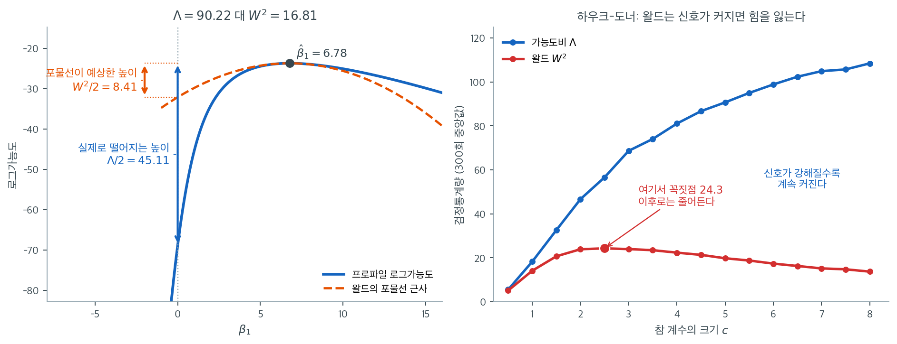

# 왈드 검정과 가능도비 검정


## 개요

로지스틱 회귀를 최대가능도로 적합한 뒤에는 개별 계수(또는 계수 집단)가 0과 유의하게 다른지
검정하고 싶은 경우가 많다. 두 고전적 접근이 **왈드 검정**과 **가능도비 검정(LRT)**이다.

---

## 1. 왈드 검정

### 착상

정칙조건 아래에서 MLE $\hat{\boldsymbol{\theta}}$는 점근적으로 정규분포를 따른다.

$$
\hat{\theta}_j \;\stackrel{a}{\sim}\;
  \mathcal{N}\!\bigl(\theta_j,\;[\mathcal{I}(\boldsymbol{\theta})^{-1}]_{jj}\bigr)
$$

여기서 $\mathcal{I}$는 피셔 정보행렬이다. 로지스틱 회귀에서는
$\mathcal{I}(\boldsymbol{\theta}) = A^TBA$(교차엔트로피 손실의 헤세행렬)이다.

### 검정통계량

$H_0\colon\theta_j=0$을 검정하려면

$$
W_j = \frac{\hat{\theta}_j}{\operatorname{se}(\hat{\theta}_j)},
\qquad
\operatorname{se}(\hat{\theta}_j) = \sqrt{[(A^TBA)^{-1}]_{jj}}
$$

를 쓴다. $H_0$ 아래에서 $W_j\sim\mathcal{N}(0,1)$이고, 동등하게 $W_j^2\sim\chi^2_1$이다.

### 해석

왈드 검정은 대부분의 소프트웨어가 기본으로 보고한다(`statsmodels`의 `summary` 출력이나 R의
`glm` 등). 적합된 모형만 있으면 되므로 계산이 빠르지만, MLE가 영가설에서 멀거나 표본이 작을 때는
신뢰하기 어렵다.

---

## 2. 가능도비 검정(LRT)

### 착상

전체 모형과 제약된(내포된) 모형의 최대 로그가능도를 비교한다.

$$
\Lambda = -2\bigl[\ell(\hat{\boldsymbol{\theta}}_{\text{restricted}})
                  - \ell(\hat{\boldsymbol{\theta}}_{\text{full}})\bigr]
$$

$H_0$(제약이 성립) 아래에서 $\Lambda\sim\chi^2_q$이며, $q$는 제약의 개수다.

### 계수 하나

$H_0\colon\theta_j=0$을 검정하려면 특성 $j$를 넣은 모형과 뺀 모형을 각각 적합한다.

$$
\Lambda = -2\bigl[\ell_{\text{without }j} - \ell_{\text{with }j}\bigr]
\sim \chi^2_1
$$

### 계수 여러 개

LRT는 자연스럽게 일반화된다. $q$개의 계수가 동시에 0인지 검정하면 $\Lambda\sim\chi^2_q$이다.

---

## 3. 비교

| | 왈드 검정 | 가능도비 검정 |
|---|---|---|
| 적합해야 할 모형 수 | 1개(전체 모형만) | 2개(전체 + 제약) |
| 계산 비용 | 낮음 | 더 높음 |
| 소표본에서의 행동 | 신뢰하기 어려울 수 있음 | 대체로 더 믿을 만함 |
| 소프트웨어 기본값 | 대개 자동으로 보고됨 | 명시적으로 비교해야 함 |

실무에서는 형식적 가설검정에는 LRT를 선호하고, 개별 계수를 빠르게 훑어볼 때는 왈드 통계량이
편리하다.

---

## 4. 헤세행렬과의 관계

두 검정 모두 MLE에서의 로그가능도 곡률에 의존한다. 앞에서 유도한 헤세행렬을 떠올리자.

$$
\nabla^2\ell = A^TBA,
\qquad
B = \operatorname{diag}\!\bigl(\sigma^{(i)}(1-\sigma^{(i)})\bigr)
$$

헤세행렬의 역이 $\hat{\boldsymbol{\theta}}$의 점근 공분산행렬을 준다. 왈드 검정은 이 역행렬의
대각원소를 쓰고, LRT는 두 점에서 평가한 로그가능도의 차이를 쓴다.

### 포물선을 믿을 것인가, 곡선을 볼 것인가

두 검정의 차이는 그림 하나로 정리된다. 왼쪽은 연습문제 2의 $c=6$ 자료($n=100$)에서 $\beta_1$의
프로파일 로그가능도와, 왈드가 대신 쓰는 이차근사 포물선을 겹쳐 그린 것이다. 오른쪽은 참 계수를
키워 가며 두 통계량이 어떻게 움직이는지 모의실험한 결과다.



왼쪽 그림에서 두 곡선은 $\hat\beta_1 = 6.78$ 부근에서 거의 겹친다. 이차근사가 최대점 근처에서
정확하다는 것은 사실이다. 문제는 검정이 묻는 지점이 $\beta_1 = 0$, 즉 저 멀리 왼쪽 끝이라는
데 있다. 거기서 실제 로그가능도는 $45.11$만큼 떨어지지만($\Lambda = 90.22$), 포물선은
$8.41$밖에 떨어지지 않는다($W^2 = 16.81$). 로그가능도가 왼쪽으로 훨씬 가파르게 꺼지는데
포물선은 그 비대칭을 담지 못한다. 왈드 검정은 $\hat\beta_1$ 근처에서 그린 포물선을 $0$까지
외삽하고, LRT는 $0$에 직접 가서 값을 읽는다. 같은 자료에서 통계량이 다섯 배 넘게 갈리는
이유가 이것뿐이다.

오른쪽은 이 편차가 어느 방향으로 작동하는지 보여준다. 참 계수 $c$를 $0.5$에서 $8$까지 키우면
$\Lambda$의 중앙값은 $5.5$에서 $108.5$까지 단조롭게 커진다. 신호가 강해졌으니 당연하다. 그런데
$W^2$는 $c = 2.5$에서 $24.3$으로 꼭짓점을 찍은 뒤 **거꾸로 내려가** $c=8$에서는 $13.7$까지
떨어진다. 신호가 강할수록 왈드 검정이 약해지는 것이다. 이것이 **하우크-도너 현상**이며, 원인은
앞 절의 가중치에 있다. $|\hat\beta|$가 커지면 모든 $\hat p_i$가 0이나 1로 몰려
$B = \operatorname{diag}(\hat p_i(1-\hat p_i))$가 0으로 가고, $(A^TBA)^{-1}$이 발산해 표준오차가
계수보다 더 빨리 커진다.

실무 지침은 여기서 바로 나온다. 계수가 작고 표본이 넉넉하면 두 검정이 사실상 같은 답을 주므로
소프트웨어가 기본으로 찍어 주는 왈드 $z$를 그대로 읽어도 된다. 그러나 계수가 크거나(오즈비가
수십 배) 사건 수가 적거나 분리가 의심되면, 왈드의 큰 p-값은 "효과가 없다"가 아니라 "근사가
깨졌다"는 신호일 수 있다. 그럴 때는 반드시 LRT나 프로파일 가능도 구간으로 확인해야 한다.

---

## 5. 파이썬 보기

<div class="exbox" markdown>

**보기 1.** <span class="diff easy" title="쉬움"></span> 여기서는 둘이 같고 저기서는 다섯 배 갈린다. 설명변수 셋 가운데 $x_3$만 참 계수가 $0$인 자료를 $n = 500$ 생성해 두 검정을 돌린다. 결과는 $W^2 = z^2 = 1.5608$, $\Lambda = 1.5719$로 거의 같다.

**(1)** 바로 위 그림의 $\hat\beta_1 = 6.78$ 자리에서는 $\Lambda = 90.22$, $W^2 = 16.81$로 다섯 배 넘게 갈렸다. 왜 여기서는 같고 거기서는 다른가. 테일러 전개의 **오차 차수**로 설명하시오.

**(2)** 요약표의 `LLR p-value: 1.943e-30`을 `Log-Likelihood`와 `LL-Null` 두 수만으로 재현하고 자유도를 정하시오. 또 네 자리의 $\Lambda/W^2$를 모아 $\lvert\hat\beta\rvert$와 함께 커지는지 확인하시오.

</div>

??? success "풀이"

    **(1) 해석적으로.** 관심모수 $\beta_j$에 대한 프로파일 로그가능도를 최대점 $\hat\beta_j$ 둘레에서 **세 항까지** 전개한다. 일차항은 $\hat\beta_j$가 최대점이라 사라지므로

    $$
    \ell(\beta) = \ell(\hat\beta)
    - \tfrac12\,\mathcal I(\hat\beta)\,(\beta - \hat\beta)^2
    + \tfrac16\,\ell'''(\tilde\beta)\,(\beta - \hat\beta)^3
    + \cdots
    $$

    이다. 검정은 $\beta = 0$에서 값을 읽으므로 $(\beta - \hat\beta) = -\hat\beta$를 넣으면

    $$
    \Lambda = -2\bigl[\ell(0) - \ell(\hat\beta)\bigr]
    = \underbrace{\mathcal I(\hat\beta)\,\hat\beta^2}_{= \;W^2}
    \;+\; \tfrac13\,\ell'''(\tilde\beta)\,\hat\beta^3 + \cdots
    $$

    를 얻는다. 둘째 항을 첫째 항으로 나누면

    $$
    \frac{\Lambda}{W^2} = 1 + O\bigl(\hat\beta\bigr)
    $$

    **곧 두 통계량의 상대차는 $\hat\beta$의 크기에 비례해 커진다.** 왈드는 $\hat\beta$ 자리에서 그린 포물선을 $0$까지 **외삽**하는 것이고, 외삽 거리가 바로 $\lvert\hat\beta\rvert$다. 가까우면 포물선이 잘 맞고 멀면 어긋난다.

    이 자료에서 $\hat\beta_3 = -0.1287$은 $0$에서 거의 떨어져 있지 않으므로 외삽할 거리가 없다시피 하다. 반면 $\hat\beta_1 = 6.78$이면 **$50$배 넘게 먼 곳까지 외삽**하는 셈이라 포물선이 실제 곡선을 전혀 따라가지 못한다.

    한 가지는 분명히 해 두어야 한다. **위 전개는 "상대차가 $\hat\beta$와 함께 커진다"까지만 말해 주고 얼마나 커지는지는 말해 주지 않는다.** $\hat\beta$가 커지면 세 항 전개 자체가 무의미해지기 때문이다. $\Lambda/W^2$가 얼마가 될지는 계산해 보는 수밖에 없다.

    **(2) 해석적으로.** 요약표의 `LLR`은 세 설명변수를 **한꺼번에** 뺀 영모형과의 비교이므로 자유도가 $3$이다.

    $$
    \Lambda_{\text{전체}} = -2\bigl[(-340.15) - (-269.48)\bigr] = -2 \times (-70.67) = 141.34
    $$

    $$
    p = P(\chi^2_3 \ge 141.34) = 1.943\times10^{-30}
    $$

    반면 $x_3$ 하나만 두고 하는 검정은 자유도가 $1$이고, 그것이 출력 마지막 두 줄이다.

    **(2) 수치적으로.**

    ```python
    import numpy as np
    import statsmodels.api as sm
    from scipy import stats

    # 설명변수 셋 중 마지막 하나는 반응변수와 무관하게 만든다
    rng = np.random.default_rng(0)
    n = 500
    X = rng.normal(0, 1, size=(n, 3))
    logit = -0.5 + 1.2 * X[:, 0] - 0.8 * X[:, 1] + 0.0 * X[:, 2]
    y = (rng.random(n) < 1 / (1 + np.exp(-logit))).astype(int)

    # 전체 모형을 적합한다. 세 번째 계수는 참으로 0 이다.
    X_full = sm.add_constant(X)
    model_full = sm.Logit(y, X_full).fit(disp=0)


    def print_summary(res):
        """summary()의 Date/Time 칸은 실행할 때마다 달라지므로 비우고 출력한다."""
        lines = []
        for line in str(res.summary()).split("\n"):
            if line.startswith(("Date:", "Time:")):
                lines.append(line[:19].ljust(38) + line[38:])
            else:
                lines.append(line)
        print("\n".join(lines))


    # statsmodels 의 출력표는 기본으로 Wald 검정을 보여 준다. 계수를 그
    # 표준오차로 나눈 값이다.
    print_summary(model_full)

    # 가능도비 검정은 변수를 뺀 모형과 넣은 모형의 로그가능도를 견준다.
    # Wald 는 한 모형만 적합하면 되지만, 가능도비는 두 번 적합해야 한다.
    # 대신 표본이 작거나 계수가 클 때 가능도비 쪽이 더 믿을 만하다.
    model_restricted = sm.Logit(y, X_full[:, :-1]).fit(disp=0)
    lr_stat = -2 * (model_restricted.llf - model_full.llf)
    p_value = stats.chi2.sf(lr_stat, df=1)

    # z^2 과 가능도비 통계량이 비슷하게 나오는지 본다. 표본이 크면 둘이
    # 같은 값으로 다가간다(점근적으로 동등하다).
    wald_z = model_full.tvalues[-1]
    print(f"Wald z = {wald_z:.4f}, z^2 = {wald_z**2:.4f}, p = {model_full.pvalues[-1]:.4f}")
    print(f"LRT  = {lr_stat:.4f}, p = {p_value:.4f}")

    # 요약표의 LLR 을 두 수로 되살린다 (자유도 3).
    ll_full, ll_null = model_full.llf, model_full.llnull
    big = -2 * (ll_null - ll_full)
    print(f"\n-2*({ll_null:.2f} - ({ll_full:.2f})) = {big:.4f}, df = 3, "
          f"p = {stats.chi2.sf(big, 3):.3e}")
    print(f"statsmodels 가 적은 값: LLR = {model_full.llr:.4f}, "
          f"p = {model_full.llr_pvalue:.3e}")

    # 네 자리의 Lambda / W^2.  뒤의 셋은 연습문제 2 의 모의실험 결과다.
    print("\n  beta_hat      W^2       Lambda   Lambda/W^2")
    rows = [(model_full.params[-1], wald_z ** 2, lr_stat),
            (0.966, 3.393 ** 2, 14.16),
            (3.033, 4.780 ** 2, 58.06),
            (6.780, 4.100 ** 2, 90.22)]
    for b, w2, lam in rows:
        print(f"{b:10.4f} {w2:10.4f} {lam:10.4f} {lam / w2:10.4f}")
    ```

    출력:

    ```
                               Logit Regression Results                           
    ==============================================================================
    Dep. Variable:                      y   No. Observations:                  500
    Model:                          Logit   Df Residuals:                      496
    Method:                           MLE   Df Model:                            3
    Date:                                   Pseudo R-squ.:                  0.2078
    Time:                                   Log-Likelihood:                -269.48
    converged:                       True   LL-Null:                       -340.15
    Covariance Type:            nonrobust   LLR p-value:                 1.943e-30
    ==============================================================================
                     coef    std err          z      P>|z|      [0.025      0.975]
    ------------------------------------------------------------------------------
    const         -0.2445      0.105     -2.329      0.020      -0.450      -0.039
    x1             1.2057      0.137      8.776      0.000       0.936       1.475
    x2            -0.7111      0.118     -6.016      0.000      -0.943      -0.479
    x3            -0.1287      0.103     -1.249      0.212      -0.331       0.073
    ==============================================================================
    Wald z = -1.2493, z^2 = 1.5608, p = 0.2115
    LRT  = 1.5719, p = 0.2099

    -2*(-340.15 - (-269.48)) = 141.3402, df = 3, p = 1.943e-30
    statsmodels 가 적은 값: LLR = 141.3402, p = 1.943e-30

      beta_hat      W^2       Lambda   Lambda/W^2
       -0.1287     1.5608     1.5719     1.0071
        0.9660    11.5124    14.1600     1.2300
        3.0330    22.8484    58.0600     2.5411
        6.7800    16.8100    90.2200     5.3670
    ```

    **요약표의 두 수로 $141.3402$와 $p = 1.943\times10^{-30}$이 그대로 되살아난다.**

    마지막 표가 (1)의 유도를 확인해 준다. $\Lambda/W^2$가

    $$
    1.0071 \;<\; 1.2300 \;<\; 2.5411 \;<\; 5.3670
    $$

    으로 $\lvert\hat\beta\rvert = 0.13,\ 0.97,\ 3.03,\ 6.78$을 따라 **단조롭게 커진다.** $\hat\beta_3 = -0.1287$ 자리에서는 둘의 차이가 $0.7\%$에 지나지 않아 왈드 $p = 0.2115$와 가능도비 $p = 0.2099$가 사실상 같은 답을 준다. **계수가 작으면 소프트웨어가 찍어 주는 왈드 $z$를 그대로 읽어도 된다는 실무 지침이 이 한 줄이다.**

    다만 유도가 예측한 것은 **순서**이지 크기가 아니다. $\Lambda/W^2 - 1$을 $\lvert\hat\beta\rvert$로 나누면 $0.055$, $0.238$, $0.508$, $0.644$로 **그것도 함께 커진다.** 곧 상대차가 $\hat\beta$에 단순 비례하지 않는다는 뜻이고, 세 항 전개가 큰 $\hat\beta$에서 무너진다는 것을 수가 보여 준다. 네 번째 줄에서는 $W^2 = 16.81$이 세 번째 줄의 $22.85$보다 **오히려 작은데**, 이것이 본문에서 말한 하우크-도너 현상이다. 신호가 더 강해졌는데 왈드 통계량이 줄어든 것이다.

---

## 연습문제

<div class="drillbox" markdown>

**연습문제 1.** <span class="diff easy" title="쉬움"></span>
어떤 로지스틱 회귀에서 절편만 있는 모형의 이탈도가 $D_0 = 120.5$(자유도 99), 설명변수 두 개를
넣은 모형의 이탈도가 $D = 85.3$(자유도 97)이다. LRT를 수행하라.

</div>

??? success "풀이"

    이탈도는 $D = -2\ell$이므로 이탈도의 차이가 곧 LRT 통계량이다.

    $$
    \Lambda = D_0 - D = 120.5 - 85.3 = 35.2
    $$

    자유도는 모수 개수의 차이 $3 - 1 = 2$(동등하게 잔차자유도의 차이 $99 - 97 = 2$)다.

    $\chi^2_2$의 $\alpha = 0.05$ 임계값은 $5.99$이고 $35.2 \gg 5.99$이므로 $H_0$을 기각한다.
    p-값은 $P(\chi^2_2 > 35.2) = 2.3 \times 10^{-8}$이다. 두 설명변수가 모형을 유의하게
    개선한다.

    맥패든 유사 $R^2$는 $1 - 85.3/120.5 = 0.292$로, 중간 정도의 개선을 나타낸다. $\square$

---

<div class="drillbox" markdown>

**연습문제 2.** <span class="diff med" title="중간"></span>
**하우크-도너 효과.** 참 계수 $\beta_1$이 커질수록 왈드 통계량이 오히려 **작아질 수 있음**을
모의실험으로 확인하라. $n = 100$, $x \sim N(0,1)$, $P(Y=1) = \sigma(c\,x)$에서 $c = 1, 3, 6$에
대해 왈드 검정과 LRT를 비교하라.

</div>

??? success "풀이"

    ```python
    import numpy as np
    import statsmodels.api as sm
    from scipy import stats

    rng = np.random.default_rng(7)
    n = 100
    x = rng.normal(size=n)

    for c in [1.0, 3.0, 6.0]:
        p = 1 / (1 + np.exp(-c * x))
        y = (rng.random(n) < p).astype(float)
        X = sm.add_constant(x)
        m = sm.Logit(y, X).fit(disp=0)
        m0 = sm.Logit(y, np.ones((n, 1))).fit(disp=0)
        lr = -2 * (m0.llf - m.llf)
        print(f"c={c}: beta={m.params[1]:.3f} se={m.bse[1]:.3f} "
              f"z={m.tvalues[1]:.3f} wald_p={m.pvalues[1]:.3g} "
              f"LR={lr:.2f} LR_p={stats.chi2.sf(lr, 1):.3g}")
    ```

    출력:

    ```
    c=1.0: beta=0.966 se=0.285 z=3.393 wald_p=0.000692 LR=14.16 LR_p=0.000168
    c=3.0: beta=3.033 se=0.635 z=4.780 wald_p=1.75e-06 LR=58.06 LR_p=2.54e-14
    c=6.0: beta=6.780 se=1.654 z=4.100 wald_p=4.13e-05 LR=90.22 LR_p=2.13e-21
    ```

    | $c$ | $\hat\beta_1$ | $\operatorname{se}$ | 왈드 $z$ | 왈드 p-값 | $\Lambda$ | LRT p-값 |
    |---|---|---|---|---|---|---|
    | 1 | $0.966$ | $0.285$ | $3.393$ | $6.9\times10^{-4}$ | $14.16$ | $1.7\times10^{-4}$ |
    | 3 | $3.033$ | $0.635$ | $4.780$ | $1.8\times10^{-6}$ | $58.06$ | $2.5\times10^{-14}$ |
    | 6 | $6.780$ | $1.654$ | $4.100$ | $4.1\times10^{-5}$ | $90.22$ | $2.1\times10^{-21}$ |

    $c$가 3에서 6으로 커질 때 신호는 훨씬 강해졌고 LRT 통계량도 $58$에서 $90$으로 커졌다.
    그런데 **왈드 $z$는 $4.78$에서 $4.10$으로 오히려 줄었다.** 표준오차가 $\hat\beta$보다 더
    빨리 커지기 때문이다. $|\hat\beta| \to \infty$이면 모든 $\hat p_i$가 0이나 1로 가고
    $B = \operatorname{diag}(\hat p_i(1-\hat p_i)) \to 0$이므로 $(A^TBA)^{-1}$이 발산한다.

    이것이 **하우크-도너 현상**이다. 효과가 아주 강할 때 왈드 검정이 힘을 잃는다. 극단적으로는
    완전 분리 상황에서 왈드 p-값이 1에 가까워지면서, 자료가 완벽하게 설명되는데도 "유의하지
    않다"는 결론이 나올 수 있다. LRT는 이런 문제를 겪지 않는다. $\square$

---

<div class="drillbox" markdown>

**연습문제 3.** <span class="diff med" title="중간"></span>
오즈비의 95% 신뢰구간을 만드는 두 가지 방법, 즉 왈드 구간과 프로파일 가능도 구간을 설명하라.
어느 쪽을 선호해야 하는가?

</div>

??? success "풀이"

    **왈드 구간.** 로그오즈비 척도에서 대칭 구간을 만든 뒤 지수화한다.

    $$
    \bigl[\exp(\hat\theta_j - 1.96\,\operatorname{se}),\; \exp(\hat\theta_j + 1.96\,\operatorname{se})\bigr]
    $$

    계산이 즉각적이며 대부분의 소프트웨어 기본값이다. 그러나 연습문제 5에서 본 이차근사에
    의존한다.

    **프로파일 가능도 구간.** $\theta_j$를 여러 값에 고정한 채 나머지 모수를 최대화하여 프로파일
    로그가능도 $\ell_p(\theta_j)$를 얻고,

    $$
    \bigl\{\theta_j : -2[\ell_p(\theta_j) - \ell(\hat{\boldsymbol{\theta}})] \le \chi^2_{1,0.95} = 3.84\bigr\}
    $$

    을 구간으로 삼는다. 이는 LRT를 뒤집어 얻은 구간이며, 일반적으로 대칭이 아니다.

    **어느 쪽인가.** 프로파일 구간이 낫다. LRT와 일관되고(왈드 구간은 왈드 검정과 결론이
    어긋날 수 있다), 가능도의 비대칭을 반영하며, 모수 재척도화에 불변이다. 표본이 크고
    $\hat\theta_j$가 0 근처이면 두 구간이 사실상 같으므로 왈드 구간으로 충분하다. 표본이 작거나
    계수가 크거나 분리에 가까운 상황이라면 반드시 프로파일 구간을 쓰라. R에서는
    `confint(model)`이 기본으로 프로파일 구간을 준다(왈드 구간은 `confint.default`). $\square$

---

<div class="drillbox" markdown>

**연습문제 4.** <span class="diff med" title="중간"></span>
왈드 검정과 LRT 외에 **점수 검정**(라오 검정)이 있다. 세 검정이 각각 로그가능도의 어느 부분을
쓰는지 설명하고, 점수 검정이 특히 유용한 상황을 하나 들어라.

</div>

??? success "풀이"

    세 검정은 "가능도 삼총사"라 불리며, 로그가능도 곡선의 서로 다른 측면을 본다.

    | 검정 | 쓰는 정보 | 적합해야 할 모형 |
    |---|---|---|
    | 왈드 | $\hat{\boldsymbol{\theta}}$에서의 **곡률**과 $\hat{\boldsymbol{\theta}}$까지의 거리 | 전체 모형 |
    | LRT | 두 점 사이의 **높이 차이** | 전체 + 제약 |
    | 점수 | 제약점에서의 **기울기** | 제약 모형만 |

    점수 통계량은

    $$
    S = \mathbf{s}(\boldsymbol{\theta}_0)^\top\,\mathcal{I}(\boldsymbol{\theta}_0)^{-1}\,\mathbf{s}(\boldsymbol{\theta}_0)
    \;\stackrel{a}{\sim}\; \chi^2_q
    $$

    이며, $\boldsymbol{\theta}_0$은 영가설 아래의 추정치다. 셋 모두 $H_0$ 아래에서 점근적으로
    $\chi^2_q$를 따르고 서로 동등하지만, 유한표본에서는 값이 다르다.

    **점수 검정이 유용한 경우:** 전체 모형을 적합하기 어렵거나 불가능할 때다.

    - **완전 분리:** 전체 모형의 MLE가 존재하지 않아 왈드와 LRT를 쓸 수 없지만, 점수 검정은
      제약 모형에서만 계산하므로 여전히 유효하다.
    - **많은 후보 변수 선별:** $p$개의 변수를 하나씩 넣어 볼 때, 점수 검정은 영모형을 한 번만
      적합하고 각 변수에 대해 기울기만 계산하면 된다. LRT는 $p$개의 모형을 새로 적합해야 한다.
      로지스틱 회귀의 전진선택이 흔히 점수 검정을 쓰는 이유다.
    - **적합도 검정:** 호스머-레메쇼 검정을 비롯한 여러 진단이 본질적으로 점수 검정이다.

    $\square$

---

<div class="drillbox" markdown>

**연습문제 5.** <span class="diff hard" title="어려움"></span>
$W_j^2$와 LRT 통계량 $\Lambda$가 점근적으로 동등함을 보여라. 두 값이 실제로는 왜 다를 수
있는지 설명하라.

</div>

??? success "풀이"

    $\hat\theta_j$ 근방에서 로그가능도를 이차근사하자. 다른 좌표를 고정한 채 $\theta_j$만
    변화시키면

    $$
    \ell(\theta_j) \approx \ell(\hat\theta_j) - \tfrac{1}{2}\,\mathcal{I}_{jj}\,(\theta_j - \hat\theta_j)^2
    $$

    이다(1차 항은 $\hat\theta_j$가 최대점이므로 사라진다). $\theta_j = 0$에서 평가하면

    $$
    \Lambda = -2[\ell(0) - \ell(\hat\theta_j)] \approx \mathcal{I}_{jj}\,\hat\theta_j^2
    = \frac{\hat\theta_j^2}{\operatorname{se}(\hat\theta_j)^2} = W_j^2
    $$

    를 얻는다. 즉 두 통계량은 로그가능도의 이차근사가 정확한 만큼만 서로 가깝다.

    **차이가 생기는 이유:** 왈드 검정은 로그가능도를 $\hat\theta_j$에서 이차식으로 **대체하고**
    그 포물선을 $\theta_j = 0$까지 외삽한다. LRT는 $\theta_j = 0$에서 로그가능도를 **실제로
    평가한다.** 로그가능도가 비대칭이거나(로지스틱 회귀에서 흔하다) $\hat\theta_j$가 0에서
    멀면 포물선 근사가 그 먼 지점에서 나빠지고, 두 값이 크게 갈린다. 연습문제 2가 그 극단적인
    사례다. $\square$

---

## 정리하며

계수 검정에 **두 가지 접근**이 있다.

| | 방식 | 성격 |
|---|---|---|
| 왈드 | $\hat\beta/\mathrm{se}(\hat\beta)$ | 한 번만 적합, 간편 |
| 가능도비 | $-2(\ell_0-\ell_1)$ | 두 번 적합, 더 정확 |

- **둘 다 점근적으로 같다.** 표본이 크면 일치하지만 **소표본이나 큰 계수에서 갈린다.**
- **왈드 검정이 신뢰하기 어려운 경우가 있다.** 계수가 크면 표준오차도 함께 커져 통계량이 오히려 작아지는 **헉–돈너 효과**가 생기며, 유의한 효과를 놓친다.
- **가능도비가 더 안정적이다.** 제약 모형과 비제약 모형의 로그가능도를 직접 비교하므로 이 문제가 없다.
- **여러 계수를 한꺼번에 검정할 때도 가능도비가 자연스럽다.** 범주형 변수의 더미들처럼 묶어서 봐야 하는 경우다.
- **자유도는 제약의 개수**이며, 15장의 가능도비 틀 그대로다.

다음 절 **이탈도**로 넘어간다.
