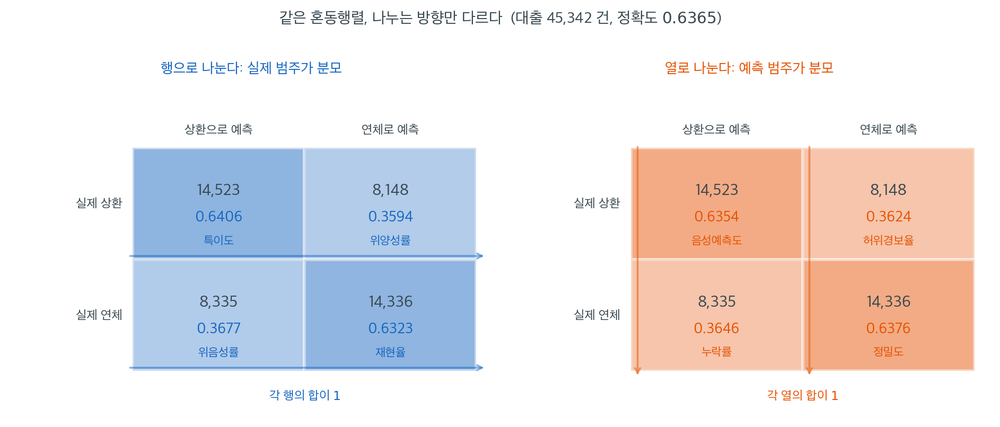

# 혼동행렬


## 1. 정의와 설정

**혼동행렬**(**분할표**라고도 한다)은 예측된 이름표와 실제 이름표를 비교하여 분류모형의 성능을
요약한다. 이항 분류에서는 2×2 표다.

$$
\begin{array}{c|cc}
& \text{Predicted Negative} & \text{Predicted Positive} \\
\hline
\text{Actual Negative} & \text{TN} & \text{FP} \\
\text{Actual Positive} & \text{FN} & \text{TP}
\end{array}
$$

### 네 가지 결과

- **참음성(TN):** 음성으로 예측했고 실제로 음성이다. 옳은 예측.
- **위양성(FP):** 양성으로 예측했으나 실제로는 음성이다. 제1종 오류.
- **위음성(FN):** 음성으로 예측했으나 실제로는 양성이다. 제2종 오류.
- **참양성(TP):** 양성으로 예측했고 실제로 양성이다. 옳은 예측.

전체 관측치 수는 $n = \text{TN} + \text{FP} + \text{FN} + \text{TP}$이다.

---

## 2. 대출 연체 예측

45,342건의 대출 관측치(연체 대 상환완료)로 학습한 로지스틱 회귀 모형의 결과는 다음과 같다.

```
                      Predicted
                   Default  Paid Off
Actual Default       14,336   8,335
Actual Paid Off       8,148  14,523
```

여기서,

- **TN = 14,523:** 상환완료를 옳게 예측
- **FP = 8,148:** 연체로 예측했으나 실제로는 상환완료(허위경보)
- **FN = 8,335:** 상환완료로 예측했으나 실제로는 연체(놓친 연체)
- **TP = 14,336:** 연체를 옳게 예측

---

## 3. 정확도

가장 기본적인 성능 지표는 **정확도**, 즉 옳은 예측의 비율이다.

$$
\text{Accuracy} = \frac{\text{TP} + \text{TN}}{n}
$$

위 예에서는 $\text{Accuracy} = \frac{14{,}336 + 14{,}523}{45{,}342} \approx 0.6365$(63.65%)이다.

그러나 정확도만 보는 것은 오도할 수 있으며, 특히 한 범주가 다른 범주보다 훨씬 흔한 **불균형
자료**에서 그렇다. 범주별 지표를 함께 살피는 편이 낫다(다음 절 참조).

---

## 4. 범주별 비율

### 양성 범주(예: "연체")

- **민감도(재현율):** 실제 양성 중 얼마나 찾아냈는가?

  $$\text{Recall} = \frac{\text{TP}}{\text{TP} + \text{FN}}$$

- **특이도:** 실제 음성 중 얼마나 옳게 가려냈는가?

  $$\text{Specificity} = \frac{\text{TN}}{\text{TN} + \text{FP}}$$

위 예에서는,

- 재현율 $= 14{,}336 / (14{,}336 + 8{,}335) \approx 0.6323$ (실제 연체의 63.23%를 탐지)
- 특이도 $= 14{,}523 / (14{,}523 + 8{,}148) \approx 0.6406$ (실제 상환완료의 64.06%를 식별)

---

## 5. 유병률 조정

양성 범주의 유병률이 훈련자료와 검정자료에서 다르면 혼동행렬도 그에 따라 달라진다. 드문 사건이
주된 관심사인 의학이나 이상거래 탐지에서 특히 중요한 문제다.

---

## 6. 시각화

혼동행렬은 셀 값과 색의 진하기를 함께 쓰는 열지도로 자주 표현한다.

```
                 Predicted
                Neg    Pos
Actual Neg  [14523]  [8148]
Actual Pos  [ 8335] [14336]
```

이 형태는 모형이 어디서 틀리는지 한눈에 보여준다. 비대각 원소가 클수록 오분류율이 높다.

### 같은 표를 두 방향으로 나눈다

혼동행렬에서 파생되는 지표가 너무 많아 헷갈린다면, 외울 것이 사실 하나뿐이라는 점을 기억하면
된다. **네 칸을 행으로 나누느냐 열로 나누느냐**가 전부다. 아래 그림은 위의 같은 표를 두 번
그린 것이다. 칸 안의 도수는 완전히 같고, 아래 붙은 비율만 다르다.



왼쪽은 **행**으로 나눈 것이다. 분모가 실제 범주이므로 "실제로 연체한 22,671건 중 몇 건을
잡았나"를 묻는다. 아래쪽 행에서 $14{,}336/22{,}671 = 0.6323$이 재현율이고 위쪽 행에서
$14{,}523/22{,}671 = 0.6406$이 특이도다. 이 두 값은 자료에 양성이 얼마나 흔한지와 무관하다.
각 행 안에서만 계산되기 때문이다.

오른쪽은 **열**로 나눈 것이다. 분모가 예측 범주이므로 "연체라고 말한 22,484건 중 몇 건이
맞았나"를 묻는다. $14{,}336/22{,}484 = 0.6376$이 정밀도이고, $14{,}523/22{,}858 = 0.6354$가
음성예측도다. 이쪽 값들은 유병률에 민감하다. 실제 연체 비율이 절반에서 5%로 떨어지면 오른쪽 위
칸(위양성)이 상대적으로 커져 정밀도가 급락하지만, 왼쪽 그림의 재현율과 특이도는 그대로다.

이 자료에서는 네 비율이 모두 $0.63$ 근처라 구분이 잘 드러나지 않는데, 그것 자체가 이 모형에
대한 평가다. 동전을 던지는 것보다 아주 조금 나은 수준이며, 정확도 $0.6365$ 역시 같은 이야기를
한다. 재현율과 정밀도가 이렇게 비슷하게 나오는 것은 두 범주의 크기가 거의 같은($22{,}671$ 대
$22{,}671$) 특수한 상황 때문이다. 불균형 자료에서는 두 값이 크게 갈라지며, 그때 비로소 "어느
방향으로 나눴는가"가 결정적인 질문이 된다.

---

## 연습문제

<div class="drillbox" markdown>

**연습문제 1.** <span class="diff easy" title="쉬움"></span>
모형 평가

어떤 스팸 분류기가 전자우편 1000건의 검정자료에서 다음 혼동행렬을 냈다.

|  | 스팸으로 예측 | 스팸 아님으로 예측 |
|---|---|---|
| **실제 스팸** | 85 | 15 |
| **실제 스팸 아님** | 30 | 870 |

**(a)** 정확도, 정밀도, 재현율, 특이도, F1 점수를 계산하라.

**(b)** 놓친 스팸의 비용이 허위경보 비용의 3배라면 분류 문턱을 낮춰야 하는가 높여야 하는가?

**(c)** 위양성률은 얼마인가?

</div>

??? success "풀이"

    **(a)** TP=85, FN=15, FP=30, TN=870

    정확도 $= (85+870)/1000 = 0.955$

    정밀도 $= 85/(85+30) = 0.739$

    재현율 $= 85/(85+15) = 0.850$

    특이도 $= 870/(870+30) = 0.967$

    F1 $= 2 \times 0.739 \times 0.850/(0.739+0.850) = 0.791$

    **(b)** 놓친 스팸(FN)이 더 비싸므로 문턱을 **낮춰** 재현율을 높여야 한다(스팸을 더 많이
    잡되 위양성을 더 감수한다).

    **(c)** FPR $= FP/(FP+TN) = 30/900 = 0.033$

    !!! note "정확도만 보면 안 되는 이유"
        이 분류기의 정확도는 95.5%로 훌륭해 보인다. 그러나 모든 메일을 "스팸 아님"으로
        예측하는 무의미한 분류기의 정확도도 $900/1000 = 90\%$다. 즉 실제 분류기가 벌어들인
        개선폭은 5.5%포인트뿐이며, 그마저도 대부분 흔한 범주에서 나온 것이다. 유병률이 낮을수록
        이 착시가 심해진다. 스팸 비율이 1%였다면 아무것도 안 하는 분류기의 정확도가 99%다.

---

<div class="drillbox" markdown>

**연습문제 2.** <span class="diff easy" title="쉬움"></span>
행으로 나누기와 열로 나누기

본문 대출 자료의 네 칸은 $\text{TP} = 14{,}336$, $\text{FN} = 8{,}335$,
$\text{FP} = 8{,}148$, $\text{TN} = 14{,}523$이다.

**(a)** 정밀도와 음성예측도를 구하고, 각각 어느 방향(행/열)으로 나눈 값인지 밝혀라.

**(b)** 네 비율(재현율·특이도·정밀도·음성예측도)이 모두 $0.63$ 근처인 까닭은 무엇인가?

</div>

??? success "풀이"

    **(a)** 정밀도는 **열**로 나눈다. 분모가 "연체라고 예측한 건수"다.

    $$
    \text{정밀도} = \frac{14{,}336}{14{,}336 + 8{,}148} = \frac{14{,}336}{22{,}484} = 0.6376
    $$

    음성예측도도 **열**이다.

    $$
    \text{NPV} = \frac{14{,}523}{14{,}523 + 8{,}335} = \frac{14{,}523}{22{,}858} = 0.6354
    $$

    재현율과 특이도는 **행**으로 나눈 값이다. 외울 것은 "분모가 실제 범주인가 예측 범주인가"
    하나뿐이다.

    **(b)** 두 범주의 크기가 $22{,}671$ 대 $22{,}671$로 **정확히 같기** 때문이다. 유병률이
    $0.5$이면 행 합과 열 합이 거의 같아져 어느 방향으로 나누든 분모가 비슷하다. 방향의 차이는
    범주가 불균형할 때 비로소 벌어진다. 연습문제 3이 그것을 수로 보인다. $\square$

---

<div class="drillbox" markdown>

**연습문제 3.** <span class="diff easy" title="쉬움"></span>
유병률이 바뀌면 무엇이 변하는가

모형의 재현율 $0.6323$과 특이도 $0.6406$은 그대로 두고, 적용하는 모집단의 연체율만
$0.5 \to 0.2 \to 0.05$로 낮춘다.

**(a)** 각 경우의 정밀도를 구하라.

**(b)** 정확도는 어떻게 변하는가?

**(c)** (a)와 (b)의 대비에서 "모형 성능"을 보고할 때 무엇을 함께 적어야 하는지 말하라.

</div>

??? success "풀이"

    **(a)** 유병률을 $\pi$라 하면

    $$
    \text{정밀도} = \frac{\pi\,r}{\pi\,r + (1-\pi)(1-s)}
    $$

    이다($r$은 재현율, $s$는 특이도).

    | $\pi$ | 정밀도 | 정확도 |
    |---|---|---|
    | 0.50 | 0.638 | 0.637 |
    | 0.20 | 0.306 | 0.639 |
    | 0.05 | 0.085 | 0.640 |

    **유병률이 $10$분의 $1$로 줄자 정밀도가 $0.64$에서 $0.08$로 무너진다.** 모형은 하나도
    바뀌지 않았는데 그렇다.

    **(b)** 정확도는 $\pi r + (1-\pi)s$이므로 $0.637 \to 0.639 \to 0.640$으로 거의 꿈쩍도
    하지 않는다. $r$과 $s$가 $0.63$ 근처로 비슷해 가중치를 어떻게 바꾸든 평균이 그 자리에
    머물기 때문이다.

    **(c)** **"정밀도 $0.64$인 모형"이라는 말은 그 자체로 성립하지 않는다.** 어느 유병률에서
    쟀는지를 함께 적어야 한다. 검정자료를 인위적으로 균형 맞춰(양성·음성 반반) 만든 뒤 정밀도를
    보고하고, 실제로는 양성이 $5\%$인 곳에 배치하는 것이 흔한 사고다. 행으로 나눈 값(재현율·
    특이도)은 유병률에 불변이므로 모형 자체의 성질로 보고할 수 있고, 열로 나눈 값(정밀도·NPV)은
    언제나 배치될 모집단의 유병률과 함께 보고해야 한다. $\square$

---

<div class="drillbox" markdown>

**연습문제 4.** <span class="diff med" title="중간"></span>
F1 이 조화평균인 까닭

$F_1 = 2\,\dfrac{\text{정밀도} \times \text{재현율}}{\text{정밀도} + \text{재현율}}$은 두
값의 **조화평균**이다.

**(a)** 정밀도 $0.99$, 재현율 $0.01$인 분류기의 산술평균과 $F_1$을 구하고 차이를 설명하라.

**(b)** 조화평균이 두 값 가운데 작은 쪽에 끌리는 성질을 식으로 보여라.

**(c)** $F_1$이 쓰지 **않는** 칸은 어디인가? 그 때문에 생기는 한계는 무엇인가?

</div>

??? success "풀이"

    **(a)** 산술평균은 $0.500$인데 $F_1 = 2(0.99)(0.01)/(1.00) = 0.020$이다. 산술평균은
    "절반쯤 하는 분류기"라고 말하지만, 실제로는 양성 $100$개 중 하나만 찾아내는 **거의 쓸모
    없는** 분류기다. $F_1$ 쪽이 정직하다.

    **(b)** $H = 2pr/(p+r)$에서 $r \to 0$이면 분자가 $0$으로 가므로 $p$가 아무리 커도
    $H \to 0$이다. 일반적으로

    $$
    \frac{1}{H} = \frac12\left(\frac1p + \frac1r\right)
    $$

    이라 **역수의 평균**이고, 역수는 작은 값에서 폭발하므로 작은 쪽이 평균을 지배한다.
    언제나 $\min(p,r) \le H \le \text{산술평균}$이고, 등호는 $p = r$일 때뿐이다.

    **(c)** $F_1$은 $\text{TP}$, $\text{FP}$, $\text{FN}$만 쓰고 **$\text{TN}$을 전혀
    쓰지 않는다.** 그래서 음성을 잘 가려내는 능력이 $F_1$에 반영되지 않고, 음성이 압도적으로
    많은 자료에서 $\text{TN}$을 수백만 개 늘려도 $F_1$은 그대로다. 양성 범주가 관심의 전부일
    때는 장점이지만, 두 범주를 모두 다루어야 한다면 연습문제 9의 MCC처럼 네 칸을 모두 쓰는
    지표가 필요하다. $\square$

---

<div class="drillbox" markdown>

**연습문제 5.** <span class="diff med" title="중간"></span>
아무것도 하지 않는 분류기

본문 연습문제 1의 스팸 자료(스팸 $100$건, 정상 $900$건)에서 **모두 "스팸 아님"으로 예측**
하는 분류기를 생각한다.

**(a)** 이 분류기의 혼동행렬을 적고 정확도·재현율·특이도·정밀도를 구하라.

**(b)** 네 지표 가운데 어느 것이 이 분류기에 속는가?

**(c)** 실제 분류기(정확도 $0.955$)가 벌어들인 몫을 **균형정확도**
$(\text{재현율} + \text{특이도})/2$로 다시 재어라.

</div>

??? success "풀이"

    **(a)** $\text{TP} = 0$, $\text{FN} = 100$, $\text{FP} = 0$, $\text{TN} = 900$이다.

    $$
    \text{정확도} = 0.900, \quad \text{재현율} = 0, \quad \text{특이도} = 1,
    \quad \text{정밀도} = \frac{0}{0}\ (\text{정의되지 않음})
    $$

    **(b)** **정확도와 특이도가 속는다.** 정확도 $0.9$는 흔한 범주를 맞힌 것만으로 나온
    수이고, 특이도 $1$은 "아무도 양성이라 하지 않았다"는 사실의 다른 표현일 뿐이다. 재현율은
    $0$으로 정직하게 실패를 알린다. 정밀도는 분모가 $0$이라 아예 정의되지 않는데, 이 역시
    경고로 읽어야 한다(라이브러리가 $0$으로 돌려주도록 설정되어 있으면 그 사실을 모른 채
    지나가기 쉽다).

    **(c)** 균형정확도는 $(0 + 1)/2 = 0.5$로 **동전 던지기와 같다.** 실제 분류기는
    $(0.850 + 0.967)/2 = 0.908$이다. 정확도 눈금에서는 $0.900 \to 0.955$로 $5.5$포인트
    차이였지만, 균형정확도 눈금에서는 $0.500 \to 0.908$로 격차가 제대로 드러난다.
    **불균형 자료에서 "기준선 대비 얼마나 나은가"를 보려면 유병률에 휘둘리지 않는 눈금으로
    재야 한다.** $\square$

---

<div class="drillbox" markdown>

**연습문제 6.** <span class="diff med" title="중간"></span>
정확도는 두 값의 가중평균이다

유병률을 $\pi = P(\text{실제 양성})$, 재현율을 $r$, 특이도를 $s$라 할 때

$$
\text{정확도} = \pi\,r + (1-\pi)\,s
$$

임을 보이고, 다음에 답하라.

**(a)** $\pi \to 0$이면 정확도는 무엇으로 수렴하는가?

**(b)** 재현율을 $0.1$ 올리는 것과 특이도를 $0.1$ 올리는 것 중 어느 쪽이 정확도를 더
올리는가? $\pi = 0.01$에서 수로 답하라.

**(c)** 이 식이 "불균형 자료에서 정확도를 쓰지 말라"는 권고를 어떻게 설명하는가?

</div>

??? success "풀이"

    전체 $n$건을 실제 양성 $\pi n$건과 실제 음성 $(1-\pi)n$건으로 가르면, 맞힌 건수는
    $r \cdot \pi n$(양성 쪽)과 $s \cdot (1-\pi)n$(음성 쪽)의 합이다. $n$으로 나누면 바로
    $\pi r + (1-\pi)s$다. **정확도는 두 행 비율을 유병률로 가중평균한 것**이다.

    **(a)** $\pi \to 0$이면 정확도 $\to s$다. 양성이 드물수록 정확도는 사실상 **특이도만**
    재게 된다.

    **(b)** $\pi = 0.01$에서 재현율을 $0.1$ 올리면 정확도는 $0.01 \times 0.1 = 0.001$만
    오르고, 특이도를 $0.1$ 올리면 $0.99 \times 0.1 = 0.099$가 오른다. **$99$배 차이**다.
    정확도를 최적화하는 알고리즘이 드문 범주를 통째로 포기하는 쪽으로 가는 까닭이 이것이다.

    **(c)** 정확도의 가중치가 **유병률 그 자체**이기 때문이다. 관심은 대개 드문 범주(연체,
    질병, 이상거래)에 있는데 정확도는 바로 그쪽에 가장 작은 가중치를 준다. 균형정확도는
    가중치를 $1/2$씩로 바꾸어 이 비대칭을 없앤 것이고, 비용 비대칭이 뚜렷하다면 가중치를
    비용으로 두는 것이 더 낫다(연습문제 8). $\square$

---

<div class="drillbox" markdown>

**연습문제 7.** <span class="diff med" title="중간"></span>
희귀질병의 정밀도

민감도 $0.99$, 특이도 $0.95$인 검사를 유병률 $0.001$인 모집단에 쓴다.

**(a)** 베이즈 정리로 양성예측도(정밀도)를 구하라.

**(b)** 결과를 말로 옮기고, 검사 성능이 나쁜 것인지 아닌지 판단하라.

**(c)** 정밀도를 $0.5$ 이상으로 올리려면 특이도가 얼마여야 하는가(민감도는 그대로).

</div>

??? success "풀이"

    **(a)** $\pi = 0.001$, $r = 0.99$, $s = 0.95$이므로

    $$
    \text{PPV} = \frac{\pi r}{\pi r + (1-\pi)(1-s)}
    = \frac{0.00099}{0.00099 + 0.999 \times 0.05}
    = \frac{0.00099}{0.05094} = 0.0194
    $$

    **(b)** 양성 판정을 받은 사람 $100$명 가운데 실제 환자는 **두 명뿐**이다. 그렇다고 검사가
    나쁜 것은 아니다. 민감도 $0.99$, 특이도 $0.95$는 훌륭한 성능이다. 문제는 **분모**다.
    환자가 $1{,}000$명 중 $1$명뿐이라 건강한 $999$명의 $5\%$인 약 $50$명이 위양성으로 쏟아져
    나와 참양성 한 명을 압도한다. **낮은 정밀도는 검사의 결함이 아니라 유병률의 결과**이고,
    그래서 선별검사는 양성자에게 반드시 확진검사를 이어 붙인다.

    **(c)** $\text{PPV} \ge 0.5$는 $\pi r \ge (1-\pi)(1-s)$와 같으므로

    $$
    1 - s \le \frac{\pi r}{1-\pi} = \frac{0.00099}{0.999} = 0.000991
    \quad \Longrightarrow \quad s \ge 0.99901
    $$

    이다. 특이도를 $0.95$에서 $0.999$로, 곧 **위양성률을 $50$분의 $1$로** 줄여야 한다.
    유병률이 낮을수록 특이도에 요구되는 수준이 가팔라진다. $\square$

---

<div class="drillbox" markdown>

**연습문제 8.** <span class="diff med" title="중간"></span>
비용이 다를 때의 문턱

위음성 하나의 비용을 $c_{\text{FN}}$, 위양성 하나의 비용을 $c_{\text{FP}}$라 하고, 모형이
내놓는 양성 확률을 $\hat p$라 하자.

**(a)** 한 건을 양성으로 판정할 때와 음성으로 판정할 때의 기대비용을 각각 쓰고, 양성으로
판정하는 것이 유리할 조건을 $\hat p$에 대한 부등식으로 구하라.

**(b)** $c_{\text{FN}} = 3c_{\text{FP}}$이면 최적 문턱은 얼마인가? 기본값 $0.5$와 견주어라.

**(c)** 연습문제 1 (b)의 답("문턱을 낮춘다")이 (b)와 어떻게 맞닿는지 설명하라.

</div>

??? success "풀이"

    **(a)** 참 이름표가 양성일 확률이 $\hat p$이므로

    $$
    \begin{aligned}
    E[\text{비용} \mid \text{양성 판정}] &= (1 - \hat p)\, c_{\text{FP}} \\
    E[\text{비용} \mid \text{음성 판정}] &= \hat p \, c_{\text{FN}}
    \end{aligned}
    $$

    이고, 양성 판정이 유리할 조건은 $(1-\hat p)c_{\text{FP}} < \hat p\,c_{\text{FN}}$, 곧

    $$
    \hat p > \frac{c_{\text{FP}}}{c_{\text{FP}} + c_{\text{FN}}} \equiv t^{*}
    $$

    이다.

    **(b)** $c_{\text{FN}} = 3c_{\text{FP}}$이면 $t^{*} = 1/(1+3) = 0.25$다. 기본값 $0.5$
    보다 **낮다.**

    **(c)** 문턱을 $0.5$에서 $0.25$로 내리면 더 많은 건을 양성으로 판정하므로 위음성이 줄고
    위양성이 는다. 비싼 쪽 오류를 줄이고 싼 쪽 오류를 감수하는 맞바꿈이며, 연습문제 1 (b)가
    말로 한 것을 (a)의 부등식이 수로 적은 것이다.

    여기서 중요한 단서가 하나 있다. 이 유도는 $\hat p$가 **제대로 보정된 확률**일 때만
    성립한다. 모형이 내놓는 점수가 확률이 아니라 단순한 순위라면 $t^{*} = 0.25$를 그대로
    쓰는 것은 뜻이 없고, 보정을 먼저 하거나 검증자료에서 비용을 직접 최소화하는 문턱을 찾아야
    한다. $\square$

---

<div class="drillbox" markdown>

**연습문제 9.** <span class="diff hard" title="어려움"></span>
네 칸을 모두 쓰는 지표

**매튜 상관계수(MCC)** 는

$$
\text{MCC} = \frac{\text{TP}\cdot\text{TN} - \text{FP}\cdot\text{FN}}
{\sqrt{(\text{TP}+\text{FP})(\text{TP}+\text{FN})(\text{TN}+\text{FP})(\text{TN}+\text{FN})}}
$$

이다.

**(a)** 본문 대출 자료와 연습문제 1의 스팸 자료에서 MCC를 구하고 정확도와 견주어라.

**(b)** 연습문제 5의 "모두 음성" 분류기에서 MCC가 어떻게 되는지 보이고, 그 값이 뜻하는 바를
말하라.

**(c)** MCC가 예측 이름표와 실제 이름표를 각각 $0/1$ 변수로 본 **피어슨 상관계수**와 같음을
보여라. 이 사실이 MCC의 해석에 무엇을 더해 주는가?

</div>

??? success "풀이"

    **(a)** 대출 자료는 $\text{MCC} = 0.273$, 스팸 자료는 $0.768$이다. 정확도는 각각
    $0.637$과 $0.955$였다. **정확도 눈금에서는 두 모형의 차이가 $0.32$지만 MCC 눈금에서는
    $0.50$으로 벌어진다.** 스팸 자료의 높은 정확도 가운데 상당 부분이 유병률에서 온 공짜였고,
    MCC는 그 몫을 걷어낸다.

    **(b)** $\text{TP} = \text{FP} = 0$이므로 분자가 $0 \cdot \text{TN} - 0 \cdot \text{FN}
    = 0$이고 $\text{MCC} = 0$이다(분모도 $0$이 되어 관례상 $0$으로 정의한다). **"아무것도 하지
    않는 분류기는 0점"** 이라는, 우리가 바라는 바로 그 거동이다. 정확도가 $0.9$를 주고 특이도가
    $1$을 주던 것과 대비된다.

    **(c)** 실제 이름표를 $Y \in \{0,1\}$, 예측 이름표를 $\hat Y \in \{0,1\}$로 두면
    $n\,\text{Cov}(Y,\hat Y) = \text{TP} - \frac{(\text{TP}+\text{FN})(\text{TP}+\text{FP})}{n}
    \cdot n / n$ 꼴로 정리되어 분자가 $\text{TP}\cdot\text{TN} - \text{FP}\cdot\text{FN}$에
    비례하고, 이항변수의 분산 $\text{Var}(Y) = \frac{(\text{TP}+\text{FN})(\text{FP}+\text{TN})}{n^2}$
    등을 곱해 제곱근을 취하면 분모가 된다. 곧 MCC는 두 이항변수의 상관계수다.

    그래서 **$-1$에서 $+1$까지의 눈금**이 상관계수와 똑같이 읽힌다. $0$은 무작위, $1$은 완전
    일치, $-1$은 완전히 뒤집힌 예측이다. 정확도나 $F_1$에는 "무작위 수준"이 유병률에 따라
    떠다니는 반면, MCC는 언제나 $0$이 기준선이라는 점이 실용적인 장점이다. 코언의 카파도
    같은 뜻을 갖는 지표이며, 이 두 자료에서 $0.273$과 $0.766$으로 MCC와 거의 같은 값을
    준다. $\square$

---

<div class="drillbox" markdown>

**연습문제 10.** <span class="diff hard" title="어려움"></span>
혼동행렬이 가리는 것

두 모형 $A$, $B$가 같은 검정자료에서 **완전히 같은 혼동행렬**을 냈다.

**(a)** 그런데도 두 모형이 다를 수 있는가? 양성 확률 $\hat p$의 분포를 들어 구체적인 예를
만들어라.

**(b)** (a)의 두 모형을 가르려면 무엇을 보아야 하는가? 둘 이상 들어라.

**(c)** 혼동행렬 하나는 ROC 곡선 위의 **한 점**에 해당한다. 이 말을 설명하고, 왜 모형 비교를
혼동행렬 하나로 끝내면 안 되는지 말하라.

</div>

??? success "풀이"

    **(a)** 가능하다. 혼동행렬은 **문턱을 하나 정한 뒤의** 결과만 담기 때문이다. 예를 들어
    문턱 $0.5$에서 양성으로 판정된 건들에 대해

    - 모형 $A$: $\hat p$가 $0.51$ 언저리에 몰려 있다(겨우 넘긴 판정들).
    - 모형 $B$: $\hat p$가 $0.95$ 언저리에 몰려 있다(확신에 찬 판정들).

    이면 네 칸의 도수는 같아도 두 모형은 전혀 다르다. 문턱을 $0.6$으로 조금만 올려도 $A$는
    양성 판정이 거의 사라지는 반면 $B$는 거의 그대로다.

    **(b)** 셋을 들 수 있다.

    1. **다른 문턱에서의 혼동행렬** — 곧 ROC 곡선이나 정밀도–재현율 곡선 전체.
    2. **보정(calibration)** — $\hat p = 0.9$라고 말한 건들 가운데 실제로 $90\%$가 양성인지.
       순위는 같아도 보정은 전혀 다를 수 있다.
    3. **점수 자체를 쓰는 손실** — 브라이어 점수나 로그손실처럼 $\hat p$를 그대로 평가하는 양.

    **(c)** 문턱을 하나 정하면 $(\text{FPR}, \text{TPR})$ 쌍이 하나 정해지고, 그것이 ROC
    평면 위의 한 점이다. 문턱을 $0$에서 $1$까지 옮기면 그 점이 곡선을 그린다. **혼동행렬
    하나를 보고하는 것은 곡선 위의 점 하나만 보여 주는 일**이며, 다른 문턱에서 순위가 뒤집힐
    수 있다는 사실을 가린다.

    그렇다고 ROC가 모든 것을 해결하지도 않는다. ROC는 순위만 보므로 보정을 보지 못하고,
    유병률이 아주 낮으면 FPR의 작은 변화가 정밀도의 큰 변화로 이어지는 것을 숨긴다. 그래서
    불균형 자료에서는 정밀도–재현율 곡선을 함께 본다. **배치할 문턱이 이미 정해져 있다면
    그 문턱의 혼동행렬이 가장 정직한 보고**이고, 그렇지 않다면 곡선 전체를 보여야 한다.
    $\square$

---

## 정리하며

혼동행렬이 **모든 분류 지표의 출발점**이다.

$$
\begin{array}{c|cc}
 & \text{예측 양성} & \text{예측 음성}\\\hline
\text{실제 양성} & TP & FN\\
\text{실제 음성} & FP & TN
\end{array}
$$

- **네 칸에서 모든 지표가 나온다.** 정확도·정밀도·재현율·특이도가 모두 이 네 수의 조합이다.
- **정확도만 보면 위험하다.** 양성이 $1\%$ 인 자료에서 모두 음성으로 예측하면 정확도가 $99\%$ 다. **불균형 자료에서 정확도는 무의미하다.**
- **두 오류가 비대칭일 수 있다.** 거짓 양성과 거짓 음성의 비용이 다르면 어느 쪽을 줄일지 정해야 하며, 그것이 문턱 선택이다.
- **9장의 두 오류와 같은 구조다.** $FP$ 가 제1종, $FN$ 이 제2종 오류에 대응한다.
- **행과 열의 방향을 확인한다.** 라이브러리마다 배치가 다르므로 `confusion_matrix` 의 출력 순서를 반드시 확인해야 한다.

다음 절 **정밀도와 재현율**로 넘어간다.
