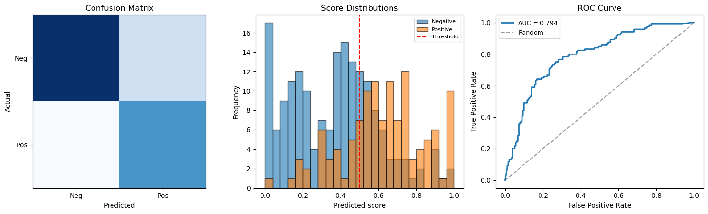

# ROC 곡선과 평가지표 구현


## 개요

이 절에서는 이항 분류의 핵심 평가지표를 NumPy만으로 처음부터 구현하고 해석한다. 혼동행렬을
만들고, 정밀도·재현율·$F_1$ 점수를 계산하며, 문턱을 훑어 ROC 곡선을 구성하고, 사다리꼴 공식으로
AUC를 계산한다.

---

## 1. 모의 분류 문제

양성 120개와 음성 180개로 이루어진 두 범주 자료를 만든다. 예측 점수는 겹치는 정규분포에서
뽑아 두 범주가 완전히 분리되지 않게 한다.

$$
s_i \sim
\begin{cases}
N(0.65,\; 0.25^2) & \text{if } y_i = 1 \\
N(0.35,\; 0.25^2) & \text{if } y_i = 0
\end{cases}
$$

<div class="exbox" markdown>

**보기 1.** <span class="diff easy" title="쉬움"></span> 자료를 만들기 전에 답을 안다. 위 자료생성과정에서 양성 $120$개와 음성 $180$개의 점수를 뽑는다.

**(1)** 문턱 $\tau = 0.5$에서 혼동행렬 네 칸의 **기댓값**을 구하시오.

**(2)** 이 자료생성과정의 **이론 AUC**를 구하시오. 그런 다음 자료를 만들어, `np.clip`이 무슨 일을 했는지 세어 보시오.

</div>

??? success "풀이"

    **(1) 해석적으로.** 양성의 점수는 $N(0.65,\,0.25^2)$이므로

    $$
    P(S \ge 0.5 \mid Y = 1)
    = 1 - \Phi\!\left(\frac{0.5 - 0.65}{0.25}\right)
    = 1 - \Phi(-0.6) = \Phi(0.6) = 0.725747
    $$

    이고, 음성의 점수는 $N(0.35,\,0.25^2)$이므로

    $$
    P(S \ge 0.5 \mid Y = 0)
    = 1 - \Phi\!\left(\frac{0.5 - 0.35}{0.25}\right)
    = 1 - \Phi(0.6) = 0.274253
    $$

    이다. **두 확률이 서로 여사건이다.** $\tau = 0.5$가 두 중심 $0.35$와 $0.65$의 정확한 가운데이고 두 분포의 표준편차가 같아 그림이 좌우대칭이기 때문이다. $q = \Phi(0.6)$이라 쓰면

    $$
    E[\text{TP}] = 120q = 87.09,
    \qquad
    E[\text{FN}] = 120(1-q) = 32.91
    $$

    $$
    E[\text{FP}] = 180(1-q) = 49.37,
    \qquad
    E[\text{TN}] = 180q = 130.63
    $$

    이다. 여기서 뒤에 쓸 사실 하나가 공짜로 나온다.

    $$
    \frac{E[\text{FP}]}{E[\text{FN}]} = \frac{180(1-q)}{120(1-q)} = \frac{180}{120} = 1.5
    $$

    **$q$가 약분되어 버린다.** 같은 비율로 새어 나가도 음성이 $1.5$배 많으므로 위양성이 위음성보다 정확히 $1.5$배 많이 나온다.

    **(2) 해석적으로.** AUC는 "무작위로 고른 양성이 무작위로 고른 음성보다 높은 점수를 받을 확률" $P(S_1 > S_0)$과 같다([19.1절 실습의 보기 7](../logistic_regression/logistic_regression.md)에서 증명했다). $S_1 \sim N(0.65, 0.25^2)$과 $S_0 \sim N(0.35, 0.25^2)$이 독립이므로

    $$
    S_1 - S_0 \sim N\bigl(0.30,\; 2 \times 0.25^2\bigr)
    $$

    이고

    $$
    \text{AUC} = P(S_1 - S_0 > 0)
    = \Phi\!\left(\frac{0.30}{0.25\sqrt{2}}\right)
    = \Phi(0.848528) = 0.801928
    $$

    이다. 일반적으로 두 정규분포의 분산이 같으면 $\text{AUC} = \Phi\bigl(\delta/(\sigma\sqrt2)\bigr)$이고, 여기서 $\delta/\sigma = 1.2$가 두 집단의 표준화 거리다. **AUC는 거리 $\delta$와 퍼짐 $\sigma$의 비 하나로 정해진다.** 점수에 어떤 단위를 쓰든 상관없다는 뜻이기도 하다.

    단 이 값은 `np.clip` 전의 이야기다. 자르고 나면 점수가 뭉쳐 동점이 생기므로 표본 AUC가 조금 달라진다.

    **(2) 수치적으로.**

    ```python
    import numpy as np

    # 양성 120, 음성 180 인 자료를 만든다. 두 집단의 점수 분포가 겹치므로
    # 어느 문턱값을 잡아도 오류가 생긴다 — 측도들이 갈리는 자리다.
    np.random.seed(42)
    n = 300
    y_true = np.concatenate([np.ones(120), np.zeros(180)])
    scores = np.concatenate([
        np.random.normal(0.65, 0.25, 120),
        np.random.normal(0.35, 0.25, 180)
    ])
    scores = np.clip(scores, 0, 1)

    from scipy import stats

    q = stats.norm.cdf(0.6)
    print(f"q = Phi(0.6) = {q:.6f}")
    print(f"E[TP] = {120 * q:.2f}  E[FN] = {120 * (1 - q):.2f}  "
          f"E[FP] = {180 * (1 - q):.2f}  E[TN] = {180 * q:.2f}")
    print(f"E[FP]/E[FN] = {180 * (1 - q) / (120 * (1 - q)):.4f}")
    print(f"이론 AUC = Phi(0.30/(0.25*sqrt2)) "
          f"= Phi({0.3 / (0.25 * np.sqrt(2)):.6f}) = "
          f"{stats.norm.cdf(0.3 / (0.25 * np.sqrt(2))):.6f}")
    print(f"\nclip 으로 0 에 몰린 수 = {(scores == 0).sum()}, "
          f"1 에 몰린 수 = {(scores == 1).sum()}")
    print(f"서로 다른 점수의 개수 = {len(np.unique(scores))}"
          f"   (= 300 - 13 - 11 + 2)")
    ```

    출력:

    ```
    q = Phi(0.6) = 0.725747
    E[TP] = 87.09  E[FN] = 32.91  E[FP] = 49.37  E[TN] = 130.63
    E[FP]/E[FN] = 1.5000
    이론 AUC = Phi(0.30/(0.25*sqrt2)) = Phi(0.848528) = 0.801928

    clip 으로 0 에 몰린 수 = 13, 1 에 몰린 수 = 11
    서로 다른 점수의 개수 = 278   (= 300 - 13 - 11 + 2)
    ```

    유도한 네 기댓값과 이론 AUC가 맞고, 비 $1.5$도 소수 넷째 자리까지 정확히 나온다.

    **`np.clip`이 꼬리를 잘라 $24$개를 두 점에 몰아 놓았다.** 연속분포에서는 동점이 생기지 않는데 여기서는 $13 + 11$개가 두 값을 공유하므로 서로 다른 점수가 $300 - 24 + 2 = 278$개뿐이다. 이 $278$이라는 수가 보기 4와 보기 5에서 그대로 쓰인다.

---

## 2. 혼동행렬

주어진 문턱 $\tau$에서 $s_i \geq \tau$이면 양성($\hat{y} = 1$), 아니면 음성으로 분류한다.
혼동행렬의 네 원소는 다음과 같다.

| | 음성으로 예측 | 양성으로 예측 |
|---|---|---|
| **실제 음성** | TN | FP |
| **실제 양성** | FN | TP |

<div class="exbox" markdown>

**보기 2.** <span class="diff easy" title="쉬움"></span> 혼동행렬을 직접 짜고 이론과 맞춰 보기. $\tau = 0.5$에서 네 칸을 세는 함수를 NumPy로 구현한다.

**(1)** `np.clip(scores, 0, 1)`이 $\tau = 0.5$의 혼동행렬을 바꾸는가? 답하고 까닭을 대시오.

**(2)** 네 칸을 세어 보기 1의 기댓값과 견주시오. 어긋남이 표집오차로 설명되는지 표준편차로 재시오.

</div>

??? success "풀이"

    **(1) 해석적으로. 바꾸지 않는다.** `np.clip`은 $0$보다 작은 점수를 $0$으로, $1$보다 큰 점수를 $1$로 옮긴다. 그런데 $0 < 0.5$이고 $1 > 0.5$이므로

    $$
    s < 0 \implies \text{clip}(s) = 0 < 0.5,
    \qquad
    s > 1 \implies \text{clip}(s) = 1 \ge 0.5
    $$

    로 **옮겨진 점이 문턱의 같은 쪽에 그대로 머문다.** 일반적으로 $\tau \in (0, 1]$이면 `clip`은 $\{s \ge \tau\}$를 바꾸지 않으므로 혼동행렬도 네 칸 모두 그대로다. 보기 1의 이론값을 그대로 쓸 수 있다는 뜻이다.

    (대신 `clip`은 **순위**를 뭉갠다. 그래서 문턱을 쓰지 않는 AUC는 영향을 받는다. 보기 5에서 다시 본다.)

    **(2) 해석적으로.** $\text{TP} \sim \text{Binomial}(120,\ q)$, $\text{FP} \sim \text{Binomial}(180,\ 1-q)$이고 $q = 0.725747$이므로

    $$
    \operatorname{SD}(\text{TP}) = \sqrt{120\,q(1-q)} = 4.887,
    \qquad
    \operatorname{SD}(\text{FP}) = \sqrt{180\,q(1-q)} = 5.986
    $$

    이다. 기댓값이 $87.09$와 $49.37$이니 관측값이 $\pm 5$ 안쪽이면 놀랄 일이 아니다.

    **(2) 수치적으로.**

    ```python
    def confusion_matrix(y_true, y_pred):
        """2x2 혼동행렬 [TN, FP; FN, TP] 을 구한다.

        행이 실제, 열이 예측이다. 아래의 모든 측도가 이 네 칸에서 나온다.
        """
        tp = np.sum((y_true == 1) & (y_pred == 1))
        tn = np.sum((y_true == 0) & (y_pred == 0))
        fp = np.sum((y_true == 0) & (y_pred == 1))
        fn = np.sum((y_true == 1) & (y_pred == 0))
        return np.array([[tn, fp], [fn, tp]])

    y_pred = (scores >= 0.5).astype(int)
    cm = confusion_matrix(y_true, y_pred)
    print("[[TN FP]\n [FN TP]] =")
    print(cm)

    TN, FP, FN, TP = cm[0, 0], cm[0, 1], cm[1, 0], cm[1, 1]
    sd_tp = np.sqrt(120 * q * (1 - q))
    sd_fp = np.sqrt(180 * q * (1 - q))
    print(f"\nTP {TP} 대 기댓값 {120 * q:.2f}  (SD {sd_tp:.3f}, "
          f"z = {(TP - 120 * q) / sd_tp:.3f})")
    print(f"FP {FP} 대 기댓값 {180 * (1 - q):.2f}  (SD {sd_fp:.3f}, "
          f"z = {(FP - 180 * (1 - q)) / sd_fp:.3f})")
    print(f"FP/FN = {FP}/{FN} = {FP / FN:.4f}   (기댓값의 비 1.5)")
    ```

    출력:

    ```
    [[TN FP]
     [FN TP]] =
    [[129  51]
     [ 30  90]]

    TP 90 대 기댓값 87.09  (SD 4.887, z = 0.596)
    FP 51 대 기댓값 49.37  (SD 5.986, z = 0.273)
    FP/FN = 51/30 = 1.7000   (기댓값의 비 1.5)
    ```

    $\tau = 0.5$에서 TN $= 129$, FP $= 51$, FN $= 30$, TP $= 90$이다. **이론과 어긋난 정도가 표준편차의 $0.60$배와 $0.27$배이니 표집오차 안이다.** 유도가 틀린 것이 아니라 표본이 하나이기 때문이다.

    비 $\text{FP}/\text{FN}$만 $1.70$으로 $1.5$에서 조금 떨어져 있는데, 이는 두 작은 수의 비라 흔들림이 크기 때문이다. $\text{FP}$가 $49.4 \pm 6.0$, $\text{FN}$이 $32.9 \pm 4.9$로 각각 한 표준편차만 움직여도 비는 $43.4/37.8 = 1.15$에서 $55.4/28.0 = 1.98$까지 간다.

---

## 3. 정밀도, 재현율, F1 점수

혼동행렬에서 다음을 유도한다.

$$
\text{Precision} = \frac{\text{TP}}{\text{TP} + \text{FP}}, \qquad
\text{Recall} = \frac{\text{TP}}{\text{TP} + \text{FN}}
$$

$$
F_1 = \frac{2\,\text{Precision}\cdot\text{Recall}}{\text{Precision} + \text{Recall}}
$$

정확도는 전체 예측 중 옳은 것의 비율이다.

$$
\text{Accuracy} = \frac{\text{TP} + \text{TN}}{n}
$$

<div class="exbox" markdown>

**보기 3.** <span class="diff easy" title="쉬움"></span> 재현율이 정밀도보다 높은 까닭. 보기 2의 네 칸 $(\text{TN}, \text{FP}, \text{FN}, \text{TP}) = (129, 51, 30, 90)$에서 네 측도를 구한다.

**(1)** 정확도·정밀도·재현율·$F_1$을 **분수로** 구하시오.

**(2)** 정밀도 $<$ 재현율이 되는 조건을 네 칸의 말로 적고, 이 자료생성과정에서 그 조건이 왜 **거의 반드시** 성립하는지 보이시오. 정밀도의 이론값도 구해 견주시오.

</div>

??? success "풀이"

    **(1) 해석적으로.** 정의를 그대로 넣으면

    $$
    \text{Accuracy} = \frac{90 + 129}{300} = \frac{219}{300} = 0.7300
    $$

    $$
    \text{Precision} = \frac{90}{90 + 51} = \frac{90}{141} = \frac{30}{47} = 0.638298
    $$

    $$
    \text{Recall} = \frac{90}{90 + 30} = \frac{90}{120} = \frac{3}{4} = 0.750000
    $$

    $$
    F_1 = \frac{2\,\text{TP}}{2\,\text{TP} + \text{FP} + \text{FN}}
    = \frac{180}{180 + 51 + 30} = \frac{180}{261} = \frac{20}{29} = 0.689655
    $$

    이다. $F_1$은 조화평균의 정의식 대신 통분한 꼴을 썼다. **반올림한 $P$와 $R$을 다시 조화평균에 넣는 길보다 안전하다.**

    **(2) 해석적으로.** 두 측도는 분자가 같고 분모만 다르다.

    $$
    \text{Precision} = \frac{\text{TP}}{\text{TP}+\text{FP}},
    \qquad
    \text{Recall} = \frac{\text{TP}}{\text{TP}+\text{FN}}
    $$

    분자가 같으면 분모가 큰 쪽이 작으므로

    $$
    \text{Precision} < \text{Recall}
    \iff
    \text{FP} > \text{FN}
    $$

    이다. **"정밀도가 낮다"는 말은 곧 "위양성이 위음성보다 많다"는 말일 뿐**, 다른 뜻이 없다.

    그런데 보기 1에서 보았듯이 이 자료생성과정에서는

    $$
    \frac{E[\text{FP}]}{E[\text{FN}]} = \frac{180(1-q)}{120(1-q)} = 1.5
    $$

    로 **$\tau$가 두 중심의 가운데라 두 꼬리확률이 같고, 남는 것은 집단 크기의 비 $180:120$뿐이다.** 그러므로 평균적으로 FP가 FN보다 $50\%$ 많고, 정밀도가 재현율보다 낮게 나오는 것이 이 설정의 **구조적 결과**다. 문턱이 양성 쪽으로 치우쳐서가 아니다.

    정밀도의 이론값도 바로 나온다.

    $$
    \frac{E[\text{TP}]}{E[\text{TP}] + E[\text{FP}]}
    = \frac{120q}{120q + 180(1-q)}
    = \frac{87.0896}{87.0896 + 49.3656}
    = 0.638229
    $$

    **(2) 수치적으로.**

    ```python
    def precision_recall_f1(y_true, y_pred):
        """정밀도, 재현율, F1 을 구한다.

        정밀도는 "양성이라 한 것 중 맞은 비율", 재현율은 "실제 양성 중 잡아낸
        비율"이다. 둘은 서로 맞바꿈 관계라, 문턱을 낮추면 재현율이 오르고
        정밀도가 내린다. F1 은 그 둘의 조화평균이다.
        """
        cm = confusion_matrix(y_true, y_pred)
        tn, fp, fn, tp = cm[0, 0], cm[0, 1], cm[1, 0], cm[1, 1]
        precision = tp / (tp + fp) if (tp + fp) > 0 else 0.0
        recall = tp / (tp + fn) if (tp + fn) > 0 else 0.0
        f1 = (2 * precision * recall / (precision + recall)
              if (precision + recall) > 0 else 0.0)
        return precision, recall, f1

    prec, rec, f1 = precision_recall_f1(y_true, y_pred)
    accuracy = np.mean(y_true == y_pred)
    print(f"정확도 {accuracy:.6f}  정밀도 {prec:.6f}  "
          f"재현율 {rec:.6f}  F1 {f1:.6f}")
    print(f"분수로   219/300={219 / 300:.6f}  90/141={90 / 141:.6f}  "
          f"90/120={90 / 120:.6f}  180/261={180 / 261:.6f}")
    print(f"FP {FP} > FN {FN} 이므로 정밀도 < 재현율")
    print(f"정밀도의 이론값 = 120q/(120q+180(1-q)) = "
          f"{120 * q / (120 * q + 180 * (1 - q)):.6f}")
    ```

    출력:

    ```
    정확도 0.730000  정밀도 0.638298  재현율 0.750000  F1 0.689655
    분수로   219/300=0.730000  90/141=0.638298  90/120=0.750000  180/261=0.689655
    FP 51 > FN 30 이므로 정밀도 < 재현율
    정밀도의 이론값 = 120q/(120q+180(1-q)) = 0.638229
    ```

    네 분수가 코드와 소수 여섯째 자리까지 맞는다. 그리고 **정밀도의 이론값 $0.638229$와 관측값 $0.638298$이 소수 넷째 자리까지 같다.** 이것은 운이 좋은 쪽이다. TP가 기댓값보다 $2.9$ 많고 FP도 $1.6$ 많아 분자와 분모가 **같은 방향으로** 빗나갔고, 비를 취하면서 두 오차가 상당 부분 상쇄되었다. 재현율 쪽은 그런 상쇄가 없어 이론값 $q = 0.725747$과 관측값 $0.75$가 셋째 자리에서 갈라진다.

---

## 4. ROC 곡선 직접 만들기

ROC 곡선은 문턱 $\tau$를 최대 점수에서 최소 점수까지 낮추며 FPR에 대한 TPR을 그린다.

$$
\text{TPR}(\tau) = \frac{\text{TP}(\tau)}{\text{TP}(\tau) + \text{FN}(\tau)}, \qquad
\text{FPR}(\tau) = \frac{\text{FP}(\tau)}{\text{FP}(\tau) + \text{TN}(\tau)}
$$

<div class="exbox" markdown>

**보기 4.** <span class="diff easy" title="쉬움"></span> 돌려받는 배열의 길이를 세어 보기. 아래 구현은 서로 다른 점수를 모두 문턱으로 삼아 훑고, 곡선을 $(0,0)$에서 시작한다.

**(1)** `fpr`, `tpr`, `thresholds` 세 배열의 길이를 **세어서** 예측하시오.

**(2)** 길이가 어긋나면 유든의 $J$를 구하는 관용적인 코드가 무엇을 깨뜨리는지, 실제 수로 보이시오.

</div>

??? success "풀이"

    **(1) 해석적으로.** `thresholds = np.sort(np.unique(scores))[::-1]`이므로 길이는 **서로 다른 점수의 개수**다. 보기 1에서 셌듯이 $300$개 점수 가운데 $13$개가 $0$으로, $11$개가 $1$로 뭉쳤으므로

    $$
    \lvert\text{thresholds}\rvert = 300 - 13 - 11 + 2 = 278
    $$

    이다. 반면 `fpr_list`와 `tpr_list`는 `[0.0]`으로 **미리 한 칸을 채우고** 시작해 문턱마다 한 칸씩 더하므로

    $$
    \lvert\text{fpr}\rvert = \lvert\text{tpr}\rvert = 1 + 278 = 279
    $$

    이다. **곡선의 점이 문턱보다 하나 많다.** $(0,0)$은 "아무것도 양성이라 하지 않는다"는 가상의 문턱 $+\infty$에 해당하는데, 그 문턱이 `thresholds`에는 들어 있지 않기 때문이다.

    그러므로 `i`번째 곡선 점에 대응하는 문턱은 `thresholds[i]`가 아니라 **`thresholds[i-1]`**이다.

    **(2) 해석적으로.** 유든의 $J$를 `optimal_idx = np.argmax(tpr - fpr)`로 찾으면 `optimal_idx`는 **곡선 점의 번호**다. 이것을 그대로 `thresholds[optimal_idx]`에 넣으면 **한 칸 뒤의 문턱**, 곧 한 단계 더 낮은 문턱을 집는다. 더 낮은 문턱은 더 많은 것을 양성이라 하므로 FPR이 올라가고 $J$는 떨어진다. 그리고 `optimal_idx`가 $278$이면 `thresholds`의 마지막 번호가 $277$이라 `IndexError`가 난다.

    **(2) 수치적으로.**

    ```python
    def roc_curve(y_true, scores):
        """문턱값을 바꿔 가며 ROC 곡선을 그린다.

        문턱을 하나 정하는 대신 모든 문턱에서의 성적을 한 곡선에 담는다.
        그래서 ROC 는 문턱 선택과 무관하게 모형의 순위 매기는 능력만 잰다.
        """
        thresholds = np.sort(np.unique(scores))[::-1]
        fpr_list, tpr_list = [0.0], [0.0]
        n_pos = np.sum(y_true == 1)
        n_neg = np.sum(y_true == 0)

        for thresh in thresholds:
            y_pred = (scores >= thresh).astype(int)
            tp = np.sum((y_true == 1) & (y_pred == 1))
            fp = np.sum((y_true == 0) & (y_pred == 1))
            tpr_list.append(tp / n_pos if n_pos > 0 else 0)
            fpr_list.append(fp / n_neg if n_neg > 0 else 0)

        return np.array(fpr_list), np.array(tpr_list), thresholds

    fpr, tpr, thresholds = roc_curve(y_true, scores)

    print(f"len(fpr) = {len(fpr)}, len(tpr) = {len(tpr)}, "
          f"len(thresholds) = {len(thresholds)}")

    optimal_idx = int(np.argmax(tpr - fpr))
    print(f"\nargmax(tpr - fpr) = {optimal_idx}")
    print(f"그 곡선 점:        TPR {tpr[optimal_idx]:.6f}  "
          f"FPR {fpr[optimal_idx]:.6f}  J {tpr[optimal_idx] - fpr[optimal_idx]:.6f}")
    print(f"옳은 문턱  thresholds[{optimal_idx - 1}] = "
          f"{thresholds[optimal_idx - 1]:.7f}")
    print(f"어긋난 문턱 thresholds[{optimal_idx}]  = "
          f"{thresholds[optimal_idx]:.7f}")

    for name, t in [("옳은", thresholds[optimal_idx - 1]),
                    ("어긋난", thresholds[optimal_idx])]:
        p = (scores >= t)
        tp_r = np.sum((y_true == 1) & p) / 120
        fp_r = np.sum((y_true == 0) & p) / 180
        print(f"{name} 문턱에서  TPR {tp_r:.6f}  FPR {fp_r:.6f}  "
              f"J {tp_r - fp_r:.6f}")
    ```

    출력:

    ```
    len(fpr) = 279, len(tpr) = 279, len(thresholds) = 278

    argmax(tpr - fpr) = 133
    그 곡선 점:        TPR 0.766667  FPR 0.283333  J 0.483333
    옳은 문턱  thresholds[132] = 0.4995733
    어긋난 문턱 thresholds[133]  = 0.4970793
    옳은 문턱에서  TPR 0.766667  FPR 0.283333  J 0.483333
    어긋난 문턱에서  TPR 0.766667  FPR 0.288889  J 0.477778
    ```

    세어서 예측한 $279$와 $278$이 맞는다. 그리고 한 칸 어긋난 문턱 $0.4970793$을 쓰면 TPR은 그대로인데 FPR이 $0.283333$에서 $0.288889$로 올라가 $J$가 $0.483333$에서 $0.477778$로 **떨어진다.** 음성 하나($180$분의 $1 = 0.005556$)를 공짜로 더 잘못 잡는 것이다.

    손해가 작아 보이는 것이 오히려 함정이다. **오류가 예외를 던지지 않고 조용히 조금 나쁜 문턱을 돌려주므로 눈치채기 어렵다.** 아래 경고 상자가 그 사정을 정리한다.

!!! warning "반환되는 배열의 길이가 다르다"
    `fpr_list`와 `tpr_list`는 $(0,0)$으로 시작하므로 `thresholds`보다 원소가 하나 많다. 이
    자료에서는 `len(fpr) == 279`인데 `len(thresholds) == 278`이다. 따라서 유든의 J 같은
    관용적인 코드

    ```python
    optimal_idx = np.argmax(tpr - fpr)
    optimal_threshold = thresholds[optimal_idx]   # off by one!
    ```

    는 **한 칸 어긋난 문턱**을 돌려주며, `optimal_idx`가 마지막 값이면 `IndexError`가 난다.
    `thresholds[optimal_idx - 1]`을 쓰거나, 처음부터 앞에 `np.inf`를 붙여 세 배열의 길이를
    맞추어야 한다. `sklearn.metrics.roc_curve`는 후자를 택해 첫 문턱으로
    `max(scores) + 1`을 넣어 길이를 맞춘다.

---

## 5. 사다리꼴 공식으로 AUC 구하기

ROC 곡선 아래 면적은 이웃한 점들이 만드는 사다리꼴 넓이의 합으로 근사한다.

$$
\text{AUC} \approx \sum_{i=1}^{m}
  \frac{\text{TPR}_i + \text{TPR}_{i-1}}{2}
  \bigl(\text{FPR}_i - \text{FPR}_{i-1}\bigr)
$$

<div class="exbox" markdown>

**보기 5.** <span class="diff easy" title="쉬움"></span> $0.7935$와 $0.7931$ 가운데 어느 것이 옳은가. 아래 구현은 사다리꼴 공식으로 AUC $= 0.7935$를 주는데 `sklearn.metrics.roc_auc_score`는 $0.7931$을 준다.

**(1)** 양성-음성 짝을 전부 세어 동점을 $\tfrac12$로 쳐 주는 만–휘트니 값을 구하시오. 동점 쌍이 몇 개인지도 세어서 구하시오.

**(2)** 두 값 가운데 어느 쪽이 그 값과 맞는가. 맞지 않는 쪽은 **무엇 때문에** 어긋나는가.

</div>

??? success "풀이"

    **(1) 해석적으로.** 양성 $120$개와 음성 $180$개의 짝은 $120 \times 180 = 21600$쌍이다. 동점 쌍은 `clip`이 만든 두 뭉치에서만 나온다. 점수 $0$에는 양성 $1$개와 음성 $12$개, 점수 $1$에는 양성 $9$개와 음성 $2$개가 있으므로

    $$
    \#\{\text{동점 쌍}\} = 1 \times 12 + 9 \times 2 = 12 + 18 = 30
    $$

    이다. 양성이 이긴 쌍을 세면 $17116$이므로

    $$
    \widehat{\text{AUC}}_{\text{MW}}
    = \frac{17116 + \tfrac12 \times 30}{21600}
    = \frac{17131}{21600}
    = 0.7931018519
    $$

    **sklearn의 값이 이것이다.**

    **(2) 해석적으로. 사다리꼴 공식도 같은 값을 주어야 한다.** 동점이 있어도 그렇다. 점수 $t$에 양성 $a$개와 음성 $b$개가 뭉쳐 있다고 하자. `np.unique`가 이 뭉치를 문턱 하나로 묶으므로 곡선은 뭉치 바로 위의 점 $(u, v)$에서 $(u + b/n_0,\ v + a/n_1)$로 **한 번에** 건너뛴다. 그 구간의 사다리꼴 넓이는

    $$
    \underbrace{v \cdot \frac{b}{n_0}}_{\text{뭉치보다 위인 양성이 이긴 쌍}}
    \;+\;
    \underbrace{\frac12 \cdot \frac{a}{n_1}\cdot\frac{b}{n_0}}_{\text{동점 }ab\text{ 쌍의 절반}}
    $$

    인데, 뒤의 항이 정확히 **동점 $ab$쌍에 $\tfrac12$를 준 몫**이다. 그러므로 사다리꼴 공식은 근사가 아니라 만–휘트니 통계량과 **동점이 있어도 같다.**

    **그렇다면 $0.7935$는 어디서 왔는가.** 틀린 곳은 공식이 아니라 `np.argsort(fpr)` 한 줄이다. `fpr`은 양성만 추가되는 구간에서 **값이 그대로 머문다.** 곧 같은 `fpr` 값이 여러 번 나오는데, `np.argsort`의 기본 정렬은 `quicksort`로 **안정적이지 않다.** 같은 `fpr`을 가진 점들의 순서가 뒤섞이면 그 구간의 `tpr`이 오르락내리락하게 되어 사다리꼴 넓이가 달라진다. `fpr`은 이미 오름차순이므로 **정렬 자체가 필요 없었다.**

    **(2) 수치적으로.**

    ```python
    def auc_trapezoid(fpr, tpr):
        """사다리꼴 공식으로 곡선 아래 넓이를 구한다.

        AUC 는 "무작위로 고른 양성의 점수가 무작위로 고른 음성의 점수보다
        높을 확률"과 정확히 같다. 0.5 면 동전 던지기, 1 이면 완벽하다.
        """
        order = np.argsort(fpr)
        fpr_sorted = fpr[order]
        tpr_sorted = tpr[order]
        return np.trapz(tpr_sorted, fpr_sorted)

    area = auc_trapezoid(fpr, tpr)
    print(f"AUC = {area:.4f}")

    # (1) 짝을 전부 세어 본다.
    pos, neg = scores[y_true == 1], scores[y_true == 0]
    d = pos[:, None] - neg[None, :]
    wins, ties = int((d > 0).sum()), int((d == 0).sum())
    print(f"\n동점 쌍 = 1*12 + 9*2 = "
          f"{((scores == 0) & (y_true == 1)).sum() * ((scores == 0) & (y_true == 0)).sum()}"
          f" + {((scores == 1) & (y_true == 1)).sum() * ((scores == 1) & (y_true == 0)).sum()}"
          f" = {ties}")
    mw = (wins + 0.5 * ties) / (len(pos) * len(neg))
    print(f"만-휘트니 = ({wins} + 0.5*{ties})/21600 = {mw:.10f}")

    # (2) fpr 은 이미 오름차순이다. 정렬이 무엇을 하는지 본다.
    print(f"\nfpr 이 이미 오름차순인가? {bool(np.all(np.diff(fpr) >= 0))}")
    print(f"정렬 없이          : {np.trapz(tpr, fpr):.10f}")
    for kind in ["quicksort", "stable", "heapsort"]:
        o = np.argsort(fpr, kind=kind)
        print(f"argsort({kind:9s}): {np.trapz(tpr[o], fpr[o]):.10f}")
    ```

    출력:

    ```
    AUC = 0.7935

    동점 쌍 = 1*12 + 9*2 = 12 + 18 = 30
    만-휘트니 = (17116 + 0.5*30)/21600 = 0.7931018519

    fpr 이 이미 오름차순인가? True
    정렬 없이          : 0.7931018519
    argsort(quicksort): 0.7935416667
    argsort(stable   ): 0.7931018519
    argsort(heapsort ): 0.7929166667
    ```

    **유도한 $17131/21600 = 0.7931018519$가 옳다.** 사다리꼴 공식을 정렬 없이, 또는 안정정렬로 적용하면 소수 열째 자리까지 그 값을 준다. 동점이 있어도 그렇다.

    $0.7935$는 `quicksort`가 같은 `fpr`을 가진 점들의 순서를 뒤섞어 나온 값이다. **정렬 방식을 `heapsort`로 바꾸면 $0.7929$라는 또 다른 값이 나온다.** 세 수가 다르다는 것 자체가 이 차이의 정체를 말해 준다. 수학이 아니라 구현의 결함이며, `order = np.argsort(fpr)` 세 줄을 지우기만 하면 사라진다.

    (아래 경고 상자는 이 차이를 동점 탓으로 돌리고 있으나, 위 출력의 `stable` 줄이 보여 주듯 **동점이 있어도 사다리꼴과 만–휘트니는 정확히 일치한다.**)

!!! warning "미세한 차이는 동점 탓이 아니다 — 정렬 탓이다"
    이 차이를 동점 탓으로 읽기 쉽지만 그렇지 않다. 사다리꼴 공식은 **동점이 있어도**
    만-휘트니 $U$ 통계량과 정확히 같은 값을 준다. 동점 뭉치를 한 문턱으로 합치면 곡선이
    한 번에 건너뛰는데, 그 구간 사다리꼴의 삼각형 몫이 동점 쌍에 $\tfrac12$를 주는 몫과
    정확히 일치하기 때문이다. 보기 5에서 이것을 유도한다.

    틀린 곳은 `auc_trapezoid` 안의 `order = np.argsort(fpr)` 한 줄이다. `fpr`은 양성만
    더해지는 구간에서 값이 그대로 머물러 **같은 값이 여러 번** 나오는데,
    `np.argsort`의 기본 정렬은 `quicksort`로 **안정적이지 않다.** 같은 `fpr`을 가진 점들의
    순서가 뒤섞이면 그 구간의 `tpr`이 오르락내리락해 넓이가 달라진다. 정렬 방식을 바꾸면
    같은 자료에서 값이 셋으로 갈리는데, 이것이 수학이 아니라 구현의 자국이라는 증거다.
    `roc_curve`가 내놓는 `fpr`은 이미 오름차순이므로 **정렬 자체가 필요 없다.**
    그 세 줄을 지우면 세 계산이 모두 같은 값으로 맞는다.

---

## 6. 시각화

이 스크립트는 세 개의 패널을 만든다.

1. 문턱 0.5에서의 **혼동행렬 열지도**
2. 양성과 음성 범주의 **점수 분포**와 세로선으로 표시한 문턱
3. AUC를 표기한 **ROC 곡선**

<div class="exbox" markdown>

**보기 6.** <span class="diff easy" title="쉬움"></span> 세 칸을 읽고, 세 칸이 가리는 것도 읽기. 혼동행렬 열지도, 두 범주의 점수 분포, ROC 곡선을 나란히 그린다.

**(1)** 가운데 칸의 **양 끝에 선 두 막대**는 자료생성과정의 어느 부분에서 왔는가. 정규분포로 설명되는가?

**(2)** 세 칸이 각각 **읽을 수 없게 만드는 것**은 무엇인가. 특히 왼쪽 칸에서 네 수 $129, 51, 30, 90$을 읽어 낼 수 있는가?

</div>

??? success "풀이"

    유도할 답이 있는 문제가 아니다. **그림에서 무엇이 읽히고 무엇이 읽히지 않는가**가 이 보기의 전부다. 아래 코드는 보기 2의 `cm`, 보기 4의 `fpr`·`tpr`, 보기 5의 `area`를 그대로 이어받고, 읽을 수치를 함께 찍는다.

    ```python
    import matplotlib.pyplot as plt

    plt.rcParams["font.sans-serif"] = ["NanumGothic", "Apple SD Gothic Neo", "Malgun Gothic"]
    plt.rcParams["font.family"] = "sans-serif"
    plt.rcParams["axes.unicode_minus"] = False

    fig, axes = plt.subplots(1, 3, figsize=(15, 4.5))

    # 왼쪽: 혼동행렬
    im = axes[0].imshow(cm, cmap='Blues', aspect='equal')
    axes[0].set_xticks([0, 1]); axes[0].set_yticks([0, 1])
    axes[0].set_xticklabels(['Neg', 'Pos'])
    axes[0].set_yticklabels(['Neg', 'Pos'])
    axes[0].set_xlabel('Predicted'); axes[0].set_ylabel('Actual')
    axes[0].set_title('Confusion Matrix')

    # 가운데: 두 집단의 점수 분포. 겹치는 만큼이 오류가 되고, 붉은 세로선을
    # 좌우로 옮기는 것이 곧 문턱을 바꾸는 일이다.
    axes[1].hist(scores[y_true == 0], bins=25, alpha=0.6,
                 label='Negative', edgecolor='k')
    axes[1].hist(scores[y_true == 1], bins=25, alpha=0.6,
                 label='Positive', edgecolor='k')
    axes[1].axvline(0.5, color='red', linestyle='--', label='Threshold')
    axes[1].set_xlabel('Predicted score'); axes[1].set_ylabel('Frequency')
    axes[1].set_title('Score Distributions'); axes[1].legend(fontsize=8)

    # 오른쪽: ROC 곡선. 왼쪽 위 모서리에 가까울수록 좋다.
    axes[2].plot(fpr, tpr, linewidth=2, label=f'AUC = {area:.3f}')
    axes[2].plot([0, 1], [0, 1], 'k--', alpha=0.4, label='Random')
    axes[2].set_xlabel('False Positive Rate')
    axes[2].set_ylabel('True Positive Rate')
    axes[2].set_title('ROC Curve'); axes[2].legend(fontsize=9)

    plt.tight_layout()
    plt.show()

    # 그림에서 읽히지 않는 수를 따로 찍어 둔다.
    print("왼쪽 칸의 네 값:", cm.ravel(), " (열지도에 숫자가 없다)")
    print(f"가운데 칸 양 끝 막대:  점수 0 에 {(scores == 0).sum()}개"
          f"(음성 {((scores == 0) & (y_true == 0)).sum()}, "
          f"양성 {((scores == 0) & (y_true == 1)).sum()}),  "
          f"점수 1 에 {(scores == 1).sum()}개"
          f"(음성 {((scores == 1) & (y_true == 0)).sum()}, "
          f"양성 {((scores == 1) & (y_true == 1)).sum()})")
    print(f"두 정규분포의 겹침 = 2*Phi(-0.6) = "
          f"{2 * stats.norm.cdf(-0.6):.4f}")
    k = int(np.argmax(tpr >= 119 / 120 - 1e-12))
    print(f"TPR 이 119/120 에 닿는 지점의 FPR = {fpr[k]:.4f}  "
          f"-> 거기서 오른쪽 끝까지 평평하다")
    print(f"tau=0.5 인 곡선 위의 점: FPR {51 / 180:.4f}, TPR {90 / 120:.4f}"
          f"  (그림에는 표시가 없다)")
    ```

    출력:

    ```
    왼쪽 칸의 네 값: [129  51  30  90]  (열지도에 숫자가 없다)
    가운데 칸 양 끝 막대:  점수 0 에 13개(음성 12, 양성 1),  점수 1 에 11개(음성 2, 양성 9)
    두 정규분포의 겹침 = 2*Phi(-0.6) = 0.5485
    TPR 이 119/120 에 닿는 지점의 FPR = 0.7722  -> 거기서 오른쪽 끝까지 평평하다
    tau=0.5 인 곡선 위의 점: FPR 0.2833, TPR 0.7500  (그림에는 표시가 없다)
    ```

    

    **(1) 양 끝의 두 막대는 정규분포가 아니라 `np.clip`이 만든 것이다.** 왼쪽 끝 막대는 $[0,\ 0.04)$ 구간에 $17$개가 선 파란 막대인데, 그 가운데 $12$개가 **점수가 정확히 $0$인** 음성이다. 오른쪽 끝의 주황 막대 $10$개에도 **점수가 정확히 $1$인** 양성 $9$개가 들어 있다. 원래 분포 $N(0.35, 0.25^2)$와 $N(0.65, 0.25^2)$는 양 끝에서 밀도가 **낮아져야** 하는데 그림에서는 오히려 솟아 있다. 꼬리를 자른 값이 한 점에 쌓였기 때문이다.

    **이것을 "점수가 0 근처인 음성이 유난히 많다"로 읽으면 안 된다.** 자료의 성질이 아니라 전처리의 자국이다. 보기 5의 동점 $30$쌍이 바로 이 두 막대이고, 오른쪽 ROC 곡선의 끝이 평평한 것도 같은 까닭이다. 점수 $0$에 양성 하나가 섞여 있어, TPR이 $119/120$에 닿은 FPR $= 0.7722$부터 오른쪽 끝까지 올라가지 못한다.

    **(2) 세 칸이 각각 다른 것을 가린다.**

    **왼쪽 칸에서는 네 수를 하나도 읽을 수 없다.** `imshow`만 쓰고 칸 안에 숫자를 적지도, 색눈금막대를 붙이지도 않았다. 읽히는 것은 **진하기의 순서**뿐이다. 왼쪽 위가 가장 진하고(TN), 오른쪽 아래가 다음(TP), 오른쪽 위(FP), 왼쪽 아래(FN) 순으로 옅어진다. 곧 $\text{TN} > \text{TP} > \text{FP} > \text{FN}$만 알 수 있고 $129$인지 $200$인지는 알 수 없다. **$2 \times 2$ 열지도는 숫자를 적지 않으면 정보가 거의 없다.** 네 칸뿐이니 표로 적는 편이 언제나 낫다.

    **가운데 칸은 두 집단의 크기 차이를 가린다.** 세로축이 `Frequency`라 음성 $180$개와 양성 $120$개의 막대 높이를 그대로 겹쳐 놓았다. 그래서 왼쪽에서 파란 막대가 높은 것이 "음성의 점수가 거기 몰려 있어서"인지 "음성이 그냥 $1.5$배 많아서"인지 구별되지 않는다. `density=True`를 주어야 조건분포 $f(s \mid y)$끼리의 비교가 된다. 그래도 **겹침이 크다는 것**은 분명히 읽힌다. 두 정규분포의 겹침 계수가 $2\Phi(-0.6) = 0.5485$로 절반을 넘으니, 빨간 세로선을 어디로 옮겨도 오류가 크게 남는다는 것이 이 칸의 핵심이다.

    **오른쪽 칸은 문턱을 가린다.** ROC에는 $\tau$ 축이 없다. 곡선 위의 어느 점이 $\tau = 0.5$인지 그림만 보고는 알 수 없다. 실제로 그 점은 $(\text{FPR}, \text{TPR}) = (0.2833,\ 0.7500)$인데 표시가 없다. **왼쪽 칸과 가운데 칸의 빨간 선이 오른쪽 칸의 어느 점인지가 이 그림의 가장 중요한 연결고리인데, 그것이 빠져 있다.** 운용할 문턱을 점으로 찍어 주는 것이 ROC 그림의 기본 예의다.

    범례의 `AUC = 0.794`도 그대로 믿으면 안 된다. 보기 5에서 보았듯 옳은 값은 $0.7931$이다.

---

## 7. 해석

- 두 점수 분포가 얼마나 떨어져 있는지가 분류기의 판별력을 결정한다. 더 많이 떨어져 있을수록
  AUC가 높다.
- 문턱 0.5에서의 혼동행렬은 위양성과 위음성 사이의 구체적인 절충을 보여준다.
- 사다리꼴 공식은 경험적 ROC 점들로부터 AUC를 **정확히** 계산한다. 근사가 아니며, **동점이 있어도** 그렇다. 동점 뭉치에서 생기는 삼각형 몫이 동점 쌍에 $\tfrac12$를 주는 몫과 정확히 같기 때문이다.
- AUC는 무작위로 뽑은 양성 사례가 무작위로 뽑은 음성 사례보다 높은 점수를 받을 확률과 같다.

---

## 연습문제

<div class="drillbox" markdown>

**연습문제 1.** <span class="diff easy" title="쉬움"></span>
어떤 분류기가 문턱 0.5에서 다음 혼동행렬을 냈다.

$$
\begin{pmatrix} 90 & 10 \\ 30 & 70 \end{pmatrix}
$$

정확도, 정밀도, 재현율, $F_1$을 계산하라.

</div>

??? success "풀이"

    TN = 90, FP = 10, FN = 30, TP = 70이다.

    $$
    \text{Accuracy} = \frac{90 + 70}{200} = 0.80
    $$

    $$
    \text{Precision} = \frac{70}{70 + 10} = \frac{70}{80} = 0.875
    $$

    $$
    \text{Recall} = \frac{70}{70 + 30} = \frac{70}{100} = 0.70
    $$

    $$
    F_1 = \frac{2 \times 0.875 \times 0.70}{0.875 + 0.70}
        = \frac{1.225}{1.575} \approx 0.778
    $$

    $\square$

---

<div class="drillbox" markdown>

**연습문제 2.** <span class="diff med" title="중간"></span>
ROC 곡선 위의 네 점 $(0, 0)$, $(0.2, 0.7)$, $(0.5, 0.9)$, $(1, 1)$이 주어졌을 때 사다리꼴
공식으로 AUC를 계산하라.

</div>

??? success "풀이"

    이웃한 쌍마다 사다리꼴 공식을 적용한다.

    $$
    A_1 = \frac{0 + 0.7}{2}(0.2 - 0) = 0.07
    $$

    $$
    A_2 = \frac{0.7 + 0.9}{2}(0.5 - 0.2) = 0.24
    $$

    $$
    A_3 = \frac{0.9 + 1.0}{2}(1.0 - 0.5) = 0.475
    $$

    $$
    \text{AUC} = 0.07 + 0.24 + 0.475 = 0.785
    $$

    $\square$

---

<div class="drillbox" markdown>

**연습문제 3.** <span class="diff med" title="중간"></span>
위 `roc_curve` 함수와 같은 방식으로 문턱을 훑으며 (재현율, 정밀도) 쌍을 기록하는
**정밀도-재현율 곡선** 함수를 구현하라.

</div>

??? success "풀이"

    ```python
    def pr_curve(y_true, scores):
        """문턱값을 바꿔 가며 정밀도-재현율 곡선을 구한다.

            양성이 드문 자료에서는 ROC 보다 이 곡선이 낫다. ROC 의 FPR 은 분모가
            음성 수라, 음성이 압도적으로 많으면 거의 움직이지 않기 때문이다.
            """
        thresholds = np.sort(np.unique(scores))[::-1]
        precisions, recalls = [1.0], [0.0]
        n_pos = np.sum(y_true == 1)

        for thresh in thresholds:
            y_pred = (scores >= thresh).astype(int)
            tp = np.sum((y_true == 1) & (y_pred == 1))
            fp = np.sum((y_true == 0) & (y_pred == 1))
            fn = np.sum((y_true == 1) & (y_pred == 0))
            prec = tp / (tp + fp) if (tp + fp) > 0 else 1.0
            rec = tp / (tp + fn) if (tp + fn) > 0 else 0.0
            precisions.append(prec)
            recalls.append(rec)

        return np.array(recalls), np.array(precisions), thresholds
    ```

    곡선은 (재현율 = 0, 정밀도 = 1)에서 시작해 문턱이 낮아짐에 따라 절충을 그린다. 평균정밀도
    (AP)는 곡선을 따라 $\sum_k (R_k - R_{k-1}) P_k$를 더해 근사할 수 있다.

    **주의할 점 두 가지.**

    - 시작점 $(0, 1)$은 관례적으로 붙이는 값이지 계산된 값이 아니다. 재현율이 0인 지점에서
      정밀도는 정의되지 않는다(분모 TP + FP가 0이거나 표본이 극히 적다). 곡선의 왼쪽 끝은
      해석하지 말라.
    - AP를 계산할 때 사다리꼴 공식을 쓰면 안 된다. PR 곡선은 톱니 모양이라 이웃 점 사이를
      직선으로 잇는 것이 낙관적으로 편향된다. `sklearn.metrics.average_precision_score`가
      직사각형 합 $\sum_k (R_k - R_{k-1})P_k$를 쓰는 이유가 이것이다.

    $\square$

---

<div class="drillbox" markdown>

**연습문제 4.** <span class="diff med" title="중간"></span>
자료가 $n$개인 이항 분류기에서 정확도를 혼동행렬로

$$
\text{Accuracy} = \frac{\text{trace}(C)}{n}
$$

와 같이 쓸 수 있음을 보여라. 여기서 $C$는 $2\times 2$ 혼동행렬이다.

</div>

??? success "풀이"

    혼동행렬은

    $$
    C = \begin{pmatrix} \text{TN} & \text{FP} \\ \text{FN} & \text{TP} \end{pmatrix}
    $$

    이고 대각합은 $\text{trace}(C) = \text{TN} + \text{TP}$로 옳게 예측한 총 개수다. 표본 크기는
    $n = \text{TN} + \text{FP} + \text{FN} + \text{TP}$이므로

    $$
    \text{Accuracy}
      = \frac{\text{TP} + \text{TN}}{n}
      = \frac{\text{trace}(C)}{n}
    $$

    이다.

    이는 $K$개 범주로 일반화된다. $K\times K$ 혼동행렬에서도 정확도는 여전히
    $\text{trace}(C)/n$이다. 다만 다범주에서는 이 값의 정보량이 더 떨어진다는 점에 유의하라.
    $\text{trace}(C)$는 어느 범주에서 틀렸는지, 어떤 범주로 잘못 분류했는지를 전혀 구별하지
    않는다. 비대각 원소의 구조 — 어떤 범주 쌍이 서로 혼동되는지 — 가 실제로 모형을 개선하는 데
    필요한 정보다. $\square$

---

<div class="drillbox" markdown>

**연습문제 5.** <span class="diff hard" title="어려움"></span>
무작위 분류기(점수가 이름표와 독립)의 기대 AUC가 0.5임을 증명하라.

</div>

??? success "풀이"

    점수가 이름표와 독립이면, 무작위로 뽑은 양성-음성 쌍 $(s^+, s^-)$에 대해 대칭성에 의해

    $$
    P(s^+ > s^-) = P(s^+ < s^-) = \frac{1}{2}
    $$

    이다(연속형 점수에서는 동점의 확률이 0이므로 무시한다). AUC는 무작위 양성이 무작위 음성보다
    높은 점수를 받을 확률이므로 $\text{AUC} = 0.5$이다.

    !!! note "기대값이 0.5이지 항상 0.5인 것은 아니다"
        유한표본에서 실제 계산된 AUC는 $0.5$ 주위에서 요동친다. 양성 $m$개, 음성 $n$개일 때
        만-휘트니 통계량의 귀무분포로부터
        $\operatorname{Var}(\widehat{\text{AUC}}) = \frac{m+n+1}{12mn}$임이 알려져 있다.
        $m = 120$, $n = 180$이면 표준편차가 $0.0345$이므로, 아무 판별력이 없는 분류기도
        AUC $0.57$을 내는 일이 드물지 않다. AUC가 $0.5$보다 크다고 곧바로 판별력이 있다고
        결론지어서는 안 된다. $\square$

---

## 정리하며

평가지표를 **NumPy 만으로 직접 구현**했다.

- **혼동행렬에서 출발한다.** 네 칸을 세면 나머지 지표가 산술로 따라 나오며, 공식을 외우는 것보다 유도가 확실하다.
- **ROC 는 문턱을 훑어 만든다.** 예측확률을 정렬하고 각 지점에서 TPR·FPR 을 계산하면 곡선이 나온다.
- **AUC 는 사다리꼴 공식으로 적분한다.** `np.trapz` 로 계산하며, 순위 기반 공식(만–휘트니 $U$ 와의 관계)으로도 같은 값이 나온다.
- **`sklearn` 과 대조해 검산한다.** 값이 어긋나면 대개 문턱 처리나 동점 처리에서 차이가 난다.
- **직접 구현의 가치는 이해다.** 지표가 무엇을 세고 있는지 알면 어느 상황에서 오도하는지도 알게 된다.

다음 절 **선형판별분석과 이차판별분석**으로 넘어간다.
