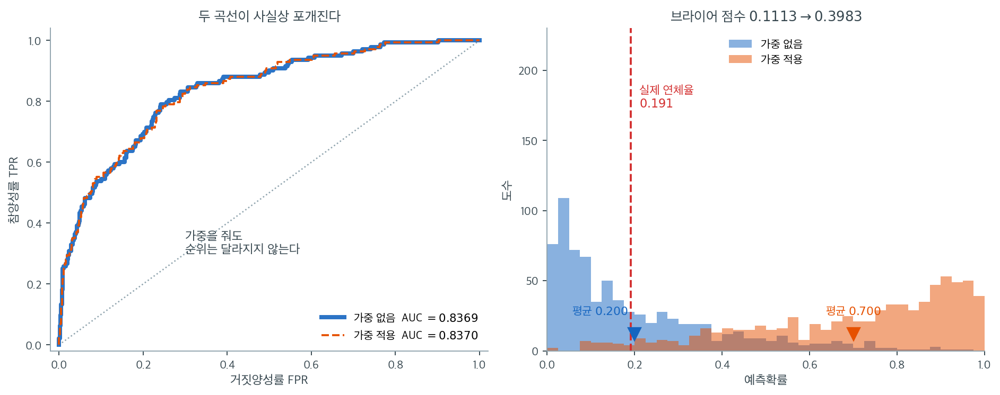

# 불균형 자료 다루기


## 문제: 범주 불균형

현실의 많은 분류 문제에서 범주는 **고르게 나타나지 않는다.** 예를 들면,

- **대출 연체:** 연체율 약 5--20%, 대부분은 상환된다
- **이상거래 탐지:** 부정거래는 보통 전체의 1% 미만
- **질병 진단:** 희귀질환의 유병률은 5% 미만
- **스팸 탐지:** 스팸은 보통 전체 메일의 10--20% 미만

불균형 자료로 학습한 분류기는 **다수 범주를 지나치게 자주 예측하는** 경향이 있어, 정확도는
높지만 드문(양성) 범주를 잘 찾아내지 못한다. 예컨대 상환율이 81%인 대출 자료에서 언제나
"상환"이라고 예측하는 모형은 정확도 81%를 달성하지만 연체는 한 건도 잡지 못한다.

### 유병률 비율 문제

불균형 자료로 학습하면 모형은 경험분포로부터 범주 확률을 배운다. 훈련자료의 유병률이 목표
모집단과 다르면 소수 범주에 대한 예측확률의 보정이 무너진다.

## 설정

아래 코드는 모두 같은 자료를 쓴다. 연체율이 약 19%인 대출자료를 만들고
훈련·검증·검정으로 나눈다.

<div class="exbox" markdown>

**보기 1.** <span class="diff easy" title="쉬움"></span> 절편 $-2.0$이 연체율 $19\%$를 만든다. 설명변수 셋이 서로 독립인 $N(0,1)$이고 $\operatorname{logit} p = -2.0 - 1.1\,\text{score} + 0.9\,\text{dti} - 0.5\,\text{income}$인 자료를 $n = 4000$ 생성한다.

**(1)** 설명변수를 모르는 채 한 사람을 뽑았을 때의 **주변 연체율** $P(Y=1)$을 적분으로 적고, 그 값이 왜 $\sigma(-2) = 0.1192$보다 **큰지** 설명하시오.

**(2)** 자료를 만들어 관측 연체율과 견주고, `stratify`가 세 조각에서 무슨 일을 하는지 확인하시오.

</div>

??? success "풀이"

    **(1) 해석적으로.** 세 설명변수의 선형결합

    $$
    Z = -1.1\,\text{score} + 0.9\,\text{dti} - 0.5\,\text{income}
    $$

    는 독립인 표준정규 셋의 일차결합이므로 정규분포이고, 분산은 계수의 제곱합이다.

    $$
    \operatorname{Var}(Z) = 1.1^2 + 0.9^2 + 0.5^2 = 1.21 + 0.81 + 0.25 = 2.27
    $$

    곧 $Z \sim N(0,\ 1.506652^2)$이다. 따라서

    $$
    P(Y = 1) = E\bigl[\sigma(-2 + Z)\bigr]
    = \int_{-\infty}^{\infty} \sigma(-2 + 1.506652\,w)\,\phi(w)\,dw
    $$

    이다. 닫힌 꼴이 없으니 수치적분으로 구하면 $0.190528$이다.

    **왜 $\sigma(-2) = 0.119203$보다 큰가.** 옌센의 부등식이 답한다. $\sigma$는 인수가 음수인 쪽에서 **아래로 볼록**이다($\sigma'' = \sigma(1-\sigma)(1-2\sigma) > 0$은 $\sigma < 1/2$일 때, 곧 인수가 음수일 때 성립한다). 이 자료는 $-2 + Z$가 $81\%$의 확률로 음수인 영역에 머무르므로 볼록한 쪽이 지배하고

    $$
    E[\sigma(-2+Z)] > \sigma\bigl(E[-2+Z]\bigr) = \sigma(-2)
    $$

    가 된다. **설명변수의 흩어짐이 주변 확률을 끌어올린다.** 올리는 쪽(위험한 사람)의 확률 증가가 내리는 쪽의 감소보다 크기 때문이며, 크기로는 $0.1192$에서 $0.1905$로 $60\%$ 늘어난다.

    **(2) 수치적으로.**

    ```python
    import numpy as np
    from sklearn.linear_model import LogisticRegression
    from sklearn.model_selection import train_test_split

    rng = np.random.default_rng(0)
    n = 4000

    # 신용점수·부채비율·소득이 연체 위험을 결정한다
    score = rng.normal(0, 1, n)
    dti = rng.normal(0, 1, n)
    income = rng.normal(0, 1, n)
    X = np.column_stack([score, dti, income])

    # 절편 -2.0이 연체율을 약 19%로 맞춘다
    logit = -2.0 - 1.1 * score + 0.9 * dti - 0.5 * income
    p_default = 1 / (1 + np.exp(-logit))
    y = (rng.random(n) < p_default).astype(int)   # 1 = 연체, 0 = 상환

    X_tmp, X_test, y_tmp, y_test = train_test_split(
        X, y, test_size=0.25, random_state=0, stratify=y)
    X_train, X_val, y_train, y_val = train_test_split(
        X_tmp, y_tmp, test_size=0.25, random_state=0, stratify=y_tmp)

    print(f"n = {n}, 연체율 = {y.mean():.3f}")
    print(f"train {len(y_train)}, val {len(y_val)}, test {len(y_test)}")

    from scipy import integrate, stats

    sd = np.sqrt(1.1**2 + 0.9**2 + 0.5**2)
    g = lambda w: 1 / (1 + np.exp(-(-2 + sd * w))) * stats.norm.pdf(w)
    theo = integrate.quad(g, -10, 10)[0]
    print(f"\nVar(Z) = 2.27,  sd = {sd:.6f}")
    print(f"이론 연체율 = {theo:.6f}   sigma(-2) = "
          f"{1 / (1 + np.exp(2)):.6f}")
    print(f"관측 연체율 = {y.mean():.6f}  "
          f"(표준오차 {np.sqrt(theo * (1 - theo) / n):.5f})")
    print(f"\n조각별 연체율  train {y_train.mean():.6f}  "
          f"val {y_val.mean():.6f}  test {y_test.mean():.6f}")
    print(f"조각별 연체 건수  train {y_train.sum()}  val {y_val.sum()}  "
          f"test {y_test.sum()}   합 {y.sum()}")
    ```

    출력:

    ```
    n = 4000, 연체율 = 0.191
    train 2250, val 750, test 1000

    Var(Z) = 2.27,  sd = 1.506652
    이론 연체율 = 0.190528   sigma(-2) = 0.119203
    관측 연체율 = 0.190750  (표준오차 0.00621)

    조각별 연체율  train 0.190667  val 0.190667  test 0.191000
    조각별 연체 건수  train 429  val 143  test 191   합 763
    ```

    **유도한 $0.190528$과 관측값 $0.190750$이 표준오차의 $0.04$배 안에서 맞는다.** 그리고 $\sigma(-2) = 0.119203$보다 확실히 크다. 절편만 보고 "연체율 $12\%$"라고 읽으면 안 된다는 뜻이다.

    `stratify`가 한 일은 세 조각의 연체율을 가지런히 맞춘 것이다. $0.190667$, $0.190667$, $0.191000$으로 소수 셋째 자리까지 같다. **층화하지 않았다면 검정자료 $1000$건의 연체율이 $0.191 \pm 0.012$쯤 흔들렸을 테고**($\sqrt{0.191 \times 0.809/1000} = 0.0124$), 검증자료에서 고른 문턱이 검정자료에서 어긋나는 원인이 되었을 것이다. 불균형 자료에서 층화는 선택이 아니라 기본이다.

## 전략 1: 가중을 통한 조정

한 가지 접근은 학습 시 **소수 범주 오류의 비용(가중치)을 키우는** 것이다.

$$
\ell_{\text{weighted}} = -\sum_{i=1}^{n} w_i \left[ y^{(i)} \log \hat{p}_i + (1 - y^{(i)}) \log(1 - \hat{p}_i) \right]
$$

여기서 $w_i$는 관측치 $i$에 부여된 가중치다.

### 범주 가중치

흔한 선택은 **빈도의 역수로 가중**하는 것이다.

$$
w_{\text{minority}} = \frac{1}{p_{\text{minority}}}, \quad w_{\text{majority}} = \frac{1}{p_{\text{majority}}}
$$

또는 간단히 $w_{\text{minority}} = 1$, $w_{\text{majority}} = p_{\text{minority}} / p_{\text{majority}}$
로 둔다.

### 대출 자료

연체율 18.9%, 상환율 81.1%인 어떤 대출자료에서 보고된 결과는 다음과 같다.

| 가중 없음 | 가중 적용 |
|---|---|
| 연체로 예측: 0.98% | 연체로 예측: 61.8% |
| 실제 유병률의 20분의 1 수준 | 실제 유병률에 훨씬 가까움 |

가중이 양성 예측 비율을 얼마나 끌어올리는지는 자료마다 다르지만 방향은 같다.
아래 코드는 위 **설정**의 자료(연체율 19.1%)로 같은 현상을 확인한다.

scikit-learn에서는 다음과 같다.

<div class="exbox" markdown>

**보기 2.** <span class="diff easy" title="쉬움"></span> 가중은 문턱을 옮기는 일이다. 아래 코드는 `class_weight='balanced'`를 **그리고** `sample_weight`로 $5.3$배를 **함께** 준다.

**(1)** 훈련자료가 연체 $429$건, 상환 $1821$건일 때 두 가중이 겹쳐 생기는 **실효 가중비**를 구하시오. 그 가중이 절편을 얼마나 밀어 올려야 하는가?

**(2)** 가중 모형을 문턱 $0.5$로 쓰는 것이 가중 없는 모형을 어느 문턱으로 쓰는 것과 같은지 구하고, 예측 연체율 $0.776$을 그 문턱으로 재현해 보시오.

</div>

??? success "풀이"

    **(1) 해석적으로.** scikit-learn의 `class_weight='balanced'`는 범주 $c$에 $n/(K n_c)$를 준다. $K = 2$이므로

    $$
    w_1^{\text{bal}} = \frac{2250}{2 \times 429} = 2.622378,
    \qquad
    w_0^{\text{bal}} = \frac{2250}{2 \times 1821} = 0.617792
    $$

    이고 비는 $w_1^{\text{bal}}/w_0^{\text{bal}} = 1821/429 = 4.244755$다.

    **중요한 것은 `sample_weight`가 이것을 대체하지 않고 곱해진다는 점이다.** `fit`에 넘긴 $5.3$이 `class_weight`와 함께 쓰이므로 실효 가중비는

    $$
    \frac{w_1}{w_0} = 5.3 \times 4.244755 = 22.4972
    $$

    가 된다. 코드의 주석은 $5.3$이 자동값과 비슷하도록 맞춘 값이라 하지만, 둘이 **겹쳐서** 다섯 배 넘게 세진다.

    가중 로그가능도는 양성 하나를 $w_1$번, 음성 하나를 $w_0$번 센 것과 같다. 이는 양성을 $w_1$의 비율로, 음성을 $w_0$의 비율로 표집한 자료를 보는 것과 같으므로, 연습문제 1의 프렌티스-파이크 결과가 그대로 적용된다. **기울기는 그대로이고 절편만**

    $$
    \Delta = \log\frac{w_1}{w_0} = \log 22.4972 = 3.1134
    $$

    **만큼 올라간다.**

    **(2) 해석적으로.** 가중 모형의 로그오즈가 가중 없는 모형보다 어디서나 $\Delta$만큼 크다면

    $$
    \hat\eta_w(\mathbf x) \ge 0
    \iff
    \hat\eta(\mathbf x) + \Delta \ge 0
    \iff
    \hat\eta(\mathbf x) \ge -\Delta
    \iff
    \hat p(\mathbf x) \ge \sigma(-\Delta)
    $$

    이다. 곧 **가중 모형을 문턱 $0.5$로 쓰는 것은 가중 없는 모형을 문턱**

    $$
    \tau = \sigma(-\Delta) = \frac{1}{1 + w_1/w_0} = \frac{1}{1 + 22.4972} = 0.042558
    $$

    **로 쓰는 것과 같다.** 자료를 한 건도 바꾸지 않고 확률 $0.0426$ 위를 모두 연체로 부른다는 뜻이며, 검증자료에서 그 비율이 $0.776$ 근처여야 한다.

    **(2) 수치적으로.**

    ```python
    from sklearn.linear_model import LogisticRegression

    # 방법 1: 'balanced' 는 각 범주의 빈도에 반비례해 가중값을 자동으로 정한다.
    model = LogisticRegression(class_weight='balanced')

    # 방법 2: 직접 정한다. 5.3 은 위 자동값과 비슷하게 맞춘 것이다.
    # 가중을 주면 모형이 소수 범주를 더 자주 예측하게 되는데, 이는 실은
    # 문턱값을 옮기는 것과 비슷한 일을 하는 셈이다.
    weights = [5.3 if yi == 1 else 1.0 for yi in y_train]
    model.fit(X_train, y_train, sample_weight=weights)

    print("가중 없음 예측 연체율:",
          LogisticRegression().fit(X_train, y_train).predict(X_val).mean().round(4))
    print("가중 적용 예측 연체율:", model.predict(X_val).mean().round(4))

    n1, n0 = int(y_train.sum()), int((1 - y_train).sum())
    eff = 5.3 * n0 / n1
    print(f"\n연체 {n1}건, 상환 {n0}건  ->  balanced 비 = {n0 / n1:.6f}")
    print(f"실효 가중비 = 5.3 * {n0 / n1:.4f} = {eff:.4f},  "
          f"log = {np.log(eff):.4f}")

    plain = LogisticRegression().fit(X_train, y_train)
    print(f"\n가중 없음  절편 {plain.intercept_[0]:.6f}  "
          f"기울기 {np.round(plain.coef_[0], 4)}")
    print(f"가중 적용  절편 {model.intercept_[0]:.6f}  "
          f"기울기 {np.round(model.coef_[0], 4)}")
    print(f"절편 이동 = {model.intercept_[0] - plain.intercept_[0]:.4f}"
          f"   (예측 {np.log(eff):.4f})")

    tau = 1 / (1 + eff)
    p_plain = plain.predict_proba(X_val)[:, 1]
    print(f"\n같은 문턱 tau = 1/(1+{eff:.4f}) = {tau:.6f}")
    print(f"가중 없음 모형을 tau 로 자른 예측 연체율 = {(p_plain >= tau).mean():.4f}")
    print(f"가중 모형을 0.5 로 자른 예측 연체율      = "
          f"{model.predict(X_val).mean():.4f}")
    print(f"두 분류가 엇갈린 관측 = "
          f"{int((model.predict(X_val) != (p_plain >= tau)).sum())} / {len(y_val)}")
    ```

    출력:

    ```
    가중 없음 예측 연체율: 0.096
    가중 적용 예측 연체율: 0.776

    연체 429건, 상환 1821건  ->  balanced 비 = 4.244755
    실효 가중비 = 5.3 * 4.2448 = 22.4972,  log = 3.1134

    가중 없음  절편 -1.948054  기울기 [-0.9578  0.9223 -0.5285]
    가중 적용  절편 1.139232  기울기 [-1.0132  0.9481 -0.4773]
    절편 이동 = 3.0873   (예측 3.1134)

    같은 문턱 tau = 1/(1+22.4972) = 0.042558
    가중 없음 모형을 tau 로 자른 예측 연체율 = 0.7960
    가중 모형을 0.5 로 자른 예측 연체율      = 0.7760
    두 분류가 엇갈린 관측 = 19 / 750
    ```

    **유도가 맞되 정확히는 아니다.** 절편 이동의 예측값 $3.1134$와 관측값 $3.0873$이 $0.8\%$ 차이이고, 예측 연체율은 $0.7960$ 대 $0.7760$으로 $750$건 중 $19$건이 엇갈린다.

    **어긋나는 까닭은 기울기도 함께 다시 적합되기 때문이다.** 프렌티스-파이크 결과는 "모형이 참이면 기울기가 그대로"라고 말하지만, 여기서는 유한표본이고 거기에 sklearn의 기본 L2 벌점까지 걸려 있다. 가중을 주면 실효 표본크기가 커져 벌점의 상대적 세기가 달라지고, 기울기가 $(-0.9578,\ 0.9223,\ -0.5285)$에서 $(-1.0132,\ 0.9481,\ -0.4773)$로 $5\%$쯤 움직인다. 순위가 조금 달라졌으니 문턱 하나로 완전히 포개지지는 않는다.

    **그래도 요점은 분명하다.** 가중이 한 일의 $99\%$는 절편을 $3.09$ 밀어 올린 것이고, 그것은 문턱을 $0.5$에서 $0.0426$으로 내린 것과 사실상 같다. **자료도 손실함수도 건드리지 않고 문턱만 옮기면 같은 결과를 얻으면서 확률은 그대로 남는다.**

**장점:**

- 구현이 간단하다
- 계산이 효율적이다
- 원래 자료 크기를 보존한다

**단점:**

- 적절한 가중비를 골라야 한다
- **확률 추정의 보정을 무너뜨린다.** 아래 경고와 연습문제 2를 보라

## 전략 2: 재표집

### 과소표집

**과소표집**은 다수 범주의 관측치를 제거해 자료를 균형 있게 만든다.

```
Original:   81,105 paid off + 18,895 default
Undersampled: 18,895 paid off + 18,895 default
```

**장점:**

- 간단하고 범주가 완벽히 균형을 이룬다
- 학습 시간이 줄어든다

**단점:**

- **정보 손실:** 다수 범주 자료를 버린다
- 분산이 커져 추정이 덜 안정적이다
- 확률 추정이 50 대 50 쪽으로 치우친다

### 과대표집

**과대표집**은 소수 범주의 관측치를 복제한다.

```
Original:   81,105 paid off + 18,895 default
Oversampled: 81,105 paid off + 81,105 default (via replication)
```

**단점:**

- 중복된 복사본이 생긴다
- 과적합으로 이어질 수 있다
- 자료 크기가 부풀어 오른다

## 전략 3: 합성 소수범주 과대표집(SMOTE)

**SMOTE**는 이웃한 소수 범주 관측치 사이를 내삽하여 **합성 표본**을 만든다. 정확한 복제 대신
가까운 소수 범주 사례를 잇는 선분 위에 새 점을 만든다.

### SMOTE의 작동 방식

각 소수 범주 표본 $x_i$에 대해,

1. 소수 범주 안에서 $k$개의 최근접 이웃을 찾는다(보통 $k=5$).
2. 이웃 하나 $x_{\text{neighbor}}$를 무작위로 고른다.
3. 합성점을 만든다.

   $$x_{\text{synthetic}} = x_i + \lambda (x_{\text{neighbor}} - x_i)$$

   여기서 $\lambda \in [0, 1]$은 무작위다.

### SMOTE를 적용한 대출 자료

<div class="exbox" markdown>

**보기 3.** <span class="diff easy" title="쉬움"></span> SMOTE 뒤의 크기를 미리 안다. 훈련자료는 연체 $429$건, 상환 $1821$건이다.

**(1)** `SMOTE(random_state=0)`가 기본 설정(`sampling_strategy='auto'`)에서 만들어 낼 **합성점의 개수**와 재표집 뒤의 $n$을 구하시오.

**(2)** 확인하고, SMOTE가 왜 **훈련자료에만** 적용되어야 하는지 적으시오.

</div>

??? success "풀이"

    **(1) 해석적으로.** 기본 설정의 SMOTE는 소수 범주를 다수 범주와 **같은 개수**가 되도록 채운다. 그러므로 만들어 낼 합성점의 개수는

    $$
    1821 - 429 = 1392
    $$

    이고 재표집 뒤의 크기는

    $$
    n = 1821 + 1821 = 2 \times 1821 = 3642
    $$

    이다. 연체율은 정확히 $0.500$이 된다. **다수 범주는 하나도 건드리지 않으므로 원래 $2250$건이 모두 그대로 남고 $1392$건이 더해져 $2250 + 1392 = 3642$**라고 세어도 같다.

    **(2) 수치적으로.**

    ```python
    from imblearn.over_sampling import SMOTE

    # SMOTE 는 소수 범주의 관측값 사이를 이어 새 점을 만들어 채운다. 단순
    # 복제와 달리 같은 점이 겹치지 않는다는 것이 장점이다. 다만 만들어 낸
    # 점은 실제 관측이 아니므로, 반드시 훈련자료에만 적용해야 한다.
    # 검증·시험자료에 쓰면 성능이 부풀려진다.
    X_resampled, y_resampled = SMOTE(random_state=0).fit_resample(X_train, y_train)

    model = LogisticRegression()
    model.fit(X_resampled, y_resampled)

    print(f"원자료:   n = {len(y_train)}, 연체율 = {y_train.mean():.3f}")
    print(f"SMOTE 후: n = {len(y_resampled)}, 연체율 = {y_resampled.mean():.3f}")

    print(f"\n소수 {n1} -> {int(y_resampled.sum())},  "
          f"합성점 {int(y_resampled.sum()) - n1}개  (= {n0} - {n1})")
    print(f"다수 {n0} -> {int((1 - y_resampled).sum())} (그대로)")
    print(f"n = {n0} + {n0} = {2 * n0} = {len(y_resampled)}")
    ```

    출력:

    ```
    원자료:   n = 2250, 연체율 = 0.191
    SMOTE 후: n = 3642, 연체율 = 0.500

    소수 429 -> 1821,  합성점 1392개  (= 1821 - 429)
    다수 1821 -> 1821 (그대로)
    n = 1821 + 1821 = 3642 = 3642
    ```

    **세어서 예측한 $1392$와 $3642$가 정확히 맞는다.** 반올림이 끼어들 자리가 없는 계산이라 그렇다(보기 4의 ADASYN은 그렇지 않다).

    **훈련자료에만 써야 하는 까닭.** SMOTE가 만든 점 $x_{\text{syn}} = x_i + \lambda(x_{\text{nb}} - x_i)$는 **원자료 두 점의 정보로 만들어진 것**이지 새 관측이 아니다. 이것을 검증·검정자료에 섞으면 두 가지가 동시에 망가진다. 첫째, 합성점이 자신을 만든 원본과 거의 같은 위치에 있으므로 모형이 훈련에서 본 점을 검정에서 다시 보는 셈이 되어 **성능이 부풀려진다.** 둘째, 검정자료의 연체율이 $0.191$에서 $0.5$로 바뀌어 **정밀도·AP처럼 유병률에 의존하는 측도가 모두 거짓이 된다.** 재표집은 모형을 만드는 쪽의 일이고, 평가는 손대지 않은 원래 분포에서 해야 한다.

**장점:**

- 내삽으로 그럴듯한 합성 표본을 만든다
- 정확한 복제를 피하므로 순진한 과대표집보다 과적합이 덜하다
- 국소적인 이웃 구조를 보존한다
- 실무에서 널리 쓰인다

**단점:**

- 단순 재표집보다 복잡하다
- 이웃을 찾는 계산 부담이 있다
- 연속형 특성을 전제한다(이산형·범주형은 변형이 필요하다)
- **다른 재표집과 마찬가지로 보정을 무너뜨린다**

### SMOTE의 변형

- **BorderlineSMOTE:** 결정경계 근처의 소수 범주 표본에 집중한다
- **ADASYN:** 학습하기 어려운 소수 범주 사례에 더 많은 표본을 만든다
- **SVMSMOTE:** SVM 결정경계를 이용해 합성 표본 생성을 유도한다

<div class="exbox" markdown>

**보기 4.** <span class="diff easy" title="쉬움"></span> 하나는 딱 맞고 하나는 어긋난다. 같은 훈련자료에 BorderlineSMOTE와 ADASYN을 적용한다.

**(1)** 두 방법 가운데 보기 3이 예측한 $n = 3642$, 연체율 $0.500$을 **정확히** 내놓는 쪽은 어느 것인가. 다른 쪽은 왜 어긋나는가?

**(2)** 어긋난 쪽이 몇 개 모자란지 세어 확인하시오.

</div>

??? success "풀이"

    **(1) 해석적으로.** **BorderlineSMOTE는 정확히 맞고 ADASYN은 맞지 않는다.**

    BorderlineSMOTE는 합성점을 **어디에** 만들지만 바꾼다. 경계 근처의 소수 범주 점만 씨앗으로 쓸 뿐, 전체 몇 개를 만들지는 SMOTE와 같은 규칙으로 정한다. 곧 "소수를 다수와 같게"이므로 $1821 - 429 = 1392$개를 만들어 $n = 3642$, 연체율 정확히 $0.500$이 된다.

    ADASYN은 **개수 배분 방식이 다르다.** 소수 범주 점 $x_i$마다 그 이웃에 다수 범주가 얼마나 많은지로 어려움 $r_i$를 재고, 그것을 정규화한 $\hat r_i = r_i/\sum_j r_j$에 전체 생성량 $G = 1821 - 429 = 1392$를 곱해 $g_i = \hat r_i \times G$개를 만든다. 그런데 $g_i$가 정수가 아니므로 **점마다 반올림한 뒤 더한다.** 반올림 오차가 쌓이면 총합이 $G$에서 벗어나고, 그래서 연체율이 $0.500$에 정확히 닿지 못한다.

    **(2) 수치적으로.**

    ```python
    from imblearn.over_sampling import BorderlineSMOTE, ADASYN

    # BorderlineSMOTE 는 두 범주의 경계 가까이에 있는 점만 골라 늘린다.
    # 경계에서 먼 점은 어차피 쉽게 맞히므로 늘려도 보탬이 적다는 생각이다.
    X_bl, y_bl = BorderlineSMOTE(random_state=0).fit_resample(X_train, y_train)

    # ADASYN 은 분류하기 어려운 점일수록 더 많이 늘린다.
    X_ad, y_ad = ADASYN(random_state=0).fit_resample(X_train, y_train)

    print(f"BorderlineSMOTE: n = {len(y_bl)}, 연체율 = {y_bl.mean():.3f}")
    print(f"ADASYN:          n = {len(y_ad)}, 연체율 = {y_ad.mean():.3f}")

    target = n0 - n1
    for name, yy in [("BorderlineSMOTE", y_bl), ("ADASYN", y_ad)]:
        made = int(yy.sum()) - n1
        print(f"{name:16s} 소수 {n1} -> {int(yy.sum())},  만든 점 {made} "
              f"(목표 {target}, 차이 {made - target}),  "
              f"연체율 {yy.mean():.6f}")
    ```

    출력:

    ```
    BorderlineSMOTE: n = 3642, 연체율 = 0.500
    ADASYN:          n = 3635, 연체율 = 0.499
    BorderlineSMOTE  소수 429 -> 1821,  만든 점 1392 (목표 1392, 차이 0),  연체율 0.500000
    ADASYN           소수 429 -> 1814,  만든 점 1385 (목표 1392, 차이 -7),  연체율 0.499037
    ```

    BorderlineSMOTE는 목표 $1392$를 **정확히** 채워 연체율이 $0.500000$이다. ADASYN은 $1385$개만 만들어 **$7$개 모자라고**, 그래서 연체율이 $1814/3635 = 0.499037$로 $0.5$에 살짝 못 미친다.

    $7$개는 $1392$의 $0.5\%$라 실용적으로는 아무 차이가 없다. **다만 "ADASYN도 균형을 맞춰 준다"고 적힌 수가 $0.500$이 아니라 $0.499$인 이유를 설명할 수 있어야 한다.** 알고리즘의 결함이 아니라 점마다 정수 개를 만들어야 하는 데서 오는 어쩔 수 없는 반올림이다.

## 전략 4: 문턱 조정

자료나 손실함수를 바꾸는 대신, 사후적으로 **결정 문턱**을 조정해 원하는 **작동점**에 맞춘다.

- 불균형 자료에서 기본 문턱 0.5는 최적이 아닌 경우가 많다
- ROC 곡선이나 PR 곡선으로 원하는 정밀도-재현율 절충을 주는 문턱을 고른다
- 업무상의 비용과 제약에 근거해 조정한다

### 예

훈련자료의 연체율은 20%인데 배치 대상의 실제 연체율이 10%라면, 모형은 확률을 체계적으로
과대평가하게 된다. 이때는 문턱을 **높여** 양성 예측을 줄이거나, 더 나은 방법으로 절편을
보정한다(연습문제 1).

!!! danger "재표집과 가중은 보정을 무너뜨린다"
    이 절의 전략 1--3은 모두 모형이 학습하는 유병률을 인위적으로 바꾼다. 그 결과 예측확률이
    더 이상 실제 사건 확률의 추정치가 아니게 된다. 아래 연습문제 3에서 보듯, 균형 조정은
    **AUC를 전혀 개선하지 않으면서** 브라이어 점수를 두 배 이상 악화시킬 수 있다.

    확률 자체가 필요한 응용(신용평가, 의학적 위험 예측, 기대비용 계산)에서는 재표집을 하지
    않거나, 했다면 반드시 절편을 되돌려 보정해야 한다. 이 점은 임상 예측모형 문헌에서 특히
    강조되어 왔다.

### 가중이 바꾸는 것과 바꾸지 못하는 것

위 경고를 그림으로 확인해 보자. 보기 1의 자료(연체율 $19.1\%$)에 보기 2의 가중을 그대로
적용한 모형과, 아무 조정도 하지 않은 모형을 검증자료에서 비교한 것이다.



왼쪽에서 두 ROC 곡선은 구별이 안 될 정도로 겹친다. AUC는 $0.8369$와 $0.8370$으로 넷째 자리에서
겨우 달라지는데, 이는 최적화의 수치오차 수준이다. 이유는 가중이 하는 일을 생각해 보면 분명하다.
가중은 절편을 크게 밀어 올리지만 기울기 계수는 거의 건드리지 않는다. 이 자료에서 절편은
$-1.948$에서 $+1.139$로 3점 넘게 옮겨 가는 동안, 기울기는
$(-0.958,\ 0.922,\ -0.528)$에서 $(-1.013,\ 0.948,\ -0.477)$로 소폭 달라질 뿐이다. 순위는
기울기가 정하므로, 절편을 아무리 옮겨도 누가 누구보다 위험한지는 그대로다. **가중은 순위를
개선하지 못한다.**

오른쪽이 가중이 실제로 한 일이다. 예측확률 분포가 통째로 오른쪽으로 밀려났다. 평균 예측확률이
$0.200$에서 $0.700$으로 올라갔는데, 실제 연체율은 $0.191$이다. 가중 없는 모형의 평균은
$0.200$으로 실제값과 거의 같다. 즉 조정하지 않은 모형이 이미 잘 보정되어 있었고, 가중이 그것을
망가뜨렸다. 브라이어 점수도 $0.1113$에서 $0.3983$으로 3.6배 나빠진다.

정리하면 가중과 재표집은 **순위에는 이득이 없고 확률에는 해가 된다.** 그렇다면 왜 널리
쓰이는가? 기본 문턱 $0.5$를 고집할 때 소수 범주를 하나도 예측하지 않는 문제를 손쉽게 없애 주기
때문이다. 그러나 그 증상의 원인은 불균형이 아니라 문턱이다. 확률을 그대로 두고 문턱만 옮기면
같은 효과를 부작용 없이 얻는다. 아래 "권장 절차"가 그 이야기다.

## 비교와 권장

| 방법 | 단순함 | 자료 효율 | 계산 | 보정 | 적합한 경우 |
|---|---|---|---|---|---|
| **조정 없음** | 높음 | 높음 | 낮음 | **좋음** | 확률이 필요한 대부분의 경우 |
| **가중** | 높음 | 높음 | 낮음 | 나쁨(절편 보정 필요) | 최적화가 소수 범주를 무시할 때 |
| **과소표집** | 높음 | 낮음 | 낮음 | 나쁨(절편 보정 필요) | 자료가 매우 크고 불균형이 극단적일 때 |
| **과대표집** | 높음 | 중간 | 낮음 | 나쁨 | 과적합 위험이 있어 권장하지 않음 |
| **SMOTE** | 중간 | 높음 | 중간 | 나쁨 | 순위 성능만 필요할 때 |
| **문턱 조율** | 높음 | 높음 | 낮음 | **영향 없음** | 대부분의 경우 첫 번째 선택 |

## 권장 절차

불균형 자료에 대한 견고한 기본 전략은 다음과 같다.

1. **원래 불균형 그대로 모형을 적합한다.** 로지스틱 회귀의 MLE는 불균형 자체 때문에 편향되지
   않는다. 문제는 추정이 아니라 기본 문턱 0.5에 있다.
2. **AUC와 보정을 먼저 확인한다.** 순위가 나쁘면 재표집으로 고쳐지지 않는다. 특성이나 모형을
   바꿔야 한다.
3. **검증자료에서 문턱을 조율한다.** 이때 검증자료는 실제 범주 분포를 그대로 유지해야 한다.
   비용을 알면 $t^* = C_{FP}/(C_{FP}+C_{FN})$을 쓴다.
4. **소수 범주 사례가 절대적으로 너무 적어**(예: 수십 건) 최적화가 불안정할 때에만 가중이나
   재표집을 고려한다. 그 경우에도 예측확률을 쓰기 전에 절편을 보정한다.
5. **원래 불균형을 유지한 검정자료에서** 정밀도-재현율 곡선과 ROC 곡선으로 평가한다.

<div class="exbox" markdown>

**보기 5.** <span class="diff easy" title="쉬움"></span> 문턱은 통계가 아니라 비용이 정한다. 위양성 한 건의 비용이 $50$, 위음성 한 건의 비용이 $1000$이라 하자.

**(1)** 기대비용을 최소로 하는 문턱이 $\tau^\ast = C_{FP}/(C_{FP}+C_{FN})$임을 유도하고 값을 구하시오. 문턱 $0.5$에 숨어 있는 가정은 무엇인가?

**(2)** 검정자료 $1000$건에서 $\tau = 0.5$와 $\tau = \tau^\ast$의 **총비용**을 견주시오. 정확도는 어느 쪽이 높은가?

</div>

??? success "풀이"

    **(1) 해석적으로.** 한 사람의 연체확률이 $p$일 때, 두 선택지의 기대비용을 적는다.

    $$
    E[\text{비용} \mid \text{양성이라 한다}] = (1-p)\,C_{FP},
    \qquad
    E[\text{비용} \mid \text{음성이라 한다}] = p\,C_{FN}
    $$

    (맞힌 경우의 비용은 $0$으로 둔다.) 양성이라 부르는 것이 유리한 조건은

    $$
    (1-p)\,C_{FP} < p\,C_{FN}
    \iff
    C_{FP} < p\,(C_{FP} + C_{FN})
    \iff
    p > \frac{C_{FP}}{C_{FP} + C_{FN}}
    $$

    이다. 곧

    $$
    \tau^\ast = \frac{C_{FP}}{C_{FP}+C_{FN}} = \frac{50}{50 + 1000} = \frac{1}{21} = 0.047619
    $$

    **$\tau = 0.5$를 쓴다는 것은 $C_{FP} = C_{FN}$을 가정한 것이다.** 이 문제에서는 위음성이 위양성보다 $20$배 비싸므로 그 가정이 명백히 틀렸다. $\tau^\ast$가 유병률이 아니라 **비용의 비**로만 정해진다는 점도 눈여겨볼 일이다. 불균형 자체는 여기에 나오지 않는다.

    **(2) 수치적으로.**

    ```python
    from sklearn.linear_model import LogisticRegression
    from sklearn.metrics import (roc_auc_score, brier_score_loss, roc_curve,
                                 confusion_matrix)

    # 여기부터가 이 절의 결론에 해당하는 절차다. 재표집이나 가중 없이
    # 원자료 그대로 적합한다. 불균형 자체는 확률 추정을 망가뜨리지 않는다.
    model = LogisticRegression().fit(X_train, y_train)

    # 2단계: 순위 매기는 능력(AUC)과 확률의 보정 상태(Brier)를 따로 본다.
    # 불균형 자료에서 정확도는 뜻이 없다 — 전부 음성이라 해도 81%가 나온다.
    p_val = model.predict_proba(X_val)[:, 1]
    print("AUC  :", roc_auc_score(y_val, p_val))
    print("Brier:", brier_score_loss(y_val, p_val))

    # 3단계: 문턱값은 통계가 아니라 비용이 정한다. 거짓양성 50, 거짓음성
    # 1000 이면 최적 문턱은 50/(50+1000) = 0.048 이다. 0.5 를 쓰는 관행에는
    # 두 오류의 비용이 같다는 가정이 숨어 있다.
    c_fp, c_fn = 50.0, 1000.0
    threshold = c_fp / (c_fp + c_fn)

    # 4단계: 시험자료는 마지막에 딱 한 번만 쓴다. 여기서 결과를 보고 다시
    # 손대면 시험자료가 사실상 검증자료가 되어 버린다.
    y_test_pred = (model.predict_proba(X_test)[:, 1] >= threshold).astype(int)

    print(f"\ntau* = {c_fp}/({c_fp}+{c_fn}) = {threshold:.6f}")
    p_test = model.predict_proba(X_test)[:, 1]
    print(f"\n{'문턱':>10} {'TN':>5} {'FP':>5} {'FN':>5} {'TP':>5} "
          f"{'총비용':>9} {'정확도':>8} {'재현율':>8}")
    for lab, t in [("전부 음성", 1.01), ("0.5", 0.5), ("tau*", threshold)]:
        pr = (p_test >= t).astype(int)
        cm_t = confusion_matrix(y_test, pr, labels=[0, 1])
        TN, FP, FN, TP = cm_t[0, 0], cm_t[0, 1], cm_t[1, 0], cm_t[1, 1]
        cost = c_fp * FP + c_fn * FN
        print(f"{lab:>10} {TN:5d} {FP:5d} {FN:5d} {TP:5d} {cost:9.0f} "
              f"{(TP + TN) / len(y_test):8.4f} {TP / (TP + FN):8.4f}")

    best = min((c_fp * ((p_test >= g) & (y_test == 0)).sum()
                + c_fn * ((p_test < g) & (y_test == 1)).sum(), g)
               for g in np.unique(p_test))
    print(f"\n검정자료에서 사후적으로 가장 싼 문턱 = {best[1]:.6f}, "
          f"그때 비용 {best[0]:.0f}")
    ```

    출력:

    ```
    AUC  : 0.8369258418681812
    Brier: 0.111258445223284

    tau* = 50.0/(50.0+1000.0) = 0.047619

            문턱    TN    FP    FN    TP       총비용      정확도      재현율
         전부 음성   809     0   191     0    191000   0.8090   0.0000
           0.5   788    21   137    54    138050   0.8420   0.2827
          tau*   204   605     7   184     37250   0.3880   0.9634

    검정자료에서 사후적으로 가장 싼 문턱 = 0.046219, 그때 비용 35500
    ```

    **유도한 $\tau^\ast = 1/21 = 0.047619$가 코드와 맞고, 비용 비교가 요점을 그대로 보여 준다.**

    $\tau = 0.5$는 정확도 $0.8420$으로 가장 높지만 총비용은 $138{,}050$이다. $\tau^\ast$로 내리면 정확도가 $0.3880$으로 **반 토막 나는데 총비용은 $37{,}250$으로 $3.7$배 싸진다.** 위음성이 $137$건에서 $7$건으로 줄었기 때문이고, 그 대가로 위양성이 $21$건에서 $605$건으로 늘었지만 한 건에 $50$밖에 하지 않는다.

    **정확도가 목적함수였다면 정반대의 답을 골랐을 것이다.** 아무것도 안 하고 전부 음성이라 해도 정확도 $0.8090$이 나오는 자료에서 정확도를 기준 삼는 일이 왜 위험한지가 첫 줄에 들어 있다.

    끝으로 사후 최적 문턱도 적어 두었다. 검정자료 $1000$건의 예측확률을 전부 문턱 후보로 훑어 가장 싼 것을 고르면 $0.046219$이고 비용이 $35{,}500$으로, $\tau^\ast$의 $37{,}250$보다 $4.7\%$ 싸다.

    **이 차이를 "$\tau^\ast$가 틀렸다"로 읽으면 안 된다.** $\tau^\ast$는 **기대비용**을 최소로 하는 문턱이고, $35{,}500$은 이 검정자료 한 벌에서 사후적으로 짜낸 값이다. 검정자료를 들여다보고 고른 문턱이 그 검정자료에서 더 싼 것은 당연하며, 다음 자료에서도 그러리라는 보장은 없다. $\tau^\ast$는 자료를 한 번도 보지 않고 비용 두 개만으로 정한 값이고, 그래서 보고할 수 있다.

## 연습문제

<div class="drillbox" markdown>

**연습문제 1.** <span class="diff hard" title="어려움"></span>
훈련표본의 양성 비율이 $\tau$이고 모집단의 실제 유병률이 $\pi$일 때, 로지스틱 회귀에서
**기울기 계수는 편향되지 않고 절편만 이동함**을 설명하라. 절편 보정식을 유도하라.

</div>

??? success "풀이"

    범주에 따라 표집률을 달리하는 것을 **결과 기반 표집**(사례-대조 표집)이라 한다.
    양성을 확률 $s_1$로, 음성을 확률 $s_0$으로 뽑았다고 하자. 표본에 포함되었다는 사건을
    $S$라 하면 베이즈 정리에 의해

    $$
    \frac{P(Y=1 \mid \mathbf{x}, S)}{P(Y=0 \mid \mathbf{x}, S)}
    = \frac{P(Y=1\mid\mathbf{x})}{P(Y=0\mid\mathbf{x})} \cdot \frac{s_1}{s_0}
    $$

    이다. 표집이 $\mathbf{x}$가 아니라 $y$에만 의존하기 때문이다. 양변에 로그를 취하면

    $$
    \operatorname{logit} P(Y=1\mid\mathbf{x}, S)
    = \beta_0 + \mathbf{x}^T\boldsymbol{\beta} + \log\frac{s_1}{s_0}
    $$

    을 얻는다. 즉 **$\mathbf{x}$에 붙는 계수는 그대로이고 절편만 $\log(s_1/s_0)$만큼
    이동한다.** 이것이 프렌티스-파이크 결과이며, 로지스틱 회귀가 사례-대조 연구에서 특별히
    유용한 이유다.

    표본 비율 $\tau$와 모집단 유병률 $\pi$로 다시 쓰면
    $\dfrac{s_1}{s_0} = \dfrac{\tau/\pi}{(1-\tau)/(1-\pi)}$이므로, 보정된 절편은

    $$
    \hat\beta_0^{\text{corrected}} = \hat\beta_0 - \log\!\left(\frac{1-\pi}{\pi}\cdot\frac{\tau}{1-\tau}\right)
    $$

    이다. 50 대 50으로 균형을 맞춘 경우 $\tau = 0.5$이므로 보정항은
    $\log\frac{1-\pi}{\pi}$로 단순해진다. $\square$

<div class="drillbox" markdown>

**연습문제 2.** <span class="diff med" title="중간"></span>
`class_weight='balanced'`가 절편 이동과 (모형이 옳게 지정되었을 때) 동등함을 설명하라.
따라서 AUC에는 어떤 영향을 주는가?

</div>

??? success "풀이"

    양성에 $w_1$, 음성에 $w_0$의 가중치를 주는 것은 양성을 $w_1$번, 음성을 $w_0$번 복제한
    자료에 가중 없이 적합하는 것과 같다(가중 로그가능도가 정확히 같기 때문이다). 그런데 복제는
    $y$에만 의존하는 표집이므로 연습문제 1이 그대로 적용된다. 절편이
    $\log(w_1/w_0)$만큼 이동하고 기울기는 변하지 않는다.

    `balanced`는 $w_c \propto n/(2 n_c)$로 두므로 $w_1/w_0 = n_0/n_1 = (1-\tau)/\tau$이고,
    절편은 $\log\frac{1-\tau}{\tau}$만큼 올라간다. $\tau = 0.1$이면 $\log 9 = 2.197$이다.

    **AUC에 대한 영향은 없다.** 절편만 바뀌면 모든 관측치의 로짓이 같은 상수만큼 이동하므로
    순위가 완전히 보존된다. 시그모이드는 단조이므로 확률의 순위도 그대로다.

    이 논증은 **모형이 옳게 지정되었을 때** 성립한다는 점이 중요하다. 모형이 잘못 지정되어
    있으면 가중이 적합의 무게중심을 옮기므로 기울기까지 달라지고, AUC도 (조금) 변할 수 있다.
    연습문제 3의 모의실험에서 기울기가 $1.511$에서 $1.508$로 거의 변하지 않는 것은 그곳의 모형이
    참이기 때문이다. $\square$

<div class="drillbox" markdown>

**연습문제 3.** <span class="diff med" title="중간"></span>
유병률이 약 10%인 자료를 만들어, 조정 없는 적합·`balanced` 가중·과소표집·절편 보정의 네 가지에
대해 AUC와 브라이어 점수를 비교하라.

</div>

??? success "풀이"

    ```python
    import numpy as np
    from sklearn.linear_model import LogisticRegression
    from sklearn.metrics import roc_auc_score, brier_score_loss

    rng = np.random.default_rng(11)
    n = 20000
    x = rng.normal(size=n)
    p = 1 / (1 + np.exp(-(-3.0 + 1.5 * x)))   # true beta0 = -3, beta1 = 1.5
    y = (rng.random(n) < p).astype(int)

    ntr = n // 2
    Xtr, ytr = x[:ntr].reshape(-1, 1), y[:ntr]
    Xte, yte = x[ntr:].reshape(-1, 1), y[ntr:]

    def report(name, b0, b1):
        z = b0 + b1 * Xte.ravel()
        ph = 1 / (1 + np.exp(-z))
        print(f"{name:10s} b0={b0:7.4f} b1={b1:.4f} "
              f"AUC={roc_auc_score(yte, ph):.4f} "
              f"Brier={brier_score_loss(yte, ph):.5f} "
              f"mean_p={ph.mean():.4f}")

    m = LogisticRegression(penalty=None).fit(Xtr, ytr)
    report("plain", m.intercept_[0], m.coef_[0][0])

    mb = LogisticRegression(penalty=None, class_weight='balanced').fit(Xtr, ytr)
    report("balanced", mb.intercept_[0], mb.coef_[0][0])

    i1 = np.where(ytr == 1)[0]
    i0 = rng.choice(np.where(ytr == 0)[0], size=len(i1), replace=False)
    ii = np.concatenate([i0, i1])
    mu = LogisticRegression(penalty=None).fit(Xtr[ii], ytr[ii])
    report("under", mu.intercept_[0], mu.coef_[0][0])

    tau, pi = 0.5, ytr.mean()
    b0_corr = mu.intercept_[0] - np.log(((1 - pi) / pi) * (tau / (1 - tau)))
    report("corrected", b0_corr, mu.coef_[0][0])
    ```

    출력:

    ```
    plain      b0=-3.0714 b1=1.5111 AUC=0.8295 Brier=0.07247 mean_p=0.0910
    balanced   b0=-0.8018 b1=1.5079 AUC=0.8295 Brier=0.16354 mean_p=0.3589
    under      b0=-0.7882 b1=1.4686 AUC=0.8295 Brier=0.16282 mean_p=0.3596
    corrected  b0=-3.0598 b1=1.4686 AUC=0.8295 Brier=0.07258 mean_p=0.0892
    ```

    훈련자료의 유병률은 $0.0961$이고 결과는 다음과 같다.

    | 방법 | $\hat\beta_0$ | $\hat\beta_1$ | AUC | 브라이어 | 평균 $\hat p$ |
    |---|---|---|---|---|---|
    | 조정 없음 | $-3.0714$ | $1.5111$ | $0.8295$ | $\mathbf{0.07247}$ | $0.0910$ |
    | balanced 가중 | $-0.8018$ | $1.5079$ | $0.8295$ | $0.16354$ | $0.3589$ |
    | 과소표집 | $-0.7882$ | $1.4686$ | $0.8295$ | $0.16282$ | $0.3596$ |
    | 절편 보정 | $-3.0598$ | $1.4686$ | $0.8295$ | $\mathbf{0.07258}$ | $0.0892$ |

    (검정자료의 실제 양성 비율은 $0.0988$이다.)

    읽어야 할 점이 세 가지다.

    1. **AUC는 네 경우 모두 $0.8295$로 완전히 같다.** 균형 조정은 순위 성능을 조금도 개선하지
       않는다. 연습문제 2에서 예측한 그대로다.
    2. **브라이어 점수는 2.3배 나빠진다**($0.0725 \to 0.1635$). 평균 예측확률이 실제
       유병률 $0.099$에서 $0.359$로 부풀어 오르는 것이 원인이다. 이 모형이 "연체 확률 36%"라고
       말하면 그것은 완전한 허구다.
    3. **절편 보정이 이를 되돌린다.** 보정된 절편 $-3.0598$은 참값 $-3.0$과 조정 없는 추정치
       $-3.0714$ 양쪽에 가깝고, 브라이어 점수도 $0.0726$으로 회복된다. 기울기 $1.4686$은
       과소표집으로 자료의 절반 이상을 버렸기 때문에 조금 덜 정확하다.

    **결론:** 균형 조정으로 얻는 것은 없고 잃는 것은 보정이다. 굳이 해야 한다면 절편을 반드시
    되돌려라. $\square$

<div class="drillbox" markdown>

**연습문제 4.** <span class="diff med" title="중간"></span>
훈련·검정 분할 **전에** SMOTE를 적용하면 왜 자료 누설이 되는지 설명하라.

</div>

??? success "풀이"

    SMOTE는 소수 범주 관측치 쌍 사이를 내삽해 새 점을 만든다. 분할 전에 적용하면, 원본 관측치
    $x_i$와 $x_j$로 만든 합성점이 훈련자료에 들어가고 $x_i$ 자체는 검정자료에 들어갈 수 있다.

    그러면 모형은 검정 관측치의 좌표를 **이미 훈련 과정에서 본 셈**이 된다. 합성점
    $x_i + \lambda(x_j - x_i)$는 $\lambda$가 작으면 $x_i$와 거의 같은 위치다. 사실상 검정
    관측치가 훈련자료에 흐릿한 형태로 복제된 것이며, 검정 성능이 낙관적으로 부풀려진다.

    $k$-최근접이웃이나 트리 모형처럼 국소 구조에 민감한 모형에서 효과가 특히 크다. 문헌에는
    이 실수 때문에 정확도가 0.75에서 0.95로 뛴 사례가 흔하다.

    **올바른 순서:**

    1. 먼저 훈련/검증/검정으로 나눈다.
    2. **훈련 부분에만** SMOTE를 적용한다.
    3. 검증자료와 검정자료는 원래 범주 분포를 그대로 둔다.

    교차검증에서는 SMOTE가 반드시 `Pipeline` 안에 들어가야 각 겹의 훈련 부분에서만 적합된다.
    `imblearn.pipeline.Pipeline`이 이를 올바르게 처리한다(scikit-learn의 기본 `Pipeline`은
    표본 수를 바꾸는 단계를 다루지 못한다). $\square$

<div class="drillbox" markdown>

**연습문제 5.** <span class="diff med" title="중간"></span>
불균형 자료를 만나면 어떤 순서로 대응해야 하는가? "SMOTE로 균형을 맞추고 나서 학습한다"가
좋은 기본값이 **아닌** 이유를 설명하라.

</div>

??? success "풀이"

    **권장 순서:**

    1. 원래 불균형 그대로 적합한다. 로지스틱 회귀의 MLE는 불균형 때문에 편향되지 않는다.
       $n$이 충분하면 $\hat\beta$는 일치추정량이다.
    2. AUC로 순위 성능을, 보정 곡선과 브라이어 점수로 확률의 질을 확인한다.
    3. 비용에 근거해 문턱을 정한다. 이것이 대부분의 "불균형 문제"의 실제 해법이다.
    4. 그래도 부족하면 특성을 개선하거나 더 유연한 모형을 쓴다.
    5. 소수 범주의 **절대 개수**가 너무 적을 때만(사건당 변수 10개 미만 같은 상황) 벌점가능도나
       파스 보정을 고려한다. 이것은 불균형이 아니라 **표본 부족** 문제다.

    **"먼저 SMOTE"가 나쁜 기본값인 이유:**

    - **문제를 오진한다.** 불균형 자료에서 모형이 나빠 보이는 주된 이유는 추정이 아니라
      문턱 0.5가 부적절하기 때문이다. 문턱을 고치면 재표집 없이 해결된다.
    - **보정을 파괴한다.** 연습문제 3에서 브라이어 점수가 2.3배 나빠졌다. 확률이 필요한
      응용에서는 치명적이다.
    - **순위를 개선하지 않는다.** AUC가 그대로였다. 즉 실제로 얻는 정보가 없다.
    - **새로운 위험을 들여온다.** 합성점이 범주 경계를 넘거나(특히 범주가 겹칠 때) 범주형
      특성에서 의미 없는 값을 만들 수 있다.
    - **누설의 기회를 만든다.** 연습문제 4.

    임상 예측모형 문헌에서는 이 점이 반복해서 확인되었다. 불균형 보정은 판별력을 개선하지 않으면서
    보정만 체계적으로 악화시킨다. **불균형은 자료의 문제가 아니라 결정 규칙의 문제로 다루라.**
    $\square$

---

## 정리하며

범주 불균형은 명시적으로 다뤄야 한다. 정확도를 높이는 것만으로는 부족하며, **재현율(드문 사건을
잡아내기)**과 **보정(현실적인 확률 추정)**에 초점을 맞추어야 한다. 그리고 대부분의 경우
불균형에 대한 올바른 대응은 자료를 바꾸는 것이 아니라 **문턱을 바꾸는 것**이다.
