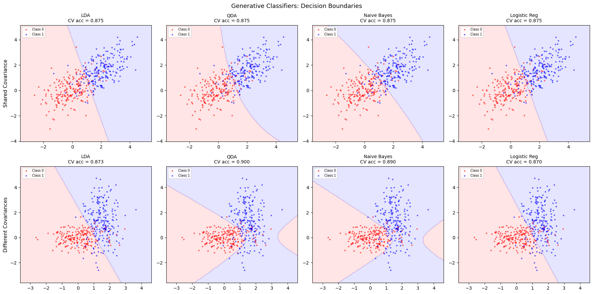

# 선형판별분석과 이차판별분석


## 개요

선형판별분석(LDA)과 이차판별분석(QDA)은 범주별 조건부밀도를 다변량 정규분포로 모형화하고
베이즈 정리로 사후확률을 얻는 **생성 분류기**다. 이 절에서는 LDA, QDA, 가우스 나이브 베이즈,
로지스틱 회귀를 두 가지 시나리오의 2차원 인공자료에서 비교한다. 하나는 공분산이 같은 경우
(LDA에 유리)이고 다른 하나는 공분산이 다른 경우(QDA에 유리)다.

## 생성 분류의 틀

$K$개 범주에 대해 각 생성 분류기는 범주별 조건부밀도
$f_k(\mathbf{x}) = p(\mathbf{x} \mid Y = k)$를 모형화하고 베이즈 정리를 적용한다.

$$
P(Y = k \mid \mathbf{x}) = \frac{\pi_k\,f_k(\mathbf{x})}{\sum_{l=1}^K \pi_l\,f_l(\mathbf{x})}
$$

여기서 $\pi_k = P(Y = k)$는 범주 $k$의 사전확률이다.

## LDA: 공유 공분산

LDA는 각 범주의 조건부밀도가 **공유된** 공분산행렬 $\boldsymbol\Sigma$를 갖는 다변량
정규분포라고 가정한다.

$$
f_k(\mathbf{x}) = \frac{1}{(2\pi)^{p/2}|\boldsymbol\Sigma|^{1/2}}
  \exp\!\Bigl(-\frac{1}{2}(\mathbf{x}-\boldsymbol\mu_k)^T\boldsymbol\Sigma^{-1}(\mathbf{x}-\boldsymbol\mu_k)\Bigr)
$$

$\boldsymbol\Sigma$가 모든 범주에서 같으므로 범주 $k$와 $l$ 사이의 로그사후비가 $\mathbf{x}$에
대해 일차식이 되고, 따라서 결정경계가 **선형**이 된다.

### 판별함수

범주 $k$의 선형판별함수는

$$
\delta_k(\mathbf{x}) = \mathbf{x}^T\boldsymbol\Sigma^{-1}\boldsymbol\mu_k - \frac{1}{2}\boldsymbol\mu_k^T\boldsymbol\Sigma^{-1}\boldsymbol\mu_k + \log\pi_k
$$

이며, 관측치를 $\delta_k(\mathbf{x})$가 가장 큰 범주에 배정한다.

## QDA: 범주별 공분산

QDA는 공분산이 같다는 가정을 푼다. 각 범주가 자신의 $\boldsymbol\Sigma_k$를 갖는다.

$$
f_k(\mathbf{x}) = \frac{1}{(2\pi)^{p/2}|\boldsymbol\Sigma_k|^{1/2}}
  \exp\!\Bigl(-\frac{1}{2}(\mathbf{x}-\boldsymbol\mu_k)^T\boldsymbol\Sigma_k^{-1}(\mathbf{x}-\boldsymbol\mu_k)\Bigr)
$$

이제 로그사후비가 $\mathbf{x}$에 대해 **이차식**이 되어 결정경계가 곡선이 된다.

### 판별함수

$$
\delta_k(\mathbf{x}) = -\frac{1}{2}\log|\boldsymbol\Sigma_k| - \frac{1}{2}(\mathbf{x}-\boldsymbol\mu_k)^T\boldsymbol\Sigma_k^{-1}(\mathbf{x}-\boldsymbol\mu_k) + \log\pi_k
$$

## 가우스 나이브 베이즈

나이브 베이즈는 각 범주 안에서 특성들이 **조건부 독립**이라고 가정하여 $\boldsymbol\Sigma_k$를
대각행렬로 만든다.

$$
f_k(\mathbf{x}) = \prod_{j=1}^p f_{kj}(x_j)
$$

여기서 각 $f_{kj}$는 일변량 정규분포다. 이로써 범주당 모수의 개수가 $O(p^2)$에서 $O(p)$로
크게 줄어든다.

## 자료 생성

두 시나리오가 각 방법이 언제 유리한지 보여준다.

**시나리오 A(공유 공분산):** 두 범주가 $\boldsymbol\Sigma = \begin{pmatrix} 1 & 0.5 \\ 0.5 & 1 \end{pmatrix}$
를 공유하고 평균은 $\boldsymbol\mu_0 = (0,0)^T$, $\boldsymbol\mu_1 = (2, 1.5)^T$다.

**시나리오 B(다른 공분산):** 범주 0은 $\boldsymbol\Sigma_0 = \begin{pmatrix} 1 & 0 \\ 0 & 0.3 \end{pmatrix}$,
범주 1은 $\boldsymbol\Sigma_1 = \begin{pmatrix} 0.3 & 0 \\ 0 & 2 \end{pmatrix}$를 갖는다.

<div class="codebox" markdown>

**예제 1.** 두 가지 자료 만들기

```python
import numpy as np

np.random.seed(42)

def generate_shared_cov(n_per_class=200):
    """공분산이 같은 두 범주.

    LDA 의 가정이 정확히 맞는 상황이다. 이때는 LDA 가 QDA 보다 낫다 —
    추정할 모수가 적어 분산이 작기 때문이다.
    """
    cov = [[1.0, 0.5], [0.5, 1.0]]
    X0 = np.random.multivariate_normal([0, 0], cov, n_per_class)
    X1 = np.random.multivariate_normal([2, 1.5], cov, n_per_class)
    X = np.vstack([X0, X1])
    y = np.array([0] * n_per_class + [1] * n_per_class)
    return X, y

def generate_diff_cov(n_per_class=200):
    """공분산이 다른 두 범주.

    LDA 의 가정이 깨진다. 경계가 직선이어야 할 까닭이 없으므로, 곡선
    경계를 그릴 수 있는 QDA 가 유리해진다.
    """
    cov0 = [[1.0, 0.0], [0.0, 0.3]]
    cov1 = [[0.3, 0.0], [0.0, 2.0]]
    X0 = np.random.multivariate_normal([0, 0], cov0, n_per_class)
    X1 = np.random.multivariate_normal([1.5, 1.5], cov1, n_per_class)
    X = np.vstack([X0, X1])
    y = np.array([0] * n_per_class + [1] * n_per_class)
    return X, y
```

</div>

!!! warning "난수 씨앗이 함수 밖에 있다"
    `np.random.seed(42)`는 모듈 수준에서 한 번만 호출되고 생성 함수 안에는 없다. 따라서 두
    함수를 호출하는 **순서와 횟수**가 생성되는 자료를 바꾼다. 아래 분류기 비교 블록에서
    `generate_shared_cov()` 다음에 `generate_diff_cov()`를 부르면, 시각화 블록에서 다시 부를
    때는 완전히 다른 자료가 나온다. 재현 가능한 결과를 원한다면 각 함수 안에서
    `rng = np.random.default_rng(seed)`를 만들어 쓰라.

## 분류기 적합과 비교

<div class="codebox" markdown>

**예제 2.** 네 분류기의 교차검증 정확도

```python
from sklearn.discriminant_analysis import (
    LinearDiscriminantAnalysis, QuadraticDiscriminantAnalysis,
)
from sklearn.naive_bayes import GaussianNB
from sklearn.linear_model import LogisticRegression
from sklearn.model_selection import cross_val_score

# 네 분류기를 같은 자료에 돌린다. 앞의 셋은 생성모형(각 범주의 분포를
# 모형화한 뒤 베이즈 정리로 뒤집는다)이고, 로지스틱 회귀만 판별모형
# (경계를 바로 추정한다)이다.
classifiers = {
    "LDA": LinearDiscriminantAnalysis(),
    "QDA": QuadraticDiscriminantAnalysis(),
    "Naive Bayes": GaussianNB(),
    "Logistic Reg": LogisticRegression(),
}

for scenario_name, (X, y) in [
    ("Shared Cov", generate_shared_cov()),
    ("Diff Cov", generate_diff_cov()),
]:
    print(f"\n--- {scenario_name} ---")
    for name, clf in classifiers.items():
        clf.fit(X, y)
        cv_acc = cross_val_score(clf, X, y, cv=10,
                                  scoring="accuracy").mean()
        print(f"  {name:15s}: 10-fold CV accuracy = {cv_acc:.4f}")
```

출력:

```
--- Shared Cov ---
  LDA            : 10-fold CV accuracy = 0.8825
  QDA            : 10-fold CV accuracy = 0.8825
  Naive Bayes    : 10-fold CV accuracy = 0.8800
  Logistic Reg   : 10-fold CV accuracy = 0.8850

--- Diff Cov ---
  LDA            : 10-fold CV accuracy = 0.8575
  QDA            : 10-fold CV accuracy = 0.8575
  Naive Bayes    : 10-fold CV accuracy = 0.8475
  Logistic Reg   : 10-fold CV accuracy = 0.8600
```

실행 결과는 다음과 같다.

| 분류기 | 시나리오 A(공유 공분산) | 시나리오 B(다른 공분산) |
|---|---|---|
| LDA | $0.8825$ | $0.8575$ |
| QDA | $0.8825$ | $0.8575$ |
| 나이브 베이즈 | $0.8800$ | $0.8475$ |
| 로지스틱 회귀 | $0.8850$ | $0.8600$ |

</div>

## 결정경계 시각화

<div class="codebox" markdown>

**예제 3.** 결정경계 그리기

```python
import matplotlib.pyplot as plt
from matplotlib.colors import ListedColormap

def plot_decision_boundary(ax, clf, X, y, title):
    """결정경계를 격자로 칠하고 그 위에 자료를 흩뿌린다.

    LDA 는 직선, QDA 는 곡선 경계를 그린다. 나이브 베이즈는 변수 사이의
    상관을 아예 없다고 보므로 축에 나란한 모양이 나온다.
    """
    h = 0.05
    x_min, x_max = X[:, 0].min() - 1, X[:, 0].max() + 1
    y_min, y_max = X[:, 1].min() - 1, X[:, 1].max() + 1
    xx, yy = np.meshgrid(np.arange(x_min, x_max, h),
                          np.arange(y_min, y_max, h))
    Z = clf.predict(np.c_[xx.ravel(), yy.ravel()])
    Z = Z.reshape(xx.shape)
    cmap_light = ListedColormap(["#FFAAAA", "#AAAAFF"])
    ax.contourf(xx, yy, Z, alpha=0.3, cmap=cmap_light)
    ax.scatter(X[y == 0, 0], X[y == 0, 1], c="red", s=10,
               edgecolors="none", alpha=0.6, label="Class 0")
    ax.scatter(X[y == 1, 0], X[y == 1, 1], c="blue", s=10,
               edgecolors="none", alpha=0.6, label="Class 1")
    ax.set_title(title, fontsize=10)
    ax.legend(fontsize=7, loc="upper left")

fig, axes = plt.subplots(2, 4, figsize=(18, 9))
scenarios = {
    "Shared Covariance": generate_shared_cov(),
    "Different Covariances": generate_diff_cov(),
}
for row, (scenario_name, (X, y)) in enumerate(scenarios.items()):
    for col, (name, clf) in enumerate(classifiers.items()):
        clf.fit(X, y)
        cv_acc = cross_val_score(clf, X, y, cv=10,
                                  scoring="accuracy").mean()
        plot_decision_boundary(
            axes[row, col], clf, X, y,
            f"{name}\nCV acc = {cv_acc:.3f}")
        if col == 0:
            axes[row, col].set_ylabel(scenario_name, fontsize=11)

plt.suptitle("Generative Classifiers: Decision Boundaries", fontsize=13)
plt.tight_layout()
plt.show()
```



그림에서 확인할 것은 정확도 숫자가 아니라 **경계의 모양**이다. LDA와 로지스틱 회귀는 직선을,
QDA는 곡선을, 나이브 베이즈는 축에 정렬된 곡선을 그린다.

</div>

## 해석

- **공유 공분산 시나리오:** LDA와 로지스틱 회귀가 비슷한 성능을 낸다. 참 경계가 선형이기
  때문이다. QDA와 나이브 베이즈도 잘 작동하지만 불필요하게 모수를 더 쓴다.
- **다른 공분산 시나리오:** 참 경계가 이차식이므로 원리적으로는 QDA가 유리하다. 다만 아래
  경고에서 보듯 이 자료에서는 그 이점이 드러나지 않는다.
- **나이브 베이즈**는 각 범주 안에서 특성이 대략 독립일 때 잘 작동하지만, 공분산의 비대각
  원소가 크면 성능이 떨어진다. 시나리오 A는 상관이 $0.5$이므로 나이브 베이즈가 두 시나리오
  모두에서 가장 낮은 정확도를 보인다.
- **모수 개수의 절충:** LDA는 $O(p^2)$개(공유 공분산 하나), QDA는 $O(Kp^2)$개(범주당 하나),
  나이브 베이즈는 $O(Kp)$개(대각만)를 추정한다.

!!! warning "이 자료에서는 QDA가 LDA를 이기지 않는다"
    위 표에서 시나리오 B의 LDA와 QDA는 둘 다 $0.8575$로 **같고**, 오히려 로지스틱 회귀가
    $0.8600$으로 가장 높다. 교과서적 기대와 어긋나는 결과다.

    이는 이론이 틀린 것이 아니라 **난수 씨앗 하나의 결과**일 뿐이다. 같은 생성 과정을 서로
    다른 씨앗 30개로 반복하면,

    | | LDA | QDA |
    |---|---|---|
    | 평균 10-겹 CV 정확도 | $0.8788$ | $0.8938$ |
    | 30회 중 QDA가 더 나은 횟수 | | $27$ |

    로 QDA의 이점이 분명히 나타난다. 씨앗 하나의 차이는 CV 정확도의 표집오차(표준오차가
    $0.015$ 수준)에 묻힌다.

    이 시나리오에서 이점이 작은 이유는 평균 $(0,0)$과 $(1.5,1.5)$의 차이가 커서 분류가
    **대부분 선형적으로** 이루어지기 때문이다. 공분산 차이는 경계를 조금 휘게 할 뿐이다.
    두 범주의 평균을 같게 하고 공분산만 다르게 하면($\boldsymbol\Sigma_0 = I$,
    $\boldsymbol\Sigma_1 = 4I$) 차이가 극적으로 벌어진다. LDA는 $0.5088$로 무작위 추측
    수준이지만 QDA는 $0.7331$을 낸다. 선형경계로는 한 범주가 다른 범주를 **감싸는** 구조를
    표현할 방법이 아예 없기 때문이다.

    **교훈:** 단일 자료에서의 CV 정확도 차이로 방법을 비교하지 말라. 반복이 필요하다.

## 연습문제

<div class="drillbox" markdown>

**연습문제 1.** <span class="diff med" title="중간"></span>
사전확률이 같은($\pi_0 = \pi_1 = 0.5$) 두 범주 LDA에서, 결정경계가 두 범주 평균으로부터
(마할라노비스 의미로) 등거리인 점들의 집합임을 보여라.

</div>

??? success "풀이"

    사전확률이 같으면 $\log\pi_k$ 항이 소거된다. 결정경계는
    $\delta_0(\mathbf{x}) = \delta_1(\mathbf{x})$인 곳이다.

    $$
    \mathbf{x}^T\boldsymbol\Sigma^{-1}\boldsymbol\mu_0 - \tfrac{1}{2}\boldsymbol\mu_0^T\boldsymbol\Sigma^{-1}\boldsymbol\mu_0
    = \mathbf{x}^T\boldsymbol\Sigma^{-1}\boldsymbol\mu_1 - \tfrac{1}{2}\boldsymbol\mu_1^T\boldsymbol\Sigma^{-1}\boldsymbol\mu_1
    $$

    정리하면

    $$
    \mathbf{x}^T\boldsymbol\Sigma^{-1}(\boldsymbol\mu_0 - \boldsymbol\mu_1)
    = \tfrac{1}{2}(\boldsymbol\mu_0 + \boldsymbol\mu_1)^T\boldsymbol\Sigma^{-1}(\boldsymbol\mu_0 - \boldsymbol\mu_1)
    $$

    이다. 이는 중점 $\frac{1}{2}(\boldsymbol\mu_0 + \boldsymbol\mu_1)$을 지나고 법선벡터가
    $\boldsymbol\Sigma^{-1}(\boldsymbol\mu_0 - \boldsymbol\mu_1)$인 초평면을 정의한다. 이
    초평면 위의 점들은 두 평균으로부터 마할라노비스 거리가 같다. $\square$

<div class="drillbox" markdown>

**연습문제 2.** <span class="diff med" title="중간"></span>
QDA가 LDA보다 과적합 위험이 큰 이유를 설명하고, QDA가 더 유연함에도 LDA를 선호하게 되는 상황을
서술하라.

</div>

??? success "풀이"

    QDA는 범주마다 별도의 $p \times p$ 공분산행렬을 추정하므로 공분산 구조에만
    $K \cdot p(p+1)/2$개의 모수가 필요하다. LDA는 $p(p+1)/2$개면 된다. 범주당 표본크기가
    $p$에 비해 작으면 QDA의 많은 모수가 큰 분산과 과적합을 낳는다.

    다음과 같을 때 LDA를 선호한다.

    - 훈련표본이 $p^2$에 비해 작을 때.
    - 탐색적 분석에서 범주별 공분산이 비슷해 보일 때.
    - 교차검증에서 QDA가 LDA보다 나아지지 않을 때.

    경험칙으로, 어떤 범주에서든 $n_k / p^2$가 대략 5보다 작으면 QDA의 공분산 추정을 믿기
    어렵다.

    !!! tip "중간 지점도 있다"
        LDA와 QDA 사이를 연속적으로 잇는 **정칙화 판별분석(RDA)**이 있다. 범주별 공분산을
        공유 공분산 쪽으로 축소한다.

        $$
        \hat{\boldsymbol\Sigma}_k(\gamma) = \gamma\,\hat{\boldsymbol\Sigma}_k + (1-\gamma)\,\hat{\boldsymbol\Sigma}_{\text{pooled}}
        $$

        $\gamma$를 교차검증으로 고르면 $\gamma = 1$(QDA)과 $\gamma = 0$(LDA) 사이에서 자료가
        지지하는 만큼의 유연성을 얻는다. scikit-learn에서는
        `LinearDiscriminantAnalysis(solver='lsqr', shrinkage='auto')`가 관련된 축소를
        제공한다. $\square$

<div class="drillbox" markdown>

**연습문제 3.** <span class="diff hard" title="어려움"></span>
다변량 정규밀도와 베이즈 정리에서 출발하여 QDA 판별함수 $\delta_k(\mathbf{x})$를 유도하라.

</div>

??? success "풀이"

    사후확률은

    $$
    P(Y=k \mid \mathbf{x}) \propto \pi_k\,f_k(\mathbf{x})
    $$

    이고 로그를 취하면

    $$
    \log P(Y=k \mid \mathbf{x}) = \log\pi_k + \log f_k(\mathbf{x}) + \text{const}
    $$

    이다. 정규밀도를 대입하면

    $$
    \log f_k(\mathbf{x}) = -\frac{p}{2}\log(2\pi) - \frac{1}{2}\log|\boldsymbol\Sigma_k| - \frac{1}{2}(\mathbf{x}-\boldsymbol\mu_k)^T\boldsymbol\Sigma_k^{-1}(\mathbf{x}-\boldsymbol\mu_k)
    $$

    이고, $k$에 의존하지 않는 항($-\frac{p}{2}\log(2\pi)$와 베이즈 정리의 정규화 상수)을 버리면

    $$
    \delta_k(\mathbf{x}) = -\frac{1}{2}\log|\boldsymbol\Sigma_k| - \frac{1}{2}(\mathbf{x}-\boldsymbol\mu_k)^T\boldsymbol\Sigma_k^{-1}(\mathbf{x}-\boldsymbol\mu_k) + \log\pi_k
    $$

    를 얻는다. 범주별 $\boldsymbol\Sigma_k^{-1}$에서 나오는 $\mathbf{x}$의 이차항이 QDA라는
    이름과 곡선 결정경계의 근원이다. $\square$

<div class="drillbox" markdown>

**연습문제 4.** <span class="diff easy" title="쉬움"></span>
위에서 생성한 공유 공분산 자료에 대해, 합동 공분산행렬·범주 평균·판별함수를 직접 계산하여
LDA를 손으로 적합하라. 예측을 scikit-learn의 `LinearDiscriminantAnalysis`와 비교하라.

</div>

??? success "풀이"

    ```python
    import numpy as np
    from sklearn.discriminant_analysis import LinearDiscriminantAnalysis

    np.random.seed(42)
    cov = [[1.0, 0.5], [0.5, 1.0]]
    X0 = np.random.multivariate_normal([0, 0], cov, 200)
    X1 = np.random.multivariate_normal([2, 1.5], cov, 200)
    X = np.vstack([X0, X1])
    y = np.array([0]*200 + [1]*200)

    mu0, mu1 = X[y == 0].mean(axis=0), X[y == 1].mean(axis=0)
    S0 = np.cov(X[y == 0].T)
    S1 = np.cov(X[y == 1].T)
    S_pooled = 0.5 * (S0 + S1)
    S_inv = np.linalg.inv(S_pooled)

    def predict_lda(x):
        d0 = x @ S_inv @ mu0 - 0.5 * mu0 @ S_inv @ mu0
        d1 = x @ S_inv @ mu1 - 0.5 * mu1 @ S_inv @ mu1
        return (d1 > d0).astype(int)

    y_manual = predict_lda(X)
    lda = LinearDiscriminantAnalysis().fit(X, y)
    y_sklearn = lda.predict(X)
    agreement = np.mean(y_manual == y_sklearn)
    print(f"Agreement with sklearn: {agreement:.4f}")
    ```

    출력:

    ```
    Agreement with sklearn: 1.0000
    ```

    일치도는 $1.0000$, 즉 400개 관측치 전부에서 예측이 같다.

    두 가지가 맞아떨어졌기 때문에 완전히 일치한다.

    1. **합동 공분산.** 일반적으로 합동 추정치는
       $\hat{\boldsymbol\Sigma} = \sum_k (n_k-1)\hat{\boldsymbol\Sigma}_k / (n-K)$이다.
       여기서는 $n_0 = n_1 = 200$이므로 이것이 단순평균 $\frac{1}{2}(S_0 + S_1)$과 같아진다.
       범주 크기가 다르면 두 값이 달라지므로 가중평균을 써야 한다.
    2. **사전확률.** 손으로 만든 판별함수는 $\log\pi_k$ 항을 뺐고, sklearn은 자료에서
       $\hat\pi_0 = \hat\pi_1 = 0.5$를 추정한다. $\log 0.5$가 두 범주에서 같아 소거되므로
       결과가 같다. 범주가 불균형하면 $\log\pi_k$를 반드시 넣어야 한다.

    $\square$

<div class="drillbox" markdown>

**연습문제 5.** <span class="diff med" title="중간"></span>
범주별 공분산이 같으면($\boldsymbol\Sigma_k = \boldsymbol\Sigma$) QDA가 LDA로 환원됨을
증명하라.

</div>

??? success "풀이"

    QDA 판별함수는

    $$
    \delta_k(\mathbf{x}) = -\frac{1}{2}\log|\boldsymbol\Sigma_k| - \frac{1}{2}(\mathbf{x}-\boldsymbol\mu_k)^T\boldsymbol\Sigma_k^{-1}(\mathbf{x}-\boldsymbol\mu_k) + \log\pi_k
    $$

    이다. 모든 $k$에 대해 $\boldsymbol\Sigma_k = \boldsymbol\Sigma$이면
    $-\frac{1}{2}\log|\boldsymbol\Sigma_k|$가 $k$와 무관한 상수가 되어 비교에서 버릴 수 있다.
    이차형식을 전개하면

    $$
    (\mathbf{x}-\boldsymbol\mu_k)^T\boldsymbol\Sigma^{-1}(\mathbf{x}-\boldsymbol\mu_k)
    = \mathbf{x}^T\boldsymbol\Sigma^{-1}\mathbf{x} - 2\mathbf{x}^T\boldsymbol\Sigma^{-1}\boldsymbol\mu_k + \boldsymbol\mu_k^T\boldsymbol\Sigma^{-1}\boldsymbol\mu_k
    $$

    인데, $\mathbf{x}^T\boldsymbol\Sigma^{-1}\mathbf{x}$ 역시 $k$에 의존하지 않으므로 버릴 수
    있다. 남는 것은

    $$
    \delta_k(\mathbf{x}) = \mathbf{x}^T\boldsymbol\Sigma^{-1}\boldsymbol\mu_k - \frac{1}{2}\boldsymbol\mu_k^T\boldsymbol\Sigma^{-1}\boldsymbol\mu_k + \log\pi_k
    $$

    으로 정확히 LDA 판별함수다. 따라서 범주별 공분산이 같으면 QDA는 LDA로 환원된다.

    **모집단 수준과 표본 수준의 구별.** 위 증명은 참 공분산이 같을 때 **모집단 규칙**이
    같아진다는 것이다. 자료에 적합할 때는 QDA가 $\hat{\boldsymbol\Sigma}_0$과
    $\hat{\boldsymbol\Sigma}_1$을 따로 추정하므로, 참 공분산이 같더라도 추정치는 표집오차만큼
    다르다. 그래서 실제 QDA는 LDA와 정확히 같아지지 않으며 분산만 더 크다. 본문 표에서
    시나리오 A의 두 값이 우연히 같게 나온 것이지, 두 방법이 같은 예측을 한 것은 아니다.
    $\square$

---

## 정리하며

LDA·QDA 는 **생성 분류기**다.

- **접근 방향이 반대다.** 로지스틱 회귀는 $P(Y\mid\mathbf x)$ 를 직접 모형화하고(판별적), LDA·QDA 는 $P(\mathbf x\mid Y)$ 를 모형화한 뒤 베이즈 정리로 뒤집는다(생성적).
- **LDA 는 공통 공분산을 가정한다.** 그래서 경계가 **선형**이고, QDA 는 범주별 공분산을 허용해 **이차** 경계를 얻는다.
- **모수 수가 크게 다르다.** QDA 는 범주마다 공분산행렬을 추정하므로 $p$ 가 크면 모수가 폭발한다. **자료가 적으면 LDA 가 낫다.**
- **정규성 가정이 맞으면 로지스틱보다 효율적이다.** 틀리면 반대이며, 로지스틱 회귀가 더 강건하다.
- **나이브 베이즈는 공분산을 대각으로 제약한 극단**이다. 가정이 거칠지만 $p\gg n$ 에서 잘 작동하는 일이 있다.

다음 절부터 **정칙화 로지스틱 회귀**로 넘어간다.
