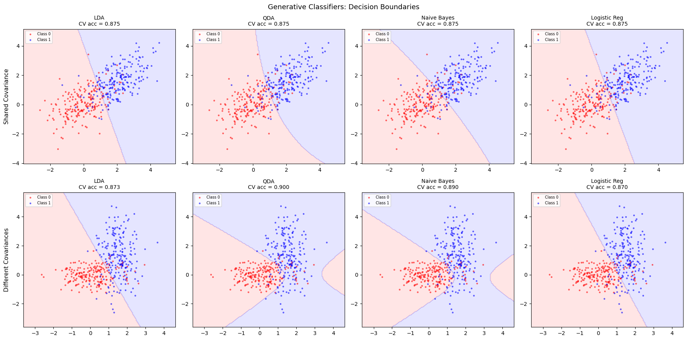

# 선형판별분석과 이차판별분석


## 개요

선형판별분석(LDA)과 이차판별분석(QDA)은 범주별 조건부밀도를 다변량 정규분포로 모형화하고
베이즈 정리로 사후확률을 얻는 **생성 분류기**다. 이 절에서는 LDA, QDA, 가우스 나이브 베이즈,
로지스틱 회귀를 두 가지 시나리오의 2차원 인공자료에서 비교한다. 하나는 공분산이 같은 경우
(LDA에 유리)이고 다른 하나는 공분산이 다른 경우(QDA에 유리)다.

## 생성 분류의 틀

$K$개 범주에 대해 각 생성 분류기는 범주별 조건부밀도
$f_k(\mathbf{x}) = p(\mathbf{x} \mid Y = k)$를 모형화하고 베이즈 정리를 적용한다.

$$
P(Y = k \mid \mathbf{x}) = \frac{\pi_k\,f_k(\mathbf{x})}{\sum_{l=1}^K \pi_l\,f_l(\mathbf{x})}
$$

여기서 $\pi_k = P(Y = k)$는 범주 $k$의 사전확률이다.

## LDA: 공유 공분산

LDA는 각 범주의 조건부밀도가 **공유된** 공분산행렬 $\boldsymbol\Sigma$를 갖는 다변량
정규분포라고 가정한다.

$$
f_k(\mathbf{x}) = \frac{1}{(2\pi)^{p/2}|\boldsymbol\Sigma|^{1/2}}
  \exp\!\Bigl(-\frac{1}{2}(\mathbf{x}-\boldsymbol\mu_k)^T\boldsymbol\Sigma^{-1}(\mathbf{x}-\boldsymbol\mu_k)\Bigr)
$$

$\boldsymbol\Sigma$가 모든 범주에서 같으므로 범주 $k$와 $l$ 사이의 로그사후비가 $\mathbf{x}$에
대해 일차식이 되고, 따라서 결정경계가 **선형**이 된다.

### 판별함수

범주 $k$의 선형판별함수는

$$
\delta_k(\mathbf{x}) = \mathbf{x}^T\boldsymbol\Sigma^{-1}\boldsymbol\mu_k - \frac{1}{2}\boldsymbol\mu_k^T\boldsymbol\Sigma^{-1}\boldsymbol\mu_k + \log\pi_k
$$

이며, 관측치를 $\delta_k(\mathbf{x})$가 가장 큰 범주에 배정한다.

## QDA: 범주별 공분산

QDA는 공분산이 같다는 가정을 푼다. 각 범주가 자신의 $\boldsymbol\Sigma_k$를 갖는다.

$$
f_k(\mathbf{x}) = \frac{1}{(2\pi)^{p/2}|\boldsymbol\Sigma_k|^{1/2}}
  \exp\!\Bigl(-\frac{1}{2}(\mathbf{x}-\boldsymbol\mu_k)^T\boldsymbol\Sigma_k^{-1}(\mathbf{x}-\boldsymbol\mu_k)\Bigr)
$$

이제 로그사후비가 $\mathbf{x}$에 대해 **이차식**이 되어 결정경계가 곡선이 된다.

### 판별함수

$$
\delta_k(\mathbf{x}) = -\frac{1}{2}\log|\boldsymbol\Sigma_k| - \frac{1}{2}(\mathbf{x}-\boldsymbol\mu_k)^T\boldsymbol\Sigma_k^{-1}(\mathbf{x}-\boldsymbol\mu_k) + \log\pi_k
$$

## 가우스 나이브 베이즈

나이브 베이즈는 각 범주 안에서 특성들이 **조건부 독립**이라고 가정하여 $\boldsymbol\Sigma_k$를
대각행렬로 만든다.

$$
f_k(\mathbf{x}) = \prod_{j=1}^p f_{kj}(x_j)
$$

여기서 각 $f_{kj}$는 일변량 정규분포다. 이로써 범주당 모수의 개수가 $O(p^2)$에서 $O(p)$로
크게 줄어든다.

## 자료 생성

두 시나리오가 각 방법이 언제 유리한지 보여준다.

**시나리오 A(공유 공분산):** 두 범주가 $\boldsymbol\Sigma = \begin{pmatrix} 1 & 0.5 \\ 0.5 & 1 \end{pmatrix}$
를 공유하고 평균은 $\boldsymbol\mu_0 = (0,0)^T$, $\boldsymbol\mu_1 = (2, 1.5)^T$다.

**시나리오 B(다른 공분산):** 범주 0은 $\boldsymbol\Sigma_0 = \begin{pmatrix} 1 & 0 \\ 0 & 0.3 \end{pmatrix}$,
범주 1은 $\boldsymbol\Sigma_1 = \begin{pmatrix} 0.3 & 0 \\ 0 & 2 \end{pmatrix}$를 갖는다.

<div class="exbox" markdown>

**보기 1.** <span class="diff easy" title="쉬움"></span> 어느 분류기도 넘을 수 없는 천장. 두 시나리오로 범주당 $200$건씩 생성한다. 사전확률은 $0.5$로 같다.

**(1)** 시나리오 A는 두 범주가 공분산을 공유하므로 베이즈 오류율이 **닫힌 꼴**로 나온다. 마할라노비스 거리를 써서 유도하고 값을 구하시오.

**(2)** 시나리오 B는 닫힌 꼴이 없다. 어떻게 구할 것인지 적고 값을 구하시오. 두 천장을 비교하시오.

</div>

??? success "풀이"

    **(1) 해석적으로.** 사전확률이 같고 $\boldsymbol\Sigma_0 = \boldsymbol\Sigma_1 = \boldsymbol\Sigma$이면 로그 가능도비가

    $$
    \log\frac{f_1(\mathbf x)}{f_0(\mathbf x)}
    = \left(\mathbf x - \frac{\boldsymbol\mu_0+\boldsymbol\mu_1}{2}\right)^{\!\top}
      \boldsymbol\Sigma^{-1}(\boldsymbol\mu_1 - \boldsymbol\mu_0)
    $$

    로 $\mathbf x$의 **일차함수**가 된다(이차항이 서로 소거된다). 베이즈 규칙은 이 값이 양수면 범주 $1$이다.

    이제 $Y = 0$일 때 $\mathbf x \sim N(\boldsymbol\mu_0, \boldsymbol\Sigma)$이므로 위 일차통계량 $T$는 정규분포를 따르고

    $$
    E[T \mid Y=0] = -\tfrac12\Delta^2,
    \qquad
    \operatorname{Var}(T) = \Delta^2,
    \qquad
    \Delta^2 := (\boldsymbol\mu_1-\boldsymbol\mu_0)^\top\boldsymbol\Sigma^{-1}(\boldsymbol\mu_1-\boldsymbol\mu_0)
    $$

    이다. 따라서 오분류 확률은

    $$
    P(T > 0 \mid Y = 0)
    = P\!\left(Z > \frac{\Delta^2/2}{\Delta}\right)
    = \Phi\!\left(-\frac{\Delta}{2}\right)
    $$

    이고 대칭이라 $Y = 1$ 쪽도 같으므로 **베이즈 오류율이 $\Phi(-\Delta/2)$**다.

    값을 넣는다. $\boldsymbol\Sigma^{-1} = \frac{1}{0.75}\begin{pmatrix}1 & -0.5\\ -0.5 & 1\end{pmatrix}$이고 $\boldsymbol\mu_1 - \boldsymbol\mu_0 = (2,\ 1.5)^\top$이므로

    $$
    \Delta^2 = \frac{1}{0.75}\bigl[2^2 - 2(0.5)(2)(1.5) + 1.5^2\bigr]
    = \frac{4 - 3 + 2.25}{0.75} = \frac{3.25}{0.75} = 4.33333
    $$

    $$
    \Delta = 2.081666,
    \qquad
    \Phi(-1.040833) = 0.148977
    $$

    **시나리오 A의 베이즈 정확도는 $0.851023$이다.**

    **(2) 해석적으로.** 공분산이 다르면 로그 가능도비에 이차항이 남아 $T$가 정규분포를 따르지 않는다(이차형식이라 $\chi^2$들의 일차결합이다). 닫힌 꼴 대신 **$\min$의 적분**을 쓴다. 사전확률이 같을 때 베이즈 오류율은

    $$
    \text{err} = \tfrac12\int_{\mathbb R^2} \min\bigl(f_0(\mathbf x),\, f_1(\mathbf x)\bigr)\,d\mathbf x
    $$

    이다(각 점에서 더 작은 밀도 쪽이 곧 틀리는 몫이다). 이차원이므로 격자 수치적분으로 충분히 정확하게 구할 수 있다.

    **(2) 수치적으로.**

    ```python
    import numpy as np

    np.random.seed(42)

    def generate_shared_cov(n_per_class=200):
        """공분산이 같은 두 범주.

        LDA 의 가정이 정확히 맞는 상황이다. 이때는 LDA 가 QDA 보다 낫다 —
        추정할 모수가 적어 분산이 작기 때문이다.
        """
        cov = [[1.0, 0.5], [0.5, 1.0]]
        X0 = np.random.multivariate_normal([0, 0], cov, n_per_class)
        X1 = np.random.multivariate_normal([2, 1.5], cov, n_per_class)
        X = np.vstack([X0, X1])
        y = np.array([0] * n_per_class + [1] * n_per_class)
        return X, y

    def generate_diff_cov(n_per_class=200):
        """공분산이 다른 두 범주.

        LDA 의 가정이 깨진다. 경계가 직선이어야 할 까닭이 없으므로, 곡선
        경계를 그릴 수 있는 QDA 가 유리해진다.
        """
        cov0 = [[1.0, 0.0], [0.0, 0.3]]
        cov1 = [[0.3, 0.0], [0.0, 2.0]]
        X0 = np.random.multivariate_normal([0, 0], cov0, n_per_class)
        X1 = np.random.multivariate_normal([1.5, 1.5], cov1, n_per_class)
        X = np.vstack([X0, X1])
        y = np.array([0] * n_per_class + [1] * n_per_class)
        return X, y


    from scipy import stats

    # 시나리오 A: 닫힌 꼴.
    S = np.array([[1.0, 0.5], [0.5, 1.0]])
    d = np.array([2.0, 1.5])
    delta2 = d @ np.linalg.inv(S) @ d
    errA = stats.norm.cdf(-np.sqrt(delta2) / 2)
    print(f"A: Delta^2 = {delta2:.5f}, Delta = {np.sqrt(delta2):.6f}")
    print(f"A: 베이즈 오류율 = Phi(-{np.sqrt(delta2) / 2:.6f}) = {errA:.6f}"
          f"   정확도 = {1 - errA:.6f}")

    # 시나리오 B: 격자 수치적분.  err = 0.5 * ∫ min(f0, f1)
    g = np.linspace(-8, 10, 801)
    XX, YY = np.meshgrid(g, g)
    P = np.dstack([XX, YY])
    h = g[1] - g[0]
    f0 = stats.multivariate_normal([0, 0], [[1, 0], [0, 0.3]]).pdf(P)
    f1 = stats.multivariate_normal([1.5, 1.5], [[0.3, 0], [0, 2.0]]).pdf(P)
    errB = 0.5 * np.sum(np.minimum(f0, f1)) * h * h
    print(f"B: 격자의 질량 합 = {0.5 * np.sum(f0 + f1) * h * h:.6f}  (1 이어야 한다)")
    print(f"B: 베이즈 오류율 = {errB:.6f}   정확도 = {1 - errB:.6f}")
    ```

    출력:

    ```
    A: Delta^2 = 4.33333, Delta = 2.081666
    A: 베이즈 오류율 = Phi(-1.040833) = 0.148977   정확도 = 0.851023
    B: 격자의 질량 합 = 1.000000  (1 이어야 한다)
    B: 베이즈 오류율 = 0.106328   정확도 = 0.893672
    ```

    유도한 $\Delta^2 = 4.33333$과 $\Phi(-1.040833) = 0.148977$이 맞고, 격자가 밀도의 질량을 $1.000000$으로 담아내므로 수치적분도 믿을 만하다. 격자를 $401$점에서 $2001$점까지 바꿔 보아도 $0.106323$에서 $0.106328$ 사이로만 움직인다.

    **두 천장이 뜻밖에도 B 쪽이 더 높다.** 시나리오 B의 베이즈 정확도 $0.8937$이 A의 $0.8510$보다 $0.043$ 크다. 평균 사이의 거리는 B가 $\lVert(1.5,1.5)\rVert = 2.12$로 A의 $\lVert(2,1.5)\rVert = 2.5$보다 **가까운데도** 그렇다. 까닭은 B에서 범주 $0$이 가로로 납작하고($\sigma_2^2 = 0.3$) 범주 $1$이 세로로 길쭉해($\sigma_1^2 = 0.3$) 두 구름이 서로 다른 방향으로 퍼지므로, **곡선 경계로 가르면 겹치는 부분이 오히려 적기 때문**이다.

    그러므로 뒤의 보기 2에서 분류기들의 성적을 읽을 때 **시나리오 B의 수가 더 작으면 그것은 문제가 더 어려워서가 아니다.** 천장은 B가 더 높은데 실제 성적이 더 낮다면, 그 차이는 분류기가 천장에 닿지 못한 몫이다.

!!! warning "난수 씨앗이 함수 밖에 있다"
    `np.random.seed(42)`는 모듈 수준에서 한 번만 호출되고 생성 함수 안에는 없다. 따라서 두
    함수를 호출하는 **순서와 횟수**가 생성되는 자료를 바꾼다. 아래 분류기 비교 블록에서
    `generate_shared_cov()` 다음에 `generate_diff_cov()`를 부르면, 시각화 블록에서 다시 부를
    때는 완전히 다른 자료가 나온다. 재현 가능한 결과를 원한다면 각 함수 안에서
    `rng = np.random.default_rng(seed)`를 만들어 쓰라.

## 분류기 적합과 비교

<div class="exbox" markdown>

**보기 2.** <span class="diff easy" title="쉬움"></span> LDA와 QDA가 같은 점수를 받았다. 네 분류기를 두 시나리오에서 $10$겹 교차검증으로 견준다.

**(1)** $p = 2$, $K = 2$에서 LDA와 QDA가 추정하는 **모수의 개수**를 각각 세고, 일반적인 $p$에서 공분산 모수가 몇 배 차이 나는지 적으시오.

**(2)** 출력에서 LDA와 QDA가 두 시나리오 모두 소수 넷째 자리까지 **같은 정확도**를 받았다. 이것이 **같은 예측을 해서**인가, 아니면 우연인가? 확인하고, 보기 1의 천장과도 견주시오.

</div>

??? success "풀이"

    **(1) 해석적으로.** 세어 보면 이렇다. 사전확률은 $\pi_0 + \pi_1 = 1$이라 자유모수가 $K - 1 = 1$개다.

    | | 평균 | 공분산 | 사전확률 | 합 |
    |---|---|---|---|---|
    | LDA | $Kp = 4$ | $\dfrac{p(p+1)}{2} = 3$ | $1$ | $\mathbf{8}$ |
    | QDA | $Kp = 4$ | $K\dfrac{p(p+1)}{2} = 6$ | $1$ | $\mathbf{11}$ |

    **공분산 쪽만 $K = 2$배 차이 난다.** 일반적으로 LDA는 $p(p+1)/2$개, QDA는 $K\,p(p+1)/2$개이므로 $p$가 커지면 격차가 빠르게 벌어진다. $p = 50$, $K = 2$라면 $1275$개 대 $2550$개다.

    **여기서 두 방법의 맞바꿈이 나온다.** 공분산이 실제로 같으면 LDA는 **편향 없이** 모수를 적게 쓰므로 분산이 작아 이긴다. 공분산이 다르면 LDA는 **구조적으로 틀린** 선형경계만 그릴 수 있어 편향이 생기고, QDA가 모수를 더 쓰는 대가로 그 편향을 없앤다. 그러므로 시나리오 A에서는 LDA가, B에서는 QDA가 유리해야 한다.

    **(2) 수치적으로.**

    ```python
    from sklearn.discriminant_analysis import (
        LinearDiscriminantAnalysis, QuadraticDiscriminantAnalysis,
    )
    from sklearn.naive_bayes import GaussianNB
    from sklearn.linear_model import LogisticRegression
    from sklearn.model_selection import cross_val_score

    # 네 분류기를 같은 자료에 돌린다. 앞의 셋은 생성모형(각 범주의 분포를
    # 모형화한 뒤 베이즈 정리로 뒤집는다)이고, 로지스틱 회귀만 판별모형
    # (경계를 바로 추정한다)이다.
    classifiers = {
        "LDA": LinearDiscriminantAnalysis(),
        "QDA": QuadraticDiscriminantAnalysis(),
        "Naive Bayes": GaussianNB(),
        "Logistic Reg": LogisticRegression(),
    }

    for scenario_name, (X, y) in [
        ("Shared Cov", generate_shared_cov()),
        ("Diff Cov", generate_diff_cov()),
    ]:
        print(f"\n--- {scenario_name} ---")
        for name, clf in classifiers.items():
            clf.fit(X, y)
            cv_acc = cross_val_score(clf, X, y, cv=10,
                                      scoring="accuracy").mean()
            print(f"  {name:15s}: 10-fold CV accuracy = {cv_acc:.4f}")

    # LDA 와 QDA 가 정말 같은 예측을 하는가?
    from sklearn.model_selection import cross_val_predict

    np.random.seed(42)
    for scenario_name, (X, y) in [
        ("Shared Cov", generate_shared_cov()),
        ("Diff Cov", generate_diff_cov()),
    ]:
        pl = cross_val_predict(LinearDiscriminantAnalysis(), X, y, cv=10)
        pq = cross_val_predict(QuadraticDiscriminantAnalysis(), X, y, cv=10)
        print(f"\n{scenario_name}: LDA 와 QDA 의 CV 예측이 엇갈린 관측 = "
              f"{int((pl != pq).sum())} / {len(y)}")
        print(f"  LDA 오류 {int((pl != y).sum())}건, "
              f"QDA 오류 {int((pq != y).sum())}건")
    ```

    출력:

    ```
    --- Shared Cov ---
      LDA            : 10-fold CV accuracy = 0.8825
      QDA            : 10-fold CV accuracy = 0.8825
      Naive Bayes    : 10-fold CV accuracy = 0.8800
      Logistic Reg   : 10-fold CV accuracy = 0.8850

    --- Diff Cov ---
      LDA            : 10-fold CV accuracy = 0.8575
      QDA            : 10-fold CV accuracy = 0.8575
      Naive Bayes    : 10-fold CV accuracy = 0.8475
      Logistic Reg   : 10-fold CV accuracy = 0.8600

    Shared Cov: LDA 와 QDA 의 CV 예측이 엇갈린 관측 = 0 / 400
      LDA 오류 47건, QDA 오류 47건

    Diff Cov: LDA 와 QDA 의 CV 예측이 엇갈린 관측 = 18 / 400
      LDA 오류 57건, QDA 오류 57건
    ```

    | 분류기 | 시나리오 A(공유 공분산) | 시나리오 B(다른 공분산) |
    |---|---|---|
    | LDA | $0.8825$ | $0.8575$ |
    | QDA | $0.8825$ | $0.8575$ |
    | 나이브 베이즈 | $0.8800$ | $0.8475$ |
    | 로지스틱 회귀 | $0.8850$ | $0.8600$ |
    | **베이즈 한계 (보기 1)** | $0.8510$ | $0.8937$ |

    **두 동점의 성격이 완전히 다르다.**

    시나리오 A에서는 **같은 예측을 해서** 같은 점수가 나왔다. $400$건 전부에서 LDA와 QDA의 교차검증 예측이 일치한다. 공분산이 실제로 같으므로 QDA가 추정한 두 공분산행렬이 서로 비슷해지고, 이차항이 자료가 놓인 구간에서는 거의 사라져 경계가 사실상 직선이 되기 때문이다. **QDA가 모수 세 개를 더 썼는데 아무 데도 쓰지 않은 셈이다.**

    시나리오 B에서는 **우연이다.** 두 분류기의 예측이 $400$건 가운데 $18$건에서 엇갈리는데, 그 $18$건 중 아홉 건씩 각자 맞고 틀려 오류 수가 $57$로 똑같아졌다. **같은 점수를 받았다고 같은 분류기인 것이 아니다.** 소수 넷째 자리까지 같은 수를 보고 "둘이 똑같다"고 읽으면 안 되며, 예측을 직접 맞춰 봐야 알 수 있다.

    **(1)에서 예상한 "B에서는 QDA가 이긴다"는 이 자료에서 나타나지 않았다.** $18$건의 엇갈림이 정확히 반씩 갈린 것은 운이지만, QDA가 뚜렷이 앞서지 못한 것 자체는 설명할 수 있다. 범주당 $200$건으로 $2\times2$ 공분산 두 개를 따로 추정하면 분산이 커져, 편향을 없앤 이득을 상당 부분 까먹는다. 보기 3의 그림은 **다른 난수로 생성된 자료**를 쓰는데, 거기서는 QDA $0.900$ 대 LDA $0.873$으로 예상대로 갈린다. **표본 하나로 두 방법의 우열을 가리기에는 $400$건이 모자라다.**

    마지막으로 **베이즈 한계와 견주면 두 시나리오의 평가가 뒤집힌다.** 시나리오 A의 $0.8825$는 천장 $0.8510$을 **넘어선다.** 분류기가 신통해서가 아니라 이 표본 하나가 운이 좋았기 때문이다($\sqrt{0.851\times0.149/400} = 0.0178$이므로 $1.8$ 표준오차다). 반대로 시나리오 B의 $0.8575$는 천장 $0.8937$에 $0.036$, 곧 $2.3$ 표준오차만큼 못 미친다. **날값만 보면 A가 더 잘한 것 같지만, 천장까지의 거리로 보면 B 쪽이 훨씬 아쉽다.**

## 결정경계 시각화

<div class="exbox" markdown>

**보기 3.** <span class="diff easy" title="쉬움"></span> 경계를 보아야 알 수 있는 것. 네 분류기의 결정경계를 두 시나리오에 대해 $2 \times 4$로 그린다.

**(1)** 아래 그림의 교차검증 정확도가 보기 2의 표와 **다르다.** 왜 그런가? 그리고 그림의 수로는 QDA와 LDA의 우열이 어떻게 갈리는가?

**(2)** 아랫줄 QDA 칸의 **오른쪽 끝에 떨어져 있는 붉은 영역**은 무엇인가. 그림으로만 알 수 있는 이 결함을 수로 확인하시오.

</div>

??? success "풀이"

    유도할 답이 있는 문제가 아니다. **그림이 보여 주는 것과 숫자 표가 놓치는 것**이 이 보기의 전부다.

    ```python
    import matplotlib.pyplot as plt
    from matplotlib.colors import ListedColormap

    def plot_decision_boundary(ax, clf, X, y, title):
        """결정경계를 격자로 칠하고 그 위에 자료를 흩뿌린다.

        LDA 는 직선, QDA 는 곡선 경계를 그린다. 나이브 베이즈는 변수 사이의
        상관을 아예 없다고 보므로 축에 나란한 모양이 나온다.
        """
        h = 0.05
        x_min, x_max = X[:, 0].min() - 1, X[:, 0].max() + 1
        y_min, y_max = X[:, 1].min() - 1, X[:, 1].max() + 1
        xx, yy = np.meshgrid(np.arange(x_min, x_max, h),
                              np.arange(y_min, y_max, h))
        Z = clf.predict(np.c_[xx.ravel(), yy.ravel()])
        Z = Z.reshape(xx.shape)
        cmap_light = ListedColormap(["#FFAAAA", "#AAAAFF"])
        ax.contourf(xx, yy, Z, alpha=0.3, cmap=cmap_light)
        ax.scatter(X[y == 0, 0], X[y == 0, 1], c="red", s=10,
                   edgecolors="none", alpha=0.6, label="Class 0")
        ax.scatter(X[y == 1, 0], X[y == 1, 1], c="blue", s=10,
                   edgecolors="none", alpha=0.6, label="Class 1")
        ax.set_title(title, fontsize=10)
        ax.legend(fontsize=7, loc="upper left")

    fig, axes = plt.subplots(2, 4, figsize=(18, 9))
    scenarios = {
        "Shared Covariance": generate_shared_cov(),
        "Different Covariances": generate_diff_cov(),
    }
    for row, (scenario_name, (X, y)) in enumerate(scenarios.items()):
        for col, (name, clf) in enumerate(classifiers.items()):
            clf.fit(X, y)
            cv_acc = cross_val_score(clf, X, y, cv=10,
                                      scoring="accuracy").mean()
            plot_decision_boundary(
                axes[row, col], clf, X, y,
                f"{name}\nCV acc = {cv_acc:.3f}")
            if col == 0:
                axes[row, col].set_ylabel(scenario_name, fontsize=11)

    plt.suptitle("Generative Classifiers: Decision Boundaries", fontsize=13)
    plt.tight_layout()
    plt.show()

    # 아랫줄 QDA 의 오른쪽 붉은 섬을 수로 확인한다.
    X, y = scenarios["Different Covariances"]
    qda = QuadraticDiscriminantAnalysis().fit(X, y)
    lda = LinearDiscriminantAnalysis().fit(X, y)
    xs = np.linspace(1, 6, 2001)
    line = np.c_[xs, np.zeros_like(xs)]
    for nm, clf in [("LDA", lda), ("QDA", qda)]:
        pr = clf.predict(line)
        flips = np.where(np.diff(pr) != 0)[0]
        print(f"{nm}: y = 0 선을 따라가며 예측이 바뀌는 x = "
              f"{np.round(xs[flips], 3)}")
    print(f"자료 중 x1 > 3 인 점 = {int((X[:, 0] > 3).sum())}개,  "
          f"x1 > 2.5 인 점 = {int((X[:, 0] > 2.5).sum())}개")
    ```

    출력:

    ```
    LDA: y = 0 선을 따라가며 예측이 바뀌는 x = [1.088]
    QDA: y = 0 선을 따라가며 예측이 바뀌는 x = [1.358 3.38 ]
    자료 중 x1 > 3 인 점 = 1개,  x1 > 2.5 인 점 = 9개
    ```

    

    **(1) 그림의 자료가 보기 2의 자료와 다르기 때문이다.** 바로 위 경고 상자가 말하듯 `np.random.seed(42)`가 모듈 수준에 한 번만 있고 생성 함수 안에는 없다. 보기 2가 `generate_shared_cov()`와 `generate_diff_cov()`를 한 번씩 부르며 난수를 소비했으므로, 이 블록에서 다시 부르면 **두 번째 뽑기**가 나온다. 같은 코드인데 다른 자료다.

    그 자료에서 윗줄은 네 분류기가 모두 $0.875$로 같고, 아랫줄은

    $$
    \text{QDA } 0.900 \;>\; \text{나이브 베이즈 } 0.890 \;>\; \text{LDA } 0.873 \;>\; \text{로지스틱 } 0.870
    $$

    으로 **교과서가 말하는 순서 그대로 갈린다.** 공분산이 다를 때 곡선 경계를 그릴 수 있는 쪽이 이기고, 직선밖에 못 그리는 LDA와 로지스틱 회귀가 뒤로 밀린다. 보기 2의 자료에서 QDA가 이기지 못한 것은 이론이 틀려서가 아니라 **표본 하나가 그렇게 나왔을 뿐**임을 이 그림이 보여 준다. 숫자 표 하나에 기대지 말아야 하는 이유다.

    **(2) 그 붉은 섬은 QDA의 이차경계가 자료 밖에서 되돌아온 자국이다.** 로그 가능도비가 $\mathbf x$의 이차식이므로 결정경계는 원뿔곡선이고, 여기서는 쌍곡선처럼 두 조각으로 갈라져 **오른쪽 멀리에서 다시 범주 $0$ 쪽으로 넘어간다.** 출력이 그것을 정확히 집어낸다. 가로선 $x_2 = 0$을 따라가면 LDA는 $x_1 = 1.088$ 한 곳에서만 예측이 바뀌는데, QDA는 $x_1 = 1.358$에서 범주 $1$로 넘어갔다가 $x_1 = 3.380$에서 **다시 범주 $0$으로 돌아온다.**

    까닭은 분산의 비다. 범주 $0$은 $x_1$ 방향 분산이 $1.0$, 범주 $1$은 $0.3$이라, $x_1$이 아주 커지면 "퍼진 쪽"인 범주 $0$의 밀도가 "좁은 쪽"인 범주 $1$의 밀도보다 커진다. 가우스 밀도의 꼬리는 $\exp(-x^2/2\sigma^2)$이므로 **$\sigma$가 큰 쪽이 언제나 멀리서 이긴다.** QDA는 그 사실을 성실히 반영한 것이고, 모형 안에서는 옳다.

    **문제는 그 영역에 자료가 없다는 것이다.** $x_1 > 3$인 관측이 통틀어 $1$개, $x_1 > 2.5$라 해도 $9$개뿐이다. 곧 **그 섬은 자료가 말해 준 것이 아니라 정규분포 가정을 외삽한 결과**다. 비슷한 모양이 나이브 베이즈 칸에도 나타난다(그쪽도 범주별 분산을 따로 추정하므로 경계가 이차다).

    이것이 표로는 결코 알 수 없고 그림으로만 보이는 것이다. 교차검증 정확도는 자료가 있는 곳에서만 재므로 이 섬에 아무런 벌점도 주지 않는다. **배치한 뒤 $x_1 = 4$인 관측이 들어오면 모형이 조용히 범주 $0$이라고 답한다.** 생성 분류기를 쓸 때 결정경계를 반드시 그려 보아야 하는 이유이며, 경계가 자료 범위를 벗어난 곳에서 무엇을 하는지는 눈으로 보기 전에는 알 수 없다.

    덧붙여 모양 자체도 읽어 둘 만하다. **LDA와 로지스틱 회귀는 직선, QDA는 자유로운 곡선, 나이브 베이즈는 축에 정렬된 곡선**을 그린다. 윗줄 나이브 베이즈 칸의 경계가 QDA 칸과 미묘하게 다른 것은 상관계수 $0.5$를 $0$으로 보도록 강제했기 때문이다.

## 해석

- **공유 공분산 시나리오:** LDA와 로지스틱 회귀가 비슷한 성능을 낸다. 참 경계가 선형이기
  때문이다. QDA와 나이브 베이즈도 잘 작동하지만 불필요하게 모수를 더 쓴다.
- **다른 공분산 시나리오:** 참 경계가 이차식이므로 원리적으로는 QDA가 유리하다. 다만 아래
  경고에서 보듯 이 자료에서는 그 이점이 드러나지 않는다.
- **나이브 베이즈**는 각 범주 안에서 특성이 대략 독립일 때 잘 작동하지만, 공분산의 비대각
  원소가 크면 성능이 떨어진다. 시나리오 A는 상관이 $0.5$이므로 나이브 베이즈가 두 시나리오
  모두에서 가장 낮은 정확도를 보인다.
- **모수 개수의 절충:** LDA는 $O(p^2)$개(공유 공분산 하나), QDA는 $O(Kp^2)$개(범주당 하나),
  나이브 베이즈는 $O(Kp)$개(대각만)를 추정한다.

!!! warning "이 자료에서는 QDA가 LDA를 이기지 않는다"
    위 표에서 시나리오 B의 LDA와 QDA는 둘 다 $0.8575$로 **같고**, 오히려 로지스틱 회귀가
    $0.8600$으로 가장 높다. 교과서적 기대와 어긋나는 결과다.

    이는 이론이 틀린 것이 아니라 **난수 씨앗 하나의 결과**일 뿐이다. 같은 생성 과정을 서로
    다른 씨앗 30개로 반복하면,

    | | LDA | QDA |
    |---|---|---|
    | 평균 10-겹 CV 정확도 | $0.8788$ | $0.8938$ |
    | 30회 중 QDA가 더 나은 횟수 | | $27$ |

    로 QDA의 이점이 분명히 나타난다. 씨앗 하나의 차이는 CV 정확도의 표집오차(표준오차가
    $0.015$ 수준)에 묻힌다.

    이 시나리오에서 이점이 작은 이유는 평균 $(0,0)$과 $(1.5,1.5)$의 차이가 커서 분류가
    **대부분 선형적으로** 이루어지기 때문이다. 공분산 차이는 경계를 조금 휘게 할 뿐이다.
    두 범주의 평균을 같게 하고 공분산만 다르게 하면($\boldsymbol\Sigma_0 = I$,
    $\boldsymbol\Sigma_1 = 4I$) 차이가 극적으로 벌어진다. LDA는 $0.5088$로 무작위 추측
    수준이지만 QDA는 $0.7331$을 낸다. 선형경계로는 한 범주가 다른 범주를 **감싸는** 구조를
    표현할 방법이 아예 없기 때문이다.

    **교훈:** 단일 자료에서의 CV 정확도 차이로 방법을 비교하지 말라. 반복이 필요하다.

## 연습문제

<div class="drillbox" markdown>

**연습문제 1.** <span class="diff med" title="중간"></span>
사전확률이 같은($\pi_0 = \pi_1 = 0.5$) 두 범주 LDA에서, 결정경계가 두 범주 평균으로부터
(마할라노비스 의미로) 등거리인 점들의 집합임을 보여라.

</div>

??? success "풀이"

    사전확률이 같으면 $\log\pi_k$ 항이 소거된다. 결정경계는
    $\delta_0(\mathbf{x}) = \delta_1(\mathbf{x})$인 곳이다.

    $$
    \mathbf{x}^T\boldsymbol\Sigma^{-1}\boldsymbol\mu_0 - \tfrac{1}{2}\boldsymbol\mu_0^T\boldsymbol\Sigma^{-1}\boldsymbol\mu_0
    = \mathbf{x}^T\boldsymbol\Sigma^{-1}\boldsymbol\mu_1 - \tfrac{1}{2}\boldsymbol\mu_1^T\boldsymbol\Sigma^{-1}\boldsymbol\mu_1
    $$

    정리하면

    $$
    \mathbf{x}^T\boldsymbol\Sigma^{-1}(\boldsymbol\mu_0 - \boldsymbol\mu_1)
    = \tfrac{1}{2}(\boldsymbol\mu_0 + \boldsymbol\mu_1)^T\boldsymbol\Sigma^{-1}(\boldsymbol\mu_0 - \boldsymbol\mu_1)
    $$

    이다. 이는 중점 $\frac{1}{2}(\boldsymbol\mu_0 + \boldsymbol\mu_1)$을 지나고 법선벡터가
    $\boldsymbol\Sigma^{-1}(\boldsymbol\mu_0 - \boldsymbol\mu_1)$인 초평면을 정의한다. 이
    초평면 위의 점들은 두 평균으로부터 마할라노비스 거리가 같다. $\square$

<div class="drillbox" markdown>

**연습문제 2.** <span class="diff med" title="중간"></span>
QDA가 LDA보다 과적합 위험이 큰 이유를 설명하고, QDA가 더 유연함에도 LDA를 선호하게 되는 상황을
서술하라.

</div>

??? success "풀이"

    QDA는 범주마다 별도의 $p \times p$ 공분산행렬을 추정하므로 공분산 구조에만
    $K \cdot p(p+1)/2$개의 모수가 필요하다. LDA는 $p(p+1)/2$개면 된다. 범주당 표본크기가
    $p$에 비해 작으면 QDA의 많은 모수가 큰 분산과 과적합을 낳는다.

    다음과 같을 때 LDA를 선호한다.

    - 훈련표본이 $p^2$에 비해 작을 때.
    - 탐색적 분석에서 범주별 공분산이 비슷해 보일 때.
    - 교차검증에서 QDA가 LDA보다 나아지지 않을 때.

    경험칙으로, 어떤 범주에서든 $n_k / p^2$가 대략 5보다 작으면 QDA의 공분산 추정을 믿기
    어렵다.

    !!! tip "중간 지점도 있다"
        LDA와 QDA 사이를 연속적으로 잇는 **정칙화 판별분석(RDA)**이 있다. 범주별 공분산을
        공유 공분산 쪽으로 축소한다.

        $$
        \hat{\boldsymbol\Sigma}_k(\gamma) = \gamma\,\hat{\boldsymbol\Sigma}_k + (1-\gamma)\,\hat{\boldsymbol\Sigma}_{\text{pooled}}
        $$

        $\gamma$를 교차검증으로 고르면 $\gamma = 1$(QDA)과 $\gamma = 0$(LDA) 사이에서 자료가
        지지하는 만큼의 유연성을 얻는다. scikit-learn에서는
        `LinearDiscriminantAnalysis(solver='lsqr', shrinkage='auto')`가 관련된 축소를
        제공한다. $\square$

<div class="drillbox" markdown>

**연습문제 3.** <span class="diff hard" title="어려움"></span>
다변량 정규밀도와 베이즈 정리에서 출발하여 QDA 판별함수 $\delta_k(\mathbf{x})$를 유도하라.

</div>

??? success "풀이"

    사후확률은

    $$
    P(Y=k \mid \mathbf{x}) \propto \pi_k\,f_k(\mathbf{x})
    $$

    이고 로그를 취하면

    $$
    \log P(Y=k \mid \mathbf{x}) = \log\pi_k + \log f_k(\mathbf{x}) + \text{const}
    $$

    이다. 정규밀도를 대입하면

    $$
    \log f_k(\mathbf{x}) = -\frac{p}{2}\log(2\pi) - \frac{1}{2}\log|\boldsymbol\Sigma_k| - \frac{1}{2}(\mathbf{x}-\boldsymbol\mu_k)^T\boldsymbol\Sigma_k^{-1}(\mathbf{x}-\boldsymbol\mu_k)
    $$

    이고, $k$에 의존하지 않는 항($-\frac{p}{2}\log(2\pi)$와 베이즈 정리의 정규화 상수)을 버리면

    $$
    \delta_k(\mathbf{x}) = -\frac{1}{2}\log|\boldsymbol\Sigma_k| - \frac{1}{2}(\mathbf{x}-\boldsymbol\mu_k)^T\boldsymbol\Sigma_k^{-1}(\mathbf{x}-\boldsymbol\mu_k) + \log\pi_k
    $$

    를 얻는다. 범주별 $\boldsymbol\Sigma_k^{-1}$에서 나오는 $\mathbf{x}$의 이차항이 QDA라는
    이름과 곡선 결정경계의 근원이다. $\square$

<div class="drillbox" markdown>

**연습문제 4.** <span class="diff easy" title="쉬움"></span>
위에서 생성한 공유 공분산 자료에 대해, 합동 공분산행렬·범주 평균·판별함수를 직접 계산하여
LDA를 손으로 적합하라. 예측을 scikit-learn의 `LinearDiscriminantAnalysis`와 비교하라.

</div>

??? success "풀이"

    ```python
    import numpy as np
    from sklearn.discriminant_analysis import LinearDiscriminantAnalysis

    np.random.seed(42)
    cov = [[1.0, 0.5], [0.5, 1.0]]
    X0 = np.random.multivariate_normal([0, 0], cov, 200)
    X1 = np.random.multivariate_normal([2, 1.5], cov, 200)
    X = np.vstack([X0, X1])
    y = np.array([0]*200 + [1]*200)

    mu0, mu1 = X[y == 0].mean(axis=0), X[y == 1].mean(axis=0)
    S0 = np.cov(X[y == 0].T)
    S1 = np.cov(X[y == 1].T)
    S_pooled = 0.5 * (S0 + S1)
    S_inv = np.linalg.inv(S_pooled)

    def predict_lda(x):
        d0 = x @ S_inv @ mu0 - 0.5 * mu0 @ S_inv @ mu0
        d1 = x @ S_inv @ mu1 - 0.5 * mu1 @ S_inv @ mu1
        return (d1 > d0).astype(int)

    y_manual = predict_lda(X)
    lda = LinearDiscriminantAnalysis().fit(X, y)
    y_sklearn = lda.predict(X)
    agreement = np.mean(y_manual == y_sklearn)
    print(f"Agreement with sklearn: {agreement:.4f}")
    ```

    출력:

    ```
    Agreement with sklearn: 1.0000
    ```

    일치도는 $1.0000$, 즉 400개 관측치 전부에서 예측이 같다.

    두 가지가 맞아떨어졌기 때문에 완전히 일치한다.

    1. **합동 공분산.** 일반적으로 합동 추정치는
       $\hat{\boldsymbol\Sigma} = \sum_k (n_k-1)\hat{\boldsymbol\Sigma}_k / (n-K)$이다.
       여기서는 $n_0 = n_1 = 200$이므로 이것이 단순평균 $\frac{1}{2}(S_0 + S_1)$과 같아진다.
       범주 크기가 다르면 두 값이 달라지므로 가중평균을 써야 한다.
    2. **사전확률.** 손으로 만든 판별함수는 $\log\pi_k$ 항을 뺐고, sklearn은 자료에서
       $\hat\pi_0 = \hat\pi_1 = 0.5$를 추정한다. $\log 0.5$가 두 범주에서 같아 소거되므로
       결과가 같다. 범주가 불균형하면 $\log\pi_k$를 반드시 넣어야 한다.

    $\square$

<div class="drillbox" markdown>

**연습문제 5.** <span class="diff med" title="중간"></span>
범주별 공분산이 같으면($\boldsymbol\Sigma_k = \boldsymbol\Sigma$) QDA가 LDA로 환원됨을
증명하라.

</div>

??? success "풀이"

    QDA 판별함수는

    $$
    \delta_k(\mathbf{x}) = -\frac{1}{2}\log|\boldsymbol\Sigma_k| - \frac{1}{2}(\mathbf{x}-\boldsymbol\mu_k)^T\boldsymbol\Sigma_k^{-1}(\mathbf{x}-\boldsymbol\mu_k) + \log\pi_k
    $$

    이다. 모든 $k$에 대해 $\boldsymbol\Sigma_k = \boldsymbol\Sigma$이면
    $-\frac{1}{2}\log|\boldsymbol\Sigma_k|$가 $k$와 무관한 상수가 되어 비교에서 버릴 수 있다.
    이차형식을 전개하면

    $$
    (\mathbf{x}-\boldsymbol\mu_k)^T\boldsymbol\Sigma^{-1}(\mathbf{x}-\boldsymbol\mu_k)
    = \mathbf{x}^T\boldsymbol\Sigma^{-1}\mathbf{x} - 2\mathbf{x}^T\boldsymbol\Sigma^{-1}\boldsymbol\mu_k + \boldsymbol\mu_k^T\boldsymbol\Sigma^{-1}\boldsymbol\mu_k
    $$

    인데, $\mathbf{x}^T\boldsymbol\Sigma^{-1}\mathbf{x}$ 역시 $k$에 의존하지 않으므로 버릴 수
    있다. 남는 것은

    $$
    \delta_k(\mathbf{x}) = \mathbf{x}^T\boldsymbol\Sigma^{-1}\boldsymbol\mu_k - \frac{1}{2}\boldsymbol\mu_k^T\boldsymbol\Sigma^{-1}\boldsymbol\mu_k + \log\pi_k
    $$

    으로 정확히 LDA 판별함수다. 따라서 범주별 공분산이 같으면 QDA는 LDA로 환원된다.

    **모집단 수준과 표본 수준의 구별.** 위 증명은 참 공분산이 같을 때 **모집단 규칙**이
    같아진다는 것이다. 자료에 적합할 때는 QDA가 $\hat{\boldsymbol\Sigma}_0$과
    $\hat{\boldsymbol\Sigma}_1$을 따로 추정하므로, 참 공분산이 같더라도 추정치는 표집오차만큼
    다르다. 그래서 실제 QDA는 LDA와 정확히 같아지지 않으며 분산만 더 크다. 본문 표에서
    시나리오 A의 두 값이 우연히 같게 나온 것이지, 두 방법이 같은 예측을 한 것은 아니다.
    $\square$

---

## 정리하며

LDA·QDA 는 **생성 분류기**다.

- **접근 방향이 반대다.** 로지스틱 회귀는 $P(Y\mid\mathbf x)$ 를 직접 모형화하고(판별적), LDA·QDA 는 $P(\mathbf x\mid Y)$ 를 모형화한 뒤 베이즈 정리로 뒤집는다(생성적).
- **LDA 는 공통 공분산을 가정한다.** 그래서 경계가 **선형**이고, QDA 는 범주별 공분산을 허용해 **이차** 경계를 얻는다.
- **모수 수가 크게 다르다.** QDA 는 범주마다 공분산행렬을 추정하므로 $p$ 가 크면 모수가 폭발한다. **자료가 적으면 LDA 가 낫다.**
- **정규성 가정이 맞으면 로지스틱보다 효율적이다.** 틀리면 반대이며, 로지스틱 회귀가 더 강건하다.
- **나이브 베이즈는 공분산을 대각으로 제약한 극단**이다. 가정이 거칠지만 $p\gg n$ 에서 잘 작동하는 일이 있다.

다음 절부터 **정칙화 로지스틱 회귀**로 넘어간다.
