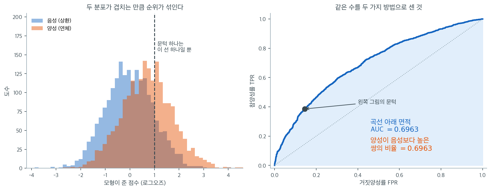

# ROC 곡선과 AUC


## 1. ROC 곡선

**ROC 곡선**(Receiver Operating Characteristic)은 가능한 모든 분류 문턱에 걸쳐 이항 분류기를
평가하는 강력한 도구다. 다음을 그린다.

- **x축:** 위양성률(FPR) $= 1 - \text{특이도}$
- **y축:** 참양성률(TPR) = 민감도 = 재현율

### ROC 곡선 계산

확률 점수를 출력하는 분류기에 대해 결정 문턱 $\tau$를 0에서 1까지 변화시킨다.

1. 각 문턱 $\tau$에 대해 $\hat{p} \geq \tau$이면 양성으로 분류한다.
2. FPR과 TPR을 계산한다.

   $$\text{TPR} = \frac{\text{TP}}{\text{TP} + \text{FN}}, \quad \text{FPR} = \frac{\text{FP}}{\text{FP} + \text{TN}}$$

3. (FPR, TPR) 쌍을 찍는다.
4. 모든 문턱값에 대해 반복하고 점들을 이어 곡선을 만든다.

### 해석

ROC 곡선은 **민감도와 특이도 사이의 절충**을 시각화한다.

- **(0, 1):** 완벽한 분류기(TPR = 1, FPR = 0)
- **(0, 0):** 문턱이 너무 높아 아무것도 양성으로 예측하지 않음
- **(1, 1):** 문턱이 너무 낮아 모두를 양성으로 예측함
- **주대각선($y = x$):** 판별력이 전혀 없는 무작위 분류기

대각선 위에 있는 분류기는 무작위보다 낫고, 아래에 있으면 무작위보다 못하다(예측을 뒤집으면
된다).

---

## 2. 대출 연체의 ROC 곡선

대출 자료에 적합한 로지스틱 회귀 모형에서,

```
At threshold = 0.5:
TPR = 14,336 / 22,671 ≈ 0.6323
FPR = 8,148 / 22,671 ≈ 0.3594
```

문턱을 0에서 1까지 변화시키면 대개 (0, 0) 근처에서 시작해 (1, 1) 근처에서 끝나는 곡선이 되며,
좋은 분류기일수록 위쪽으로 부풀어 오른다.

---

## 3. 곡선 아래 면적(AUC)

**AUC**는 ROC 곡선 아래의 면적으로 0과 1 사이의 값을 갖는다.

$$
\text{AUC} = \int_0^1 \text{TPR}(\text{FPR}) \, d(\text{FPR})
$$

실제로는 **사다리꼴 공식**으로 수치적으로 계산한다.

$$
\text{AUC} \approx \sum_{i=1}^{m} \frac{\text{TPR}_i + \text{TPR}_{i-1}}{2} \cdot (\text{FPR}_i - \text{FPR}_{i-1})
$$

### AUC의 해석

| AUC 값 | 해석 |
|---|---|
| 0.5 | 무작위 분류기, 판별력 없음 |
| 0.6–0.7 | 나쁨 내지 보통 |
| 0.7–0.8 | 받아들일 만함 |
| 0.8–0.9 | 뛰어남 |
| 0.9–1.0 | 매우 뛰어남 |
| 1.0 | 완벽한 분류기 |

위 대출 연체 모형은 **AUC ≈ 0.6917**로, 보통에서 받아들일 만한 수준의 판별력을 갖는다.

---

## 4. AUC의 확률적 해석

AUC에는 **순위통계량**에서 나오는 우아한 해석이 있다.

**AUC = 무작위로 뽑은 양성 사례를 무작위로 뽑은 음성 사례보다 높게 순위 매길 확률.**

달리 말해 연체 대출 하나와 비연체 대출 하나를 무작위로 뽑았을 때, 모형이 연체 쪽에 더 높은
확률을 부여할 확률이 AUC다. AUC가 0.5이면 순위가 무작위라는 뜻이고, 1.0이면 언제나 양성을
음성보다 높게 매긴다는 뜻이다.

### 면적과 확률이 같은 수라는 것

"곡선 아래 면적"과 "순위를 맞힐 확률"은 말만 들어서는 전혀 다른 양 같다. 실제로 세어 보면
같은 수가 나온다. 아래는 양성과 음성을 각각 2,000건씩 만들어(점수 분포를 한 단위의 $0.707$만큼
떨어뜨려) 두 가지 방법으로 AUC를 계산한 것이다.



왼쪽은 모형이 매긴 점수의 분포다. 두 산이 상당히 겹쳐 있고, 겹친 만큼 순위가 섞인다. 여기에
문턱 하나를 세우면(검은 파선) 그 선 왼쪽·오른쪽으로 네 칸의 혼동행렬이 만들어진다. 그러나
문턱은 분포 어디에나 세울 수 있으므로, 분포 전체가 가진 정보는 특정 문턱 하나로 다 드러나지
않는다. 오른쪽 ROC 곡선은 그 선을 왼쪽 끝에서 오른쪽 끝까지 밀면서 남긴 자취다. 왼쪽 그림의
파선에 해당하는 점을 오른쪽에 찍어 두었다.

그렇게 얻은 곡선 아래 면적은 $0.6963$이다. 한편 양성 2,000개와 음성 2,000개로 만들 수 있는
쌍 400만 개를 **하나하나 세어** 양성 점수가 더 높은 쌍의 비율을 구하면 역시 $0.6963$이다.
우연이 아니라 항등식이다. ROC 곡선의 각 계단은 점수를 내림차순으로 훑으며 만나는 관측치
하나에 대응하는데, 양성을 만나면 위로, 음성을 만나면 오른쪽으로 한 칸 간다. 그래서 곡선 아래
면적은 "각 음성보다 위쪽에 있는 양성의 개수"를 모두 더한 값을 전체 쌍의 수로 나눈 것이 되고,
이는 정의상 $P(\hat p_{\text{양성}} > \hat p_{\text{음성}})$이다.

이 동치가 AUC의 성격을 결정한다. AUC는 **순위만 본다.** 점수에 어떤 증가함수를 씌워도 —
로그오즈를 확률로 바꾸든, 전부 제곱하든 — 모든 쌍의 대소관계가 그대로이므로 AUC는 소수점까지
변하지 않는다. 뒤집어 말하면 AUC는 확률값이 맞는지에 대해 아무것도 말해 주지 않는다. 그 몫은
[보정](calibration.md)이 맡는다.

---

## 5. AUC의 장점

1. **문턱에 의존하지 않는다:** 모든 문턱에 걸친 성능을 하나의 수로 요약한다.
2. **범주 불균형을 잘 다룬다:** 정확도와 달리 불균형 자료에서 편향되지 않는다.
3. **확률적 해석이 있다:** 명확한 통계적 의미를 갖는다.
4. **순위 문제에 유용하다:** 점수화와 순위 매기기에 직접 적용된다.

---

## 6. 비교: ROC 대 정밀도-재현율

| 측면 | ROC 곡선 | PR 곡선 |
|---|---|---|
| **초점** | 민감도 대 특이도 | 정밀도 대 재현율 |
| **문턱 비의존** | 그렇다 | 그렇다 |
| **범주 불균형** | 불균형에 덜 민감 | 더 민감하며 드문 사건에 적합 |
| **적합한 상황** | 균형 잡힌 범주 | 불균형 범주(드문 양성) |
| **지표** | AUC (0에서 1) | 평균정밀도 (0에서 1) |

범주 불균형이 심한 자료(예: 양성이 1%인 이상거래 탐지)에서는 **정밀도-재현율 곡선**이 ROC
곡선보다 모형의 행동을 더 분명히 드러내는 경우가 많다.

---

## 7. 문턱 선택

ROC 곡선은 배치할 최적 문턱을 고르는 데 도움이 된다. 흔한 기준은 다음과 같다.

1. **유든의 J 통계량:** $J = \text{TPR} - \text{FPR}$를 최대화하는 문턱을 고른다.
2. **비용 기반:** 오분류 비용을 반영하여
   $\min_\tau [c_{FP} \cdot \text{FPR} + c_{FN} \cdot (1 - \text{TPR})]$를 푼다.
3. **응용 특화:** 업무 요구사항에 따라 고른다(예: 특정 재현율 수준을 목표로 삼기).

대출 연체 모형에서 유든의 J를 쓰면, 위양성과 위음성의 상대적 비용에 따라 최적 문턱이 기본값
0.5와 상당히 다를 수 있다.

---

## 연습문제

<div class="drillbox" markdown>

**연습문제 1.** <span class="diff easy" title="쉬움"></span>
ROC 평면의 네 모서리

**(a)** 점 $(0,0)$, $(1,1)$, $(0,1)$, $(1,0)$이 각각 어떤 분류기인지 적어라.

**(b)** 본문 대출 모형의 문턱 $0.5$에 해당하는 점을 찍고, 유든의 $J$를 구하라.

**(c)** 어떤 분류기의 ROC 곡선이 대각선 **아래**에 놓였다. 무엇을 하면 되는가?

</div>

??? success "풀이"

    **(a)** 차례로

    - $(0,0)$: 문턱을 $1$ 위로 올려 **아무것도 양성이라 하지 않는** 분류기.
    - $(1,1)$: 문턱을 $0$으로 내려 **모두 양성이라 하는** 분류기.
    - $(0,1)$: 위양성 없이 모든 양성을 잡는 **완벽한** 분류기.
    - $(1,0)$: 모든 음성을 양성이라 하고 모든 양성을 음성이라 하는 **완전히 뒤집힌** 분류기.

    **(b)** $\text{FPR} = 0.3594$, $\text{TPR} = 0.6323$이므로 점은 $(0.359,\ 0.632)$이고

    $$
    J = \text{TPR} - \text{FPR} = 0.6323 - 0.3594 = 0.2729
    $$

    다. $J$는 그 점에서 대각선까지의 **수직 거리**이고, $0$이면 무작위와 같다.

    **(c)** **예측을 뒤집으면** 된다. 점 $(f, t)$가 $(1-f, 1-t)$로 옮겨 가 대각선 위로
    올라온다. 곡선이 체계적으로 아래에 있다는 것은 모형이 순위를 거꾸로 매긴다는 뜻이고,
    이름표를 뒤바꿔 학습했을 때 흔히 생긴다. $\square$

---

<div class="drillbox" markdown>

**연습문제 2.** <span class="diff easy" title="쉬움"></span>
점수를 바꿔도 AUC는 그대로다

모형이 로그오즈 $\eta$를 내놓고 이를 $\hat p = 1/(1+e^{-\eta})$로 바꾸어 쓴다.

**(a)** $\eta$로 잰 AUC와 $\hat p$로 잰 AUC가 같음을 보여라.

**(b)** 점수를 모두 제곱하면 AUC가 보존되는가? 조건을 밝혀라.

**(c)** 이 성질이 AUC의 장점이면서 동시에 한계인 까닭을 말하라.

</div>

??? success "풀이"

    **(a)** AUC는 $P(\text{점수}_{\text{양성}} > \text{점수}_{\text{음성}})$이므로 **쌍의
    대소관계**만 쓴다. 로지스틱 함수는 **강증가**라 $\eta_i > \eta_j \iff \hat p_i > \hat p_j$
    이고, 모든 쌍의 대소가 보존되므로 확률도 그대로다. 소수점 끝자리까지 같다.

    **(b)** 점수가 모두 **음이 아닐 때만** 보존된다. 제곱은 $[0,\infty)$에서 강증가이기
    때문이다. 음수가 섞여 있으면 $-3$과 $2$의 순서가 $9$와 $4$로 뒤집혀 AUC가 달라진다.
    로그오즈는 음수를 흔히 가지므로 그대로 제곱하면 안 된다.

    **(c)** **장점**은 점수의 눈금에 휘둘리지 않는다는 것이다. 모형이 내놓는 수가 확률이든
    임의의 점수든 순위만 같으면 같은 AUC가 나오므로, 눈금이 다른 모형들을 공정하게 견줄 수
    있다. **한계**는 같은 이유로 **확률값이 맞는지 전혀 보지 않는다**는 것이다. 모든 예측
    확률을 $100$으로 나누어도 AUC는 그대로지만, 그 확률로 기대비용을 계산하면 엉망이 된다.
    연습문제 9가 이 틈을 파고든다. $\square$

---

<div class="drillbox" markdown>

**연습문제 3.** <span class="diff med" title="중간"></span>
ROC와 AUC

**(a)** 웬만한 분류기의 ROC 곡선이 왜 대각선 위에 놓이는지 설명하라.

**(b)** 어떤 모형의 AUC가 0.85다. 확률적 해석을 제시하라.

**(c)** 모형 A의 AUC가 0.92, 모형 B의 AUC가 0.88이다. 항상 모형 A가 배치하기에 더 낫다고
결론지을 수 있는가? 이유는?

</div>

??? success "풀이"

    **(a)** 대각선은 무작위 분류(모든 문턱에서 TPR = FPR)를 나타낸다. 웬만한 분류기는 양성에
    음성보다 높은 확률을 부여하므로, 어떤 FPR에서든 무작위 추측보다 높은 TPR을 달성한다.

    **(b)** 양성 하나와 음성 하나를 무작위로 뽑았을 때, 모형이 양성 쪽에 더 높은 예측확률을
    부여할 확률이 85%다.

    **(c)** 반드시 그렇지는 않다. AUC는 모든 문턱에 걸친 성능을 요약한 값이다. 실제 응용에서
    쓰는 특정 작동 문턱에서는 모형 B가 더 나을 수 있다. 또 불균형 자료에서는 PR-AUC가 더
    유용한 정보를 줄 수 있다. AUC는 오분류 비용의 차이도 전혀 반영하지 못한다.

    !!! note "ROC 곡선이 교차할 수 있다"
        핵심은 AUC가 **면적**이라는 점이다. 두 곡선의 면적이 달라도 곡선 자체는 얼마든지
        교차할 수 있다. 모형 A가 넓은 FPR 구간에서 우세해 전체 면적이 크더라도, 낮은 FPR
        영역(허위경보를 거의 허용하지 않는 영역)에서는 모형 B가 더 나을 수 있다. 이상거래
        탐지나 진단검사처럼 실제 작동점이 곡선의 왼쪽 끝에 있는 응용에서는 전체 AUC가 아니라
        그 영역의 부분 AUC를 보아야 한다.

---

<div class="drillbox" markdown>

**연습문제 4.** <span class="diff med" title="중간"></span>
사다리꼴 공식으로 AUC 구하기

어떤 모형의 ROC 곡선에서 다음 점들을 얻었다.

| FPR | 0.00 | 0.05 | 0.15 | 0.35 | 0.60 | 1.00 |
|---|---|---|---|---|---|---|
| TPR | 0.00 | 0.40 | 0.62 | 0.80 | 0.92 | 1.00 |

**(a)** 사다리꼴 공식으로 AUC를 구하라.

**(b)** 유든의 $J$를 최대로 만드는 점은 어디인가?

**(c)** 점을 더 촘촘히 재면 AUC 추정값이 커지는가 작아지는가? 왜인가?

</div>

??? success "풀이"

    **(a)** 각 구간의 사다리꼴 넓이를 더한다.

    $$
    \begin{aligned}
    &\tfrac{0+0.40}{2}(0.05) = 0.0100, \quad
    \tfrac{0.40+0.62}{2}(0.10) = 0.0510, \quad
    \tfrac{0.62+0.80}{2}(0.20) = 0.1420, \\[2pt]
    &\tfrac{0.80+0.92}{2}(0.25) = 0.2150, \quad
    \tfrac{0.92+1.00}{2}(0.40) = 0.3840
    \end{aligned}
    $$

    합은 $\text{AUC} = 0.802$다.

    **(b)** $J = \text{TPR} - \text{FPR}$을 점마다 계산하면 $0,\ 0.35,\ 0.47,\ 0.45,\ 0.32,\ 0$
    이므로 $(0.15,\ 0.62)$에서 최대 $J = 0.47$이다.

    **(c)** **커진다.** ROC 곡선은 (이상적으로) 오목하므로 사다리꼴은 곡선 아래쪽에 놓인 현을
    쓰게 되어 넓이를 과소평가한다. 점을 촘촘히 할수록 현이 곡선에 붙어 추정값이 올라간다.
    표본이 유한하면 실제 ROC는 계단이고, 그 계단을 잇는 방식(사다리꼴)이 곧 만-휘트니
    통계량과 정확히 같아진다는 것이 다음 문제다. $\square$

---

<div class="drillbox" markdown>

**연습문제 5.** <span class="diff med" title="중간"></span>
AUC와 만-휘트니 U

양성 $n_1$개와 음성 $n_0$개의 점수가 모두 다르다고 하자. 점수를 내림차순으로 훑으며 양성을
만나면 위로, 음성을 만나면 오른쪽으로 한 칸씩 가는 계단이 ROC 곡선이다.

**(a)** 계단 아래 넓이(정규화 전)가 "각 음성보다 점수가 높은 양성의 개수"의 합과 같음을
설명하라.

**(b)** 이로부터 $\text{AUC} = U/(n_1 n_0)$임을 보여라($U$는 만-휘트니 통계량).

**(c)** 동점이 있으면 어떻게 처리해야 하는가?

</div>

??? success "풀이"

    **(a)** 오른쪽으로 한 칸 가는 사건은 **음성 하나를 지나치는 것**이고, 그때의 높이는 그
    음성보다 점수가 높은 양성의 개수(정규화 전)다. 직사각형의 넓이가 곧 그 개수이므로, 모든
    음성에 대해 더하면 "각 음성보다 위에 있는 양성의 개수"의 총합이 된다.

    **(b)** 그 총합이 바로

    $$
    U = \#\{(i,j) : \text{점수}_{\text{양성}, i} > \text{점수}_{\text{음성}, j}\}
    $$

    이다. 가로축은 $n_0$으로, 세로축은 $n_1$로 정규화하므로 넓이를 $n_1 n_0$으로 나누면

    $$
    \text{AUC} = \frac{U}{n_1 n_0} = \hat P(\text{점수}_{\text{양성}} > \text{점수}_{\text{음성}})
    $$

    가 된다. **AUC는 만-휘트니 U를 쌍의 수로 나눈 것**이며, 그래서 AUC에 대한 검정은
    윌콕슨 순위합 검정과 같은 검정이다.

    **(c)** 동점인 쌍은 **$1/2$로 세어야** 한다. 그러면 ROC 곡선에서 대각선 방향으로 가는
    구간이 생기고, 사다리꼴 공식이 그 구간의 삼각형 절반을 자동으로 더해 준다. 동점을 모두
    "양성이 이겼다"로 세면 AUC가 부풀고, "졌다"로 세면 깎인다. 점수가 이산적인 모형(결정나무의
    잎 확률 등)에서는 동점이 많아 이 처리가 실제로 차이를 만든다. $\square$

---

<div class="drillbox" markdown>

**연습문제 6.** <span class="diff med" title="중간"></span>
불균형에서 ROC가 낙관적으로 보이는 까닭

어떤 작동점에서 $\text{TPR} = 0.80$, $\text{FPR} = 0.10$이다.

**(a)** 유병률이 $0.5$일 때와 $0.01$일 때의 정밀도를 각각 구하라.

**(b)** ROC 평면 위의 점은 두 경우에 어떻게 다른가?

**(c)** (a)와 (b)의 대비로 "ROC는 불균형에 둔감하다"는 말이 장점이자 함정인 까닭을 설명하라.

</div>

??? success "풀이"

    **(a)** $\text{정밀도} = \pi r / (\pi r + (1-\pi) f)$에 넣는다.

    $$
    \pi = 0.5: \ \frac{0.5(0.8)}{0.5(0.8) + 0.5(0.1)} = 0.889, \qquad
    \pi = 0.01: \ \frac{0.01(0.8)}{0.01(0.8) + 0.99(0.1)} = 0.075
    $$

    **(b)** **달라지지 않는다.** TPR은 양성 행에서만, FPR은 음성 행에서만 계산되므로 두 값
    모두 유병률과 무관하다. 같은 점 $(0.10,\ 0.80)$이다.

    **(c)** **장점:** 검정자료의 범주 비율을 바꾸어도 ROC와 AUC가 변하지 않으므로, 표본을
    어떻게 모았든 모형의 순위 능력을 일관되게 잴 수 있다. 서로 다른 유병률의 자료에서 얻은
    AUC를 견주는 일이 가능한 것도 이 덕분이다.

    **함정:** 바로 그 둔감함 때문에 **실무에서 겪을 일을 보여 주지 않는다.** 양성이 $1\%$인
    곳에 이 모형을 배치하면 양성 판정 $100$건 중 $7$건만 맞는데, ROC 그림은 $(0.1,\ 0.8)$이라는
    보기 좋은 점을 그대로 보여 준다. FPR $0.1$이 "겨우 $10\%$"로 보이지만 음성이 $99$배 많으므로
    **절대 건수**로는 참양성을 압도한다. 그래서 드문 사건에서는 정밀도–재현율 곡선을 함께
    본다. PR 곡선의 기준선이 $\pi$(무작위 분류기의 정밀도)라 유병률이 눈금에 드러나기
    때문이다. $\square$

---

<div class="drillbox" markdown>

**연습문제 7.** <span class="diff med" title="중간"></span>
비용이 정하는 작동점

위양성 비용 $c_{\text{FP}}$, 위음성 비용 $c_{\text{FN}}$, 유병률 $\pi$일 때 기대비용은

$$
C(\tau) = (1-\pi)\,\text{FPR}(\tau)\,c_{\text{FP}} + \pi\,\bigl(1 - \text{TPR}(\tau)\bigr)\,c_{\text{FN}}
$$

이다.

**(a)** $C$를 최소로 만드는 작동점에서 ROC 곡선의 **기울기**가 얼마여야 하는지 구하라.

**(b)** 유든의 $J$를 최대화하는 것은 어떤 비용·유병률 가정에 해당하는가?

**(c)** $\pi = 0.01$, $c_{\text{FN}} = 10 c_{\text{FP}}$이면 기울기는 얼마인가? 곡선의 어느
쪽 끝에 작동점이 놓이는가?

</div>

??? success "풀이"

    **(a)** $C$를 FPR의 함수로 보고 미분해 $0$으로 놓으면

    $$
    (1-\pi)c_{\text{FP}} - \pi c_{\text{FN}}\frac{d\,\text{TPR}}{d\,\text{FPR}} = 0
    \quad \Longrightarrow \quad
    \frac{d\,\text{TPR}}{d\,\text{FPR}} = \frac{(1-\pi)\,c_{\text{FP}}}{\pi\,c_{\text{FN}}}
    $$

    이다. **등비용선의 기울기와 ROC 곡선의 접선 기울기가 같아지는 점**이 최적 작동점이다.

    **(b)** 기울기가 $1$인 점을 찾는 것이 $J = \text{TPR} - \text{FPR}$의 최대화와 같다.
    위 식에서 기울기가 $1$이려면 $(1-\pi)c_{\text{FP}} = \pi c_{\text{FN}}$이어야 하므로,
    유든의 $J$는 **"유병률로 가중한 두 비용이 같다"**는 숨은 가정을 깔고 있다.
    $\pi = 0.5$이고 비용이 같을 때가 그 전형이다. 불균형 자료에서 아무 생각 없이 $J$를 쓰면
    이 가정이 조용히 들어온다.

    **(c)** $\dfrac{0.99 \times 1}{0.01 \times 10} = 9.9$다. 기울기가 $1$보다 훨씬 크므로
    접점은 곡선이 가파른 **왼쪽 끝**, 곧 FPR이 아주 작은 영역에 놓인다. 드문 사건에서 전체
    AUC보다 **왼쪽 구간의 부분 AUC**가 중요한 까닭이 이것이다. $\square$

---

<div class="drillbox" markdown>

**연습문제 8.** <span class="diff med" title="중간"></span>
AUC 하나로 요약할 때 잃는 것

연습문제 3 (c)의 주석은 "두 곡선의 면적이 달라도 곡선은 교차할 수 있다"고 했다. 이를 구체화
한다.

**(a)** 모형 $A$가 $\text{AUC} = 0.80$, 모형 $B$가 $\text{AUC} = 0.78$인데
$\text{FPR} \le 0.1$ 구간에서는 $B$가 언제나 위에 있는 상황이 가능한가? 가능하다면 어떤
모양인지 말로 그려라.

**(b)** 이런 상황에서 어느 모형을 배치해야 하는가? 판단에 필요한 정보는 무엇인가?

**(c)** 부분 AUC를 쓸 때 주의할 점 하나를 들어라.

</div>

??? success "풀이"

    **(a)** 가능하다. $B$는 왼쪽 끝에서 가파르게 올라 $\text{FPR} = 0.1$에서 이미
    $\text{TPR} = 0.6$에 닿지만 그 뒤로 완만해지고, $A$는 왼쪽에서 더디게 오르다가 가운데
    구간에서 넓게 앞서 전체 면적을 뒤집는 모양이다. **면적은 구간 전체의 적분이므로 특정
    구간의 우열을 전혀 보장하지 않는다.**

    **(b)** **실제 작동점이 어디인가**를 알아야 한다. 허위경보 예산이 "하루 $100$건"처럼
    정해져 있으면 그것이 FPR 상한을 정하고, 그 구간에서 나은 $B$를 배치해야 한다. 작동점이
    정해져 있지 않다면 비용과 유병률로 연습문제 7의 기울기를 구해 접점이 어느 구간에
    놓이는지 보면 된다.

    **(c)** 부분 AUC는 **구간을 자른 뒤의 면적이라 눈금이 달라진다.** $\text{FPR} \le 0.1$의
    부분 AUC는 최대가 $0.1$이므로 전체 AUC와 직접 견줄 수 없고, 보통 $0.1$로 나누어
    표준화하거나 McClish 보정을 쓴다. 구간을 자료를 보고 고르면 다중비교 문제가 생긴다는 점도
    같다. **구간은 업무 요구에서 미리 정해야 한다.** $\square$

---

<div class="drillbox" markdown>

**연습문제 9.** <span class="diff hard" title="어려움"></span>
AUC는 보정을 보지 못한다

모형 $M$의 예측확률을 $\hat p$라 하고, $\hat p' = \hat p / 10$으로 모든 확률을 $10$분의 $1$로
줄인 모형 $M'$을 만든다.

**(a)** $M$과 $M'$의 AUC를 견주어라.

**(b)** 브라이어 점수 $\text{BS} = \frac1n\sum_i (\hat p_i - y_i)^2$는 어떻게 달라지는가?
유병률이 $0.5$인 자료에서 대략적인 방향을 논하라.

**(c)** 브라이어 점수의 **분해**

$$
\text{BS} = \underbrace{\text{보정오차}}_{\text{calibration}} - \underbrace{\text{해상도}}_{\text{resolution}} + \underbrace{\text{불확실성}}_{\text{uncertainty}}
$$

에서 $M \to M'$으로 갈 때 세 항이 각각 어떻게 되는지 말하고, AUC가 어느 항에 대응하는지
밝혀라.

</div>

??? success "풀이"

    **(a)** **완전히 같다.** $x \mapsto x/10$은 강증가 변환이라 모든 쌍의 대소관계가 보존되고,
    AUC는 순위만 쓰기 때문이다(연습문제 2).

    **(b)** 유병률이 $0.5$인데 모든 예측확률이 $0.1$ 아래로 눌렸으므로, 양성($y=1$)에 대한
    오차 $(\hat p - 1)^2$가 크게 늘어난다. 음성 쪽에서 약간 줄어드는 몫으로는 어림도 없어
    **브라이어 점수가 크게 나빠진다.** 모형은 똑같이 잘 순위를 매기는데 "확률"이라고 내놓는
    수가 틀린 것이다.

    **(c)** 세 항은 이렇게 움직인다.

    - **보정오차**는 크게 **늘어난다.** $\hat p' = 0.09$라고 말한 집단의 실제 양성 비율이
      $0.9$라면 그 차이가 그대로 들어온다.
    - **해상도**는 **그대로다.** 해상도는 예측을 같은 값끼리 묶었을 때 그 묶음들의 실제 비율이
      전체 평균에서 얼마나 떨어져 있는지를 재는데, 단조변환은 묶음의 **구성**을 바꾸지 않는다.
    - **불확실성**은 자료만의 성질($\bar y(1-\bar y)$)이라 모형과 무관하게 **그대로다.**

    **AUC가 대응하는 것은 해상도 쪽**, 곧 "묶음을 얼마나 잘 갈라놓았는가"다. 보정오차 항에
    대해서는 아무 말도 하지 않는다. 그래서 확률을 그대로 쓰는 응용(기대비용 계산, 보험료 산정,
    의사결정 문턱)에서는 AUC만 보고하면 안 되고 보정곡선이나 브라이어 점수를 함께 보아야
    한다. 반대로 **순위만 쓰는 응용**(상위 $N$건만 조사하는 이상거래 탐지)에서는 AUC로 충분
    하다. 지표는 쓰임새가 고른다. $\square$

---

<div class="drillbox" markdown>

**연습문제 10.** <span class="diff hard" title="어려움"></span>
AUC의 불확실성

양성 $n_1 = 50$, 음성 $n_0 = 450$인 검정자료에서 $\widehat{\text{AUC}} = 0.80$을 얻었다.

**(a)** AUC의 표준오차를 구하는 핸리–맥닐 근사

$$
\text{SE} = \sqrt{\frac{A(1-A) + (n_1-1)(Q_1 - A^2) + (n_0-1)(Q_2 - A^2)}{n_1 n_0}},
\quad Q_1 = \frac{A}{2-A},\ Q_2 = \frac{2A^2}{1+A}
$$

로 $95\%$ 신뢰구간을 구하라.

**(b)** 표본을 늘릴 때 $n_1$을 늘리는 것과 $n_0$을 늘리는 것 중 어느 쪽이 더 효과적인가?

**(c)** 두 모형의 AUC를 같은 검정자료에서 견줄 때 독립 이표본 검정을 쓰면 안 되는 까닭은
무엇인가?

</div>

??? success "풀이"

    **(a)** $A = 0.8$에서 $Q_1 = 0.8/1.2 = 0.6667$, $Q_2 = 2(0.64)/1.8 = 0.7111$이므로

    $$
    \begin{aligned}
    \text{분자} &= 0.8(0.2) + 49(0.6667 - 0.64) + 449(0.7111 - 0.64) \\
    &= 0.16 + 49(0.0267) + 449(0.0711) = 0.16 + 1.307 + 31.93 = 33.40
    \end{aligned}
    $$

    이고 $\text{SE} = \sqrt{33.40/(50 \times 450)} = \sqrt{0.001484} = 0.0385$다. 따라서

    $$
    0.80 \pm 1.96(0.0385) = (0.724,\ 0.876)
    $$

    이다. **AUC $0.80$은 "뛰어남"과 "받아들일 만함" 사이 어디쯤이라는 말밖에 못 한다.**

    **(b)** **$n_1$(양성)을 늘리는 쪽**이 훨씬 효과적이다. 분자에서 $n_1$에 곱해지는
    $Q_1 - A^2 = 0.027$이 $n_0$에 곱해지는 $Q_2 - A^2 = 0.071$보다 작지만, 분모가 $n_1 n_0$
    이므로 적은 쪽을 늘릴 때 비가 더 크게 개선된다. 실제로 $n_1 = 500$, $n_0 = 450$으로 바꾸면
    SE가 $0.0385 \to 0.0168$로 절반 아래가 되는 반면, $n_1 = 50$, $n_0 = 4500$으로 바꾸면
    $0.0351$로 거의 그대로다. **드문 범주의 개수가 정밀도를 지배한다**는 이 장의 되풀이되는
    주제다.

    **(c)** 두 AUC가 **같은 관측값들**로 계산되어 강하게 상관되어 있기 때문이다. 독립을
    가정하면 차이의 분산을 과대평가해 검정이 지나치게 보수적이 된다. 상관을 셈에 넣는
    드롱(DeLong) 검정이나, 같은 자료를 함께 재표집하는 붓스트랩/순열 검정을 써야 한다.
    **"짝지어진 자료는 짝지어진 검정으로"** 라는 원칙이 여기서도 그대로 적용된다. $\square$

---

## 정리하며

ROC 곡선은 **모든 문턱을 한 번에** 본다.

- **TPR 대 FPR 을 그린다.** 문턱을 $1$ 에서 $0$ 으로 낮추며 그린 곡선이며, 왼쪽 위 모서리에 가까울수록 좋다.
- **AUC 에는 확률적 해석이 있다.** 무작위로 뽑은 양성 하나와 음성 하나에 대해 **양성의 점수가 더 높을 확률**이다. $0.5$ 는 우연, $1$ 은 완벽이다.
- **문턱과 무관한 지표다.** 모형의 **순위 능력**만 재며, 확률값이 잘 보정되었는지는 말하지 않는다.
- **불균형에 둔감하다는 것이 장점이자 함정이다.** 음성이 압도적이면 FPR 이 작아 보여 낙관적인 인상을 주므로, 정밀도–재현율 곡선을 함께 본다.
- **AUC 가 같아도 곡선 모양이 다를 수 있다.** 관심 있는 FPR 구간에서 어느 쪽이 나은지 확인해야 한다.

다음 절 **보정**으로 넘어간다.
