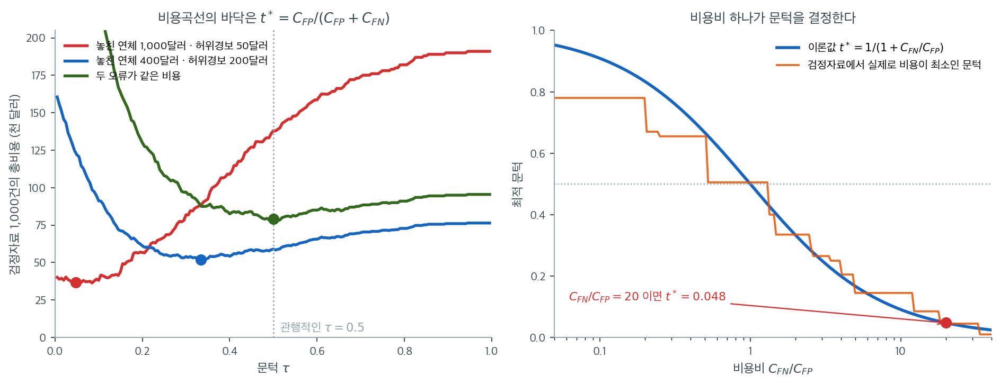

# 결정 문턱 조율


## 개요

이항 분류에서 로지스틱 회귀는 $[0,1]$ 구간의 예측확률을 낸다. 확정적인 예측(양성 또는 음성)을
하려면 **결정 문턱**을 골라야 한다. 기본값 0.5가 항상 최적인 것은 아니며, 올바른 선택은
위양성과 위음성의 비용에 달려 있다.

문턱 조정은 정밀도-재현율 절충과 혼동행렬에 직접 영향을 주므로, 분류기를 응용의 구체적인
요구에 맞출 수 있게 해 준다.

---

## 1. 기본 문턱: 0.5

관례적으로 대부분의 이항 분류기는 문턱 0.5를 쓴다.

$$
\hat{y} = \begin{cases}
1 & \text{if } P(Y=1|\mathbf{x}) \geq 0.5 \\
0 & \text{otherwise}
\end{cases}
$$

이 규칙에서는 예측확률이 50%를 넘으면 양성으로 분류한다.

### 0.5가 적절한 경우

문턱 0.5는 다음 조건에서 최적이다.

- 위양성의 비용과 위음성의 비용이 같다.
- 범주가 균형 잡혀 있다(유병률이 비슷하다).
- 어느 한쪽 오류를 더 꺼릴 사전적 이유가 없다.

실제 응용에서는 이 조건들이 성립하지 않는 경우가 많다.

---

## 2. 문턱 조정하기

### 문턱을 낮추면(예: 0.2)

문턱을 낮추면 분류기가 더 **너그러워진다.** 즉 "양성"을 더 자주 예측한다.

**혼동행렬에 미치는 영향:**

- 재현율(민감도)이 올라간다. 참양성을 더 많이 잡는다.
- 특이도가 내려간다. 위양성이 늘어난다.
- 정밀도가 대체로 내려간다. 양성 예측 중 맞는 비율이 줄어든다.

**쓸 때:**

- 양성을 놓치는 비용(위음성)이 클 때
- 의학적 선별검사: 놓친 질병 사례를 최소화
- 이상거래 탐지: 부정거래를 더 많이 포착
- 대출 연체 예측: 위험한 차입자를 최대한 식별

### 문턱을 높이면(예: 0.8)

문턱을 높이면 분류기가 더 **보수적이 된다.** 즉 아주 확신할 때만 양성으로 예측한다.

**혼동행렬에 미치는 영향:**

- 특이도(참음성률)가 올라간다. 허위경보가 줄어든다.
- 재현율이 내려간다. 위음성이 늘어난다.
- 정밀도가 대체로 올라간다. 양성 예측의 대부분이 맞는다.

**쓸 때:**

- 위양성의 비용이 클 때
- 전자우편 스팸 필터: 정상 메일을 걸러 내지 않도록
- 신용 승인: 아주 안전한 차입자만 승인
- 추천 시스템: 확신이 클 때만 추천

---

## 3. 대출 연체 예측

### 모형의 예측

대출 관측치 1,000건으로 학습한 로지스틱 회귀 모형을 생각하자. 예측확률의 분포는 다음과 같다.

- 160건은 예측확률이 0.2 미만(상환 가능성이 매우 높음)
- 190건은 예측확률이 0.2--0.5(상환 가능성이 높음)
- 250건은 예측확률이 0.5--0.8(연체 가능성이 높음)
- 400건은 예측확률이 0.8 이상(연체 가능성이 매우 높음)

실제로는 1,000건 중 600건이 연체하고 400건이 상환했다.

### 문턱별 혼동행렬

**문턱 = 0.5(균형):**

```
                      Predicted
                   No Default  Default
Actual No Default       280       120
Actual Default           70       530
```

- 민감도(재현율): $530/(530+70) = 0.883$
- 특이도: $280/(280+120) = 0.700$
- 정밀도: $530/(530+120) = 0.815$

**문턱 = 0.2(너그러움):**

```
                      Predicted
                   No Default  Default
Actual No Default        150       250
Actual Default            10       590
```

- 민감도: $590/(590+10) = 0.983$ (거의 모든 연체를 포착)
- 특이도: $150/(150+250) = 0.375$ (허위경보가 많음)
- 정밀도: $590/(590+250) = 0.702$ (덜 믿을 만함)

**문턱 = 0.8(보수적):**

```
                      Predicted
                   No Default  Default
Actual No Default       350        50
Actual Default         250       350
```

- 민감도: $350/(350+250) = 0.583$ (연체를 더 많이 놓침)
- 특이도: $350/(350+50) = 0.875$ (허위경보가 적음)
- 정밀도: $350/(350+50) = 0.875$ (매우 믿을 만함)

---

## 4. 정밀도-재현율 절충

문턱을 낮추면,

- **재현율**(민감도) ↑: 더 많은 양성을 식별
- **정밀도** ↓: 위양성이 늘어 양성 예측이 희석됨

문턱을 높이면,

- **정밀도** ↑: 위양성이 줄어듦
- **재현율** ↓: 참양성을 더 많이 놓침

이 근본적인 절충은 문턱을 1에서 0으로 변화시키며 재현율(x축)에 대한 정밀도(y축)를 그린
**정밀도-재현율 곡선**으로 시각화된다.

---

## 5. 최적 문턱 고르기

### 비용 기반 접근

각 오류의 비용을 안다면 최적 문턱을 해석적으로 구할 수 있다. 다음과 같이 두자.

- $C_{FP}$ = 위양성 하나의 비용
- $C_{FN}$ = 위음성 하나의 비용

예측확률이 $\hat p$인 관측치를 양성으로 분류할 때의 기대비용은 $C_{FP}(1-\hat p)$,
음성으로 분류할 때의 기대비용은 $C_{FN}\,\hat p$이다. 양성 쪽이 더 싸려면
$C_{FP}(1-\hat p) < C_{FN}\hat p$, 즉 $\hat p > C_{FP}/(C_{FP}+C_{FN})$이어야 한다. 따라서
최적 문턱은

$$
t^* = \frac{C_{FP}}{C_{FP} + C_{FN}}
$$

이다. 놓친 연체의 비용이 \$1,000이고 허위경보의 비용이 \$50이라면

$$
t^* = \frac{50}{50 + 1000} \approx 0.048
$$

이다. 위음성이 훨씬 비싸므로 문턱이 **낮아진다.** 즉 연체를 훨씬 적극적으로 예측하게 되며,
이는 앞서 "양성을 놓치는 비용이 클 때 문턱을 낮추라"고 한 원칙과 정확히 일치한다.

!!! warning "분자를 뒤집지 말 것"
    $t^* = C_{FN}/(C_{FP}+C_{FN})$이라고 쓰면 부호가 반대가 된다. 위 예에서 이 잘못된 식은
    $t^* = 1000/1050 \approx 0.95$를 주는데, 이는 "놓친 연체가 20배 비싸니 연체 예측을
    극단적으로 아끼라"는 말이 되어 앞뒤가 맞지 않는다. 기억법은 간단하다. **위음성이 비쌀수록
    문턱은 낮아진다.** 그러려면 비싼 쪽 비용이 분모에만 있어야 한다.

### 비용곡선을 직접 그려 보면

$t^*$ 공식은 관측치 하나에 대한 계산에서 나왔다. 자료 전체의 총비용이 정말 그 지점에서
최소가 되는지 확인해 보자. 아래는 연체율 $19\%$인 검정자료 1,000건에 대해 문턱을 $0$에서
$1$까지 옮기며 총비용 $C_{FP}\cdot FP + C_{FN}\cdot FN$을 그린 것이다.



왼쪽에서 세 곡선은 같은 모형, 같은 자료인데 비용 구조만 다르다. 빨간 곡선(놓친 연체 1,000달러,
허위경보 50달러)은 $\tau = 0.048$에서 바닥을 치고, 파란 곡선(400달러 대 200달러)은
$\tau = 0.333$에서, 두 오류의 비용이 같은 초록 곡선은 $\tau = 0.5$에서 바닥을 친다. 점으로
찍은 것은 곡선의 최소점을 찾아서 표시한 것이 아니라 **공식이 준 $t^*$를 그대로 찍은 것**인데,
정확히 바닥에 앉는다.

실무적으로 중요한 것은 그 차이의 크기다. 빨간 비용 구조에서 $t^* = 0.048$을 쓰면 총비용이
36,800달러인데, 관행대로 $\tau = 0.5$를 쓰면 138,050달러가 든다. 검정자료 1,000건에서 네 배에
가까운 차이이며, 모형을 바꿔서 얻은 개선이 아니라 이미 가진 모형에서 문턱 하나를 옮겨 얻은
것이다. 반대로 비용이 비교적 대칭적인 파란 구조에서는 51,800달러 대 59,000달러로 차이가 작다.
문턱 조율의 이득은 비용이 비대칭일수록 커진다.

오른쪽은 이 관계를 비용비 하나로 정리한 것이다. 파란 곡선이 공식 $t^* = 1/(1 + C_{FN}/C_{FP})$
이고, 주황 계단은 검정자료에서 실제로 비용이 최소가 되는 문턱을 일일이 찾은 값이다. 둘이 잘
따라붙는다. 계단 모양이 나오는 것은 표본이 유한해 관측치 하나가 문턱을 넘나드는 지점에서만
비용이 변하기 때문이며, 표본이 커질수록 매끄러워진다. 이 그림에서 $\tau = 0.5$라는 관행은
$C_{FN} = C_{FP}$라는 특수한 가정에 해당하는 한 점일 뿐임이 분명해진다.

### 성능 지표를 이용한 선택

문턱을 고르는 흔한 방법들이다.

| 방법 | 정의 | 적합한 상황 |
|---|---|---|
| **F1 점수** | $F_1 = 2 \cdot \dfrac{\text{Precision} \cdot \text{Recall}}{\text{Precision} + \text{Recall}}$ | 정밀도와 재현율이 동등하게 중요할 때 |
| **유든의 J** | $J = \text{Sensitivity} + \text{Specificity} - 1$ | 범주가 균형 잡혀 있고 비용 정보가 없을 때 |
| **정밀도-재현율 곡선** | 팔꿈치 지점이나 분야별 목표치를 찾음 | 절충을 시각적으로 판단할 때 |
| **기대비용** | $C_{FP}\cdot FP + C_{FN}\cdot FN$ 최소화 | 비용을 실제로 알 때(가장 바람직) |

### 분야별 목표

실무에서는 배경지식이 문턱 선택을 이끄는 경우가 많다.

- **의학적 선별검사:** 높은 재현율(질병을 조기에 잡음), 허위경보는 감수
- **이상거래 탐지:** 높은 정밀도(고객을 번거롭게 하지 않음), 중간 정도의 재현율
- **대출 승인:** 높은 정밀도(연체를 피함), 낮은 재현율(우량 차입자 일부는 놓침)

---

## 6. 설정

아래 보기는 모두 같은 자료를 쓴다. 양성(연체) 비율이 약 19%인 자료를 만들고
훈련자료로 로지스틱 회귀를 적합해 검정자료의 예측확률 `y_prob`을 얻는다.

<div class="exbox" markdown>

**보기 1.** <span class="diff easy" title="쉬움"></span> 코드 주석의 "약 12%"는 어디서 온 수인가. 설명변수 셋이 독립인 $N(0,1)$이고 $\operatorname{logit} p = -2.0 - 1.1x_1 + 0.9x_2 - 0.5x_3$인 자료를 $n = 4000$ 생성한다. 아래 코드의 주석은 양성 비율이 **약 $12\%$**라 하는데, 이 절 들머리의 본문은 **약 $19\%$**라 한다.

**(1)** 둘 중 어느 쪽이 맞는가. $12\%$라는 수가 어디서 나온 것인지 밝히고, 옳은 주변 양성비율을 구하시오.

**(2)** 자료를 만들어 확인하시오.

</div>

??? success "풀이"

    **(1) 해석적으로. $19\%$가 맞다.** $12\%$는 **설명변수를 모두 $0$으로 둔 사람의 확률**이다.

    $$
    \sigma(-2) = \frac{1}{1 + e^{2}} = 0.119203
    $$

    이것은 절편만 읽은 값이지 주변확률이 아니다. 주변확률은 설명변수를 적분해 없애야 나온다. $Z = -1.1x_1 + 0.9x_2 - 0.5x_3$은 독립인 표준정규 셋의 일차결합이므로

    $$
    \operatorname{Var}(Z) = 1.1^2 + 0.9^2 + 0.5^2 = 2.27,
    \qquad Z \sim N(0,\ 1.506652^2)
    $$

    이고

    $$
    P(Y = 1) = E\bigl[\sigma(-2 + Z)\bigr] = 0.190528
    $$

    이다(수치적분). **$\sigma$가 $-2$ 언저리에서 아래로 볼록이므로 옌센의 부등식이 $E[\sigma(-2+Z)] > \sigma(-2)$를 보장한다.** 설명변수의 흩어짐이 주변 양성률을 $0.1192$에서 $0.1905$로, 곧 $60\%$ 끌어올린다. 자세한 유도는 [19.3절 불균형 자료 다루기의 보기 1](imbalanced_data.md)에 있다.

    **주석이 틀린 것은 절편의 뜻을 주변확률로 착각한 흔한 오독이다.** 로지스틱 모형에서 $\sigma(\beta_0)$은 "모든 설명변수가 $0$인 개체의 확률"이고, 그것이 평균적인 개체의 확률과 같을 이유가 전혀 없다.

    **(2) 수치적으로.**

    ```python
    import numpy as np
    from sklearn.linear_model import LogisticRegression
    from sklearn.model_selection import train_test_split

    # 절편 -2.0 이 양성 비율을 약 12%로 맞춘다. 불균형 자료에서 문턱값 0.5 가
    # 왜 나쁜 선택이 되는지 보기 위한 설정이다.
    rng = np.random.default_rng(0)
    n = 4000
    X = rng.normal(0, 1, size=(n, 3))
    logit = -2.0 - 1.1 * X[:, 0] + 0.9 * X[:, 1] - 0.5 * X[:, 2]
    y = (rng.random(n) < 1 / (1 + np.exp(-logit))).astype(int)

    X_train, X_test, y_train, y_test = train_test_split(
        X, y, test_size=0.25, random_state=0, stratify=y)

    model = LogisticRegression().fit(X_train, y_train)
    y_prob = model.predict_proba(X_test)[:, 1]

    print(f"검정자료 양성 비율 = {y_test.mean():.3f}")
    print(f"예측확률 범위 = [{y_prob.min():.3f}, {y_prob.max():.3f}]")

    from scipy import integrate, stats

    sig = lambda z: 1 / (1 + np.exp(-z))
    sd = np.sqrt(1.1 ** 2 + 0.9 ** 2 + 0.5 ** 2)
    theo = integrate.quad(lambda w: sig(-2 + sd * w) * stats.norm.pdf(w),
                          -10, 10)[0]
    print(f"\nsigma(-2)            = {sig(-2):.6f}   <- 주석의 '약 12%'")
    print(f"이론 주변 양성비율      = {theo:.6f}   <- 본문의 '약 19%'")
    print(f"실제 표본 양성비율      = {y.mean():.6f}  ({y.sum()}/{n})")
    se = np.sqrt(theo * (1 - theo) / n)
    print(f"표준오차 {se:.5f},  z = {(y.mean() - theo) / se:+.3f}")
    print(f"훈련 {y_train.mean():.6f}   검정 {y_test.mean():.6f} "
          f"({y_test.sum()}/{len(y_test)})")
    ```

    출력:

    ```
    검정자료 양성 비율 = 0.181
    예측확률 범위 = [0.002, 0.978]

    sigma(-2)            = 0.119203   <- 주석의 '약 12%'
    이론 주변 양성비율      = 0.190528   <- 본문의 '약 19%'
    실제 표본 양성비율      = 0.181250  (725/4000)
    표준오차 0.00621,  z = -1.494
    훈련 0.181333   검정 0.181000 (181/1000)
    ```

    **$\sigma(-2) = 0.119203$이 주석의 $12\%$와 정확히 맞아떨어진다.** 주석은 틀린 수를 쓴 것이 아니라 **맞는 수를 틀린 이름으로 부른** 것이다. 실제 표본 양성비율은 $0.18125$로 이론값 $0.190528$에서 $1.49$ 표준오차 아래이며, $0.12$와는 비교할 수 없이 멀다.

    예측확률의 범위 $[0.002,\ 0.978]$도 눈여겨볼 만하다. **양성이 $18\%$뿐인 자료인데 모형은 $0.978$까지 자신 있는 예측을 내놓는다.** 그러므로 "불균형 자료에서는 예측확률이 다 작게 나온다"는 말은 사실이 아니다. 문제는 확률의 범위가 아니라 **$0.5$를 넘는 관측이 $1000$건 중 $79$건뿐**이라는 데 있고, 그래서 문턱 $0.5$로 자르면 재현율이 바닥을 긴다(보기 2).

### 파이썬 보기

<div class="exbox" markdown>

**보기 2.** <span class="diff easy" title="쉬움"></span> 정밀도가 문턱보다 크다는 것은 우연이 아니다. 다섯 문턱에서 정밀도·재현율·$F_1$을 잰다.

**(1)** 모형이 잘 **보정**되어 있다면, 문턱 $t$에서의 정밀도는 그 문턱을 넘은 관측들의 **평균 예측확률**과 같아야 함을 보이시오. 그로부터 왜 $\text{Precision}(t) \ge t$가 되는지 설명하시오.

**(2)** 다섯 문턱에서 두 양을 나란히 찍어 확인하고, $F_1$을 최대로 하는 문턱을 구하시오.

</div>

??? success "풀이"

    **(1) 해석적으로.** 문턱 $t$에서 양성으로 예측된 집합을 $S_t = \{i : \hat p_i \ge t\}$라 쓰면

    $$
    \text{Precision}(t) = \frac{1}{\lvert S_t\rvert}\sum_{i \in S_t} y_i
    $$

    이다. 모형이 보정되어 있다는 말은 $E[y_i \mid \mathbf x_i] = \hat p_i$라는 뜻이므로, 기댓값을 취하면

    $$
    E\bigl[\text{Precision}(t)\bigr]
    = \frac{1}{\lvert S_t\rvert}\sum_{i \in S_t} \hat p_i
    = \overline{\hat p}\,\bigl(S_t\bigr)
    $$

    **곧 정밀도의 기댓값이 그 집합의 평균 예측확률이다.** 정밀도는 "양성이라 부른 것 중 실제 양성의 비율"이고 평균 예측확률은 "그들에게 매긴 확률의 평균"이니, 보정이란 정확히 이 둘이 맞는다는 말이다.

    여기서 부등식 하나가 공짜로 나온다. $S_t$ 안의 모든 $\hat p_i$가 정의상 $t$ 이상이므로 평균도 $t$ 이상이고, 따라서

    $$
    E\bigl[\text{Precision}(t)\bigr] = \overline{\hat p}(S_t) \;\ge\; t
    $$

    이다. **보정된 모형에서는 정밀도가 문턱보다 작을 수 없다.** 표에서 $t = 0.5$의 정밀도가 $0.709$인 것은 운이 좋아서가 아니라 구조적인 일이다. 거꾸로 **정밀도가 문턱보다 꾸준히 작게 나온다면 모형이 과신하고 있다는 신호**이며, 이는 보정 그림을 그려 보기 전에도 알아챌 수 있는 간단한 진단이다.

    **(2) 수치적으로.**

    ```python
    from sklearn.metrics import (confusion_matrix, precision_score,
                                 recall_score, f1_score)

    # 문턱을 낮추면 재현율이 오르고 정밀도가 내린다. 어느 쪽을 중히 볼지는
    # 자료가 아니라 문제가 정한다 — 암 검진이라면 재현율, 스팸 분류라면
    # 정밀도 쪽이 중요하다.
    thresholds = [0.2, 0.3, 0.5, 0.7, 0.8]

    for t in thresholds:
        y_pred = (y_prob >= t).astype(int)
        cm = confusion_matrix(y_test, y_pred)

        precision = precision_score(y_test, y_pred)
        recall = recall_score(y_test, y_pred)
        f1 = f1_score(y_test, y_pred)

        print(f"Threshold {t}: Precision={precision:.3f}, "
              f"Recall={recall:.3f}, F1={f1:.3f}")

    print("\n  t    n_pos  정밀도   평균 p    차      SE     z")
    for t in thresholds:
        s = y_prob >= t
        prec = precision_score(y_test, s.astype(int))
        mp = y_prob[s].mean()
        se = np.sqrt(mp * (1 - mp) / s.sum())
        print(f"{t:5.1f} {s.sum():6d}  {prec:.4f}  {mp:.4f}  "
              f"{prec - mp:+.4f}  {se:.4f}  {(prec - mp) / se:+.2f}")

    grid = np.unique(y_prob)
    f1s = np.array([f1_score(y_test, (y_prob >= t).astype(int),
                             zero_division=0) for t in grid])
    k = int(np.argmax(f1s))
    print(f"\nF1 최대 = {f1s[k]:.4f} (문턱 {grid[k]:.4f})")
    acc = np.array([((y_prob >= t).astype(int) == y_test).mean() for t in grid])
    ka = int(np.argmax(acc))
    print(f"정확도 최대 = {acc[ka]:.4f} (문턱 {grid[ka]:.4f});  "
          f"전부 음성이라 하면 {1 - y_test.mean():.4f}")
    ```

    출력:

    ```
    Threshold 0.2: Precision=0.384, Recall=0.702, F1=0.496
    Threshold 0.3: Precision=0.500, Recall=0.547, F1=0.522
    Threshold 0.5: Precision=0.709, Recall=0.309, F1=0.431
    Threshold 0.7: Precision=0.889, Recall=0.088, F1=0.161
    Threshold 0.8: Precision=0.900, Recall=0.050, F1=0.094

      t    n_pos  정밀도   평균 p    차      SE     z
      0.2    331  0.3837  0.3931  -0.0094  0.0268  -0.35
      0.3    198  0.5000  0.4926  +0.0074  0.0355  +0.21
      0.5     79  0.7089  0.6502  +0.0587  0.0537  +1.09
      0.7     18  0.8889  0.8247  +0.0642  0.0896  +0.72
      0.8     10  0.9000  0.8739  +0.0261  0.1050  +0.25

    F1 최대 = 0.5238 (문턱 0.3041)
    정확도 최대 = 0.8520 (문턱 0.5078);  전부 음성이라 하면 0.8190
    ```

    **유도한 등식이 다섯 줄 모두에서 맞는다.** 정밀도와 평균 예측확률의 차이가 $-0.0094$에서 $+0.0642$까지인데, 표준오차로 나누면 $-0.35$에서 $+1.09$ 사이다. **어느 줄도 $1.1$ 표준오차를 넘지 않으므로 이 모형은 잘 보정되어 있다.** 문턱이 높아질수록 차이의 절댓값이 커 보이는 것은 모형이 나빠져서가 아니라 $n_{\text{pos}}$가 $331 \to 10$으로 줄어 표준오차가 $0.027 \to 0.105$로 네 배 커지기 때문이다.

    부등식 $\text{Precision}(t) \ge t$도 다섯 줄 모두에서 성립한다($0.384 > 0.2$, $0.500 > 0.3$, $0.709 > 0.5$, $0.889 > 0.7$, $0.900 > 0.8$).

    $F_1$은 문턱 $0.3041$에서 최대 $0.5238$이고, 표의 다섯 값 가운데 가장 큰 $t = 0.3$의 $0.5224$가 거의 그 자리다. **기본값 $0.5$의 $0.431$보다 $22\%$ 높다.**

    정확도만 보면 이야기가 거꾸로 간다. 정확도를 최대로 하는 문턱은 $0.5078$로 기본값과 사실상 같고 그 값이 $0.8520$인데, **아무것도 안 하고 전부 음성이라 해도 $0.8190$이 나온다.** 겨우 $0.033$ 벌자고 양성의 $69\%$를 놓치는 것이다. 불균형 자료에서 정확도를 목적함수로 삼으면 안 되는 이유가 이 두 줄에 들어 있다.

### ROC 곡선과 유든의 J

<div class="exbox" markdown>

**보기 3.** <span class="diff easy" title="쉬움"></span> $0.176$은 유병률이다. 유든의 $J = \text{TPR} - \text{FPR}$가 고른 문턱은 $0.176$이고, 검정자료의 양성 비율은 $0.181$이다. 우연일까?

**(1)** 모형이 잘 보정되어 있을 때, 유든의 $J$가 고르는 문턱이 **유병률 $\pi$와 같음**을 보이시오.

**(2)** 확인하고, 유한표본에서 둘이 정확히 같지 않은 까닭을 수로 설명하시오.

</div>

??? success "풀이"

    **(1) 해석적으로.** 두 가지 사실을 이어 붙인다.

    **첫째, ROC 곡선의 기울기는 가능도비다.** 점수 $S = \hat p$의 범주별 밀도를 $f_1$, $f_0$이라 하면 문턱 $t$에서 $\text{TPR}(t) = \int_t^1 f_1$, $\text{FPR}(t) = \int_t^1 f_0$이므로

    $$
    \frac{d\,\text{TPR}}{d\,\text{FPR}}
    = \frac{d\text{TPR}/dt}{d\text{FPR}/dt}
    = \frac{-f_1(t)}{-f_0(t)}
    = \frac{f_1(t)}{f_0(t)}
    $$

    이다. 그리고 $J = \text{TPR} - \text{FPR}$를 최대로 하는 점에서는 $dJ/dt = 0$, 곧

    $$
    \frac{d\text{TPR}}{dt} = \frac{d\text{FPR}}{dt}
    \;\Longleftrightarrow\;
    f_1(t) = f_0(t)
    \;\Longleftrightarrow\;
    \frac{f_1(t)}{f_0(t)} = 1
    $$

    **곧 ROC 곡선의 기울기가 $1$이 되는 자리**, 다시 말해 기울기 $1$인 접선이 곡선에 닿는 곳이다.

    **둘째, 보정이 가능도비를 문턱으로 번역해 준다.** 보정된 모형에서는 정의상 $P(Y = 1 \mid \hat p = t) = t$이고, 베이즈 정리로

    $$
    t = P(Y=1 \mid \hat p = t)
    = \frac{\pi f_1(t)}{\pi f_1(t) + (1-\pi) f_0(t)}
    $$

    이다. 정리하면

    $$
    \frac{t}{1-t} = \frac{\pi}{1-\pi}\cdot\frac{f_1(t)}{f_0(t)}
    \quad\Longleftrightarrow\quad
    \frac{f_1(t)}{f_0(t)} = \frac{t}{1-t}\cdot\frac{1-\pi}{\pi}
    $$

    이고, 여기에 첫째 조건 $f_1/f_0 = 1$을 넣으면

    $$
    \frac{t}{1-t} = \frac{\pi}{1-\pi}
    \quad\Longleftrightarrow\quad
    \boxed{t^\ast = \pi}
    $$

    **유든의 $J$가 고르는 문턱은 유병률이다.** 이 자료에서 $\pi = 0.181$이므로 $0.176$은 우연이 아니다.

    뒤집어 보면 뜻이 더 분명해진다. 유든의 $J$는 두 오류의 비용이 같다고 가정한 규칙인데, 비용이 같을 때의 기대비용 최소 문턱은 [19.3절](imbalanced_data.md)에서 본 $C_{FP}/(C_{FP}+C_{FN}) = 1/2$다. **$1/2$가 아니라 $\pi$가 나오는 까닭은 $J$가 TPR과 FPR, 곧 두 범주 **안에서의** 비율만 보기 때문이다.** 범주 크기를 무시하는 것은 유병률 $1/2$인 세상을 가정하는 것과 같고, 그 세상의 문턱 $1/2$를 실제 유병률 $\pi$의 세상으로 되옮기면 $\pi$가 된다.

    **(2) 수치적으로.**

    ```python
    import numpy as np
    from sklearn.metrics import roc_curve, roc_auc_score

    # ROC 곡선 계산
    fpr, tpr, thresholds = roc_curve(y_test, y_prob)

    # Youden 의 J 는 TPR - FPR 을 최대로 만드는 점을 고른다. ROC 곡선에서
    # 왼쪽 위 모서리에 가장 가까운 자리인 셈이다. 다만 이 규칙에는 두 오류의
    # 비용이 같다는 가정이 들어 있으므로, 비용을 알면 그쪽을 쓰는 편이 낫다.
    j_scores = tpr - fpr
    optimal_idx = np.argmax(j_scores)
    optimal_threshold = thresholds[optimal_idx]

    print(f"AUC: {roc_auc_score(y_test, y_prob):.4f}")
    print(f"Optimal threshold (Youden's J): {optimal_threshold:.3f}")

    pi = y_test.mean()
    print(f"\n고른 문턱 {optimal_threshold:.6f}   유병률 {pi:.6f}   "
          f"차 {optimal_threshold - pi:+.6f}")

    def J(t):
        s = y_prob >= t
        return (s & (y_test == 1)).sum() / (y_test == 1).sum() \
             - (s & (y_test == 0)).sum() / (y_test == 0).sum()

    print("\n문턱 주변에서 J 가 얼마나 들쭉날쭉한가")
    for t in [0.15, 0.16, 0.17, optimal_threshold, pi, 0.19, 0.20, 0.22]:
        print(f"  t = {t:.6f}   J = {J(t):.4f}")
    print(f"\n문턱 {optimal_threshold:.4f} 와 {pi:.4f} 사이에 든 검정 관측 = "
          f"{int(((y_prob >= optimal_threshold) & (y_prob < pi)).sum())}건")
    ```

    출력:

    ```
    AUC: 0.8163
    Optimal threshold (Youden's J): 0.176

    고른 문턱 0.176290   유병률 0.181000   차 -0.004710

    문턱 주변에서 J 가 얼마나 들쭉날쭉한가
      t = 0.150000   J = 0.4481
      t = 0.160000   J = 0.4633
      t = 0.170000   J = 0.4602
      t = 0.176290   J = 0.4773
      t = 0.181000   J = 0.4546
      t = 0.190000   J = 0.4447
      t = 0.200000   J = 0.4526
      t = 0.220000   J = 0.4444

    문턱 0.1763 와 0.1810 사이에 든 검정 관측 = 9건
    ```

    **유도한 $t^\ast = \pi$가 맞는다.** $J$가 고른 $0.176290$과 유병률 $0.181000$의 차이가 $0.0047$, 곧 상대적으로 $2.6\%$다.

    **정확히 같지 않은 까닭은 경험적 ROC가 계단함수이기 때문이다.** 유도는 밀도 $f_0$, $f_1$이 매끄럽다는 전제 위에 있는데, $1000$건의 자료가 만드는 ROC는 관측 하나마다 한 칸씩 뛰는 계단이라 "기울기 $1$"인 점이 하나로 정해지지 않는다. 출력의 $J$ 값들이 그 사정을 그대로 보여 준다. $t$를 $0.15$에서 $0.22$까지 옮기는 동안 $J$가 $0.4444$에서 $0.4773$ 사이를 **단조롭지 않게 오르내린다.** 최댓값 $0.4773$과 유병률에서의 $0.4546$ 차이는 $0.023$인데, 이 구간에 걸친 관측이 $9$건뿐이라 한두 건의 운으로 쉽게 뒤집힌다.

    그러므로 **"유든의 $J$가 고른 최적 문턱은 $0.176$"을 소수 셋째 자리까지 믿어서는 안 된다.** 믿어도 되는 것은 "유병률 언저리"라는 결론이고, 그것은 표본이 아니라 유도가 말해 준 것이다. 비용을 아는 상황이라면 애초에 $J$가 아니라 $C_{FP}/(C_{FP}+C_{FN})$을 써야 한다.

---

## 7. 문턱 조율의 주요 성질

| 측면 | 영향 |
|---|---|
| **계산** | 빠르다. 분류 규칙만 바꾸면 되고 재학습이 필요 없다 |
| **시각화** | ROC 곡선과 PR 곡선이 모든 문턱 선택지를 보여준다 |
| **해석 가능성** | 위양성률과 위음성률을 직접 조절한다 |
| **한계** | AUC(전체 순위)를 개선할 수는 없고, 특정 작동점만 조정한다 |

---

## 8. 선형판별분석(LDA)에의 적용

문턱 개념은 로지스틱 회귀를 넘어 확률을 내는 어떤 분류기에도 적용된다. 예컨대
**선형판별분석(LDA)**도 범주 확률 $P(Y=1|\mathbf{x})$를 내므로 같은 방식으로 문턱을 조율할 수
있다.

문턱 0.5를 쓰는 LDA 분류기는

$$\hat{y} = \begin{cases} 1 & \text{if } P_{\text{LDA}}(Y=1|\mathbf{x}) \geq 0.5 \\ 0 & \text{otherwise} \end{cases}$$

이며, 문턱을 0.2로 바꾸면 로지스틱 회귀와 마찬가지로 더 너그러워져 정밀도를 희생하고 재현율을
높인다.

---

## 연습문제

<div class="drillbox" markdown>

**연습문제 1.** <span class="diff easy" title="쉬움"></span>
위 대출 보기에서 세 문턱 각각의 F1 점수와 유든의 J를 계산하라. 어느 문턱이 각 기준에서
최적인가?

</div>

??? success "풀이"

    | 문턱 | 정밀도 | 재현율 | 특이도 | $F_1$ | $J$ |
    |---|---|---|---|---|---|
    | 0.2 | $0.7024$ | $0.9833$ | $0.3750$ | $0.8194$ | $0.3583$ |
    | 0.5 | $0.8154$ | $0.8833$ | $0.7000$ | $\mathbf{0.8480}$ | $\mathbf{0.5833}$ |
    | 0.8 | $0.8750$ | $0.5833$ | $0.8750$ | $0.7000$ | $0.4583$ |

    두 기준 모두 **0.5**를 고른다.

    이는 우연이 아니다. 이 자료는 양성 비율이 60%로 비교적 균형 잡혀 있고, $F_1$과 $J$는 모두
    두 오류에 암묵적으로 비슷한 무게를 준다. 비용을 명시하지 않으면 결국 기본 문턱 근처가
    선택된다. 연습문제 2에서 보듯 비용을 넣으면 답이 완전히 달라진다. $\square$

<div class="drillbox" markdown>

**연습문제 2.** <span class="diff easy" title="쉬움"></span>
놓친 연체의 비용이 \$1,000, 허위경보의 비용이 \$50이라 하자. 세 문턱의 총비용을 계산하고
최적 문턱 $t^*$와 비교하라.

</div>

??? success "풀이"

    총비용은 $50 \times FP + 1000 \times FN$이다.

    | 문턱 | FP | FN | 총비용 |
    |---|---|---|---|
    | 0.2 | 250 | 10 | $250(50) + 10(1000) = \$22{,}500$ |
    | 0.5 | 120 | 70 | $120(50) + 70(1000) = \$76{,}000$ |
    | 0.8 | 50 | 250 | $50(50) + 250(1000) = \$252{,}500$ |

    **0.2**가 압도적으로 낫다. 0.5보다 비용이 3분의 1 이하이고 0.8보다는 11분의 1 수준이다.

    이는 $t^* = 50/1050 \approx 0.048$과 부합한다. 세 후보 중 $t^*$에 가장 가까운 값이 0.2이기
    때문이다. 실제로 문턱을 $0.048$까지 더 낮추면 비용은 더 줄어들 것이다.

    연습문제 1과 대비하면 요점이 분명해진다. $F_1$과 유든의 J는 0.5를 골랐지만 그 선택은
    0.2보다 **세 배 이상 비싸다.** 비용을 알고 있다면 $F_1$이나 J 같은 대리지표를 쓸 이유가
    전혀 없다. 기대비용을 직접 최소화하라. 대리지표는 비용을 모를 때 쓰는 임시방편이다.
    $\square$

<div class="drillbox" markdown>

**연습문제 3.** <span class="diff med" title="중간"></span>
문턱을 조율해도 AUC가 변하지 않는 이유를 설명하라. 그렇다면 문턱 조율은 무엇을 개선하는가?

</div>

??? success "풀이"

    AUC는 **모든 문턱에 걸친** ROC 곡선 아래 면적이다. 문턱을 바꾸는 것은 그 곡선 위에서
    **작동점 하나를 고르는** 일일 뿐, 곡선 자체를 바꾸지 않는다. 곡선은 오직 예측확률의
    **순위**에만 의존하고, 순위는 문턱과 무관하다.

    같은 이유로 다음도 변하지 않는다.

    - 평균정밀도(AP), PR 곡선 전체
    - 브라이어 점수와 로그손실(둘 다 $\hat p$만 쓰고 문턱을 쓰지 않는다)
    - 보정 곡선

    문턱 조율이 바꾸는 것은 **혼동행렬에서 유도되는 모든 것**이다. 정확도, 정밀도, 재현율,
    특이도, $F_1$, 총비용이 그것이다.

    실무적 함의는 명확하다. AUC가 낮으면(순위가 나쁘면) 문턱을 아무리 만져도 소용없다. 더 나은
    특성이나 더 나은 모형이 필요하다. AUC는 높은데 배치 성능이 나쁘다면, 그것은 대개 문턱이
    잘못 잡힌 문제이고 재학습 없이 즉시 고칠 수 있다. **먼저 AUC를 보고, 그다음 문턱을 보라.**
    $\square$

<div class="drillbox" markdown>

**연습문제 4.** <span class="diff med" title="중간"></span>
어떤 분석가가 검정자료에서 $F_1$을 최대화하는 문턱을 찾은 뒤, 같은 검정자료에서 그 $F_1$을
모형 성능으로 보고했다. 무엇이 잘못되었는가?

</div>

??? success "풀이"

    문턱은 **적합된 모수**다. 검정자료에서 고른 뒤 같은 자료로 성능을 보고하면, 모수를 추정한
    자료에서 성능을 평가하는 셈이라 낙관적으로 편향된다.

    편향의 크기는 문턱 격자가 조밀할수록, 검정자료가 작을수록 커진다. 문턱 후보를 $m$개 시도해
    그중 최댓값을 보고하는 것은 $m$번의 시행 중 최댓값을 보고하는 것과 같다. 순전히 잡음만 있는
    상황에서도 최댓값은 평균보다 크다.

    **올바른 절차:** 자료를 세 부분으로 나눈다.

    1. **훈련자료** --- 모형 계수 $\boldsymbol{\theta}$를 적합한다.
    2. **검증자료** --- 문턱(그리고 정칙화 모수 등 다른 초모수)을 고른다.
    3. **검정자료** --- 고정된 모형과 고정된 문턱으로 성능을 **한 번만** 평가한다.

    자료가 적으면 중첩 교차검증을 쓴다. 바깥 루프가 성능을 추정하고, 안쪽 루프가 각 훈련 부분
    안에서 문턱을 고른다. 문턱 선택이 반드시 **바깥 루프 안쪽**에서 일어나야 한다는 점이
    핵심이다. 전체 자료로 문턱을 한 번 고른 뒤 교차검증하면 자료 누설이 된다. $\square$

<div class="drillbox" markdown>

**연습문제 5.** <span class="diff med" title="중간"></span>
문턱을 낮추는 것과 학습 시 양성 범주에 가중치를 주는 것(`class_weight`)은 어떻게 다른가?

</div>

??? success "풀이"

    **문턱 낮추기**는 학습이 끝난 뒤 결정 규칙만 바꾼다. 계수 $\boldsymbol{\theta}$와 예측확률
    $\hat p_i$는 그대로이고, $\hat p \ge t$의 $t$만 달라진다.

    **범주 가중**은 목적함수 자체를 바꾼다. 양성에 가중치 $w$를 주면

    $$
    \ell_w = -\sum_i \bigl[w\,y_i\log\hat p_i + (1-y_i)\log(1-\hat p_i)\bigr]
    $$

    를 최소화하므로 **계수가 달라진다.**

    **두 방법이 같아지는 특수한 경우:** 모형이 참이고 절편이 자유롭다면, 양성에 가중치 $w$를
    주는 것은 절편을 $\log w$만큼 옮기는 것과 점근적으로 같다. 이는 확률을 단조 변환하는 것에
    지나지 않으므로 **순위가 보존되고 AUC도 같다.** 이 경우 두 방법은 사실상 같은 작동점에
    도달하는 두 가지 길이다.

    **달라지는 경우:**

    - **모형이 잘못 지정되었을 때.** 가중은 손실함수를 바꾸므로 적합이 양성 범주 쪽 영역에
      더 잘 맞도록 기울어진다. 기울기까지 달라지므로 순위 자체가 바뀌고 AUC도 달라진다.
    - **정칙화가 있을 때.** 벌점이 가중치와 상호작용하여 선택되는 변수 집합이 달라질 수 있다.
    - **확률의 의미.** 가중 모형이 내는 $\hat p$는 더 이상 실제 사건 확률의 추정치가 아니라
      가중된 모집단의 확률이다. 보정이 깨지므로 브라이어 점수나 기대비용 계산에 그대로 쓸 수
      없다.

    **권장:** 확률 자체가 필요하다면 가중 없이 학습해 잘 보정된 $\hat p$를 얻은 뒤 문턱으로
    작동점을 조절하라. 이 편이 단순하고, 되돌리기 쉬우며, 비용 구조가 바뀌어도 재학습이
    필요 없다. 범주 불균형이 극단적이어서 최적화 자체가 소수 범주를 사실상 무시할 때에만
    가중을 고려하라. $\square$

---

## 정리하며

- **기본 문턱 0.5**는 오류 비용이 같고 범주가 균형 잡혀 있을 때만 최적이다.
- **낮은 문턱**(0.2--0.3)은 재현율을 높이고 정밀도를 낮춘다. 양성을 놓치는 비용이 클 때 쓴다.
- **높은 문턱**(0.7--0.8)은 정밀도를 높이고 재현율을 낮춘다. 위양성의 비용이 클 때 쓴다.
- **ROC 곡선과 PR 곡선**이 문턱에 따른 절충 전체를 보여준다.
- **유든의 J**와 **F1 점수**는 자동 선택 방법을 제공한다.
- **문턱 조율은 빠르고 재학습이 필요 없어** 운영 중 조정에 실용적이다.
