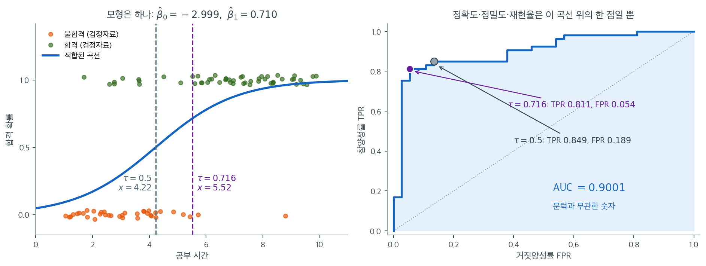

# 로지스틱 회귀 실습


## 개요

이 절에서는 scikit-learn과 statsmodels 두 가지로 파이썬에서 로지스틱 회귀를 실습한다. 공부
시간과 시험 결과(합격/불합격)를 연결하는 인공자료를 생성해 모형을 적합하고, 오즈비와 신뢰구간을
계산하며, 가능도비 검정을 수행하고, 혼동행렬·ROC 곡선·정밀도-재현율 곡선으로 예측을 평가한 뒤
유든의 J 통계량으로 문턱을 고른다.

## 자료 생성

이항 결과 $y_i \in \{0,1\}$을 잠재 선형모형을 시그모이드에 통과시켜 생성한다.

$$
z_i = -3 + 0.7\,x_i + 0.3\,\varepsilon_i, \qquad
p_i = \frac{1}{1+e^{-z_i}}, \qquad
y_i \sim \operatorname{Bernoulli}(p_i)
$$

여기서 $x_i$는 $[1,10]$에서 균등하게 뽑은 공부 시간이고 $\varepsilon_i \sim N(0,1)$이다.

<div class="exbox" markdown>

**보기 1.** <span class="diff easy" title="쉬움"></span> 숨은 잡음이 기울기를 깎는다. 위 모형으로 $n = 300$을 생성한다. 분석자는 $x$(공부 시간)만 관측하고 $\varepsilon$은 보지 못한다.

**(1)** 분석자가 보는 곡선은 $g(x) = P(Y = 1 \mid x) = E_\varepsilon\bigl[\sigma(-3 + 0.7x + 0.3\varepsilon)\bigr]$이다. $g$가 $0.5$를 지나는 $x$를 **정확히** 구하고, 그 자리에서 $g$에 맞춘 로지스틱의 기울기가 $0.7$보다 **반드시 작음**을 보이시오.

**(2)** 그 기울기를 수치적으로 구하고, 표본 $300$개로 적합한 값과 견주시오.

</div>

??? success "풀이"

    **(1) 해석적으로.** $\sigma$가 비선형이므로 기댓값과 $\sigma$의 순서를 바꿀 수 없다. 곧 $g$는 로지스틱 함수가 **아니다.** 그래도 두 가지는 정확히 말할 수 있다.

    **$0.5$를 지나는 자리.** 잠재 선형부가 $0$이 되는 $x$, 곧

    $$
    -3 + 0.7x = 0 \quad\Longrightarrow\quad x_0 = \frac{30}{7} = 4.285714
    $$

    에서 $g(x_0) = E[\sigma(0.3\varepsilon)]$이다. $\varepsilon \sim N(0,1)$이 $0$에 대해 대칭이고 $\sigma(u) + \sigma(-u) = 1$이므로

    $$
    2E[\sigma(0.3\varepsilon)]
    = E[\sigma(0.3\varepsilon)] + E[\sigma(-0.3\varepsilon)]
    = E[1] = 1
    $$

    곧 $g(x_0) = 1/2$다. **잡음이 아무리 커도 중간점은 움직이지 않는다.** 깎이는 것은 위치가 아니라 기울기다.

    **기울기는 반드시 작아진다.** 미분과 기댓값을 바꾸면

    $$
    g'(x) = 0.7\, E\bigl[\sigma'(-3 + 0.7x + 0.3\varepsilon)\bigr],
    \qquad
    g'(x_0) = 0.7\, E\bigl[\sigma'(0.3\varepsilon)\bigr]
    $$

    이다. 여기에 로지스틱 하나를 $x_0$에서 값과 기울기가 맞게 포갠다고 하자. 로지스틱 $p(x) = \sigma(\beta_0 + \beta_1 x)$는 $p' = \beta_1 p(1-p)$이므로 확률이 $1/2$인 자리에서 기울기가 $\beta_1/4$다. 따라서

    $$
    \frac{\beta_1^{\text{eff}}}{4} = g'(x_0)
    \quad\Longrightarrow\quad
    \beta_1^{\text{eff}} = 4 \times 0.7\, E\bigl[\sigma'(0.3\varepsilon)\bigr]
    = 0.7 \times 4E\bigl[\sigma'(0.3\varepsilon)\bigr]
    $$

    이다. 그런데 $\sigma'(u) = \sigma(u)(1-\sigma(u))$는 $u = 0$에서만 $1/4$이고 그 밖에서는 **엄격히 작다.** $\varepsilon$이 연속이라 $P(\varepsilon = 0) = 0$이므로

    $$
    E\bigl[\sigma'(0.3\varepsilon)\bigr] < \tfrac14
    \quad\Longrightarrow\quad
    \beta_1^{\text{eff}} < 0.7
    $$

    이다. **부등호가 엄격하다.** 이것이 관측되지 않은 이질성이 일으키는 **감쇠**이며, $\sigma$가 오목도 볼록도 아닌 $S$자라는 사실 하나에서 나온다.

    **(2) 수치적으로.**

    ```python
    import numpy as np

    # 공부 시간이 합격 여부에 미치는 영향. 참 계수가 0.7 이므로, 한 시간마다
    # 로그오즈가 0.7 씩 오른다.
    np.random.seed(42)
    n = 300
    hours_studied = np.random.uniform(1, 10, n)
    noise = np.random.normal(0, 1, n)
    logit = -3 + 0.7 * hours_studied + 0.3 * noise
    prob = 1 / (1 + np.exp(-logit))
    passed = np.random.binomial(1, prob)

    X = hours_studied.reshape(-1, 1)
    y = passed

    from scipy import integrate, stats

    sigma = lambda u: 1 / (1 + np.exp(-u))

    # E[sigma'(0.3 eps)] 를 수치적분으로 구한다.
    g = lambda e: sigma(0.3 * e) * (1 - sigma(0.3 * e)) * stats.norm.pdf(e)
    Esp = integrate.quad(g, -12, 12)[0]

    print(f"x0 = 30/7 = {30 / 7:.6f}")
    print(f"E[sigma'(0.3 eps)] = {Esp:.6f}   (1/4 = 0.25 보다 작다)")
    print(f"감쇠한 기울기 beta_eff = 0.7 * 4 * E = {0.7 * 4 * Esp:.6f}")
    print(f"표본 합격률 = {y.mean():.4f},  생성에 쓰인 참 확률의 평균 = {prob.mean():.4f}")
    ```

    출력:

    ```
    x0 = 30/7 = 4.285714
    E[sigma'(0.3 eps)] = 0.244613   (1/4 = 0.25 보다 작다)
    감쇠한 기울기 beta_eff = 0.7 * 4 * E = 0.684917
    표본 합격률 = 0.6167,  생성에 쓰인 참 확률의 평균 = 0.6141
    ```

    유도한 대로 $E[\sigma'(0.3\varepsilon)] = 0.244613 < 0.25$이고 $\beta_1^{\text{eff}} = 0.684917 < 0.7$이다. 감쇠는 $2.2\%$다.

    **여기서 두 가지가 어긋나며, 둘 다 뜻이 있다.**

    첫째, 같은 자료생성과정에서 $n = 400{,}000$을 뽑아 로지스틱을 적합하면 기울기가 $0.6922$로 나온다. 위에서 구한 $0.6849$와 $1.1\%$ 다르다. **틀린 것이 아니라 "기울기"가 하나가 아니기 때문이다.** $g$는 로지스틱이 아니므로 $x_0$에서의 접선으로 정의한 기울기와, $x \in [1,10]$ 전체에서 가능도를 최대화해 고른 기울기가 같을 이유가 없다. 둘 다 $0.7$보다 작다는 것만이 공통이다.

    둘째, 정작 이 자료 $300$개로 적합하면 (보기 3) $\hat\beta_1 = 0.7572$가 나와 **감쇠한 값은커녕 참값 $0.7$보다도 크다.** 표준오차가 $0.083$이므로 $\pm 0.16$의 흔들림을 안고 있는데 감쇠가 만든 차이는 고작 $0.015$다. **표집오차가 감쇠보다 열 배 크다.** 그러므로 이 쪽의 적합 결과를 보고 감쇠를 확인할 수는 없다. 감쇠는 모집단의 성질이고, 표본 하나로는 보이지 않는다.

!!! note "이 자료는 로지스틱 모형을 정확히 따르지 않는다"
    선형예측자에 $0.3\varepsilon_i$가 더해져 있으므로, $x$만 관측하는 분석자의 관점에서
    $P(Y=1\mid x)$는 로지스틱 함수들의 혼합이지 로지스틱 함수 자체가 아니다. 이런 관측되지
    않은 이질성은 계수를 0 쪽으로 **감쇠**시킨다. $\sigma = 0.3$은 작아서 효과가 미미하지만,
    적합된 기울기가 참값 $0.7$과 정확히 일치하지 않는 데에는 표집오차뿐 아니라 이 요인도 있다.

## scikit-learn으로 적합하기

scikit-learn의 `LogisticRegression`은 기본적으로 벌점 로그가능도를 최대화한다(C = 1.0, L2
벌점). 추정된 절편과 기울기는 로지스틱 모형에 그대로 대응한다.

$$
\log\frac{P(Y=1\mid x)}{1-P(Y=1\mid x)} = \hat\beta_0 + \hat\beta_1\,x
$$

<div class="exbox" markdown>

**보기 2.** <span class="diff easy" title="쉬움"></span> 적합이 그은 선과 그것을 재는 기준선. 자료를 훈련 $70\%$ 와 검정 $30\%$ 로 나누어 `LogisticRegression` 을 적합한다. 결과는 $\hat\beta_0 = -2.9986$, $\hat\beta_1 = 0.7099$다.

**(1)** 문턱 $0.5$에서 합격으로 예측되는 공부 시간의 경계를 구하고, 참 모형의 경계 $30/7$과 견주시오.

**(2)** 검정 정확도 $0.833$을 무엇과 견주어야 "좋다"고 말할 수 있는가. 그 기준선을 구하고 코드로 확인하시오.

</div>

??? success "풀이"

    **(1) 해석적으로.** 예측확률이 $0.5$ 이상이라는 것은 로그오즈가 $0$ 이상이라는 것과 같다.

    $$
    \hat\beta_0 + \hat\beta_1 x \ge 0
    \iff
    x \ge -\frac{\hat\beta_0}{\hat\beta_1}
    = \frac{2.9986209}{0.7098560}
    = 4.22427
    $$

    이다. **문턱 $0.5$는 확률 축의 한 점이지만 설명변수 축에서는 세로선 하나다.** 참 모형의 경계는 보기 1에서 구한 $30/7 = 4.28571$이므로 추정된 경계가 $0.0614$시간, 곧 약 $3.7$분 왼쪽에 서 있다.

    **(2) 해석적으로.** 정확도는 혼자서는 뜻이 없다. 아무 정보도 쓰지 않고 **다수 범주로만 찍는** 분류기가 이미 받는 점수가 기준선이다. 검정자료 $90$건의 합격자가 $53$명이므로

    $$
    \text{기준선} = \max\Bigl(\frac{53}{90},\ \frac{37}{90}\Bigr) = \frac{53}{90} = 0.5889
    $$

    다. 적합 모형의 $0.8333$은 이 기준선 위로 $0.2444$만큼 올라간 것이고, 남은 거리 $1 - 0.5889 = 0.4111$ 가운데 $59.5\%$를 메운 셈이다.

    **(2) 수치적으로.**

    ```python
    from sklearn.linear_model import LogisticRegression
    from sklearn.model_selection import train_test_split

    X_train, X_test, y_train, y_test = train_test_split(
        X, y, test_size=0.3, random_state=42
    )

    # sklearn 의 LogisticRegression 은 기본으로 L2 벌점이 걸려 있다(C=1.0).
    # 벌점 없는 순수 MLE 를 원하면 penalty=None 을 주어야 한다. 아래
    # statsmodels 결과와 계수가 조금 다른 까닭이 이것이다.
    model = LogisticRegression(random_state=42)
    model.fit(X_train, y_train)

    print(f"Intercept: {model.intercept_[0]:.4f}")
    print(f"Coefficient (hours): {model.coef_[0][0]:.4f}")
    print(f"Train accuracy: {model.score(X_train, y_train):.3f}")
    print(f"Test accuracy:  {model.score(X_test, y_test):.3f}")

    y_prob = model.predict_proba(X_test)[:, 1]
    y_pred = model.predict(X_test)

    b0, b1 = model.intercept_[0], model.coef_[0][0]
    print(f"\n0.5 결정경계 x = {-b0 / b1:.5f}   (참 모형 30/7 = {30 / 7:.5f})")
    print(f"훈련 {len(y_train)}건(합격률 {y_train.mean():.4f}), "
          f"검정 {len(y_test)}건(합격률 {y_test.mean():.4f})")
    base = max(y_test.mean(), 1 - y_test.mean())
    acc = model.score(X_test, y_test)
    print(f"다수범주 기준선 = {base:.4f},  모형 = {acc:.4f}")
    print(f"남은 거리의 {100 * (acc - base) / (1 - base):.1f}% 를 메웠다")
    ```

    출력:

    ```
    Intercept: -2.9986
    Coefficient (hours): 0.7099
    Train accuracy: 0.805
    Test accuracy:  0.833

    0.5 결정경계 x = 4.22427   (참 모형 30/7 = 4.28571)
    훈련 210건(합격률 0.6286), 검정 90건(합격률 0.5889)
    다수범주 기준선 = 0.5889,  모형 = 0.8333
    남은 거리의 59.5% 를 메웠다
    ```

    유도한 경계 $4.22427$과 기준선 $0.5889$가 코드와 맞는다.

    두 가지를 덧붙여 둔다. 첫째, **검정 정확도 $0.833$이 훈련 정확도 $0.805$보다 높다.** 과적합의 반대로 보이지만 그런 뜻이 아니다. `train_test_split`에 `stratify`를 주지 않아 훈련의 합격률은 $0.6286$, 검정은 $0.5889$로 갈렸고, 범주가 더 고르게 섞인 쪽이 더 어렵다. **모수 두 개짜리 모형에서 $90$건의 정확도는 그 자체로 $\pm 0.08$쯤 흔들린다**($\sqrt{0.833 \times 0.167/90} = 0.039$의 두 배).

    둘째, 여기 쓴 계수는 **벌점이 걸린 값**이다. 같은 훈련자료에 `penalty=None`을 주면 $(-3.0275,\ 0.7162)$가 나온다(아래 경고 상자). 기울기가 $0.88\%$ 줄어든 것이 기본 `C=1.0`이 한 일 전부다.

## statsmodels로 추론하기

statsmodels는 최대가능도 추정을 통해 표준오차, 왈드 검정, 신뢰구간을 제공한다(기본적으로 벌점을
주지 않는다).

<div class="exbox" markdown>

**보기 3.** <span class="diff easy" title="쉬움"></span> 요약표의 수를 손으로 되살리기. 전체 자료 $300$건에 `sm.Logit`을 적합하면 요약표가 나온다.

**(1)** 요약표의 `LL-Null: -199.70`을 **자료의 합격 비율 하나만으로** 다시 계산하시오. 또 `Pseudo R-squ.: 0.3820`이 어떤 식으로 계산된 것인지 보이시오.

**(2)** `x1` 줄의 $z = 9.130$과 신뢰구간 $(0.595,\ 0.920)$이 계수 $0.7572$와 표준오차 $0.083$에서 어떻게 나오는지 보이고, 코드로 확인하시오.

</div>

??? success "풀이"

    **(1) 해석적으로.** 영모형은 설명변수를 쓰지 않고 절편만 둔다. 그러면 모든 관측에 같은 확률 $p$를 주므로 로그가능도가

    $$
    \ell_0(p) = \sum_{i=1}^{n}\bigl[y_i \log p + (1-y_i)\log(1-p)\bigr]
    = n\bar y \log p + n(1-\bar y)\log(1-p)
    $$

    이고, 이것은 6장의 베르누이 최대가능도 그 자체라 $\hat p = \bar y$에서 최대가 된다. 값을 넣으면

    $$
    \ell_0(\bar y) = n\bigl[\bar y\log\bar y + (1-\bar y)\log(1-\bar y)\bigr] = -n\,H(\bar y)
    $$

    **곧 영모형의 로그가능도는 경험분포 엔트로피에 $-n$을 곱한 것**이다([6장](../../ch06/mle/mle_bernoulli.md)에서 교차엔트로피 손실의 바닥으로 나온 그 양이다). 이 자료는 $300$건 중 $185$건이 합격이라 $\bar y = 185/300 = 0.616667$이고

    $$
    \ell_0 = 300\bigl[0.616667\log 0.616667 + 0.383333\log 0.383333\bigr] = -199.7017
    $$

    로 요약표의 $-199.70$과 같다. **요약표의 한 줄이 자료의 합격자 수 하나로 결정된다.**

    맥패든의 유사 $R^2$는 두 로그가능도의 비다.

    $$
    R^2_{\text{McF}} = 1 - \frac{\ell(\hat\beta)}{\ell_0}
    = 1 - \frac{-123.41756}{-199.70172}
    = 1 - 0.618010 = 0.381990
    $$

    로 $0.3820$과 맞는다. 선형회귀의 $R^2$와 달리 **설명된 분산의 비율이 아니라 설명된 로그가능도의 비율**이므로, 값이 작게 나오는 것이 보통이다.

    **(2) 해석적으로.** 왈드 $z$는 계수를 표준오차로 나눈 것이다.

    $$
    z = \frac{\hat\beta_1}{\operatorname{SE}(\hat\beta_1)}
    = \frac{0.757214}{0.082937} = 9.1300
    $$

    신뢰구간은 $\hat\beta_1 \pm z_{0.975}\operatorname{SE}$로

    $$
    0.757214 \pm 1.959964 \times 0.0829370
    = 0.757214 \pm 0.162553
    = (0.594661,\ 0.919768)
    $$

    이고 요약표의 $(0.595,\ 0.920)$과 맞는다. **반올림된 $0.083$을 그대로 쓰면 $\pm 0.162677$이 되어 넷째 자리에서 어긋나므로, 확인은 반올림 전 값으로 해야 한다.**

    **(2) 수치적으로.**

    ```python
    import statsmodels.api as sm
    from scipy import stats

    # 추론이 목적이면 statsmodels 쪽이다. 표준오차·z 값·신뢰구간이 함께 나온다.
    X_sm = sm.add_constant(hours_studied)
    logit_model = sm.Logit(y, X_sm)
    result = logit_model.fit(disp=0)
    def print_summary(res):
        """summary()의 Date/Time 칸은 실행할 때마다 달라지므로 비우고 출력한다."""
        lines = []
        for line in str(res.summary()).split("\n"):
            if line.startswith(("Date:", "Time:")):
                lines.append(line[:19].ljust(38) + line[38:])
            else:
                lines.append(line)
        print("\n".join(lines))


    print_summary(result)

    # 요약표의 네 수를 손으로 되살린다.
    ybar = y.mean()
    ll0 = n * (ybar * np.log(ybar) + (1 - ybar) * np.log(1 - ybar))
    print(f"\nybar = {y.sum()}/{n} = {ybar:.6f}")
    print(f"손으로 계산한 LL-Null = {ll0:.4f}   statsmodels = {result.llnull:.4f}")
    print(f"McFadden R^2 = 1 - {result.llf:.5f}/{result.llnull:.5f} "
          f"= {1 - result.llf / result.llnull:.6f}")
    print(f"beta1 = {result.params[1]:.6f}, SE = {result.bse[1]:.6f}, "
          f"z = {result.params[1] / result.bse[1]:.4f}")
    half = stats.norm.ppf(0.975) * result.bse[1]
    print(f"CI = {result.params[1]:.6f} +- {half:.6f} "
          f"= ({result.params[1] - half:.6f}, {result.params[1] + half:.6f})")
    ```

    출력:

    ```
                               Logit Regression Results                           
    ==============================================================================
    Dep. Variable:                      y   No. Observations:                  300
    Model:                          Logit   Df Residuals:                      298
    Method:                           MLE   Df Model:                            1
    Date:                                   Pseudo R-squ.:                  0.3820
    Time:                                   Log-Likelihood:                -123.42
    converged:                       True   LL-Null:                       -199.70
    Covariance Type:            nonrobust   LLR p-value:                 4.760e-35
    ==============================================================================
                     coef    std err          z      P>|z|      [0.025      0.975]
    ------------------------------------------------------------------------------
    const         -3.2519      0.408     -7.979      0.000      -4.051      -2.453
    x1             0.7572      0.083      9.130      0.000       0.595       0.920
    ==============================================================================

    ybar = 185/300 = 0.616667
    손으로 계산한 LL-Null = -199.7017   statsmodels = -199.7017
    McFadden R^2 = 1 - -123.41756/-199.70172 = 0.381990
    beta1 = 0.757214, SE = 0.082937, z = 9.1300
    CI = 0.757214 +- 0.162553 = (0.594661, 0.919768)
    ```

    네 수가 모두 맞는다. 합격자 수 $185$ 하나에서 $-199.7017$이 나오고, 거기에 적합모형의 $-123.41756$을 더하면 유사 $R^2$ $0.381990$이 나오며, 계수와 표준오차 두 수에서 $z = 9.1300$과 구간 $(0.594661,\ 0.919768)$이 나온다. **요약표에 새 정보는 없다. 같은 자료를 여러 각도에서 되비친 것뿐이다.**

!!! warning "두 결과를 나란히 비교하기 전에"
    위 statsmodels 코드는 **전체 자료 300건**에 적합하지만 scikit-learn 코드는 **훈련자료
    210건**에만 적합했다. 계수가 다르게 나오는 것($-3.2519$ 대 $-2.9986$)은 알고리즘 차이가
    아니라 대부분 이 때문이다. 조건을 맞춰 훈련자료에만 적합하면,

    | 적합 | $\hat\beta_0$ | $\hat\beta_1$ |
    |---|---|---|
    | sklearn, `C=1.0`(L2 벌점) | $-2.9986$ | $0.7099$ |
    | sklearn, `penalty=None` | $-3.0275$ | $0.7162$ |
    | statsmodels(벌점 없음) | $-3.0238$ | $0.7155$ |

    이 되어 statsmodels와 벌점 없는 sklearn이 사실상 일치한다. 남는 차이 $0.7162$ 대
    $0.7099$가 기본 L2 벌점이 만든 축소다.

### 오즈비

로짓 연결은 오즈의 로그이므로, 계수를 지수화하면 오즈비가 된다.

$$
\text{OR}_j = e^{\hat\beta_j}
$$

공부 시간이 한 단위 늘면 합격 오즈에 $e^{\hat\beta_1}$이 곱해진다.

<div class="exbox" markdown>

**보기 4.** <span class="diff easy" title="쉬움"></span> 오즈비 구간은 왜 비대칭인가. 보기 3의 적합에서 $\hat\beta_1 = 0.757214$, 95% 신뢰구간 $(0.594661,\ 0.919768)$을 얻었다.

**(1)** 오즈비와 그 95% 신뢰구간을 구하시오. 계수의 구간을 그냥 지수화해도 되는 까닭은 무엇인가.

**(2)** 얻은 오즈비 구간이 추정값을 가운데에 두지 **않음**을 보이고, 왜 그런지 설명하시오. 또 출력의 첫 수 $0.0387$은 무엇인가.

</div>

??? success "풀이"

    **(1) 해석적으로.** 로짓 연결에서

    $$
    \log\frac{p(x+1)}{1-p(x+1)} - \log\frac{p(x)}{1-p(x)} = \hat\beta_1
    $$

    이므로 오즈의 비가 $\text{OR} = e^{\hat\beta_1}$이다. 값을 넣으면

    $$
    \text{OR} = e^{0.757214} = 2.13233
    $$

    으로 공부 시간 한 시간마다 합격 오즈가 약 **두 배**가 된다.

    구간을 그냥 지수화해도 되는 까닭은 **$e^{(\cdot)}$가 엄격히 증가하는 함수**이기 때문이다. 일반적으로 $h$가 엄격증가이면

    $$
    P\bigl(L \le \beta_1 \le U\bigr) = P\bigl(h(L) \le h(\beta_1) \le h(U)\bigr)
    $$

    이 항등식으로 성립하므로 포함확률이 그대로 보존된다. 따라서

    $$
    \bigl(e^{0.594661},\ e^{0.919768}\bigr) = (1.81242,\ 2.50871)
    $$

    이 $\text{OR}$의 95% 신뢰구간이다. 구간이 $1$을 포함하지 않으므로 ($\beta_1$의 구간이 $0$을 포함하지 않는 것과 같은 말이다) 효과는 유의하다.

    **(2) 해석적으로.** 지수함수는 증가하지만 **선형이 아니다.** $\beta_1$의 구간은 $0.757214$를 가운데 두고 양쪽으로 $0.162556$씩 뻗은 대칭구간이지만, 지수를 씌우면

    $$
    2.13233 - 1.81242 = 0.31991,
    \qquad
    2.50871 - 2.13233 = 0.37638
    $$

    로 오른쪽이 $17.7\%$ 길어진다. $e^x$가 볼록이라 같은 길이를 오른쪽으로 더 늘려 놓기 때문이다. **그러므로 오즈비를 "$2.13 \pm 0.35$"처럼 적으면 안 된다.** 대칭인 것은 로그 척도뿐이고, 실제로 $\log 1.81242 = 0.594661$, $\log 2.50871 = 0.919768$의 가운데가 정확히 $0.757214$다.

    출력의 첫 수 $0.0387 = e^{-3.251887}$은 오즈비가 아니라 **$x = 0$일 때의 오즈**다. 공부 시간이 $0$인 학생의 합격 오즈가 $0.0387$, 곧 확률로는 $0.0387/(1+0.0387) = 0.0373$이라는 말이다. 다만 자료의 공부 시간은 $[1, 10]$에서 뽑혔으므로 **$x = 0$은 관측 범위 밖이고 이 수는 외삽이다.** 절편의 지수를 "오즈비"라 부르는 흔한 실수를 피하라.

    **(2) 수치적으로.**

    ```python
    import numpy as np

    # 계수에 exp 를 씌우면 오즈비가 된다. 로그오즈는 해석하기 어렵지만
    # 오즈비는 "한 단위 늘 때 오즈가 몇 배"로 읽을 수 있다.
    print("Odds Ratios:")
    print(np.exp(result.params))

    print("95% CI for Odds Ratios:")
    print(np.exp(result.conf_int()))

    or_hat = np.exp(result.params[1])
    lo, hi = np.exp(result.conf_int()[1])
    print(f"\nOR = {or_hat:.5f},  CI = ({lo:.5f}, {hi:.5f})")
    print(f"왼쪽 폭 {or_hat - lo:.5f}   오른쪽 폭 {hi - or_hat:.5f}"
          f"   비 {(hi - or_hat) / (or_hat - lo):.4f}")
    print(f"로그 척도의 가운데 = {(np.log(lo) + np.log(hi)) / 2:.6f}"
          f"   beta1 = {result.params[1]:.6f}")
    print(f"절편의 지수 {np.exp(result.params[0]):.5f} = x=0 의 오즈,"
          f" 확률로는 {1 / (1 + np.exp(-result.params[0])):.5f}")
    ```

    출력:

    ```
    Odds Ratios:
    [0.0387011  2.13232758]
    95% CI for Odds Ratios:
    [[0.01740966 0.08603126]
     [1.81241582 2.50870736]]

    OR = 2.13233,  CI = (1.81242, 2.50871)
    왼쪽 폭 0.31991   오른쪽 폭 0.37638   비 1.1765
    로그 척도의 가운데 = 0.757214   beta1 = 0.757214
    절편의 지수 0.03870 = x=0 의 오즈, 확률로는 0.03726
    ```

    오른쪽 폭이 왼쪽의 $1.1765$배로 유도한 $17.7\%$와 맞고, 로그 척도의 가운데가 $\hat\beta_1$과 소수 여섯째 자리까지 같다.

### 가능도비 검정

가능도비 검정은 적합모형을 영모형(절편만)과 비교한다.

$$
\Lambda = -2\bigl[\ell(\hat{\boldsymbol\beta}_0) - \ell(\hat{\boldsymbol\beta})\bigr]
\;\sim\; \chi^2_1
$$

<div class="exbox" markdown>

**보기 5.** <span class="diff easy" title="쉬움"></span> 요약표 두 줄로 끝나는 검정. 보기 3의 요약표에 `Log-Likelihood: -123.42`와 `LL-Null: -199.70`이 적혀 있다.

**(1)** 이 두 수만으로 가능도비 통계량 $\Lambda$와 그 자유도를 정하고, 요약표의 `LLR p-value: 4.760e-35`가 맞는지 확인하시오.

**(2)** 코드로 확인하시오. 출력이 `p = 0.000000`으로 찍히는 까닭도 밝히시오.

</div>

??? success "풀이"

    **(1) 해석적으로.** 영모형은 절편만 두고 전체 모형은 절편과 $x$를 두므로 모수가 하나 늘었다. 따라서 자유도는 $1$이고

    $$
    \Lambda = -2\bigl[\ell_0 - \ell(\hat\beta)\bigr]
    = -2\bigl[(-199.70) - (-123.42)\bigr]
    = -2 \times (-76.28)
    = 152.56
    $$

    이다. 반올림 전 값 $-199.70172$와 $-123.41756$으로 다시 하면 $\Lambda = 152.5683$이다. $p$ 값은

    $$
    p = P(\chi^2_1 \ge 152.5683) = 4.760\times 10^{-35}
    $$

    으로 요약표의 `LLR p-value`와 같다. **요약표에 이미 적혀 있던 수를 두 줄로 되살린 셈이다.**

    참고로 같은 영가설에 대한 왈드 검정은 $z^2 = 9.130^2 = 83.36$을 준다. **두 검정이 $1.83$배 차이 난다.** 둘은 점근적으로 같지만 유한표본에서는 다르며, 어느 쪽을 믿을지는 [19.2절의 왈드 검정과 가능도비 검정](../estimation_inference/tests.md)에서 따로 다룬다. 결론이 같아 여기서는 문제가 되지 않지만, **차이가 이만큼 난다는 사실 자체는 기억해 둘 일이다.**

    **(2) 수치적으로.**

    ```python
    # 절편만 있는 모형과 견준다. 선형회귀의 F 검정에 해당하는 자리다.
    null_model = sm.Logit(y, sm.add_constant(np.ones(n))).fit(disp=0)
    lr_stat = -2 * (null_model.llf - result.llf)
    lr_pvalue = stats.chi2.sf(lr_stat, df=1)
    print(f"Likelihood Ratio Test: chi2 = {lr_stat:.4f}, p = {lr_pvalue:.6f}")

    print(f"반올림된 요약표로: -2*(-199.70 + 123.42) = {-2 * (-199.70 + 123.42):.4f}")
    print(f"지수 표기로 p = {lr_pvalue:.3e}   (요약표 LLR p-value "
          f"= {result.llr_pvalue:.3e})")
    print(f"왈드 z^2 = {(result.params[1] / result.bse[1]) ** 2:.4f}"
          f"   가능도비 = {lr_stat:.4f}   비 {lr_stat / (result.params[1] / result.bse[1]) ** 2:.4f}")
    ```

    출력:

    ```
    Likelihood Ratio Test: chi2 = 152.5683, p = 0.000000
    반올림된 요약표로: -2*(-199.70 + 123.42) = 152.5600
    지수 표기로 p = 4.760e-35   (요약표 LLR p-value = 4.760e-35)
    왈드 z^2 = 83.3568   가능도비 = 152.5683   비 1.8303
    ```

    손으로 센 $152.56$과 코드의 $152.5683$이 반올림 범위 안에서 맞고, $p$ 값도 요약표와 같다.

    **`p = 0.000000`은 $p$가 $0$이라는 뜻이 아니다.** `:.6f` 서식이 소수 여섯째 자리에서 끊으므로 $4.76\times10^{-35}$가 전부 잘려 나간 것뿐이다. 아주 작은 $p$ 값을 보고할 때 `:.3e` 같은 지수 서식을 쓰거나 "$p < 10^{-30}$"으로 적어야 하는 이유다.

## 혼동행렬과 분류 보고서

기본 문턱 $\tau = 0.5$에서 혼동행렬은

$$
\begin{pmatrix} \text{TN} & \text{FP} \\ \text{FN} & \text{TP} \end{pmatrix}
$$

이고 표준 지표들은 다음과 같다.

$$
\text{Accuracy} = \frac{\text{TP}+\text{TN}}{n}, \qquad
\text{Precision} = \frac{\text{TP}}{\text{TP}+\text{FP}}, \qquad
\text{Recall} = \frac{\text{TP}}{\text{TP}+\text{FN}}
$$

$$
F_1 = \frac{2\,\text{Precision}\cdot\text{Recall}}{\text{Precision}+\text{Recall}}
$$

<div class="exbox" markdown>

**보기 6.** <span class="diff easy" title="쉬움"></span> 네 칸에서 모든 수가 나온다. 검정자료 $90$건에 문턱 $0.5$를 적용하면 혼동행렬이

$$
\begin{pmatrix} \text{TN} & \text{FP} \\ \text{FN} & \text{TP} \end{pmatrix}
= \begin{pmatrix} 30 & 7 \\ 8 & 45 \end{pmatrix}
$$

이 된다.

**(1)** 이 네 수만으로 정확도·정밀도·재현율·$F_1$을 분수로 구하시오.

**(2)** `classification_report`의 `0` 행과 `macro avg`, `weighted avg` 행도 같은 네 수에서 나온다. 그 값들을 구하고 코드로 확인하시오.

</div>

??? success "풀이"

    **(1) 해석적으로.** 정의를 그대로 넣는다.

    $$
    \text{Accuracy} = \frac{\text{TP}+\text{TN}}{90} = \frac{45+30}{90} = \frac{75}{90} = 0.83333
    $$

    $$
    \text{Precision} = \frac{\text{TP}}{\text{TP}+\text{FP}} = \frac{45}{52} = 0.86538,
    \qquad
    \text{Recall} = \frac{\text{TP}}{\text{TP}+\text{FN}} = \frac{45}{53} = 0.84906
    $$

    $F_1$은 조화평균을 그대로 계산해도 되지만, 분모를 통분하면 **반올림이 끼지 않는 꼴**이 된다.

    $$
    F_1 = \frac{2PR}{P+R}
    = \frac{2\,\text{TP}}{2\,\text{TP}+\text{FP}+\text{FN}}
    = \frac{90}{90+7+8} = \frac{90}{105} = \frac{6}{7} = 0.857143
    $$

    **$F_1$이 정확히 $6/7$이다.** 소수로 반올림한 $P$와 $R$을 조화평균에 넣는 길로 가면 이 사실이 보이지 않는다.

    **(2) 해석적으로.** `classification_report`의 `0` 행은 **음성을 양성처럼 취급해** 같은 공식을 쓴 것이다. 곧 $\text{TN}$이 새로운 TP, $\text{FN}$이 새로운 FP, $\text{FP}$가 새로운 FN이 된다.

    $$
    P_0 = \frac{30}{30+8} = \frac{30}{38} = 0.78947,
    \qquad
    R_0 = \frac{30}{30+7} = \frac{30}{37} = 0.81081
    $$

    $$
    F_{1,0} = \frac{2 \times 30}{2\times 30 + 7 + 8} = \frac{60}{75} = 0.8
    $$

    로 보고서의 $0.79$, $0.81$, $0.80$과 맞는다.

    평균 두 줄은 가중치만 다르다. 정밀도를 예로 들면

    $$
    \text{macro} = \frac{P_0 + P_1}{2} = \frac{0.78947 + 0.86538}{2} = 0.82743
    $$

    $$
    \text{weighted} = \frac{37 P_0 + 53 P_1}{90} = \frac{37(0.78947) + 53(0.86538)}{90} = 0.83418
    $$

    이다. 둘 다 소수 둘째 자리에서 $0.83$이라 보고서에서는 구별되지 않지만, **범주가 심하게 불균형하면 두 평균이 크게 갈린다.** 가중평균은 다수 범주의 점수를 그대로 베끼고 매크로평균은 소수 범주에 같은 몫을 준다.

    **(2) 수치적으로.**

    ```python
    from sklearn.metrics import (confusion_matrix, classification_report,
                                  accuracy_score, precision_score,
                                  recall_score, f1_score)

    # 여기서부터는 문턱값 0.5 를 전제한 측도들이다. 문턱을 바꾸면 이 숫자들이
    # 모두 달라진다는 점을 아래 표에서 확인한다.
    cm = confusion_matrix(y_test, y_pred)
    print("Confusion Matrix:")
    print(cm)
    print(f"TN={cm[0,0]}, FP={cm[0,1]}, FN={cm[1,0]}, TP={cm[1,1]}")
    print(f"Accuracy:  {accuracy_score(y_test, y_pred):.3f}")
    print(f"Precision: {precision_score(y_test, y_pred):.3f}")
    print(f"Recall:    {recall_score(y_test, y_pred):.3f}")
    print(f"F1 Score:  {f1_score(y_test, y_pred):.3f}")
    print(classification_report(y_test, y_pred))

    TN, FP, FN, TP = cm[0, 0], cm[0, 1], cm[1, 0], cm[1, 1]
    print(f"손계산  F1 = 2TP/(2TP+FP+FN) = {2 * TP}/{2 * TP + FP + FN} "
          f"= {2 * TP / (2 * TP + FP + FN):.6f}   (6/7 = {6 / 7:.6f})")
    P0, P1 = TN / (TN + FN), TP / (TP + FP)
    print(f"0 행  P0 = {P0:.5f}  R0 = {TN / (TN + FP):.5f}  "
          f"F1_0 = {2 * TN / (2 * TN + FN + FP):.5f}")
    print(f"macro 정밀도    = {(P0 + P1) / 2:.5f}")
    print(f"weighted 정밀도 = {(37 * P0 + 53 * P1) / 90:.5f}")
    ```

    출력:

    ```
    Confusion Matrix:
    [[30  7]
     [ 8 45]]
    TN=30, FP=7, FN=8, TP=45
    Accuracy:  0.833
    Precision: 0.865
    Recall:    0.849
    F1 Score:  0.857
                  precision    recall  f1-score   support

               0       0.79      0.81      0.80        37
               1       0.87      0.85      0.86        53

        accuracy                           0.83        90
       macro avg       0.83      0.83      0.83        90
    weighted avg       0.83      0.83      0.83        90

    손계산  F1 = 2TP/(2TP+FP+FN) = 90/105 = 0.857143   (6/7 = 0.857143)
    0 행  P0 = 0.78947  R0 = 0.81081  F1_0 = 0.80000
    macro 정밀도    = 0.82743
    weighted 정밀도 = 0.83418
    ```

    유도한 값이 모두 맞는다. **표에 찍힌 아홉 개의 수가 실은 네 개의 칸에서 전부 나온다.** 혼동행렬 하나를 보고하면 나머지는 모두 복원할 수 있고, 거꾸로 $F_1$ 하나만 보고하면 아무것도 복원할 수 없다.

## ROC 곡선과 AUC

ROC 곡선은 문턱을 변화시키며 FPR에 대한 TPR을 그린다. 곡선 아래 면적(AUC)이 판별력을 요약한다.

$$
\text{AUC} = \int_0^1 \text{TPR}\bigl(\text{FPR}\bigr)\,d(\text{FPR})
$$

<div class="exbox" markdown>

**보기 7.** <span class="diff easy" title="쉬움"></span> AUC 는 면적이기 전에 확률이다. ROC 곡선 아래 면적을 $\text{AUC} = 0.9001$로 얻었다.

**(1)** AUC가 **무작위로 고른 양성 하나가 무작위로 고른 음성 하나보다 높은 점수를 받을 확률**과 같음을 보이시오.

**(2)** 그 확률을 문턱도 곡선도 쓰지 않고 짝 세기로 직접 계산해 $0.9001$과 맞는지 확인하시오. 만–휘트니 $U$ 와도 견주시오.

</div>

??? success "풀이"

    **(1) 해석적으로.** 점수 $S$가 연속이라 동점이 없다고 하자. 양성의 점수를 $S_1$, 음성의 점수를 $S_0$이라 쓰고 둘이 독립이라 하자. 문턱 $t$에서

    $$
    \text{TPR}(t) = P(S_1 > t),
    \qquad
    \text{FPR}(t) = P(S_0 > t)
    $$

    이다. ROC 곡선은 $u = \text{FPR}(t)$에 대해 $\text{TPR}(t)$를 그린 것이므로

    $$
    \text{AUC} = \int_0^1 \text{TPR}\,d(\text{FPR})
    $$

    인데, $u = \text{FPR}(t) = P(S_0 > t)$로 치환하면 $t$가 $+\infty$에서 $-\infty$로 갈 때 $u$가 $0$에서 $1$로 가고 $du = -f_0(t)\,dt$이므로

    $$
    \text{AUC}
    = \int_{+\infty}^{-\infty} P(S_1 > t)\,\bigl(-f_0(t)\bigr)dt
    = \int_{-\infty}^{\infty} P(S_1 > t)\, f_0(t)\,dt
    $$

    가 된다. 오른쪽은 $S_0 = t$로 조건을 걸어 평균한 것이니

    $$
    \text{AUC} = E_{S_0}\bigl[P(S_1 > S_0 \mid S_0)\bigr] = P(S_1 > S_0)
    $$

    이다. **면적이 확률이 되었다.** 동점이 있으면 $P(S_1 > S_0) + \tfrac12 P(S_1 = S_0)$으로 고치면 된다.

    이 등식에서 두 가지가 곧바로 따라온다. 첫째, AUC는 점수의 **순위에만** 의존하므로 점수에 단조증가 변환을 씌워도 변하지 않는다. 로짓을 쓰든 확률을 쓰든 같은 값이다. 둘째, 아무 정보가 없는 점수는 $P(S_1 > S_0) = 1/2$이라 AUC $= 0.5$다.

    **표본에서 이 확률의 자연스러운 추정량은 그냥 짝을 다 세는 것**이다. 검정자료의 양성 $53$개와 음성 $37$개를 모두 짝지으면 $53 \times 37 = 1961$쌍이고,

    $$
    \widehat{\text{AUC}} = \frac{\#\{S_1 > S_0\} + \tfrac12 \#\{S_1 = S_0\}}{1961}
    $$

    이다. 분자는 만–휘트니 $U$ 통계량 바로 그것이므로 $\widehat{\text{AUC}} = U/(n_1 n_0)$이다.

    **(2) 수치적으로.**

    ```python
    from sklearn.metrics import roc_curve, roc_auc_score

    # ROC 와 AUC 는 문턱값에 매이지 않는 측도다. 그래서 모형끼리 견줄 때 쓴다.
    fpr, tpr, thresholds = roc_curve(y_test, y_prob)
    auc = roc_auc_score(y_test, y_prob)
    print(f"AUC = {auc:.4f}")

    # 곡선도 문턱도 쓰지 않고, 양성-음성 짝을 전부 세어 본다.
    pos = y_prob[y_test == 1]
    neg = y_prob[y_test == 0]
    diff = pos[:, None] - neg[None, :]          # 53 x 37 행렬
    wins = int((diff > 0).sum())
    ties = int((diff == 0).sum())
    pairs = len(pos) * len(neg)
    print(f"양성 {len(pos)}개 x 음성 {len(neg)}개 = {pairs}쌍")
    print(f"양성이 이긴 쌍 {wins}, 동점 {ties}")
    print(f"짝 세기로 얻은 AUC = {(wins + 0.5 * ties) / pairs:.10f}")
    print(f"roc_auc_score      = {auc:.10f}")

    u = stats.mannwhitneyu(pos, neg, alternative='greater')
    print(f"만-휘트니 U = {u.statistic:.1f},  U/(n1*n0) = "
          f"{u.statistic / pairs:.10f}")
    ```

    출력:

    ```
    AUC = 0.9001
    양성 53개 x 음성 37개 = 1961쌍
    양성이 이긴 쌍 1765, 동점 0
    짝 세기로 얻은 AUC = 0.9000509944
    roc_auc_score      = 0.9000509944
    만-휘트니 U = 1765.0,  U/(n1*n0) = 0.9000509944
    ```

    **세 길이 소수 열째 자리까지 같은 수를 준다.** 곡선 아래 면적, 짝 세기, 만–휘트니 $U$가 같은 양의 세 이름인 것이다. 동점이 $0$인 것은 설명변수가 연속이라 $90$명의 예측확률이 모두 다르기 때문이고, 그래서 여기서는 $\tfrac12$ 보정이 일하지 않았다.

    읽기로 옮기면 이렇다. **합격자 한 명과 불합격자 한 명을 아무렇게나 뽑았을 때, 모형이 합격자에게 더 높은 확률을 줄 확률이 $0.90$이다.** 설명변수가 공부 시간 하나뿐인 모형치고 좋은 판별력이다. 다만 이것은 **순위**에 대한 진술일 뿐 확률값이 잘 맞는지(보정)에 대해서는 아무 말도 하지 않는다.

## 정밀도-재현율 곡선

양성 범주가 드물 때는 정밀도-재현율 곡선이 ROC 곡선보다 유용한 정보를 주는 경우가 많다. 평균
정밀도(AP)가 이 곡선을 요약한다.

$$
\text{AP} = \sum_{k} (R_k - R_{k-1})\,P_k
$$

<div class="exbox" markdown>

**보기 8.** <span class="diff easy" title="쉬움"></span> AP 와 AUC 는 기준선이 다르다. 같은 예측확률로 정밀도-재현율 곡선을 그리면 평균정밀도가 $\text{AP} = 0.9272$로 나온다.

**(1)** 점수가 결과와 아무 관련이 없는 무작위 분류기의 AP가 **양성 비율**과 같음을 보이시오. 이 검정자료에서 그 값은 얼마인가.

**(2)** AP $0.9272$와 AUC $0.9001$ 가운데 어느 쪽이 더 좋은 성적인가. 각자의 기준선을 기준으로 다시 재어 보고, AP를 손으로 재현하시오.

</div>

??? success "풀이"

    **(1) 해석적으로.** 점수 $S$가 $Y$와 독립이라 하자. 문턱 $t$에서 양성으로 예측된 집합을 보면, 그 안에서 실제 양성의 비율이

    $$
    \text{Precision}(t) = P(Y = 1 \mid S > t) = P(Y = 1) = \pi
    $$

    로 **문턱과 무관하게 유병률 $\pi$**다. 독립이므로 조건이 아무 일도 하지 않기 때문이다. 그러면 PR 곡선은 높이 $\pi$인 수평선이고

    $$
    \text{AP} = \sum_k (R_k - R_{k-1})\,P_k = \pi \sum_k (R_k - R_{k-1}) = \pi \times 1 = \pi
    $$

    이다. **AP의 기준선은 $0.5$가 아니라 유병률이다.** 이 검정자료는 $90$건 중 $53$건이 합격이므로

    $$
    \pi = \frac{53}{90} = 0.588889
    $$

    가 기준선이다. 반면 AUC의 기준선은 보기 7에서 보았듯 자료와 무관하게 언제나 $0.5$다. **그래서 AP와 AUC의 날값을 나란히 놓고 큰 쪽이 낫다고 말하면 안 된다.**

    **(2) 해석적으로.** 기준선부터 천장 $1$까지의 거리를 $1$로 정규화해 다시 재면

    $$
    \frac{\text{AUC} - 0.5}{1 - 0.5} = \frac{0.900051 - 0.5}{0.5} = 0.800102
    $$

    $$
    \frac{\text{AP} - \pi}{1 - \pi} = \frac{0.927237 - 0.588889}{0.411111} = 0.823008
    $$

    이다. **날값으로는 AP가 $0.027$ 높았는데, 기준선을 맞추고 나면 차이가 $0.023$으로 줄지만 순서는 바뀌지 않는다.** 두 측도가 같은 자료·같은 점수에서 "남은 거리의 $80\%$쯤"을 가리킨다는 데 뜻이 있다.

    **(2) 수치적으로.**

    ```python
    from sklearn.metrics import precision_recall_curve, average_precision_score

    # 정밀도-재현율 곡선은 양성이 드문 자료에서 ROC 보다 낫다. ROC 의 FPR 은
    # 분모가 음성 수라, 음성이 압도적으로 많으면 거짓양성이 늘어도 거의
    # 움직이지 않기 때문이다.
    precision, recall, pr_thresholds = precision_recall_curve(y_test, y_prob)
    ap = average_precision_score(y_test, y_prob)
    print(f"Average Precision = {ap:.4f}")

    # AP 의 정의 sum_k (R_k - R_{k-1}) P_k 를 그대로 구현한다.
    # precision_recall_curve 는 재현율이 내림차순이므로 뒤집어서 더한다.
    r_asc, p_asc = recall[::-1], precision[::-1]
    ap_manual = np.sum(np.diff(r_asc) * p_asc[1:])
    print(f"정의대로 더한 AP = {ap_manual:.10f}   sklearn = {ap:.10f}")

    pi = y_test.mean()
    print(f"\n양성 비율 pi = {y_test.sum()}/{len(y_test)} = {pi:.6f}")
    print(f"AUC {auc:.6f}  기준선 0.5     정규화 {(auc - 0.5) / 0.5:.6f}")
    print(f"AP  {ap:.6f}  기준선 {pi:.6f}  정규화 {(ap - pi) / (1 - pi):.6f}")
    ```

    출력:

    ```
    Average Precision = 0.9272
    정의대로 더한 AP = 0.9272367139   sklearn = 0.9272367139

    양성 비율 pi = 53/90 = 0.588889
    AUC 0.900051  기준선 0.5     정규화 0.800102
    AP  0.927237  기준선 0.588889  정규화 0.823008
    ```

    정의대로 더한 AP가 sklearn의 값과 소수 열째 자리까지 같고, 정규화한 두 값 $0.8001$과 $0.8230$이 유도한 값과 맞는다.

    **덧붙임 — 이 자료에서는 PR 곡선이 ROC보다 낫지 않다.** PR 곡선이 권장되는 까닭은 양성이 드물 때 ROC의 FPR이 큰 음성 수에 묻혀 둔해지기 때문인데, 여기서는 양성이 $58.9\%$로 **오히려 다수**다. 불균형이 심한 자료에서 둘이 어떻게 갈라지는지는 [19.3절의 불균형 자료 다루기](../evaluation/imbalanced_data.md)에서 본다.

## 문턱 선택

기본 문턱 $\tau = 0.5$가 항상 최적인 것은 아니다. **유든의 J 통계량**은
$J = \text{TPR} - \text{FPR}$를 최대화하는 문턱을 고른다.

<div class="exbox" markdown>

**보기 9.** <span class="diff easy" title="쉬움"></span> 확률 축의 문턱을 시간 축으로 옮기기. 유든의 $J = \text{TPR} - \text{FPR}$가 고른 문턱은 $\tau^\ast = 0.716$이고 그때 TPR $= 0.811$, FPR $= 0.054$다.

**(1)** 문턱 $\tau$는 확률 축의 한 점이다. 이것을 **공부 시간**으로 옮기는 식을 적고, $\tau^\ast = 0.7155$와 $\tau = 0.5$가 각각 몇 시간에 해당하는지 구하시오.

**(2)** 두 문턱의 $J$ 값을 구해 견주고, 코드로 확인하시오.

</div>

??? success "풀이"

    **(1) 해석적으로.** 예측확률이 $\tau$ 이상이라는 조건은

    $$
    \sigma(\hat\beta_0 + \hat\beta_1 x) \ge \tau
    \iff
    \hat\beta_0 + \hat\beta_1 x \ge \operatorname{logit}\tau
    \iff
    x \ge \frac{\operatorname{logit}\tau - \hat\beta_0}{\hat\beta_1}
    $$

    이다($\hat\beta_1 > 0$이므로 부등호 방향이 유지된다). $\hat\beta_0 = -2.998621$, $\hat\beta_1 = 0.709856$을 넣으면 $\tau = 0.5$에서 $\operatorname{logit} 0.5 = 0$이라

    $$
    x = \frac{0 + 2.998621}{0.709856} = 4.22427
    $$

    이고 (보기 2의 결정경계와 같다), $\tau^\ast = 0.715538$에서는 $\operatorname{logit}\tau^\ast = \log\frac{0.715538}{0.284462} = 0.922435$이라

    $$
    x = \frac{0.922435 + 2.998621}{0.709856} = 5.52373
    $$

    이다. **문턱을 $0.5$에서 $0.716$으로 올린다는 것은 "$4.22$시간 이상 공부한 학생"을 "$5.52$시간 이상 공부한 학생"으로 바꾼다는 말이다.** 확률 축에서 $0.2$를 올린 것이 시간 축에서는 $1.3$시간이다.

    **(2) 해석적으로.** 검정자료의 양성 $53$명, 음성 $37$명에서

    $$
    J(\tau^\ast) = 0.811321 - 0.054054 = 0.757267
    $$

    $$
    J(0.5) = 0.849057 - 0.189189 = 0.659867
    $$

    이다. 문턱을 올리면 TPR이 $0.849 \to 0.811$로 $0.038$ 내려가지만 FPR이 $0.189 \to 0.054$로 $0.135$ 내려간다. **잃은 것보다 얻은 것이 세 배 넘게 크므로 $J$가 $0.0974$ 오른다.** 단위로 세면, 합격자 $53$명 중 $2$명을 더 놓치는 대신 불합격자 $37$명 중 $5$명을 덜 잘못 뽑는다.

    **(2) 수치적으로.**

    ```python
    # Youden 의 J 로 문턱을 고른다. 두 오류의 비용이 같다고 볼 때의 선택이다.
    j_scores = tpr - fpr
    optimal_idx = np.argmax(j_scores)
    optimal_threshold = thresholds[optimal_idx]
    print(f"Optimal threshold (Youden's J): {optimal_threshold:.3f}")
    print(f"  TPR = {tpr[optimal_idx]:.3f}, FPR = {fpr[optimal_idx]:.3f}")

    def tau_to_hours(tau):
        return (np.log(tau / (1 - tau)) - b0) / b1

    print(f"\ntau = 0.5      ->  x = {tau_to_hours(0.5):.5f} 시간")
    print(f"tau = {optimal_threshold:.6f} ->  x = "
          f"{tau_to_hours(optimal_threshold):.5f} 시간")

    pred5 = (y_prob >= 0.5).astype(int)
    tpr5 = ((pred5 == 1) & (y_test == 1)).sum() / (y_test == 1).sum()
    fpr5 = ((pred5 == 1) & (y_test == 0)).sum() / (y_test == 0).sum()
    print(f"\nJ(0.5)   = {tpr5:.6f} - {fpr5:.6f} = {tpr5 - fpr5:.6f}")
    print(f"J(tau*)  = {tpr[optimal_idx]:.6f} - {fpr[optimal_idx]:.6f} "
          f"= {j_scores[optimal_idx]:.6f}")
    print(f"TPR 손실 {tpr5 - tpr[optimal_idx]:.6f},  "
          f"FPR 이득 {fpr5 - fpr[optimal_idx]:.6f}")
    ```

    출력:

    ```
    Optimal threshold (Youden's J): 0.716
      TPR = 0.811, FPR = 0.054

    tau = 0.5      ->  x = 4.22427 시간
    tau = 0.715538 ->  x = 5.52373 시간

    J(0.5)   = 0.849057 - 0.189189 = 0.659867
    J(tau*)  = 0.811321 - 0.054054 = 0.757267
    TPR 손실 0.037736,  FPR 이득 0.135135
    ```

    유도한 $4.22427$, $5.52373$, $J$ 두 값이 모두 맞는다. 이득과 손실의 비가 $0.135135/0.037736 = 3.58$이다.

    **다만 $J$가 "최적"이라고 부르는 것은 두 오류의 비용이 같다고 가정했을 때뿐이다.** 그 가정을 깨면 답이 달라진다는 것이 [19.3절의 결정 문턱 조율](../evaluation/threshold_tuning.md)의 주제다.

아래 코드는 문턱에 따라 정확도, 정밀도, 재현율, $F_1$이 어떻게 변하는지 보여준다.

<div class="exbox" markdown>

**보기 10.** <span class="diff easy" title="쉬움"></span> 어느 측도가 문턱에 대해 단조인가. 문턱을 $0.3$에서 $0.7$까지 올리며 네 측도를 적는다.

**(1)** 문턱 $\tau$가 오를 때 **반드시** 단조로 움직이는 측도는 무엇이고, 그렇지 않은 것은 무엇인가. 증명하거나 반례를 드시오.

**(2)** 표를 만들고, 정밀도가 단조가 아님을 자료에서 실제로 찾아 보이시오. 정확도를 최대로 하는 문턱도 구하시오.

</div>

??? success "풀이"

    **(1) 해석적으로.** 문턱 $\tau$에서 양성으로 예측되는 집합을 $A_\tau = \{i : \hat p_i \ge \tau\}$라 두자. $\tau$가 오르면 조건이 까다로워지므로

    $$
    \tau_1 \le \tau_2 \implies A_{\tau_2} \subseteq A_{\tau_1}
    $$

    이 **포함관계로** 성립한다. 여기서 각 측도를 읽는다.

    **재현율은 반드시 비증가한다.** 분자가 $\text{TP}(\tau) = \lvert A_\tau \cap \{y=1\}\rvert$이고 분모는 실제 양성의 개수로 $\tau$와 무관한 상수 $n_1$이다. 집합이 줄면 교집합도 줄므로

    $$
    \text{Recall}(\tau) = \frac{\lvert A_\tau \cap \{y = 1\}\rvert}{n_1}
    $$

    이 비증가다. **분모가 고정이라는 점이 결정적이다.** 같은 이유로 FPR도 비증가이고, 따라서 ROC 곡선이 잘 정의된다.

    **정밀도는 단조가 아니다.** 정밀도는

    $$
    \text{Precision}(\tau) = \frac{\lvert A_\tau \cap \{y = 1\}\rvert}{\lvert A_\tau \rvert}
    $$

    로 **분자와 분모가 함께 줄어든다.** 문턱을 올려 떨어져 나간 관측이 양성이면 정밀도가 **내려간다.** 반례를 만들기도 쉽다. 점수가 높은 쪽부터 $y = 1, 0, 1$인 관측 셋이 있다고 하자. 세 개를 다 뽑으면 정밀도 $2/3$, 위의 둘만 뽑으면 $1/2$로 내려간다. 다만 **평균적으로는** 점수가 높을수록 양성이 많으므로 오르는 경향을 보이고, 아래 표에서도 $0.721 \to 0.935$로 꾸준히 오른다.

    **정확도와 $F_1$도 단조가 아니다.** 둘 다 정밀도를 안고 있다. 실제로 표에서 $F_1$이 $\tau = 0.3$의 $0.810$에서 $\tau = 0.4$의 $0.804$로 **내려갔다가** 다시 오른다. 정확도는 $\tau \to 0$에서 양성 비율 $\pi$, $\tau \to 1$에서 $1 - \pi$로 가므로 중간 어딘가에 최대가 있다. **$0.5$가 그 최대라는 보장은 전혀 없다.**

    **(2) 수치적으로.**

    ```python
    # 문턱을 바꿔 가며 네 측도가 어떻게 움직이는지 한 표로 본다.
    # 정확도는 거의 그대로인데 정밀도와 재현율이 반대로 움직인다.
    for threshold in [0.3, 0.4, 0.5, 0.6, 0.7]:
        y_pred_t = (y_prob >= threshold).astype(int)
        acc = accuracy_score(y_test, y_pred_t)
        prec = precision_score(y_test, y_pred_t, zero_division=0)
        rec = recall_score(y_test, y_pred_t, zero_division=0)
        f1 = f1_score(y_test, y_pred_t, zero_division=0)
        print(f"tau={threshold:.1f}  Acc={acc:.3f}  Prec={prec:.3f}  "
              f"Rec={rec:.3f}  F1={f1:.3f}")

    # 촘촘한 격자로 쓸어 단조성을 실제로 검사한다.
    grid = np.linspace(0.01, 0.99, 197)
    tab = np.array([[t,
                     accuracy_score(y_test, (y_prob >= t).astype(int)),
                     precision_score(y_test, (y_prob >= t).astype(int),
                                     zero_division=0),
                     recall_score(y_test, (y_prob >= t).astype(int),
                                  zero_division=0)]
                    for t in grid])
    drop_p = np.where(np.diff(tab[:, 2]) < -1e-12)[0]
    rise_r = np.where(np.diff(tab[:, 3]) > 1e-12)[0]
    print(f"\n격자 {len(grid) - 1}칸 중 정밀도가 내려간 칸 = {len(drop_p)}")
    print(f"격자 {len(grid) - 1}칸 중 재현율이 올라간 칸 = {len(rise_r)}")
    i = drop_p[0]
    print(f"반례: tau {tab[i, 0]:.3f} -> {tab[i + 1, 0]:.3f} 에서 "
          f"정밀도 {tab[i, 2]:.4f} -> {tab[i + 1, 2]:.4f}")
    k = int(np.argmax(tab[:, 1]))
    print(f"정확도 최대: tau = {tab[k, 0]:.3f} 에서 {tab[k, 1]:.4f} "
          f"(tau=0.5 에서는 {accuracy_score(y_test, y_pred):.4f})")
    ```

    출력:

    ```
    tau=0.3  Acc=0.744  Prec=0.721  Rec=0.925  F1=0.810
    tau=0.4  Acc=0.756  Prec=0.763  Rec=0.849  F1=0.804
    tau=0.5  Acc=0.833  Prec=0.865  Rec=0.849  F1=0.857
    tau=0.6  Acc=0.844  Prec=0.898  Rec=0.830  F1=0.863
    tau=0.7  Acc=0.856  Prec=0.935  Rec=0.811  F1=0.869

    격자 196칸 중 정밀도가 내려간 칸 = 31
    격자 196칸 중 재현율이 올라간 칸 = 0
    반례: tau 0.140 -> 0.145 에서 정밀도 0.6386 -> 0.6341
    정확도 최대: tau = 0.705 에서 0.8667 (tau=0.5 에서는 0.8333)
    ```

    | $\tau$ | 정확도 | 정밀도 | 재현율 | $F_1$ |
    |---|---|---|---|---|
    | 0.3 | $0.744$ | $0.721$ | $0.925$ | $0.810$ |
    | 0.4 | $0.756$ | $0.763$ | $0.849$ | $0.804$ |
    | 0.5 | $0.833$ | $0.865$ | $0.849$ | $0.857$ |
    | 0.6 | $0.844$ | $0.898$ | $0.830$ | $0.863$ |
    | 0.7 | $0.856$ | $0.935$ | $0.811$ | $0.869$ |

    **유도한 두 주장이 자료에서 그대로 확인된다.** 재현율은 $196$칸 가운데 올라간 칸이 **하나도 없고**, 정밀도는 $31$칸에서 내려간다. $\tau$를 $0.140$에서 $0.145$로 올릴 때 정밀도가 $0.6386$에서 $0.6341$로 내려가는 것이 그 반례다. 그 구간에서 떨어져 나간 관측이 합격자였다는 뜻이다.

    정확도가 최대가 되는 문턱은 $0.705$이고 그때 $0.8667$이다. **기본값 $0.5$가 준 $0.8333$보다 $0.033$ 높다.** 공교롭게도 보기 9에서 유든의 $J$가 고른 $0.7155$와 가까운데, 이 자료의 양성 비율이 $0.589$로 $0.5$에서 멀지 않아 두 기준이 비슷한 답을 주기 때문이다. 불균형이 심해지면 둘은 크게 갈라진다.

## 한 모형, 여러 읽기

보기 2부터 보기 10까지 숫자가 쉬지 않고 쏟아졌다. 정확도 $0.833$, 정밀도 $0.865$, 재현율
$0.849$, $F_1 = 0.857$, AUC $0.9001$, AP $0.9272$, 최적 문턱 $0.716$. 이것들이 서로 다른
모형에 대한 평가처럼 보이기 쉽지만, 사실은 **모두 하나의 적합된 곡선**에서 나온 값이다. 아래
그림이 그 곡선과, 그 위에서 문턱이 하는 일을 보여준다.



왼쪽이 적합 결과 전부다. 계수 두 개 $\hat\beta_0 = -2.999$, $\hat\beta_1 = 0.710$이 곡선
하나를 정하고, 검정자료 90건이 위아래 두 줄로 흩뿌려져 있다. 문턱은 이 곡선 위에 세우는
세로선일 뿐 모형의 일부가 아니다. $\tau = 0.5$는 공부 시간 $x = 4.22$에서, 유든의 J가 고른
$\tau = 0.716$은 $x = 5.52$에서 선을 긋는다. 두 선 사이에 있는 학생들은 같은 모형이 같은
확률을 준 사람들인데, 어느 선을 쓰느냐에 따라 합격 예측이 되기도 하고 안 되기도 한다.

오른쪽은 그 세로선을 왼쪽 끝에서 오른쪽 끝까지 쓸어 보면서 기록한 궤적이다. $\tau = 0.5$에서는
TPR $0.849$, FPR $0.189$에 서 있고, $\tau = 0.716$으로 올리면 TPR이 $0.811$로 조금 내려가는
대신 FPR이 $0.054$까지 떨어진다. 보기 10의 표에서 $\tau$를 $0.3$에서 $0.7$로 올릴 때 정밀도가
$0.721 \to 0.935$로 오르고 재현율이 $0.925 \to 0.811$로 내려간 것이 바로 이 곡선을 왼쪽 아래로
따라 내려간 기록이다.

그래서 이 페이지의 숫자들은 두 종류로 갈린다. 계수, 오즈비 $2.13$, 가능도비 통계량 $152.57$,
AUC $0.9001$은 **문턱과 무관한 모형의 성질**이다. 반면 정확도·정밀도·재현율·$F_1$과 혼동행렬은
**문턱을 고른 뒤에야 존재하는 숫자**다. 모형끼리 비교할 때 AUC를 쓰고 배치할 때 문턱을 따로
고르는 관행은 이 구분에서 나온다. 문턱을 정하지 않은 채 "정확도가 얼마다"라고 말하는 보고서는
말을 다 하지 않은 것이다.

## 해석

- 공부 시간의 계수가 양수이므로, 공부를 더 하면 합격의 로그오즈(따라서 확률)가 올라간다.
- 계수를 지수화하면 오즈비가 된다. 한 시간이 늘 때마다 합격 오즈에 $e^{\hat\beta_1} = 2.13$이
  곱해진다.
- 가능도비 검정은 공부 시간이 효과가 없다는 영가설을 기각한다.
- AUC는 모형이 두 범주를 모든 문턱에 걸쳐 얼마나 잘 분리하는지를 하나의 수로 요약한다.
- 유든의 J는 위양성과 위음성의 비용이 같을 때 문턱을 고르는 원리적인 방법을 제공한다.

## 연습문제

<div class="drillbox" markdown>

**연습문제 1.** <span class="diff med" title="중간"></span>
$n = 500$이고 특성이 두 개인 인공자료를 참 모형
$\log\frac{p}{1-p} = -1 + 0.5\,x_1 - 0.3\,x_2$로부터 생성하라. scikit-learn으로 로지스틱
회귀를 적합해 추정된 계수를 참값과 비교하라.

</div>

??? success "풀이"

    ```python
    import numpy as np
    from sklearn.linear_model import LogisticRegression

    np.random.seed(0)
    n = 500
    x1 = np.random.normal(0, 1, n)
    x2 = np.random.normal(0, 1, n)
    logit = -1 + 0.5 * x1 - 0.3 * x2
    p = 1 / (1 + np.exp(-logit))
    y = np.random.binomial(1, p)

    X = np.column_stack([x1, x2])
    model = LogisticRegression(penalty=None, solver='lbfgs')
    model.fit(X, y)
    print(f"Intercept: {model.intercept_[0]:.4f} (true: -1)")
    print(f"Coef x1:   {model.coef_[0][0]:.4f} (true: 0.5)")
    print(f"Coef x2:   {model.coef_[0][1]:.4f} (true: -0.3)")
    ```

    출력:

    ```
    Intercept: -0.7256 (true: -1)
    Coef x1:   0.4547 (true: 0.5)
    Coef x2:   -0.0607 (true: -0.3)
    ```

    (표준오차와 신뢰구간은 같은 자료에 `sm.Logit`을 적합해 얻은 값이다. sklearn은 이를
    제공하지 않는다.)

    | 모수 | 참값 | 추정치 | 표준오차 | 95% 신뢰구간 |
    |---|---|---|---|---|
    | $\beta_0$ | $-1.0$ | $-0.7256$ | $0.0982$ | $(-0.918,\ -0.533)$ |
    | $\beta_1$ | $0.5$ | $0.4546$ | $0.1011$ | $(0.257,\ 0.653)$ |
    | $\beta_2$ | $-0.3$ | $-0.0607$ | $0.0998$ | $(-0.256,\ 0.135)$ |

    $\beta_1$은 참값에 가깝지만 **$\beta_2$는 심하게 빗나갔다.** 추정치 $-0.0607$은 참값
    $-0.3$에서 표준오차의 $2.4$배만큼 떨어져 있고, 95% 신뢰구간이 참값을 **포함하지 못한다.**
    이는 오류가 아니라 20번에 한 번쯤 일어나는 일이며, 하필 이 난수 씨앗에서 일어난 것이다.

    표본을 키우면 사라진다. 같은 코드를 $n = 5000$으로 돌리면
    $\hat\beta = (-0.996,\ 0.524,\ -0.305)$, 표준오차 $0.033$ 수준으로 셋 다 참값에 잘
    맞는다.

    **교훈:** $n = 500$에 이항 결과이면 실효 정보량은 생각보다 훨씬 적다. 여기서 사건 수는
    약 130건이므로 계수당 표준오차가 $0.1$ 수준이고, 크기 $0.3$인 효과는 신호 대 잡음비가
    3에 불과하다. 단일 표본의 점추정치를 참값처럼 읽지 말고 반드시 신뢰구간과 함께 보아야
    한다. $\square$

<div class="drillbox" markdown>

**연습문제 2.** <span class="diff med" title="중간"></span>
유든의 $J = \text{TPR} - \text{FPR}$를 최대화하는 것이 ROC 곡선에서 대각선까지의 수직거리가
가장 큰 지점을 찾는 것과 같음을 대수적으로 보여라.

</div>

??? success "풀이"

    ROC 그림의 대각선은 직선 $\text{TPR} = \text{FPR}$이다. 곡선 위의 점
    $(\text{FPR}, \text{TPR})$에서 대각선까지의 수직거리는, $x = \text{FPR}$에서 대각선의 값이
    $\text{FPR}$ 자신이므로

    $$
    d = \text{TPR} - \text{FPR}
    $$

    이다. 따라서 $J = \text{TPR} - \text{FPR}$를 최대화하는 것은 곡선에서 대각선까지의
    수직거리를 최대화하는 것과 정확히 같다.

    한 가지 덧붙이면, 유든의 J를 최대화하는 문턱은 **기울기가 1인 접선이 ROC 곡선에 닿는
    지점**이기도 하다. ROC 곡선의 기울기는 그 문턱에서의 가능도비
    $f_1(\tau)/f_0(\tau)$와 같으므로, $J$ 최적점은 가능도비가 1이 되는 곳이다. 이는
    $C_{FP} = C_{FN}$이고 유병률이 $0.5$일 때의 베이즈 규칙과 일치한다. 즉 유든의 J는
    비용과 유병률을 모두 대칭으로 가정한 특수한 선택이다. $\square$

<div class="drillbox" markdown>

**연습문제 3.** <span class="diff easy" title="쉬움"></span>
어떤 로지스틱 회귀가 한 환자에게 $\hat{p} = 0.72$를 출력했다. 문턱 0.5에서의 혼동행렬은
$\text{TP}=80$, $\text{FP}=15$, $\text{FN}=20$, $\text{TN}=85$였다. 정확도, 정밀도, 재현율,
$F_1$을 계산하라.

</div>

??? success "풀이"

    $$
    \text{Accuracy} = \frac{80+85}{200} = 0.825
    $$

    $$
    \text{Precision} = \frac{80}{80+15} = \frac{80}{95} \approx 0.842
    $$

    $$
    \text{Recall} = \frac{80}{80+20} = \frac{80}{100} = 0.800
    $$

    $$
    F_1 = \frac{2 \times 0.842 \times 0.800}{0.842 + 0.800} \approx 0.821
    $$

    동등하게 $F_1 = \dfrac{2 \times 80}{2 \times 80 + 15 + 20} = \dfrac{160}{195} = 0.8205$
    로 계산해도 된다. 이 형태가 반올림 오차를 피할 수 있어 더 안전하다. $\square$

<div class="drillbox" markdown>

**연습문제 4.** <span class="diff med" title="중간"></span>
$F_1$ 점수가 정밀도와 재현율의 조화평균임을 증명하라.

</div>

??? success "풀이"

    양수 $a$와 $b$의 조화평균은

    $$
    H = \frac{2}{\frac{1}{a} + \frac{1}{b}} = \frac{2ab}{a+b}
    $$

    이다. $a = \text{Precision}$, $b = \text{Recall}$로 두면

    $$
    H = \frac{2\,\text{Precision}\cdot\text{Recall}}{\text{Precision}+\text{Recall}} = F_1
    $$

    이다. 이는 $F_1$이 정밀도와 재현율의 극단적인 불균형에 산술평균보다 큰 벌칙을 준다는 것을
    보여준다. 둘 중 하나가 0에 가까우면 조화평균은 급격히 아래로 끌려간다. $\square$

<div class="drillbox" markdown>

**연습문제 5.** <span class="diff med" title="중간"></span>
가능도비 통계량 $\Lambda = -2[\ell_0 - \ell_1]$은 $H_0$ 아래에서 $\chi^2_p$를 따르며, $p$는
전체 모형이 추가로 갖는 모수의 개수다. 영모형의 로그가능도가 $-180$, 설명변수 3개를 가진
전체 모형의 로그가능도가 $-160$이라 하자. $\Lambda$를 계산하고 $\alpha = 0.01$에서 $H_0$을
기각하는지 답하라.

</div>

??? success "풀이"

    $$
    \Lambda = -2\bigl[(-180) - (-160)\bigr] = -2(-20) = 40
    $$

    $H_0$ 아래에서 $\Lambda \sim \chi^2_3$이고 $\alpha = 0.01$의 임계값은
    $\chi^2_{3,0.99} = 11.34$다. $40 \gg 11.34$이므로 $H_0$을 기각하고, 세 설명변수 중 적어도
    하나가 결과에 통계적으로 유의한 효과를 갖는다고 결론짓는다.

    동등하게 $p\text{-값} = P(\chi^2_3 \geq 40) = 1.07 \times 10^{-8}$로 0.01보다 훨씬 작다.

    !!! note "유의성과 크기는 다르다"
        $\Lambda = 40$은 세 변수가 **통계적으로** 유의하다고 말할 뿐 그 효과가 **실질적으로**
        크다는 뜻은 아니다. 이탈도가 $360$에서 $320$으로 줄었다면 맥패든 유사 $R^2$는
        $1 - 320/360 = 0.11$에 불과하다. 표본이 크면 아주 작은 개선도 유의해진다. 언제나
        p-값과 효과크기를 함께 보고하라. $\square$

---

## 정리하며

두 라이브러리로 **로지스틱 회귀를 적합**했다.

- **`statsmodels` 는 요약표를 준다.** 계수·표준오차·$z$·$p$ 값·신뢰구간이 나오며, 추론이 목적이면 이쪽이다.
- **`sklearn` 은 예측에 맞춰져 있다.** 다만 **기본적으로 $L_2$ 정칙화가 켜져 있다**(`C=1.0`)는 점이 중요하다. 정칙화 없는 최대가능도를 원하면 `penalty=None` 을 주어야 하며, **모르고 쓰면 `statsmodels` 와 계수가 다르게 나온다.**
- **오즈비와 그 구간을 함께 보고한다.** 계수를 지수변환하고 구간도 함께 변환한다.
- **예측확률의 문턱은 별도 결정이다.** 기본값 $0.5$ 가 언제나 옳은 것은 아니며, 비용이 비대칭이면 조정해야 한다.
- **인공자료로 참값을 알고 확인하는 것이 좋은 연습이다.**

다음 절 **로지스틱 회귀와 선형회귀의 비교**로 넘어간다.
