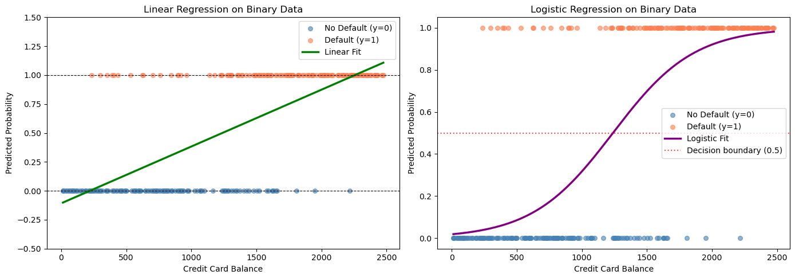

# 로지스틱 회귀와 선형회귀의 시각적 비교


## 개요

반응변수가 이항일 때 보통의 선형회귀를 적용하면 예측값이 $[0,1]$ 밖으로 나갈 수 있어 확률로
쓸 수 없다. 로지스틱 회귀는 선형예측자를 시그모이드 함수에 통과시켜 이 문제를 해결한다. 이
절에서는 모의로 만든 신용카드 연체 자료에서 두 접근을 대비하고, 왜 이항 분류에는 로지스틱
회귀가 적절한지 설명한다.

## 인공자료

신용카드 보유자 $n = 300$명을 모의로 생성한다. 연체 확률은 계좌 잔액에 따라 로지스틱 관계로
증가한다.

$$
P(\text{Default} = 1 \mid \text{Balance}) = \frac{1}{1 + \exp\!\bigl(-({\text{Balance}} - 1250)/300\bigr)}
$$

<div class="codebox" markdown>

**예제 1.** 자료 만들기

```python
import numpy as np
from sklearn.linear_model import LinearRegression, LogisticRegression

# 카드 잔액이 커질수록 연체 확률이 오르는 자료. 참 관계가 S 자 곡선이다.
np.random.seed(42)
n_samples = 300
balance = np.random.uniform(0, 2500, n_samples)

true_prob = 1 / (1 + np.exp(-(balance - 1250) / 300))
default = np.random.binomial(1, true_prob)

X = balance.reshape(-1, 1)
y = default
X_test = np.linspace(balance.min(), balance.max(), 300).reshape(-1, 1)
```

참 계수는 기울기 $1/300 = 0.003333$, 절편 $-1250/300 = -4.1667$이다.

</div>

## 이항 자료에 대한 선형회귀

선형회귀는 이항 결과를 연속변수로 취급하여

$$
\hat{y} = \hat\beta_0 + \hat\beta_1 \cdot \text{Balance}
$$

를 최소제곱으로 적합한다. 직선은 무한히 뻗어 나가므로, Balance가 충분히 크거나 작으면 예측값이
필연적으로 $[0,1]$ 밖으로 나간다.

<div class="codebox" markdown>

**예제 2.** 선형회귀로 맞추면

```python
# 0/1 반응에 선형회귀를 씌우면 예측값이 0 아래나 1 위로 나간다.
# 확률이라 부를 수 없는 값이 나오는 것이다.
linear_model = LinearRegression()
linear_model.fit(X, y)
y_pred_linear = linear_model.predict(X_test)

print(f"Linear predictions range: "
      f"[{y_pred_linear.min():.3f}, {y_pred_linear.max():.3f}]")
```

출력:

```
Linear predictions range: [-0.102, 1.107]
```

적합 결과는 $\hat{y} = -0.1079 + 0.000491 \cdot \text{Balance}$이고, 예측 범위는
$[-0.102,\ 1.107]$이다. 즉 관측된 잔액 범위 안에서도 예측값이 음수가 되거나 1을 넘는다.
$X_{\text{test}}$ 격자점의 **17.7%**가 $[0,1]$ 밖에 놓인다.

</div>

## 이항 자료에 대한 로지스틱 회귀

로지스틱 회귀는 시그모이드 함수를 통해 확률을 모형화한다.

$$
P(Y = 1 \mid x) = \frac{1}{1 + e^{-(\beta_0 + \beta_1 x)}}
$$

이렇게 하면 어떤 입력에 대해서도 $\hat{p} \in (0,1)$이 보장된다.

<div class="codebox" markdown>

**예제 3.** 로지스틱으로 맞추면

```python
# 로지스틱은 시그모이드를 거치므로 예측값이 언제나 (0, 1) 안에 머문다.
logistic_model = LogisticRegression(solver='lbfgs')
logistic_model.fit(X, y)
y_pred_logistic = logistic_model.predict_proba(X_test)[:, 1]

print(f"Logistic predictions range: "
      f"[{y_pred_logistic.min():.3f}, {y_pred_logistic.max():.3f}]")
```

출력:

```
Logistic predictions range: [0.019, 0.981]
```

적합 결과는 $\hat\beta_0 = -3.9790$, $\hat\beta_1 = 0.003212$로 참값
$(-4.1667,\ 0.003333)$에 가깝고, 예측 범위는 $[0.019,\ 0.981]$로 안전하게 $(0,1)$ 안에 있다.

</div>

!!! note "여기서는 기본 L2 벌점이 사실상 아무 일도 하지 않는다"
    scikit-learn의 기본값 `C=1.0`은 L2 벌점을 건다. 그런데 이 자료에서 벌점을 완전히 끄고
    (`penalty=None`) 적합해도 계수는 소수점 넷째 자리까지 똑같은 $(-3.9790,\ 0.003212)$가
    나온다. 기울기가 $0.003$ 수준으로 워낙 작아 벌점 $\frac{1}{2}\beta_1^2 \approx 5\times10^{-6}$
    이 로그가능도에 비해 무시할 만하기 때문이다. 설명변수를 표준화했다면 계수가 커져 벌점의
    영향도 뚜렷해진다.

## 나란히 시각화하기

<div class="codebox" markdown>

**예제 4.** 두 결과를 나란히 그리기

```python
import matplotlib.pyplot as plt

fig, axes = plt.subplots(1, 2, figsize=(14, 5))

# 왼쪽: 선형회귀. 직선이 0 과 1 을 그은 점선을 넘어가는 것을 본다.
axes[0].scatter(X[y == 0], y[y == 0], alpha=0.6, s=30,
                color='steelblue', label='No Default (y=0)')
axes[0].scatter(X[y == 1], y[y == 1], alpha=0.6, s=30,
                color='coral', label='Default (y=1)')
axes[0].plot(X_test, y_pred_linear, 'g-', linewidth=2.5,
             label='Linear Fit')
axes[0].axhline(y=0, color='black', linestyle='--', linewidth=0.8)
axes[0].axhline(y=1, color='black', linestyle='--', linewidth=0.8)
axes[0].set_xlabel('Credit Card Balance')
axes[0].set_ylabel('Predicted Probability')
axes[0].set_title('Linear Regression on Binary Data')
axes[0].legend(); axes[0].set_ylim(-0.5, 1.5)

# 오른쪽: 로지스틱. 곡선이 0 과 1 사이에 갇혀 있고, 자료가 만들어진
# 참 관계와도 모양이 맞는다.
axes[1].scatter(X[y == 0], y[y == 0], alpha=0.6, s=30,
                color='steelblue', label='No Default (y=0)')
axes[1].scatter(X[y == 1], y[y == 1], alpha=0.6, s=30,
                color='coral', label='Default (y=1)')
axes[1].plot(X_test, y_pred_logistic, 'purple', linewidth=2.5,
             label='Logistic Fit')
axes[1].axhline(y=0.5, color='red', linestyle=':', linewidth=1.5,
                alpha=0.7, label='Decision boundary (0.5)')
axes[1].set_xlabel('Credit Card Balance')
axes[1].set_ylabel('Predicted Probability')
axes[1].set_title('Logistic Regression on Binary Data')
axes[1].legend(); axes[1].set_ylim(-0.05, 1.05)

plt.tight_layout()
plt.show()
```



</div>

## 오즈비 해석

로지스틱 모형은 오즈비를 통해 해석 가능한 요약을 준다. Balance가 한 단위 늘면 연체 오즈에
$e^{\hat\beta_1}$이 곱해진다.

$$
\text{Odds Ratio} = e^{\hat\beta_1}
$$

<div class="codebox" markdown>

**예제 5.** 오즈비로 읽기

```python
# 계수가 아주 작으므로 1 달러당 오즈비는 1 에 가깝다. 이럴 때는 단위를
# 바꿔 100 달러당으로 읽는 편이 뜻이 잘 통한다.
odds_ratio = np.exp(logistic_model.coef_[0][0])
print(f"Odds ratio per $1 increase: {odds_ratio:.4f}")
print(f"Percentage increase in odds per $100: "
      f"{(np.exp(100 * logistic_model.coef_[0][0]) - 1) * 100:.2f}%")
```

출력:

```
Odds ratio per $1 increase: 1.0032
Percentage increase in odds per $100: 37.88%
```

\$1당 오즈비는 $1.0032$로 거의 1에 가까워 실감이 나지 않는다. \$100 단위로 보면 오즈가
$37.88\%$ 증가한다. **오즈비는 설명변수의 단위에 의존하므로, 의미 있는 크기의 단위로 바꾸어
보고해야 한다.**

선형회귀에는 이에 대응하는 확률적 해석이 없다. 기울기는 $x$ 한 단위 증가당 $\hat{y}$의
변화량을 주지만, $\hat{y}$가 확률이라는 보장이 없다.

</div>

## 해석

두 접근의 핵심 차이는 다음과 같다.

| 성질 | 선형회귀 | 로지스틱 회귀 |
|---|---|---|
| 예측 범위 | $(-\infty, +\infty)$ | $(0, 1)$ |
| 연결함수 | 항등 | 시그모이드 |
| 손실함수 | 제곱오차 | 교차엔트로피 |
| 계수의 의미 | $\hat{y}$의 변화 | 로그오즈의 변화 |
| 확률로 유효한가 | 아니다 | 그렇다 |

선형회귀는 확률이 $[0,1]$에 있어야 한다는 기본 요건을 위배하므로 이항 결과에 부적절하다.
로지스틱 회귀의 시그모이드 곡선은 이 제약을 지키면서 오즈비를 통한 자연스러운 확률적 해석을
제공한다.

!!! note "선형확률모형이 아주 무용한 것은 아니다"
    공정하게 말하면, 계량경제학에서 널리 쓰이는 **선형확률모형(LPM)**이 바로 이항 자료에 대한
    최소제곱이다. 예측이 목적이 아니라 **평균 한계효과**를 추정하는 것이 목적이고 $\hat p$가
    대체로 $0.2$--$0.8$ 범위에 머문다면, LPM의 계수는 해석하기 쉽고 로지스틱 모형의 평균
    한계효과와 비슷한 값을 준다. 문제는 (a) 확률이 범위를 벗어나는 것과 (b) 오차의 이분산성
    이며, 후자는 로버스트 표준오차로 처리한다. 이 절의 자료처럼 $\hat p$가 0과 1 전체를 훑는
    경우에는 로지스틱 회귀가 분명히 낫다.

## 연습문제

<div class="drillbox" markdown>

**연습문제 1.** <span class="diff med" title="중간"></span>
로지스틱 모형 $\log\frac{p}{1-p} = \beta_0 + \beta_1 x$에서 $x = -\beta_0/\beta_1$일 때
예측확률이 정확히 0.5임을 보여라.

</div>

??? success "풀이"

    $x = -\beta_0/\beta_1$에서

    $$
    \log\frac{p}{1-p} = \beta_0 + \beta_1\Bigl(-\frac{\beta_0}{\beta_1}\Bigr) = \beta_0 - \beta_0 = 0
    $$

    이므로 $p/(1-p) = e^0 = 1$이고 따라서 $p = 0.5$다. 이 지점이 **결정경계**, 즉 모형이 두
    범주를 같은 확률로 예측하는 $x$ 값이다.

    위 자료에 대입하면 $-(-3.9790)/0.003212 = 1238.8$로, 참값 $1250$에 가깝다. 그림의 오른쪽
    패널에서 시그모이드 곡선이 빨간 점선 $0.5$와 만나는 지점이 바로 여기다. $\square$

<div class="drillbox" markdown>

**연습문제 2.** <span class="diff med" title="중간"></span>
이항 자료에 적합한 선형회귀가 어떤 관측치에 대해 $\hat{y} = -0.1$을 내놓았다. 왜 문제인지
설명하고 두 가지 해결책을 제시하라.

</div>

??? success "풀이"

    예측값 $\hat{y} = -0.1$은 음수 확률이므로 정의되지 않는다. 확률의 공리를 위배한다.

    두 가지 대응이 있다.

    1. **로지스틱 회귀를 쓴다.** 시그모이드가 임의의 실수 선형예측자를 $(0,1)$로 옮기므로
       확률이 항상 유효하다.

    2. **예측값을 잘라 낸다.** 선형회귀를 적합한 뒤 $[0,1]$로 절단한다.
       $\hat{p} = \max(0, \min(1, \hat{y}))$. 다만 이는 임시방편이며 근본적인 모형 오지정을
       해결하지 못한다. 로지스틱 회귀가 훨씬 낫다.

    절단이 왜 임시방편에 그치는지는 손실함수를 보면 분명하다. 최소제곱은 절단을 고려하지 않고
    계수를 추정하므로, 범위를 벗어난 관측치들이 **적합 전체를 끌어당긴 뒤에** 절단된다. 즉
    절단은 증상만 가릴 뿐 추정의 왜곡은 그대로 남는다. $\square$

<div class="drillbox" markdown>

**연습문제 3.** <span class="diff med" title="중간"></span>
$\log\frac{p}{1-p} = z$를 $p$에 대해 풀어 시그모이드 함수를 유도하라.

</div>

??? success "풀이"

    $\log\frac{p}{1-p} = z$에서 출발하면,

    $$
    \frac{p}{1-p} = e^z
    $$

    $$
    p = e^z(1 - p) = e^z - p\,e^z
    $$

    $$
    p + p\,e^z = e^z
    $$

    $$
    p(1 + e^z) = e^z
    $$

    $$
    p = \frac{e^z}{1 + e^z} = \frac{1}{1 + e^{-z}} = \sigma(z)
    $$

    마지막 단계는 분자와 분모를 $e^z$로 나누어 얻는 항등식
    $\frac{e^z}{1+e^z} = \frac{1}{1+e^{-z}}$을 쓴 것이다. $\square$

<div class="drillbox" markdown>

**연습문제 4.** <span class="diff med" title="중간"></span>
이항 자료에 대한 선형회귀가 $\hat{y} = 0.2 + 0.0003 \cdot \text{Balance}$를 주었다.
어느 Balance에서 예측값이 1을 넘는가? 어느 Balance에서 음수가 되는가?

</div>

??? success "풀이"

    $\hat{y} = 1$로 놓으면

    $$
    0.2 + 0.0003 \cdot \text{Balance} = 1
    \implies \text{Balance} = \frac{0.8}{0.0003} \approx 2667
    $$

    $\hat{y} = 0$으로 놓으면

    $$
    0.2 + 0.0003 \cdot \text{Balance} = 0
    \implies \text{Balance} = \frac{-0.2}{0.0003} \approx -667
    $$

    잔액은 음수가 될 수 없으므로 음수 예측은 비현실적인 입력에서만 나온다. 그러나 예측값이 1을
    넘는 지점은 Balance $\approx$ \$2667로 충분히 있을 법한 값이며, 선형회귀가 **현실적인 입력
    범위 안에서도** 유효하지 않은 확률을 만들어 냄을 보여준다.

    본문의 실제 적합에서는 상황이 더 나쁘다. $\hat{y} = -0.1079 + 0.000491 \cdot \text{Balance}$
    이므로 Balance $< 220$에서 음수가 되고 Balance $> 2256$에서 1을 넘는다. 자료의 관측 범위가
    $[0, 2500]$이므로 격자점의 $17.7\%$가 유효하지 않은 확률을 받는다. $\square$

<div class="drillbox" markdown>

**연습문제 5.** <span class="diff hard" title="어려움"></span>
로지스틱 회귀의 교차엔트로피 손실이 모수 $\boldsymbol\beta$에 대해 볼록임을 증명하라.

</div>

??? success "풀이"

    관측치 하나에 대한 음의 로그가능도(교차엔트로피)는

    $$
    L_i(\boldsymbol\beta) = -y_i \log \sigma(\mathbf{x}_i^T\boldsymbol\beta) - (1-y_i)\log\bigl(1-\sigma(\mathbf{x}_i^T\boldsymbol\beta)\bigr)
    $$

    이다. $\sigma(z) = 1/(1+e^{-z})$와 $1-\sigma(z) = \sigma(-z)$를 쓰면

    $$
    L_i(\boldsymbol\beta) = -y_i\,\mathbf{x}_i^T\boldsymbol\beta + \log\bigl(1 + e^{\mathbf{x}_i^T\boldsymbol\beta}\bigr)
    $$

    로 정리된다. 첫 항은 $\boldsymbol\beta$에 대해 일차이므로 볼록이다. 둘째 항은
    $z = \mathbf{x}_i^T\boldsymbol\beta$에서 평가한 $\log(1+e^z)$인데, 모든 $z$에 대해
    $\frac{d^2}{dz^2}\log(1+e^z) = \sigma(z)(1-\sigma(z)) > 0$이므로 $\log(1+e^z)$는 볼록이다.
    볼록함수와 일차사상의 합성은 볼록이다. 합
    $L(\boldsymbol\beta) = \sum_i L_i$는 볼록함수들의 합이므로 볼록이다. $\square$

    !!! note "볼록이지만 강볼록은 아니다"
        $\sigma(z)(1-\sigma(z)) > 0$이 모든 $z$에서 성립하므로 일변량 함수 $\log(1+e^z)$는
        강볼록이다. 그러나 $\boldsymbol\beta$의 함수로서 $L$의 헤세행렬은
        $\sum_i \sigma_i(1-\sigma_i)\mathbf{x}_i\mathbf{x}_i^T$이므로, $\{\mathbf{x}_i\}$가
        $\mathbb{R}^p$를 생성하지 못하면(예: $p > n$) 양반정치일 뿐이다. 게다가
        $\|\boldsymbol\beta\| \to \infty$이면 $\sigma_i(1-\sigma_i) \to 0$이라 곡률이 사라진다.
        이것이 완전 분리에서 MLE가 존재하지 않는 이유이자, 정칙화가 필요한 이유다.

---

## 정리하며

그림 하나가 **왜 선형회귀를 쓰면 안 되는지** 보여 준다.

- **선형 적합은 $[0,1]$ 을 벗어난다.** 확률로 읽을 수 없는 예측값이 나오며, $x$ 가 극단이면 음수나 1 초과가 된다.
- **시그모이드는 자연스럽게 갇힌다.** 양 끝에서 $0$ 과 $1$ 에 점근하며 가운데에서 가장 가파르다.
- **기울기가 일정하지 않다.** 로지스틱에서 $x$ 한 단위의 효과가 $p$ 에 따라 달라지며, $p=0.5$ 근처에서 가장 크다. **"확률이 얼마씩 변한다"고 말할 수 없는 이유다.**
- **오차 구조도 다르다.** 이진 반응의 분산이 $p(1-p)$ 라 $p$ 에 의존하므로 등분산 가정이 성립할 수 없다.
- **그림이 오래 남는다.** 두 곡선을 겹쳐 그린 한 장이 여러 문단의 설명을 대신한다.

다음 절부터 **추정과 추론**으로 넘어간다.
