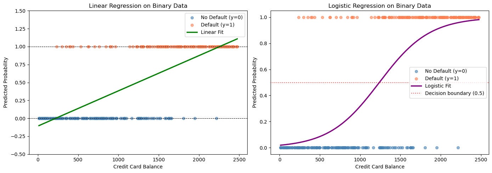

# 로지스틱 회귀와 선형회귀의 시각적 비교


## 개요

반응변수가 이항일 때 보통의 선형회귀를 적용하면 예측값이 $[0,1]$ 밖으로 나갈 수 있어 확률로
쓸 수 없다. 로지스틱 회귀는 선형예측자를 시그모이드 함수에 통과시켜 이 문제를 해결한다. 이
절에서는 모의로 만든 신용카드 연체 자료에서 두 접근을 대비하고, 왜 이항 분류에는 로지스틱
회귀가 적절한지 설명한다.

## 인공자료

신용카드 보유자 $n = 300$명을 모의로 생성한다. 연체 확률은 계좌 잔액에 따라 로지스틱 관계로
증가한다.

$$
P(\text{Default} = 1 \mid \text{Balance}) = \frac{1}{1 + \exp\!\bigl(-({\text{Balance}} - 1250)/300\bigr)}
$$

<div class="exbox" markdown>

**보기 1.** <span class="diff easy" title="쉬움"></span> 참 모형을 로지스틱의 꼴로 읽기. 잔액이 $\text{Balance} \sim \text{Uniform}(0, 2500)$이고 연체확률이 $P(Y = 1 \mid b) = \sigma\!\bigl((b - 1250)/300\bigr)$인 카드 보유자 $n = 300$명을 생성한다.

**(1)** 이 참 모형을 $\operatorname{logit} p = \beta_0 + \beta_1 b$의 꼴로 적을 때 $\beta_0$과 $\beta_1$을 구하시오. 또 잔액을 모른 채 한 명을 뽑았을 때의 **주변 연체확률** $P(Y = 1)$을 구하시오.

**(2)** 자료를 생성해 표본 연체율이 (1)의 값과 맞는지 확인하시오.

</div>

??? success "풀이"

    **(1) 해석적으로.** 시그모이드의 인수를 펼치면

    $$
    \frac{b - 1250}{300} = -\frac{1250}{300} + \frac{1}{300}\,b
    $$

    이므로

    $$
    \beta_0 = -\frac{1250}{300} = -4.16667,
    \qquad
    \beta_1 = \frac{1}{300} = 0.00333333
    $$

    이다. **참 관계가 로지스틱이므로 로지스틱 회귀는 올바르게 지정된 모형이다.** 뒤에서 선형회귀가 지는 데는 이 사정도 한몫한다.

    주변확률은 $\text{Balance}$를 적분해 없앤다. $z = (b - 1250)/300$으로 바꾸면 $b$가 $0$에서 $2500$까지 갈 때 $z$는 $-c$에서 $c$까지 가고 $c = 1250/300 = 25/6$이다. 적분 구간이 $0$에 대해 **대칭**이므로 $\sigma(z) + \sigma(-z) = 1$을 쓸 수 있다.

    $$
    \int_{-c}^{c} \sigma(z)\,dz
    = \int_0^{c} \bigl[\sigma(z) + \sigma(-z)\bigr]\,dz
    = \int_0^{c} 1\,dz = c
    $$

    균일분포의 밀도가 $1/(2c)$이므로

    $$
    P(Y = 1) = \frac{1}{2c}\int_{-c}^{c}\sigma(z)\,dz = \frac{c}{2c} = \frac{1}{2}
    $$

    이다. **근사가 아니라 등식으로 $0.5$다.** 변곡점 $1250$이 구간 $[0, 2500]$의 정확한 가운데에 놓여 시그모이드의 대칭성이 그대로 살아나기 때문이다.

    **(2) 수치적으로.**

    ```python
    import numpy as np
    from sklearn.linear_model import LinearRegression, LogisticRegression

    # 카드 잔액이 커질수록 연체 확률이 오르는 자료. 참 관계가 S 자 곡선이다.
    np.random.seed(42)
    n_samples = 300
    balance = np.random.uniform(0, 2500, n_samples)

    true_prob = 1 / (1 + np.exp(-(balance - 1250) / 300))
    default = np.random.binomial(1, true_prob)

    X = balance.reshape(-1, 1)
    y = default
    X_test = np.linspace(balance.min(), balance.max(), 300).reshape(-1, 1)

    print(f"참 계수   beta0 = {-1250 / 300:.5f},  beta1 = {1 / 300:.8f}")
    print(f"표본 연체율            = {y.mean():.4f}   (이론 0.5)")
    print(f"생성에 쓰인 참 확률의 평균 = {true_prob.mean():.4f}")
    print(f"연체율의 표준오차        = {np.sqrt(0.25 / n_samples):.4f}")
    ```

    출력:

    ```
    참 계수   beta0 = -4.16667,  beta1 = 0.00333333
    표본 연체율            = 0.5000   (이론 0.5)
    생성에 쓰인 참 확률의 평균 = 0.4959
    연체율의 표준오차        = 0.0289
    ```

    표본 연체율이 정확히 $150/300 = 0.5000$으로 나와 이론값과 소수 넷째 자리까지 같다. **다만 이것은 운이다.** 연체율의 표준오차가 $\sqrt{0.25/300} = 0.0289$이므로 $0.47$에서 $0.53$ 사이 아무 값이나 나올 수 있었다. 실제로 뽑힌 $300$개의 잔액 자체가 완벽히 균일하지는 않아 생성에 쓰인 참 확률의 평균은 $0.4959$로 $0.5$에서 조금 벗어나 있다. **유도한 $0.5$는 모집단의 성질이고, $0.5000$은 그 위에서 흔들린 한 번의 값이 우연히 맞아떨어진 것이다.**

## 이항 자료에 대한 선형회귀

선형회귀는 이항 결과를 연속변수로 취급하여

$$
\hat{y} = \hat\beta_0 + \hat\beta_1 \cdot \text{Balance}
$$

를 최소제곱으로 적합한다. 직선은 무한히 뻗어 나가므로, Balance가 충분히 크거나 작으면 예측값이
필연적으로 $[0,1]$ 밖으로 나간다.

<div class="exbox" markdown>

**보기 2.** <span class="diff easy" title="쉬움"></span> 선형회귀가 범위를 벗어나는 자리. 보기 1의 $0/1$ 반응에 최소제곱 직선을 적합한다. 적합 결과는 $\hat y = -0.107902 + 0.00049103\,b$다.

**(1)** $\hat y = 0$과 $\hat y = 1$이 되는 Balance를 구하고, 격자 `X_test`의 $300$개 점 가운데 **몇 개**가 $[0,1]$ 밖에 놓이는지 세어서 예측하시오.

**(2)** 코드로 확인하시오.

</div>

??? success "풀이"

    **(1) 해석적으로.** 단순선형회귀이므로 적합값은 직선 하나다. $\hat y = 0$으로 놓으면

    $$
    b = \frac{0.107902}{0.00049103} = 219.746
    $$

    이고 $\hat y = 1$로 놓으면

    $$
    b = \frac{1.107902}{0.00049103} = 2256.277
    $$

    이다. 그러므로 $b < 219.746$에서 예측값이 음수이고 $b > 2256.277$에서 $1$을 넘는다.

    격자는 `np.linspace(12.65396, 2475.13463, 300)`이라 간격이

    $$
    h = \frac{2475.13463 - 12.65396}{299} = 8.23572
    $$

    이고 $k$번째 점은 $b_k = 12.65396 + 8.23572\,k$다. 아래쪽을 세면

    $$
    b_k < 219.746
    \iff k < \frac{219.746 - 12.654}{8.23572} = 25.146
    \iff k = 0, 1, \dots, 25
    $$

    로 $26$개이고, 위쪽은

    $$
    b_k > 2256.277
    \iff k > \frac{2256.277 - 12.654}{8.23572} = 272.426
    \iff k = 273, \dots, 299
    $$

    로 $27$개다. 합해 **$53$개**, 곧 $53/300 = 17.67\%$다.

    예측 범위도 두 끝점에서 바로 나온다. $b = 12.654$에서 $\hat y = -0.1017$, $b = 2475.135$에서 $\hat y = 1.1075$다.

    **(2) 수치적으로.**

    ```python
    # 0/1 반응에 선형회귀를 씌우면 예측값이 0 아래나 1 위로 나간다.
    # 확률이라 부를 수 없는 값이 나오는 것이다.
    linear_model = LinearRegression()
    linear_model.fit(X, y)
    y_pred_linear = linear_model.predict(X_test)

    print(f"Linear predictions range: "
          f"[{y_pred_linear.min():.3f}, {y_pred_linear.max():.3f}]")

    b0, b1 = linear_model.intercept_, linear_model.coef_[0]
    print(f"적합        yhat = {b0:.6f} + {b1:.8f} * Balance")
    print(f"yhat = 0 인 Balance = {-b0 / b1:.3f}")
    print(f"yhat = 1 인 Balance = {(1 - b0) / b1:.3f}")

    grid = X_test.ravel()
    low = int(np.sum(grid < -b0 / b1))
    high = int(np.sum(grid > (1 - b0) / b1))
    print(f"격자 간격 h = {grid[1] - grid[0]:.5f}")
    print(f"[0,1] 밖 격자점: 아래 {low} + 위 {high} = {low + high}개"
          f"  ({100 * (low + high) / len(grid):.2f}%)")
    ```

    출력:

    ```
    Linear predictions range: [-0.102, 1.107]
    적합        yhat = -0.107902 + 0.00049103 * Balance
    yhat = 0 인 Balance = 219.746
    yhat = 1 인 Balance = 2256.277
    격자 간격 h = 8.23572
    [0,1] 밖 격자점: 아래 26 + 위 27 = 53개  (17.67%)
    ```

    **손으로 센 $26 + 27 = 53$과 코드가 센 $53$이 같다.** 예측 범위 $[-0.102,\ 1.107]$도 두 끝점을 식에 넣은 $-0.1017$, $1.1075$와 소수 셋째 자리까지 맞는다.

    여기서 요점은 $17.67\%$라는 숫자 자체가 아니다. **외삽이 아니라 관측된 잔액 범위 안에서 벌어진 일**이라는 점이다. 실제 자료 $300$개 가운데도 $55$개가 $[0,1]$ 밖의 예측값을 받는다. 확률이라 불러서는 안 되는 값이 전체의 $18\%$에 달한다.

## 이항 자료에 대한 로지스틱 회귀

로지스틱 회귀는 시그모이드 함수를 통해 확률을 모형화한다.

$$
P(Y = 1 \mid x) = \frac{1}{1 + e^{-(\beta_0 + \beta_1 x)}}
$$

이렇게 하면 어떤 입력에 대해서도 $\hat{p} \in (0,1)$이 보장된다.

<div class="exbox" markdown>

**보기 3.** <span class="diff easy" title="쉬움"></span> 로지스틱의 예측은 갇혀 있다. 같은 자료에 로지스틱 회귀를 적합하면 $\hat\beta_0 = -3.97898$, $\hat\beta_1 = 0.00321188$이 나온다.

**(1)** 격자의 두 끝 $b = 12.654$와 $b = 2475.135$에서 예측확률을 계산하고, 왜 어떤 $b$에서도 예측값이 $0$이나 $1$에 닿을 수 없는지 말하시오.

**(2)** scikit-learn의 `LogisticRegression`은 기본으로 L2 벌점(`C=1.0`)을 건다. 이 자료에서 벌점이 실제로 얼마나 일하는지 재어 보고, 교차엔트로피 손실이 내려갈 수 있는 **바닥**을 구하시오.

</div>

??? success "풀이"

    **(1) 해석적으로.** 선형예측자를 두 끝점에서 재면

    $$
    \hat\eta(12.654) = -3.97898 + 0.00321188 \times 12.654 = -3.93834
    $$

    $$
    \hat\eta(2475.135) = -3.97898 + 0.00321188 \times 2475.135 = 3.97085
    $$

    이고 시그모이드를 거치면

    $$
    \sigma(-3.93834) = \frac{1}{1 + e^{3.93834}} = 0.019108,
    \qquad
    \sigma(3.97085) = 0.981492
    $$

    로 예측 범위가 $[0.0191,\ 0.9815]$다.

    **$0$이나 $1$에 닿을 수 없는 까닭은 구조적이다.** $\sigma(\eta) = 1/(1+e^{-\eta})$에서 $e^{-\eta} > 0$이므로 모든 유한한 $\eta$에 대해 $0 < \sigma(\eta) < 1$이다. $\sigma$는 $\eta \to \pm\infty$에서만 끝에 점근하고, $b$가 유계인 구간 $[0, 2500]$에 있으면 $\hat\eta$도 유계이므로 예측확률은 열린구간 안에 **갇힌다.** 보기 2처럼 "범위를 벗어나는 구간을 찾는" 계산 자체가 성립하지 않는다.

    **(2) 벌점은 얼마나 일하는가.** scikit-learn이 최소화하는 목적함수는 절편을 뺀 계수에 대해

    $$
    \tfrac12\lVert \hat\beta_{1}\rVert^2 + C \sum_{i=1}^{n} \bigl[-\ell_i(\hat\beta)\bigr]
    $$

    이고 `C=1.0`이면 두 항의 무게가 같다. 그런데 이 자료에서

    $$
    \tfrac12 \hat\beta_1^2 = \tfrac12 (0.00321188)^2 = 5.16\times 10^{-6},
    \qquad
    \sum_i \bigl[-\ell_i\bigr] = 111.4884
    $$

    로 벌점이 자료항의 $4.6\times 10^{-8}$에 지나지 않는다. 기울기가 \$1당 효과라 수치가 워낙 작기 때문이다. **그래서 이 쪽에서만은 `C=1.0`으로 적합한 것을 "최대가능도"라 불러도 된다.** 벌점을 완전히 끄면 로그가능도가 $1.3\times 10^{-12}$ 올라갈 뿐이고 계수는 소수 여덟째 자리까지 같다.

    **그러나 일반적으로는 그렇지 않다.** 잔액을 표준화해 $z = (b - 1238.01)/734.62$를 쓰면 계수가 $734.62$배 커지고, 벌점이 곧바로 드러난다.

    **바닥은 $0$이 아니다.** [6장](../../ch06/mle/mle_bernoulli.md)에서 보았듯이 교차엔트로피 손실은 아무리 잘 맞춰도 $0$으로 내려가지 않는다. 여기에는 세 층의 기준이 있다.

    - 절편만 있는 모형은 $\hat p \equiv \bar y = 0.5$를 주므로 손실이 $n H(0.5) = 300\log 2 = 207.944$다.
    - 참 확률 $p_i$를 전부 안다 해도 손실의 **기댓값**은 $\sum_i H(p_i) = 108.126$ 아래로 내려갈 수 없다.
    - 적합 모형의 손실은 $111.488$이다.

    **(2) 수치적으로.**

    ```python
    # 로지스틱은 시그모이드를 거치므로 예측값이 언제나 (0, 1) 안에 머문다.
    logistic_model = LogisticRegression(solver='lbfgs')
    logistic_model.fit(X, y)
    y_pred_logistic = logistic_model.predict_proba(X_test)[:, 1]

    print(f"Logistic predictions range: "
          f"[{y_pred_logistic.min():.3f}, {y_pred_logistic.max():.3f}]")

    a0, a1 = logistic_model.intercept_[0], logistic_model.coef_[0][0]
    print(f"적합 계수  b0 = {a0:.5f},  b1 = {a1:.8f}   (참값 -4.16667, 0.00333333)")

    # 벌점이 얼마나 일하는가. 음의 로그가능도와 벌점의 크기를 나란히 본다.
    def nll(p):
        return -np.sum(y * np.log(p) + (1 - y) * np.log(1 - p))

    p_fit = logistic_model.predict_proba(X)[:, 1]
    no_pen = LogisticRegression(penalty=None).fit(X, y)
    print(f"벌점 0.5*b1^2 = {0.5 * a1**2:.3e}   자료항 NLL = {nll(p_fit):.4f}")
    print(f"penalty=None  b1 = {no_pen.coef_[0][0]:.8f}, "
          f"NLL = {nll(no_pen.predict_proba(X)[:, 1]):.10f}")

    # 같은 자료를 표준화하면 계수가 커져 벌점이 눈에 보인다.
    Z = ((balance - balance.mean()) / balance.std()).reshape(-1, 1)
    print(f"표준화  C=1.0        b1 = {LogisticRegression().fit(Z, y).coef_[0][0]:.6f}")
    print(f"표준화  penalty=None b1 = "
          f"{LogisticRegression(penalty=None).fit(Z, y).coef_[0][0]:.6f}")

    # 교차엔트로피의 세 층.
    ent_sum = -np.sum(true_prob * np.log(true_prob)
                      + (1 - true_prob) * np.log(1 - true_prob))
    print(f"절편만 (300 log2)     = {300 * np.log(2):.3f}")
    print(f"참 확률의 엔트로피 합    = {ent_sum:.3f}")
    print(f"참 확률을 그대로 쓴 손실  = {nll(true_prob):.3f}")
    print(f"적합 모형의 손실        = {nll(p_fit):.3f}")
    ```

    출력:

    ```
    Logistic predictions range: [0.019, 0.981]
    적합 계수  b0 = -3.97898,  b1 = 0.00321188   (참값 -4.16667, 0.00333333)
    벌점 0.5*b1^2 = 5.158e-06   자료항 NLL = 111.4884
    penalty=None  b1 = 0.00321188, NLL = 111.4883505231
    표준화  C=1.0        b1 = 2.230632
    표준화  penalty=None b1 = 2.359120
    절편만 (300 log2)     = 207.944
    참 확률의 엔트로피 합    = 108.126
    참 확률을 그대로 쓴 손실  = 111.574
    적합 모형의 손실        = 111.488
    ```

    유도한 $[0.0191,\ 0.9815]$가 코드의 $[0.019,\ 0.981]$과 맞고, 벌점의 크기 $5.16\times10^{-6}$도 맞는다. 표준화하면 계수가 $2.359120 \to 2.230632$로 **$5.4\%$ 줄어든다.** 같은 `C=1.0`인데 원래 단위에서는 소수 여덟째 자리까지 아무 일도 없었고 표준화 뒤에는 둘째 자리에서 차이가 난다. **벌점의 세기는 계수의 크기에 달려 있고, 계수의 크기는 설명변수의 단위에 달려 있다.** 표준화 없이 `C`를 고르는 일이 왜 위험한지가 이 두 줄에 들어 있다.

    바닥 쪽에서는 한 가지가 눈에 걸린다. 참 확률을 그대로 쓴 손실이 $111.574$인데 **적합 모형이 $111.488$로 그보다 낮다.** 참값을 이긴 것이 아니라 모수 두 개를 이 표본에 맞추었기 때문이다. 기댓값으로 본 바닥 $\sum_i H(p_i) = 108.126$은 어느 모형도 이길 수 없으며, 적합 모형이 $207.944$에서 $111.488$까지 내려온 것이 설명변수가 한 일 전부다.

!!! note "여기서는 기본 L2 벌점이 사실상 아무 일도 하지 않는다"
    scikit-learn의 기본값 `C=1.0`은 L2 벌점을 건다. 그런데 이 자료에서 벌점을 완전히 끄고
    (`penalty=None`) 적합해도 계수는 소수점 넷째 자리까지 똑같은 $(-3.9790,\ 0.003212)$가
    나온다. 기울기가 $0.003$ 수준으로 워낙 작아 벌점 $\frac{1}{2}\beta_1^2 \approx 5\times10^{-6}$
    이 로그가능도에 비해 무시할 만하기 때문이다. 설명변수를 표준화했다면 계수가 커져 벌점의
    영향도 뚜렷해진다.

## 나란히 시각화하기

<div class="exbox" markdown>

**보기 4.** <span class="diff easy" title="쉬움"></span> 두 적합을 나란히 그리기. 왼쪽에 선형 적합, 오른쪽에 로지스틱 적합을 같은 산점도 위에 얹는다.

**(1)** 왼쪽 칸에서 초록 직선이 점선 $0$과 $1$을 넘어가는 자리를 읽고, 오른쪽 칸의 보라색 곡선에는 왜 그런 일이 없는지 그림에서 확인하시오.

**(2)** 이 그림이 **가리는 것**은 무엇인가. 두 모형의 우열을 이 그림만으로 판정할 수 있는가.

</div>

??? success "풀이"

    유도할 답이 있는 문제가 아니다. **그림에서 무엇이 읽히고 무엇이 읽히지 않는가**가 이 보기의 전부다.

    **(2) 를 답하려면 수치가 하나 더 필요하다.** 아래 코드의 마지막 묶음이 그것을 찍는다.

    ```python
    import matplotlib.pyplot as plt

    plt.rcParams["font.family"] = "Apple SD Gothic Neo"
    plt.rcParams["axes.unicode_minus"] = False

    fig, axes = plt.subplots(1, 2, figsize=(14, 5))

    # 왼쪽: 선형회귀. 직선이 0 과 1 을 그은 점선을 넘어가는 것을 본다.
    axes[0].scatter(X[y == 0], y[y == 0], alpha=0.6, s=30,
                    color='steelblue', label='No Default (y=0)')
    axes[0].scatter(X[y == 1], y[y == 1], alpha=0.6, s=30,
                    color='coral', label='Default (y=1)')
    axes[0].plot(X_test, y_pred_linear, 'g-', linewidth=2.5,
                 label='Linear Fit')
    axes[0].axhline(y=0, color='black', linestyle='--', linewidth=0.8)
    axes[0].axhline(y=1, color='black', linestyle='--', linewidth=0.8)
    axes[0].set_xlabel('Credit Card Balance')
    axes[0].set_ylabel('Predicted Probability')
    axes[0].set_title('Linear Regression on Binary Data')
    axes[0].legend(); axes[0].set_ylim(-0.5, 1.5)

    # 오른쪽: 로지스틱. 곡선이 0 과 1 사이에 갇혀 있고, 자료가 만들어진
    # 참 관계와도 모양이 맞는다.
    axes[1].scatter(X[y == 0], y[y == 0], alpha=0.6, s=30,
                    color='steelblue', label='No Default (y=0)')
    axes[1].scatter(X[y == 1], y[y == 1], alpha=0.6, s=30,
                    color='coral', label='Default (y=1)')
    axes[1].plot(X_test, y_pred_logistic, 'purple', linewidth=2.5,
                 label='Logistic Fit')
    axes[1].axhline(y=0.5, color='red', linestyle=':', linewidth=1.5,
                    alpha=0.7, label='Decision boundary (0.5)')
    axes[1].set_xlabel('Credit Card Balance')
    axes[1].set_ylabel('Predicted Probability')
    axes[1].set_title('Logistic Regression on Binary Data')
    axes[1].legend(); axes[1].set_ylim(-0.05, 1.05)

    plt.tight_layout()
    plt.show()

    # 그림이 보여 주지 않는 것 — 0.5 문턱으로 자른 뒤의 분류 결과.
    cut_lin = (0.5 - linear_model.intercept_) / linear_model.coef_[0]
    cut_log = -logistic_model.intercept_[0] / logistic_model.coef_[0][0]
    print(f"0.5 를 지나는 Balance   선형 {cut_lin:.4f}   로지스틱 {cut_log:.4f}")
    print(f"잔액의 표본평균        {balance.mean():.4f}")

    pred_lin = (linear_model.predict(X) > 0.5).astype(int)
    pred_log = (logistic_model.predict_proba(X)[:, 1] > 0.5).astype(int)
    print(f"두 분류가 엇갈린 관측 수 = {(pred_lin != pred_log).sum()}")
    print(f"정확도   선형 {(pred_lin == y).mean():.4f}   "
          f"로지스틱 {(pred_log == y).mean():.4f}")

    p_lin = linear_model.predict(X)
    p_log = logistic_model.predict_proba(X)[:, 1]
    print(f"브라이어 점수  선형 {np.mean((p_lin - y) ** 2):.5f}   "
          f"로지스틱 {np.mean((p_log - y) ** 2):.5f}")
    print(f"선형 예측이 [0,1] 밖인 관측 수 = {int(((p_lin < 0) | (p_lin > 1)).sum())}")
    ```

    출력:

    ```
    0.5 를 지나는 Balance   선형 1238.0115   로지스틱 1238.8332
    잔액의 표본평균        1238.0115
    두 분류가 엇갈린 관측 수 = 0
    정확도   선형 0.8367   로지스틱 0.8367
    브라이어 점수  선형 0.11988   로지스틱 0.11446
    선형 예측이 [0,1] 밖인 관측 수 = 55
    ```

    

    **(1) 왼쪽 직선은 양 끝에서 점선을 넘는다.** 초록 직선이 아래쪽 점선 $y = 0$을 $b \approx 220$에서 끊고 들어오고, 위쪽 점선 $y = 1$을 $b \approx 2256$에서 뚫고 나간다. 보기 2에서 계산한 $219.746$과 $2256.277$이 그 자리다. 세로축이 $[-0.5,\ 1.5]$까지 열려 있어 점선 밖으로 나간 부분이 그대로 보인다.

    오른쪽에는 그런 자리가 없다. 보라색 곡선이 왼쪽 끝에서 $0.019$, 오른쪽 끝에서 $0.981$이고 **곡선의 양 끝이 축의 위아래 가장자리에 평평하게 눕는다.** 이것이 시그모이드의 점근이다. 결정경계 $0.5$를 그은 빨간 점선과는 $b = 1238.8$에서 만나며, 자료를 만든 참값 $1250$에서 $0.9\%$ 어긋나 있다.

    **(2) 이 그림이 가리는 것은 두 가지다.**

    첫째, **점의 밀도를 읽을 수 없다.** $300$개의 관측이 $y = 0$과 $y = 1$ 두 줄에 깔려 있는데, $\alpha = 0.6$으로 반투명하게 그렸어도 겹침이 심해 어느 구간에 몇 개가 모였는지 셀 수가 없다. 오른쪽 칸에서 파란 줄이 $b > 1500$에서 성겨지고 주황 줄이 $b < 700$에서 성겨지는 **경향**만 읽히고, 그것이 $20$개인지 $40$개인지는 알 길이 없다. $0/1$ 산점도는 언제나 이 한계를 안고 있으며, 구간별 관측비율을 점으로 찍어 곡선과 겹쳐 보는 것이 정직한 보완이다.

    둘째, 그리고 더 중요하게, **이 그림은 두 모형의 분류 성능을 전혀 말해 주지 않는다.** 왼쪽은 "틀려 보이고" 오른쪽은 "맞아 보이지만", $0.5$ 문턱으로 잘라 분류하면 **두 모형이 $300$개 관측을 하나도 다르지 않게 나눈다.** 정확도가 $0.8367$로 똑같다.

    까닭은 출력의 첫 두 줄에 있다. 선형회귀는 $(\bar x, \bar y)$를 반드시 지나는데 이 자료는 보기 1에서 보았듯 $\bar y = 0.5$이므로, $\hat y = 0.5$가 되는 자리가 **정확히 $\bar x = 1238.0115$**다. 로지스틱의 경계는 $1238.8332$이니 둘의 거리가 \$0.82에 지나지 않고, 그 사이에 떨어진 관측이 하나도 없다. **그림이 극적으로 보여 준 차이가 분류 결과에서는 통째로 사라진다.**

    차이는 분류가 아니라 **확률**에 있다. 브라이어 점수가 $0.11988$ 대 $0.11446$으로 로지스틱이 $4.5\%$ 낫고, 교차엔트로피는 아예 비교할 수조차 없다. 선형 적합이 관측 $300$개 중 $55$개에 $[0,1]$ 밖의 값을 주어 $\log \hat p$가 정의되지 않기 때문이다. **그러므로 이 그림은 "확률로 쓸 수 있는가"를 보이는 데는 성공하고 "어느 쪽이 더 잘 맞히는가"를 보이는 데는 실패한다.** 뒤의 물음은 다음 절들의 ROC·AUC가 맡는다.

## 오즈비 해석

로지스틱 모형은 오즈비를 통해 해석 가능한 요약을 준다. Balance가 한 단위 늘면 연체 오즈에
$e^{\hat\beta_1}$이 곱해진다.

$$
\text{Odds Ratio} = e^{\hat\beta_1}
$$

<div class="exbox" markdown>

**보기 5.** <span class="diff easy" title="쉬움"></span> 오즈비는 하나인데 확률 변화는 하나가 아니다. 적합 계수는 $\hat\beta_1 = 0.00321188$이다.

**(1)** \$1당 오즈비와 \$100당 오즈비를 구하시오. 또 잔액이 \$100 늘 때 **연체확률**은 얼마나 변하는가 — 하나의 수로 답할 수 있는가?

**(2)** 확률 변화가 가장 큰 자리와 그 크기를 구하고, 코드로 확인하시오.

</div>

??? success "풀이"

    **(1) 해석적으로.** 로지스틱 모형에서

    $$
    \log\frac{p(b)}{1 - p(b)} = \hat\beta_0 + \hat\beta_1 b
    $$

    이므로 $b$를 $\Delta$만큼 늘리면 로그오즈가 $\hat\beta_1\Delta$만큼 **더해지고**, 오즈에는 $e^{\hat\beta_1\Delta}$가 **곱해진다.** 따라서

    $$
    \text{OR}(\$1) = e^{0.00321188} = 1.003217,
    \qquad
    \text{OR}(\$100) = e^{0.321188} = 1.37876
    $$

    로 \$100당 오즈가 $37.88\%$ 늘어난다. **이 값은 $b$가 어디든 똑같다.** 로그오즈가 $b$의 일차함수이기 때문이다.

    **확률의 변화는 하나의 수로 답할 수 없다.** 미분하면

    $$
    \frac{dp}{db} = \hat\beta_1\, p(b)\bigl(1 - p(b)\bigr)
    $$

    인데 오른쪽이 $p$에 의존한다. **오즈비는 상수이지만 확률의 기울기는 상수가 아니다.** 이것이 로지스틱 계수를 "확률이 얼마씩 는다"로 읽으면 안 되는 이유다.

    **(2) 해석적으로.** $p(1-p)$는 $p = 1/2$에서 최댓값 $1/4$을 가지므로 기울기의 최댓값은

    $$
    \max_b \frac{dp}{db} = \frac{\hat\beta_1}{4} = \frac{0.00321188}{4} = 0.00080297
    $$

    이다. **이것이 흔히 쓰는 "$\beta/4$ 규칙"이다.** \$100 단위로 바꾸면 최대 기울기가 $0.0803$, 곧 \$100당 최대 $8.03$ 퍼센트포인트다. 그 자리는 $p = 1/2$인 곳, 곧 $b = -\hat\beta_0/\hat\beta_1 = 1238.83$이다.

    다만 $\beta/4$는 **접선**의 기울기라 폭이 \$100인 구간의 실제 변화보다 조금 크다. 시그모이드가 그 구간에서 오목하게 꺾이기 때문이다. 정확한 값은

    $$
    \sigma(0 + 0.321188) - \sigma(0) = 0.57962 - 0.5 = 0.07962
    $$

    로 $0.0803$보다 작다.

    **(2) 수치적으로.**

    ```python
    # 계수가 아주 작으므로 1 달러당 오즈비는 1 에 가깝다. 이럴 때는 단위를
    # 바꿔 100 달러당으로 읽는 편이 뜻이 잘 통한다.
    odds_ratio = np.exp(logistic_model.coef_[0][0])
    print(f"Odds ratio per $1 increase: {odds_ratio:.4f}")
    print(f"Percentage increase in odds per $100: "
          f"{(np.exp(100 * logistic_model.coef_[0][0]) - 1) * 100:.2f}%")

    b0_hat = logistic_model.intercept_[0]
    b1_hat = logistic_model.coef_[0][0]
    sigmoid = lambda z: 1 / (1 + np.exp(-z))

    print(f"\n최대 기울기 beta/4 = {b1_hat / 4:.8f} (/$1)"
          f"  ->  {100 * b1_hat / 4:.4f} (/$100)")
    print("\nBalance    p(b)    오즈비($100)   확률 변화(+$100)")
    for b in [400, 900, 1238.83, 1600, 2100]:
        p_here = sigmoid(b0_hat + b1_hat * b)
        p_next = sigmoid(b0_hat + b1_hat * (b + 100))
        odds_here = p_here / (1 - p_here)
        odds_next = p_next / (1 - p_next)
        print(f"{b:8.1f}  {p_here:.4f}      {odds_next / odds_here:.5f}"
              f"         {p_next - p_here:.4f}")
    ```

    출력:

    ```
    Odds ratio per $1 increase: 1.0032
    Percentage increase in odds per $100: 37.88%

    최대 기울기 beta/4 = 0.00080297 (/$1)  ->  0.0803 (/$100)

    Balance    p(b)    오즈비($100)   확률 변화(+$100)
       400.0  0.0633      1.37876         0.0219
       900.0  0.2519      1.37876         0.0652
      1238.8  0.5000      1.37876         0.0796
      1600.0  0.7613      1.37876         0.0534
      2100.0  0.9408      1.37876         0.0156
    ```

    표의 셋째 칸이 다섯 줄 모두 **$1.37876$으로 똑같다.** 유도한 $e^{100\hat\beta_1}$이 $b$에 의존하지 않는다는 것이 그대로 확인된다. 반면 넷째 칸은 $0.0156$에서 $0.0796$까지 **다섯 배 넘게** 흔들린다. $p = 0.5$ 근처에서 가장 크고 양 끝으로 갈수록 작아지는 모양이 시그모이드의 S자 그 자체다.

    $p = 0.5$ 자리의 $0.0796$이 $\beta/4$가 준 상한 $0.0803$보다 $0.9\%$ 작다. 접선과 할선의 차이이며, $\beta/4$를 **상한**이라 부르는 이유가 여기 있다.

    \$1당 오즈비 $1.0032$는 거의 $1$이라 실감이 나지 않는다. **오즈비는 설명변수의 단위에 의존하므로, 의미 있는 크기의 단위로 바꾸어 보고해야 한다.**

선형회귀에는 이에 대응하는 확률적 해석이 없다. 기울기는 $x$ 한 단위 증가당 $\hat{y}$의
변화량을 주지만, $\hat{y}$가 확률이라는 보장이 없다.

## 해석

두 접근의 핵심 차이는 다음과 같다.

| 성질 | 선형회귀 | 로지스틱 회귀 |
|---|---|---|
| 예측 범위 | $(-\infty, +\infty)$ | $(0, 1)$ |
| 연결함수 | 항등 | 시그모이드 |
| 손실함수 | 제곱오차 | 교차엔트로피 |
| 계수의 의미 | $\hat{y}$의 변화 | 로그오즈의 변화 |
| 확률로 유효한가 | 아니다 | 그렇다 |

선형회귀는 확률이 $[0,1]$에 있어야 한다는 기본 요건을 위배하므로 이항 결과에 부적절하다.
로지스틱 회귀의 시그모이드 곡선은 이 제약을 지키면서 오즈비를 통한 자연스러운 확률적 해석을
제공한다.

!!! note "선형확률모형이 아주 무용한 것은 아니다"
    공정하게 말하면, 계량경제학에서 널리 쓰이는 **선형확률모형(LPM)**이 바로 이항 자료에 대한
    최소제곱이다. 예측이 목적이 아니라 **평균 한계효과**를 추정하는 것이 목적이고 $\hat p$가
    대체로 $0.2$--$0.8$ 범위에 머문다면, LPM의 계수는 해석하기 쉽고 로지스틱 모형의 평균
    한계효과와 비슷한 값을 준다. 문제는 (a) 확률이 범위를 벗어나는 것과 (b) 오차의 이분산성
    이며, 후자는 로버스트 표준오차로 처리한다. 이 절의 자료처럼 $\hat p$가 0과 1 전체를 훑는
    경우에는 로지스틱 회귀가 분명히 낫다.

## 연습문제

<div class="drillbox" markdown>

**연습문제 1.** <span class="diff med" title="중간"></span>
로지스틱 모형 $\log\frac{p}{1-p} = \beta_0 + \beta_1 x$에서 $x = -\beta_0/\beta_1$일 때
예측확률이 정확히 0.5임을 보여라.

</div>

??? success "풀이"

    $x = -\beta_0/\beta_1$에서

    $$
    \log\frac{p}{1-p} = \beta_0 + \beta_1\Bigl(-\frac{\beta_0}{\beta_1}\Bigr) = \beta_0 - \beta_0 = 0
    $$

    이므로 $p/(1-p) = e^0 = 1$이고 따라서 $p = 0.5$다. 이 지점이 **결정경계**, 즉 모형이 두
    범주를 같은 확률로 예측하는 $x$ 값이다.

    위 자료에 대입하면 $-(-3.9790)/0.003212 = 1238.8$로, 참값 $1250$에 가깝다. 그림의 오른쪽
    패널에서 시그모이드 곡선이 빨간 점선 $0.5$와 만나는 지점이 바로 여기다. $\square$

<div class="drillbox" markdown>

**연습문제 2.** <span class="diff med" title="중간"></span>
이항 자료에 적합한 선형회귀가 어떤 관측치에 대해 $\hat{y} = -0.1$을 내놓았다. 왜 문제인지
설명하고 두 가지 해결책을 제시하라.

</div>

??? success "풀이"

    예측값 $\hat{y} = -0.1$은 음수 확률이므로 정의되지 않는다. 확률의 공리를 위배한다.

    두 가지 대응이 있다.

    1. **로지스틱 회귀를 쓴다.** 시그모이드가 임의의 실수 선형예측자를 $(0,1)$로 옮기므로
       확률이 항상 유효하다.

    2. **예측값을 잘라 낸다.** 선형회귀를 적합한 뒤 $[0,1]$로 절단한다.
       $\hat{p} = \max(0, \min(1, \hat{y}))$. 다만 이는 임시방편이며 근본적인 모형 오지정을
       해결하지 못한다. 로지스틱 회귀가 훨씬 낫다.

    절단이 왜 임시방편에 그치는지는 손실함수를 보면 분명하다. 최소제곱은 절단을 고려하지 않고
    계수를 추정하므로, 범위를 벗어난 관측치들이 **적합 전체를 끌어당긴 뒤에** 절단된다. 즉
    절단은 증상만 가릴 뿐 추정의 왜곡은 그대로 남는다. $\square$

<div class="drillbox" markdown>

**연습문제 3.** <span class="diff med" title="중간"></span>
$\log\frac{p}{1-p} = z$를 $p$에 대해 풀어 시그모이드 함수를 유도하라.

</div>

??? success "풀이"

    $\log\frac{p}{1-p} = z$에서 출발하면,

    $$
    \frac{p}{1-p} = e^z
    $$

    $$
    p = e^z(1 - p) = e^z - p\,e^z
    $$

    $$
    p + p\,e^z = e^z
    $$

    $$
    p(1 + e^z) = e^z
    $$

    $$
    p = \frac{e^z}{1 + e^z} = \frac{1}{1 + e^{-z}} = \sigma(z)
    $$

    마지막 단계는 분자와 분모를 $e^z$로 나누어 얻는 항등식
    $\frac{e^z}{1+e^z} = \frac{1}{1+e^{-z}}$을 쓴 것이다. $\square$

<div class="drillbox" markdown>

**연습문제 4.** <span class="diff med" title="중간"></span>
이항 자료에 대한 선형회귀가 $\hat{y} = 0.2 + 0.0003 \cdot \text{Balance}$를 주었다.
어느 Balance에서 예측값이 1을 넘는가? 어느 Balance에서 음수가 되는가?

</div>

??? success "풀이"

    $\hat{y} = 1$로 놓으면

    $$
    0.2 + 0.0003 \cdot \text{Balance} = 1
    \implies \text{Balance} = \frac{0.8}{0.0003} \approx 2667
    $$

    $\hat{y} = 0$으로 놓으면

    $$
    0.2 + 0.0003 \cdot \text{Balance} = 0
    \implies \text{Balance} = \frac{-0.2}{0.0003} \approx -667
    $$

    잔액은 음수가 될 수 없으므로 음수 예측은 비현실적인 입력에서만 나온다. 그러나 예측값이 1을
    넘는 지점은 Balance $\approx$ \$2667로 충분히 있을 법한 값이며, 선형회귀가 **현실적인 입력
    범위 안에서도** 유효하지 않은 확률을 만들어 냄을 보여준다.

    본문의 실제 적합에서는 상황이 더 나쁘다. $\hat{y} = -0.1079 + 0.000491 \cdot \text{Balance}$
    이므로 Balance $< 220$에서 음수가 되고 Balance $> 2256$에서 1을 넘는다. 자료의 관측 범위가
    $[0, 2500]$이므로 격자점의 $17.7\%$가 유효하지 않은 확률을 받는다. $\square$

<div class="drillbox" markdown>

**연습문제 5.** <span class="diff hard" title="어려움"></span>
로지스틱 회귀의 교차엔트로피 손실이 모수 $\boldsymbol\beta$에 대해 볼록임을 증명하라.

</div>

??? success "풀이"

    관측치 하나에 대한 음의 로그가능도(교차엔트로피)는

    $$
    L_i(\boldsymbol\beta) = -y_i \log \sigma(\mathbf{x}_i^\top\boldsymbol\beta) - (1-y_i)\log\bigl(1-\sigma(\mathbf{x}_i^\top\boldsymbol\beta)\bigr)
    $$

    이다. $\sigma(z) = 1/(1+e^{-z})$와 $1-\sigma(z) = \sigma(-z)$를 쓰면

    $$
    L_i(\boldsymbol\beta) = -y_i\,\mathbf{x}_i^\top\boldsymbol\beta + \log\bigl(1 + e^{\mathbf{x}_i^\top\boldsymbol\beta}\bigr)
    $$

    로 정리된다. 첫 항은 $\boldsymbol\beta$에 대해 일차이므로 볼록이다. 둘째 항은
    $z = \mathbf{x}_i^\top\boldsymbol\beta$에서 평가한 $\log(1+e^z)$인데, 모든 $z$에 대해
    $\frac{d^2}{dz^2}\log(1+e^z) = \sigma(z)(1-\sigma(z)) > 0$이므로 $\log(1+e^z)$는 볼록이다.
    볼록함수와 일차사상의 합성은 볼록이다. 합
    $L(\boldsymbol\beta) = \sum_i L_i$는 볼록함수들의 합이므로 볼록이다. $\square$

    !!! note "볼록이지만 강볼록은 아니다"
        $\sigma(z)(1-\sigma(z)) > 0$이 모든 $z$에서 성립하므로 일변량 함수 $\log(1+e^z)$는
        강볼록이다. 그러나 $\boldsymbol\beta$의 함수로서 $L$의 헤세행렬은
        $\sum_i \sigma_i(1-\sigma_i)\mathbf{x}_i\mathbf{x}_i^\top$이므로, $\{\mathbf{x}_i\}$가
        $\mathbb{R}^p$를 생성하지 못하면(예: $p > n$) 양반정치일 뿐이다. 게다가
        $\|\boldsymbol\beta\| \to \infty$이면 $\sigma_i(1-\sigma_i) \to 0$이라 곡률이 사라진다.
        이것이 완전 분리에서 MLE가 존재하지 않는 이유이자, 정칙화가 필요한 이유다.

---

## 정리하며

그림 하나가 **왜 선형회귀를 쓰면 안 되는지** 보여 준다.

- **선형 적합은 $[0,1]$ 을 벗어난다.** 확률로 읽을 수 없는 예측값이 나오며, $x$ 가 극단이면 음수나 1 초과가 된다.
- **시그모이드는 자연스럽게 갇힌다.** 양 끝에서 $0$ 과 $1$ 에 점근하며 가운데에서 가장 가파르다.
- **기울기가 일정하지 않다.** 로지스틱에서 $x$ 한 단위의 효과가 $p$ 에 따라 달라지며, $p=0.5$ 근처에서 가장 크다. **"확률이 얼마씩 변한다"고 말할 수 없는 이유다.**
- **오차 구조도 다르다.** 이진 반응의 분산이 $p(1-p)$ 라 $p$ 에 의존하므로 등분산 가정이 성립할 수 없다.
- **그림이 오래 남는다.** 두 곡선을 겹쳐 그린 한 장이 여러 문단의 설명을 대신한다.

다음 절부터 **추정과 추론**으로 넘어간다.
