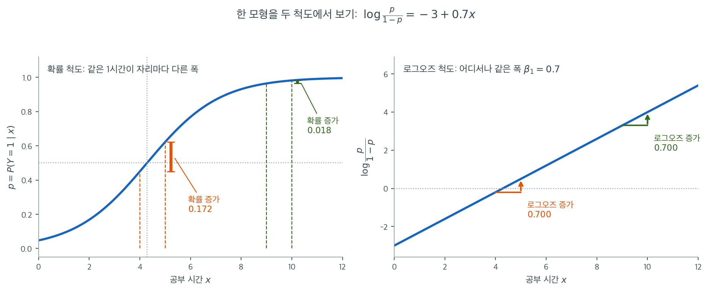

# 로짓 연결과 오즈


## 1. 선형모형에서 분류로

선형회귀에서 반응변수 $y$는 연속형이다. 반응변수가 0 또는 1의 값을 갖는 이항변수일 때는
$\mathbb{R}$을 구간 $(0,1)$로 옮기는 모형이 필요하다. 로지스틱 회귀는 선형예측자를
**시그모이드(로지스틱) 함수**에 통과시켜 이를 달성한다.

---

## 2. 시그모이드 함수

$$
\sigma(z) = \frac{1}{1+e^{-z}}
$$

시그모이드는 모든 실수를 $(0,1)$로 옮기므로 조건부확률 $P(Y=1 \mid \mathbf{x})$의 모형으로
타당하다.

### 시그모이드의 도함수

도함수는 놀랄 만큼 깔끔한 형태를 가지며, 로지스틱 회귀 전반의 기울기 계산을 단순하게 만든다.

$$
\sigma'(z) = \frac{e^{-z}}{(1+e^{-z})^2} = \sigma(z)\bigl(1-\sigma(z)\bigr)
$$

??? note "유도"
    $\sigma = (1+e^{-z})^{-1}$로 두고 연쇄법칙을 적용하면

    $$
    \sigma' = -\,(1+e^{-z})^{-2}\cdot(-e^{-z})
            = \frac{e^{-z}}{(1+e^{-z})^2}
    $$

    이고, $\frac{1}{1+e^{-z}} \cdot \frac{e^{-z}}{1+e^{-z}} = \sigma(1-\sigma)$로 인수분해된다.

---

## 3. 로짓(로그오즈) 연결

확률 $p$의 **로짓**을 다음과 같이 정의한다.

$$
\operatorname{logit}(p) = \log\frac{p}{1-p}
$$

비 $p/(1-p)$는 사건의 **오즈**이고, 로짓은 **로그오즈**다. 로지스틱 회귀는 로그오즈에서
선형관계를 가정한다.

$$
\operatorname{logit}\bigl(P(Y=1\mid\mathbf{x})\bigr) = \mathbf{x}^\top\boldsymbol{\theta}
$$

동등하게, 특성벡터가 $A[i,:]$(절편을 위한 선행 1을 포함한 계획행렬의 행)인 $i$번째 관측치에
대해

$$
z^{(i)} = A[i,:]\,\boldsymbol{\theta},
\qquad
\sigma^{(i)} = \sigma\!\bigl(z^{(i)}\bigr)
$$

이다.

---

## 4. 선형성은 로그오즈 척도에 산다

"로지스틱 회귀는 선형모형이다"라는 말은 확률을 보고 있으면 도저히 납득이 되지 않는다. 확률
그림에는 직선이 하나도 없기 때문이다. 아래 그림은 같은 모형
$\log\frac{p}{1-p} = -3 + 0.7x$를 두 척도에서 나란히 그린 것이다. 왼쪽이 확률 척도, 오른쪽이
로그오즈 척도이며, 두 그림의 자료와 계수는 완전히 같다.



왼쪽에서 공부 시간을 4시간에서 5시간으로 한 시간 늘리면 합격 확률이 $0.450$에서 $0.623$으로
$0.172$ 올라간다. 그런데 똑같은 한 시간을 9시간에서 10시간으로 옮기면 확률은 $0.964$에서
$0.982$로 $0.018$밖에 오르지 않는다. 열 배 가까이 차이가 난다. 확률 척도에서는 "한 시간의
효과"라는 말 자체가 성립하지 않는다. 어느 자리에서 옮기느냐에 따라 값이 달라지기 때문이다.

오른쪽에서는 사정이 완전히 다르다. 같은 두 이동이 모두 로그오즈를 정확히 $0.700$만큼 올린다.
곡선이 직선이 되었고, 기울기가 곧 $\beta_1 = 0.7$이다. 계수를 하나의 숫자로 보고할 수 있는
것은 이 척도에서만 가능한 일이다. 확률 척도로 돌아가면 그 하나의 숫자가 자리마다 다른 폭으로
흩어져 버린다.

그래서 연결함수는 편의를 위한 장치가 아니라 모형의 주소다. $(0,1)$에 갇힌 확률을 로그오즈로
옮기면 값의 범위가 $\mathbb{R}$ 전체로 풀리고, 그제야 선형모형을 얹을 자리가 생긴다. 시그모이드는
그 반대 방향, 즉 직선을 다시 확률로 눌러 담는 역함수일 뿐이다. 왼쪽 그림의 굽음은 모형이
비선형이라는 증거가 아니라, 직선을 $(0,1)$ 안에 밀어 넣은 결과다.

---

## 5. 오즈를 통한 해석

$\operatorname{logit}(p) = \mathbf{x}^\top\boldsymbol{\theta}$이므로, 다른 변수를 고정한 채 특성
$x_j$가 한 단위 증가하면 오즈에 $e^{\theta_j}$가 곱해진다. 이 곱셈적 해석은 로지스틱 회귀가
응용통계와 금융에서 여전히 널리 쓰이는 핵심 이유 가운데 하나다.

---

## 6. 주요 성질

| 성질 | 값 |
|---|---|
| 정의역 | $z \in (-\infty, +\infty)$ |
| 치역 | $\sigma(z) \in (0, 1)$ |
| 대칭성 | $\sigma(-z) = 1 - \sigma(z)$ |
| 중점 | $\sigma(0) = 0.5$ |
| 최대 기울기 | $\sigma'(0) = 0.25$ |

---

## 7. 로지스틱 회귀에서의 교란

선형회귀와 마찬가지로 로지스틱 회귀도 **교란**을 겪을 수 있다. 제3의 변수가 설명변수와 결과
모두와 연관되어 있어 둘 사이의 겉보기 관계를 왜곡하는 것이다.

### 학생 신분이 잔액과 연체를 교란하는 경우

신용카드 연체($Y$)를 계좌 잔액($X_1$)으로 예측한다고 하자. 이변량 로지스틱 회귀는 음의 관계를
보여준다.

$$
\log\frac{P(\text{Default}=1)}{P(\text{Default}=0)} = \beta_0 + \beta_1 \cdot \text{Balance}
$$

$\beta_1 < 0$이 나와 잔액이 클수록 연체 위험이 낮다고 읽힐 수 있다. 그러나 이는 **오도**일 수
있다.

교란변수는 **학생 신분**($X_2$)이다. 자료에서 다음과 같은 경향이 나타난다.

- **학생**은 대체로,
    - 계좌 잔액이 낮고(나이가 어리고 경제적 기반이 약함),
    - 연체율이 높다(소득이 낮고 고용이 불안정함).

- **비학생**은 대체로,
    - 계좌 잔액이 높고(나이가 많고 기반이 안정적임),
    - 연체율이 낮다(소득이 높고 직업이 안정적임).

### 역설

**이변량 모형**(학생 신분을 무시):

$$
\log\frac{P(\text{Default}=1)}{1-P(\text{Default}=1)} = \beta_0 + \beta_1 \cdot \text{Balance}
$$

여기서는 $\beta_1 < 0$, 즉 잔액이 클수록 연체 확률이 낮다.

**그러나 이는 교란된 결과다.** 학생 신분이 두 변수를 서로 반대 방향으로 움직이고 있다.

**다변량 모형**(학생 신분 포함):

$$
\log\frac{P(\text{Default}=1)}{1-P(\text{Default}=1)} = \beta_0 + \beta_1 \cdot \text{Balance} + \beta_2 \cdot \text{Student}
$$

학생 신분을 통제하고 나면 잔액과 연체의 관계가 뒤집히거나 크게 달라질 수 있다.

- $\beta_1$이 **양수**가 될 수 있다(학생이든 비학생이든 잔액이 클수록 연체 확률이 높다).
- 계수의 크기도 상당히 달라질 수 있다.

이 역전은 분류에서 나타나는 **심프슨의 역설**의 한 예다. 주변(이변량) 모형에서 관찰된 연관이
교란변수를 통제하면 사라지거나 뒤집힌다.

### 교란이 있을 때의 오즈비 해석

이변량 모형에서는

$$
\text{Odds Ratio}_{X_1} = e^{\beta_1} \approx 0.99
$$

("잔액이 \$1 늘어날 때마다 오즈가 1% 감소한다")

다변량 모형에서는

$$
\text{Odds Ratio}_{X_1 | X_2} = e^{\hat{\beta}_1} \approx 1.01
$$

("*학생 신분을 통제할 때* 잔액이 \$1 늘어날 때마다 오즈가 1% 증가한다")

해석이 다른 것은 다음을 반영한다.

- 첫 번째는 **주변**(무조건부) 효과다.
- 두 번째는 **조건부**(부분) 효과다.

### 교란 확인하기

로지스틱 회귀에서 교란을 탐지하려면,

1. **이변량 모형을 적합한다:** $\log\frac{p}{1-p} = \beta_0 + \beta_1 X_1$
2. **다변량 모형을 적합한다:** $\log\frac{p}{1-p} = \beta_0 + \beta_1 X_1 + \beta_2 X_2$
3. **계수를 비교한다:**
    - $|\hat{\beta}_1^{\text{다변량}} - \hat{\beta}_1^{\text{이변량}}| / |\hat{\beta}_1^{\text{이변량}}| > 0.10$
      이면 교란이 있을 가능성이 크다.
    - 부호가 바뀌었다면 교란의 강력한 증거다.

### 출력 예시

```
Bivariate Model (Balance only):
  Intercept:  -10.65
  Balance:     -0.00555  (Odds Ratio: 0.9945)

Multivariate Model (Balance + Student):
  Intercept:  -11.10
  Balance:     +0.00265  (Odds Ratio: 1.0027)
  Student:     +0.71    (Odds Ratio: 2.03)
```

학생 신분을 포함시키자 잔액 계수가 음수에서 양수로 바뀌었다. 교란의 분명한 신호다.

### 예측과 추론에 대한 함의

- **예측 관점:** 교란변수를 포함하면 참된 관계를 포착하므로 예측정확도가 높아진다.
- **추론 관점:** 교란변수를 무시하면 계수 추정이 편향되고 오즈비 해석이 틀리게 된다.
- **모범 실무:** 항상 배경지식을 검토하고 잠재적 교란변수의 자료를 함께 수집하라.

관련 내용: [교란과 연관 대 인과](../../ch01/classical/confounding_causation.md)에서 여러
통계적 방법에 걸친 교란의 문제를 더 폭넓게 다룬다.

---

## 연습문제

<div class="drillbox" markdown>

**연습문제 1.** <span class="diff easy" title="쉬움"></span>
대출 연체($Y = 1$)에 대한 로지스틱 회귀 모형이 다음과 같다.
$\log\frac{p}{1-p} = -2.5 + 0.8\,\text{DTI} - 0.03\,\text{Credit Score}$

여기서 DTI는 소득 대비 부채 비율이고 Credit Score는 FICO 점수다.

**(a)** DTI = 3.0, Credit Score = 700인 차입자의 연체 예측확률을 계산하라.

**(b)** DTI의 계수 0.8을 오즈비로 해석하라.

**(c)** Credit Score = 650인 차입자에게 연체 확률 50%를 주는 DTI는 얼마인가?

</div>

??? success "풀이"

    **(a)** $\text{logit} = -2.5 + 0.8(3) - 0.03(700) = -2.5 + 2.4 - 21 = -21.1$

    $\hat{p} = \frac{1}{1 + e^{21.1}} \approx 6.9 \times 10^{-10}$. 연체 확률이 매우 낮다.

    **(b)** $e^{0.8} \approx 2.23$. 신용점수를 고정한 채 DTI가 한 단위 증가하면 연체 오즈가
    2.23배가 된다(123% 증가).

    **(c)** $p = 0.5$이면 $\text{logit} = 0$이므로
    $0 = -2.5 + 0.8\,\text{DTI} - 0.03(650)$이고,

    $0.8\,\text{DTI} = 2.5 + 19.5 = 22$에서 $\text{DTI} = 27.5$이다.

    !!! note "숫자를 곧이곧대로 받아들이지 말 것"
        이 모형의 계수는 예시를 위해 크게 잡은 값이다. 실제 신용 모형에서 FICO 점수 1점당
        계수는 $-0.005$ 수준이지 $-0.03$이 아니다. 또한 (c)의 답 $\text{DTI} = 27.5$는 현실의
        어떤 자료 범위에도 없는 값이다. 이는 로짓이 선형이라는 가정을 자료가 존재하지 않는
        영역까지 외삽할 때 무엇이 벌어지는지 보여주는 좋은 예다. 계산 자체는 옳지만 그 답을
        실제 차입자에 대한 진술로 읽어서는 안 된다.

---

<div class="drillbox" markdown>

**연습문제 2.** <span class="diff easy" title="쉬움"></span>
확률·오즈·로짓을 오가기

**(a)** $p = 0.01,\ 0.25,\ 0.5,\ 0.75,\ 0.99$의 오즈와 로짓을 구해 표로 적어라.

**(b)** $p$와 $1-p$의 로짓 사이에 어떤 관계가 있는가?

**(c)** "확률이 두 배가 되는 것"과 "오즈가 두 배가 되는 것"은 같은 말인가? $p = 0.1$과
$p = 0.4$에서 각각 확인하라.

</div>

??? success "풀이"

    **(a)**

    | $p$ | 0.01 | 0.25 | 0.50 | 0.75 | 0.99 |
    |---|---|---|---|---|---|
    | 오즈 | 0.0101 | 0.3333 | 1 | 3 | 99 |
    | 로짓 | $-4.595$ | $-1.099$ | 0 | $+1.099$ | $+4.595$ |

    **(b)** $\operatorname{logit}(1-p) = \log\frac{1-p}{p} = -\operatorname{logit}(p)$로
    **부호만 뒤집힌다.** 표가 $p = 0.5$를 중심으로 대칭인 것이 그 때문이고, 본문 성질표의
    $\sigma(-z) = 1 - \sigma(z)$와 같은 사실의 다른 표현이다.

    **(c)** 같지 않다. $p = 0.1$에서 확률을 두 배로 하면 $0.2$이고 오즈는
    $0.111 \to 0.25$로 $2.25$배다. $p = 0.4$에서 확률을 두 배로 하면 $0.8$인데 오즈는
    $0.667 \to 4$로 **$6$배**다. 확률이 $1$에 가까워질수록 같은 확률 증가가 훨씬 큰 오즈
    증가가 된다. 로지스틱 회귀의 계수가 확률이 아니라 **오즈**의 곱셈으로 해석되는 까닭이고,
    이 둘을 섞어 말하는 것이 보고서에서 가장 흔한 오류다. $\square$

---

<div class="drillbox" markdown>

**연습문제 3.** <span class="diff easy" title="쉬움"></span>
본문 그림의 수를 직접 확인하기

본문 4절의 모형은 $\log\frac{p}{1-p} = -3 + 0.7x$다($x$는 공부 시간).

**(a)** $x = 4, 5, 9, 10$에서 $p$를 구해 본문의 $0.450,\ 0.623,\ 0.964,\ 0.982$를 확인하라.

**(b)** 두 "한 시간"의 확률 증가가 왜 다른지, 로그오즈 척도에서는 왜 같은지 설명하라.

**(c)** $p = 0.5$가 되는 $x$를 구하라.

</div>

??? success "풀이"

    **(a)** $\sigma(z) = 1/(1+e^{-z})$에 $z = -3 + 0.7x$를 넣는다.

    | $x$ | 4 | 5 | 9 | 10 |
    |---|---|---|---|---|
    | $z$ | $-0.2$ | $0.5$ | $3.3$ | $4.0$ |
    | $p$ | 0.4502 | 0.6225 | 0.9644 | 0.9820 |

    증가폭은 $0.1723$과 $0.0176$으로 거의 **열 배** 차이다.

    **(b)** 로그오즈 척도에서는 두 이동 모두 $z$를 정확히 $0.7$ 올린다. 확률로 돌아올 때
    시그모이드가 **자리마다 다른 기울기**로 눌러 담기 때문에 확률 증가폭이 달라진다.
    기울기는 $\sigma'(z) = \sigma(1-\sigma)$라 $p$가 $0.5$ 근처면 크고 양 끝이면 작다.
    $x=4$ 둘레에서 $p(1-p) = 0.2475$, $x=9$ 둘레에서 $0.0343$으로 일곱 배 차이가 나는 것이
    위 열 배의 정체다.

    **(c)** $p = 0.5 \iff z = 0 \iff x = 3/0.7 = 4.286$시간이다. 로지스틱 곡선의 변곡점이자
    기울기가 최대인 자리다. $\square$

---

<div class="drillbox" markdown>

**연습문제 4.** <span class="diff med" title="중간"></span>
시그모이드의 성질 증명하기

**(a)** $\sigma(-z) = 1 - \sigma(z)$를 보여라.

**(b)** $\sigma'(z) = \sigma(z)(1-\sigma(z))$에서 $\sigma'$의 최댓값과 그 자리를 구하라.

**(c)** $\sigma$가 로지스틱분포의 누적분포함수임을 보이고, 프로빗(정규 CDF) 대신 로짓이 널리
쓰이는 실무적 까닭을 적어라.

</div>

??? success "풀이"

    **(a)** $\sigma(-z) = \dfrac{1}{1+e^{z}}$이고

    $$
    1 - \sigma(z) = 1 - \frac{1}{1+e^{-z}} = \frac{e^{-z}}{1+e^{-z}}
    = \frac{1}{e^{z}+1}
    $$

    로 같다(분자·분모에 $e^{z}$를 곱했다).

    **(b)** $u = \sigma(z) \in (0,1)$로 두면 $\sigma' = u(1-u)$이고 이는 $u = 1/2$에서 최대
    $1/4$다. $u = 1/2$은 $z = 0$이므로 **$\sigma'(0) = 0.25$** 가 최댓값이다. 그래서 기울기
    $\beta$인 로짓 모형의 확률 척도 최대 기울기는 $\beta/4$이고, 이것이 계수를 빠르게 읽는
    **"4로 나누기" 어림**의 근거다. 본문 모형이라면 $0.7/4 = 0.175$이고 실제로 $x = 4.29$에서의
    한계효과가 $0.175$다.

    **(c)** 로지스틱분포의 밀도는 $f(z) = e^{-z}/(1+e^{-z})^2$이고 이를 적분하면
    $F(z) = 1/(1+e^{-z}) = \sigma(z)$다. 정규 CDF $\Phi$는 **닫힌 형태가 없어** 수치적분이
    필요한 반면 $\sigma$는 초등함수이고, 도함수마저 $\sigma(1-\sigma)$로 자기 자신으로 표현된다.
    가능도와 그 기울기·헤세행렬이 모두 간단해져 적합이 빠르다. 두 모형의 적합 자체는 거의
    구별되지 않으며($\beta_{\text{logit}} \approx 1.7\beta_{\text{probit}}$), **계수를 오즈비로
    읽을 수 있다**는 해석상의 이점이 결정적이다. $\square$

---

<div class="drillbox" markdown>

**연습문제 5.** <span class="diff med" title="중간"></span>
오즈비로 읽기

본문 연습문제 1의 모형 $\log\frac{p}{1-p} = -2.5 + 0.8\,\text{DTI} - 0.03\,\text{CS}$를 쓴다.

**(a)** DTI가 $2$ 단위 오를 때 오즈가 몇 배가 되는가?

**(b)** 신용점수가 $50$점 오를 때는?

**(c)** 두 변화가 동시에 일어나면 오즈가 어떻게 되는가? 이 계산이 보여 주는 로짓 모형의 성질을
한 줄로 적어라.

</div>

??? success "풀이"

    **(a)** $e^{0.8 \times 2} = e^{1.6} = 4.953$배다.

    **(b)** $e^{-0.03 \times 50} = e^{-1.5} = 0.223$배, 곧 $77.7\%$ 줄어든다.

    **(c)** 로그오즈가 더해지므로 오즈는 **곱해진다.**

    $$
    e^{1.6 - 1.5} = e^{0.1} = 1.105
    $$

    로 $10.5\%$ 늘어난다. $4.953 \times 0.223 = 1.105$로 따로 구한 배수를 곱한 것과 같다.

    **성질:** 로짓 척도의 **덧셈**이 오즈 척도의 **곱셈**으로 옮겨 간다. 그래서 여러 변수의
    효과를 곱으로 결합할 수 있고, 변수마다 "오즈를 몇 배로 만드는가"라는 자리에 무관한
    수 하나를 붙일 수 있다. 확률 척도에서는 이런 분해가 불가능하다. $\square$

---

<div class="drillbox" markdown>

**연습문제 6.** <span class="diff med" title="중간"></span>
한계효과는 자리마다 다르다

로짓 모형에서 $x_j$의 **확률 척도 한계효과**는 $\dfrac{\partial p}{\partial x_j} = \beta_j\,p(1-p)$다.

**(a)** 이 식을 유도하라.

**(b)** 본문 모형($\beta = 0.7$)에서 $x = 4, 9$일 때의 한계효과를 구하고 연습문제 3 (a)의
실제 증가폭과 견주어라.

**(c)** 보고서에 "효과"를 하나의 수로 적어야 한다면 무엇을 쓰는 것이 좋은가? 둘 이상 제시하고
각각의 장단을 말하라.

</div>

??? success "풀이"

    **(a)** $p = \sigma(\mathbf{x}^\top\boldsymbol\beta)$이므로 연쇄법칙으로

    $$
    \frac{\partial p}{\partial x_j} = \sigma'(\mathbf{x}^\top\boldsymbol\beta)\cdot \beta_j
    = \beta_j\, p(1-p)
    $$

    이다. **같은 $\beta_j$가 $p(1-p)$라는 자리 의존 인수에 곱해진다.**

    **(b)** $x = 4$에서 $p = 0.4502$이므로 $0.7(0.4502)(0.5498) = 0.1733$,
    $x = 9$에서 $p = 0.9644$이므로 $0.7(0.9644)(0.0356) = 0.0240$이다. 연습문제 3의 실제
    증가폭 $0.1723$, $0.0176$과 가깝다. 미분은 **순간 기울기**이고 실제 증가폭은 한 단위
    구간의 평균이라 곡률만큼 차이가 나며, 곡선이 더 휜 오른쪽에서 차이가 크다.

    **(c)** 셋을 쓸 수 있다.

    1. **오즈비 $e^{\beta_j}$** — 자리에 무관해 하나의 수로 적을 수 있다. 다만 오즈를 확률로
       오해하는 독자가 많다.
    2. **평균 한계효과** $\frac1n\sum_i \beta_j p_i(1-p_i)$ — 확률 척도라 읽기 쉽고 표본 전체를
       반영한다. 표본 구성이 바뀌면 값이 달라진다.
    3. **대표값에서의 한계효과** $\beta_j \bar p(1-\bar p)$ 또는 $\beta_j/4$(최댓값) — 계산이
       간단하지만 그 한 자리의 값일 뿐이다.

    실무에서는 오즈비와 평균 한계효과를 **함께** 적는 것이 가장 정직하다. $\square$

---

<div class="drillbox" markdown>

**연습문제 7.** <span class="diff med" title="중간"></span>
외삽의 위험

본문 연습문제 1 (c)는 $p = 0.5$를 주는 $\text{DTI} = 27.5$를 얻었고, 주석은 그 값이 현실의
어떤 자료 범위에도 없다고 했다.

**(a)** 자료의 DTI가 $0.1 \sim 0.6$에 있다면 이 모형이 그 범위에서 내놓는 확률의 범위는
얼마인가(신용점수 $650$ 고정)?

**(b)** 로짓이 선형이라는 가정이 자료 밖에서 검증 불가능한 까닭을 설명하라.

**(c)** 이런 외삽을 막는 실무적 장치를 둘 들어라.

</div>

??? success "풀이"

    **(a)** $z = -2.5 + 0.8\,\text{DTI} - 19.5 = -22 + 0.8\,\text{DTI}$이므로 DTI가
    $0.1$이면 $z = -21.92$, $0.6$이면 $z = -21.52$다. 확률은

    $$
    \sigma(-21.92) = 3.0 \times 10^{-10}, \qquad \sigma(-21.52) = 4.5 \times 10^{-10}
    $$

    로 **자료 범위 전체에서 사실상 $0$이다.** 모형이 그 구간에서 아무것도 구별하지 못한다는
    뜻이고, (c)의 $\text{DTI} = 27.5$는 자료에서 $45$배나 떨어진 자리의 이야기다.

    **(b)** 선형성은 "로그오즈가 $x$에 대해 직선"이라는 주장인데, 자료가 없는 구간에서는
    그 직선을 떠받칠 관측값이 하나도 없다. 적합은 관측된 구간의 기울기를 그대로 **연장**할
    뿐이며, 자료는 그 연장에 대해 아무 정보도 주지 않는다. 신뢰구간이 자료에서 멀어질수록
    넓어지는 것이 그나마의 경고지만, 구간이 넓어지는 속도조차 같은 선형 가정에서 계산된 것이라
    진짜 불확실성을 과소평가한다.

    **(c)** 둘을 든다.

    1. **예측 시 입력 범위를 검사한다.** 학습자료의 분위수 밖 입력에는 예측을 거부하거나
       경고를 붙인다.
    2. **유연한 항을 넣어 선형성을 검정한다.** $x$의 스플라인이나 구간 더미를 넣어 로그오즈가
       정말 직선인지 자료 범위 안에서 확인한다. 범위 안에서도 굽어 있다면 범위 밖 외삽은
       더더욱 못 믿을 일이다. $\square$

---

<div class="drillbox" markdown>

**연습문제 8.** <span class="diff med" title="중간"></span>
교란이 부호를 뒤집는 수치 예 만들기

본문 7절의 잔액–학생–연체 구조를 아주 작은 표로 재현한다. 학생 $100$명과 비학생 $100$명이
있고, 각 집단 안에서 잔액이 높을수록 연체율이 **높다**고 하자.

| | 잔액 낮음 | 잔액 높음 |
|---|---|---|
| 학생 (연체율) | $60/80 = 0.75$ | $18/20 = 0.90$ |
| 비학생 (연체율) | $2/20 = 0.10$ | $24/80 = 0.30$ |

**(a)** 학생 신분을 무시하고 잔액 높음·낮음의 전체 연체율을 구하라.

**(b)** 주변 오즈비와 집단별 오즈비를 각각 구하고 부호(또는 $1$과의 대소)를 견주어라.

**(c)** 이 현상이 심프슨의 역설이라 불리는 까닭과, 로지스틱 회귀에서 이것이 계수에 어떻게
나타나는지 말하라.

</div>

??? success "풀이"

    **(a)** 잔액 낮음은 학생 $80$명 중 $60$명, 비학생 $20$명 중 $2$명이 연체하므로
    $62/100 = 0.62$다. 잔액 높음은 학생 $20$명 중 $18$명, 비학생 $80$명 중 $24$명이므로
    $42/100 = 0.42$다. **전체로 보면 잔액이 높을수록 연체율이 낮다**($0.62 \to 0.42$).

    **(b)** 주변 오즈비는

    $$
    \text{OR}_{\text{주변}} = \frac{0.42/0.58}{0.62/0.38} = \frac{0.724}{1.632} = 0.444 < 1
    $$

    로 "잔액이 높으면 연체가 준다"고 말한다. 집단별로는

    $$
    \text{OR}_{\text{학생}} = \frac{0.90/0.10}{0.75/0.25} = \frac{9}{3} = 3,
    \qquad
    \text{OR}_{\text{비학생}} = \frac{0.30/0.70}{0.10/0.90} = \frac{0.4286}{0.1111} = 3.857
    $$

    로 **둘 다 $1$보다 한참 크다.** 방향이 완전히 뒤집혔다.

    **(c)** 두 집단이 **잔액 분포와 기저 연체율 모두에서** 크게 다르기 때문이다. 학생은
    잔액이 낮은 쪽에 몰려 있으면서 연체율 자체가 높다. 그래서 "잔액 낮음" 묶음에는 학생이,
    "잔액 높음" 묶음에는 비학생이 가득 차고, 비교하는 두 묶음이 사실상 서로 다른 모집단이
    된다. 집단 안에서의 관계와 합친 뒤의 관계가 반대가 되는 이 현상이 **심프슨의 역설**이다.

    로지스틱 회귀에서는 그대로 **계수의 부호 역전**으로 나타난다. 잔액만 넣으면
    $\hat\beta_{\text{잔액}} < 0$이고, 학생 더미를 함께 넣으면 $\hat\beta_{\text{잔액}} > 0$이
    된다. 본문의 출력 예 $-0.00555 \to +0.00265$가 바로 이 그림이다. $\square$

---

<div class="drillbox" markdown>

**연습문제 9.** <span class="diff hard" title="어려움"></span>
오즈비는 묶어도 되지만 위험비는 그렇지 않다

로지스틱 회귀가 널리 쓰이는 숨은 이유 가운데 하나는 **오즈비의 붕괴 불변성**이다.

**(a)** 사례-대조 연구처럼 양성·음성을 서로 다른 비율로 **표집**해도 오즈비가 변하지 않음을
보여라. 이때 절편은 어떻게 되는가?

**(b)** 같은 상황에서 **상대위험**(위험비) $P(Y=1\mid x=1)/P(Y=1\mid x=0)$은 보존되는가?

**(c)** 사건이 드물 때 오즈비가 상대위험의 좋은 근사가 되는 조건을 적고, 그 근사가 깨지는 예를
연습문제 8의 표에서 찾아라.

</div>

??? success "풀이"

    **(a)** 양성을 비율 $s_1$, 음성을 비율 $s_0$으로 표집하면 각 칸의 도수가 $s_1$ 또는 $s_0$
    배가 된다. 오즈비는

    $$
    \text{OR} = \frac{a\,d}{b\,c}
    $$

    꼴인데 $a, c$(양성 쪽)에는 $s_1$이, $b, d$(음성 쪽)에는 $s_0$이 곱해지므로 분자에
    $s_1 s_0$, 분모에도 $s_1 s_0$이 생겨 **약분된다.** 로짓 모형으로 보면 표집비는 절편만
    $\log(s_1/s_0)$만큼 옮기고 기울기는 건드리지 않는다. 그래서 사례-대조 자료로 적합한
    로지스틱 회귀의 **기울기는 그대로 쓰고 절편만 보정**하면 된다.

    **(b)** 보존되지 않는다. 상대위험은 $P(Y=1\mid x)$ 자체에 의존하는데, 표집비를 바꾸면
    그 확률이 통째로 달라지기 때문이다. 사례-대조 연구에서 상대위험을 보고할 수 없는 까닭이고,
    이것이 역학에서 오즈비가 표준이 된 역사적 이유다.

    **(c)** 사건이 드물면($p \ll 1$) $1 - p \approx 1$이라
    $\text{오즈} = p/(1-p) \approx p$이므로 오즈비 $\approx$ 상대위험이다. 경험적으로 두 군의
    위험이 모두 $10\%$ 아래면 쓸 만하다.

    연습문제 8의 학생 집단이 그 반례다. 위험이 $0.75$와 $0.90$으로 아주 높아
    상대위험은 $0.90/0.75 = 1.2$인데 오즈비는 $3$이다. **$1.2$를 $3$이라 말하는 셈**이라
    근사가 완전히 무너진다. 흔한 결과에 오즈비를 상대위험처럼 소개하면 효과크기를 몇 배로
    부풀리게 되며, 의학 보도에서 되풀이되는 오류다. $\square$

---

<div class="drillbox" markdown>

**연습문제 10.** <span class="diff hard" title="어려움"></span>
완전분리와 로짓의 발산

$x$가 어떤 값 $c$보다 크면 모두 $y = 1$, 작으면 모두 $y = 0$인 자료를 생각한다(완전분리).

**(a)** 최대가능도추정값 $\hat\beta$가 어떻게 되는지 가능도를 보고 설명하라.

**(b)** 소프트웨어가 내놓는 거대한 계수와 거대한 표준오차를 어떻게 읽어야 하는가?

**(c)** 대응책을 둘 들고, 각각이 무엇을 바꾸는지 말하라.

</div>

??? success "풀이"

    **(a)** 로그가능도는

    $$
    \ell(\boldsymbol\beta) = \sum_i \bigl[y_i \log \sigma(z_i) + (1-y_i)\log(1 - \sigma(z_i))\bigr]
    $$

    이다. 완전분리이면 $\beta$를 키울수록 모든 $y_i = 1$ 관측에서 $\sigma(z_i) \to 1$,
    모든 $y_i = 0$ 관측에서 $\sigma(z_i) \to 0$이 되어 $\ell \to 0$(최댓값)에 **단조로
    다가간다.** 상한에 닿지 않고 계속 커지므로 **최대가능도추정값이 존재하지 않는다.**
    $\hat\beta = \infty$가 "답"인 셈이다.

    **(b)** 소프트웨어는 수렴 기준이나 반복 한도에서 멈춘 값을 돌려준다. 그 수(예:
    $\hat\beta = 23.7$, SE $= 4{,}100$)는 **자료가 정한 값이 아니라 알고리즘이 멈춘 자리**다.
    표준오차가 터무니없이 큰 것이 그 신호이고, 신뢰구간과 왈드 검정은 쓸 수 없다. 수렴 경고를
    무시하고 계수를 해석하는 것이 가장 위험한 대응이다.

    **(c)** 둘을 든다.

    1. **벌점 가능도(Firth 보정 또는 리지 벌점).** 가능도에 $\log|I(\boldsymbol\beta)|^{1/2}$나
       $-\lambda\|\boldsymbol\beta\|^2$를 더해 **유한한 최대점을 만들어 준다.** Firth 보정은
       소표본 편향까지 줄여 주어 분리 상황의 표준 처방이다. 바뀌는 것은 추정 대상이며, 더 이상
       순수한 MLE가 아니라 약한 사전정보를 넣은 추정값이다.
    2. **모형이나 자료를 손본다.** 분리를 일으키는 변수를 묶거나 범주를 합치고, 그 변수가
       사실상 결과를 그대로 베낀 것은 아닌지(자료 누출) 확인한다. 바뀌는 것은 질문 자체다.

    어느 쪽이든 **"계수를 그대로 보고하지 않는다"**가 핵심이다. 완전분리는 자료가 그 방향으로
    아주 강한 증거를 준다는 뜻이기도 하므로, 결과를 "효과가 매우 크다. 다만 크기는 자료가
    정하지 못한다"로 적는 것이 정직하다. $\square$

---

## 정리하며

로지스틱 회귀는 **선형예측자를 $(0,1)$ 로 옮긴다.**

$$
\log\frac{p}{1-p}=\mathbf x^\top\boldsymbol\beta
\quad\Longleftrightarrow\quad
p=\frac{1}{1+e^{-\mathbf x^\top\boldsymbol\beta}}
$$

- **로짓이 연결함수다.** 확률을 로그오즈로 바꾸면 범위가 $\mathbb{R}$ 전체가 되어 선형모형을 쓸 수 있다.
- **시그모이드가 그 역함수다.** 4장의 로지스틱분포 누적분포함수이며, 닫힌 형태를 갖는다는 것이 프로빗 대신 로짓이 널리 쓰이는 실무적 이유다.
- **선형회귀를 이진 반응에 쓰면 안 되는 이유가 분명하다.** 예측값이 $[0,1]$ 을 벗어나고 오차가 등분산일 수 없다.
- **교란이 여기서도 문제다.** 이 페이지의 학생 신분 예처럼 제3의 변수가 부호를 뒤집을 수 있으며, 1장·12장의 논의가 그대로 적용된다.
- **계수의 해석이 로그오즈 변화**이므로, 다음 절의 오즈비로 옮겨 읽는 것이 보통이다.

다음 절 **오즈비**로 넘어간다.
