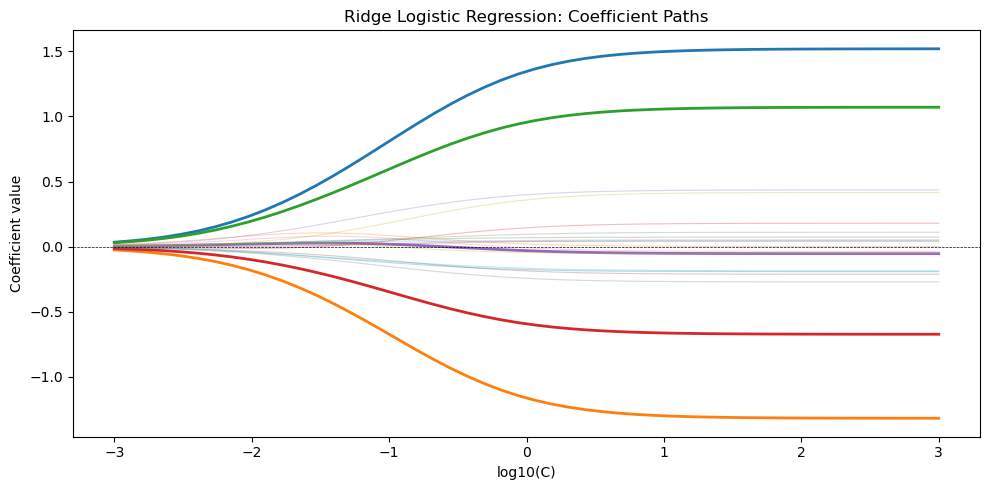

# 정칙화 로지스틱 회귀 실습


## 개요

정칙화 로지스틱 회귀는 로그가능도에 벌점항을 더해 과적합을 막고 일반화 성능을 높인다. 특히
특성의 개수가 표본크기에 비해 클 때 효과가 크다. 이 절에서는 L2(능형), L1(라쏘), 엘라스틱넷
벌점과 그것이 계수 추정에 미치는 영향, 그리고 scikit-learn에서의 실제 구현을 다룬다.

## 벌점 없는 로지스틱 회귀

표준 로지스틱 회귀 모형은 로그가능도

$$
\ell(\boldsymbol\beta) = \sum_{i=1}^{n}
  \bigl[y_i \log \hat{p}_i + (1 - y_i)\log(1 - \hat{p}_i)\bigr]
$$

를 최대화한다. 여기서 $\hat{p}_i = \sigma(\mathbf{x}_i^\top \boldsymbol\beta)$이고
$\sigma(z) = 1/(1+e^{-z})$이다.

## L2 정칙화(능형)

능형 로지스틱 회귀는 제곱 노름 벌점을 더한다.

$$
\hat{\boldsymbol\beta}_{\text{ridge}}
  = \arg\max_{\boldsymbol\beta}\;
    \ell(\boldsymbol\beta) - \frac{\lambda}{2}\|\boldsymbol\beta\|_2^2
$$

$C = 1/\lambda$를 쓰는 scikit-learn의 표기로는 동등하게

$$
\hat{\boldsymbol\beta}_{\text{ridge}}
  = \arg\min_{\boldsymbol\beta}\;
    -\ell(\boldsymbol\beta) + \frac{1}{2C}\|\boldsymbol\beta\|_2^2
$$

이다. L2 벌점은 모든 계수를 0 쪽으로 축소하지만 어느 것도 정확히 0으로 만들지 않는다.

<div class="exbox" markdown>

**보기 1.** <span class="diff easy" title="쉬움"></span> 능형 해가 반드시 만족하는 등식. 변수 $p = 20$개 가운데 앞 다섯만 참으로 쓰인 자료를 $n = 200$ 생성하고 `C=1.0`의 L2 로지스틱을 적합한다.

**(1)** 능형 로지스틱의 최적해가 만족하는 **정상조건**을 적고, $C = 1$에서 그것이 "잔차와 $j$번째 설명변수의 내적이 $\hat\beta_j$와 같다"는 말이 됨을 보이시오.

**(2)** 그 등식을 자료에서 확인하고, 벌점 없는 최대가능도추정과 견주어 축소의 크기를 재시오.

</div>

??? success "풀이"

    **(1) 해석적으로.** 최소화할 목적함수는

    $$
    J(\boldsymbol\beta) = -\ell(\boldsymbol\beta) + \frac{1}{2C}\lVert\boldsymbol\beta\rVert_2^2
    $$

    이다. 로지스틱 로그가능도의 기울기는 잘 알려진 대로

    $$
    \frac{\partial \ell}{\partial \beta_j} = \sum_{i=1}^{n} x_{ij}\,(y_i - \hat p_i)
    = \mathbf x_{(j)}^\top \mathbf r,
    \qquad \mathbf r = \mathbf y - \hat{\mathbf p}
    $$

    이므로 $\nabla J = 0$에서

    $$
    -\mathbf X^\top \mathbf r + \frac{1}{C}\hat{\boldsymbol\beta} = \mathbf 0
    \quad\Longleftrightarrow\quad
    \mathbf X^\top \mathbf r = \frac{\hat{\boldsymbol\beta}}{C}
    $$

    를 얻는다. $C = 1$이면 오른쪽이 그냥 $\hat{\boldsymbol\beta}$이므로

    $$
    \mathbf x_{(j)}^\top \mathbf r = \hat\beta_j
    \qquad (j = 1, \dots, 20)
    $$

    이다. **벌점이 없다면 오른쪽이 $0$이어서 잔차가 모든 설명변수와 직교한다.** 벌점은 그 직교성을 깨뜨리고, 깨뜨린 만큼이 정확히 계수다. 계수가 큰 변수일수록 잔차와 더 많이 상관되어 남는다는 뜻이고, 이것이 축소의 대가다.

    한편 **절편은 벌점을 받지 않는다**(sklearn의 기본 동작). 그래서 절편에 대한 정상조건은 벌점 없는 경우와 같은

    $$
    \sum_{i=1}^{n}(y_i - \hat p_i) = 0
    $$

    이다. 곧 **잔차의 합은 여전히 $0$이지만 각 열과의 내적은 $0$이 아니다.**

    **(2) 수치적으로.**

    ```python
    from sklearn.linear_model import LogisticRegression
    import numpy as np

    # 변수 20개 중 참으로 쓰이는 것은 앞의 다섯뿐이다. 세 벌점이 이 다섯을
    # 어떻게 다루는지 견준다.
    np.random.seed(42)
    n, p = 200, 20
    X = np.random.randn(n, p)
    true_beta = np.zeros(p)
    true_beta[:5] = [1.5, -1.0, 0.8, -0.5, 0.3]
    logit = X @ true_beta
    prob = 1 / (1 + np.exp(-logit))
    y = np.random.binomial(1, prob)

    # sklearn 에서 C 는 벌점의 역수다. C 가 작을수록 벌점이 세다 —
    # 다른 책의 lambda 와 방향이 반대이니 헷갈리기 쉽다.
    ridge_model = LogisticRegression(penalty='l2', C=1.0, solver='lbfgs',
                                      max_iter=1000)
    ridge_model.fit(X, y)
    print("Ridge coefficients:", np.round(ridge_model.coef_[0], 3))

    # 정상조건 X^T r = beta/C 를 직접 확인한다.
    r = y - ridge_model.predict_proba(X)[:, 1]
    print(f"\n잔차의 합 = {r.sum():.3e}   (절편은 벌점을 받지 않는다)")
    print(f"X^T r  첫 5개 = {np.round(X.T @ r, 4)[:5]}")
    print(f"beta   첫 5개 = {np.round(ridge_model.coef_[0], 4)[:5]}")
    print(f"max |X^T r - beta| = {np.abs(X.T @ r - ridge_model.coef_[0]).max():.3e}")

    # 수렴 기준을 조이면 등식이 더 정확해진다 — 어긋남은 수학이 아니라 풀이기다.
    tight = LogisticRegression(penalty='l2', C=1.0, solver='lbfgs',
                               max_iter=20000, tol=1e-8).fit(X, y)
    r2 = y - tight.predict_proba(X)[:, 1]
    print(f"tol=1e-8 로 다시: max |X^T r - beta| = "
          f"{np.abs(X.T @ r2 - tight.coef_[0]).max():.3e}")

    # 벌점을 완전히 끈 최대가능도와 견준다.
    mle = LogisticRegression(penalty=None, solver='lbfgs', max_iter=5000).fit(X, y)
    print(f"\nMLE  첫 5개 = {np.round(mle.coef_[0], 3)[:5]}")
    print(f"능형 노름 {np.linalg.norm(ridge_model.coef_[0]):.4f}, "
          f"MLE 노름 {np.linalg.norm(mle.coef_[0]):.4f}, "
          f"비 {np.linalg.norm(ridge_model.coef_[0]) / np.linalg.norm(mle.coef_[0]):.4f}")
    ```

    출력:

    ```
    Ridge coefficients: [ 1.346 -1.162  0.955 -0.593 -0.031 -0.187 -0.009 -0.243  0.359  0.041
     -0.176  0.021  0.069  0.145  0.398  0.04   0.047  0.095 -0.046 -0.166]

    잔차의 합 = -3.266e-03   (절편은 벌점을 받지 않는다)
    X^T r  첫 5개 = [ 1.3531 -1.1535  0.9554 -0.5991 -0.0282]
    beta   첫 5개 = [ 1.3458 -1.1624  0.9554 -0.5931 -0.031 ]
    max |X^T r - beta| = 8.861e-03
    tol=1e-8 로 다시: max |X^T r - beta| = 6.020e-06

    MLE  첫 5개 = [ 1.519 -1.318  1.071 -0.673 -0.054]
    능형 노름 2.2160, MLE 노름 2.5020, 비 0.8857
    ```

    **유도한 등식 $\mathbf x_{(j)}^\top\mathbf r = \hat\beta_j$가 맞는다.** 기본 설정에서 최대 어긋남이 $8.9\times10^{-3}$이고, 수렴 기준을 `tol=1e-8`로 조이면 $6.0\times10^{-6}$으로 떨어진다. **차이가 수학이 아니라 풀이기의 정지 조건에서 왔다는 증거다.** 잔차의 합도 같은 이유로 $-3.3\times10^{-3}$이지 정확한 $0$이 아니다.

    축소의 크기는 노름으로 재면 분명하다. 벌점 없는 최대가능도의 $\lVert\hat{\boldsymbol\beta}\rVert_2 = 2.5020$이 `C=1.0`에서 $2.2160$으로 줄어, **$11.4\%$가 깎였다.** 첫 다섯 개만 보아도 $1.519 \to 1.346$, $-1.318 \to -1.162$로 한결같이 $0$ 쪽으로 당겨져 있다.

    참값과 견주면 이야기가 더 재미있다. 강한 신호 넷은 잘 잡았지만 **가장 약한 신호 $\beta_5 = 0.3$은 부호까지 틀려 $-0.031$이 되었다.** 이는 벌점 탓이 아니다. 벌점을 끈 MLE도 $-0.054$로 똑같이 음수이기 때문이다. $n = 200$에서 계수 하나의 표준오차가 $0.2$ 수준이라 크기 $0.3$인 효과는 잡음에 묻힌다. 잡음변수 $15$개의 계수가 최대 $0.398$까지 올라오는 것도 같은 사정이다.

## L1 정칙화(라쏘)

라쏘 로지스틱 회귀는 제곱 벌점 대신 절댓값 노름을 쓴다.

$$
\hat{\boldsymbol\beta}_{\text{lasso}}
  = \arg\min_{\boldsymbol\beta}\;
    -\ell(\boldsymbol\beta) + \frac{1}{C}\|\boldsymbol\beta\|_1
$$

L1 벌점은 **희소성**을 유도한다. 충분히 작은 계수는 정확히 0으로 밀려나 자동으로 변수선택이
이루어진다.

<div class="exbox" markdown>

**보기 2.** <span class="diff easy" title="쉬움"></span> 어떤 계수가 $0$이 되는가를 미리 말할 수 있다. 같은 자료에 `penalty='l1', C=1.0`을 적합한다.

**(1)** 절댓값 벌점은 $0$에서 미분되지 않는다. 열미분(하위미분)으로 최적조건을 적고, **$\hat\beta_j = 0$이 될 조건**과 **$\hat\beta_j \ne 0$일 때 반드시 성립하는 등식**을 각각 구하시오.

**(2)** 그 두 조건을 자료에서 확인하시오. $0$이 된 계수가 셋이라면, 그 셋의 잔차 내적은 얼마여야 하는가?

</div>

??? success "풀이"

    **(1) 해석적으로.** 목적함수는

    $$
    J(\boldsymbol\beta) = -\ell(\boldsymbol\beta) + \frac{1}{C}\lVert\boldsymbol\beta\rVert_1
    $$

    이다. $\lvert\beta_j\rvert$는 $\beta_j \ne 0$에서 미분값이 $\operatorname{sign}(\beta_j)$이고, $\beta_j = 0$에서는 미분 대신 **열미분 집합** $[-1, 1]$을 갖는다. 볼록함수의 최솟값 조건은 "$0$이 열미분 집합에 들어 있다"이므로, $s_j := \mathbf x_{(j)}^\top\mathbf r$라 쓰면

    $$
    \hat\beta_j \ne 0
    \;\Longrightarrow\;
    -s_j + \frac{1}{C}\operatorname{sign}(\hat\beta_j) = 0
    \;\Longleftrightarrow\;
    s_j = \frac{\operatorname{sign}(\hat\beta_j)}{C}
    $$

    $$
    \hat\beta_j = 0
    \;\Longleftrightarrow\;
    \lvert s_j \rvert \le \frac{1}{C}
    $$

    이다. **살아남은 계수는 전부 $\lvert s_j\rvert$가 정확히 $1/C$다.** 능형에서 $s_j$가 계수에 비례해 제각각이던 것과 완전히 다르다. L1에서는 $1/C$가 **문턱**으로 작동해, 잔차와의 상관이 그 문턱에 닿지 못하는 변수는 통째로 떨어져 나간다. 이것이 희소성의 정체이며, $0$에서 꺾인 모서리가 그 문턱을 만든다.

    $C = 1$이므로 이 자료에서는

    - $0$이 아닌 계수: $\lvert s_j\rvert = 1$ (부호는 계수와 같다)
    - $0$인 계수: $\lvert s_j\rvert \le 1$

    이어야 한다.

    같은 꺾임이 `lbfgs`를 못 쓰게 만드는 이유이기도 하다. `lbfgs`는 기울기가 어디에나 있다고 가정하는 준뉴턴법이라 $0$에서 멈출 수가 없다. `saga`나 좌표하강처럼 **근위 연산자**를 쓰는 풀이기가 필요하다.

    **(2) 수치적으로.**

    ```python
    # L1 벌점은 lbfgs 로 풀 수 없다. 0 에서 미분이 되지 않기 때문이며,
    # 그래서 saga 같은 다른 풀이기를 써야 한다.
    lasso_model = LogisticRegression(penalty='l1', C=1.0, solver='saga',
                                      max_iter=5000)
    lasso_model.fit(X, y)
    print("Lasso coefficients:", np.round(lasso_model.coef_[0], 3))
    print(f"Non-zero coefficients: {np.sum(lasso_model.coef_[0] != 0)} / {p}")

    r1 = y - lasso_model.predict_proba(X)[:, 1]
    s = X.T @ r1
    nz = lasso_model.coef_[0] != 0
    print(f"\n0 이 된 계수의 번호: {np.where(~nz)[0]}")
    print(f"그 셋의 |s_j| = {np.round(np.abs(s[~nz]), 4)}   (모두 1 이하여야 한다)")
    print(f"0 이 아닌 {nz.sum()}개의 |s_j| 범위 = "
          f"[{np.abs(s[nz]).min():.4f}, {np.abs(s[nz]).max():.4f}]")
    print(f"그 중 1 에서 가장 많이 벗어난 값 = "
          f"{np.abs(np.abs(s[nz]) - 1.0).max():.4f}")
    print(f"부호가 계수와 일치하는가: "
          f"{bool(np.all(np.sign(s[nz]) == np.sign(lasso_model.coef_[0][nz])))}")
    ```

    출력:

    ```
    Lasso coefficients: [ 1.34  -1.146  0.94  -0.579  0.    -0.158  0.    -0.211  0.344  0.028
     -0.134  0.     0.023  0.092  0.37   0.006  0.007  0.055 -0.003 -0.127]
    Non-zero coefficients: 17 / 20

    0 이 된 계수의 번호: [ 4  6 11]
    그 셋의 |s_j| = [0.8042 0.2508 0.6809]   (모두 1 이하여야 한다)
    0 이 아닌 17개의 |s_j| 범위 = [0.9985, 1.0023]
    그 중 1 에서 가장 많이 벗어난 값 = 0.0023
    부호가 계수와 일치하는가: True
    ```

    **두 조건이 모두 맞는다.** $0$이 아닌 $17$개의 $\lvert s_j\rvert$가 $[0.9985,\ 1.0023]$에 모두 들어 있어 이론값 $1/C = 1$에서 최대 $0.0023$밖에 벗어나지 않고, 부호도 전부 계수와 같다. $0$이 된 셋은 $0.8042$, $0.2508$, $0.6809$로 셋 다 문턱 $1$을 넘지 못했다.

    어느 셋이 떨어졌는지도 뜻이 있다. 번호 $4$는 **참 계수가 $0.3$인 가장 약한 신호**이고 나머지 둘은 잡음변수다. 신호 하나를 버리고 잡음 둘을 버린 셈인데, $\lvert s_4\rvert = 0.8042$가 문턱에 가장 가까웠다는 것이 그 변수가 "거의 살아남을 뻔했다"는 뜻이다.

    전체로는 $20$개 중 $17$개가 살아 있다. **$C = 1.0$에서는 벌점이 아직 약해 잡음변수 대부분이 문턱을 넘는다.** 잡음변수를 떨어뜨리려면 $C$를 줄여 문턱 $1/C$를 올려야 한다(연습문제 1).

## 엘라스틱넷

엘라스틱넷은 배합모수 $\alpha \in [0,1]$(scikit-learn에서는 `l1_ratio`)로 L1과 L2 벌점을
결합한다.

$$
\text{Penalty} = \frac{1-\alpha}{2}\|\boldsymbol\beta\|_2^2 + \alpha\,\|\boldsymbol\beta\|_1
$$

$\alpha = 0$이면 능형, $\alpha = 1$이면 라쏘가 된다. 상관된 특성 집단이 있을 때 유용하다. L1
단독이라면 각 집단에서 하나만 고르지만, L2 성분이 상관된 설명변수들끼리 가중치를 나누어 갖도록
유도하기 때문이다.

<div class="exbox" markdown>

**보기 3.** <span class="diff easy" title="쉬움"></span> 문턱이 절반으로 낮아진다. `l1_ratio=0.5`, `C=1.0`으로 엘라스틱넷을 적합한다.

**(1)** 보기 1과 보기 2의 조건을 합쳐 엘라스틱넷의 최적조건을 적고, $\hat\beta_j = 0$이 되는 **문턱**이 얼마인지 구하시오.

**(2)** 그 조건을 확인하고, 세 벌점의 $0$이 아닌 계수 개수가 왜 $20 > 19 > 17$ 순서로 놓이는지 설명하시오.

</div>

??? success "풀이"

    **(1) 해석적으로.** $\alpha = $ `l1_ratio`라 쓰면 목적함수는

    $$
    J(\boldsymbol\beta) = -\ell(\boldsymbol\beta)
    + \frac{1}{C}\left[\frac{1-\alpha}{2}\lVert\boldsymbol\beta\rVert_2^2
    + \alpha\lVert\boldsymbol\beta\rVert_1\right]
    $$

    이다. 벌점이 두 조각의 합이므로 열미분도 두 조각의 합이고, $s_j = \mathbf x_{(j)}^\top\mathbf r$에 대해

    $$
    \hat\beta_j \ne 0
    \;\Longrightarrow\;
    s_j = \frac{(1-\alpha)\hat\beta_j + \alpha\operatorname{sign}(\hat\beta_j)}{C}
    $$

    $$
    \hat\beta_j = 0
    \;\Longleftrightarrow\;
    \lvert s_j\rvert \le \frac{\alpha}{C}
    $$

    이다. **$\beta_j = 0$에서는 L2 조각의 미분이 $0$이라 문턱을 만드는 것은 L1 조각뿐이다.** 그래서 문턱이 $1/C$가 아니라

    $$
    \frac{\alpha}{C} = \frac{0.5}{1.0} = 0.5
    $$

    로 **절반으로 낮아진다.** 문턱이 낮으면 더 많은 변수가 살아남으므로, $0$이 아닌 계수의 개수는 라쏘보다 많고 능형($20$개, 문턱이 없다)보다는 적거나 같다. $C = 1$, $\alpha = 0.5$에서 $0$이 아닌 계수는

    $$
    s_j = 0.5\,\hat\beta_j + 0.5\operatorname{sign}(\hat\beta_j)
    $$

    를 만족해야 한다.

    **(2) 수치적으로.**

    ```python
    # 엘라스틱넷은 l1_ratio 로 두 벌점의 배합비를 정한다. 0.5 면 절반씩이다.
    enet_model = LogisticRegression(penalty='elasticnet', C=1.0,
                                     solver='saga', l1_ratio=0.5,
                                     max_iter=5000)
    enet_model.fit(X, y)
    print("Elastic Net coefficients:", np.round(enet_model.coef_[0], 3))

    be = enet_model.coef_[0]
    re = y - enet_model.predict_proba(X)[:, 1]
    se = X.T @ re
    nze = be != 0
    pred = 0.5 * be[nze] + 0.5 * np.sign(be[nze])
    print(f"\n0 이 된 계수의 번호: {np.where(~nze)[0]}, "
          f"|s_j| = {np.round(np.abs(se[~nze]), 4)}  (문턱 0.5 이하)")
    print(f"0 이 아닌 {nze.sum()}개:  "
          f"max |s_j - (0.5 b + 0.5 sign b)| = {np.abs(se[nze] - pred).max():.4f}")

    bl, br = lasso_model.coef_[0], ridge_model.coef_[0]
    print(f"\n0 이 아닌 개수   능형 {int((br != 0).sum())}  "
          f"엘넷 {int(nze.sum())}  라쏘 {int((bl != 0).sum())}")
    print(f"L1 노름         능형 {np.abs(br).sum():.4f}  "
          f"엘넷 {np.abs(be).sum():.4f}  라쏘 {np.abs(bl).sum():.4f}")
    print(f"|라쏘| <= |엘넷| 이 20개 모두 성립: "
          f"{bool(np.all(np.abs(bl) <= np.abs(be) + 1e-9))}")
    print(f"|엘넷| <= |능형| 이 20개 모두 성립: "
          f"{bool(np.all(np.abs(be) <= np.abs(br) + 1e-9))}")
    ```

    출력:

    ```
    Elastic Net coefficients: [ 1.342 -1.153  0.947 -0.585 -0.012 -0.172  0.    -0.229  0.351  0.035
     -0.154  0.006  0.046  0.118  0.385  0.022  0.027  0.074 -0.026 -0.146]

    0 이 된 계수의 번호: [6], |s_j| = [0.0184]  (문턱 0.5 이하)
    0 이 아닌 19개:  max |s_j - (0.5 b + 0.5 sign b)| = 0.0014

    0 이 아닌 개수   능형 20  엘넷 19  라쏘 17
    L1 노름         능형 6.1297  엘넷 5.8315  라쏘 5.5625
    |라쏘| <= |엘넷| 이 20개 모두 성립: True
    |엘넷| <= |능형| 이 20개 모두 성립: True
    ```

    **최적조건이 맞는다.** $0$이 아닌 $19$개가 $s_j = 0.5\hat\beta_j + 0.5\operatorname{sign}(\hat\beta_j)$를 최대 $0.0014$ 오차로 만족하고, $0$이 된 번호 $6$은 $\lvert s_6\rvert = 0.0184$로 문턱 $0.5$에 한참 못 미친다.

    개수의 순서 $20 > 19 > 17$은 문턱의 순서 그대로다. 능형은 문턱이 아예 없어 $20$개가 모두 살고, 엘라스틱넷은 문턱 $\alpha/C = 0.5$라 하나가 떨어지며, 라쏘는 문턱 $1/C = 1$이라 셋이 떨어진다. **보기 2에서 떨어진 셋의 $\lvert s_j\rvert$가 $0.8042$, $0.2508$, $0.6809$였는데, 문턱이 $0.5$로 내려오자 $0.2508$짜리 하나만 남았다**(그것이 번호 $6$이다). 문턱을 반으로 낮춘 결과가 "둘이 되살아났다"로 그대로 나타난다.

    크기 쪽에서도 세 해가 가지런히 늘어선다. $L_1$ 노름이 $6.1297 > 5.8315 > 5.5625$이고, **$20$개 계수 전부에서 $\lvert\hat\beta^{\text{lasso}}_j\rvert \le \lvert\hat\beta^{\text{enet}}_j\rvert \le \lvert\hat\beta^{\text{ridge}}_j\rvert$가 성립한다.** 다만 이것은 이 자료에서 확인된 사실이지 일반적으로 보장되는 성질이 아니다. 설명변수가 서로 상관되어 있으면 순서가 뒤집히는 좌표가 나올 수 있다. 여기서는 $\mathbf X$의 열이 독립인 표준정규라 그런 일이 없었다.

## 정칙화 강도의 영향

$C$가 커지면(정칙화가 약해지면) 추정치가 벌점 없는 MLE에 가까워지고, $C$가 작아지면
(정칙화가 강해지면) 계수가 0 쪽으로 축소된다.

<div class="exbox" markdown>

**보기 4.** <span class="diff easy" title="쉬움"></span> 경로의 양 끝은 무엇인가. $C$를 $10^{-3}$에서 $10^3$까지 훑으며 L2 계수 $20$개의 경로를 그린다.

**(1)** 그림의 **왼쪽 끝과 오른쪽 끝**에서 경로가 무엇에 수렴하는지 말하고, 그림에서 읽히는 끝값을 보기 1의 수와 맞춰 보시오.

**(2)** 이 그림이 **보여 주지 못하는 것**은 무엇인가. 참으로 쓰인 다섯 변수를 굵게 그렸는데, 그 다섯을 그림만 보고 가려낼 수 있는가?

</div>

??? success "풀이"

    **(1) 양 끝은 둘 다 답이 정해져 있다.**

    $C \to 0$이면 벌점 $\frac{1}{2C}\lVert\boldsymbol\beta\rVert^2$가 로그가능도를 압도하므로 $\hat{\boldsymbol\beta} \to \mathbf 0$이다. 그림의 왼쪽 끝 $\log_{10} C = -3$에서 $20$개 선이 모두 $0$에 붙어 있는 것이 그것이다. **이때 모형은 절편만 남아 모든 사람에게 같은 확률 $\bar y = 0.505$를 준다.**

    $C \to \infty$이면 벌점이 사라져 벌점 없는 최대가능도에 수렴한다. 보기 1에서 구한 MLE가 첫 다섯 개에 대해 $(1.519,\ -1.318,\ 1.071,\ -0.673,\ -0.054)$였으니, 그림의 오른쪽 끝에서 굵은 선들이 **$1.52$, $-1.32$, $1.07$, $-0.67$, 그리고 $0$ 근처**에 눕는 것과 맞는다. 읽어 보면 파란 선이 $1.5$ 조금 위, 주황 선이 $-1.3$ 근처, 초록 선이 $1.07$, 빨간 선이 $-0.67$ 자리다.

    아래 코드가 양 끝의 수를 찍어 그 읽기를 확인한다.

    ```python
    import matplotlib.pyplot as plt

    plt.rcParams["font.sans-serif"] = ["NanumGothic", "Apple SD Gothic Neo", "Malgun Gothic"]
    plt.rcParams["font.family"] = "sans-serif"
    plt.rcParams["axes.unicode_minus"] = False

    # C 를 키우며 계수 경로를 그린다. 참으로 쓰인 다섯 변수는 굵게, 나머지는
    # 흐리게 그려 어느 쪽이 먼저 살아나는지 보이게 한다.
    C_values = np.logspace(-3, 3, 50)
    coefs = []

    for C in C_values:
        model = LogisticRegression(penalty='l2', C=C, solver='lbfgs',
                                    max_iter=2000)
        model.fit(X, y)
        coefs.append(model.coef_[0])

    coefs = np.array(coefs)

    plt.figure(figsize=(10, 5))
    for j in range(p):
        plt.plot(np.log10(C_values), coefs[:, j],
                 linewidth=2 if j < 5 else 0.8,
                 alpha=1.0 if j < 5 else 0.3)
    plt.xlabel('log10(C)')
    plt.ylabel('Coefficient value')
    plt.title('Ridge Logistic Regression: Coefficient Paths')
    plt.axhline(0, color='black', linestyle='--', linewidth=0.5)
    plt.tight_layout()
    plt.show()

    # 그림의 양 끝에서 읽어야 할 수.
    print(f"왼쪽 끝 log10(C) = -3:  max |beta| = {np.abs(coefs[0]).max():.5f}")
    print(f"오른쪽 끝 log10(C) = 3: 첫 5개 = {np.round(coefs[-1][:5], 3)}")
    print(f"                        MLE 첫 5개 = {np.round(mle.coef_[0][:5], 3)}")
    print(f"잡음 15개의 끝값 범위 = [{coefs[-1][5:].min():.3f}, "
          f"{coefs[-1][5:].max():.3f}]")
    print(f"그 가운데 절댓값이 가장 큰 것 = "
          f"{np.abs(coefs[-1][5:]).max():.3f} (번호 "
          f"{5 + int(np.argmax(np.abs(coefs[-1][5:])))})")
    print(f"참 신호 5번(beta5=0.3)의 끝값 = {coefs[-1][4]:.3f}")
    ```

    출력:

    ```
    왼쪽 끝 log10(C) = -3:  max |beta| = 0.03406
    오른쪽 끝 log10(C) = 3: 첫 5개 = [ 1.519 -1.318  1.07  -0.673 -0.054]
                            MLE 첫 5개 = [ 1.519 -1.318  1.071 -0.673 -0.054]
    잡음 15개의 끝값 범위 = [-0.271, 0.436]
    그 가운데 절댓값이 가장 큰 것 = 0.436 (번호 14)
    참 신호 5번(beta5=0.3)의 끝값 = -0.054
    ```

    

    왼쪽 끝에서 가장 큰 계수조차 $0.0341$로 사실상 $0$이고, 오른쪽 끝의 다섯 값이 보기 1의 MLE와 **소수 둘째 자리까지 같다.** 유도한 두 극한이 그대로 확인된다. 셋째 변수만 $1.070$ 대 $1.071$로 한 자리 어긋나는데, 이는 $C = 10^3$에서 벌점 $\frac{1}{2C} = 5\times10^{-4}$이 아직 완전히 $0$은 아니기 때문이다. **경로의 오른쪽 끝은 MLE에 *가까운* 것이지 MLE 그 자체가 아니다.**

    **(2) 이 그림은 세 가지를 보여 주지 못한다.**

    **첫째, 어느 선이 어느 변수인지 알 수 없다.** 범례가 없어서, 오른쪽 끝의 $1.52$가 $\beta_1$인지 $\beta_3$인지 그림만으로는 정할 수 없다. 계수 경로 그림에서는 오른쪽 가장자리에 변수 이름을 직접 적어 주는 것이 관례다.

    **둘째, 굵은 선 다섯 가운데 하나는 눈에 띄지 않는다.** 참으로 쓰인 다섯을 `linewidth=2`로 굵게 그렸는데, $\beta_5 = 0.3$에 해당하는 선은 끝값이 $-0.054$라 **$0$ 주위의 흐린 잡음선 다발에 통째로 묻힌다.** 거꾸로 잡음변수 가운데 $14$번은 끝값이 $0.436$까지 올라가 $\beta_5$보다 **여덟 배 크다.** 곧 **"굵은 선 다섯이 위로 솟고 흐린 선 열다섯이 바닥에 깔린다"는 그림이 아니다.** 굵게 칠해 놓았으니 다섯을 가려낼 수 있어 보이지만, 그것은 **답을 알고 그린 사람의 특권**이지 그림이 알려 준 것이 아니다. 실제 자료에서는 참 계수를 모르므로 이 그림만으로 변수선택을 할 수 없다.

    **셋째, 가로축의 왼쪽 끝이 "벌점 없음"이 아니다.** $\log_{10} C$ 축이라 왼쪽이 **강한 벌점**, 오른쪽이 **약한 벌점**이다. $\lambda = 1/C$에 익숙한 사람은 방향을 거꾸로 읽기 쉽다. 또 오른쪽 끝 $\log_{10}C = 3$에서 이미 MLE에 수렴했으므로 $C$를 더 키워도 아무 일도 일어나지 않는다. **경로의 오른쪽 $1$개 눈금은 사실상 쓸모없는 여백이다.**

## 교차검증으로 C 조율하기

scikit-learn은 $C$ 격자 위에서 교차검증을 수행하는 `LogisticRegressionCV`를 제공한다.

<div class="exbox" markdown>

**보기 5.** <span class="diff easy" title="쉬움"></span> $1.6238$은 어디서 온 수인가. `Cs=20`으로 5겹 교차검증을 돌리면 최적 $C = 1.6238$, 교차검증 정확도 $0.7450$이 나온다.

**(1)** `Cs=20`이 만드는 격자를 적고, $1.6238$이 그 가운데 **몇 번째 점**인지 지수로 정확히 맞히시오.

**(2)** 교차검증 정확도 $0.7450$은 몇 건을 맞힌 것인가. 같은 $C$에서 훈련 정확도와 다수범주 기준선을 함께 구해 세 수를 견주시오.

</div>

??? success "풀이"

    **(1) 해석적으로.** `LogisticRegressionCV`에 `Cs`를 정수로 주면 scikit-learn은 $10^{-4}$부터 $10^{4}$까지를 로그 눈금으로 균등하게 나눈 격자를 쓴다. 곧 `np.logspace(-4, 4, 20)`이고 $k$번째($k = 0, \dots, 19$) 점은

    $$
    C_k = 10^{\,-4 + \frac{8k}{19}}
    $$

    이다. $1.6238$을 넣어 보면

    $$
    \log_{10} 1.6238 = 0.210526 = -4 + \frac{8k}{19}
    \;\Longrightarrow\;
    k = \frac{19 \times 4.210526}{8} = 10.000
    $$

    로 **정확히 $k = 10$**이다. 확인하면

    $$
    C_{10} = 10^{-4 + 80/19} = 10^{0.2105263} = 1.623777
    $$

    이다. **격자가 로그 눈금이라는 것을 모르면 $1.6238$이 어디서 왔는지 영영 알 수 없다.** 격자의 이웃 점은 $C_9 = 0.6158$과 $C_{11} = 4.2813$이므로 한 칸 간격이 $10^{8/19} = 2.637$배다. 곧 **교차검증이 고른 $C$의 분해능이 $2.6$배 수준**이며, "최적 $C$가 $1.6238$이다"를 소수 넷째 자리까지 믿을 이유가 전혀 없다.

    **(2) 수치적으로.**

    ```python
    from sklearn.linear_model import LogisticRegressionCV

    # C 는 교차검증으로 고른다. Cs=20 은 격자 점의 개수이며, sklearn 이
    # 알아서 로그 눈금으로 펼친다.
    model_cv = LogisticRegressionCV(
        Cs=20, penalty='l2', cv=5, scoring='accuracy',
        solver='lbfgs', max_iter=2000
    )
    model_cv.fit(X, y)
    print(f"Best C: {model_cv.C_[0]:.4f}")
    print(f"Best CV accuracy: {model_cv.scores_[1].mean(axis=0).max():.4f}")

    grid = np.logspace(-4, 4, 20)
    print(f"\nCs_ 가 logspace(-4, 4, 20) 인가: "
          f"{bool(np.allclose(model_cv.Cs_, grid))}")
    k = int(np.argmin(np.abs(grid - model_cv.C_[0])))
    print(f"고른 점은 k = {k},  10^(-4 + 8*{k}/19) = {10 ** (-4 + 8 * k / 19):.6f}")
    print(f"이웃 격자점 C_9 = {grid[9]:.4f}, C_11 = {grid[11]:.4f}  "
          f"(한 칸 {10 ** (8 / 19):.3f}배)")

    mean_scores = model_cv.scores_[1].mean(axis=0)
    print(f"\n격자별 CV 정확도 = {np.round(mean_scores, 3)}")
    print(f"최댓값 {mean_scores.max():.4f} 를 주는 격자점 = "
          f"{np.where(mean_scores == mean_scores.max())[0]}")
    print(f"맞힌 건수 = {mean_scores.max():.4f} * {len(y)} = "
          f"{mean_scores.max() * len(y):.0f}")

    refit = LogisticRegression(penalty='l2', C=model_cv.C_[0],
                               solver='lbfgs', max_iter=2000).fit(X, y)
    print(f"\n훈련 정확도   {refit.score(X, y):.4f}")
    print(f"교차검증 정확도 {mean_scores.max():.4f}")
    print(f"다수범주 기준선 {max(y.mean(), 1 - y.mean()):.4f}")
    ```

    출력:

    ```
    Best C: 1.6238
    Best CV accuracy: 0.7450

    Cs_ 가 logspace(-4, 4, 20) 인가: True
    고른 점은 k = 10,  10^(-4 + 8*10/19) = 1.623777
    이웃 격자점 C_9 = 0.6158, C_11 = 4.2813  (한 칸 2.637배)

    격자별 CV 정확도 = [0.535 0.555 0.645 0.71  0.72  0.72  0.72  0.73  0.74  0.74  0.745 0.745
     0.74  0.735 0.735 0.735 0.735 0.735 0.735 0.735]
    최댓값 0.7450 를 주는 격자점 = [10 11]
    맞힌 건수 = 0.7450 * 200 = 149

    훈련 정확도   0.8000
    교차검증 정확도 0.7450
    다수범주 기준선 0.5050
    ```

    **유도한 $k = 10$과 $C_{10} = 1.623777$이 정확히 맞는다.** 그리고 격자별 점수를 펼쳐 보면 **$k = 10$과 $k = 11$이 둘 다 $0.745$로 똑같다.** `argmax`가 앞의 것을 집었을 뿐이며, 만약 자료가 한 건만 달랐어도 $4.2813$이 "최적 $C$"로 보고되었을 것이다. 소수 넷째 자리까지 적는 관행이 얼마나 공허한지가 여기 드러난다.

    세 정확도의 순서도 교과서대로다.

    $$
    \underbrace{0.5050}_{\text{다수범주}}
    \;<\;
    \underbrace{0.7450}_{\text{교차검증}}
    \;<\;
    \underbrace{0.8000}_{\text{훈련}}
    $$

    $0.7450$은 $200$건 가운데 $149$건을 맞혔다는 뜻이다. **훈련 정확도 $0.8000$이 교차검증보다 $0.055$ 높은 것이 낙관 편의**이고, $p = 20$ 가운데 $15$개가 잡음인 자료에서 그 정도가 나온다. 보고할 수는 $0.8000$이 아니라 $0.7450$이다.

!!! note "`scores_`의 키에 주의"
    `model_cv.scores_`는 범주 이름표를 키로 하는 딕셔너리다. 위 코드의 `scores_[1]`은 이름표가
    정수 `1`인 범주를 가리키므로, 이름표가 문자열(`'yes'`)이거나 다른 값이면 `KeyError`가 난다.
    범주에 무관하게 쓰려면 `next(iter(model_cv.scores_.values()))`를 쓰라. 이항 분류에서는
    두 범주의 점수 배열이 어차피 같다.

## 해석

- **능형(L2)**은 모든 특성이 기여할 것으로 기대되고 다중공선성이 있을 때 선호된다. 계수 추정을
  안정화한다.
- **라쏘(L1)**는 희소한 모형이 필요할 때 선호된다. 무관한 특성의 계수를 0으로 만들어 변수선택을
  수행한다.
- **엘라스틱넷**은 절충안으로, 특성이 상관되어 있으면서도 희소성이 필요할 때 유용하다.
- 정칙화 강도 $C$(또는 $\lambda = 1/C$)가 편향-분산 절충을 조절한다. $C$가 작을수록 편향은
  커지고 분산은 작아진다.

## 연습문제

<div class="drillbox" markdown>

**연습문제 1.** <span class="diff med" title="중간"></span>
$n = 200$, $p = 50$이고 처음 5개 특성만 참 계수가 0이 아닌 자료를 생성하라.
$C \in \{0.01, 0.1, 1.0, 10.0\}$에 대해 L1 정칙화 로지스틱 회귀를 적합하고, 각 $C$에서 0이
아닌 추정 계수의 개수를 보고하라.

</div>

??? success "풀이"

    ```python
    import numpy as np
    from sklearn.linear_model import LogisticRegression

    np.random.seed(42)
    n, p = 200, 50
    X = np.random.randn(n, p)
    true_beta = np.zeros(p)
    true_beta[:5] = [2.0, -1.5, 1.0, -0.8, 0.5]
    logit = X @ true_beta
    prob = 1 / (1 + np.exp(-logit))
    y = np.random.binomial(1, prob)

    for C in [0.01, 0.1, 1.0, 10.0]:
        model = LogisticRegression(penalty='l1', C=C, solver='saga',
                                    max_iter=5000)
        model.fit(X, y)
        nnz = np.sum(model.coef_[0] != 0)
        print(f"C = {C:5.2f}: {nnz} non-zero coefficients out of {p}")
    ```

    출력:

    ```
    C =  0.01: 0 non-zero coefficients out of 50
    C =  0.10: 4 non-zero coefficients out of 50
    C =  1.00: 36 non-zero coefficients out of 50
    C = 10.00: 48 non-zero coefficients out of 50
    ```

    | $C$ | 0이 아닌 계수 | 그중 참 신호 | 그중 잡음 |
    |---|---|---|---|
    | 0.01 | 0 | 0 | 0 |
    | 0.10 | 4 | **4** | **0** |
    | 1.00 | 36 | 5 | 31 |
    | 10.00 | 48 | 5 | 43 |

    $C$가 커질수록(벌점이 약할수록) 0이 아닌 계수가 늘어난다. $C = 0.01$에서는 벌점이 너무 강해
    모든 계수가 0인 영모형이 되고, $C = 10$에서는 사실상 벌점 없는 적합에 가까워 잡음변수 43개가
    함께 들어온다.

    가장 흥미로운 지점은 $C = 0.1$이다. 정확히 4개가 선택되었고 **모두 참 신호이며 위양성이
    하나도 없다.** 놓친 하나는 가장 약한 신호 $\beta_5 = 0.5$다. 이것이 라쏘의 전형적인
    행동이다. 위양성을 0으로 유지할 만큼 벌점을 강하게 걸면 약한 참 신호도 함께 잘려 나간다.
    희소성과 검정력 사이의 절충은 피할 수 없다. $\square$

<div class="drillbox" markdown>

**연습문제 2.** <span class="diff med" title="중간"></span>
능형 벌점 $\|\boldsymbol\beta\|_2^2$이 베이즈 로지스틱 회귀에서 각 $\beta_j$에 독립인
$N(0, \sigma^2)$ 사전분포를 두는 것과 동등함을 보여라($\sigma^2 = C$).

</div>

??? success "풀이"

    베이즈 로지스틱 회귀에서 사후분포는 가능도와 사전분포의 곱에 비례한다.

    $$
    p(\boldsymbol\beta \mid \mathbf{y})
      \propto \prod_{i=1}^n p(y_i \mid \mathbf{x}_i, \boldsymbol\beta)
      \;\cdot\; \prod_{j=1}^p \frac{1}{\sqrt{2\pi\sigma^2}}
      \exp\Bigl(-\frac{\beta_j^2}{2\sigma^2}\Bigr)
    $$

    로그를 취하고 상수를 무시하면

    $$
    \log p(\boldsymbol\beta \mid \mathbf{y})
      = \ell(\boldsymbol\beta) - \frac{1}{2\sigma^2}\sum_{j=1}^p \beta_j^2 + \text{const}
    $$

    이다. 이는 $\lambda = 1/\sigma^2$, 동등하게 $C = \sigma^2$인 능형 목적함수와 정확히 같다.
    따라서 로그사후를 최대화하는 것(MAP 추정)은 능형 로지스틱 회귀와 동일하다.

    !!! note "MAP는 사후분포의 요약 하나일 뿐이다"
        이 동등성은 **점추정**에 대한 것이다. 능형 추정치는 사후 최빈값이지 사후 평균이 아니며,
        정칙화 로지스틱 회귀는 사후분포의 폭에 대해 아무것도 알려 주지 않는다. 이것이
        정칙화 모형에서 표준오차와 신뢰구간이 그대로 유효하지 않은 이유다. 불확실성이
        필요하다면 실제로 사후분포를 표집(MCMC)하거나 붓스트랩을 써야 한다. $\square$

<div class="drillbox" markdown>

**연습문제 3.** <span class="diff med" title="중간"></span>
L1 벌점은 희소한 해를 만드는데 L2 벌점은 그렇지 않은 이유를 기하학적으로 설명하라.

</div>

??? success "풀이"

    L1의 제약영역은 마름모(2차원에서는 집합
    $\{(\beta_1, \beta_2) : |\beta_1| + |\beta_2| \leq t\}$)로, 좌표축 위에 꼭짓점이 있다.
    L2의 제약영역은 원($\beta_1^2 + \beta_2^2 \leq t^2$)으로 어디서나 매끄럽다.

    로그가능도의 등고선은 대개 타원이다. 제약 최적해는 등고선이 제약영역에 처음 닿는 곳이다.
    마름모라면 이 접점이 좌표가 정확히 0인 꼭짓점에서 일어날 가능성이 훨씬 크다. 원이라면
    좌표축 위의 점에서 접하려면 특별한 정렬이 필요한데, 일반적인 자료에서 그럴 확률은 0이다.

    이 기하학적 논증은 고차원으로 일반화된다. $p$차원에서 L1 공은 $2^p$개의 꼭짓점을 가지며,
    접점은 대개 여러 좌표가 0이 되는 꼭짓점이나 면 위에 놓인다.

    **부분미분으로 본 같은 이야기.** $\beta_j = 0$에서 $|\beta_j|$의 부분미분은 구간
    $[-1, 1]$ 전체이므로, 최적성 조건 $|\partial\ell/\partial\beta_j| \le \lambda$를 만족하는
    한 $\beta_j = 0$이 최적으로 **유지된다.** 반면 $\beta_j^2$의 도함수는 $\beta_j = 0$에서
    정확히 0이므로, 기울기가 조금이라도 0이 아니면 곧바로 0에서 벗어난다. 꼭짓점의 뾰족함이
    곧 부분미분의 구간이다. $\square$

<div class="drillbox" markdown>

**연습문제 4.** <span class="diff med" title="중간"></span>
연습문제 1의 자료에 `LogisticRegressionCV`를 `penalty='l1'`, `solver='saga'`, 5-겹
교차검증으로 적용해 최적 $C$를 찾아라. 선택된 $C$와 그때의 교차검증 정확도를 보고하라.

</div>

??? success "풀이"

    ```python
    from sklearn.linear_model import LogisticRegressionCV

    model_cv = LogisticRegressionCV(
        Cs=20, penalty='l1', cv=5, scoring='accuracy',
        solver='saga', max_iter=5000
    )
    model_cv.fit(X, y)
    print(f"Best C: {model_cv.C_[0]:.4f}")

    best_idx = np.argmax(model_cv.scores_[1].mean(axis=0))
    best_acc = model_cv.scores_[1].mean(axis=0)[best_idx]
    print(f"Best CV accuracy: {best_acc:.4f}")
    print(f"Non-zero coefficients: "
          f"{np.sum(model_cv.coef_[0] != 0)} / {p}")
    ```

    출력:

    ```
    Best C: 0.0886
    Best CV accuracy: 0.8000
    Non-zero coefficients: 4 / 50
    ```

    선택된 $C = 0.0886$, 교차검증 정확도 $0.8000$, 0이 아닌 계수는 **4개**이고 모두 참
    신호다(위양성 0개).

    이는 연습문제 1의 $C = 0.1$ 결과와 사실상 같은 지점이다. 눈여겨볼 것은, 교차검증이
    **정확도**를 기준으로 골랐는데도 여기서는 매우 희소한 모형을 선택했다는 점이다. 18장의
    회귀 보기에서 교차검증이 늘 지나치게 조밀한 모형을 고르던 것과 대비된다.

    차이의 원인은 기준의 성질이다. 정확도는 **계단함수**라 예측 이름표가 바뀌지 않는 한
    잡음변수를 하나 더 넣어도 값이 전혀 변하지 않는다. 반면 이탈도나 로그손실은 연속적이라
    잡음변수를 넣어 훈련 적합을 조금이라도 개선하면 값이 미세하게 좋아진다. 즉 `scoring`을
    `'neg_log_loss'`로 바꾸면 더 조밀한 모형이 선택될 가능성이 높다. **채점 기준이 곧 선택
    기준이다.** $\square$

<div class="drillbox" markdown>

**연습문제 5.** <span class="diff med" title="중간"></span>
엘라스틱넷 벌점

$$
\alpha\|\boldsymbol\beta\|_1 + \frac{1-\alpha}{2}\|\boldsymbol\beta\|_2^2
$$

이 임의의 $\alpha \in [0,1]$에 대해 $\boldsymbol\beta$의 볼록함수임을 증명하라.

</div>

??? success "풀이"

    $\|\boldsymbol\beta\|_1 = \sum_j |\beta_j|$와
    $\|\boldsymbol\beta\|_2^2 = \sum_j \beta_j^2$은 모두 $\boldsymbol\beta$의 볼록함수다.
    L1 노름은 볼록함수 $|\beta_j|$들의 합이므로 볼록이고, L2 노름의 제곱은 헤세행렬이
    $2I$로 양정치이므로 강볼록이다.

    볼록함수들의 음이 아닌 가중합은 볼록이다. $\alpha \geq 0$이고 $(1-\alpha)/2 \geq 0$이므로
    엘라스틱넷 벌점

    $$
    P(\boldsymbol\beta) = \alpha\|\boldsymbol\beta\|_1 + \frac{1-\alpha}{2}\|\boldsymbol\beta\|_2^2
    $$

    은 볼록이다. 나아가 $\alpha < 1$이면 L2 항이 $P$를 강볼록으로 만들어 벌점 손실의 최소점이
    유일함을 보장한다.

    !!! note "$\alpha = 1$일 때도 유일할 수 있다"
        $\alpha = 1$(순수 라쏘)이면 벌점 자체는 강볼록이 아니지만, 목적함수 전체의 유일성은
        손실 항의 곡률에도 달려 있다. 계획행렬이 완전열계수이고 분리가 없으면 $-\ell$이
        강볼록이므로 라쏘 해도 유일하다. $p > n$이거나 열이 중복될 때 비로소 유일성이 깨진다.
        $\square$

---

## 정리하며

세 벌점을 **실제로 적합**해 비교했다.

- **$L_2$ · $L_1$ · 엘라스틱넷을 나란히 돌린다.** 계수의 모양이 18장에서 본 대로 갈린다 — 축소만, 희소, 그 중간.
- **`solver` 가 벌점을 제약한다.** `liblinear` 와 `saga` 만 $L_1$ 을 지원하고 엘라스틱넷은 `saga` 뿐이다. **조합이 맞지 않으면 오류가 난다.**
- **`C` 를 교차검증으로 고른다.** `LogisticRegressionCV` 가 편하며, 로그 등간격 격자를 쓴다.
- **정칙화가 보정을 흐트러뜨린다.** 계수를 축소하면 예측확률이 중앙으로 몰리므로, 확률 자체가 필요하면 사후 보정을 고려한다.
- **평가는 남겨 둔 자료에서 한다.** 정칙화 강도를 고르는 데 쓴 자료로 성능을 재면 낙관적이다.

**이것으로 19장이 끝난다.** 로짓 연결에서 시작해 오즈비 해석, 최대가능도와 IRLS, 왈드·가능도비 검정과 이탈도, 분류 지표와 보정, 그리고 정칙화까지 보았다.

다음 장 **소프트맥스 회귀**로 넘어간다. 범주가 셋 이상일 때로 확장하며, 로지스틱 회귀가 그 특수한 경우임을 보게 된다.
