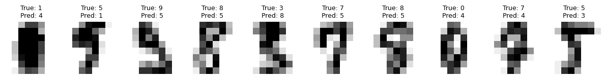

# 다범주 지표


## 정확도

가장 단순한 다범주 지표는 옳은 예측의 비율을 센다.

$$
\text{Accuracy} = \frac{1}{n}\sum_{i=1}^{n}\mathbf{1}[\hat{y}_i = y_i]
$$

정확도는 범주가 대략 균형 잡혀 있을 때 잘 작동하지만 그렇지 않으면 오도할 수 있다.

## 혼동행렬

$C\times C$ 혼동행렬 $M$의 원소 $M_{jk}$는 참 범주가 $j$이고 예측 범주가 $k$인 표본의 수다.
완벽한 분류기는 대각행렬을 만든다.

### 행렬 읽기

대각원소는 각 범주의 옳은 예측이다. 비대각 원소 $M_{jk}$($j\ne k$)는 범주 $j$가 범주 $k$로
잘못 분류된 횟수를 보여준다. MNIST에서는 시각적으로 비슷한 숫자끼리 혼동되는 양상이 흔하다
(예: 3과 5, 4와 9).

### 범주별 지표

각 범주를 일대다 이항 문제로 보면 혼동행렬에서 범주별 정밀도, 재현율, F1을 뽑아낼 수 있다.

| 지표 | 범주 $c$의 공식 |
|---|---|
| Precision$_c$ | $M_{cc} / \sum_j M_{jc}$ (열 합) |
| Recall$_c$ | $M_{cc} / \sum_k M_{ck}$ (행 합) |
| F1$_c$ | $2\cdot\text{Prec}_c\cdot\text{Rec}_c / (\text{Prec}_c+\text{Rec}_c)$ |

### 거시평균 대 미시평균

**거시평균**은 각 범주에 대해 지표를 독립적으로 계산한 뒤 평균한다. **미시평균**은 범주별
도수를 합산한 뒤 하나의 지표를 계산한다. 범주가 균형 잡혀 있으면 둘이 일치하고, 불균형하면
미시평균이 다수 범주에 지배된다. 자세한 내용은 [거시·미시·가중 평균](averaging.md)을 보라.

## scikit-learn으로 구현하기

```python
from sklearn.datasets import load_digits
from sklearn.model_selection import train_test_split
from sklearn.linear_model import LogisticRegression
from sklearn.metrics import confusion_matrix, classification_report

digits = load_digits()
x_train, x_test, y_train, y_test = train_test_split(
    digits.data, digits.target, test_size=0.2, random_state=1)

model = LogisticRegression(solver='lbfgs', max_iter=10_000)
model.fit(x_train, y_train)
print(f"Test accuracy: {model.score(x_test, y_test):.4f}")

y_pred = model.predict(x_test)
cm = confusion_matrix(y_test, y_pred)
print(cm)
print(classification_report(y_test, y_pred))
```

출력:

```
Test accuracy: 0.9722
[[42  0  0  0  1  0  0  0  0  0]
 [ 0 34  0  0  1  0  0  0  0  0]
 [ 0  0 36  0  0  0  0  0  0  0]
 [ 0  0  0 40  0  0  0  0  1  0]
 [ 0  0  0  0 38  0  0  0  0  0]
 [ 0  1  0  1  0 28  0  0  0  0]
 [ 0  0  0  0  0  0 37  0  0  0]
 [ 0  0  0  0  1  1  0 35  0  0]
 [ 0  0  0  0  0  2  0  0 27  0]
 [ 0  0  0  0  0  1  0  0  0 33]]
              precision    recall  f1-score   support

           0       1.00      0.98      0.99        43
           1       0.97      0.97      0.97        35
           2       1.00      1.00      1.00        36
           3       0.98      0.98      0.98        41
           4       0.93      1.00      0.96        38
           5       0.88      0.93      0.90        30
           6       1.00      1.00      1.00        37
           7       1.00      0.95      0.97        37
           8       0.96      0.93      0.95        29
           9       1.00      0.97      0.99        34

    accuracy                           0.97       360
   macro avg       0.97      0.97      0.97       360
weighted avg       0.97      0.97      0.97       360
```

검정 정확도는 $0.9722$다. 혼동행렬을 보면 오류가 매우 드물게 흩어져 있고, 가장 흔한 오류는
8을 5로 예측한 2건, 그다음이 각각 1건인 $0 \to 4$, $1 \to 4$, $3 \to 8$, $5 \to 1$ 등이다.

!!! note "`load_digits`는 MNIST가 아니다"
    scikit-learn의 `load_digits`는 $8 \times 8$ 화소의 저해상도 손글씨 숫자 1,797장이고,
    MNIST는 $28 \times 28$ 화소 70,000장이다. 특성 차원이 64 대 784로 훨씬 작아 로지스틱 회귀만으로도
    $97\%$를 넘는 정확도가 쉽게 나온다. MNIST에서 단층 소프트맥스의 정확도는 대체로 $92\%$
    수준이다. 두 자료의 숫자를 직접 비교해서는 안 된다.

## 오분류 시각화

잘못 분류된 이미지를 살펴보면 모형의 한계를 이해하고 특성공학이나 구조 개선의 방향을 잡을 수
있다.

```python
import numpy as np
import matplotlib.pyplot as plt

def draw_10_wrong_preds(x_test, y_test_cls, y_pred_cls, shape=(28, 28), k=10):
    """틀리게 예측한 사례를 앞에서부터 k개 보인다."""
    wrong = np.flatnonzero(y_test_cls != y_pred_cls)[:k]
    _, axes = plt.subplots(1, len(wrong), figsize=(1.2 * len(wrong), 2))
    for ax, idx in zip(np.atleast_1d(axes), wrong):
        ax.imshow(x_test[idx].reshape(shape), cmap='binary')
        ax.set_title(f'True: {y_test_cls[idx]}\nPred: {y_pred_cls[idx]}',
                     fontsize=9)
        ax.axis('off')
    plt.tight_layout()
    plt.show()


# load_digits는 8x8 이미지이므로 shape을 맞춰 준다
print(f"틀린 예측 {int((y_test != y_pred).sum())}건 / {len(y_test)}건")
draw_10_wrong_preds(x_test, y_test, y_pred, shape=(8, 8))
```

출력:

```
틀린 예측 10건 / 360건
```



!!! warning "이 함수는 MNIST 전용이며 두 가지 결함이 있다"
    1. `reshape((28, 28))`이 하드코딩되어 있어 위의 `load_digits` 자료($8 \times 8$)에는
       쓸 수 없다. `int(np.sqrt(x_test.shape[1]))`로 계산하거나 인자로 받아야 한다.
    2. `while` 루프에 경계 검사가 없다. 오분류가 10개 미만이면 `idx`가 배열 끝을 넘어
       `IndexError`가 난다. 위 `load_digits` 예제에서 오분류는 정확히 10건이라 아슬아슬하게
       통과하지만, 모형이 조금만 더 좋아지면 곧바로 깨진다. 미리
       `wrong = np.where(y_test_cls != y_pred_cls)[0]`로 색인을 모은 뒤
       `wrong[:10]`을 쓰는 편이 안전하다.

## 학습 곡선 그리기

```python
def draw_loss_and_accuracy(loss_trace, accuracy_trace):
    _, (ax0, ax1) = plt.subplots(1, 2, figsize=(12, 3))
    for ax, trace, title in zip(
            (ax0, ax1), (loss_trace, accuracy_trace), ("Loss", "Accuracy")):
        ax.plot(trace)
        ax.set_title(title)
    plt.tight_layout()
    plt.show()
```

## 연습문제

<div class="drillbox" markdown>

**연습문제 1.**
혼동행렬과 범주별 지표

3범주 분류기가 검정 표본 100개에서 다음 혼동행렬을 냈다.

|  | A로 예측 | B로 예측 | C로 예측 |
|:---:|:---:|:---:|:---:|
| **실제 A** | 25 | 5 | 0 |
| **실제 B** | 3 | 32 | 5 |
| **실제 C** | 2 | 3 | 25 |

**(a)** 전체 정확도를 계산하라.

**(b)** 각 범주의 정밀도, 재현율, F1 점수를 계산하라.

**(c)** 거시평균과 미시평균 F1 점수를 계산하라.

**(d)** 어느 범주의 성능이 가장 나쁜가? 혼동행렬은 흔한 오분류에 대해 무엇을 알려 주는가?

</div>

??? success "풀이"

    **(a)** 전체 정확도는 옳은 예측의 비율(대각합)이다.

    $$
    \text{Accuracy} = \frac{25 + 32 + 25}{100} = \frac{82}{100} = 0.82
    $$

    **(b)** 범주별로,

    **범주 A:**

    - 정밀도 $= 25 / (25 + 3 + 2) = 25/30 \approx 0.833$
    - 재현율 $= 25 / (25 + 5 + 0) = 25/30 \approx 0.833$
    - $F_1 = 2 \times 0.833 \times 0.833 / (0.833 + 0.833) = 0.833$

    **범주 B:**

    - 정밀도 $= 32 / (5 + 32 + 3) = 32/40 = 0.800$
    - 재현율 $= 32 / (3 + 32 + 5) = 32/40 = 0.800$
    - $F_1 = 0.800$

    **범주 C:**

    - 정밀도 $= 25 / (0 + 5 + 25) = 25/30 \approx 0.833$
    - 재현율 $= 25 / (2 + 3 + 25) = 25/30 \approx 0.833$
    - $F_1 = 0.833$

    **(c)** **거시평균 F1**(범주에 걸친 비가중 평균):

    $$
    F_1^{\text{macro}} = \frac{0.833 + 0.800 + 0.833}{3} = \frac{2.467}{3} \approx 0.822
    $$

    **미시평균 F1**: 미시 방식에서는 범주에 걸쳐 참양성, 위양성, 위음성을 모두 합산한다.

    - 총 TP $= 25 + 32 + 25 = 82$
    - 총 FP $= (3+2) + (5+3) + (0+5) = 5 + 8 + 5 = 18$
    - 총 FN $= (5+0) + (3+5) + (2+3) = 5 + 8 + 5 = 18$

    $$
    \text{Precision}_{\text{micro}} = \frac{82}{82 + 18} = 0.82, \quad \text{Recall}_{\text{micro}} = \frac{82}{82 + 18} = 0.82
    $$

    $$
    F_1^{\text{micro}} = 0.82
    $$

    총 FP와 총 FN이 둘 다 18로 같고 이것이 오분류 수와 일치한다는 점을 확인하라
    ([평균화 절](averaging.md)의 연습문제 2 참조). 이 자료는 범주 크기가 30, 40, 30으로 비교적
    균형 잡혀 있어 미시 F1($0.82$)과 거시 F1($0.822$)이 거의 같다.

    **(d)** 범주 B의 F1이 $0.800$으로 가장 낮다. 혼동행렬을 보면 범주 B는 3개를 A에게,
    5개를 C에게 잃는다. 가장 흔한 오류는 실제 A를 B로 예측한 5건과 실제 B를 C로 예측한 5건이다.
    B와 그 이웃 범주 사이의 결정경계를 다듬을 여지가 있음을 시사한다.

<div class="drillbox" markdown>

**연습문제 2.**
정밀도가 **열** 합으로, 재현율이 **행** 합으로 계산되는 이유를 혼동행렬의 정의로부터
설명하라. 두 방향을 혼동하면 어떤 오류가 생기는가?

</div>

??? success "풀이"

    행이 실제 범주, 열이 예측 범주인 규약에서,

    - **행 $c$의 합** $\sum_k M_{ck}$는 **실제로** 범주 $c$인 관측치의 총 수, 즉 $n_c$다.
      따라서 $M_{cc}/\sum_k M_{ck}$는 "실제 $c$ 중 옳게 잡은 비율"이므로 **재현율**이다.
    - **열 $c$의 합** $\sum_j M_{jc}$는 범주 $c$로 **예측된** 관측치의 총 수다. 따라서
      $M_{cc}/\sum_j M_{jc}$는 "$c$로 예측한 것 중 실제로 $c$인 비율"이므로 **정밀도**다.

    **혼동했을 때의 결과.** 두 지표가 뒤바뀌므로 진단이 정반대로 나온다. 어떤 범주를 지나치게
    자주 예측하는 모형은 그 범주의 재현율이 높고 정밀도가 낮은데, 뒤바꿔 읽으면 "이 범주를 잘
    못 찾아낸다"는 정반대의 결론에 이른다.

    **더 위험한 함정은 규약 자체다.** 행과 열의 의미가 문헌과 라이브러리마다 다를 수 있다.
    scikit-learn의 `confusion_matrix(y_true, y_pred)`는 행이 실제, 열이 예측이지만, 어떤
    교재는 반대로 쓴다. 혼동행렬을 만나면 언제나 **행 합이 무엇과 같은지** 먼저 확인하라.
    행 합이 각 범주의 실제 개수와 같으면 행 = 실제다. 이 절의 [혼동행렬](../../ch19/evaluation/confusion_matrix.md)
    페이지에서 다룬 2×2 표에서도 같은 확인이 필요하다. $\square$

<div class="drillbox" markdown>

**연습문제 3.**
`load_digits` 예제에서 로지스틱 회귀가 $97.2\%$의 정확도를 낸다. 같은 모형을 MNIST에 적용하면
왜 정확도가 더 낮게 나오는가? 두 결과를 비교할 수 있는가?

</div>

??? success "풀이"

    **비교할 수 없다.** 두 자료가 근본적으로 다르기 때문이다.

    | | `load_digits` | MNIST |
    |---|---|---|
    | 이미지 크기 | $8 \times 8$ | $28 \times 28$ |
    | 특성 차원 | 64 | 784 |
    | 표본 수 | 1,797 | 70,000 |
    | 출처 | 43명이 쓴 숫자를 축소 | 250명 이상, 훨씬 다양한 필체 |

    **`load_digits`가 더 쉬운 이유.**

    1. **필체의 다양성이 적다.** 필자가 43명뿐이고 전처리 과정에서 정규화가 강하게 적용되어
       같은 숫자의 변이가 작다.
    2. **$8 \times 8$로 축소하는 것 자체가 평활화다.** 세부 획의 차이가 뭉개져 오히려 범주 간
       구분이 단순해진다.
    3. **검정자료가 360장뿐이다.** 정확도의 표준오차가 $\sqrt{0.972 \times 0.028/360} = 0.0087$
       이므로, $97.2\%$라는 값의 95% 신뢰구간은 대략 $[95.5\%, 98.9\%]$로 상당히 넓다.

    MNIST에서 단층 소프트맥스 회귀의 검정 정확도는 대체로 $92\%$ 근처이고, 이층 신경망은
    $97$--$98\%$, CNN은 $99\%$를 넘는다. 즉 `load_digits`에서 로지스틱 회귀가 낸 $97.2\%$는
    MNIST의 $97.2\%$와 전혀 다른 성취다.

    **일반적 교훈:** 정확도 수치는 **자료와 함께** 인용해야 의미가 있다. "이 모형은 97%의
    정확도를 낸다"는 문장은 어떤 자료에서, 어떤 크기의 검정집합으로 측정했는지를 밝히지 않으면
    정보가 없는 것이나 마찬가지다. $\square$
