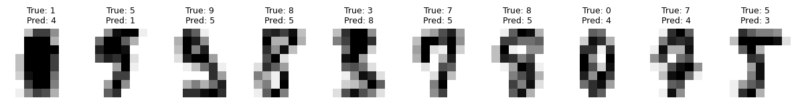

# 다범주 지표


## 정확도

가장 단순한 다범주 지표는 옳은 예측의 비율을 센다.

$$
\text{Accuracy} = \frac{1}{n}\sum_{i=1}^{n}\mathbf{1}[\hat{y}_i = y_i]
$$

정확도는 범주가 대략 균형 잡혀 있을 때 잘 작동하지만 그렇지 않으면 오도할 수 있다.

## 혼동행렬

$C\times C$ 혼동행렬 $M$의 원소 $M_{jk}$는 참 범주가 $j$이고 예측 범주가 $k$인 표본의 수다.
완벽한 분류기는 대각행렬을 만든다.

### 행렬 읽기

대각원소는 각 범주의 옳은 예측이다. 비대각 원소 $M_{jk}$($j\ne k$)는 범주 $j$가 범주 $k$로
잘못 분류된 횟수를 보여준다. MNIST에서는 시각적으로 비슷한 숫자끼리 혼동되는 양상이 흔하다
(예: 3과 5, 4와 9).

### 범주별 지표

각 범주를 일대다 이항 문제로 보면 혼동행렬에서 범주별 정밀도, 재현율, F1을 뽑아낼 수 있다.

| 지표 | 범주 $c$의 공식 |
|---|---|
| Precision$_c$ | $M_{cc} / \sum_j M_{jc}$ (열 합) |
| Recall$_c$ | $M_{cc} / \sum_k M_{ck}$ (행 합) |
| F1$_c$ | $2\cdot\text{Prec}_c\cdot\text{Rec}_c / (\text{Prec}_c+\text{Rec}_c)$ |

### 거시평균 대 미시평균

**거시평균**은 각 범주에 대해 지표를 독립적으로 계산한 뒤 평균한다. **미시평균**은 범주별
도수를 합산한 뒤 하나의 지표를 계산한다. 범주가 균형 잡혀 있으면 둘이 일치하고, 불균형하면
미시평균이 다수 범주에 지배된다. 자세한 내용은 [거시·미시·가중 평균](averaging.md)을 보라.

## scikit-learn으로 구현하기

<div class="exbox" markdown>

**보기 1.** <span class="diff easy" title="쉬움"></span> 손글씨 숫자 분류와 혼동행렬. `load_digits`의 $1{,}797$장을 $8:2$로 나누어 로지스틱 회귀를 적합하고 $10 \times 10$ 혼동행렬을 본다.

**(1)** 아래 혼동행렬에서 전체 정확도와 **범주 5**의 정밀도·재현율·F1을 손으로 구하시오.

**(2)** 열 범주 가운데 범주 5의 정밀도가 가장 낮다. 혼동행렬의 어느 칸들이 그렇게 만들었는가. `classification_report`와 맞춰 확인하시오.

</div>

??? success "풀이"

    **(1) 손으로.** 대각선을 더하면

    $$
    \operatorname{tr}(\mathbf{M}) = 42+34+36+40+38+28+37+35+27+33 = 350
    $$

    이고 전체는 $360$이므로

    $$
    \text{Accuracy} = \frac{350}{360} = 0.97222\ldots \approx 0.9722
    $$

    이다. 틀린 것은 $360 - 350 = 10$건이며, 이 수가 다음 보기에서 다시 쓰인다.

    범주 5의 행은 $(0,1,0,1,0,28,0,0,0,0)$이라 행 합이 $30$이고, 열은 세로로 $0,0,0,0,0,28,0,1,2,1$이라 열 합이 $32$다. 그러므로

    $$
    P_5 = \frac{M_{55}}{\text{열 합}} = \frac{28}{32} = 0.8750,
    \qquad
    R_5 = \frac{M_{55}}{\text{행 합}} = \frac{28}{30} = 0.9333
    $$

    이고

    $$
    F_{1,5} = \frac{2 \cdot 0.8750 \cdot 0.9333}{0.8750 + 0.9333}
    = \frac{1.6333}{1.8083} = 0.9032
    $$

    이다. 보고서의 소수 둘째 자리 표기 $0.88$, $0.93$, $0.90$과 맞는다.

    **(2) 범주 5는 남의 것을 받아 온다.** 열 $5$의 비대각 칸은 $M_{75} = 1$, $M_{85} = 2$, $M_{95} = 1$로 **위양성 네 건**이다. 열 번의 오류 가운데 넷이 "$5$로 예측"인 셈이다. 그래서 분모가 $28 + 4 = 32$로 불어나 정밀도가 $0.875$까지 내려간다.

    반대로 **범주 4는 재현율이 완벽하다.** 행 $4$의 비대각이 모두 $0$이라 $R_4 = 38/38 = 1.000$인데, 열 $4$에는 $M_{04} = M_{14} = M_{74} = 1$로 위양성이 셋 들어와 $P_4 = 38/41 = 0.9268 \approx 0.93$이다. **정밀도가 낮은 범주는 못 맞히는 범주가 아니라 남의 사례를 끌어오는 범주다.** $5$와 $4$가 바로 그런 자리이며, 열 번의 오류 가운데 **일곱이 이 둘 중 하나로 예측**되었다.

    **수치적으로.**

    ```python
    from sklearn.datasets import load_digits
    from sklearn.model_selection import train_test_split
    from sklearn.linear_model import LogisticRegression
    from sklearn.metrics import confusion_matrix, classification_report

    # 8x8 손글씨 숫자 자료. 범주가 열 개인 다범주 분류 문제다.
    digits = load_digits()
    x_train, x_test, y_train, y_test = train_test_split(
        digits.data, digits.target, test_size=0.2, random_state=1)

    model = LogisticRegression(solver='lbfgs', max_iter=10_000)
    model.fit(x_train, y_train)
    print(f"Test accuracy: {model.score(x_test, y_test):.4f}")

    y_pred = model.predict(x_test)
    # 열 범주이므로 혼동행렬이 10x10 이 된다. 대각선이 맞힌 것이고, 대각선을
    # 벗어난 칸이 어느 숫자를 어느 숫자로 헷갈렸는지 말해 준다.
    cm = confusion_matrix(y_test, y_pred)
    print(cm)
    print(classification_report(y_test, y_pred))
    ```

    출력:

    ```
    Test accuracy: 0.9722
    [[42  0  0  0  1  0  0  0  0  0]
     [ 0 34  0  0  1  0  0  0  0  0]
     [ 0  0 36  0  0  0  0  0  0  0]
     [ 0  0  0 40  0  0  0  0  1  0]
     [ 0  0  0  0 38  0  0  0  0  0]
     [ 0  1  0  1  0 28  0  0  0  0]
     [ 0  0  0  0  0  0 37  0  0  0]
     [ 0  0  0  0  1  1  0 35  0  0]
     [ 0  0  0  0  0  2  0  0 27  0]
     [ 0  0  0  0  0  1  0  0  0 33]]
                  precision    recall  f1-score   support

               0       1.00      0.98      0.99        43
               1       0.97      0.97      0.97        35
               2       1.00      1.00      1.00        36
               3       0.98      0.98      0.98        41
               4       0.93      1.00      0.96        38
               5       0.88      0.93      0.90        30
               6       1.00      1.00      1.00        37
               7       1.00      0.95      0.97        37
               8       0.96      0.93      0.95        29
               9       1.00      0.97      0.99        34

        accuracy                           0.97       360
       macro avg       0.97      0.97      0.97       360
    weighted avg       0.97      0.97      0.97       360
    ```

    **손으로 구한 값이 모두 맞는다.** 검정 정확도 $0.9722 = 350/360$이고, 범주 5의 줄이 $0.88$, $0.93$, $0.90$으로 계산한 $0.8750$, $0.9333$, $0.9032$를 소수 둘째 자리로 반올림한 것이다. 범주 4의 줄도 $0.93$, $1.00$, $0.96$으로 $0.9268$, $1.0000$, $0.9620$과 맞는다.

    혼동행렬을 보면 오류가 매우 드물게 흩어져 있고, 가장 흔한 오류는 8을 5로 예측한 2건, 그다음이 각각 1건인 $0 \to 4$, $1 \to 4$, $3 \to 8$, $5 \to 1$ 등이다.

    보고서 아래쪽의 `accuracy`, `macro avg`, `weighted avg`가 모두 $0.97$로 찍히는 것도 눈여겨볼 만하다. 자료가 거의 균형 잡혀 있고($29$에서 $43$ 사이) 모든 범주가 고르게 잘 맞으므로 어떤 가중치로 평균해도 비슷해지는 것이다. **범주가 불균형하거나 한 범주만 망가지면 이 셋이 곧바로 갈라진다.** 그 경우를 다루는 것이 [거시·미시·가중 평균](averaging.md)이다.

    !!! warning "이 블록은 몇 분 걸린다"
        특성을 척도화하지 않은 채 `max_iter=10_000`으로 lbfgs를 돌리므로 수렴이 느리다. `digits.data / 16.0`으로 나누어 넣으면 반복이 $81$번에 끝나 훨씬 빠르지만, 그러면 **정확도가 $0.9806$으로 달라져** 아래 혼동행렬도 바뀐다. 여기서는 출력을 그대로 두기 위해 원래 코드를 유지했다.

!!! note "`load_digits`는 MNIST가 아니다"
    scikit-learn의 `load_digits`는 $8 \times 8$ 화소의 저해상도 손글씨 숫자 1,797장이고,
    MNIST는 $28 \times 28$ 화소 70,000장이다. 특성 차원이 64 대 784로 훨씬 작아 로지스틱 회귀만으로도
    $97\%$를 넘는 정확도가 쉽게 나온다. MNIST에서 단층 소프트맥스의 정확도는 대체로 $92\%$
    수준이다. 두 자료의 숫자를 직접 비교해서는 안 된다.

## 오분류 시각화

잘못 분류된 이미지를 살펴보면 모형의 한계를 이해하고 특성공학이나 구조 개선의 방향을 잡을 수
있다.

<div class="exbox" markdown>

**보기 2.** <span class="diff easy" title="쉬움"></span> 틀린 예측 들여다보기. 보기 1에서 틀린 사례를 모두 그려 본다.

**(1)** 보기 1의 혼동행렬만 보고, 이 그림에 몇 장이 나오며 **예측 이름표**가 어떻게 분포할지 미리 말하시오.

**(2)** 그려 보고 무엇이 읽히는지 적으시오. 이 그림이 **가리는 것**은 무엇인가.

</div>

??? success "풀이"

    **(1) 그림을 보기 전에 셀 수 있다.** 오분류 수는 $n - \operatorname{tr}(\mathbf{M}) = 360 - 350 = 10$건이고, 함수의 기본값이 $k = 10$이므로 **열 장이 모두 나온다.** 하나도 빠지지 않는다.

    예측 이름표의 분포도 혼동행렬의 비대각 열 합으로 정해진다. 열별로 더하면 $5$가 네 번($M_{75}, M_{85} = 2, M_{95}$), $4$가 세 번($M_{04}, M_{14}, M_{74}$), $1$·$3$·$8$이 한 번씩이다. 참 이름표 쪽은 행 합으로 $5$가 둘, $7$이 둘, $8$이 둘, 그리고 $0$·$1$·$3$·$9$가 하나씩이다.

    **(2) 그림.**

    ```python
    import numpy as np
    import matplotlib.pyplot as plt

    def draw_10_wrong_preds(x_test, y_test_cls, y_pred_cls, shape=(28, 28), k=10):
        """틀리게 예측한 사례를 앞에서부터 k개 보인다."""
        wrong = np.flatnonzero(y_test_cls != y_pred_cls)[:k]
        _, axes = plt.subplots(1, len(wrong), figsize=(1.2 * len(wrong), 2))
        for ax, idx in zip(np.atleast_1d(axes), wrong):
            ax.imshow(x_test[idx].reshape(shape), cmap='binary')
            ax.set_title(f'True: {y_test_cls[idx]}\nPred: {y_pred_cls[idx]}',
                         fontsize=9)
            ax.axis('off')
        plt.tight_layout()
        plt.show()


    # load_digits는 8x8 이미지이므로 shape을 맞춰 준다
    print(f"틀린 예측 {int((y_test != y_pred).sum())}건 / {len(y_test)}건")
    draw_10_wrong_preds(x_test, y_test, y_pred, shape=(8, 8))
    ```

    출력:

    ```
    틀린 예측 10건 / 360건
    ```

    

    **(1)의 예고가 맞는다.** "틀린 예측 10건"이 찍히고 그림에도 열 장이 나온다. 왼쪽부터 참 $\to$ 예측이 $1 \to 4$, $5 \to 1$, $9 \to 5$, $8 \to 5$, $3 \to 8$, $7 \to 5$, $8 \to 5$, $0 \to 4$, $7 \to 4$, $5 \to 3$이다. 예측 이름표를 세면 $5$가 넷, $4$가 셋, 그리고 $1$·$8$·$3$이 하나씩으로 혼동행렬의 열 합과 정확히 같다. 참 이름표도 $5$·$7$·$8$이 둘씩, 나머지가 하나씩으로 행 합과 같다.

    **읽히는 것.** 첫 장의 $1$은 획이 뭉개져 세로획이 통째로 검게 칠해져 있고, 네 번째와 일곱 번째의 $8$은 위아래 고리가 붙어 $5$처럼 보인다. **$8 \times 8$이라는 해상도에서는 사람이 보아도 갈라 내기 어려운 것들**이며, 열 건 가운데 명백히 모형 탓으로 보이는 것은 많지 않다. 보기 1에서 "$5$와 $4$가 남의 사례를 끌어온다"고 읽은 것이 그림에서 그대로 확인된다.

    **가리는 것은 확신도다.** 이 그림에는 모형이 **얼마나 확신하며 틀렸는지**가 전혀 없다. $0.98$의 확률로 틀린 것과 $0.34$ 대 $0.33$으로 간신히 갈려 틀린 것이 똑같이 그려진다. 앞의 것은 모형의 결함이고 뒤의 것은 자료의 모호함인데, 그 구별이 지워지는 것이다. 제목에 `predict_proba`의 최댓값을 함께 찍으면 바로 해결된다.

    **맞힌 $350$장도 가린다.** 아슬아슬하게 맞힌 사례는 이 그림에 끼지 못하지만 모형의 약점을 드러내기로는 틀린 것 못지않다. 그리고 $k = 10$이 고정이라 오분류가 더 많았다면 **앞의 열 장만 보고 나머지를 못 본 채** 넘어갔을 것이다. 여기서는 마침 정확히 열 건이어서 전부가 보인 것뿐이다.

!!! warning "이 함수는 MNIST 전용이며 두 가지 결함이 있다"
    1. `reshape((28, 28))`이 하드코딩되어 있어 위의 `load_digits` 자료($8 \times 8$)에는
       쓸 수 없다. `int(np.sqrt(x_test.shape[1]))`로 계산하거나 인자로 받아야 한다.
    2. `while` 루프에 경계 검사가 없다. 오분류가 10개 미만이면 `idx`가 배열 끝을 넘어
       `IndexError`가 난다. 위 `load_digits` 보기에서 오분류는 정확히 10건이라 아슬아슬하게
       통과하지만, 모형이 조금만 더 좋아지면 곧바로 깨진다. 미리
       `wrong = np.where(y_test_cls != y_pred_cls)[0]`로 색인을 모은 뒤
       `wrong[:10]`을 쓰는 편이 안전하다.

## 학습 곡선 그리기

<div class="exbox" markdown>

**보기 3.** <span class="diff easy" title="쉬움"></span> 손실과 정확도 곡선. 세대마다의 손실과 정확도를 나란히 그리는 함수다.

**(1)** 함수의 설명문은 "손실은 내려가고 정확도는 올라가야 한다"고 말한다. **손실이 내려가는데 정확도가 떨어지는 일**이 실제로 가능한가. 가능하다면 사례 두 개짜리 반례를 만들어 보이시오.

**(2)** 실제 학습에서도 그런 세대가 나타나는지 확인하시오.

</div>

??? success "풀이"

    **(1) 가능하다.** 둘은 같은 것을 재지 않는다. 교차엔트로피는 **확률의 매끄러운 함수**이고

    $$
    J = -\sum_i \log \hat p_i
    $$

    로 확률이 조금만 움직여도 조금씩 변한다. 반면 정확도는 **$\hat p$가 문턱을 넘느냐 마느냐만 보는 계단함수**다. 그러므로 확률을 문턱에서 **멀리** 밀어 손실을 크게 줄이면서, 동시에 다른 사례를 문턱 너머로 **살짝** 떨어뜨릴 수 있다.

    사례 둘로 만든다. 참 이름표가 둘 다 양성이고 모형이 준 양성 확률이 $\mathbf{p}$라 하자.

    | | $p_1$ | $p_2$ | 손실 $-\log p_1 - \log p_2$ | 정확도 |
    |:---|:---:|:---:|:---:|:---:|
    | 앞 | $0.55$ | $0.51$ | $0.5978 + 0.6733 = 1.2712$ | $2/2 = 1.00$ |
    | 뒤 | $0.95$ | $0.49$ | $0.0513 + 0.7133 = 0.7646$ | $1/2 = 0.50$ |

    손실은 $1.2712$에서 $0.7646$으로 **$0.5066$만큼 내려갔는데** 정확도는 $1.00$에서 $0.50$으로 반토막이 났다. 첫 사례를 $0.55 \to 0.95$로 밀어 번 것이 $0.5466$이고 둘째 사례가 $0.51 \to 0.49$로 미끄러져 잃은 것은 $0.0400$뿐이다. **손실의 눈으로는 남는 장사**인데, 그 미끄러진 $0.02$가 하필 문턱을 가로지른다.

    경사하강이 최소화하는 것이 손실이지 정확도가 아니라는 사실이 여기서 나온다. 정확도는 거의 모든 곳에서 기울기가 $0$인 계단함수라 애초에 밀 수가 없다. 함수 설명문의 조언("자료가 치우쳤는지 살펴볼 일이다")은 흔한 원인 하나를 짚은 것이고, **치우침이 전혀 없어도 이 어긋남은 일어난다.**

    **(2) 실제 학습에서도 나타난다.** 같은 `load_digits` 훈련자료에 소프트맥스 회귀를 전체배치 경사하강으로 $300$세대 민다. 손실과 정확도를 **둘 다 훈련자료에서** 재어 일반화 문제와 섞이지 않게 한다.

    ```python
    import numpy as np
    from sklearn.datasets import load_digits
    from sklearn.model_selection import train_test_split

    def draw_loss_and_accuracy(loss_trace, accuracy_trace):
        """세대마다의 손실과 정확도를 나란히 그린다.

        손실은 내려가고 정확도는 올라가야 한다. 손실이 내려가는데 정확도가
        따라 오르지 않으면 자료가 한쪽으로 치우쳤는지 살펴볼 일이다.
        """
        _, (ax0, ax1) = plt.subplots(1, 2, figsize=(12, 3))
        for ax, trace, title in zip(
                (ax0, ax1), (loss_trace, accuracy_trace), ("Loss", "Accuracy")):
            ax.plot(trace)
            ax.set_title(title)
        plt.tight_layout()
        plt.show()

    # (1) 두 사례만으로 만든 반례. 둘 다 참 이름표가 양성이고 수는 양성 확률이다.
    for name, p in (("앞", np.array([0.55, 0.51])), ("뒤", np.array([0.95, 0.49]))):
        print(f"{name}: p = {p},  손실 {-np.log(p).sum():.4f},"
              f"  정확도 {(p > 0.5).mean():.2f}")

    # (2) 실제 학습에서도 일어나는지 본다. 작은 소프트맥스 회귀를 전체배치
    # 경사하강으로 300 세대 민다. 손실과 정확도를 모두 훈련자료에서 잰다.
    d = load_digits()
    X, _, y, _ = train_test_split(d.data / 16.0, d.target,
                                  test_size=0.2, random_state=1)
    X = np.hstack([X, np.ones((len(X), 1))])
    Y = np.eye(10)[y]
    W = np.zeros((X.shape[1], 10))

    loss_trace, acc_trace = [], []
    for epoch in range(300):
        Z = X @ W
        Z -= Z.max(axis=1, keepdims=True)
        P = np.exp(Z)
        P /= P.sum(axis=1, keepdims=True)
        loss_trace.append(-np.log(P[np.arange(len(y)), y]).mean())
        acc_trace.append((P.argmax(axis=1) == y).mean())
        W -= 0.5 * X.T @ (P - Y) / len(y)

    loss_trace, acc_trace = np.array(loss_trace), np.array(acc_trace)
    print(f"\n손실 {loss_trace[0]:.4f} -> {loss_trace[-1]:.4f}"
          f"   (세대마다 반드시 감소: {bool(np.all(np.diff(loss_trace) < 0))})")
    print(f"정확도 {acc_trace[0]:.4f} -> {acc_trace[-1]:.4f}")

    down = np.flatnonzero(np.diff(acc_trace) < 0)
    print(f"손실이 내려갔는데 정확도도 내려간 세대 {len(down)}번: {down + 1}")
    for e in down[:3]:
        print(f"  세대 {e + 1} -> {e + 2}:  손실 {loss_trace[e]:.4f}"
              f" -> {loss_trace[e + 1]:.4f},"
              f"  정확도 {acc_trace[e]:.4f} -> {acc_trace[e + 1]:.4f}")
    ```

    출력:

    ```
    앞: p = [0.55 0.51],  손실 1.2712,  정확도 1.00
    뒤: p = [0.95 0.49],  손실 0.7646,  정확도 0.50

    손실 2.3026 -> 0.2251   (세대마다 반드시 감소: True)
    정확도 0.0939 -> 0.9589
    손실이 내려갔는데 정확도도 내려간 세대 5번: [ 6  8 22 46 79]
      세대 6 -> 7:  손실 1.8698 -> 1.7967,  정확도 0.8991 -> 0.8970
      세대 8 -> 9:  손실 1.7276 -> 1.6625,  정확도 0.8977 -> 0.8970
      세대 22 -> 23:  손실 1.0901 -> 1.0615,  정확도 0.9068 -> 0.9061
    ```

    **(1)의 표가 그대로 재현된다.** 손실 $1.2712 \to 0.7646$, 정확도 $1.00 \to 0.50$이다.

    그리고 실제 학습에서도 일어난다. 손실은 $299$번의 갱신에서 **한 번도 빠짐없이** 내려가는데($2.3026 \to 0.2251$), 훈련 정확도는 그중 **다섯 번 떨어진다.** 세대 $6 \to 7$에서 손실이 $1.8698$에서 $1.7967$로 내려가는 동안 정확도는 $0.8991$에서 $0.8970$으로 내려갔다. $1{,}437$개 가운데 세 개가 문턱을 거꾸로 넘은 것이다.

    **그러므로 곡선의 작은 역행을 보고 자료를 의심할 일은 아니다.** 떨어진 폭이 $0.002$ 남짓이라 이 함수가 그려 주는 눈금($0.09$에서 $0.96$까지)에서는 아예 보이지도 않는다. **곡선으로 보아야 할 것은 추세이고, 한 세대씩의 들쭉날쭉은 수로 확인해야 한다.**

## 연습문제

<div class="drillbox" markdown>

**연습문제 1.** <span class="diff easy" title="쉬움"></span>
혼동행렬과 범주별 지표

3범주 분류기가 검정 표본 100개에서 다음 혼동행렬을 냈다.

|  | A로 예측 | B로 예측 | C로 예측 |
|:---:|:---:|:---:|:---:|
| **실제 A** | 25 | 5 | 0 |
| **실제 B** | 3 | 32 | 5 |
| **실제 C** | 2 | 3 | 25 |

**(a)** 전체 정확도를 계산하라.

**(b)** 각 범주의 정밀도, 재현율, F1 점수를 계산하라.

**(c)** 거시평균과 미시평균 F1 점수를 계산하라.

**(d)** 어느 범주의 성능이 가장 나쁜가? 혼동행렬은 흔한 오분류에 대해 무엇을 알려 주는가?

</div>

??? success "풀이"

    **(a)** 전체 정확도는 옳은 예측의 비율(대각합)이다.

    $$
    \text{Accuracy} = \frac{25 + 32 + 25}{100} = \frac{82}{100} = 0.82
    $$

    **(b)** 범주별로,

    **범주 A:**

    - 정밀도 $= 25 / (25 + 3 + 2) = 25/30 \approx 0.833$
    - 재현율 $= 25 / (25 + 5 + 0) = 25/30 \approx 0.833$
    - $F_1 = 2 \times 0.833 \times 0.833 / (0.833 + 0.833) = 0.833$

    **범주 B:**

    - 정밀도 $= 32 / (5 + 32 + 3) = 32/40 = 0.800$
    - 재현율 $= 32 / (3 + 32 + 5) = 32/40 = 0.800$
    - $F_1 = 0.800$

    **범주 C:**

    - 정밀도 $= 25 / (0 + 5 + 25) = 25/30 \approx 0.833$
    - 재현율 $= 25 / (2 + 3 + 25) = 25/30 \approx 0.833$
    - $F_1 = 0.833$

    **(c)** **거시평균 F1**(범주에 걸친 비가중 평균):

    $$
    F_1^{\text{macro}} = \frac{0.833 + 0.800 + 0.833}{3} = \frac{2.467}{3} \approx 0.822
    $$

    **미시평균 F1**: 미시 방식에서는 범주에 걸쳐 참양성, 위양성, 위음성을 모두 합산한다.

    - 총 TP $= 25 + 32 + 25 = 82$
    - 총 FP $= (3+2) + (5+3) + (0+5) = 5 + 8 + 5 = 18$
    - 총 FN $= (5+0) + (3+5) + (2+3) = 5 + 8 + 5 = 18$

    $$
    \text{Precision}_{\text{micro}} = \frac{82}{82 + 18} = 0.82, \quad \text{Recall}_{\text{micro}} = \frac{82}{82 + 18} = 0.82
    $$

    $$
    F_1^{\text{micro}} = 0.82
    $$

    총 FP와 총 FN이 둘 다 18로 같고 이것이 오분류 수와 일치한다는 점을 확인하라
    ([평균화 절](averaging.md)의 연습문제 2 참조). 이 자료는 범주 크기가 30, 40, 30으로 비교적
    균형 잡혀 있어 미시 F1($0.82$)과 거시 F1($0.822$)이 거의 같다.

    **(d)** 범주 B의 F1이 $0.800$으로 가장 낮다. 혼동행렬을 보면 범주 B는 3개를 A에게,
    5개를 C에게 잃는다. 가장 흔한 오류는 실제 A를 B로 예측한 5건과 실제 B를 C로 예측한 5건이다.
    B와 그 이웃 범주 사이의 결정경계를 다듬을 여지가 있음을 시사한다.

<div class="drillbox" markdown>

**연습문제 2.** <span class="diff med" title="중간"></span>
정밀도가 **열** 합으로, 재현율이 **행** 합으로 계산되는 이유를 혼동행렬의 정의로부터
설명하라. 두 방향을 혼동하면 어떤 오류가 생기는가?

</div>

??? success "풀이"

    행이 실제 범주, 열이 예측 범주인 규약에서,

    - **행 $c$의 합** $\sum_k M_{ck}$는 **실제로** 범주 $c$인 관측치의 총 수, 즉 $n_c$다.
      따라서 $M_{cc}/\sum_k M_{ck}$는 "실제 $c$ 중 옳게 잡은 비율"이므로 **재현율**이다.
    - **열 $c$의 합** $\sum_j M_{jc}$는 범주 $c$로 **예측된** 관측치의 총 수다. 따라서
      $M_{cc}/\sum_j M_{jc}$는 "$c$로 예측한 것 중 실제로 $c$인 비율"이므로 **정밀도**다.

    **혼동했을 때의 결과.** 두 지표가 뒤바뀌므로 진단이 정반대로 나온다. 어떤 범주를 지나치게
    자주 예측하는 모형은 그 범주의 재현율이 높고 정밀도가 낮은데, 뒤바꿔 읽으면 "이 범주를 잘
    못 찾아낸다"는 정반대의 결론에 이른다.

    **더 위험한 함정은 규약 자체다.** 행과 열의 의미가 문헌과 라이브러리마다 다를 수 있다.
    scikit-learn의 `confusion_matrix(y_true, y_pred)`는 행이 실제, 열이 예측이지만, 어떤
    교재는 반대로 쓴다. 혼동행렬을 만나면 언제나 **행 합이 무엇과 같은지** 먼저 확인하라.
    행 합이 각 범주의 실제 개수와 같으면 행 = 실제다. 이 절의 [혼동행렬](../../ch19/evaluation/confusion_matrix.md)
    페이지에서 다룬 2×2 표에서도 같은 확인이 필요하다. $\square$

<div class="drillbox" markdown>

**연습문제 3.** <span class="diff med" title="중간"></span>
`load_digits` 보기에서 로지스틱 회귀가 $97.2\%$의 정확도를 낸다. 같은 모형을 MNIST에 적용하면
왜 정확도가 더 낮게 나오는가? 두 결과를 비교할 수 있는가?

</div>

??? success "풀이"

    **비교할 수 없다.** 두 자료가 근본적으로 다르기 때문이다.

    | | `load_digits` | MNIST |
    |---|---|---|
    | 이미지 크기 | $8 \times 8$ | $28 \times 28$ |
    | 특성 차원 | 64 | 784 |
    | 표본 수 | 1,797 | 70,000 |
    | 출처 | 43명이 쓴 숫자를 축소 | 250명 이상, 훨씬 다양한 필체 |

    **`load_digits`가 더 쉬운 이유.**

    1. **필체의 다양성이 적다.** 필자가 43명뿐이고 전처리 과정에서 정규화가 강하게 적용되어
       같은 숫자의 변이가 작다.
    2. **$8 \times 8$로 축소하는 것 자체가 평활화다.** 세부 획의 차이가 뭉개져 오히려 범주 간
       구분이 단순해진다.
    3. **검정자료가 360장뿐이다.** 정확도의 표준오차가 $\sqrt{0.972 \times 0.028/360} = 0.0087$
       이므로, $97.2\%$라는 값의 95% 신뢰구간은 대략 $[95.5\%, 98.9\%]$로 상당히 넓다.

    MNIST에서 단층 소프트맥스 회귀의 검정 정확도는 대체로 $92\%$ 근처이고, 이층 신경망은
    $97$--$98\%$, CNN은 $99\%$를 넘는다. 즉 `load_digits`에서 로지스틱 회귀가 낸 $97.2\%$는
    MNIST의 $97.2\%$와 전혀 다른 성취다.

    **일반적 교훈:** 정확도 수치는 **자료와 함께** 인용해야 의미가 있다. "이 모형은 97%의
    정확도를 낸다"는 문장은 어떤 자료에서, 어떤 크기의 검정집합으로 측정했는지를 밝히지 않으면
    정보가 없는 것이나 마찬가지다. $\square$

---

## 정리하며

다범주 지표는 **혼동행렬이 $C\times C$ 로 커진 것**에서 시작한다.

- **정확도는 대각합을 전체로 나눈 값이다.** 가장 단순하지만 범주가 불균형하면 오도한다.
- **범주별 정밀도·재현율이 $C$ 쌍 나온다.** 어느 범주가 잘 맞고 어느 범주가 혼동되는지는 **혼동행렬을 직접 봐야** 알 수 있다.
- **혼동의 패턴이 정보다.** MNIST 에서 4 와 9, 3 과 5 가 자주 뒤바뀌는 식이며, 그 구조가 모형 개선의 단서가 된다.
- **균형 정확도가 유용하다.** 범주별 재현율의 평균이며, 불균형 자료에서 정확도보다 정직하다.
- **하나의 수로 요약하려면 평균 방식을 정해야 한다.** 다음 절의 주제다.

다음 절 **평균 방식**으로 넘어간다.
