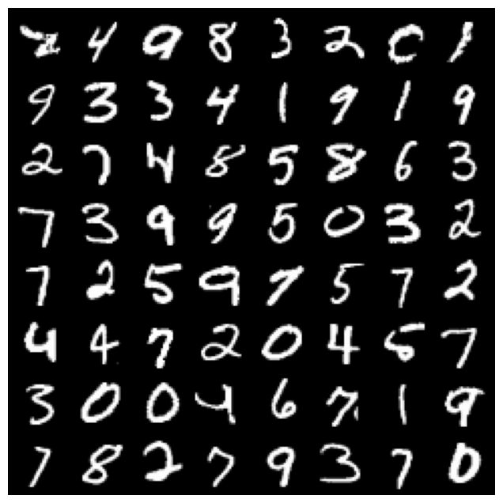
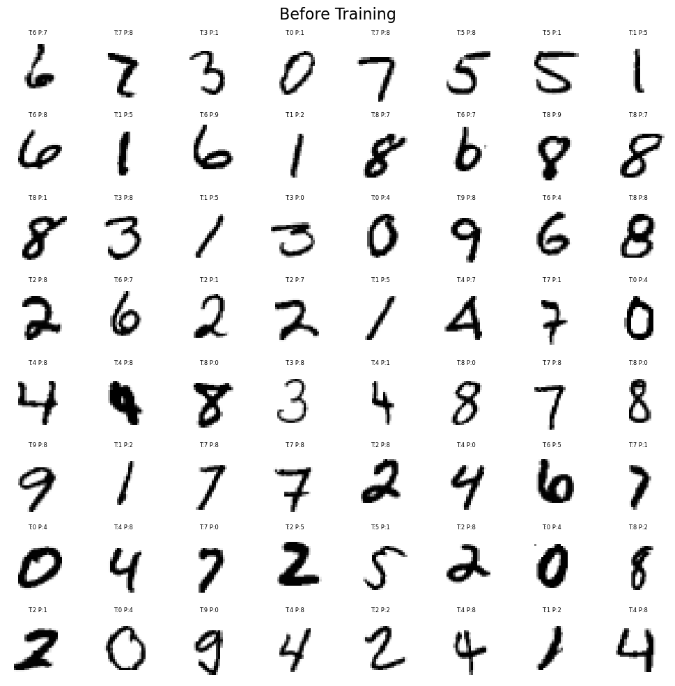
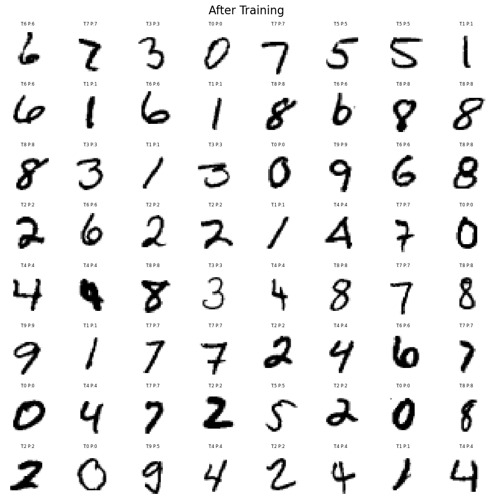

# MNIST 사례연구


## 개요

이 절에서는 이 장에서 전개한 이론을 MNIST 손글씨 숫자 자료(훈련 이미지 60,000장, 검정 이미지
10,000장, $28\times 28$ 화소, 10범주)에 적용한다. 복잡도가 점점 커지는 세 가지 구조 --- 단일
선형층, 이층 신경망, 간단한 CNN --- 을 PyTorch로 구현해 비교한다.

---

## 1  자료 시각화

<div class="codebox" markdown>

**예제 1.** MNIST 자료 읽기

```python
import torch
import torchvision
from torchvision import transforms
import matplotlib.pyplot as plt

# ToTensor 는 PIL 이미지를 텐서로 바꾸면서 화소값을 0~255 에서 0~1 로
# 나눠 준다. 이 눈금 맞추기를 빠뜨리면 학습이 잘 되지 않는다.
transform = transforms.ToTensor()
train_dataset = torchvision.datasets.MNIST(
    root='./data', train=True, download=True, transform=transform)
test_dataset = torchvision.datasets.MNIST(
    root='./data', train=False, download=True, transform=transform)

# DataLoader 가 자료를 묶음으로 잘라 넘겨준다. shuffle=True 는 세대마다
# 순서를 섞는다는 뜻이고, 이래야 묶음 사이의 기울기가 서로 닮지 않는다.
train_loader = torch.utils.data.DataLoader(
    train_dataset, batch_size=64, shuffle=True)
test_loader = torch.utils.data.DataLoader(
    test_dataset, batch_size=64, shuffle=True)

print(f"train {len(train_dataset)}, test {len(test_dataset)}")

images, labels = next(iter(test_loader))
img_grid = torchvision.utils.make_grid(images, nrow=8, padding=2)

plt.figure(figsize=(8, 8))
plt.imshow(img_grid.permute(1, 2, 0), cmap='gray')
plt.axis('off')
plt.show()
```

출력:

```
train 60000, test 10000
```

</div>



---

## 2  단일 선형층(소프트맥스 회귀)

가장 단순한 모형이다. 이미지를 펼친 뒤 선형변환 하나를 적용하고 소프트맥스를 씌운다
(`CrossEntropyLoss`가 소프트맥스를 내부에서 처리한다).

<div class="codebox" markdown>

**예제 2.** 선형 모형 학습

```python
import torch.nn as nn
import torch.optim as optim

class SimpleMNIST(nn.Module):
    """28x28 화소를 곧바로 열 범주로 보내는 선형층 하나짜리 모형.

    사실상 소프트맥스 회귀다. 신경망이라 부르기도 민망한 구조인데도
    MNIST 에서 92% 가까이 나온다 — 자료가 그만큼 쉽다는 뜻이기도 하다.
    """

    def __init__(self):
        super().__init__()
        self.fc = nn.Linear(28 * 28, 10)

    def forward(self, x):
        return self.fc(x.view(x.size(0), -1))

torch.manual_seed(0)
model = SimpleMNIST()
# CrossEntropyLoss 는 소프트맥스와 교차엔트로피를 한꺼번에 한다. 그래서
# 모형의 마지막에 소프트맥스를 또 씌우면 안 된다. 흔한 실수다.
criterion = nn.CrossEntropyLoss()
optimizer = optim.SGD(model.parameters(), lr=0.1)

# 학습 전후를 비교하기 위해 고정된 묶음과 학습 전 모형을 따로 보관해 둔다
import copy
fixed_images, fixed_labels = next(iter(test_loader))
model_untrained = copy.deepcopy(model)

for epoch in range(1, 6):
    model.train()
    for images, labels in train_loader:
        # 기울기를 0 으로 되돌린다. 파이토치는 기울기를 누적하므로
        # 이 줄을 빠뜨리면 앞 묶음의 기울기가 계속 더해진다.
        optimizer.zero_grad()
        loss = criterion(model(images), labels)
        loss.backward()          # 역전파로 기울기 계산
        optimizer.step()         # 계산된 기울기로 모수 갱신
    print(f"Epoch {epoch}, Loss: {loss.item():.4f}")

model_trained = model

# eval() 과 no_grad() 는 다른 일을 한다. 앞은 드롭아웃·배치정규화 같은
# 층을 평가 모드로 바꾸고, 뒤는 기울기 계산을 꺼 메모리와 시간을 아낀다.
# 평가할 때는 둘 다 필요하다.
model.eval()
correct = total = 0
with torch.no_grad():
    for images, labels in test_loader:
        _, pred = torch.max(model(images), 1)
        correct += (pred == labels).sum().item()
        total += labels.size(0)
print(f"Test accuracy: {100 * correct / total:.2f}%")
```

출력:

```
Epoch 1, Loss: 0.2995
Epoch 2, Loss: 0.3877
Epoch 3, Loss: 0.3358
Epoch 4, Loss: 0.2993
Epoch 5, Loss: 0.3032
Test accuracy: 92.03%
```

</div>

**전형적인 검정 정확도: 약 92%.**

!!! note "`forward`가 로짓을 반환한다"
    `SimpleMNIST.forward`는 소프트맥스를 적용하지 않고 **로짓**을 그대로 반환한다. 이는
    실수가 아니라 올바른 설계다. `nn.CrossEntropyLoss`는 내부에서 log-softmax와 음의 로그가능도를
    융합해 계산하므로 로짓을 받아야 한다
    ([수치적 안정성 절](../softmax_regression/numerical_stability.md) 참조). 모형 안에
    `nn.Softmax`를 넣고 다시 `CrossEntropyLoss`를 쓰면 소프트맥스가 두 번 적용되어 학습이
    망가진다. 초보자가 흔히 저지르는 실수다.

    확률이 필요하면 추론 시점에 `torch.softmax(model(x), dim=1)`을 별도로 호출한다.

---

## 3  학습 전후 비교

같은 이미지 묶음에 대한 예측을 학습 전후로 시각화하면, 모형이 무작위 추측에서 의미 있는 분류로
옮겨 가는 과정을 볼 수 있다.

<div class="codebox" markdown>

**예제 3.** 학습 전후 예측 비교

```python
def show_images(images, true_labels, pred_labels, title):
    plt.figure(figsize=(10, 10))
    for i in range(64):
        plt.subplot(8, 8, i + 1)
        plt.imshow(images[i][0], cmap='binary')
        plt.axis("off")
        plt.title(f"T:{true_labels[i]} P:{pred_labels[i]}", fontsize=6)
    plt.suptitle(title, fontsize=16)
    plt.tight_layout()
    plt.show()

# 학습 전
with torch.no_grad():
    _, preds = torch.max(model_untrained(fixed_images), 1)
show_images(fixed_images, fixed_labels, preds, "Before Training")

# 학습 뒤
with torch.no_grad():
    _, preds = torch.max(model_trained(fixed_images), 1)
show_images(fixed_images, fixed_labels, preds, "After Training")
```

</div>





학습 전에는 예측이 사실상 무작위지만, 다섯 세대만 지나도 대부분의 숫자를 맞힌다.

---

## 4  간단한 CNN

합성곱층 두 개를 추가하면 정확도가 크게 개선된다.

<div class="codebox" markdown>

**예제 4.** 합성곱 신경망

```python
import torch.nn.functional as F

class SimpleCNN(nn.Module):
    """합성곱 두 층짜리 신경망.

    선형층은 화소를 한 줄로 펴 버려 "이웃한 화소끼리 관계가 있다"는 것을
    모른다. 합성곱은 작은 창을 이미지 위로 미끄러뜨리므로 그 구조를 살린다.
    같은 가중값을 온 이미지에 되쓰기 때문에 모수도 훨씬 적다.
    """

    def __init__(self):
        super().__init__()
        self.conv1 = nn.Conv2d(1, 16, 3, padding=1)  # → 16×28×28
        self.conv2 = nn.Conv2d(16, 32, 3, padding=1)  # → 32×14×14
        self.fc = nn.Linear(32 * 7 * 7, 10)

    def forward(self, x):
        # 최대풀링이 크기를 절반으로 줄인다. 자잘한 위치 차이에 덜 흔들리게
        # 만들면서 계산량도 줄이는 두 가지 일을 함께 한다.
        x = F.max_pool2d(F.relu(self.conv1(x)), 2)   # 28→14
        x = F.max_pool2d(F.relu(self.conv2(x)), 2)   # 14→7
        return self.fc(x.view(x.size(0), -1))

model = SimpleCNN()
criterion = nn.CrossEntropyLoss()
optimizer = optim.SGD(model.parameters(), lr=0.1)

for epoch in range(1, 6):
    for images, labels in train_loader:
        optimizer.zero_grad()
        loss = criterion(model(images), labels)
        loss.backward()
        optimizer.step()
    print(f"Epoch {epoch}, Loss: {loss.item():.4f}")
```

출력:

```
Epoch 1, Loss: 0.0546
Epoch 2, Loss: 0.0084
Epoch 3, Loss: 0.1543
Epoch 4, Loss: 0.1759
Epoch 5, Loss: 0.0320
```

</div>

**전형적인 검정 정확도: 약 98--99%.**

---

## 5  PyTorch 소프트맥스 회귀(전체 파이프라인)

장치 처리, 모형 저장·적재, 범주별 정확도 보고까지 갖춘 완전한 PyTorch 파이프라인이다.

### 모형

<div class="codebox" markdown>

**예제 5.** 되쓰기 좋게 만든 모형

```python
class Net(nn.Module):
    """입력 크기와 범주 수를 인자로 받는 선형 모형. 되쓰기 좋게 일반화했다."""

    def __init__(self, input_size=784, num_classes=10):
        super().__init__()
        self.layer = nn.Linear(input_size, num_classes)

    def forward(self, x):
        return self.layer(torch.flatten(x, 1))
```

</div>

### 학습

<div class="codebox" markdown>

**예제 6.** 학습 반복문 함수

```python
def train(model, loader, criterion, optimizer, epochs=2, device='cpu'):
    """학습 반복문을 함수로 묶는다. 모형을 바꿔 가며 되쓸 수 있다."""
    model.train()
    for epoch in range(epochs):
        running_loss = 0.0
        for i, (inputs, labels) in enumerate(loader):
            inputs, labels = inputs.to(device), labels.to(device)
            optimizer.zero_grad()
            loss = criterion(model(inputs), labels)
            loss.backward()
            optimizer.step()
            running_loss += loss.item()
            if i % 2000 == 1999:
                print(f'[{epoch+1}, {i+1:5d}] '
                      f'loss: {running_loss/2000:.3f}')
                running_loss = 0.0
```

</div>

### 평가

<div class="codebox" markdown>

**예제 7.** 정확도 계산 함수

```python
def compute_accuracy(model, loader, classes, device='cpu'):
    """전체 정확도와 범주별 정확도를 함께 구한다.

    전체 정확도 하나만 보면 특정 범주에서만 크게 틀리는 것을 놓친다.
    범주가 여럿일 때는 반드시 쪼개어 보아야 한다.
    """
    model.eval()
    correct = total = 0
    class_correct = {c: 0 for c in classes}
    class_total   = {c: 0 for c in classes}

    with torch.no_grad():
        for images, labels in loader:
            images, labels = images.to(device), labels.to(device)
            _, predicted = torch.max(model(images), 1)
            total += labels.size(0)
            correct += (predicted == labels).sum().item()
            for lbl, pred in zip(labels, predicted):
                if lbl == pred:
                    class_correct[classes[lbl]] += 1
                class_total[classes[lbl]] += 1

    print(f'Overall accuracy: {100 * correct / total:.1f}%')
    for c in classes:
        print(f'  {c}: {100 * class_correct[c] / class_total[c]:.1f}%')
```

</div>

### 저장과 적재

<div class="codebox" markdown>

**예제 8.** 모형 저장과 적재

```python
from pathlib import Path

Path('./model').mkdir(exist_ok=True)
torch.save(model.state_dict(), './model/model.pth')

# 적재할 때는 저장할 때와 같은 구조의 모형을 먼저 만들어야 한다
reloaded = SimpleCNN()   # 이 시점의 model은 CNN이다
reloaded.load_state_dict(torch.load('./model/model.pth', weights_only=True))
reloaded.eval()

# 같은 입력에 같은 출력을 내는지 확인한다
with torch.no_grad():
    same = torch.allclose(model(fixed_images), reloaded(fixed_images))
print("적재한 모형이 원본과 동일한가:", same)
```

출력:

```
적재한 모형이 원본과 동일한가: True
```

</div>

---

## 모형 비교

| 모형 | 모수 개수 | 검정 정확도 |
|---|---|---|
| 선형(소프트맥스 회귀) | $7{,}850$ | 약 92% |
| 이층 신경망(은닉 100) | $79{,}510$ | 약 97% |
| 간단한 CNN(필터 16→32) | $20{,}490$ | 약 98--99% |

선형 모형에서 은닉층 하나를 더하는 것만으로 정확도가 크게 오르는 이유는 은닉층이 비선형 특성
조합을 학습할 수 있기 때문이다. CNN은 여기서 한 걸음 더 나아가 가중치 공유와 국소 연결을 통해
이미지의 공간 구조를 활용한다.

!!! note "CNN이 모수가 더 적으면서 더 정확하다"
    표에서 눈여겨볼 것은 CNN이 이층 신경망보다 **모수가 4분의 1 수준인데도** 더 정확하다는
    점이다. 이는 모형의 성능이 모수의 **개수**가 아니라 **구조**에서 온다는 사실을 보여준다.
    CNN의 합성곱 필터는 이미지 전체에서 같은 가중치를 재사용하므로(가중치 공유), 이미지를
    조금 옮겨도 같은 특성을 검출한다는 사전지식이 구조 자체에 내장되어 있다. 이층 신경망은
    그 사전지식을 자료로부터 처음부터 배워야 하므로 모수를 훨씬 많이 쓰고도 불리하다.

    참고로 모수 개수의 내역은 다음과 같다. CNN의 `conv1`은
    $16 \times (1 \times 3 \times 3 + 1) = 160$개, `conv2`는
    $32 \times (16 \times 3 \times 3 + 1) = 4{,}640$개, 완전연결층은
    $32 \times 7 \times 7 \times 10 + 10 = 15{,}690$개다. 즉 합성곱층은 전체의 $23\%$에
    불과하고 나머지는 마지막 선형층이 차지한다.

## 연습문제

<div class="drillbox" markdown>

**연습문제 1.** <span class="diff easy" title="쉬움"></span>
MNIST 방식의 분류

숫자 범주 $C = 10$개, 입력 특성 $d = 784$개(28 × 28 화소 이미지)인 소프트맥스 분류기를 MNIST로
학습시킨다.

**(a)** 이 모형의 모수는 몇 개인가(가중치와 편향)?

**(b)** 학습 후 혼동행렬을 보니 숫자 4와 9가 자주 혼동된다((4,9)와 (9,4) 칸의 값이 크다).
이 혼동을 줄일 전략 두 가지를 제안하라.

**(c)** 검정 정확도가 92%다. 은닉 단위 256개와 ReLU 활성함수를 갖는 이층 신경망은 97%를
달성한다. 모형의 표현력 관점에서 이 개선의 원천을 설명하라.

**(d)** 어떤 검정 이미지를 모형이 $\hat{p}_3 = 0.52$, $\hat{p}_5 = 0.35$로 숫자 3이라
분류했다. 이 예측을 신뢰해야 하는가? 소프트맥스 출력을 이용해 불확실한 예측을 어떻게 표시할 수
있는가?

</div>

??? success "풀이"

    **(a)** 가중행렬은 $C \times d = 10 \times 784 = 7{,}840$개, 편향벡터는 $C = 10$개다.
    합계 $7{,}840 + 10 = 7{,}850$개다.

    **(b)** 4와 9의 혼동을 줄이는 두 전략.

    1. **자료 증강 또는 특성공학:** 4와 9는 구조적 특징(오른쪽의 세로획)을 공유한다. 4와 9를
       조금 회전·확대·굵게 변형한 이미지를 훈련자료에 추가하면, 모형이 구별짓는 특징(위쪽
       고리가 닫혔는지 열렸는지)을 학습하는 데 도움이 된다.

    2. **모형 용량 증가:** 이층 신경망이나 CNN은 단일 선형층이 표현할 수 없는 비선형 특성
       조합(예: 9의 위쪽 닫힌 고리 대 4의 열린 각진 교차)을 학습할 수 있다. 합성곱층은 국소적
       공간 양상을 검출하므로 특히 효과적이다.

    **(c)** 단층 소프트맥스 모형은 $\mathbf{z} = \mathbf{W}\mathbf{x} + \mathbf{b}$를 계산하며,
    이는 원시 화소의 선형함수다. 784차원 화소공간에서 선형 결정경계만 학습할 수 있다. 이층
    신경망은 $\mathbf{h} = \text{ReLU}(\mathbf{W}_1 \mathbf{x} + \mathbf{b}_1)$을 거쳐
    $\mathbf{z} = \mathbf{W}_2 \mathbf{h} + \mathbf{b}_2$를 계산한다. ReLU 활성함수를 갖는
    은닉층이 숫자들이 더 선형분리 가능한 비선형 특성표현 $\mathbf{h}$를 학습한다. 은닉 단위가
    256개면 모형은 획의 양상, 곡선, 교차점 같은 중간 수준의 특성을 검출하고 결합할 수 있으며,
    이는 원시 화소값보다 훨씬 판별력이 높다.

    **(d)** $\hat{p}_3 = 0.52$인 예측을 높은 확신으로 받아들여서는 안 된다. 최대 확률 자체는
    무작위 수준 $1/C = 0.10$보다 훨씬 높지만, **두 번째로 높은 확률 $\hat{p}_5 = 0.35$가
    바로 뒤에 붙어 있다**는 것이 문제다. 상위 두 확률의 차이가 $0.17$에 불과하므로, 모형은
    3과 5 사이에서 사실상 망설이고 있다.

    간단한 불확실성 표시 전략은 확신도 문턱 $\tau$를 정하고(예: $\tau = 0.80$)
    $\max_k \hat{p}_k < \tau$인 예측을 "불확실"로 표시하는 것이다. 또는 예측분포의
    **엔트로피**를 쓴다.

    $$
    H(\hat{\mathbf{p}}) = -\sum_k \hat{p}_k \log \hat{p}_k
    $$

    엔트로피가 높으면 불확실성이 크다. 10범주 문제에서 최대 엔트로피는
    $\log(10) \approx 2.30$(균등 예측)이다. 엔트로피에 문턱을 두면 불확실한 사례를 사람의
    검토나 더 강력한 모형으로 넘기는 원리적인 방법이 된다.

    !!! tip "상위 두 확률의 차이(margin)가 더 나은 지표일 때가 많다"
        최대 확률만 보는 규칙은 이 사례를 놓치기 쉽다. 나머지 확률을 여덟 범주에 고르게
        퍼뜨린 $(0.52,\ 0.35,\ 0.01625 \times 8)$과 $(0.52,\ 0.06 \times 8,\ 0)$은 최대
        확률이 $0.52$로 같지만 전자가 훨씬 위태롭다. 상위 두 확률의 차이
        $\hat p_{(1)} - \hat p_{(2)}$를 쓰면 두 경우를 각각 $0.17$과 $0.46$으로 뚜렷이
        구별한다. 흥미롭게도 엔트로피는 이 경우 **반대 방향**을 가리킨다. 각각 $1.243$과
        $1.690$ 내트로, 오히려 두 번째가 더 "불확실"하다고 판정한다. 엔트로피는 확률질량이
        얼마나 퍼져 있는지를 재지만, 결정의 위험은 상위 두 후보가 얼마나 붙어 있는지에 달려
        있기 때문이다. **분류 결정을 보류할지 판단할 때는 마진이 엔트로피보다 직접적이며,
        어느 지표를 쓰든 문턱은 검증자료에서 정해야 한다.**

<div class="drillbox" markdown>

**연습문제 2.** <span class="diff med" title="중간"></span>
표의 세 모형 중 CNN이 이층 신경망보다 모수가 적으면서도 더 정확한 이유를 설명하라.
"모수가 많을수록 표현력이 크다"는 통념은 왜 틀렸는가?

</div>

??? success "풀이"

    **모수 개수:** 이층 신경망 $79{,}510$개, CNN $20{,}490$개로 CNN이 약 $26\%$ 수준이다.

    **CNN이 이기는 이유는 구조적 사전지식이다.**

    1. **가중치 공유.** 합성곱 필터 하나가 이미지 전체 위치에서 재사용된다. 즉 "왼쪽 위에서
       유용한 특성 검출기는 오른쪽 아래에서도 유용하다"는 사전지식이 구조에 새겨져 있다. 완전
       연결층은 위치마다 별도의 가중치를 두므로 같은 지식을 자료로부터 새로 배워야 한다.
    2. **국소 연결.** $3 \times 3$ 필터는 인접한 화소만 본다. 이미지에서 의미 있는 구조가
       국소적이라는 사전지식이다.
    3. **평행이동 등변성.** 위 두 성질의 결과로, 입력을 조금 옮기면 특성지도도 같은 만큼
       옮겨진다. 숫자가 몇 화소 옮겨져도 같은 특성이 검출된다.

    **통념이 틀린 이유.** 표현력과 일반화는 다른 문제다. 모수를 늘리면 표현 가능한 함수족이
    커지지만, 그 함수족 안에서 **옳은** 함수를 찾을 확률이 함께 커지지는 않는다. 유한한 자료로
    학습할 때 중요한 것은 함수족의 크기가 아니라 **참 함수가 그 안에서 얼마나 찾기 쉬운
    위치에 있는가**다.

    CNN의 함수족은 이층 신경망의 함수족보다 **작다**(합성곱은 특수한 형태의 완전연결층이므로
    부분집합이다). 그런데도 더 잘하는 것은 그 작은 함수족이 이미지 분류의 참 함수를 훨씬 잘
    포함하고 있기 때문이다. 이것이 **귀납적 편향**의 힘이며, 통계학에서 정칙화가 하는 일과
    본질적으로 같다. 18장에서 능형회귀가 OLS보다 나은 이유와 정확히 같은 원리다. $\square$

<div class="drillbox" markdown>

**연습문제 3.** <span class="diff med" title="중간"></span>
`compute_accuracy` 함수에서 어떤 범주의 검정 사례가 하나도 없으면 어떤 일이 생기는가?
어떻게 고쳐야 하는가?

</div>

??? success "풀이"

    마지막 줄에서

    ```python
    # 어떤 범주가 검정자료에 하나도 없으면 class_total[c] == 0이 된다
    classes = ['0', '1', '2']
    class_correct = {'0': 8, '1': 5, '2': 0}
    class_total = {'0': 10, '1': 7, '2': 0}

    c = '2'
    try:
        print(f'  {c}: {100 * class_correct[c] / class_total[c]:.1f}%')
    except ZeroDivisionError as e:
        print("ZeroDivisionError:", e)
    ```

    출력:

    ```
    ZeroDivisionError: division by zero
    ```

    를 실행할 때 `class_total[c]`가 0이면 **`ZeroDivisionError`**가 난다.

    MNIST 검정자료에서는 열 범주가 모두 충분히 나타나므로 문제가 드러나지 않는다. 그러나 다음
    상황에서는 실제로 발생한다.

    - 검정자료의 일부만 평가할 때(예: 작은 배치 하나).
    - 범주가 매우 불균형한 자료에서 층화하지 않고 분할했을 때.
    - `classes` 목록에 실제 자료에 없는 범주가 포함되어 있을 때.

    **수정:**

    ```python
    for c in classes:
        if class_total[c] == 0:
            print(f'  {c}: n/a (no test examples)')
        else:
            print(f'  {c}: {100 * class_correct[c] / class_total[c]:.1f}%')
    ```

    출력:

    ```
    0: 80.0%
      1: 71.4%
      2: n/a (no test examples)
    ```

    한 가지 더 있다. `class_correct[classes[lbl]]`에서 `lbl`은 텐서이므로 `classes[lbl]`이
    파이썬 목록에서는 작동하지 않을 수 있다. `classes[lbl.item()]`으로 명시적으로 정수를
    꺼내는 편이 안전하다. $\square$

---

## 정리하며

MNIST 로 **복잡도의 사다리**를 올라갔다.

- **단일 선형층이 소프트맥스 회귀 그 자체다.** 화소를 직접 10 개 로짓으로 보내며, 이것만으로도 $90\%$ 대 초반의 정확도가 나온다. **기준선으로서 놀랍도록 강하다.**
- **은닉층을 더하면 비선형 특징을 배운다.** 정확도가 오르지만 모수가 늘고 최적화가 어려워진다.
- **CNN 은 공간 구조를 이용한다.** 화소의 인접성이라는 사전 지식을 구조에 넣은 것이며, 같은 모수 수로 훨씬 나은 성능을 낸다.
- **셋 모두 같은 손실함수를 쓴다.** 소프트맥스 + 교차엔트로피이며, **달라지는 것은 $\mathbf z$ 를 만드는 방식뿐**이다.
- **기준선부터 올라가는 것이 좋은 습관이다.** 단순 모형의 성능을 알아야 복잡한 모형의 이득을 판단할 수 있다.

다음 절 **다범주 평가지표 구현**으로 넘어간다.
