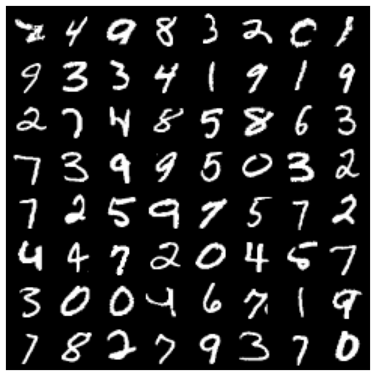
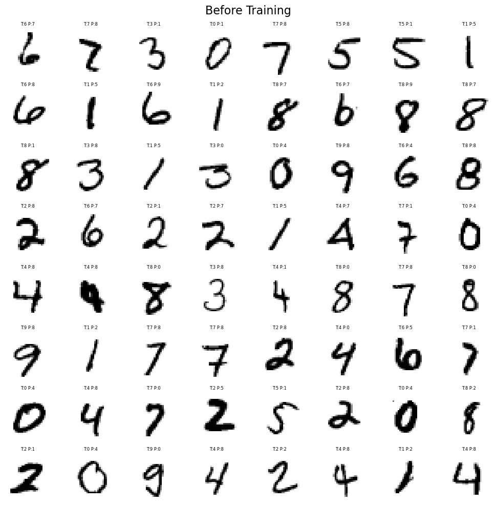
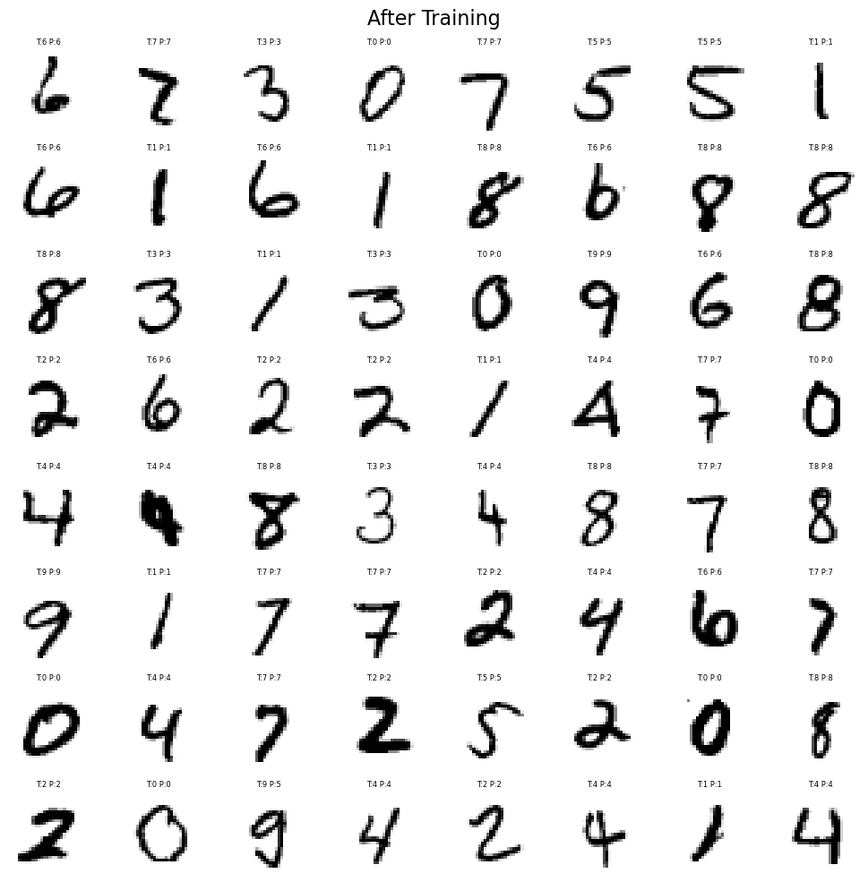

# MNIST 사례연구


## 개요

이 절에서는 이 장에서 전개한 이론을 MNIST 손글씨 숫자 자료(훈련 이미지 60,000장, 검정 이미지
10,000장, $28\times 28$ 화소, 10범주)에 적용한다. 복잡도가 점점 커지는 세 가지 구조 --- 단일
선형층, 이층 신경망, 간단한 CNN --- 을 PyTorch로 구현해 비교한다.

---

## 1  자료 시각화

<div class="exbox" markdown>

**보기 1.** <span class="diff easy" title="쉬움"></span> MNIST 자료 읽기

**(1)** `batch_size=64`일 때 `train_loader`와 `test_loader`가 내놓는 **묶음의 개수**와 **마지막 묶음의 크기**를 각각 구하시오.

**(2)** 표본 격자를 그려 무엇이 읽히는지 적으시오. MNIST의 숫자들이 **이미 정렬되어 있다**는 것을 수로 보이시오.

</div>

??? success "풀이"

    **(1) 묶음 수.** `DataLoader`의 기본값은 `drop_last=False`라 마지막 자투리도 그대로 내놓는다. 그러므로 묶음 수는 올림이다.

    $$
    \left\lceil \frac{60000}{64} \right\rceil = 938,
    \qquad
    \left\lceil \frac{10000}{64} \right\rceil = 157
    $$

    이고 마지막 묶음의 크기는 나머지로

    $$
    60000 \bmod 64 = 32,
    \qquad
    10000 \bmod 64 = 16
    $$

    이다. 곧 훈련은 $937$개의 온전한 묶음과 $32$개짜리 하나, 검정은 $156$개와 $16$개짜리 하나다. **모든 자료가 쓰인다.** 앞 절의 `x_train.shape[0] // batch_size` 반복문이 자투리를 버렸던 것과 다른 점이다.

    **(2) 자료가 이미 정돈되어 있다.**

    ```python
    import torch
    import torchvision
    from torchvision import transforms
    import matplotlib.pyplot as plt

    # ToTensor 는 PIL 이미지를 텐서로 바꾸면서 화소값을 0~255 에서 0~1 로
    # 나눠 준다. 이 눈금 맞추기를 빠뜨리면 학습이 잘 되지 않는다.
    transform = transforms.ToTensor()
    train_dataset = torchvision.datasets.MNIST(
        root='./data', train=True, download=True, transform=transform)
    test_dataset = torchvision.datasets.MNIST(
        root='./data', train=False, download=True, transform=transform)

    # DataLoader 가 자료를 묶음으로 잘라 넘겨준다. shuffle=True 는 세대마다
    # 순서를 섞는다는 뜻이고, 이래야 묶음 사이의 기울기가 서로 닮지 않는다.
    train_loader = torch.utils.data.DataLoader(
        train_dataset, batch_size=64, shuffle=True)
    test_loader = torch.utils.data.DataLoader(
        test_dataset, batch_size=64, shuffle=True)

    print(f"train {len(train_dataset)}, test {len(test_dataset)}")

    images, labels = next(iter(test_loader))
    img_grid = torchvision.utils.make_grid(images, nrow=8, padding=2)

    plt.figure(figsize=(8, 8))
    plt.imshow(img_grid.permute(1, 2, 0), cmap='gray')
    plt.axis('off')
    plt.show()

    # (1) 과 자료의 성질을 수로 확인한다.
    print(f"묶음 수  train {len(train_loader)}  test {len(test_loader)}")
    print(f"마지막 묶음 크기  train {60000 % 64}  test {10000 % 64}")
    print(f"한 장의 모양 {tuple(train_dataset[0][0].shape)},"
          f"  값 범위 {float(train_dataset[0][0].min())}"
          f" ~ {float(train_dataset[0][0].max())}")

    X = train_dataset.data.float() / 255.0
    idx = torch.arange(28.0)
    rows, cols = X.sum(dim=2), X.sum(dim=1)
    cy = (rows * idx).sum(1) / rows.sum(1)
    cx = (cols * idx).sum(1) / cols.sum(1)
    print(f"화소 평균 {float(X.mean()):.4f},"
          f"  정확히 0 인 화소 비율 {float((X == 0).float().mean()):.4f}")
    print(f"질량중심  세로 {cy.mean():.3f} +- {cy.std():.3f},"
          f"  가로 {cx.mean():.3f} +- {cx.std():.3f}   (한가운데는 13.5)")
    ```

    출력:

    ```
    train 60000, test 10000
    묶음 수  train 938  test 157
    마지막 묶음 크기  train 32  test 16
    한 장의 모양 (1, 28, 28),  값 범위 0.0 ~ 1.0
    화소 평균 0.1307,  정확히 0 인 화소 비율 0.8088
    질량중심  세로 13.996 +- 0.289,  가로 14.007 +- 0.291   (한가운데는 13.5)
    ```

    

    **(1)이 맞는다.** 묶음이 $938$개와 $157$개, 마지막이 $32$개와 $16$개다.

    **그림에서 읽히는 것.** $64$장이 모두 흰 획에 검은 바탕이고 숫자가 칸 한가운데에 비슷한 크기로 놓여 있다. 획 굵기와 기울기는 제각각이어서 어떤 $7$은 가로선이 그어져 있고 어떤 $9$는 고리가 거의 닫혀 있지 않다. **숫자의 정체를 가르는 것은 위치나 크기가 아니라 모양**이라는 인상을 준다.

    그 인상은 수로도 뒷받침된다. 질량중심이 세로 $13.996$, 가로 $14.007$로 **$60{,}000$장 평균이 거의 정확히 한가운데**($13.5$)에 있고 표준편차가 $0.29$화소에 지나지 않는다. 우연이 아니라 MNIST를 만들 때 각 숫자를 $20\times 20$으로 줄인 뒤 **질량중심을 $28\times 28$의 중앙에 맞춰 넣었기** 때문이다. 화소의 $80.88\%$가 정확히 $0$이고 평균 밝기가 $0.1307$인 것도 이 때문이다. 바탕이 대부분을 차지한다.

    **그림이 가리는 것은 바로 이 "이미 해 둔 일"이다.** 자료가 중앙에 정렬되어 있지 않았다면 선형 모형의 $92\%$는 나오지 않는다. 실제 사진에서 숫자를 읽는 문제는 **자르기와 정렬이 절반**이고, MNIST는 그 절반을 이미 끝내 놓은 자료다. 아래 모형들의 성적을 읽을 때 이 점을 잊지 말아야 한다.

---

## 2  단일 선형층(소프트맥스 회귀)

가장 단순한 모형이다. 이미지를 펼친 뒤 선형변환 하나를 적용하고 소프트맥스를 씌운다
(`CrossEntropyLoss`가 소프트맥스를 내부에서 처리한다).

<div class="exbox" markdown>

**보기 2.** <span class="diff easy" title="쉬움"></span> 선형 모형 학습

**(1)** 이 모형의 모수는 몇 개이며, 다섯 세대를 돌면 모수 갱신이 몇 번 일어나는가.

**(2)** 세대별 `Loss`가 $0.2995 \to 0.3877 \to 0.3358 \to 0.2993 \to 0.3032$으로 **오르락내리락한다.** 학습이 잘못된 것인가. 출력되는 값이 정확히 무엇인지 코드에서 짚으시오.

</div>

??? success "풀이"

    **(1) 모수와 갱신 횟수.** `nn.Linear(784, 10)`은 가중행렬 $10 \times 784$와 편향 $10$을 가지므로

    $$
    784 \times 10 + 10 = 7{,}850
    $$

    개다. 갱신은 묶음마다 한 번이고 보기 1에서 묶음이 $938$개이므로

    $$
    5 \times 938 = 4{,}690
    $$

    번이다.

    **(2) 잘못된 것이 아니다.** 반복문을 보면

    ```
    for images, labels in train_loader:
        ...
        loss = criterion(model(images), labels)
        ...
    print(f"Epoch {epoch}, Loss: {loss.item():.4f}")
    ```

    처럼 `print`가 **안쪽 반복문 바깥**에 있고 `loss`는 마지막 대입된 값을 그대로 들고 있다. 곧 찍히는 것은 세대 평균이 아니라 **그 세대의 마지막 묶음 하나, 곧 $64$장에 대한 손실**이다.

    $64$장은 적다. 표본당 손실의 표준편차를 $\sigma$라 하면 $64$개 평균의 표준오차가 $\sigma/\sqrt{64} = \sigma/8$이다. 교차엔트로피는 꼬리가 길어 $\sigma$가 큰데, 아래 출력에서 재어 보면 $\sigma = 0.8233$이라 표준오차가 $0.1029$다. 실제 들쭉날쭉한 폭 $0.2993$--$0.3877$, 곧 $0.0884$가 꼭 그만한 크기다. **모형이 요동치는 것이 아니라 재는 자가 요동치는 것이다.**

    고치는 길은 간단하다. `running_loss`를 누적해 `len(train_loader)`로 나누면 $938$개 묶음의 평균이 되어 표준오차가 $\sqrt{938}$분의 1로 줄어든다. [다음 쪽의 `train_model`](mnist_classification.md)이 그렇게 하고, 그쪽 출력은 $0.4777 \to 0.3369 \to 0.3147 \to 0.3025 \to 0.2948$로 **깨끗하게 단조 감소한다.** 같은 모형, 같은 학습률인데 보고 방식만 다르다.

    ```python
    import torch.nn as nn
    import torch.optim as optim

    class SimpleMNIST(nn.Module):
        """28x28 화소를 곧바로 열 범주로 보내는 선형층 하나짜리 모형.

        사실상 소프트맥스 회귀다. 신경망이라 부르기도 민망한 구조인데도
        MNIST 에서 92% 가까이 나온다 — 자료가 그만큼 쉽다는 뜻이기도 하다.
        """

        def __init__(self):
            super().__init__()
            self.fc = nn.Linear(28 * 28, 10)

        def forward(self, x):
            return self.fc(x.view(x.size(0), -1))

    torch.manual_seed(0)
    model = SimpleMNIST()
    # CrossEntropyLoss 는 소프트맥스와 교차엔트로피를 한꺼번에 한다. 그래서
    # 모형의 마지막에 소프트맥스를 또 씌우면 안 된다. 흔한 실수다.
    criterion = nn.CrossEntropyLoss()
    optimizer = optim.SGD(model.parameters(), lr=0.1)
    print(f"모수 {sum(p.numel() for p in model.parameters())}개,"
          f"  갱신 {5 * len(train_loader)}번")

    # 학습 전후를 비교하기 위해 고정된 묶음과 학습 전 모형을 따로 보관해 둔다
    import copy
    fixed_images, fixed_labels = next(iter(test_loader))
    model_untrained = copy.deepcopy(model)

    for epoch in range(1, 6):
        model.train()
        for images, labels in train_loader:
            # 기울기를 0 으로 되돌린다. 파이토치는 기울기를 누적하므로
            # 이 줄을 빠뜨리면 앞 묶음의 기울기가 계속 더해진다.
            optimizer.zero_grad()
            loss = criterion(model(images), labels)
            loss.backward()          # 역전파로 기울기 계산
            optimizer.step()         # 계산된 기울기로 모수 갱신
        print(f"Epoch {epoch}, Loss: {loss.item():.4f}")

    model_trained = model

    # eval() 과 no_grad() 는 다른 일을 한다. 앞은 드롭아웃·배치정규화 같은
    # 층을 평가 모드로 바꾸고, 뒤는 기울기 계산을 꺼 메모리와 시간을 아낀다.
    # 평가할 때는 둘 다 필요하다.
    model.eval()
    correct = total = 0
    with torch.no_grad():
        for images, labels in test_loader:
            _, pred = torch.max(model(images), 1)
            correct += (pred == labels).sum().item()
            total += labels.size(0)
    print(f"Test accuracy: {100 * correct / total:.2f}%")

    # 왜 들쭉날쭉한지 — 묶음 하나의 손실이 얼마나 흔들리는지 재어 본다.
    with torch.no_grad():
        X_all = train_dataset.data.float().reshape(-1, 1, 28, 28) / 255.0
        per = nn.functional.cross_entropy(model(X_all), train_dataset.targets,
                                          reduction='none')
    print(f"표본당 손실  평균 {per.mean():.4f}  표준편차 {per.std():.4f}")
    print(f"64개 평균의 표준오차 = sd/8 = {per.std() / 8:.4f}")
    ```

    출력:

    ```
    모수 7850개,  갱신 4690번
    Epoch 1, Loss: 0.2995
    Epoch 2, Loss: 0.3877
    Epoch 3, Loss: 0.3358
    Epoch 4, Loss: 0.2993
    Epoch 5, Loss: 0.3032
    Test accuracy: 92.03%
    표본당 손실  평균 0.2879  표준편차 0.8233
    64개 평균의 표준오차 = sd/8 = 0.1029
    ```

    모수 $7{,}850$개와 갱신 $4{,}690$번이 (1)의 계산과 같고, **(2)의 설명도 수로 확인된다.** 표본당 손실의 표준편차가 $0.8233$이라 $64$장 평균의 표준오차가 $0.1029$다. 세대별로 찍힌 값들이 $0.2993$에서 $0.3877$ 사이를 오간 것은 이 표준오차 하나로 설명된다. 참고로 표본당 손실의 평균은 $0.2879$이고, $938$개 묶음을 모두 평균했다면 표준오차가 $0.0034$로 **$30$배 작아져** 곡선이 매끄러웠을 것이다. 검정 정확도는 $92.03\%$로, 선형 모형의 기준선이 얼마나 강한지를 보여 준다. **화소를 한 줄로 펴서 곱하기 한 번 한 것만으로 열 중 아홉을 맞힌다.**

    !!! note "이 블록은 돌리는 데 1분 남짓 걸린다"
        `torch.manual_seed(0)`이 모형 초기화와 `DataLoader`의 섞기를 모두 고정하므로 위 숫자는 그대로 재현된다. 뒤의 CNN 블록에는 씨앗이 없어 돌릴 때마다 손실값이 달라진다.

!!! note "`forward`가 로짓을 반환한다"
    `SimpleMNIST.forward`는 소프트맥스를 적용하지 않고 **로짓**을 그대로 반환한다. 이는
    실수가 아니라 올바른 설계다. `nn.CrossEntropyLoss`는 내부에서 log-softmax와 음의 로그가능도를
    융합해 계산하므로 로짓을 받아야 한다
    ([수치적 안정성 절](../softmax_regression/numerical_stability.md) 참조). 모형 안에
    `nn.Softmax`를 넣고 다시 `CrossEntropyLoss`를 쓰면 소프트맥스가 두 번 적용되어 학습이
    망가진다. 초보자가 흔히 저지르는 실수다.

    확률이 필요하면 추론 시점에 `torch.softmax(model(x), dim=1)`을 별도로 호출한다.

---

## 3  학습 전후 비교

같은 이미지 묶음에 대한 예측을 학습 전후로 시각화하면, 모형이 무작위 추측에서 의미 있는 분류로
옮겨 가는 과정을 볼 수 있다.

<div class="exbox" markdown>

**보기 3.** <span class="diff easy" title="쉬움"></span> 학습 전후 예측 비교

**(1)** 학습 **전** 모형은 무엇을 예측하겠는가. 맞히는 수가 $64$장 가운데 몇일지, 그리고 예측 이름표가 열 범주에 **고르게 퍼질지** 미리 말하시오.

**(2)** 두 그림을 그려 (1)을 확인하고, 학습 뒤 그림에서 **틀린 한 장**을 찾아 왜 틀렸을지 말하시오.

</div>

??? success "풀이"

    **(1) 맞히는 수는 대략 여섯 장이지만, 고르게 퍼지지는 않는다.** 학습 전 가중치는 `nn.Linear`의 기본 초기화, 곧 $U(-1/\sqrt{784},\ 1/\sqrt{784})$에서 뽑힌 난수다. 입력과 아무 관계가 없으므로 예측은 **참 이름표와 독립**이고, 맞힐 확률이 $1/10$이라 기대값은

    $$
    64 \times \tfrac{1}{10} = 6.4 \quad\text{장},
    \qquad
    \text{표준편차} = \sqrt{64 \times 0.1 \times 0.9} = 2.4
    $$

    다.

    그러나 "참값과 독립"이 "열 범주에 고르게"를 뜻하지는 **않는다.** 가중치는 무작위라도 **한 번 뽑히고 나면 고정**이고, 그 고정된 $\mathbf{W}, \mathbf{b}$가 어느 범주의 로짓을 체계적으로 크게 만들 수 있다. MNIST 이미지가 서로 닮아 있으므로(가운데 밝고 테두리 $0$) **거의 모든 이미지가 같은 범주로 쏠릴 것**이라고 보는 편이 맞다. 아직 아무것도 배우지 않은 모형은 "무작위로 고르는 모형"이 아니라 **"한 가지 답만 외치는 모형"**에 가깝다.

    ```python
    plt.rcParams["font.family"] = "Apple SD Gothic Neo"
    plt.rcParams["axes.unicode_minus"] = False

    def show_images(images, true_labels, pred_labels, title):
        plt.figure(figsize=(10, 10))
        for i in range(64):
            plt.subplot(8, 8, i + 1)
            plt.imshow(images[i][0], cmap='binary')
            plt.axis("off")
            plt.title(f"T:{true_labels[i]} P:{pred_labels[i]}", fontsize=6)
        plt.suptitle(title, fontsize=16)
        plt.tight_layout()
        plt.show()

    # 학습 전
    with torch.no_grad():
        _, preds = torch.max(model_untrained(fixed_images), 1)
    show_images(fixed_images, fixed_labels, preds, "Before Training")

    # 학습 뒤
    with torch.no_grad():
        _, preds_after = torch.max(model_trained(fixed_images), 1)
    show_images(fixed_images, fixed_labels, preds_after, "After Training")

    # 그림에서 읽을 것을 수로도 찍어 둔다.
    with torch.no_grad():
        _, preds = torch.max(model_untrained(fixed_images), 1)
        p0 = torch.softmax(model_untrained(fixed_images), 1)
    print(f"학습 전 맞힌 수 {(preds == fixed_labels).sum().item()}/64")
    print(f"학습 전 예측 분포 {torch.bincount(preds, minlength=10).tolist()}")
    print(f"참 이름표 분포   {torch.bincount(fixed_labels, minlength=10).tolist()}")
    print(f"학습 전 최대확률의 평균 {p0.max(1).values.mean():.4f}  (균등이면 0.1)")

    with torch.no_grad():
        p1 = torch.softmax(model_trained(fixed_images), 1)
    print(f"학습 뒤 맞힌 수 {(preds_after == fixed_labels).sum().item()}/64")
    bad = (preds_after != fixed_labels).nonzero().flatten()
    print(f"틀린 자리 {bad.tolist()},  참 {fixed_labels[bad].tolist()},"
          f"  예측 {preds_after[bad].tolist()}")
    print(f"학습 뒤 최대확률의 평균 {p1.max(1).values.mean():.4f}")
    ```

    출력:

    ```
    학습 전 맞힌 수 2/64
    학습 전 예측 분포 [7, 10, 5, 0, 6, 6, 0, 7, 21, 2]
    참 이름표 분포   [6, 7, 8, 4, 9, 3, 7, 8, 9, 3]
    학습 전 최대확률의 평균 0.1308  (균등이면 0.1)
    학습 뒤 맞힌 수 63/64
    틀린 자리 [58],  참 [9],  예측 [5]
    학습 뒤 최대확률의 평균 0.8997
    ```

    

    

    **(1)의 두 예상이 모두 맞는다.** 맞힌 것은 $2$장으로, 기댓값 $6.4$에서 표준편차 $2.4$의 $1.8$배 아래다. 운이 나빴을 뿐 "무작위 수준"과 모순되지 않는다.

    더 중요한 것은 **쏠림**이다. 예측 분포 $[7, 10, 5, 0, 6, 6, 0, 7, 21, 2]$에서 $8$이 $21$번, 곧 $64$장의 **$33\%$**를 차지하고 **$3$과 $6$은 한 번도 나오지 않았다.** 균등이라면 범주마다 $6.4$번일 텐데 전혀 그렇지 않다. 아직 아무것도 배우지 않은 모형이 이미 "$8$을 좋아한다"는 뜻이며, 첫 그림의 제목들을 훑어보면 `P:8`이 유난히 자주 눈에 띄는 것이 그래서다.

    확률은 또 다른 이야기를 한다. 학습 전 최대확률의 평균이 $0.1308$로 균등값 $0.1$에 거의 붙어 있다. **치우쳐 있으면서도 확신은 전혀 없는 상태**다. 초기 가중치가 작아 로짓이 모두 $0$ 근처이기 때문이며, 그래서 교차엔트로피가 $\log 10 = 2.3026$ 근처에서 출발한다.

    **학습 뒤에는 $63$장을 맞힌다.** 틀린 한 장은 $58$번째(여덟째 줄 셋째 칸)로 참값 $9$를 $5$로 예측했다. 그림에서 그 숫자를 보면 위쪽 고리가 왼쪽으로 터져 있고 세로획이 짧아, $9$의 닫힌 고리보다 $5$의 윗부분에 가깝게 보인다. **선형 모형은 "고리가 닫혔는가"를 볼 줄 모르고 화소의 밝기만 더하므로**, 고리가 터진 $9$는 $5$의 주형과 더 크게 겹친다. 최대확률의 평균도 $0.1308$에서 $0.8997$로 올라 모형이 확신을 갖게 되었다.

    한 가지 덧붙이면 $63/64 = 98.4\%$는 전체 검정 정확도 $92.03\%$보다 훨씬 높다. $64$장에서 기대되는 수는 $58.9$장이고 표준편차가 $\sqrt{64 \times 0.92 \times 0.08} = 2.2$이므로 $63$은 약 $1.9$ 표준편차 위다. **묶음 하나로 정확도를 가늠하면 안 된다**는 또 하나의 사례다.

---

## 4  간단한 CNN

합성곱층 두 개를 추가하면 정확도가 크게 개선된다.

<div class="exbox" markdown>

**보기 4.** <span class="diff easy" title="쉬움"></span> 합성곱 신경망

**(1)** 세 층을 지날 때 텐서의 모양이 어떻게 바뀌는지 적고, 층별 모수 개수와 합계를 계산하시오.

**(2)** 선형 모형의 $7{,}850$개와 견주면 모수가 $2.6$배다. 그런데 **마지막 선형층 하나가 전체의 몇 할**인가. 코드로 확인하시오.

</div>

??? success "풀이"

    **(1) 모양과 모수.** 입력은 묶음 하나가 $(64,\ 1,\ 28,\ 28)$이다. `padding=1`인 $3\times3$ 합성곱은 공간 크기를 바꾸지 않고, $2\times2$ 최대풀링이 절반으로 줄인다.

    | 단계 | 모양 |
    |:---|:---|
    | 입력 | $(64,\ 1,\ 28,\ 28)$ |
    | `conv1` + ReLU | $(64,\ 16,\ 28,\ 28)$ |
    | 풀링 | $(64,\ 16,\ 14,\ 14)$ |
    | `conv2` + ReLU | $(64,\ 32,\ 14,\ 14)$ |
    | 풀링 | $(64,\ 32,\ 7,\ 7)$ |
    | 펼치기 | $(64,\ 1568)$ |
    | `fc` | $(64,\ 10)$ |

    입력 채널 $C_{\text{in}}$, 출력 채널 $C_{\text{out}}$, 커널 $k\times k$인 합성곱층의 모수는 $C_{\text{out}}(C_{\text{in}}k^2 + 1)$이므로

    $$
    \texttt{conv1} : 16 \times (1 \cdot 9 + 1) = 160,
    \qquad
    \texttt{conv2} : 32 \times (16 \cdot 9 + 1) = 4{,}640
    $$

    이고, 완전연결층은 $1568 \times 10 + 10 = 15{,}690$이다. 합이

    $$
    160 + 4{,}640 + 15{,}690 = 20{,}490
    $$

    개다.

    **(2) 마지막 선형층이 $76.6\%$를 차지한다.**

    $$
    \frac{15{,}690}{20{,}490} = 0.7657
    $$

    이고 합성곱층 둘을 합쳐도 $4{,}800/20{,}490 = 23.4\%$뿐이다. **"CNN은 모수가 적다"는 말은 합성곱층에 대한 말이지 이 신경망 전체에 대한 말이 아니다.** 가중치 공유의 이득이 극적이라는 것은 `conv2`를 보면 분명하다. $14\times14 = 196$개 위치에서 $32$개 채널을 만드는 일을 $4{,}640$개 모수로 해내는데, 같은 입출력을 완전연결로 이으면 $(16 \cdot 14 \cdot 14) \times (32 \cdot 14 \cdot 14) = 19{,}668{,}992$개가 필요하다. $4{,}200$배 차이다.

    그러므로 이 신경망을 더 줄이려면 합성곱이 아니라 **마지막 층**을 건드려야 한다. 실제 구조들이 $7\times7$을 통째로 평균해 버리는 전역 평균 풀링으로 이 층을 대체하는 이유다. 그렇게 하면 완전연결층이 $32 \times 10 + 10 = 330$개로 줄어 전체가 $5{,}130$개가 된다.

    ```python
    import torch.nn.functional as F

    class SimpleCNN(nn.Module):
        """합성곱 두 층짜리 신경망.

        선형층은 화소를 한 줄로 펴 버려 "이웃한 화소끼리 관계가 있다"는 것을
        모른다. 합성곱은 작은 창을 이미지 위로 미끄러뜨리므로 그 구조를 살린다.
        같은 가중값을 온 이미지에 되쓰기 때문에 모수도 훨씬 적다.
        """

        def __init__(self):
            super().__init__()
            self.conv1 = nn.Conv2d(1, 16, 3, padding=1)  # → 16×28×28
            self.conv2 = nn.Conv2d(16, 32, 3, padding=1)  # → 32×14×14
            self.fc = nn.Linear(32 * 7 * 7, 10)

        def forward(self, x):
            # 최대풀링이 크기를 절반으로 줄인다. 자잘한 위치 차이에 덜 흔들리게
            # 만들면서 계산량도 줄이는 두 가지 일을 함께 한다.
            x = F.max_pool2d(F.relu(self.conv1(x)), 2)   # 28→14
            x = F.max_pool2d(F.relu(self.conv2(x)), 2)   # 14→7
            return self.fc(x.view(x.size(0), -1))

    model = SimpleCNN()

    # (1) 모양을 따라가 본다.
    with torch.no_grad():
        z = fixed_images
        print(f"입력        {tuple(z.shape)}")
        z = F.max_pool2d(F.relu(model.conv1(z)), 2)
        print(f"conv1+풀링  {tuple(z.shape)}")
        z = F.max_pool2d(F.relu(model.conv2(z)), 2)
        print(f"conv2+풀링  {tuple(z.shape)}")

    # (2) 층별 모수를 센다.
    total = 0
    for name, p in model.named_parameters():
        print(f"  {name:13s} {str(tuple(p.shape)):16s} {p.numel():6d}")
        total += p.numel()
    fc_n = model.fc.weight.numel() + model.fc.bias.numel()
    print(f"합계 {total},  마지막 선형층이 {fc_n}개로 {fc_n / total:.1%}")

    criterion = nn.CrossEntropyLoss()
    optimizer = optim.SGD(model.parameters(), lr=0.1)

    for epoch in range(1, 6):
        for images, labels in train_loader:
            optimizer.zero_grad()
            loss = criterion(model(images), labels)
            loss.backward()
            optimizer.step()
        print(f"Epoch {epoch}, Loss: {loss.item():.4f}")
    ```

    출력:

    ```
    입력        (64, 1, 28, 28)
    conv1+풀링  (64, 16, 14, 14)
    conv2+풀링  (64, 32, 7, 7)
      conv1.weight  (16, 1, 3, 3)       144
      conv1.bias    (16,)                16
      conv2.weight  (32, 16, 3, 3)     4608
      conv2.bias    (32,)                32
      fc.weight     (10, 1568)        15680
      fc.bias       (10,)                10
    합계 20490,  마지막 선형층이 15690개로 76.6%
    Epoch 1, Loss: 0.0546
    Epoch 2, Loss: 0.0084
    Epoch 3, Loss: 0.1543
    Epoch 4, Loss: 0.1759
    Epoch 5, Loss: 0.0320
    ```

    **모양과 모수가 모두 (1)·(2)의 계산과 같다.** $(64,16,14,14)$, $(64,32,7,7)$을 거쳐 $1568$차원으로 펼쳐지고, 층별 모수가 $160$, $4{,}640$, $15{,}690$으로 합이 $20{,}490$이며 마지막 층이 $76.6\%$다.

    손실값은 보기 2와 마찬가지로 **마지막 묶음 하나**의 값이라 $0.0084$와 $0.1759$를 오간다. 보기 2에서 보았듯 $64$장의 표본오차 탓이며, 여기서는 모형이 더 좋아 손실이 작아진 만큼 상대적인 흔들림이 더 커 보인다.

    !!! warning "이 블록은 오래 걸리고 재현되지 않는다"
        합성곱 다섯 세대는 CPU에서 수십 분이 걸린다. 그리고 이 블록에는 `torch.manual_seed`가 없어 **돌릴 때마다 초기 가중치가 달라지고 손실값도 달라진다.** 위의 다섯 수는 한 번의 실행 기록이며, 다시 돌려 같은 값을 기대해서는 안 된다. 모수 개수와 텐서 모양은 물론 언제나 같다.

---

## 5  PyTorch 소프트맥스 회귀(전체 파이프라인)

장치 처리, 모형 저장·적재, 범주별 정확도 보고까지 갖춘 완전한 PyTorch 파이프라인이다.

### 모형

<div class="exbox" markdown>

**보기 5.** <span class="diff easy" title="쉬움"></span> 되쓰기 좋게 만든 모형

**(1)** `Net(input_size=784, num_classes=10)`의 모수 개수와 `layer.weight`의 모양을 적으시오. 이 책이 쓰는 $\mathbf{W} \in \mathbb{R}^{d \times C}$와 모양이 왜 다른가.

**(2)** `torch.flatten(x, 1)`과 `x.view(x.size(0), -1)`은 같은 일을 하는가. **다르게 행동하는 경우**를 하나 들어 보이시오.

</div>

??? success "풀이"

    **(1) 전치된 관례.** 모수는 보기 2와 같은 $784 \times 10 + 10 = 7{,}850$개다. 다만 `nn.Linear(in, out)`이 들고 있는 `weight`의 모양은 $(\text{out},\ \text{in}) = (10,\ 784)$로, 이 책의 $\mathbf{W} \in \mathbb{R}^{784 \times 10}$와 **전치 관계**다. 파이토치가 계산하는 식은

    $$
    \mathbf{z} = \mathbf{x}\mathbf{W}_{\text{torch}}^\top + \mathbf{b}
    $$

    이고 책의 식은 $\mathbf{z} = \mathbf{x}\mathbf{W} + \mathbf{b}$이니 $\mathbf{W}_{\text{torch}} = \mathbf{W}^\top$이다. 이 차이 때문에 `fc.weight[k]`가 **범주 $k$의 주형**이 되어 $28\times28$로 되돌려 그리기 편해진다. 같은 쪽의 다른 절에서 가중치를 이미지로 그릴 때 쓰는 성질이 이것이다.

    **(2) 연속이 아닌 텐서에서 갈라진다.** 둘 다 모양만 바꾸는 연산이지만 `view`는 **메모리가 연속**이어야 한다. 전치나 치환을 거쳐 보폭이 뒤섞인 텐서에서는 `view`가 `RuntimeError`를 내고, `flatten`은 필요하면 내부적으로 복사해 성공한다. 그러므로 **`flatten`이 더 안전**하며, 이 쪽의 `SimpleMNIST`가 쓰는 `x.view(x.size(0), -1)`은 입력이 `DataLoader`에서 바로 온 연속 텐서라서 문제없이 도는 것이다.

    ```python
    class Net(nn.Module):
        """입력 크기와 범주 수를 인자로 받는 선형 모형. 되쓰기 좋게 일반화했다."""

        def __init__(self, input_size=784, num_classes=10):
            super().__init__()
            self.layer = nn.Linear(input_size, num_classes)

        def forward(self, x):
            return self.layer(torch.flatten(x, 1))

    net = Net()
    print(f"layer.weight {tuple(net.layer.weight.shape)},"
          f"  bias {tuple(net.layer.bias.shape)},"
          f"  모수 {sum(p.numel() for p in net.parameters())}")

    t = torch.randn(4, 1, 28, 28)                 # 연속 텐서
    print(f"연속:    flatten {tuple(torch.flatten(t, 1).shape)},"
          f"  view {tuple(t.view(t.size(0), -1).shape)}")

    tt = t.transpose(2, 3)                        # 보폭이 뒤섞인다
    print(f"비연속:  flatten {tuple(torch.flatten(tt, 1).shape)}", end=",  ")
    try:
        tt.view(tt.size(0), -1)
        print("view 성공")
    except RuntimeError:
        print("view RuntimeError")
    ```

    출력:

    ```
    layer.weight (10, 784),  bias (10,),  모수 7850
    연속:    flatten (4, 784),  view (4, 784)
    비연속:  flatten (4, 784),  view RuntimeError
    ```

    모수 $7{,}850$개와 `weight`의 모양 $(10, 784)$이 (1)과 같다. 그리고 (2)의 예상대로 **같은 모양을 요구했는데 `view`만 실패한다.** 전치 한 번으로 갈리는 차이이므로, 모형 안에서는 `flatten`을 쓰는 편이 낫다.
### 학습

<div class="exbox" markdown>

**보기 6.** <span class="diff easy" title="쉬움"></span> 학습 반복문 함수

**(1)** 이 함수를 MNIST(`batch_size=64`)에 쓰면 손실이 **몇 번** 찍히는가. 조건 `i % 2000 == 1999`를 보고 답하시오.

**(2)** 그 조건이 원래 어떤 설정을 가정한 것인지 추측하고, MNIST에 맞게 고치는 길을 말하시오.

</div>

??? success "풀이"

    **(1) 한 번도 찍히지 않는다.** `i`는 `enumerate(loader)`가 주는 묶음 번호라 $0$부터 $\lvert\text{loader}\rvert - 1$까지 간다. 보기 1에서 MNIST의 묶음은 $938$개이므로 $i$의 최댓값이 $937$이다. 그런데 조건이 참이 되려면

    $$
    i \equiv 1999 \pmod{2000}
    \quad\Longrightarrow\quad
    i \in \{1999,\ 3999,\ \ldots\}
    $$

    로 **최소 $1999$**가 필요하다. $937 < 1999$이므로 **조건이 단 한 번도 참이 되지 않고, 함수는 아무것도 출력하지 않은 채 끝난다.** 학습은 제대로 되지만 화면에는 아무 일도 일어나지 않는 것처럼 보인다.

    **(2) 다른 자료를 베껴 온 조건이다.** $2000$이라는 수는 파이토치 공식 튜토리얼의 CIFAR-10 예제에서 온 것으로, 거기서는 훈련 $50{,}000$장에 `batch_size=4`라 묶음이 $12{,}500$개다. 그러면 조건이 $i = 1999, 3999, \ldots, 11999$에서 여섯 번 참이 되어 세대마다 여섯 줄이 찍힌다. **묶음 수에 맞춰 고른 수인데 자료만 바꾸고 그대로 가져온 것이다.**

    고치는 길은 두 가지다. 조건을 `len(loader)`에 상대적으로 쓰거나(예: `i % (len(loader) // 5) == 0`), 세대마다 한 줄씩 평균을 찍는 것이다. 뒤의 것이 [다음 쪽의 `train_model`](mnist_classification.md)이 택한 방식이며, 보기 2에서 보았듯 평균을 쓰면 곡선도 훨씬 안정된다.

    ```python
    def train(model, loader, criterion, optimizer, epochs=2, device='cpu'):
        """학습 반복문을 함수로 묶는다. 모형을 바꿔 가며 되쓸 수 있다."""
        model.train()
        for epoch in range(epochs):
            running_loss = 0.0
            for i, (inputs, labels) in enumerate(loader):
                inputs, labels = inputs.to(device), labels.to(device)
                optimizer.zero_grad()
                loss = criterion(model(inputs), labels)
                loss.backward()
                optimizer.step()
                running_loss += loss.item()
                if i % 2000 == 1999:
                    print(f'[{epoch+1}, {i+1:5d}] '
                          f'loss: {running_loss/2000:.3f}')
                    running_loss = 0.0

    # 돌리지 않고도 몇 번 찍힐지 셀 수 있다.
    for n, bs, name in ((60000, 64, "MNIST"), (60000, 32, "MNIST"),
                        (50000, 4, "CIFAR-10 튜토리얼")):
        n_batch = -(-n // bs)
        hits = sum(1 for i in range(n_batch) if i % 2000 == 1999)
        print(f"{name:18s} n={n}, batch={bs} -> 묶음 {n_batch:6d}개,"
              f" 세대마다 {hits}줄 출력")
    ```

    출력:

    ```
    MNIST              n=60000, batch=64 -> 묶음    938개, 세대마다 0줄 출력
    MNIST              n=60000, batch=32 -> 묶음   1875개, 세대마다 0줄 출력
    CIFAR-10 튜토리얼      n=50000, batch=4 -> 묶음  12500개, 세대마다 6줄 출력
    ```

    **(1)과 (2)가 모두 확인된다.** MNIST에서는 묶음을 $32$로 줄여 $1{,}875$개를 만들어도 여전히 $1999$에 못 미쳐 한 줄도 나오지 않고, CIFAR-10 설정에서만 여섯 줄이 나온다. **출력이 없다고 학습이 안 된 것은 아니다**라는 것이 이 보기의 교훈이다.
### 평가

<div class="exbox" markdown>

**보기 7.** <span class="diff easy" title="쉬움"></span> 정확도 계산 함수

**(1)** 이 함수가 찍는 **전체 정확도**가 범주별 정확도들과 어떤 관계인지 식으로 쓰시오. 단순평균과 같아지는 조건은 무엇인가.

**(2)** [다음 쪽의 선형 모형 결과](mnist_classification.md)에서 숫자별 정확도가 $97.8, 97.6, 89.1, 92.4, 93.3, 84.0, 95.8, 91.1, 89.0, 90.2$(퍼센트)이고 전체가 $92.15\%$였다. (1)의 식으로 이 수를 되살리고, 단순평균과 얼마나 다른지 보이시오.

</div>

??? success "풀이"

    **(1) 지지도 가중평균이다.** 범주 $c$의 검정 개수를 $n_c$, 맞힌 수를 $m_c$라 하면 함수가 찍는 두 값이

    $$
    \text{전체} = \frac{\sum_c m_c}{\sum_c n_c},
    \qquad
    \text{범주별} = a_c = \frac{m_c}{n_c}
    $$

    이다. $m_c = n_c a_c$를 넣으면

    $$
    \text{전체}
    = \frac{\sum_c n_c a_c}{\sum_c n_c}
    = \sum_c \frac{n_c}{n}\,a_c
    $$

    로 **범주 크기를 가중치로 쓴 평균**이다. 이것이 [평균 방식 절](averaging.md)의 가중평균이고, 단순평균 $\frac1C\sum_c a_c$는 거시평균이다. 둘이 같아지는 것은 가중치가 모두 $1/C$일 때, 곧 **$n_c$가 모든 범주에서 같을 때**다. 또는 모든 $a_c$가 같을 때도 당연히 같다.

    **(2) 수로 확인한다.** MNIST 검정자료의 범주별 개수는 $(980, 1135, 1032, 1010, 982, 892, 958, 1028, 974, 1009)$로 고르지 않다. $1$이 $1{,}135$장인데 $5$는 $892$장뿐이다.

    ```python
    import numpy as np

    n_c = np.array([980, 1135, 1032, 1010, 982, 892, 958, 1028, 974, 1009])
    a_c = np.array([97.8, 97.6, 89.1, 92.4, 93.3, 84.0, 95.8, 91.1, 89.0, 90.2])

    print(f"검정 범주별 개수 합 {n_c.sum()},"
          f"  가장 큰 범주 {n_c.max()}  가장 작은 범주 {n_c.min()}")
    print(f"가중평균(= 전체 정확도) {np.sum(n_c * a_c) / n_c.sum():.4f}%")
    print(f"단순평균(= 거시평균)    {a_c.mean():.4f}%")
    print(f"차이 {np.sum(n_c * a_c) / n_c.sum() - a_c.mean():.4f}%p")
    ```

    출력:

    ```
    검정 범주별 개수 합 10000,  가장 큰 범주 1135  가장 작은 범주 892
    가중평균(= 전체 정확도) 92.1569%
    단순평균(= 거시평균)    92.0300%
    차이 0.1269%p
    ```

    **가중평균이 $92.1569\%$로 함수가 찍은 $92.15\%$와 같다.** 범주별 정확도를 소수 한 자리로 반올림해 적은 것치고는 잘 맞는다. 단순평균은 $92.0300\%$로 $0.13$퍼센트포인트 낮다.

    왜 가중평균이 더 큰가. 성적이 좋은 $0$($97.8\%$)과 $1$($97.6\%$)이 마침 큰 범주이고($980$, $1{,}135$장) 성적이 가장 나쁜 $5$($84.0\%$)가 가장 작은 범주($892$장)이기 때문이다. **큰 범주를 잘 맞히면 전체 정확도가 득을 본다.** MNIST에서는 불균형이 $892$ 대 $1{,}135$로 심하지 않아 차이가 $0.13$퍼센트포인트에 그치지만, 범주가 $100$배 차이 나는 자료에서는 두 수가 전혀 다른 이야기를 하게 된다. 그 경우가 [평균 방식 절](averaging.md)의 주제다.
### 저장과 적재

<div class="exbox" markdown>

**보기 8.** <span class="diff easy" title="쉬움"></span> 모형 저장과 적재

**(1)** `state_dict`에 들어가는 **키**와 각각의 모양을 적고, 저장된 파일의 크기를 바이트 단위로 추정하시오.

**(2)** 적재할 때 **같은 구조의 모형을 먼저 만들어야 한다**고 했다. 다른 구조에 적재하면 어떻게 되는가. 확인하시오.

</div>

??? success "풀이"

    **(1) 키와 크기.** `state_dict`는 모듈의 이름을 따라 가중치와 편향을 모은 사전이다. `SimpleCNN`이면 여섯 개다.

    | 키 | 모양 | 개수 |
    |:---|:---|---:|
    | `conv1.weight` | $(16, 1, 3, 3)$ | $144$ |
    | `conv1.bias` | $(16,)$ | $16$ |
    | `conv2.weight` | $(32, 16, 3, 3)$ | $4{,}608$ |
    | `conv2.bias` | $(32,)$ | $32$ |
    | `fc.weight` | $(10, 1568)$ | $15{,}680$ |
    | `fc.bias` | $(10,)$ | $10$ |

    합이 보기 4의 $20{,}490$과 같다. 기본 자료형이 `float32`이므로 값만으로 $20{,}490 \times 4 = 81{,}960$바이트, 곧 약 $82$KB다. 실제 파일은 키 이름과 텐서 모양을 적은 메타자료가 더해져 그보다 조금 크다.

    **참고로 `state_dict`에는 모형의 구조가 들어 있지 않다.** 들어 있는 것은 "어떤 이름의 텐서가 어떤 모양인가"뿐이다. 그래서 적재하는 쪽이 같은 구조를 미리 만들어 두어야 한다.

    **(2) 구조가 다르면 거부한다.** `load_state_dict`는 기본값이 `strict=True`라 **키가 하나라도 어긋나면 `RuntimeError`**를 낸다. `SimpleCNN`의 사전을 `SimpleMNIST`에 넣으면 전자에 없는 `fc.weight`의 모양이 다르고 `conv1.*`은 아예 받을 자리가 없으므로 곧바로 실패한다. 조용히 틀리지 않고 시끄럽게 실패하니 다행이다.

    ```python
    from pathlib import Path

    Path('./model').mkdir(exist_ok=True)
    torch.save(model.state_dict(), './model/model.pth')

    # 적재할 때는 저장할 때와 같은 구조의 모형을 먼저 만들어야 한다
    reloaded = SimpleCNN()   # 이 시점의 model은 CNN이다
    reloaded.load_state_dict(torch.load('./model/model.pth', weights_only=True))
    reloaded.eval()

    # 같은 입력에 같은 출력을 내는지 확인한다
    with torch.no_grad():
        same = torch.allclose(model(fixed_images), reloaded(fixed_images))
    print("적재한 모형이 원본과 동일한가:", same)

    sd = torch.load('./model/model.pth', weights_only=True)
    n_param = sum(v.numel() for v in sd.values())
    print("키:", list(sd.keys()))
    print(f"모수 {n_param}개 x 4바이트 = {4 * n_param}바이트,"
          f"  실제 파일 {Path('./model/model.pth').stat().st_size}바이트")

    try:
        SimpleMNIST().load_state_dict(sd)
    except RuntimeError:
        print("구조가 다른 모형에 적재하면: RuntimeError")
    ```

    출력:

    ```
    적재한 모형이 원본과 동일한가: True
    키: ['conv1.weight', 'conv1.bias', 'conv2.weight', 'conv2.bias', 'fc.weight', 'fc.bias']
    모수 20490개 x 4바이트 = 81960바이트,  실제 파일 84212바이트
    구조가 다른 모형에 적재하면: RuntimeError
    ```

    **(1)의 추정이 맞는다.** 여섯 개의 키가 예상대로 나오고, 값만으로 $81{,}960$바이트인데 실제 파일은 $84{,}212$바이트다. 차이 $2{,}252$바이트가 압축 보관 형식의 머리글과 키 이름 등이며, 전체의 $2.7\%$다.

    그리고 (2)대로 다른 구조에는 `RuntimeError`가 난다. 적재가 성공했을 때는 같은 입력에 같은 출력을 내므로, **`state_dict`만으로 모형이 완전히 되살아난다**는 것도 확인된다. 다만 되살아나는 것은 모수뿐이고 **최적화기의 상태(모멘텀 따위)는 따로 저장해야** 학습을 중간부터 이어 갈 수 있다.

---

## 모형 비교

| 모형 | 모수 개수 | 검정 정확도 |
|---|---|---|
| 선형(소프트맥스 회귀) | $7{,}850$ | 약 92% |
| 이층 신경망(은닉 100) | $79{,}510$ | 약 97% |
| 간단한 CNN(필터 16→32) | $20{,}490$ | 약 98--99% |

선형 모형에서 은닉층 하나를 더하는 것만으로 정확도가 크게 오르는 이유는 은닉층이 비선형 특성
조합을 학습할 수 있기 때문이다. CNN은 여기서 한 걸음 더 나아가 가중치 공유와 국소 연결을 통해
이미지의 공간 구조를 활용한다.

!!! note "CNN이 모수가 더 적으면서 더 정확하다"
    표에서 눈여겨볼 것은 CNN이 이층 신경망보다 **모수가 4분의 1 수준인데도** 더 정확하다는
    점이다. 이는 모형의 성능이 모수의 **개수**가 아니라 **구조**에서 온다는 사실을 보여준다.
    CNN의 합성곱 필터는 이미지 전체에서 같은 가중치를 재사용하므로(가중치 공유), 이미지를
    조금 옮겨도 같은 특성을 검출한다는 사전지식이 구조 자체에 내장되어 있다. 이층 신경망은
    그 사전지식을 자료로부터 처음부터 배워야 하므로 모수를 훨씬 많이 쓰고도 불리하다.

    참고로 모수 개수의 내역은 다음과 같다. CNN의 `conv1`은
    $16 \times (1 \times 3 \times 3 + 1) = 160$개, `conv2`는
    $32 \times (16 \times 3 \times 3 + 1) = 4{,}640$개, 완전연결층은
    $32 \times 7 \times 7 \times 10 + 10 = 15{,}690$개다. 즉 합성곱층은 전체의 $23\%$에
    불과하고 나머지는 마지막 선형층이 차지한다.

## 연습문제

<div class="drillbox" markdown>

**연습문제 1.** <span class="diff easy" title="쉬움"></span>
MNIST 방식의 분류

숫자 범주 $C = 10$개, 입력 특성 $d = 784$개(28 × 28 화소 이미지)인 소프트맥스 분류기를 MNIST로
학습시킨다.

**(a)** 이 모형의 모수는 몇 개인가(가중치와 편향)?

**(b)** 학습 후 혼동행렬을 보니 숫자 4와 9가 자주 혼동된다((4,9)와 (9,4) 칸의 값이 크다).
이 혼동을 줄일 전략 두 가지를 제안하라.

**(c)** 검정 정확도가 92%다. 은닉 단위 256개와 ReLU 활성함수를 갖는 이층 신경망은 97%를
달성한다. 모형의 표현력 관점에서 이 개선의 원천을 설명하라.

**(d)** 어떤 검정 이미지를 모형이 $\hat{p}_3 = 0.52$, $\hat{p}_5 = 0.35$로 숫자 3이라
분류했다. 이 예측을 신뢰해야 하는가? 소프트맥스 출력을 이용해 불확실한 예측을 어떻게 표시할 수
있는가?

</div>

??? success "풀이"

    **(a)** 가중행렬은 $C \times d = 10 \times 784 = 7{,}840$개, 편향벡터는 $C = 10$개다.
    합계 $7{,}840 + 10 = 7{,}850$개다.

    **(b)** 4와 9의 혼동을 줄이는 두 전략.

    1. **자료 증강 또는 특성공학:** 4와 9는 구조적 특징(오른쪽의 세로획)을 공유한다. 4와 9를
       조금 회전·확대·굵게 변형한 이미지를 훈련자료에 추가하면, 모형이 구별짓는 특징(위쪽
       고리가 닫혔는지 열렸는지)을 학습하는 데 도움이 된다.

    2. **모형 용량 증가:** 이층 신경망이나 CNN은 단일 선형층이 표현할 수 없는 비선형 특성
       조합(예: 9의 위쪽 닫힌 고리 대 4의 열린 각진 교차)을 학습할 수 있다. 합성곱층은 국소적
       공간 양상을 검출하므로 특히 효과적이다.

    **(c)** 단층 소프트맥스 모형은 $\mathbf{z} = \mathbf{W}\mathbf{x} + \mathbf{b}$를 계산하며,
    이는 원시 화소의 선형함수다. 784차원 화소공간에서 선형 결정경계만 학습할 수 있다. 이층
    신경망은 $\mathbf{h} = \text{ReLU}(\mathbf{W}_1 \mathbf{x} + \mathbf{b}_1)$을 거쳐
    $\mathbf{z} = \mathbf{W}_2 \mathbf{h} + \mathbf{b}_2$를 계산한다. ReLU 활성함수를 갖는
    은닉층이 숫자들이 더 선형분리 가능한 비선형 특성표현 $\mathbf{h}$를 학습한다. 은닉 단위가
    256개면 모형은 획의 양상, 곡선, 교차점 같은 중간 수준의 특성을 검출하고 결합할 수 있으며,
    이는 원시 화소값보다 훨씬 판별력이 높다.

    **(d)** $\hat{p}_3 = 0.52$인 예측을 높은 확신으로 받아들여서는 안 된다. 최대 확률 자체는
    무작위 수준 $1/C = 0.10$보다 훨씬 높지만, **두 번째로 높은 확률 $\hat{p}_5 = 0.35$가
    바로 뒤에 붙어 있다**는 것이 문제다. 상위 두 확률의 차이가 $0.17$에 불과하므로, 모형은
    3과 5 사이에서 사실상 망설이고 있다.

    간단한 불확실성 표시 전략은 확신도 문턱 $\tau$를 정하고(예: $\tau = 0.80$)
    $\max_k \hat{p}_k < \tau$인 예측을 "불확실"로 표시하는 것이다. 또는 예측분포의
    **엔트로피**를 쓴다.

    $$
    H(\hat{\mathbf{p}}) = -\sum_k \hat{p}_k \log \hat{p}_k
    $$

    엔트로피가 높으면 불확실성이 크다. 10범주 문제에서 최대 엔트로피는
    $\log(10) \approx 2.30$(균등 예측)이다. 엔트로피에 문턱을 두면 불확실한 사례를 사람의
    검토나 더 강력한 모형으로 넘기는 원리적인 방법이 된다.

    !!! tip "상위 두 확률의 차이(margin)가 더 나은 지표일 때가 많다"
        최대 확률만 보는 규칙은 이 사례를 놓치기 쉽다. 나머지 확률을 여덟 범주에 고르게
        퍼뜨린 $(0.52,\ 0.35,\ 0.01625 \times 8)$과 $(0.52,\ 0.06 \times 8,\ 0)$은 최대
        확률이 $0.52$로 같지만 전자가 훨씬 위태롭다. 상위 두 확률의 차이
        $\hat p_{(1)} - \hat p_{(2)}$를 쓰면 두 경우를 각각 $0.17$과 $0.46$으로 뚜렷이
        구별한다. 흥미롭게도 엔트로피는 이 경우 **반대 방향**을 가리킨다. 각각 $1.243$과
        $1.690$ 내트로, 오히려 두 번째가 더 "불확실"하다고 판정한다. 엔트로피는 확률질량이
        얼마나 퍼져 있는지를 재지만, 결정의 위험은 상위 두 후보가 얼마나 붙어 있는지에 달려
        있기 때문이다. **분류 결정을 보류할지 판단할 때는 마진이 엔트로피보다 직접적이며,
        어느 지표를 쓰든 문턱은 검증자료에서 정해야 한다.**

<div class="drillbox" markdown>

**연습문제 2.** <span class="diff med" title="중간"></span>
표의 세 모형 중 CNN이 이층 신경망보다 모수가 적으면서도 더 정확한 이유를 설명하라.
"모수가 많을수록 표현력이 크다"는 통념은 왜 틀렸는가?

</div>

??? success "풀이"

    **모수 개수:** 이층 신경망 $79{,}510$개, CNN $20{,}490$개로 CNN이 약 $26\%$ 수준이다.

    **CNN이 이기는 이유는 구조적 사전지식이다.**

    1. **가중치 공유.** 합성곱 필터 하나가 이미지 전체 위치에서 재사용된다. 즉 "왼쪽 위에서
       유용한 특성 검출기는 오른쪽 아래에서도 유용하다"는 사전지식이 구조에 새겨져 있다. 완전
       연결층은 위치마다 별도의 가중치를 두므로 같은 지식을 자료로부터 새로 배워야 한다.
    2. **국소 연결.** $3 \times 3$ 필터는 인접한 화소만 본다. 이미지에서 의미 있는 구조가
       국소적이라는 사전지식이다.
    3. **평행이동 등변성.** 위 두 성질의 결과로, 입력을 조금 옮기면 특성지도도 같은 만큼
       옮겨진다. 숫자가 몇 화소 옮겨져도 같은 특성이 검출된다.

    **통념이 틀린 이유.** 표현력과 일반화는 다른 문제다. 모수를 늘리면 표현 가능한 함수족이
    커지지만, 그 함수족 안에서 **옳은** 함수를 찾을 확률이 함께 커지지는 않는다. 유한한 자료로
    학습할 때 중요한 것은 함수족의 크기가 아니라 **참 함수가 그 안에서 얼마나 찾기 쉬운
    위치에 있는가**다.

    CNN의 함수족은 이층 신경망의 함수족보다 **작다**(합성곱은 특수한 형태의 완전연결층이므로
    부분집합이다). 그런데도 더 잘하는 것은 그 작은 함수족이 이미지 분류의 참 함수를 훨씬 잘
    포함하고 있기 때문이다. 이것이 **귀납적 편향**의 힘이며, 통계학에서 정칙화가 하는 일과
    본질적으로 같다. 18장에서 능형회귀가 OLS보다 나은 이유와 정확히 같은 원리다. $\square$

<div class="drillbox" markdown>

**연습문제 3.** <span class="diff med" title="중간"></span>
`compute_accuracy` 함수에서 어떤 범주의 검정 사례가 하나도 없으면 어떤 일이 생기는가?
어떻게 고쳐야 하는가?

</div>

??? success "풀이"

    마지막 줄에서

    ```python
    # 어떤 범주가 검정자료에 하나도 없으면 class_total[c] == 0이 된다
    classes = ['0', '1', '2']
    class_correct = {'0': 8, '1': 5, '2': 0}
    class_total = {'0': 10, '1': 7, '2': 0}

    c = '2'
    try:
        print(f'  {c}: {100 * class_correct[c] / class_total[c]:.1f}%')
    except ZeroDivisionError as e:
        print("ZeroDivisionError:", e)
    ```

    출력:

    ```
    ZeroDivisionError: division by zero
    ```

    를 실행할 때 `class_total[c]`가 0이면 **`ZeroDivisionError`**가 난다.

    MNIST 검정자료에서는 열 범주가 모두 충분히 나타나므로 문제가 드러나지 않는다. 그러나 다음
    상황에서는 실제로 발생한다.

    - 검정자료의 일부만 평가할 때(예: 작은 배치 하나).
    - 범주가 매우 불균형한 자료에서 층화하지 않고 분할했을 때.
    - `classes` 목록에 실제 자료에 없는 범주가 포함되어 있을 때.

    **수정:**

    ```python
    for c in classes:
        if class_total[c] == 0:
            print(f'  {c}: n/a (no test examples)')
        else:
            print(f'  {c}: {100 * class_correct[c] / class_total[c]:.1f}%')
    ```

    출력:

    ```
    0: 80.0%
      1: 71.4%
      2: n/a (no test examples)
    ```

    한 가지 더 있다. `class_correct[classes[lbl]]`에서 `lbl`은 텐서이므로 `classes[lbl]`이
    파이썬 목록에서는 작동하지 않을 수 있다. `classes[lbl.item()]`으로 명시적으로 정수를
    꺼내는 편이 안전하다. $\square$

---

## 정리하며

MNIST 로 **복잡도의 사다리**를 올라갔다.

- **단일 선형층이 소프트맥스 회귀 그 자체다.** 화소를 직접 10 개 로짓으로 보내며, 이것만으로도 $90\%$ 대 초반의 정확도가 나온다. **기준선으로서 놀랍도록 강하다.**
- **은닉층을 더하면 비선형 특징을 배운다.** 정확도가 오르지만 모수가 늘고 최적화가 어려워진다.
- **CNN 은 공간 구조를 이용한다.** 화소의 인접성이라는 사전 지식을 구조에 넣은 것이며, 같은 모수 수로 훨씬 나은 성능을 낸다.
- **셋 모두 같은 손실함수를 쓴다.** 소프트맥스 + 교차엔트로피이며, **달라지는 것은 $\mathbf z$ 를 만드는 방식뿐**이다.
- **기준선부터 올라가는 것이 좋은 습관이다.** 단순 모형의 성능을 알아야 복잡한 모형의 이득을 판단할 수 있다.

다음 절 **다범주 평가지표 구현**으로 넘어간다.
