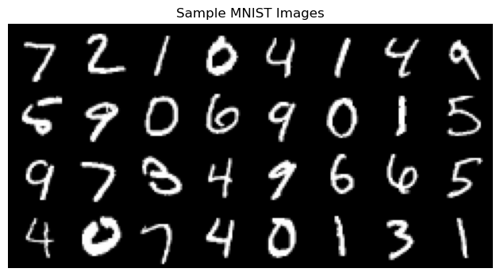
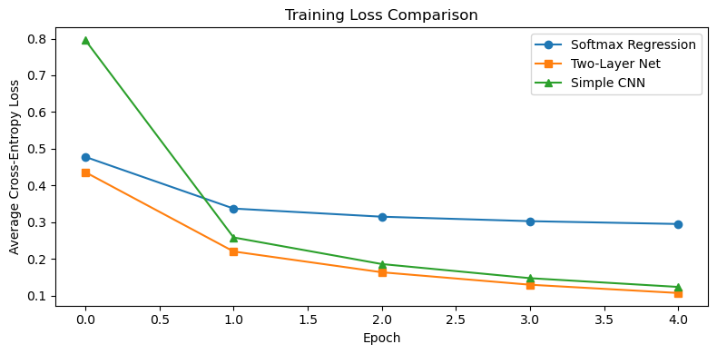
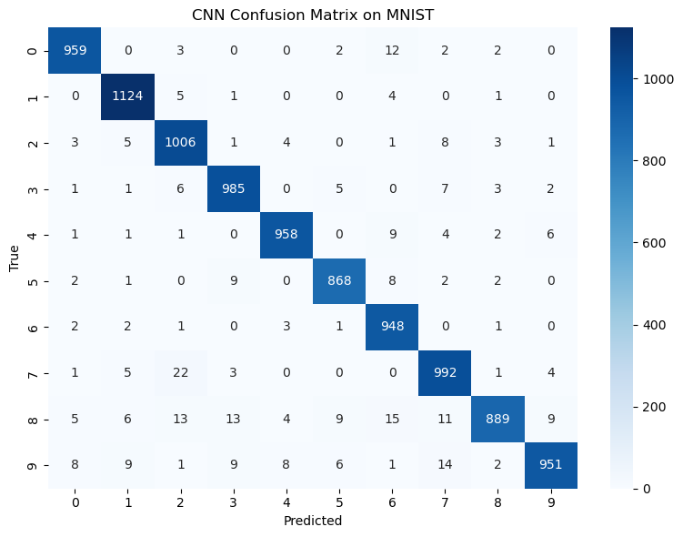
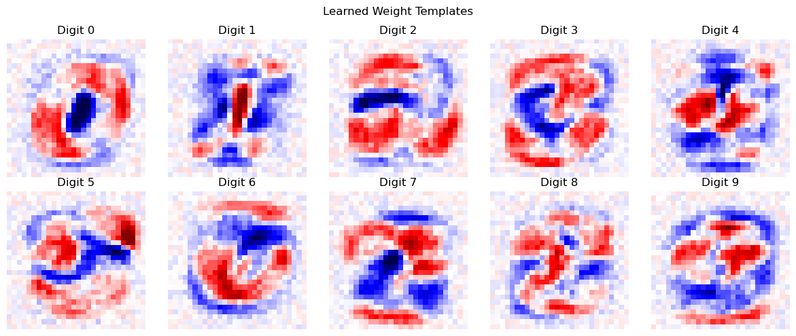

# MNIST 분류

## 개요

이 절에서는 PyTorch로 MNIST 손글씨 숫자 분류의 전체 파이프라인을 따라간다. 복잡도가 점점 커지는
세 모형 --- 단일 선형층(소프트맥스 회귀), 이층 순방향 신경망, 합성곱 신경망(CNN) --- 을
구현하고 성능을 비교한다. 실제 10범주 이미지 분류 과제에서 모형 구조가 정확도에 어떤 영향을
주는지 확인하는 것이 목표다.

---

## MNIST 자료

MNIST는 손글씨 숫자(0--9)의 회색조 이미지로 훈련 60,000장과 검정 10,000장으로 이루어져 있으며,
각 이미지는 $28 \times 28$ 화소다. 과제는 $C = 10$인 다범주 분류이고, 정규화 후 각 화소값은
$[0, 1]$에 있다.

```python
import torch
import torchvision
from torchvision import transforms
import matplotlib.pyplot as plt

transform = transforms.ToTensor()

train_dataset = torchvision.datasets.MNIST(
    root='./data', train=True, download=True, transform=transform)
test_dataset = torchvision.datasets.MNIST(
    root='./data', train=False, download=True, transform=transform)

train_loader = torch.utils.data.DataLoader(
    train_dataset, batch_size=64, shuffle=True)
test_loader = torch.utils.data.DataLoader(
    test_dataset, batch_size=64, shuffle=False)

print(f"Training samples: {len(train_dataset)}")
print(f"Test samples:     {len(test_dataset)}")
print(f"Image shape:      {train_dataset[0][0].shape}")
```

출력:

```
Training samples: 60000
Test samples:     10000
Image shape:      torch.Size([1, 28, 28])
```

---

## 표본 이미지 시각화

모형화에 앞서 자료를 살펴보는 일이 필수적이다.

```python
images, labels = next(iter(test_loader))
img_grid = torchvision.utils.make_grid(images[:32], nrow=8, padding=2)

plt.figure(figsize=(8, 4))
plt.imshow(img_grid.permute(1, 2, 0), cmap='gray')
plt.axis('off')
plt.title("Sample MNIST Images")
plt.show()
```



---

## 모형 1 --- 소프트맥스 회귀(단일 선형층)

가장 단순한 접근은 각 $28 \times 28$ 이미지를 784차원 벡터로 펼치고 선형변환 하나를 적용하는
것이다.

$$
\mathbf{z} = \mathbf{W}\mathbf{x} + \mathbf{b}, \qquad \hat{\mathbf{p}} = \operatorname{softmax}(\mathbf{z})
$$

여기서 $\mathbf{W} \in \mathbb{R}^{10 \times 784}$이고 $\mathbf{b} \in \mathbb{R}^{10}$이다.

```python
import torch.nn as nn
import torch.optim as optim

class SoftmaxRegression(nn.Module):
    def __init__(self):
        super().__init__()
        self.fc = nn.Linear(28 * 28, 10)

    def forward(self, x):
        return self.fc(x.view(x.size(0), -1))
```

PyTorch의 `nn.CrossEntropyLoss`는 log-softmax와 음의 로그가능도를 수치적으로 안정한 하나의
연산으로 결합한다. 따라서 모형의 `forward`는 확률이 아니라 **로짓**을 반환해야 한다.

---

## 학습 루프

학습 루프는 세 모형이 공유한다.

```python
def train_model(model, train_loader, epochs=5, lr=0.1):
    """Train a model with SGD and cross-entropy loss."""
    criterion = nn.CrossEntropyLoss()
    optimizer = optim.SGD(model.parameters(), lr=lr)
    loss_history = []

    for epoch in range(1, epochs + 1):
        model.train()
        running_loss = 0.0
        for images, labels in train_loader:
            optimizer.zero_grad()
            loss = criterion(model(images), labels)
            loss.backward()
            optimizer.step()
            running_loss += loss.item()
        avg_loss = running_loss / len(train_loader)
        loss_history.append(avg_loss)
        print(f"Epoch {epoch}/{epochs}, Loss: {avg_loss:.4f}")

    return loss_history
```

소프트맥스 회귀 모형을 학습시킨다.

```python
model_linear = SoftmaxRegression()
loss_linear = train_model(model_linear, train_loader, epochs=5, lr=0.1)
```

출력:

```
Epoch 1/5, Loss: 0.4777
Epoch 2/5, Loss: 0.3369
Epoch 3/5, Loss: 0.3147
Epoch 4/5, Loss: 0.3025
Epoch 5/5, Loss: 0.2948
```

---

## 평가

```python
def evaluate(model, test_loader):
    """Compute test accuracy and per-class accuracy."""
    model.eval()
    correct = total = 0
    class_correct = [0] * 10
    class_total = [0] * 10

    with torch.no_grad():
        for images, labels in test_loader:
            outputs = model(images)
            _, predicted = torch.max(outputs, 1)
            total += labels.size(0)
            correct += (predicted == labels).sum().item()
            for lbl, pred in zip(labels, predicted):
                class_total[lbl] += 1
                if lbl == pred:
                    class_correct[lbl] += 1

    acc = 100 * correct / total
    print(f"Overall accuracy: {acc:.2f}%")
    for c in range(10):
        print(f"  Digit {c}: {100 * class_correct[c] / class_total[c]:.1f}%")
    return acc

acc_linear = evaluate(model_linear, test_loader)
```

출력:

```
Overall accuracy: 92.15%
  Digit 0: 97.8%
  Digit 1: 97.6%
  Digit 2: 89.1%
  Digit 3: 92.4%
  Digit 4: 93.3%
  Digit 5: 84.0%
  Digit 6: 95.8%
  Digit 7: 91.1%
  Digit 8: 89.0%
  Digit 9: 90.2%
```

**전형적인 결과: 검정 정확도 약 92%.**

---

## 모형 2 --- 이층 순방향 신경망

ReLU 활성함수를 갖는 은닉층을 추가하면 모형이 비선형 특성 조합을 학습할 수 있다.

$$
\mathbf{h} = \operatorname{ReLU}(\mathbf{W}_1 \mathbf{x} + \mathbf{b}_1), \qquad \mathbf{z} = \mathbf{W}_2 \mathbf{h} + \mathbf{b}_2
$$

```python
class TwoLayerNet(nn.Module):
    def __init__(self, hidden_size=256):
        super().__init__()
        self.fc1 = nn.Linear(28 * 28, hidden_size)
        self.relu = nn.ReLU()
        self.fc2 = nn.Linear(hidden_size, 10)

    def forward(self, x):
        x = x.view(x.size(0), -1)
        return self.fc2(self.relu(self.fc1(x)))

model_twolayer = TwoLayerNet(hidden_size=256)
loss_twolayer = train_model(model_twolayer, train_loader, epochs=5, lr=0.1)
acc_twolayer = evaluate(model_twolayer, test_loader)
```

출력:

```
Epoch 1/5, Loss: 0.4360
Epoch 2/5, Loss: 0.2200
Epoch 3/5, Loss: 0.1632
Epoch 4/5, Loss: 0.1293
Epoch 5/5, Loss: 0.1068
Overall accuracy: 96.86%
  Digit 0: 98.9%
  Digit 1: 98.9%
  Digit 2: 96.9%
  Digit 3: 97.1%
  Digit 4: 98.0%
  Digit 5: 96.5%
  Digit 6: 96.9%
  Digit 7: 96.8%
  Digit 8: 94.0%
  Digit 9: 94.4%
```

**전형적인 결과: 검정 정확도 약 97%.** 은닉층이 원시 화소값보다 판별력이 높은 획의 양상과
곡선을 학습한다.

---

## 모형 3 --- 합성곱 신경망

CNN은 국소 수용영역과 가중치 공유를 통해 이미지의 공간 구조를 활용한다.

```python
import torch.nn.functional as F

class SimpleCNN(nn.Module):
    def __init__(self):
        super().__init__()
        self.conv1 = nn.Conv2d(1, 16, kernel_size=3, padding=1)   # -> 16 x 28 x 28
        self.conv2 = nn.Conv2d(16, 32, kernel_size=3, padding=1)  # -> 32 x 14 x 14
        self.fc = nn.Linear(32 * 7 * 7, 10)

    def forward(self, x):
        x = F.max_pool2d(F.relu(self.conv1(x)), 2)    # 28 -> 14
        x = F.max_pool2d(F.relu(self.conv2(x)), 2)    # 14 -> 7
        return self.fc(x.view(x.size(0), -1))

model_cnn = SimpleCNN()
loss_cnn = train_model(model_cnn, train_loader, epochs=5, lr=0.01)
acc_cnn = evaluate(model_cnn, test_loader)
```

출력:

```
Epoch 1/5, Loss: 0.7957
Epoch 2/5, Loss: 0.2581
Epoch 3/5, Loss: 0.1857
Epoch 4/5, Loss: 0.1472
Epoch 5/5, Loss: 0.1233
Overall accuracy: 96.80%
  Digit 0: 97.9%
  Digit 1: 99.0%
  Digit 2: 97.5%
  Digit 3: 97.5%
  Digit 4: 97.6%
  Digit 5: 97.3%
  Digit 6: 99.0%
  Digit 7: 96.5%
  Digit 8: 91.3%
  Digit 9: 94.3%
```

**전형적인 결과: 검정 정확도 약 98--99%.** 합성곱층은 위치와 무관하게 국소 양상(모서리, 꼭짓점,
고리)을 검출하므로 이미지 자료에 매우 효과적이다.

---

## 모형 비교

| 모형 | 모수 개수 | 검정 정확도 |
|---|---|---|
| 소프트맥스 회귀(선형) | $10 \times 784 + 10 = 7{,}850$ | 약 92% |
| 이층 신경망(은닉 256) | $784 \times 256 + 256 + 256 \times 10 + 10 = 203{,}530$ | 약 97% |
| 간단한 CNN(필터 16, 32) | $160 + 4{,}640 + 15{,}690 = 20{,}490$ | 약 98--99% |

CNN의 모수 개수가 이층 신경망보다 훨씬 적은데도 정확도는 더 높다. 이 효율은 가중치 공유에서
온다. $3 \times 3$ 합성곱 필터는 가중치가 9개뿐이지만 모든 공간 위치에 적용된다.

!!! note "CNN 모수 개수의 내역"
    $20{,}490$의 내역은 `conv1` $160$개, `conv2` $4{,}640$개, 완전연결층 $15{,}690$개다
    (계산은 연습문제 4). 즉 합성곱층은 전체의 $23\%$에 불과하고 나머지는 마지막 선형층이
    차지한다. CNN을 더 작게 만들려면 합성곱 필터가 아니라 마지막 완전연결층을 줄여야 하며,
    실제 구조들이 전역 평균 풀링으로 이 층을 대체하는 이유가 그것이다.

---

## 훈련 손실 곡선

세 모형의 손실 곡선을 함께 그리면 수렴 양상을 볼 수 있다.

```python
fig, ax = plt.subplots(figsize=(8, 4))
ax.plot(loss_linear, marker='o', label='Softmax Regression')
ax.plot(loss_twolayer, marker='s', label='Two-Layer Net')
ax.plot(loss_cnn, marker='^', label='Simple CNN')
ax.set_xlabel("Epoch")
ax.set_ylabel("Average Cross-Entropy Loss")
ax.set_title("Training Loss Comparison")
ax.legend()
plt.tight_layout()
plt.show()
```



---

## 혼동행렬 시각화

CNN의 혼동행렬은 모형이 여전히 헷갈려 하는 숫자 쌍을 드러낸다.

```python
import numpy as np

def get_predictions(model, loader):
    """Collect all true labels and predictions."""
    model.eval()
    all_true, all_pred = [], []
    with torch.no_grad():
        for images, labels in loader:
            _, predicted = torch.max(model(images), 1)
            all_true.extend(labels.numpy())
            all_pred.extend(predicted.numpy())
    return np.array(all_true), np.array(all_pred)

y_true, y_pred = get_predictions(model_cnn, test_loader)

from sklearn.metrics import confusion_matrix
import seaborn as sns

cm = confusion_matrix(y_true, y_pred)
fig, ax = plt.subplots(figsize=(8, 6))
sns.heatmap(cm, annot=True, fmt='d', cmap='Blues', ax=ax,
            xticklabels=range(10), yticklabels=range(10))
ax.set_xlabel("Predicted")
ax.set_ylabel("True")
ax.set_title("CNN Confusion Matrix on MNIST")
plt.tight_layout()
plt.show()
```



흔한 혼동으로는 4와 9(둘 다 오른쪽에 세로획이 있다), 3과 5(위쪽 곡선이 비슷하다)가 있다.

---

## 해석

1. **선형 모형에는 천장이 있다.** 소프트맥스 회귀는 MNIST에서 약 92%를 달성하는데, 나쁘지
   않지만 최신 수준과는 거리가 멀다. 한계는 화소 강도가 숫자 범주별로 선형분리되지 않는다는
   데 있다. 손글씨 "1"이 몇 화소만 옮겨져도 원시 화소공간에서는 아주 다르게 보인다.
2. **은닉층이 특성을 학습한다.** 이층 신경망은 숫자들이 더 잘 분리되는 중간 표현
   $\mathbf{h}$를 학습하여 선형 한계를 넘어선다. 256차원 은닉층이 학습된 특성 추출기 역할을
   한다.
3. **CNN은 공간 구조를 활용한다.** 합성곱층은 평행이동 등변이다. 한 위치에서 모서리를 검출하는
   필터가 이미지의 어느 위치에서든 같은 모서리를 검출한다. 이 귀납적 편향이 필요한 모수의
   수를 극적으로 줄이고 일반화를 개선한다.
4. **교차엔트로피 손실은 소프트맥스와 자연스럽게 짝을 이룬다.** PyTorch의
   `nn.CrossEntropyLoss`는 내부에서 로그-합-지수 기법을 구현하여, 소프트맥스를 계산한 뒤
   로그를 취할 때 생기는 수치적 불안정을 피한다.

---

## 연습문제

**연습문제 1.**
소프트맥스 회귀 모형은 $\mathbf{W} \in \mathbb{R}^{10 \times 784}$을 갖는다. 각 행
$\mathbf{w}_k$는 $28 \times 28$ 이미지로 재구성할 수 있다. 가중벡터 10개를 이미지로 시각화하고
무엇을 나타내는지 해석하라.

??? success "풀이"
    ```python
    W = model_linear.fc.weight.data.numpy()   # shape (10, 784)

    fig, axes = plt.subplots(2, 5, figsize=(12, 5))
    for k, ax in enumerate(axes.flat):
        ax.imshow(W[k].reshape(28, 28), cmap='seismic', vmin=-0.5, vmax=0.5)
        ax.set_title(f"Digit {k}")
        ax.axis('off')
    plt.suptitle("Learned Weight Templates")
    plt.tight_layout()
    plt.show()
    ```

    

    각 가중치 이미지 $\mathbf{w}_k$는 숫자 $k$에 대한 **주형(template)** 역할을 한다. 로짓
    $z_k = \mathbf{w}_k^\top \mathbf{x} + b_k$는 주형과 입력 이미지의 내적이다. 양수(빨강)
    영역은 그 화소가 켜져 있으면 범주 $k$를 지지하는 곳이고, 음수(파랑) 영역은 반대로 범주
    $k$에 반하는 곳이다. 예컨대 "0"의 주형은 대개 양수인 고리 모양과 음수인 중앙부를 보여
    숫자 0의 시각적 구조와 일치한다.

    !!! note "주형 해석은 소프트맥스 회귀에서만 유효하다"
        이렇게 가중치를 곧바로 그림으로 읽을 수 있는 것은 모형이 **선형**이기 때문이다. 이층
        신경망의 $\mathbf{W}_1$을 같은 방식으로 그리면 알아보기 어려운 무늬가 나오는데, 은닉
        단위 하나가 최종 결정에 어떻게 기여하는지는 $\mathbf{W}_2$를 거쳐야 정해지기
        때문이다. 즉 **해석 가능성은 성능과 맞바꾼 것**이며, 이 장에서 반복해서 만나는
        절충이다.

---

**연습문제 2.**
세 모형 각각에 대해 표본 하나의 순전파에 필요한 부동소수점 곱셈-누산 연산(MAC)의 수를
계산하라. 이를 이용해, CNN이 모수는 더 적은데도 표본당 계산은 왜 더 비싼지 설명하라.

??? success "풀이"
    **소프트맥스 회귀:** $\mathbf{W} \in \mathbb{R}^{10 \times 784}$인 행렬-벡터 곱
    $\mathbf{W}\mathbf{x}$ 하나에 $10 \times 784 = 7{,}840$번의 MAC이 필요하다.

    **이층 신경망:**

    - 첫 층: $784 \times 256 = 200{,}704$ MAC
    - 둘째 층: $256 \times 10 = 2{,}560$ MAC
    - 합계: $203{,}264$ MAC

    **간단한 CNN:**

    - Conv1: $3 \times 3 \times 1$ 크기의 필터 $16$개를 $28 \times 28$개 공간 위치에 적용:
      $16 \times 9 \times 28 \times 28 = 112{,}896$ MAC
    - Conv2: $3 \times 3 \times 16$ 크기의 필터 $32$개를 $14 \times 14$개 위치에 적용:
      $32 \times 144 \times 14 \times 14 = 903{,}168$ MAC
    - 완전연결층: $32 \times 7 \times 7 \times 10 = 15{,}680$ MAC
    - 합계: $1{,}031{,}744$ MAC

    CNN의 모수는 $20{,}490$개로 이층 신경망의 $203{,}530$개보다 **10분의 1 수준**이다. 각
    합성곱 필터가 모든 공간 위치에서 공유되기 때문이다. 그러나 MAC은 $1{,}031{,}744$번으로
    이층 신경망의 $203{,}264$번보다 **5배 많다.** 같은 작은 필터를 특성지도의 모든 위치에
    적용하기 때문이다.

    | 모형 | 모수 | MAC | MAC/모수 |
    |---|---|---|---|
    | 소프트맥스 회귀 | $7{,}850$ | $7{,}840$ | $1.0$ |
    | 이층 신경망 | $203{,}530$ | $203{,}264$ | $1.0$ |
    | 간단한 CNN | $20{,}490$ | $1{,}031{,}744$ | $50.4$ |

    완전연결층에서는 모수 하나가 정확히 한 번씩 쓰이므로 MAC/모수 비가 1이다. 합성곱층에서는
    같은 가중치가 여러 위치에서 재사용되므로 이 비가 크게 올라간다. 즉 CNN은 **모수 효율을
    계산 비용과 맞바꾸고**, 그 대가로 평행이동 등변성을 얻는다.

    실무적 함의: 메모리가 제약이면(모바일, 임베디드) CNN이 유리하고, 계산량이 제약이면
    (배치 추론량이 많은 서버) 반대다.

---

**연습문제 3.**
이층 신경망의 ReLU 활성함수 뒤에 확률 $p = 0.5$의 드롭아웃을 넣도록 수정하라. 10 에포크 학습한
뒤 드롭아웃이 있을 때와 없을 때의 훈련/검정 정확도 격차를 비교하라. 드롭아웃이 왜 정칙화로
작동하는지 설명하라.

??? success "풀이"
    ```python
    class TwoLayerDropout(nn.Module):
        def __init__(self, hidden_size=256, p=0.5):
            super().__init__()
            self.fc1 = nn.Linear(28 * 28, hidden_size)
            self.dropout = nn.Dropout(p)
            self.fc2 = nn.Linear(hidden_size, 10)

        def forward(self, x):
            x = x.view(x.size(0), -1)
            x = F.relu(self.fc1(x))
            x = self.dropout(x)
            return self.fc2(x)

    model_drop = TwoLayerDropout()
    loss_drop = train_model(model_drop, train_loader, epochs=10, lr=0.1)
    acc_drop = evaluate(model_drop, test_loader)
    ```

    출력:

    ```
    Epoch 1/10, Loss: 0.4943
    Epoch 2/10, Loss: 0.2539
    Epoch 3/10, Loss: 0.2002
    Epoch 4/10, Loss: 0.1715
    Epoch 5/10, Loss: 0.1518
    Epoch 6/10, Loss: 0.1373
    Epoch 7/10, Loss: 0.1257
    Epoch 8/10, Loss: 0.1152
    Epoch 9/10, Loss: 0.1113
    Epoch 10/10, Loss: 0.1035
    Overall accuracy: 97.63%
      Digit 0: 98.6%
      Digit 1: 99.0%
      Digit 2: 98.3%
      Digit 3: 98.3%
      Digit 4: 96.4%
      Digit 5: 97.1%
      Digit 6: 97.5%
      Digit 7: 97.0%
      Digit 8: 96.9%
      Digit 9: 96.9%
    ```

    드롭아웃이 없으면 이층 신경망이 훈련 정확도 약 99%, 검정 정확도 약 97%를 내어 2%포인트의
    격차가 생긴다. 드롭아웃을 넣으면 훈련 정확도가 낮아지지만(약 97%) 검정 정확도는 비슷하거나
    조금 좋아져 격차가 줄어든다.

    드롭아웃이 정칙화로 작동하는 이유는, 학습 중에 각 은닉 단위를 확률 $p$로 무작위로 0으로
    만들기 때문이다. 그러면 신경망이 어느 한 뉴런에 의존할 수 없고 학습된 표현을 여러 단위에
    분산시켜야 한다. 사실상 드롭아웃은 지수적으로 많은 부분 신경망의 앙상블(가능한 마스크
    $2^{256}$가지 전부)을 학습시키고 검정 시점에 그 예측을 평균한다. 이는 특성 사이의
    공적응을 줄이고 일반화를 개선한다.

    !!! note "가중치 척도화는 PyTorch에서 학습 시점에 일어난다"
        위 설명은 "검정 시점에 가중치를 $1-p$배 한다"는 원논문(Srivastava et al., 2014)의
        서술이다. 그러나 PyTorch의 `nn.Dropout`은 **역 드롭아웃**을 구현한다. 학습 시점에
        살아남은 단위를 $1/(1-p)$배 키우고 검정 시점에는 아무 일도 하지 않는다. 기댓값이
        같으므로 수학적으로 동등하지만, 추론 코드에 특별한 처리가 필요 없다는 장점이 있다.

        중요한 실무 수칙: 평가 전에 반드시 `model.eval()`을 호출해야 드롭아웃이 꺼진다. 이를
        잊으면 검정 시점에도 무작위로 뉴런이 꺼져 정확도가 낮게 나오고, 예측이 호출할 때마다
        달라진다. 위 `evaluate` 함수가 첫 줄에서 `model.eval()`을 부르는 이유다.

---

**연습문제 4.**
입력 채널 $C_{\text{in}}$개, 출력 채널 $C_{\text{out}}$개, 커널 크기 $k \times k$인 합성곱층의
모수 개수가 $C_{\text{out}}(C_{\text{in}} k^2 + 1)$임을 증명하라. 위 CNN의 두 합성곱층에 대해
확인하라.

??? success "풀이"
    $C_{\text{out}}$개의 필터 각각은 $C_{\text{in}}$개의 입력 채널마다 $k \times k$ 공간 커널을
    가지고, 여기에 편향 하나가 더해진다. 따라서 총 모수 개수는

    $$
    C_{\text{out}} \times (C_{\text{in}} \times k^2 + 1)
    $$

    이다.

    **Conv1:** $C_{\text{in}} = 1$, $C_{\text{out}} = 16$, $k = 3$:

    $$
    16 \times (1 \times 9 + 1) = 16 \times 10 = 160
    $$

    **Conv2:** $C_{\text{in}} = 16$, $C_{\text{out}} = 32$, $k = 3$:

    $$
    32 \times (16 \times 9 + 1) = 32 \times 145 = 4{,}640
    $$

    **완전연결층:** 입력 $32 \times 7 \times 7 = 1{,}568$개, 출력 10개이므로
    $1{,}568 \times 10 + 10 = 15{,}690$개.

    **합계:** $160 + 4{,}640 + 15{,}690 = 20{,}490$개.

    PyTorch로 확인할 수 있다.

    ```python
    total = sum(p.numel() for p in model_cnn.parameters())
    print(f"Total CNN parameters: {total}")
    ```

    출력:

    ```
    Total CNN parameters: 20490
    ```

    $\square$

---

**연습문제 5.**
MNIST의 소프트맥스 회귀 모형은 784차원 화소공간에서 선형 결정경계를 학습한다. 서로 다른 범주에
속하면서 화소공간에서 유클리드 거리가 작은 두 이미지의 구체적인 예를 들고, 이것이 왜 선형
분류기에 문제가 되는지 설명하라. 그다음 CNN이 이 한계를 어떻게 극복하는지 설명하라.

??? success "풀이"
    이미지 가운데에 가는 세로획으로 그린 숫자 "1"과, 같은 "1"을 오른쪽으로 3화소 옮긴 것을
    생각하자. 화소공간에서는 원본의 0이 아닌 화소가 모두 이동했으므로 두 이미지 사이의 유클리드
    거리가 상당히 크다.

    $$
    \|\mathbf{x}_{\text{centered}} - \mathbf{x}_{\text{shifted}}\|_2 = \sqrt{\sum_{i} (x_i^{\text{cen}} - x_i^{\text{shift}})^2} > 0
    $$

    둘 다 분명히 "1"인데도 그렇다. 반대로 특정한 획 방식으로 쓴 "7"이 옮겨진 "1"과 비슷한
    화소를 활성화하여, 다른 범주인데도 유클리드 거리가 작을 수 있다.

    선형 분류기에서 로짓 $z_k = \mathbf{w}_k^\top \mathbf{x} + b_k$는 화소의 절대 위치에
    의존한다. 3화소 이동이 모든 $z_k$를 바꾸고 예측 범주까지 바꿀 수 있다. 선형 모형은 위치
    변형마다 별도의 주형을 학습해야 하는데, 제한된 자료로는 불가능하다.

    CNN은 **평행이동 등변성**으로 이를 극복한다. 합성곱층은 학습된 같은 필터를 모든 공간
    위치에 적용한다. 어떤 필터가 위치 $(i, j)$에서 세로 모서리를 검출한다면 $(i, j+3)$에서도
    같은 모서리를 검출한다. 뒤따르는 최대 풀링층이 근사적인 **평행이동 불변성**을 도입하여
    작은 이동에 대한 민감도를 더 줄인다. CNN은 위치와 무관하게 "세로선"이라는 획 양상을
    인식하도록 학습하며, 이것이 숫자 인식에 필요한 바로 그 불변성이다.

    !!! note "등변성과 불변성은 다르다"
        두 용어가 혼용되는 경우가 많지만 구별해야 한다. **등변성**은 입력을 옮기면 출력도 같은
        만큼 옮겨진다는 뜻이고($f(T x) = T f(x)$), **불변성**은 입력을 옮겨도 출력이 변하지
        않는다는 뜻이다($f(T x) = f(x)$). 합성곱 자체는 등변이지 불변이 아니다. 불변성은
        풀링이나 전역 평균 같은 집계 연산에서 나온다. 그리고 이 CNN의 불변성은 **근사적**이다.
        $2 \times 2$ 최대 풀링을 두 번 거치면 대략 4화소 정도의 이동에 둔감해질 뿐, 그보다 큰
        이동에는 여전히 민감하다. 그래서 자료 증강(무작위 이동, 회전)이 여전히 도움이 된다.
