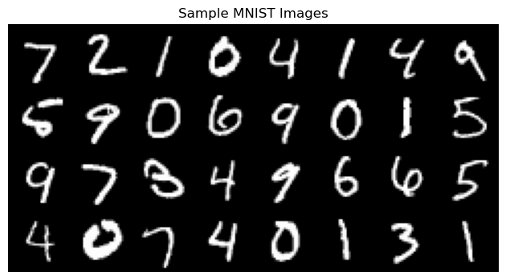
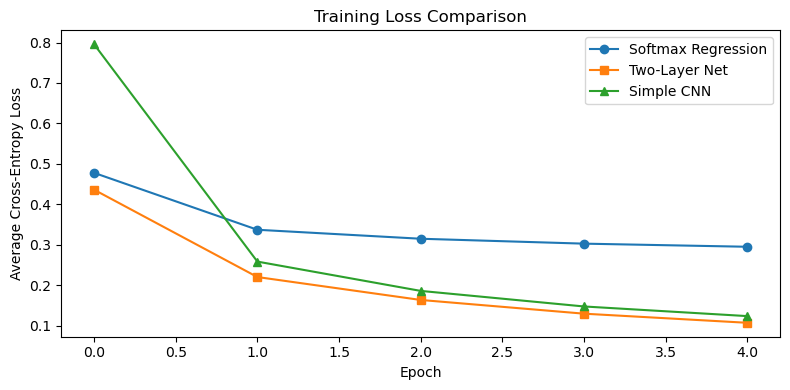
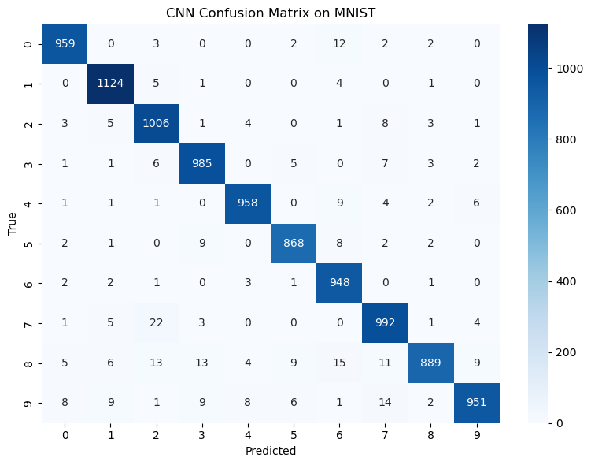
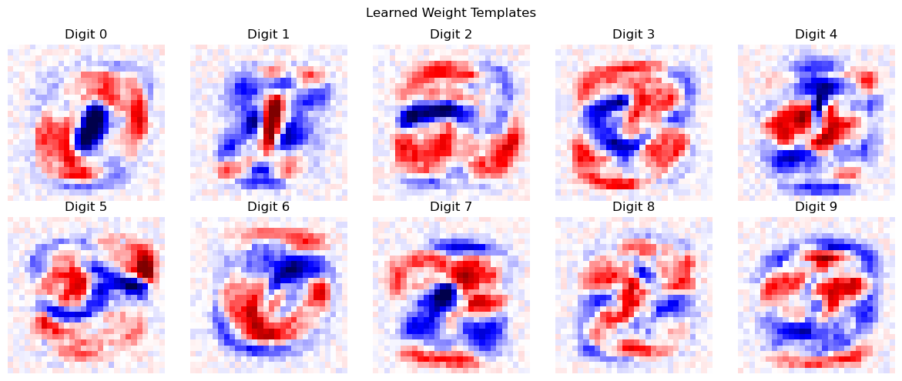

# MNIST 분류

## 개요

이 절에서는 PyTorch로 MNIST 손글씨 숫자 분류의 전체 파이프라인을 따라간다. 복잡도가 점점 커지는
세 모형 --- 단일 선형층(소프트맥스 회귀), 이층 순방향 신경망, 합성곱 신경망(CNN) --- 을
구현하고 성능을 비교한다. 실제 10범주 이미지 분류 과제에서 모형 구조가 정확도에 어떤 영향을
주는지 확인하는 것이 목표다.

---

## 1. MNIST 자료

MNIST는 손글씨 숫자(0--9)의 회색조 이미지로 훈련 60,000장과 검정 10,000장으로 이루어져 있으며,
각 이미지는 $28 \times 28$ 화소다. 과제는 $C = 10$인 다범주 분류이고, 정규화 후 각 화소값은
$[0, 1]$에 있다.

<div class="exbox" markdown>

**보기 1.** <span class="diff easy" title="쉬움"></span> MNIST 자료 읽기

**(1)** 이미지 하나의 모양이 $(28, 28)$이 아니라 $(1, 28, 28)$로 나온다. 앞의 $1$은 무엇인가.

**(2)** `train_loader`는 섞고 `test_loader`는 섞지 않는다. 섞지 않으면 무엇이 가능해지는가. 두 적재기가 내놓는 묶음 수와 마지막 묶음 크기도 함께 구하시오.

</div>

??? success "풀이"

    **(1) 채널 축이다.** 파이토치의 이미지 텐서는 $(\text{채널},\ \text{높이},\ \text{너비})$ 순이고, MNIST는 회색조라 채널이 하나뿐이다. 컬러였다면 $(3, 28, 28)$이었을 것이다. 묶음으로 쌓이면 $(64, 1, 28, 28)$이 되며, 합성곱층은 이 네 축을 그대로 받는다. 선형 모형은 쓰지 않는 축이라 `x.view(x.size(0), -1)`로 $784$개를 한 줄로 펴 버린다.

    **(2) 섞지 않으면 예측을 자료와 짝지을 수 있다.** `shuffle=False`이면 적재기가 `test_dataset[0], test_dataset[1], \ldots` 순서대로 내놓으므로, 모아 둔 예측 벡터의 $i$번째가 $i$번째 검정 이미지에 대응한다. 그래서

    - 틀린 사례를 **색인으로 되찾아** 눈으로 볼 수 있고,
    - 여러 모형의 예측을 **같은 순서로 나란히** 놓고 어디서 갈리는지 볼 수 있으며,
    - 다시 돌려도 혼동행렬이 **똑같이** 나온다.

    훈련 쪽은 반대다. 섞지 않으면 묶음마다 같은 순서로 같은 자료가 들어와 기울기가 세대마다 똑같은 궤적을 그리고, 자료가 이름표 순으로 정렬되어 있기라도 하면 한 묶음이 한 범주로만 채워져 학습이 망가진다.

    묶음 수는 올림이고 마지막 묶음은 나머지다.

    $$
    \left\lceil \tfrac{60000}{64}\right\rceil = 938 \ (\text{마지막 } 32\text{장}),
    \qquad
    \left\lceil \tfrac{10000}{64}\right\rceil = 157 \ (\text{마지막 } 16\text{장})
    $$

    ```python
    import torch
    import torchvision
    from torchvision import transforms
    import matplotlib.pyplot as plt

    # ToTensor 가 화소값을 0~1 로 눌러 준다. 눈금을 맞추지 않으면 학습이 더디다.
    transform = transforms.ToTensor()

    train_dataset = torchvision.datasets.MNIST(
        root='./data', train=True, download=True, transform=transform)
    test_dataset = torchvision.datasets.MNIST(
        root='./data', train=False, download=True, transform=transform)

    train_loader = torch.utils.data.DataLoader(
        train_dataset, batch_size=64, shuffle=True)
    # 시험자료는 섞지 않는다. 순서가 고정되어야 예측을 원래 이름표와
    # 짝지어 견줄 수 있다.
    test_loader = torch.utils.data.DataLoader(
        test_dataset, batch_size=64, shuffle=False)

    print(f"Training samples: {len(train_dataset)}")
    print(f"Test samples:     {len(test_dataset)}")
    print(f"Image shape:      {train_dataset[0][0].shape}")

    # (2) 를 확인한다.
    print(f"묶음 수  train {len(train_loader)}  test {len(test_loader)}")
    print(f"마지막 묶음  train {60000 % 64}장  test {10000 % 64}장")

    first = next(iter(test_loader))[1]
    again = next(iter(test_loader))[1]
    print(f"test_loader 를 두 번 돌려도 첫 묶음이 같은가: {bool((first == again).all())}")
    print(f"검정자료 앞 열 장의 이름표 {test_dataset.targets[:10].tolist()}")
    print(f"적재기가 준 앞 열 개      {first[:10].tolist()}")
    ```

    출력:

    ```
    Training samples: 60000
    Test samples:     10000
    Image shape:      torch.Size([1, 28, 28])
    묶음 수  train 938  test 157
    마지막 묶음  train 32장  test 16장
    test_loader 를 두 번 돌려도 첫 묶음이 같은가: True
    검정자료 앞 열 장의 이름표 [7, 2, 1, 0, 4, 1, 4, 9, 5, 9]
    적재기가 준 앞 열 개      [7, 2, 1, 0, 4, 1, 4, 9, 5, 9]
    ```

    **(1)과 (2)가 모두 확인된다.** 모양이 `torch.Size([1, 28, 28])`로 채널 축이 앞에 있고, 묶음이 $938$개와 $157$개이며 마지막이 $32$장과 $16$장이다. 그리고 `shuffle=False` 덕분에 적재기가 주는 순서가 `test_dataset.targets`의 순서와 **정확히 같다.** 두 번 돌려도 같은 묶음이 나오므로, 아래 보기 2의 그림과 보기 10의 혼동행렬이 다시 돌려도 그대로 재현된다.

---

## 2. 표본 이미지 시각화

모형화에 앞서 자료를 살펴보는 일이 필수적이다.

<div class="exbox" markdown>

**보기 2.** <span class="diff easy" title="쉬움"></span> 자료 눈으로 보기

**(1)** `shuffle=False`이므로 그림에 나올 $32$장이 **무엇인지 미리 알 수 있다.** 어느 이미지들인가.

**(2)** 그려 보고 무엇이 읽히는지 적으시오. 이 그림이 **가리는 것**은 무엇인가.

</div>

??? success "풀이"

    **(1) 검정자료의 처음 $32$장이다.** 보기 1에서 보았듯 섞지 않으면 첫 묶음이 `test_dataset[0]`부터 `test_dataset[63]`까지이고, 코드가 `images[:32]`로 앞의 절반만 가져간다. 그 이름표는 `test_dataset.targets[:32]`로 미리 읽을 수 있다.

    $$
    7,\,2,\,1,\,0,\,4,\,1,\,4,\,9,\ \ 5,\,9,\,0,\,6,\,9,\,0,\,1,\,5,\ \ 9,\,7,\,3,\,4,\,9,\,6,\,6,\,5,\ \ 4,\,0,\,7,\,4,\,0,\,1,\,3,\,1
    $$

    `nrow=8`이므로 네 줄 여덟 칸으로 이 순서대로 놓인다.

    ```python
    plt.rcParams["font.sans-serif"] = ["NanumGothic", "Apple SD Gothic Neo", "Malgun Gothic"]
    plt.rcParams["font.family"] = "sans-serif"
    plt.rcParams["axes.unicode_minus"] = False

    # 모형을 세우기 전에 자료를 눈으로 본다. 어떤 자료인지도 모르고 학습부터
    # 돌리는 것은 통계에서든 기계학습에서든 좋지 않은 습관이다.
    images, labels = next(iter(test_loader))
    img_grid = torchvision.utils.make_grid(images[:32], nrow=8, padding=2)

    plt.figure(figsize=(8, 4))
    plt.imshow(img_grid.permute(1, 2, 0), cmap='gray')
    plt.axis('off')
    plt.title("Sample MNIST Images")
    plt.show()

    # (1) 과 맞춰 본다.
    print("그림의 이름표  ", labels[:32].tolist())
    print("자료의 앞 32개 ", test_dataset.targets[:32].tolist())
    print("범주별 등장 횟수", torch.bincount(labels[:32], minlength=10).tolist())
    ```

    출력:

    ```
    그림의 이름표   [7, 2, 1, 0, 4, 1, 4, 9, 5, 9, 0, 6, 9, 0, 1, 5, 9, 7, 3, 4, 9, 6, 6, 5, 4, 0, 7, 4, 0, 1, 3, 1]
    자료의 앞 32개  [7, 2, 1, 0, 4, 1, 4, 9, 5, 9, 0, 6, 9, 0, 1, 5, 9, 7, 3, 4, 9, 6, 6, 5, 4, 0, 7, 4, 0, 1, 3, 1]
    범주별 등장 횟수 [5, 5, 1, 2, 5, 3, 3, 3, 0, 5]
    ```

    

    **(1)이 맞는다.** 그림의 첫 줄이 $7, 2, 1, 0, 4, 1, 4, 9$로 자료의 앞 여덟 장과 같다.

    **읽히는 것.** 모두 흰 획에 검은 바탕이고 숫자가 칸 한가운데에 비슷한 크기로 놓여 있다. 그러면서도 같은 숫자의 생김새가 꽤 다르다. 둘째 줄의 $9$와 다섯째 칸의 $9$는 고리의 크기가 다르고, 셋째 줄의 $3$은 위아래 곡선이 거의 닿아 있어 $8$처럼 보인다. **분류기가 다룰 변이가 어느 정도인지**를 가늠하게 해 주는 것이 이 그림의 몫이다.

    **가리는 것은 표본의 치우침이다.** $32$장은 적어서 범주별 등장 횟수가 $[5, 5, 1, 2, 5, 3, 3, 3, 0, 5]$로 몹시 고르지 않다. **숫자 $8$은 한 장도 없고 $2$는 한 장뿐**이다. 검정자료 전체에서는 범주마다 $892$장에서 $1{,}135$장까지 비교적 고른데도 그렇다. 그러므로 이 그림을 보고 "MNIST에는 $8$이 드물다"거나 "$9$가 흔하다"고 읽으면 안 된다. 범주 분포를 보려면 그림이 아니라 `bincount`를 보아야 한다.

    보기 10에서 보듯 모형이 가장 못 맞히는 숫자가 $8$인데, 그 $8$이 이 그림에는 하나도 없다. **눈으로 보는 단계에서 가장 중요한 범주를 못 보고 지나칠 수 있다**는 것이 이 그림의 한계다.
---

## 3. 모형 1 --- 소프트맥스 회귀(단일 선형층)

가장 단순한 접근은 각 $28 \times 28$ 이미지를 784차원 벡터로 펼치고 선형변환 하나를 적용하는
것이다.

$$
\mathbf{z} = \mathbf{W}\mathbf{x} + \mathbf{b}, \qquad \hat{\mathbf{p}} = \operatorname{softmax}(\mathbf{z})
$$

여기서 $\mathbf{W} \in \mathbb{R}^{10 \times 784}$이고 $\mathbf{b} \in \mathbb{R}^{10}$이다.

<div class="exbox" markdown>

**보기 3.** <span class="diff easy" title="쉬움"></span> 소프트맥스 회귀 모형

**(1)** 이 모형의 모수를 세고, `fc.weight`의 모양이 왜 $(10, 784)$인지 밝히시오.

**(2)** `forward`가 소프트맥스를 씌우지 않는다. 만약 `nn.Softmax(dim=1)`을 덧붙이고 `nn.CrossEntropyLoss`를 그대로 쓰면 모형은 **무엇을 최소화하게 되는가.** 식으로 적으시오.

</div>

??? success "풀이"

    **(1) 모수는 $7{,}850$개.** `nn.Linear(784, 10)`은 $\text{out} \times \text{in} = 10 \times 784 = 7{,}840$개의 가중치와 $10$개의 편향을 갖는다. 파이토치가

    $$
    \mathbf{z} = \mathbf{x}\,\mathbf{W}^\top + \mathbf{b},
    \qquad \mathbf{W} \in \mathbb{R}^{10 \times 784}
    $$

    로 계산하기 때문에 `weight`가 $(\text{out},\ \text{in})$ 순이다. 덕분에 `fc.weight[k]`가 길이 $784$인 **범주 $k$의 주형**이 되어 $28\times28$로 되돌려 그릴 수 있다(연습문제 1).

    **(2) 로그를 두 번 씌우게 된다.** `nn.CrossEntropyLoss`는 **로짓**을 받아 안에서 log-softmax를 적용한다. 그러므로 입력이 이미 확률 $\hat p$이면 계산되는 것은

    $$
    \ell = -\log\bigl[\operatorname{softmax}(\hat{\mathbf{p}})\bigr]_{y}
    = -\hat p_y + \log\sum_{c} e^{\hat p_c}
    $$

    이다. 이것은 교차엔트로피가 아니다. $\hat p_c \in (0, 1)$이므로 $e^{\hat p_c} \in (1, e)$에 갇혀 있고, 따라서 손실이

    $$
    \log\bigl(9 + e\bigr) - 1 = 1.4612
    \quad\text{부터}\quad
    \log\bigl(9 + e\bigr) = 2.4612
    $$

    사이에서만 움직인다. 아래끝은 $\hat p_y = 1$(완벽한 예측)일 때이고 위끝은 틀린 범주 하나에 확률이 모두 쏠렸을 때다. 두 끝의 차이가 $\hat p_y$의 계수 $1$에서 그대로 나오므로 **폭이 정확히 $1$이다.**

    **아무리 잘 맞혀도 손실이 $1.4612$ 아래로 내려가지 않는다.** 기울기도 그만큼 눌려 학습이 거의 진행되지 않는다. 틀렸을 때의 벌이 $+\infty$까지 커지는 교차엔트로피의 성질이 완전히 사라지는 것이 핵심 손해다.

    균등한 예측 $\hat p = (1/10, \ldots, 1/10)$을 넣으면 손실이 $\log 10 = 2.3026$인데, 이 값은 위 구간 **안**에 있다. 제대로 된 교차엔트로피에서는 $\log 10$이 "아무것도 모르는 상태"라는 기준선이지만, 소프트맥스를 두 번 씌우면 그보다 더 나쁜 값($2.4612$까지)이 가능해지면서 기준선의 뜻도 사라진다.

    ```python
    import torch.nn as nn
    import torch.optim as optim

    class SoftmaxRegression(nn.Module):
        """선형층 하나. 이름 그대로 소프트맥스 회귀이며, 신경망의 가장 단순한 꼴이다.

        CrossEntropyLoss 가 소프트맥스를 안에서 씌우므로 여기서는 로짓만 낸다.
        """

        def __init__(self):
            super().__init__()
            self.fc = nn.Linear(28 * 28, 10)

        def forward(self, x):
            return self.fc(x.view(x.size(0), -1))

    m = SoftmaxRegression()
    print(f"fc.weight {tuple(m.fc.weight.shape)},  fc.bias {tuple(m.fc.bias.shape)},"
          f"  모수 {sum(p.numel() for p in m.parameters())}")

    # (2) 를 수로 본다. 완벽한 예측과 완전히 틀린 예측을 각각 넣는다.
    crit = nn.CrossEntropyLoss()
    y = torch.tensor([0])
    perfect = torch.tensor([[1.0] + [0.0] * 9])      # 참 범주에 확률 1
    wrong = torch.tensor([[0.0, 1.0] + [0.0] * 8])   # 참 범주에 확률 0
    print(f"확률을 넣었을 때   완벽 {crit(perfect, y):.4f}   완전히 틀림 {crit(wrong, y):.4f}")
    print(f"로짓을 넣었을 때   완벽 {crit(perfect * 20, y):.4f}"
          f"   완전히 틀림 {crit(wrong * 20, y):.4f}")
    ```

    출력:

    ```
    fc.weight (10, 784),  fc.bias (10,),  모수 7850
    확률을 넣었을 때   완벽 1.4612   완전히 틀림 2.4612
    로짓을 넣었을 때   완벽 0.0000   완전히 틀림 20.0000
    ```

    **(1)의 $7{,}850$과 $(10, 784)$가 맞는다.** 그리고 (2)의 계산도 맞는다. 확률을 넣으면 완벽한 예측에도 손실이 $1.4612$로 남고 — 손으로 구한 $-1 + \log(9 + e) = 1.4612$와 같다 — 완전히 틀려도 $2.4612$밖에 안 된다. **잘한 것과 못한 것의 차이가 고작 $1$이다.** 로짓을 제대로 넣으면 같은 두 경우가 $0.0000$과 $20.0000$으로 갈린다. 소프트맥스를 두 번 씌우면 학습이 "망가진다"는 말의 정확한 내용이 이것이다.
PyTorch의 `nn.CrossEntropyLoss`는 log-softmax와 음의 로그가능도를 수치적으로 안정한 하나의
연산으로 결합한다. 따라서 모형의 `forward`는 확률이 아니라 **로짓**을 반환해야 한다.

---

## 4. 학습 루프

학습 루프는 세 모형이 공유한다.

<div class="exbox" markdown>

**보기 4.** <span class="diff easy" title="쉬움"></span> 학습 함수

**(1)** 이 함수가 세대마다 찍는 `avg_loss`는 무엇의 평균인가. [앞 쪽의 같은 모형](mnist.md)이 찍은 값과 왜 다른지 밝히시오.

**(2)** 그 차이가 **흔들림의 크기**에 어떻게 나타나는지 두 쪽의 출력으로 보이시오.

</div>

??? success "풀이"

    **(1) 묶음 $938$개의 평균이다.** 안쪽 반복문이 `running_loss += loss.item()`으로 묶음마다 손실을 누적하고, 세대가 끝나면 `running_loss / len(train_loader)`로 나눈다. `len(train_loader) = 938`이므로

    $$
    \frac{1}{938}\sum_{k=1}^{938} \ell_k,
    \qquad \ell_k = \text{묶음 } k \text{ 의 평균 손실}
    $$

    이다. 묶음 크기가 모두 $64$라면(마지막만 $32$) 이는 **그 세대에 쓰인 $60{,}000$장 전체의 평균**과 사실상 같다.

    [앞 쪽의 `SimpleMNIST` 학습 루프](mnist.md)는 다르다. 거기서는 `print`가 안쪽 반복문 바깥에 있고 `loss`가 마지막 대입값을 들고 있어, 찍히는 것이 **그 세대의 마지막 묶음 $64$장**이다. 같은 모형, 같은 학습률, 같은 세대 수인데 **보고하는 양이 다르다.**

    **(2) 표준오차가 $\sqrt{938} = 30.6$배 차이 난다.** 표본당 손실의 표준편차를 $\sigma$라 하면 $64$장 평균의 표준오차는 $\sigma/8$이고 $60{,}000$장 평균의 표준오차는 $\sigma/245$다. 앞 쪽에서 $\sigma = 0.8233$을 쟀으므로 각각 $0.1029$와 $0.0034$다. 출력이 그대로 보여 준다.

    | | 세대 1 | 2 | 3 | 4 | 5 | 단조인가 |
    |:---|---:|---:|---:|---:|---:|:---:|
    | 마지막 묶음 하나 | $0.2995$ | $0.3877$ | $0.3358$ | $0.2993$ | $0.3032$ | 아니다 |
    | 938묶음 평균 | $0.4777$ | $0.3369$ | $0.3147$ | $0.3025$ | $0.2948$ | 그렇다 |

    아래 줄은 **한 번도 되오르지 않고** 깨끗하게 내려간다. 세대 $4$와 $5$의 차이가 $0.0077$로 작은데, 위 줄의 흔들림 $0.1$에 견주면 이런 작은 개선은 묶음 하나로는 **아예 볼 수 없는** 크기다.

    첫 세대만 거꾸로다. $0.4777 > 0.2995$인데, 평균 쪽이 세대 **처음의 높은 손실**($\log 10 = 2.3026$ 근처에서 출발한다)까지 함께 평균했기 때문이다. 묶음 하나만 보면 세대 끝의 상태만 보이므로 처음이 얼마나 나빴는지가 지워진다. **평균은 흔들림을 줄이는 대신 세대 안의 변화를 뭉갠다.** 둘 다 알고 보는 것이 맞다.

    ```python
    def train_model(model, train_loader, epochs=5, lr=0.1):
        """확률적 경사하강법과 교차엔트로피로 모형을 학습한다.

        세 모형에 모두 이 함수를 쓴다. 학습 절차를 똑같이 맞춰야 모형 구조의
        차이만 견줄 수 있다.
        """
        criterion = nn.CrossEntropyLoss()
        optimizer = optim.SGD(model.parameters(), lr=lr)
        loss_history = []

        for epoch in range(1, epochs + 1):
            model.train()
            running_loss = 0.0
            for images, labels in train_loader:
                optimizer.zero_grad()
                loss = criterion(model(images), labels)
                loss.backward()
                optimizer.step()
                running_loss += loss.item()
            avg_loss = running_loss / len(train_loader)
            loss_history.append(avg_loss)
            print(f"Epoch {epoch}/{epochs}, Loss: {avg_loss:.4f}")

        return loss_history

    # 두 보고 방식의 표준오차를 견준다. sigma 는 앞 쪽에서 잰 값이다.
    sigma = 0.8233
    print(f"묶음 하나(64장)   표준오차 {sigma / 64**0.5:.4f}")
    print(f"938묶음 평균      표준오차 {sigma / 60000**0.5:.4f}"
          f"   ({938**0.5:.1f}배 작다)")
    ```

    출력:

    ```
    묶음 하나(64장)   표준오차 0.1029
    938묶음 평균      표준오차 0.0034   (30.6배 작다)
    ```

    예고한 $30.6$배가 그대로 나온다. **보고 방식을 바꾼 것만으로 곡선이 들쭉날쭉한 것과 매끄러운 것이 갈린다.**

소프트맥스 회귀 모형을 학습시킨다.

<div class="exbox" markdown>

**보기 5.** <span class="diff easy" title="쉬움"></span> 선형 모형 학습

**(1)** 학습을 시작하기 **직전**의 평균 손실은 얼마여야 하는가. 첫 세대의 평균 $0.4777$과 견주어 그 사이에 무슨 일이 있었는지 말하시오.

**(2)** 다섯 세대 동안 손실이 $0.4777 \to 0.2948$로 내려간다. 네 번의 감소폭을 적고, 더 돌리면 얼마까지 내려갈 수 있을지 가늠하시오.

</div>

??? success "풀이"

    **(1) 출발점은 $\log 10 = 2.3026$이다.** `nn.Linear`의 기본 초기화는 $U(-1/\sqrt{784},\ 1/\sqrt{784})$에서 뽑으므로 로짓이 모두 $0$ 근처이고, 소프트맥스가 거의 균등한 $(1/10, \ldots, 1/10)$을 준다. 그러면 표본당 손실이

    $$
    -\log \tfrac{1}{10} = \log 10 = 2.302585
    $$

    다. 그런데 첫 세대의 **평균**은 $0.4777$로 이미 그 $1/4.8$이다. 모순이 아니다. 평균을 내는 $938$개 묶음 가운데 첫 몇 개만 $2.3$ 근처이고, 나머지는 이미 갱신을 받은 뒤의 낮은 손실이기 때문이다. **학습률 $0.1$에서 선형 모형은 한 세대 안에 거의 다 배운다.**

    **(2) 감소폭이 급격히 줄어든다.**

    | 세대 | 손실 | 감소폭 |
    |---:|---:|---:|
    | 1 | $0.4777$ | |
    | 2 | $0.3369$ | $0.1408$ |
    | 3 | $0.3147$ | $0.0222$ |
    | 4 | $0.3025$ | $0.0122$ |
    | 5 | $0.2948$ | $0.0077$ |

    $0.1408 \to 0.0222 \to 0.0122 \to 0.0077$로, 둘째 감소폭부터는 거의 일정한 비($0.55$, $0.63$)로 줄어든다. **등비에 가까운 수렴**이고, 남은 감소분을 등비급수로 어림하면

    $$
    0.0077 \times \frac{0.6}{1 - 0.6} \approx 0.012
    $$

    이니 아무리 오래 돌려도 $0.2948 - 0.012 \approx 0.28$ 언저리에서 멈출 것이라고 볼 수 있다. 어림이라 그대로 믿을 것은 아니지만 방향은 분명하다. **더 돌려도 선형 모형의 손실이 $0$으로 가지는 않는다.**

    그럴 수밖에 없다. 손실의 바닥은 모형이 표현할 수 있는 최선의 조건부확률이 정하는데, 선형 모형으로는 화소공간에서 열 범주를 완전히 가를 수 없기 때문이다. 세대를 늘리는 대신 **모형을 바꾸어야** 하고, 그것이 보기 7과 보기 8이 하는 일이다.

    ```python
    # 1번: 선형 모형. 아래 두 모형과 견줄 기준선이다.
    model_linear = SoftmaxRegression()
    loss_linear = train_model(model_linear, train_loader, epochs=5, lr=0.1)

    import numpy as np
    print(f"학습 전 기준선 log 10 = {np.log(10):.6f}")
    d = -np.diff(loss_linear)
    print(f"감소폭 {np.round(d, 4).tolist()}")
    print(f"감소폭의 비 {np.round(d[1:] / d[:-1], 3).tolist()}")
    ```

    출력:

    ```
    Epoch 1/5, Loss: 0.4777
    Epoch 2/5, Loss: 0.3369
    Epoch 3/5, Loss: 0.3147
    Epoch 4/5, Loss: 0.3025
    Epoch 5/5, Loss: 0.2948
    학습 전 기준선 log 10 = 2.302585
    감소폭 [0.1408, 0.0222, 0.0122, 0.0077]
    감소폭의 비 [0.158, 0.55, 0.631]
    ```

    **감소폭이 (2)의 표와 같다.** 첫 비 $0.158$만 유난히 작은데, 첫 세대가 "거의 아무것도 모르는 상태에서 출발한" 특수한 세대이기 때문이다. 둘째 세대부터는 비가 $0.55$, $0.631$로 안정되어 등비 수렴의 모습을 보인다.

    !!! warning "이 블록은 몇 분 걸리고 재현되지 않는다"
        `SoftmaxRegression()`을 만들기 전에 `torch.manual_seed`를 부르지 않으므로 초기 가중치가 돌릴 때마다 달라진다. 위 다섯 수는 한 번의 실행 기록이며, 다시 돌리면 소수 둘째 자리가 달라진다. **단조 감소한다는 성질과 $\log 10$에서 출발한다는 사실은 씨앗과 무관하다.**
---

## 5. 평가

<div class="exbox" markdown>

**보기 6.** <span class="diff easy" title="쉬움"></span> 평가 함수

**(1)** 함수가 찍는 `Overall accuracy`를 숫자별 정확도 열 개로부터 되살릴 수 있는가. 식을 쓰고 $92.15\%$를 확인하시오.

**(2)** 가장 못 맞히는 숫자는 무엇이며 몇 장을 놓쳤는가. 그 숫자가 `load_digits`에서도 어려웠는지 견주시오.

</div>

??? success "풀이"

    **(1) 지지도 가중평균이다.** 숫자 $c$의 검정 개수를 $n_c$, 정확도를 $a_c$라 하면 함수가 세는 것은 $\sum_c n_c a_c$와 $\sum_c n_c$이므로

    $$
    \text{Overall}
    = \frac{\sum_c n_c a_c}{\sum_c n_c}
    = \sum_c \frac{n_c}{10000}\,a_c
    $$

    다. MNIST 검정자료의 $n_c$는 $(980, 1135, 1032, 1010, 982, 892, 958, 1028, 974, 1009)$이고, 출력의 $a_c$를 넣으면 $92.1569\%$가 나온다. **함수가 찍은 $92.15\%$와 같다.** 단순평균(거시평균)은 $92.03\%$로 $0.13$퍼센트포인트 낮다. 성적이 좋은 $0$과 $1$이 큰 범주이고 성적이 가장 나쁜 $5$가 가장 작은 범주라 가중평균이 득을 본다.

    **(2) 숫자 $5$가 가장 어렵다.** 정확도 $84.0\%$로 $892$장 가운데

    $$
    892 \times (1 - 0.840) = 142.7 \approx 143 \ \text{장}
    $$

    을 놓친다. 다음이 $8$($89.0\%$), $2$($89.1\%$)다. 가장 쉬운 것은 $0$($97.8\%$)과 $1$($97.6\%$)이다.

    **$5$가 어려운 것은 자료가 바뀌어도 그렇다.** [`load_digits`의 혼동행렬](metrics.md)에서도 $5$의 정밀도가 $0.875$로 열 숫자 가운데 가장 낮았다. 거기서는 다른 숫자들이 $5$로 잘못 넘어오는 것이 문제였고 여기서는 $5$ 자신을 놓치는 것이 문제라 방향이 반대지만, **$5$가 다른 숫자와 가장 많이 얽힌다**는 점은 같다. 획이 세 조각($위 가로, 왼쪽 세로, 아래 곡선$)으로 끊어져 있어 쓰는 사람마다 모양이 크게 다르고, $3$·$6$·$8$과 부분적으로 겹치기 때문이다.

    ```python
    import numpy as np

    acc_linear = evaluate(model_linear, test_loader)

    n_c = np.array([980, 1135, 1032, 1010, 982, 892, 958, 1028, 974, 1009])
    a_c = np.array([97.8, 97.6, 89.1, 92.4, 93.3, 84.0, 95.8, 91.1, 89.0, 90.2])
    print(f"가중평균 {np.sum(n_c * a_c) / n_c.sum():.4f}%"
          f"   단순평균 {a_c.mean():.4f}%")
    worst = int(np.argmin(a_c))
    print(f"가장 나쁜 숫자 {worst}  ({a_c[worst]}%),"
          f"  놓친 장수 약 {n_c[worst] * (1 - a_c[worst] / 100):.0f}장")
    print(f"숫자별 놓친 장수 {np.round(n_c * (1 - a_c / 100)).astype(int).tolist()}")
    ```

    출력:

    ```
    Overall accuracy: 92.15%
      Digit 0: 97.8%
      ...
      Digit 9: 90.2%
    가중평균 92.1569%   단순평균 92.0300%
    가장 나쁜 숫자 5  (84.0%),  놓친 장수 약 143장
    숫자별 놓친 장수 [22, 27, 112, 77, 66, 143, 40, 91, 107, 99]
    ```

    **(1)의 식이 맞는다.** 가중평균 $92.1569\%$가 함수의 $92.15\%$와 같다. 그리고 (2)대로 $5$가 $143$장으로 가장 많이 틀린다. 눈여겨볼 것은 **놓친 장수의 순위가 정확도의 순위와 다르다**는 점이다. 정확도로는 $8$($89.0\%$)이 $2$($89.1\%$)보다 조금 나쁘지만, 놓친 장수는 $2$가 $112$장으로 $8$의 $107$장보다 많다. $2$가 더 흔하기 때문이다. **어디를 고칠지 정할 때는 비율이 아니라 장수를 보아야 한다.**
**전형적인 결과: 검정 정확도 약 92%.**

---

## 6. 모형 2 --- 이층 순방향 신경망

ReLU 활성함수를 갖는 은닉층을 추가하면 모형이 비선형 특성 조합을 학습할 수 있다.

$$
\mathbf{h} = \operatorname{ReLU}(\mathbf{W}_1 \mathbf{x} + \mathbf{b}_1), \qquad \mathbf{z} = \mathbf{W}_2 \mathbf{h} + \mathbf{b}_2
$$

<div class="exbox" markdown>

**보기 7.** <span class="diff easy" title="쉬움"></span> 은닉층 하나짜리 신경망

**(1)** `hidden_size=256`일 때 모수를 세시오. 선형 모형의 몇 배인가.

**(2)** 설명문은 "ReLU가 없으면 선형변환을 두 번 한 것이라 결국 하나의 선형변환과 같아진다"고 말한다. **정말 똑같은가.** 모수 $203{,}530$개를 쓰고도 표현력이 $7{,}850$개짜리와 같아진다는 뜻인지 밝히시오.

</div>

??? success "풀이"

    **(1) $203{,}530$개.** 층마다 $(\text{in}+1)\times\text{out}$이므로

    $$
    \underbrace{784 \times 256 + 256}_{200{,}960} + \underbrace{256 \times 10 + 10}_{2{,}570} = 203{,}530
    $$

    이고 선형 모형 $7{,}850$개의 $25.9$배다.

    **(2) 정확히 같다.** 비선형이 없으면

    $$
    \mathbf{z} = \mathbf{W}_2(\mathbf{W}_1\mathbf{x} + \mathbf{b}_1) + \mathbf{b}_2
    = (\mathbf{W}_2\mathbf{W}_1)\,\mathbf{x} + (\mathbf{W}_2\mathbf{b}_1 + \mathbf{b}_2)
    $$

    이므로 $\mathbf{W} = \mathbf{W}_2\mathbf{W}_1 \in \mathbb{R}^{10\times784}$, $\mathbf{b} = \mathbf{W}_2\mathbf{b}_1 + \mathbf{b}_2 \in \mathbb{R}^{10}$인 **단일 선형층과 완전히 같은 함수**다.

    그런데 "같아진다"를 더 밀어붙일 수 있다. 합성행렬 $\mathbf{W}_2\mathbf{W}_1$의 계수는

    $$
    \operatorname{rank}(\mathbf{W}_2\mathbf{W}_1)
    \le \min\{10,\ 256,\ 784\} = 10
    $$

    인데 $10\times784$ 행렬이 가질 수 있는 최대 계수도 $10$이다. **그러므로 은닉층이 병목조차 되지 않는다.** $\mathbf{W}_2\mathbf{W}_1$이 도달할 수 있는 행렬의 집합은 $10\times784$ 행렬 **전체**이고, 표현 가능한 함수족이 단일 선형층과 **집합으로서 같다.** $203{,}530$개의 모수로 $7{,}850$개가 할 수 있는 일을 그대로 할 뿐이다.

    은닉 단위가 $5$개뿐이었다면 이야기가 달랐을 것이다. 그때는 계수가 $5$ 이하로 제한되어 단일 선형층보다 **좁은** 함수족이 된다. 곧 비선형 없는 층 쌓기는 표현력을 **늘리지 못하고 잘해야 유지, 잘못하면 줄인다.** ReLU가 필요한 이유가 이것이다.

    ```python
    class TwoLayerNet(nn.Module):
        """은닉층 하나를 끼운 신경망.

        ReLU 같은 비선형 함수가 층 사이에 있어야 층을 쌓는 뜻이 있다. 없으면
        선형변환을 두 번 한 것이라 결국 하나의 선형변환과 같아진다.
        """

        def __init__(self, hidden_size=256):
            super().__init__()
            self.fc1 = nn.Linear(28 * 28, hidden_size)
            self.relu = nn.ReLU()
            self.fc2 = nn.Linear(hidden_size, 10)

        def forward(self, x):
            x = x.view(x.size(0), -1)
            return self.fc2(self.relu(self.fc1(x)))

    model_twolayer = TwoLayerNet(hidden_size=256)
    print(f"모수 {sum(p.numel() for p in model_twolayer.parameters())}"
          f"  (선형 모형의 {sum(p.numel() for p in model_twolayer.parameters()) / 7850:.1f}배)")

    # (2) 를 확인한다. ReLU 를 빼고 두 층을 합쳐 본다.
    f1, f2 = model_twolayer.fc1, model_twolayer.fc2
    x = torch.randn(5, 784)
    W = f2.weight @ f1.weight
    b = f2.weight @ f1.bias + f2.bias
    print(f"ReLU 없는 두 층 == 단일 선형층? {torch.allclose(f2(f1(x)), x @ W.T + b, atol=1e-5)}")
    print(f"합성행렬 모양 {tuple(W.shape)},  계수 {int(torch.linalg.matrix_rank(W))}"
          f"  (10x784 가 가질 수 있는 최대와 같다)")

    loss_twolayer = train_model(model_twolayer, train_loader, epochs=5, lr=0.1)
    acc_twolayer = evaluate(model_twolayer, test_loader)
    ```

    출력:

    ```
    모수 203530  (선형 모형의 25.9배)
    ReLU 없는 두 층 == 단일 선형층? True
    합성행렬 모양 (10, 784),  계수 10  (10x784 가 가질 수 있는 최대와 같다)
    Epoch 1/5, Loss: 0.4360
    ...
    Overall accuracy: 96.86%
    ```

    **(1)과 (2)가 모두 확인된다.** 모수 $203{,}530$개이고, ReLU를 뺀 두 층의 출력이 합성한 단일 선형층과 수치오차 안에서 일치하며 그 계수가 $10$으로 최대다.

    ReLU를 넣으면 정확도가 $92.15\%$에서 $96.86\%$로 오른다. **같은 $203{,}530$개의 모수인데 활성함수 하나의 유무가 $4.7$퍼센트포인트를 가른다.** 모수가 많아서 좋아진 것이 아니라 **비선형이 들어와서** 좋아진 것이다.
**전형적인 결과: 검정 정확도 약 97%.** 은닉층이 원시 화소값보다 판별력이 높은 획의 양상과
곡선을 학습한다.

---

## 7. 모형 3 --- 합성곱 신경망

CNN은 국소 수용영역과 가중치 공유를 통해 이미지의 공간 구조를 활용한다.

<div class="exbox" markdown>

**보기 8.** <span class="diff easy" title="쉬움"></span> 합성곱 신경망

**(1)** 모수를 층마다 세고 합을 구하시오. 이층 신경망의 몇 분의 몇인가.

**(2)** 본문은 "전형적인 결과: 약 98--99%"라고 하는데 출력은 $96.80\%$다. 이층 신경망의 $96.86\%$보다도 낮다. **무엇이 다른가.** 코드에서 근거를 찾으시오.

</div>

??? success "풀이"

    **(1) $20{,}490$개.** 합성곱층의 모수는 $C_{\text{out}}(C_{\text{in}}k^2 + 1)$이므로

    $$
    \texttt{conv1} : 16(1\cdot9+1) = 160,
    \quad
    \texttt{conv2} : 32(16\cdot9+1) = 4{,}640,
    \quad
    \texttt{fc} : 1568 \cdot 10 + 10 = 15{,}690
    $$

    이고 합이 $20{,}490$으로 이층 신경망 $203{,}530$개의 **$10.1\%$**다. 모수를 $10$분의 $1$로 줄인 셈이다.

    **(2) 학습률이 다르다.** 코드의 주석 그대로 CNN만 `lr=0.01`로, 다른 두 모형의 `lr=0.1`보다 **열 배 작다.** 세대 수는 똑같이 $5$다. 그 흔적이 손실 곡선에 그대로 남아 있다.

    | 세대 | 1 | 2 | 3 | 4 | 5 |
    |:---|---:|---:|---:|---:|---:|
    | 이층 신경망 ($\eta = 0.1$) | $0.4360$ | $0.2200$ | $0.1632$ | $0.1293$ | $0.1068$ |
    | CNN ($\eta = 0.01$) | $0.7957$ | $0.2581$ | $0.1857$ | $0.1472$ | $0.1233$ |

    CNN의 첫 세대 손실이 $0.7957$로 이층 신경망의 거의 두 배다. 보폭이 작아 세대 하나로는 멀리 가지 못한 것이다. 다섯 세대가 끝나도 $0.1233$으로 여전히 $0.1068$보다 높고, 검정 정확도도 $96.80\%$ 대 $96.86\%$로 뒤진다. **이 CNN은 덜 학습된 상태다.**

    그러므로 $96.80\%$를 "CNN이 이층 신경망과 비슷하다"로 읽으면 안 된다. 이 비교는 **학습 설정이 다른 두 모형의 비교**이고, 모형 구조만 다른 비교가 아니다. 본문의 "$98$--$99\%$"는 충분히 학습시켰을 때 널리 알려진 값이며, 그 자리에 가려면 세대를 늘리거나(같은 $\eta=0.01$로 $20$세대쯤) 모멘텀 또는 Adam을 쓰는 편이 빠르다. **표의 "$98$--$99\%$"와 이 쪽 출력의 $96.80\%$가 어긋나 보이는 까닭이 이것이다.**

    한 가지 덧붙이면, 주석의 "$0.1$로는 발산하기 쉽다"는 경계는 근거가 있다. 합성곱층은 같은 가중치가 $28\times28$개 위치에서 쓰이므로 그 가중치에 대한 기울기가 위치 수만큼 더해져 완전연결층보다 훨씬 커진다. 보폭을 줄이는 것이 맞되, **줄인 만큼 세대를 늘려야** 공정한 비교가 된다.

    ```python
    import torch.nn.functional as F

    class SimpleCNN(nn.Module):
        """합성곱 두 층짜리 신경망.

        앞의 두 모형은 화소를 한 줄로 펴 버려 이웃 관계를 잃는다. 합성곱은
        작은 창을 미끄러뜨리며 그 구조를 살리고, 가중값을 온 이미지에
        되쓰므로 모수도 오히려 적다.
        """

        def __init__(self):
            super().__init__()
            self.conv1 = nn.Conv2d(1, 16, kernel_size=3, padding=1)   # -> 16 x 28 x 28
            self.conv2 = nn.Conv2d(16, 32, kernel_size=3, padding=1)  # -> 32 x 14 x 14
            self.fc = nn.Linear(32 * 7 * 7, 10)

        def forward(self, x):
            x = F.max_pool2d(F.relu(self.conv1(x)), 2)    # 28 -> 14
            x = F.max_pool2d(F.relu(self.conv2(x)), 2)    # 14 -> 7
            return self.fc(x.view(x.size(0), -1))

    # 학습률을 0.01 로 낮췄다. 합성곱망은 기울기가 커서 0.1 로는 발산하기 쉽다.
    model_cnn = SimpleCNN()

    total = 0
    for name, p in model_cnn.named_parameters():
        print(f"  {name:13s} {str(tuple(p.shape)):16s} {p.numel():6d}")
        total += p.numel()
    print(f"합계 {total},  이층 신경망의 {total / 203530:.1%}")

    loss_cnn = train_model(model_cnn, train_loader, epochs=5, lr=0.01)
    acc_cnn = evaluate(model_cnn, test_loader)
    ```

    출력:

    ```
      conv1.weight  (16, 1, 3, 3)       144
      conv1.bias    (16,)                16
      conv2.weight  (32, 16, 3, 3)     4608
      conv2.bias    (32,)                32
      fc.weight     (10, 1568)        15680
      fc.bias       (10,)                10
    합계 20490,  이층 신경망의 10.1%
    Epoch 1/5, Loss: 0.7957
    ...
    Overall accuracy: 96.80%
    ```

    **(1)의 셈이 맞는다.** 층별 $160$, $4{,}640$, $15{,}690$으로 합이 $20{,}490$이고 이층 신경망의 $10.1\%$다.

    !!! warning "이 블록은 CPU에서 수십 분 걸리고 재현되지 않는다"
        합성곱 다섯 세대는 앞의 두 모형보다 훨씬 오래 걸린다. 그리고 `SimpleCNN()` 앞에 씨앗이 없어 손실과 정확도가 돌릴 때마다 달라진다. **모수 개수만 언제나 같다.**

**전형적인 결과: 검정 정확도 약 98--99%.** 합성곱층은 위치와 무관하게 국소 양상(모서리, 꼭짓점,
고리)을 검출하므로 이미지 자료에 매우 효과적이다.

---

## 8. 모형 비교

| 모형 | 모수 개수 | 검정 정확도 |
|---|---|---|
| 소프트맥스 회귀(선형) | $10 \times 784 + 10 = 7{,}850$ | 약 92% |
| 이층 신경망(은닉 256) | $784 \times 256 + 256 + 256 \times 10 + 10 = 203{,}530$ | 약 97% |
| 간단한 CNN(필터 16, 32) | $160 + 4{,}640 + 15{,}690 = 20{,}490$ | 약 98--99% |

CNN의 모수 개수가 이층 신경망보다 훨씬 적은데도 정확도는 더 높다. 이 효율은 가중치 공유에서
온다. $3 \times 3$ 합성곱 필터는 가중치가 9개뿐이지만 모든 공간 위치에 적용된다.

!!! note "CNN 모수 개수의 내역"
    $20{,}490$의 내역은 `conv1` $160$개, `conv2` $4{,}640$개, 완전연결층 $15{,}690$개다
    (계산은 연습문제 4). 즉 합성곱층은 전체의 $23\%$에 불과하고 나머지는 마지막 선형층이
    차지한다. CNN을 더 작게 만들려면 합성곱 필터가 아니라 마지막 완전연결층을 줄여야 하며,
    실제 구조들이 전역 평균 풀링으로 이 층을 대체하는 이유가 그것이다.

---

## 9. 훈련 손실 곡선

세 모형의 손실 곡선을 함께 그리면 수렴 양상을 볼 수 있다.

<div class="exbox" markdown>

**보기 9.** <span class="diff easy" title="쉬움"></span> 세 모형의 학습 곡선

**(1)** 세 곡선을 겹쳐 그리면 무엇이 읽히는가. 곡선들이 **어디서 교차하는지** 짚으시오.

**(2)** 이 그림만 보고 "CNN이 가장 좋은 모형"이라고 말할 수 있는가. 그림이 **가리는 것** 셋을 들라.

</div>

??? success "풀이"

    유도할 식이 있는 문제가 아니다. **그림에서 무엇이 읽히고 무엇이 읽히지 않는가**가 전부다.

    ```python
    plt.rcParams["font.sans-serif"] = ["NanumGothic", "Apple SD Gothic Neo", "Malgun Gothic"]
    plt.rcParams["font.family"] = "sans-serif"
    plt.rcParams["axes.unicode_minus"] = False

    # 세 모형의 학습 곡선을 겹쳐 그린다. 구조가 복잡할수록 같은 세대에서
    # 손실이 더 낮게 내려간다.
    fig, ax = plt.subplots(figsize=(8, 4))
    ax.plot(loss_linear, marker='o', label='Softmax Regression')
    ax.plot(loss_twolayer, marker='s', label='Two-Layer Net')
    ax.plot(loss_cnn, marker='^', label='Simple CNN')
    ax.set_xlabel("Epoch")
    ax.set_ylabel("Average Cross-Entropy Loss")
    ax.set_title("Training Loss Comparison")
    ax.legend()
    plt.tight_layout()
    plt.show()

    # 그림에서 읽을 수치를 찍어 둔다.
    import numpy as np
    for name, h in (("선형", loss_linear), ("이층", loss_twolayer), ("CNN", loss_cnn)):
        print(f"{name:4s} {np.round(h, 4).tolist()}"
              f"   총 감소 {h[0] - h[-1]:.4f}")
    print(f"세대 1 에서 CNN 이 선형보다 {loss_cnn[0] - loss_linear[0]:+.4f}")
    print(f"세대 2 에서 CNN 이 선형보다 {loss_cnn[1] - loss_linear[1]:+.4f}")
    print(f"마지막 세대에서 CNN 이 이층보다 {loss_cnn[-1] - loss_twolayer[-1]:+.4f}")
    ```

    출력:

    ```
    선형   [0.4777, 0.3369, 0.3147, 0.3025, 0.2948]   총 감소 0.1829
    이층   [0.436, 0.22, 0.1632, 0.1293, 0.1068]   총 감소 0.3292
    CNN  [0.7957, 0.2581, 0.1857, 0.1472, 0.1233]   총 감소 0.6724
    세대 1 에서 CNN 이 선형보다 +0.3180
    세대 2 에서 CNN 이 선형보다 -0.0788
    마지막 세대에서 CNN 이 이층보다 +0.0165
    ```

    

    **(1) 교차는 한 번뿐이다.** 세대 $1$에서 CNN이 $0.7957$로 **가장 높이** 시작한다. 학습률이 $0.01$로 열 배 작아 첫 세대에 멀리 가지 못한 탓이다(보기 8). 그러다 세대 $2$에서 $0.2581$로 급락해 선형 모형의 $0.3369$를 **아래로 지른다.** 그림에서 초록 삼각형이 파란 동그라미를 가로지르는 그 한 점이 유일한 교차다.

    반면 **CNN과 이층 신경망은 끝까지 교차하지 않는다.** 세대 $2$부터 $5$까지 주황 네모가 줄곧 아래에 있고, 마지막에도 $0.1233$ 대 $0.1068$로 CNN이 $0.0165$ 위다. 그림이 말하는 것은 "복잡한 모형일수록 낮다"가 아니라 **"$\eta=0.1$을 쓴 두 모형 가운데 은닉층이 있는 쪽이 낮고, $\eta=0.01$을 쓴 CNN은 그 사이 어딘가"**다.

    선형 모형의 곡선이 세대 $2$ 이후 거의 평평한 것도 눈에 띈다. $0.3369 \to 0.2948$로 네 세대에 $0.042$만 내려간다. 보기 5에서 본 천장이다.

    **(2) 말할 수 없다. 이 그림이 가리는 것이 셋이다.**

    1. **검정 성능.** 세로축은 **훈련** 손실이다. 훈련 손실이 낮은 것과 새 자료를 잘 맞히는 것은 다른 일이며, 과적합이 일어나면 오히려 반대가 된다. 실제로 이 그림에서 가장 낮은 이층 신경망($0.1068$)과 CNN($0.1233$)의 검정 정확도는 $96.86\%$와 $96.80\%$로 거의 같다. **곡선의 $0.0165$ 차이가 정확도의 $0.06$퍼센트포인트로 묽어진다.**
    2. **학습 설정의 차이.** 가로축이 "세대"라 세 모형이 같은 조건에서 달린 것처럼 보이지만 CNN만 학습률이 $1/10$이다. 공정하게 그리려면 설정을 맞추거나 가로축을 **벽시계 시간**으로 바꾸어야 한다. 시간으로 그리면 CNN의 곡선이 훨씬 오른쪽으로 늘어진다. 한 세대에 드는 계산이 $50$배쯤 되기 때문이다(연습문제 2).
    3. **흔들림의 크기.** 점이 세대마다 하나씩이라 **세대 안에서 무슨 일이 있었는지**가 전부 지워진다. 보기 5에서 보았듯 첫 세대 안에서 손실은 $2.3$에서 $0.3$ 아래까지 떨어진다. 그림의 첫 점 $0.4777$은 그 전 과정의 평균일 뿐이다.
---

## 10. 혼동행렬 시각화

CNN의 혼동행렬은 모형이 여전히 헷갈려 하는 숫자 쌍을 드러낸다.

<div class="exbox" markdown>

**보기 10.** <span class="diff easy" title="쉬움"></span> 혼동행렬 그리기

**(1)** 그려서 무엇이 읽히는지 적으시오. **가장 큰 비대각 칸**은 어느 쌍인가.

**(2)** 본문은 "흔한 혼동으로는 4와 9, 3과 5"라고 말한다. 이 행렬이 그 말을 뒷받침하는가. 수로 판정하시오.

</div>

??? success "풀이"

    ```python
    import numpy as np

    plt.rcParams["font.sans-serif"] = ["NanumGothic", "Apple SD Gothic Neo", "Malgun Gothic"]
    plt.rcParams["font.family"] = "sans-serif"
    plt.rcParams["axes.unicode_minus"] = False

    def get_predictions(model, loader):
        """자료 전체의 참 이름표와 예측을 모은다. 혼동행렬을 만들기 위함이다."""
        model.eval()
        all_true, all_pred = [], []
        with torch.no_grad():
            for images, labels in loader:
                _, predicted = torch.max(model(images), 1)
                all_true.extend(labels.numpy())
                all_pred.extend(predicted.numpy())
        return np.array(all_true), np.array(all_pred)

    y_true, y_pred = get_predictions(model_cnn, test_loader)

    from sklearn.metrics import confusion_matrix
    import seaborn as sns

    cm = confusion_matrix(y_true, y_pred)
    fig, ax = plt.subplots(figsize=(8, 6))
    sns.heatmap(cm, annot=True, fmt='d', cmap='Blues', ax=ax,
                xticklabels=range(10), yticklabels=range(10))
    ax.set_xlabel("Predicted")
    ax.set_ylabel("True")
    ax.set_title("CNN Confusion Matrix on MNIST")
    plt.tight_layout()
    plt.show()

    # 그림에서 읽을 것을 수로도 꺼내 둔다.
    off = cm - np.diag(np.diag(cm))
    print(f"대각합 {np.trace(cm)} / {cm.sum()} = {100 * np.trace(cm) / cm.sum():.2f}%")
    print(f"재현율 {np.round(100 * np.diag(cm) / cm.sum(1), 1).tolist()}")
    print(f"정밀도 {np.round(100 * np.diag(cm) / cm.sum(0), 1).tolist()}")
    order = np.dstack(np.unravel_index(np.argsort(-off.ravel()), off.shape))[0][:5]
    print("가장 큰 비대각 칸:",
          ", ".join(f"{i}->{j} {off[i, j]}" for i, j in order))
    pair = off + off.T
    iu = np.triu_indices(10, 1)
    top = np.argsort(-pair[iu])[:4]
    print("쌍으로 묶으면:",
          ", ".join(f"{iu[0][k]}<->{iu[1][k]} {pair[iu[0][k], iu[1][k]]}" for k in top))
    print(f"4<->9 {pair[4, 9]},  3<->5 {pair[3, 5]},  8 의 오류 합 {off[8].sum()}")
    ```

    출력:

    ```
    대각합 9680 / 10000 = 96.80%
    재현율 [97.9, 99.0, 97.5, 97.5, 97.6, 97.3, 99.0, 96.5, 91.3, 94.3]
    정밀도 [97.7, 97.4, 95.1, 96.5, 98.1, 97.4, 95.0, 95.4, 98.1, 97.7]
    가장 큰 비대각 칸: 7->2 22, 8->6 15, 9->7 14, 8->3 13, 8->2 13
    쌍으로 묶으면: 2<->7 30, 7<->9 18, 2<->8 16, 6<->8 16
    4<->9 14,  3<->5 14,  8 의 오류 합 85
    ```

    

    **(1) 읽히는 것.** 대각선이 압도적으로 짙고 비대각은 거의 흰색이다. 대각합이 $9{,}680$으로 전체의 $96.80\%$이며, 보기 8의 `Overall accuracy`와 정확히 같다. 행마다 더하면 $980, 1135, \ldots$로 MNIST 검정자료의 범주별 개수와 맞으므로 행이 참, 열이 예측이라는 규약도 확인된다.

    **가장 큰 비대각 칸은 $7 \to 2$의 $22$건이다.** 다음이 $8 \to 6$의 $15$, $9 \to 7$의 $14$다. 그리고 **가장 나쁜 숫자는 $8$**로, 재현율 $91.3\%$에 오류가 $85$건이며 그 $85$건이 아홉 칸에 고루 흩어져 있다($13, 13, 15, 11, 9, \ldots$). $8$은 어느 한 숫자와 헷갈리는 것이 아니라 **모두와 조금씩 헷갈린다.** 고리 둘을 가진 모양이라 $3$·$5$·$6$·$9$의 부분을 다 품고 있기 때문이다.

    정밀도 쪽을 보면 $6$($95.0\%$)과 $2$($95.1\%$)가 가장 낮다. 남의 사례를 많이 받아 오는 자리라는 뜻이고, 실제로 열 $2$에는 $7$에서 $22$건, $8$에서 $13$건이 들어온다.

    **(2) 이 행렬은 그 말을 뒷받침하지 않는다.** 수로 재면

    $$
    2 \leftrightarrow 7 : 30,
    \qquad
    7 \leftrightarrow 9 : 18,
    \qquad
    4 \leftrightarrow 9 : 14,
    \qquad
    3 \leftrightarrow 5 : 14
    $$

    로 **$4$와 $9$, $3$과 $5$는 상위 쌍이 아니다.** 본문이 든 두 쌍은 MNIST에서 일반적으로 자주 거론되는 혼동이지만, **이 한 번의 학습이 실제로 낸 행렬에서는 $2$와 $7$이 그 두 배를 넘는다.** $7$을 가로줄 없이 쓰고 아래를 구부리면 $2$와 비슷해지는데, 이 모형이 유독 그 경우에 약했던 것이다.

    여기서 배울 것이 둘이다. 첫째, **혼동행렬은 모형마다 다르다.** 씨앗이 다르면 상위 쌍도 바뀐다(이 블록에는 씨앗이 없다). 둘째, 그러므로 "$4$와 $9$가 헷갈린다"처럼 **널리 알려진 이야기를 자기 행렬에 그대로 옮겨 적지 말아야 한다.** 그림을 그렸으면 거기 적힌 수를 읽어야 한다.

    **그림이 가리는 것은 비율이다.** 날것의 도수를 칠했으므로 색 눈금이 $0$부터 $1{,}124$까지 잡히고, $22$라는 가장 큰 오류조차 짙기 $22/1124 = 0.0196$으로 거의 흰색이다. 숫자가 칸마다 적혀 있어서 읽을 수 있을 뿐, **색만으로는 어떤 오류도 보이지 않는다.** 오류의 구조를 색으로 보려면 행으로 정규화하거나 대각선을 지우고 다시 그려야 한다.

흔한 혼동으로는 4와 9(둘 다 오른쪽에 세로획이 있다), 3과 5(위쪽 곡선이 비슷하다)가 있다.

---

## 11. 해석

1. **선형 모형에는 천장이 있다.** 소프트맥스 회귀는 MNIST에서 약 92%를 달성하는데, 나쁘지
   않지만 최신 수준과는 거리가 멀다. 한계는 화소 강도가 숫자 범주별로 선형분리되지 않는다는
   데 있다. 손글씨 "1"이 몇 화소만 옮겨져도 원시 화소공간에서는 아주 다르게 보인다.
2. **은닉층이 특성을 학습한다.** 이층 신경망은 숫자들이 더 잘 분리되는 중간 표현
   $\mathbf{h}$를 학습하여 선형 한계를 넘어선다. 256차원 은닉층이 학습된 특성 추출기 역할을
   한다.
3. **CNN은 공간 구조를 활용한다.** 합성곱층은 평행이동 등변이다. 한 위치에서 모서리를 검출하는
   필터가 이미지의 어느 위치에서든 같은 모서리를 검출한다. 이 귀납적 편향이 필요한 모수의
   수를 극적으로 줄이고 일반화를 개선한다.
4. **교차엔트로피 손실은 소프트맥스와 자연스럽게 짝을 이룬다.** PyTorch의
   `nn.CrossEntropyLoss`는 내부에서 로그-합-지수 기법을 구현하여, 소프트맥스를 계산한 뒤
   로그를 취할 때 생기는 수치적 불안정을 피한다.

---

## 연습문제

<div class="drillbox" markdown>

**연습문제 1.** <span class="diff med" title="중간"></span>
소프트맥스 회귀 모형은 $\mathbf{W} \in \mathbb{R}^{10 \times 784}$을 갖는다. 각 행
$\mathbf{w}_k$는 $28 \times 28$ 이미지로 재구성할 수 있다. 가중벡터 10개를 이미지로 시각화하고
무엇을 나타내는지 해석하라.

</div>

??? success "풀이"
    ```python
    W = model_linear.fc.weight.data.numpy()   # shape (10, 784)

    fig, axes = plt.subplots(2, 5, figsize=(12, 5))
    for k, ax in enumerate(axes.flat):
        ax.imshow(W[k].reshape(28, 28), cmap='seismic', vmin=-0.5, vmax=0.5)
        ax.set_title(f"Digit {k}")
        ax.axis('off')
    plt.suptitle("Learned Weight Templates")
    plt.tight_layout()
    plt.show()
    ```

    

    각 가중치 이미지 $\mathbf{w}_k$는 숫자 $k$에 대한 **주형(template)** 역할을 한다. 로짓
    $z_k = \mathbf{w}_k^\top \mathbf{x} + b_k$는 주형과 입력 이미지의 내적이다. 양수(빨강)
    영역은 그 화소가 켜져 있으면 범주 $k$를 지지하는 곳이고, 음수(파랑) 영역은 반대로 범주
    $k$에 반하는 곳이다. 예컨대 "0"의 주형은 대개 양수인 고리 모양과 음수인 중앙부를 보여
    숫자 0의 시각적 구조와 일치한다.

    !!! note "주형 해석은 소프트맥스 회귀에서만 유효하다"
        이렇게 가중치를 곧바로 그림으로 읽을 수 있는 것은 모형이 **선형**이기 때문이다. 이층
        신경망의 $\mathbf{W}_1$을 같은 방식으로 그리면 알아보기 어려운 무늬가 나오는데, 은닉
        단위 하나가 최종 결정에 어떻게 기여하는지는 $\mathbf{W}_2$를 거쳐야 정해지기
        때문이다. 즉 **해석 가능성은 성능과 맞바꾼 것**이며, 이 장에서 반복해서 만나는
        절충이다.

<div class="drillbox" markdown>

**연습문제 2.** <span class="diff med" title="중간"></span>
세 모형 각각에 대해 표본 하나의 순전파에 필요한 부동소수점 곱셈-누산 연산(MAC)의 수를
계산하라. 이를 이용해, CNN이 모수는 더 적은데도 표본당 계산은 왜 더 비싼지 설명하라.

</div>

??? success "풀이"
    **소프트맥스 회귀:** $\mathbf{W} \in \mathbb{R}^{10 \times 784}$인 행렬-벡터 곱
    $\mathbf{W}\mathbf{x}$ 하나에 $10 \times 784 = 7{,}840$번의 MAC이 필요하다.

    **이층 신경망:**

    - 첫 층: $784 \times 256 = 200{,}704$ MAC
    - 둘째 층: $256 \times 10 = 2{,}560$ MAC
    - 합계: $203{,}264$ MAC

    **간단한 CNN:**

    - Conv1: $3 \times 3 \times 1$ 크기의 필터 $16$개를 $28 \times 28$개 공간 위치에 적용:
      $16 \times 9 \times 28 \times 28 = 112{,}896$ MAC
    - Conv2: $3 \times 3 \times 16$ 크기의 필터 $32$개를 $14 \times 14$개 위치에 적용:
      $32 \times 144 \times 14 \times 14 = 903{,}168$ MAC
    - 완전연결층: $32 \times 7 \times 7 \times 10 = 15{,}680$ MAC
    - 합계: $1{,}031{,}744$ MAC

    CNN의 모수는 $20{,}490$개로 이층 신경망의 $203{,}530$개보다 **10분의 1 수준**이다. 각
    합성곱 필터가 모든 공간 위치에서 공유되기 때문이다. 그러나 MAC은 $1{,}031{,}744$번으로
    이층 신경망의 $203{,}264$번보다 **5배 많다.** 같은 작은 필터를 특성지도의 모든 위치에
    적용하기 때문이다.

    | 모형 | 모수 | MAC | MAC/모수 |
    |---|---|---|---|
    | 소프트맥스 회귀 | $7{,}850$ | $7{,}840$ | $1.0$ |
    | 이층 신경망 | $203{,}530$ | $203{,}264$ | $1.0$ |
    | 간단한 CNN | $20{,}490$ | $1{,}031{,}744$ | $50.4$ |

    완전연결층에서는 모수 하나가 정확히 한 번씩 쓰이므로 MAC/모수 비가 1이다. 합성곱층에서는
    같은 가중치가 여러 위치에서 재사용되므로 이 비가 크게 올라간다. 즉 CNN은 **모수 효율을
    계산 비용과 맞바꾸고**, 그 대가로 평행이동 등변성을 얻는다.

    실무적 함의: 메모리가 제약이면(모바일, 임베디드) CNN이 유리하고, 계산량이 제약이면
    (배치 추론량이 많은 서버) 반대다.

<div class="drillbox" markdown>

**연습문제 3.** <span class="diff med" title="중간"></span>
이층 신경망의 ReLU 활성함수 뒤에 확률 $p = 0.5$의 드롭아웃을 넣도록 수정하라. 10 에포크 학습한
뒤 드롭아웃이 있을 때와 없을 때의 훈련/검정 정확도 격차를 비교하라. 드롭아웃이 왜 정칙화로
작동하는지 설명하라.

</div>

??? success "풀이"
    ```python
    class TwoLayerDropout(nn.Module):
        def __init__(self, hidden_size=256, p=0.5):
            super().__init__()
            self.fc1 = nn.Linear(28 * 28, hidden_size)
            self.dropout = nn.Dropout(p)
            self.fc2 = nn.Linear(hidden_size, 10)

        def forward(self, x):
            x = x.view(x.size(0), -1)
            x = F.relu(self.fc1(x))
            x = self.dropout(x)
            return self.fc2(x)

    model_drop = TwoLayerDropout()
    loss_drop = train_model(model_drop, train_loader, epochs=10, lr=0.1)
    acc_drop = evaluate(model_drop, test_loader)
    ```

    출력:

    ```
    Epoch 1/10, Loss: 0.4943
    Epoch 2/10, Loss: 0.2539
    Epoch 3/10, Loss: 0.2002
    Epoch 4/10, Loss: 0.1715
    Epoch 5/10, Loss: 0.1518
    Epoch 6/10, Loss: 0.1373
    Epoch 7/10, Loss: 0.1257
    Epoch 8/10, Loss: 0.1152
    Epoch 9/10, Loss: 0.1113
    Epoch 10/10, Loss: 0.1035
    Overall accuracy: 97.63%
      Digit 0: 98.6%
      Digit 1: 99.0%
      Digit 2: 98.3%
      Digit 3: 98.3%
      Digit 4: 96.4%
      Digit 5: 97.1%
      Digit 6: 97.5%
      Digit 7: 97.0%
      Digit 8: 96.9%
      Digit 9: 96.9%
    ```

    드롭아웃이 없으면 이층 신경망이 훈련 정확도 약 99%, 검정 정확도 약 97%를 내어 2%포인트의
    격차가 생긴다. 드롭아웃을 넣으면 훈련 정확도가 낮아지지만(약 97%) 검정 정확도는 비슷하거나
    조금 좋아져 격차가 줄어든다.

    드롭아웃이 정칙화로 작동하는 이유는, 학습 중에 각 은닉 단위를 확률 $p$로 무작위로 0으로
    만들기 때문이다. 그러면 신경망이 어느 한 뉴런에 의존할 수 없고 학습된 표현을 여러 단위에
    분산시켜야 한다. 사실상 드롭아웃은 지수적으로 많은 부분 신경망의 앙상블(가능한 마스크
    $2^{256}$가지 전부)을 학습시키고 검정 시점에 그 예측을 평균한다. 이는 특성 사이의
    공적응을 줄이고 일반화를 개선한다.

    !!! note "가중치 척도화는 PyTorch에서 학습 시점에 일어난다"
        위 설명은 "검정 시점에 가중치를 $1-p$배 한다"는 원논문(Srivastava et al., 2014)의
        서술이다. 그러나 PyTorch의 `nn.Dropout`은 **역 드롭아웃**을 구현한다. 학습 시점에
        살아남은 단위를 $1/(1-p)$배 키우고 검정 시점에는 아무 일도 하지 않는다. 기댓값이
        같으므로 수학적으로 동등하지만, 추론 코드에 특별한 처리가 필요 없다는 장점이 있다.

        중요한 실무 수칙: 평가 전에 반드시 `model.eval()`을 호출해야 드롭아웃이 꺼진다. 이를
        잊으면 검정 시점에도 무작위로 뉴런이 꺼져 정확도가 낮게 나오고, 예측이 호출할 때마다
        달라진다. 위 `evaluate` 함수가 첫 줄에서 `model.eval()`을 부르는 이유다.

<div class="drillbox" markdown>

**연습문제 4.** <span class="diff med" title="중간"></span>
입력 채널 $C_{\text{in}}$개, 출력 채널 $C_{\text{out}}$개, 커널 크기 $k \times k$인 합성곱층의
모수 개수가 $C_{\text{out}}(C_{\text{in}} k^2 + 1)$임을 증명하라. 위 CNN의 두 합성곱층에 대해
확인하라.

</div>

??? success "풀이"
    $C_{\text{out}}$개의 필터 각각은 $C_{\text{in}}$개의 입력 채널마다 $k \times k$ 공간 커널을
    가지고, 여기에 편향 하나가 더해진다. 따라서 총 모수 개수는

    $$
    C_{\text{out}} \times (C_{\text{in}} \times k^2 + 1)
    $$

    이다.

    **Conv1:** $C_{\text{in}} = 1$, $C_{\text{out}} = 16$, $k = 3$:

    $$
    16 \times (1 \times 9 + 1) = 16 \times 10 = 160
    $$

    **Conv2:** $C_{\text{in}} = 16$, $C_{\text{out}} = 32$, $k = 3$:

    $$
    32 \times (16 \times 9 + 1) = 32 \times 145 = 4{,}640
    $$

    **완전연결층:** 입력 $32 \times 7 \times 7 = 1{,}568$개, 출력 10개이므로
    $1{,}568 \times 10 + 10 = 15{,}690$개.

    **합계:** $160 + 4{,}640 + 15{,}690 = 20{,}490$개.

    PyTorch로 확인할 수 있다.

    ```python
    total = sum(p.numel() for p in model_cnn.parameters())
    print(f"Total CNN parameters: {total}")
    ```

    출력:

    ```
    Total CNN parameters: 20490
    ```

    $\square$

<div class="drillbox" markdown>

**연습문제 5.** <span class="diff med" title="중간"></span>
MNIST의 소프트맥스 회귀 모형은 784차원 화소공간에서 선형 결정경계를 학습한다. 서로 다른 범주에
속하면서 화소공간에서 유클리드 거리가 작은 두 이미지의 구체적인 예를 들고, 이것이 왜 선형
분류기에 문제가 되는지 설명하라. 그다음 CNN이 이 한계를 어떻게 극복하는지 설명하라.

</div>

??? success "풀이"
    이미지 가운데에 가는 세로획으로 그린 숫자 "1"과, 같은 "1"을 오른쪽으로 3화소 옮긴 것을
    생각하자. 화소공간에서는 원본의 0이 아닌 화소가 모두 이동했으므로 두 이미지 사이의 유클리드
    거리가 상당히 크다.

    $$
    \|\mathbf{x}_{\text{centered}} - \mathbf{x}_{\text{shifted}}\|_2 = \sqrt{\sum_{i} (x_i^{\text{cen}} - x_i^{\text{shift}})^2} > 0
    $$

    둘 다 분명히 "1"인데도 그렇다. 반대로 특정한 획 방식으로 쓴 "7"이 옮겨진 "1"과 비슷한
    화소를 활성화하여, 다른 범주인데도 유클리드 거리가 작을 수 있다.

    선형 분류기에서 로짓 $z_k = \mathbf{w}_k^\top \mathbf{x} + b_k$는 화소의 절대 위치에
    의존한다. 3화소 이동이 모든 $z_k$를 바꾸고 예측 범주까지 바꿀 수 있다. 선형 모형은 위치
    변형마다 별도의 주형을 학습해야 하는데, 제한된 자료로는 불가능하다.

    CNN은 **평행이동 등변성**으로 이를 극복한다. 합성곱층은 학습된 같은 필터를 모든 공간
    위치에 적용한다. 어떤 필터가 위치 $(i, j)$에서 세로 모서리를 검출한다면 $(i, j+3)$에서도
    같은 모서리를 검출한다. 뒤따르는 최대 풀링층이 근사적인 **평행이동 불변성**을 도입하여
    작은 이동에 대한 민감도를 더 줄인다. CNN은 위치와 무관하게 "세로선"이라는 획 양상을
    인식하도록 학습하며, 이것이 숫자 인식에 필요한 바로 그 불변성이다.

    !!! note "등변성과 불변성은 다르다"
        두 용어가 혼용되는 경우가 많지만 구별해야 한다. **등변성**은 입력을 옮기면 출력도 같은
        만큼 옮겨진다는 뜻이고($f(T x) = T f(x)$), **불변성**은 입력을 옮겨도 출력이 변하지
        않는다는 뜻이다($f(T x) = f(x)$). 합성곱 자체는 등변이지 불변이 아니다. 불변성은
        풀링이나 전역 평균 같은 집계 연산에서 나온다. 그리고 이 CNN의 불변성은 **근사적**이다.
        $2 \times 2$ 최대 풀링을 두 번 거치면 대략 4화소 정도의 이동에 둔감해질 뿐, 그보다 큰
        이동에는 여전히 민감하다. 그래서 자료 증강(무작위 이동, 회전)이 여전히 도움이 된다.

---

## 정리하며

PyTorch 로 **전체 파이프라인**을 돌렸다.

- **세 모형이 같은 틀을 공유한다.** 자료 적재 → 모형 정의 → 손실·최적화기 → 학습 루프 → 평가. **모형만 바꿔 끼우면 되는 구조**가 프레임워크의 이점이다.
- **`CrossEntropyLoss` 가 소프트맥스를 포함한다.** 모형의 출력층에 소프트맥스를 또 넣으면 두 번 적용되어 학습이 망가진다. **가장 흔한 실수다.**
- **미니배치 학습이 기본이다.** 전체 자료의 기울기를 매번 계산하지 않고 부분집합을 쓰며, 확률적 기울기 하강의 잡음이 오히려 도움이 되기도 한다.
- **검정자료는 마지막에 한 번만 쓴다.** 구조나 초모수를 고르는 데 쓰면 성능이 낙관적으로 편향된다.
- **재현성을 위해 씨앗을 고정한다.** 초기화와 배치 섞기가 모두 난수에 의존한다.

다음 절부터 **다범주 전략**으로 20장을 마무리한다.
