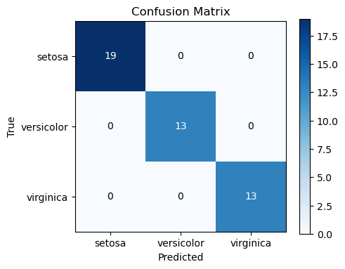

# 다범주 평가지표 구현

## 개요

이 절에서는 다범주 평가지표를 파이썬으로 처음부터 구현하고 그 결과를 scikit-learn과 비교한다.
혼동행렬을 만들고, 범주별 정밀도·재현율·F1 점수를 뽑아내며, 거시평균과 미시평균 요약을
계산한다. 코드가 수학적 정의를 구체적으로 보여 주며, 어떤 다범주 분류기에도 쓸 수 있는 틀을
제공한다.

---

## 혼동행렬

$C \times C$ 혼동행렬 $\mathbf{M}$의 원소 $M_{jk}$는 참 범주가 $j$이고 예측 범주가 $k$인 관측치의
수다. 완벽한 분류기는 대각행렬을 만든다.

```python
import numpy as np

def confusion_matrix(y_true, y_pred, C):
    """Build a C x C confusion matrix.

    Parameters
    ----------
    y_true : ndarray, shape (n,)
        True class labels in {0, ..., C-1}.
    y_pred : ndarray, shape (n,)
        Predicted class labels in {0, ..., C-1}.
    C : int
        Number of classes.

    Returns
    -------
    ndarray, shape (C, C)
        M[j, k] = number of samples with true class j and predicted class k.
    """
    M = np.zeros((C, C), dtype=int)
    for t, p in zip(y_true, y_pred):
        M[t, p] += 1
    return M
```

작은 3범주 문제로 예를 들면 다음과 같다.

```python
y_true = np.array([0, 0, 0, 1, 1, 1, 2, 2, 2])
y_pred = np.array([0, 0, 1, 1, 1, 2, 2, 2, 0])

M = confusion_matrix(y_true, y_pred, C=3)
print(M)
# [[2 1 0]
#  [0 2 1]
#  [1 0 2]]
```

출력:

```
[[2 1 0]
 [0 2 1]
 [1 0 2]]
```

---

## 전체 정확도

정확도는 옳은 예측의 비율이며, 혼동행렬의 대각합을 전체 관측치 수로 나눈 값과 같다.

$$
\text{Accuracy} = \frac{\operatorname{tr}(\mathbf{M})}{n} = \frac{\sum_{c=0}^{C-1} M_{cc}}{\sum_{j,k} M_{jk}}
$$

```python
def accuracy(M):
    """Overall accuracy from a confusion matrix."""
    return np.trace(M) / np.sum(M)

print(f"Accuracy: {accuracy(M):.4f}")
# Accuracy: 0.6667
```

출력:

```
Accuracy: 0.6667
```

---

## 범주별 정밀도, 재현율, F1

각 범주를 일대다 이항 문제로 보면 혼동행렬에서 범주별 지표를 뽑아낼 수 있다.

범주 $c$에 대해,

$$
\text{Precision}_c = \frac{M_{cc}}{\sum_{j=0}^{C-1} M_{jc}}, \qquad
\text{Recall}_c = \frac{M_{cc}}{\sum_{k=0}^{C-1} M_{ck}}
$$

$$
F_{1,c} = \frac{2 \cdot \text{Precision}_c \cdot \text{Recall}_c}{\text{Precision}_c + \text{Recall}_c}
$$

정밀도는 범주 $c$로 예측한 것 중 옳은 비율(열 방향)이고, 재현율은 실제 범주 $c$인 관측치 중
옳게 식별한 비율(행 방향)이다.

```python
def per_class_metrics(M):
    """Compute precision, recall, and F1 for each class.

    Returns
    -------
    precisions : ndarray, shape (C,)
    recalls    : ndarray, shape (C,)
    f1s        : ndarray, shape (C,)
    """
    C = M.shape[0]
    precisions = np.zeros(C)
    recalls = np.zeros(C)
    f1s = np.zeros(C)

    for c in range(C):
        col_sum = M[:, c].sum()       # total predicted as c
        row_sum = M[c, :].sum()       # total truly in class c
        tp = M[c, c]

        precisions[c] = tp / col_sum if col_sum > 0 else 0.0
        recalls[c] = tp / row_sum if row_sum > 0 else 0.0
        if precisions[c] + recalls[c] > 0:
            f1s[c] = 2 * precisions[c] * recalls[c] / (precisions[c] + recalls[c])

    return precisions, recalls, f1s

prec, rec, f1 = per_class_metrics(M)
for c in range(3):
    print(f"Class {c}: Prec={prec[c]:.3f}  Rec={rec[c]:.3f}  F1={f1[c]:.3f}")
```

출력:

```
Class 0: Prec=0.667  Rec=0.667  F1=0.667
Class 1: Prec=0.667  Rec=0.667  F1=0.667
Class 2: Prec=0.667  Rec=0.667  F1=0.667
```

---

## 거시평균과 미시평균

**거시평균**은 각 범주에 대해 지표를 독립적으로 계산한 뒤 가중치 없이 평균한다.

$$
F_1^{\text{macro}} = \frac{1}{C}\sum_{c=0}^{C-1} F_{1,c}
$$

**미시평균**은 하나의 지표를 계산하기 전에 모든 범주의 참양성, 위양성, 위음성을 합산한다.

$$
\text{Precision}_{\text{micro}} = \frac{\sum_c \text{TP}_c}{\sum_c \text{TP}_c + \sum_c \text{FP}_c}, \qquad
\text{Recall}_{\text{micro}} = \frac{\sum_c \text{TP}_c}{\sum_c \text{TP}_c + \sum_c \text{FN}_c}
$$

단일 이름표 문제에서는 미시평균 정밀도와 미시평균 재현율이 같고 그 값이 정확도와 같다(연습문제 2).

```python
def macro_f1(M):
    """Macro-averaged F1-score."""
    _, _, f1s = per_class_metrics(M)
    return np.mean(f1s)

def micro_f1(M):
    """Micro-averaged F1-score."""
    C = M.shape[0]
    tp_total = fp_total = fn_total = 0
    for c in range(C):
        tp = M[c, c]
        fp = M[:, c].sum() - tp
        fn = M[c, :].sum() - tp
        tp_total += tp
        fp_total += fp
        fn_total += fn
    prec = tp_total / (tp_total + fp_total) if (tp_total + fp_total) > 0 else 0
    rec = tp_total / (tp_total + fn_total) if (tp_total + fn_total) > 0 else 0
    if prec + rec == 0:
        return 0.0
    return 2 * prec * rec / (prec + rec)

print(f"Macro F1: {macro_f1(M):.4f}")
print(f"Micro F1: {micro_f1(M):.4f}")
```

출력:

```
Macro F1: 0.6667
Micro F1: 0.6667
```

---

## scikit-learn과의 검증

붓꽃 자료에 소프트맥스 회귀 모형을 학습시키고, 직접 만든 지표를 scikit-learn의
`classification_report`와 비교한다.

```python
from sklearn.datasets import load_iris
from sklearn.model_selection import train_test_split
from sklearn.linear_model import LogisticRegression
from sklearn.metrics import classification_report
from sklearn.metrics import confusion_matrix as sk_confusion_matrix

iris = load_iris()
X_train, X_test, y_train, y_test = train_test_split(
    iris.data, iris.target, test_size=0.3, random_state=42)

clf = LogisticRegression(solver='lbfgs', max_iter=1000)
clf.fit(X_train, y_train)
y_pred = clf.predict(X_test)

C = 3
M_ours = confusion_matrix(y_test, y_pred, C)
M_sklearn = sk_confusion_matrix(y_test, y_pred)

print("Our confusion matrix:")
print(M_ours)
print("\nscikit-learn confusion matrix:")
print(M_sklearn)
print("\nscikit-learn classification report:")
print(classification_report(y_test, y_pred, digits=4))
print(f"Our Macro F1:  {macro_f1(M_ours):.4f}")
print(f"Our Micro F1:  {micro_f1(M_ours):.4f}")
```

출력:

```
Our confusion matrix:
[[19  0  0]
 [ 0 13  0]
 [ 0  0 13]]

scikit-learn confusion matrix:
[[19  0  0]
 [ 0 13  0]
 [ 0  0 13]]

scikit-learn classification report:
              precision    recall  f1-score   support

           0     1.0000    1.0000    1.0000        19
           1     1.0000    1.0000    1.0000        13
           2     1.0000    1.0000    1.0000        13

    accuracy                         1.0000        45
   macro avg     1.0000    1.0000    1.0000        45
weighted avg     1.0000    1.0000    1.0000        45

Our Macro F1:  1.0000
Our Micro F1:  1.0000
```

실행하면 이 분할에서는 검정자료 45개를 모두 옳게 분류하여 혼동행렬이 완전한 대각행렬
$\operatorname{diag}(19, 13, 13)$이 되고, 거시 F1과 미시 F1이 모두 $1.0000$이다. 두 구현의
출력이 일치하여 구현의 정확성이 확인된다.

!!! note "완벽한 결과는 검증에 좋은 사례가 아니다"
    혼동행렬이 대각행렬이면 모든 지표가 1이 되므로, 거시평균과 미시평균의 **차이**를 확인할 수
    없고 구현의 미묘한 버그도 드러나지 않는다. 검증할 때는 오분류가 섞인 사례를 쓰는 편이 낫다.
    위의 3범주 장난감 예제(정확도 $0.6667$)나 연습문제 1의 4범주 행렬이 그런 용도에 적합하다.

!!! note "`multi_class='multinomial'`은 더 이상 필요하지 않다"
    이 인자는 scikit-learn 0.22부터 기본값 `'auto'`가 다항 방식을 고르므로 불필요해졌고,
    1.5에서 폐기 예고되어 1.7에서 제거되었다. 최신 버전에서는 쓰지 않는 것이 맞다.

---

## 혼동행렬 시각화

열지도로 그리면 체계적인 오분류 양상을 쉽게 찾을 수 있다.

```python
import matplotlib.pyplot as plt

def plot_confusion_matrix(M, class_names=None):
    """Display confusion matrix as a heatmap."""
    C = M.shape[0]
    if class_names is None:
        class_names = [str(i) for i in range(C)]

    fig, ax = plt.subplots(figsize=(5, 4))
    im = ax.imshow(M, cmap='Blues')
    ax.set_xticks(range(C))
    ax.set_yticks(range(C))
    ax.set_xticklabels(class_names)
    ax.set_yticklabels(class_names)
    ax.set_xlabel("Predicted")
    ax.set_ylabel("True")
    ax.set_title("Confusion Matrix")

    for i in range(C):
        for j in range(C):
            ax.text(j, i, str(M[i, j]), ha='center', va='center',
                    color='white' if M[i, j] > M.max() / 2 else 'black')

    fig.colorbar(im)
    plt.tight_layout()
    plt.show()

plot_confusion_matrix(M_ours, class_names=iris.target_names)
```



---

## 해석

직접 구현해 보면 몇 가지 핵심이 드러난다.

1. **정확도는 오도할 수 있다.** 범주가 불균형하면 언제나 다수 범주를 예측하는 모형이 높은
   정확도를 내면서 소수 범주의 재현율은 0이다. 범주별 지표와 거시평균이 이 실패를 드러낸다.
2. **거시 대 미시.** 거시평균은 크기와 무관하게 모든 범주를 동등하게 다루므로 드문 범주의
   나쁜 성능에 민감하다. 미시평균은 다수 범주에 지배되며, 단일 이름표 문제에서는 정확도와
   같아진다.
3. **혼동행렬이 근본 요약이다.** 정확도, 정밀도, 재현율, F1 등 모든 스칼라 지표가 혼동행렬에서
   유도된다. 행렬 자체가 어떤 단일 수치보다 엄밀히 더 많은 정보를 담는다.
4. **비대각 양상이 진단이다.** 체계적으로 큰 비대각 원소(예: 숫자 인식에서 4를 9로 예측)는
   특정한 모형의 결함을 가리키며, 특성공학이나 자료 증강의 방향을 알려 준다.

---

## 연습문제

**연습문제 1.**
4범주 분류기가 다음 혼동행렬을 냈다.

|  | 0으로 예측 | 1로 예측 | 2로 예측 | 3으로 예측 |
|:---:|:---:|:---:|:---:|:---:|
| **실제 0** | 40 | 5 | 3 | 2 |
| **실제 1** | 2 | 35 | 8 | 5 |
| **실제 2** | 1 | 4 | 42 | 3 |
| **실제 3** | 0 | 6 | 2 | 42 |

전체 정확도, 범주별 정밀도와 재현율, 거시평균 F1 점수를 손으로 계산하라.

??? success "풀이"
    전체 관측치 수는 $40+5+3+2+2+35+8+5+1+4+42+3+0+6+2+42 = 200$이다(각 행의 합이 50).

    **전체 정확도:**

    $$
    \text{Accuracy} = \frac{40 + 35 + 42 + 42}{200} = \frac{159}{200} = 0.795
    $$

    **범주별 지표:**

    | 범주 | TP | 열 합 | 행 합 | 정밀도 | 재현율 | F1 |
    |:---:|:---:|:---:|:---:|:---:|:---:|:---:|
    | 0 | 40 | 43 | 50 | 40/43 = 0.930 | 40/50 = 0.800 | 0.860 |
    | 1 | 35 | 50 | 50 | 35/50 = 0.700 | 35/50 = 0.700 | 0.700 |
    | 2 | 42 | 55 | 50 | 42/55 = 0.764 | 42/50 = 0.840 | 0.800 |
    | 3 | 42 | 52 | 50 | 42/52 = 0.808 | 42/50 = 0.840 | 0.824 |

    **거시 F1:**

    $$
    F_1^{\text{macro}} = \frac{0.860 + 0.700 + 0.800 + 0.824}{4} = \frac{3.184}{4} = 0.796
    $$

---

**연습문제 2.**
단일 이름표 다범주 문제에서 미시평균 정밀도 = 미시평균 재현율 = 전체 정확도임을 보여라.
(힌트: $\sum_c \text{FP}_c$와 $\sum_c \text{FN}_c$를 $\mathbf{M}$의 비대각 원소와 연결하라.)

??? success "풀이"
    각 범주 $c$에 대해,

    - $\text{TP}_c = M_{cc}$
    - $\text{FP}_c = \sum_{j \neq c} M_{jc}$(열 $c$의 다른 행들)
    - $\text{FN}_c = \sum_{k \neq c} M_{ck}$(행 $c$의 다른 열들)

    모든 범주에 대해 더하면,

    $$
    \sum_c \text{TP}_c = \sum_c M_{cc} = \operatorname{tr}(\mathbf{M})
    $$

    $$
    \sum_c \text{FP}_c = \sum_c \sum_{j \neq c} M_{jc} = \sum_{j,c} M_{jc} - \sum_c M_{cc} = n - \operatorname{tr}(\mathbf{M})
    $$

    마찬가지로,

    $$
    \sum_c \text{FN}_c = \sum_c \sum_{k \neq c} M_{ck} = n - \operatorname{tr}(\mathbf{M})
    $$

    따라서 $\sum_c \text{FP}_c = \sum_c \text{FN}_c$이고,

    $$
    \text{Precision}_{\text{micro}} = \frac{\operatorname{tr}(\mathbf{M})}{\operatorname{tr}(\mathbf{M}) + (n - \operatorname{tr}(\mathbf{M}))} = \frac{\operatorname{tr}(\mathbf{M})}{n} = \text{Accuracy}
    $$

    재현율에도 같은 계산이 적용된다. 미시 정밀도와 미시 재현율이 같으므로 미시 F1도 정확도와
    같다. $\square$

---

**연습문제 3.**
어떤 의학적 선별검사가 환자를 건강(0), 질환 A(1), 질환 B(2)의 세 범주로 분류한다. 환자
1000명 중 건강 900명, 질환 A 70명, 질환 B 30명이다. 언제나 "건강"을 예측하는 분류기는 정확도
90%를 달성한다. 이 무의미한 분류기의 거시평균 F1을 계산하고, 이 문제에서 거시 F1이 정확도보다
나은 평가 기준인 이유를 설명하라.

??? success "풀이"
    "항상 0을 예측"하는 분류기의 혼동행렬은 다음과 같다.

    |  | 0으로 예측 | 1로 예측 | 2로 예측 |
    |:---:|:---:|:---:|:---:|
    | **실제 0** | 900 | 0 | 0 |
    | **실제 1** | 70 | 0 | 0 |
    | **실제 2** | 30 | 0 | 0 |

    범주별 지표:

    - **범주 0:** 정밀도 $= 900/1000 = 0.900$, 재현율 $= 900/900 = 1.000$,
      $F_1 = 2(0.9)(1.0)/(0.9+1.0) = 0.947$
    - **범주 1:** 정밀도 $= 0/0$(정의되지 않음, 0으로 둔다), 재현율 $= 0/70 = 0$, $F_1 = 0$
    - **범주 2:** 정밀도 $= 0/0$(정의되지 않음, 0으로 둔다), 재현율 $= 0/30 = 0$, $F_1 = 0$

    $$
    F_1^{\text{macro}} = \frac{0.947 + 0 + 0}{3} = 0.316
    $$

    정확도는 90%이지만 거시 F1은 $0.316$에 불과하여, 이 분류기가 두 질환 범주에 대해
    쓸모없다는 사실을 정확히 반영한다. 의학적 선별검사에서 질환 A와 B를 탐지하지 못하는 것은
    심각한 결과를 낳는다. 거시 F1은 유병률과 무관하게 모든 범주를 동등하게 가중하므로 이
    실패를 무겁게 벌한다.

    !!! warning "$0/0$을 0으로 두는 관례에 주의"
        범주 1과 2의 정밀도는 분모가 0이라 **정의되지 않는다.** 0으로 두는 것은 관례일 뿐이며,
        그 선택이 결과를 바꾼다. 만약 정의되지 않은 정밀도를 가진 범주를 평균에서 **제외**한다면
        거시 F1이 $0.947$이 되어 정반대의 인상을 준다. scikit-learn은 이 경우
        `UndefinedMetricWarning`을 내고 `zero_division` 인자로 동작을 고를 수 있게 한다.
        기본값은 0이며, 이 예에서는 그것이 옳은 선택이다. 예측을 아예 하지 않은 범주를
        평균에서 빼 주면 아무것도 예측하지 않는 분류기가 가장 좋아 보이게 되기 때문이다.

---

**연습문제 4.**
각 범주의 F1 점수를 지지도(실제 사례 수)로 가중하여 가중평균 F1을 계산하는 `weighted_f1`
함수를 구현하라. 균형 잡힌 자료에서는 가중 F1이 거시 F1과 같아짐을 보여라.

??? success "풀이"
    ```python
    def weighted_f1(M):
        """Weighted-average F1-score."""
        _, _, f1s = per_class_metrics(M)
        supports = M.sum(axis=1)          # row sums = class sizes
        total = supports.sum()
        return np.sum(f1s * supports) / total
    ```

    균형 잡힌 자료에서는 모든 범주의 지지도가 $s = n/C$로 같다. 그러면,

    $$
    F_1^{\text{weighted}} = \frac{\sum_c F_{1,c} \cdot s}{\sum_c s} = \frac{s \sum_c F_{1,c}}{C \cdot s} = \frac{1}{C}\sum_c F_{1,c} = F_1^{\text{macro}}
    $$

    가중치 $s/Cs = 1/C$가 균일해져 비가중 평균으로 환원된다. $\square$

---

**연습문제 5.**
임의의 혼동행렬 $\mathbf{M}$과 임의의 범주 $c$에 대해 F1 점수가
$0 \leq F_{1,c} \leq 1$을 만족하며, $F_{1,c} = 1$인 것은 범주 $c$의 정밀도와 재현율이 모두
완벽할 때 그리고 그때뿐임을 증명하라.

??? success "풀이"
    F1 점수는 정밀도와 재현율의 조화평균이다.

    $$
    F_{1,c} = \frac{2 \cdot P_c \cdot R_c}{P_c + R_c}
    $$

    여기서 $P_c, R_c \in [0, 1]$이다.

    **하한:** $P_c \geq 0$이고 $R_c \geq 0$이므로 분자 $2P_c R_c \geq 0$이고 분모
    $P_c + R_c \geq 0$이다. $P_c = 0$이거나 $R_c = 0$이면 $F_{1,c} = 0$이다. 따라서
    $F_{1,c} \geq 0$이다.

    **상한:** 산술-기하 평균 부등식에 의해
    $P_c R_c \leq \left(\frac{P_c + R_c}{2}\right)^2$이므로,

    $$
    F_{1,c} = \frac{2 P_c R_c}{P_c + R_c} \leq \frac{2 \cdot \frac{(P_c + R_c)^2}{4}}{P_c + R_c} = \frac{P_c + R_c}{2} \leq \frac{1 + 1}{2} = 1
    $$

    또는 $[0,1]$의 두 수의 조화평균이 산술평균 이하이고 산술평균이 1 이하임을 직접 관찰해도
    된다.

    **1에서의 등호:** $F_{1,c} = 1$이려면 $2P_c R_c = P_c + R_c$, 즉
    $2P_c R_c - P_c - R_c = 0$이어야 한다. 양변에 2를 곱하고 1을 더하면
    $4P_cR_c - 2P_c - 2R_c + 1 = 1$이므로 $(2P_c - 1)(2R_c - 1) = 1$로 인수분해된다.
    $P_c, R_c \in [0,1]$이므로 두 인자 $(2P_c - 1)$과 $(2R_c - 1)$은 각각 $[-1, 1]$에 있다.
    두 인자의 곱이 1이 되는 것은 둘 다 1이거나 둘 다 $-1$일 때인데, 둘 다 $-1$이면
    $P_c = R_c = 0$이 되어 $F_{1,c} = 0 \ne 1$이므로 모순이다. 따라서 둘 다 1, 즉
    $P_c = R_c = 1$이다. 그러므로 $F_{1,c} = 1$인 것은 정밀도와 재현율이 모두 완벽할 때
    그리고 그때뿐이다. $\square$
