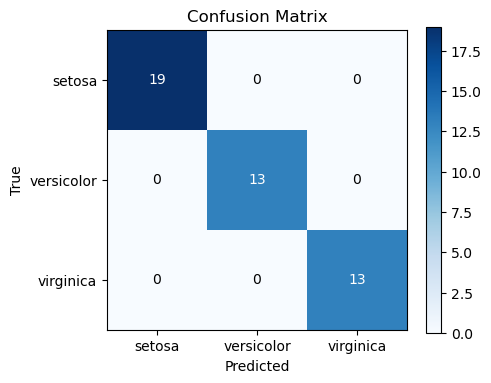

# 다범주 평가지표 구현

## 개요

이 절에서는 다범주 평가지표를 파이썬으로 처음부터 구현하고 그 결과를 scikit-learn과 비교한다.
혼동행렬을 만들고, 범주별 정밀도·재현율·F1 점수를 뽑아내며, 거시평균과 미시평균 요약을
계산한다. 코드가 수학적 정의를 구체적으로 보여 주며, 어떤 다범주 분류기에도 쓸 수 있는 틀을
제공한다.

---

## 혼동행렬

$C \times C$ 혼동행렬 $\mathbf{M}$의 원소 $M_{jk}$는 참 범주가 $j$이고 예측 범주가 $k$인 관측치의
수다. 완벽한 분류기는 대각행렬을 만든다.

<div class="exbox" markdown>

**보기 1.** <span class="diff easy" title="쉬움"></span> 혼동행렬 구현

**(1)** $\mathbf{M}$의 **행 합**, **열 합**, **총합**이 각각 무엇과 같은지 식으로 적으시오. 열 합과 행 합의 차는 무엇을 뜻하는가.

**(2)** 완벽한 분류기가 만드는 행렬은 무엇인가. 함수를 구현하고 (1)의 등식을 단언문으로 확인하시오.

</div>

??? success "풀이"

    **(1) 세 가지 합.** 정의 $M_{jk} = \#\{i : y_i = j,\ \hat y_i = k\}$에서 곧바로 따라 나온다. 관측치 하나는 $(y_i, \hat y_i)$라는 칸 **정확히 하나**만 올리므로

    $$
    \sum_{j,k} M_{jk} = n
    $$

    이다. 행 $c$를 모두 더하면 $\hat y_i$에 대한 조건이 사라지므로

    $$
    \sum_{k} M_{ck} = \#\{i : y_i = c\} = n_c
    \qquad(\text{참 범주 } c \text{ 의 개수, 지지도})
    $$

    이고, 열 $c$를 모두 더하면 $y_i$에 대한 조건이 사라지므로

    $$
    \sum_{j} M_{jc} = \#\{i : \hat y_i = c\} = \hat n_c
    \qquad(c \text{ 로 예측한 개수})
    $$

    이다. **행은 참, 열은 예측.** 정밀도가 열 합으로, 재현율이 행 합으로 나누어지는 까닭이 이것뿐이다.

    열 합에서 행 합을 빼면

    $$
    \hat n_c - n_c
    = \Bigl(M_{cc} + \sum_{j \ne c} M_{jc}\Bigr) - \Bigl(M_{cc} + \sum_{k \ne c} M_{ck}\Bigr)
    = \text{FP}_c - \text{FN}_c
    $$

    로 **범주 $c$를 얼마나 과잉 예측했는가**가 된다. 양수이면 그 범주를 실제보다 자주 부른 것이다. 그리고 $\sum_c \hat n_c = \sum_c n_c = n$이므로 이 차이들의 합은 언제나 $0$이다. 한 범주를 과잉 예측하면 다른 범주가 그만큼 손해를 본다.

    **(2) 완벽한 분류기.** 모든 $i$에서 $\hat y_i = y_i$이면 대각선 칸만 올라가므로

    $$
    \mathbf{M} = \operatorname{diag}(n_0, n_1, \ldots, n_{C-1}),
    \qquad \operatorname{tr}(\mathbf{M}) = n
    $$

    이다. **대각행렬이지만 단위행렬의 배수는 아니다.** 범주 크기가 다르면 대각선의 값도 다르며, 보기 7의 열지도에서 이 사실이 색으로 드러난다.

    ```python
    import numpy as np

    def confusion_matrix(y_true, y_pred, C):
        """C x C 혼동행렬을 만든다.

        이범주에서는 2x2 표 하나로 끝났지만, 범주가 C 개면 C x C 가 된다.
        대각선이 맞힌 것이고, 벗어난 칸은 어느 범주를 어느 범주로 헷갈렸는지를
        말해 준다. 아래의 모든 측도가 이 행렬 하나에서 나온다.

        매개변수
        --------
        y_true : 참 범주 이름표 {0, ..., C-1}
        y_pred : 예측한 범주 이름표
        C : 범주 수

        돌려주는 값
        ----------
        M[j, k] = 참으로 j 인데 k 로 예측한 사례 수
        """
        M = np.zeros((C, C), dtype=int)
        for t, p in zip(y_true, y_pred):
            M[t, p] += 1
        return M

    # 아무 자료나 넣어 (1) 의 등식이 성립하는지 단언문으로 확인한다.
    rng = np.random.default_rng(0)
    C, n = 4, 500
    y_t = rng.integers(0, C, n)
    y_p = rng.integers(0, C, n)
    Mr = confusion_matrix(y_t, y_p, C)

    assert Mr.sum() == n
    assert np.array_equal(Mr.sum(axis=1), np.bincount(y_t, minlength=C))
    assert np.array_equal(Mr.sum(axis=0), np.bincount(y_p, minlength=C))

    print(f"총합   {Mr.sum()} = n = {n}")
    print(f"행 합  {Mr.sum(axis=1)}  = 참 범주 개수")
    print(f"열 합  {Mr.sum(axis=0)}  = 예측 범주 개수")
    print(f"열 합 - 행 합 = FP - FN = {Mr.sum(axis=0) - Mr.sum(axis=1)}"
          f"  (합 {(Mr.sum(axis=0) - Mr.sum(axis=1)).sum()})")

    # 완벽한 분류기는 참 범주 개수를 대각선에 늘어놓은 행렬을 만든다.
    Mp = confusion_matrix(y_t, y_t, C)
    print(f"완벽한 분류기의 대각선 {np.diag(Mp)},  대각합 {np.trace(Mp)} = n")
    print(f"비대각 원소의 합 {Mp.sum() - np.trace(Mp)}")
    ```

    출력:

    ```
    총합   500 = n = 500
    행 합  [115 110 133 142]  = 참 범주 개수
    열 합  [113 125 141 121]  = 예측 범주 개수
    열 합 - 행 합 = FP - FN = [ -2  15   8 -21]  (합 0)
    완벽한 분류기의 대각선 [115 110 133 142],  대각합 500 = n
    비대각 원소의 합 0
    ```

    세 단언문이 모두 통과한다. 예측을 무작위로 던졌는데도 총합·행 합·열 합의 등식은 그대로다. **이것들은 분류기의 성능과 무관한 항등식**이며, 그래서 구현이 맞는지 검사하는 데 쓸 수 있다. 차이 벡터 $(-2, 15, 8, -21)$을 보면 범주 $1$을 $15$번 과잉 예측하고 범주 $3$을 $21$번 과소 예측했는데, 그 합은 예고대로 $0$이다.

작은 3범주 문제로 예를 들면 다음과 같다.

<div class="exbox" markdown>

**보기 2.** <span class="diff easy" title="쉬움"></span> 작은 예로 확인. 참 이름표가 $(0,0,0,1,1,1,2,2,2)$, 예측이 $(0,0,1,1,1,2,2,2,0)$인 아홉 사례다.

**(1)** 혼동행렬을 손으로 세어 적으시오.

**(2)** 행 합과 열 합이 모두 $3$이 되는데, 그것이 우연인지 이 자료의 구조에서 오는 것인지 밝히시오.

</div>

??? success "풀이"

    **(1) 손으로 세기.** 아홉 쌍 $(y_i, \hat y_i)$를 차례로 적으면

    $$
    (0,0),\ (0,0),\ (0,1),\ (1,1),\ (1,1),\ (1,2),\ (2,2),\ (2,2),\ (2,0)
    $$

    이다. 같은 쌍을 모으면 $(0,0)$이 둘, $(0,1)$이 하나, $(1,1)$이 둘, $(1,2)$가 하나, $(2,2)$가 둘, $(2,0)$이 하나다. 그러므로

    $$
    \mathbf{M} =
    \begin{pmatrix}
    2 & 1 & 0 \\
    0 & 2 & 1 \\
    1 & 0 & 2
    \end{pmatrix}
    $$

    이다. 맞힌 것은 대각합 $2+2+2 = 6$, 틀린 것은 비대각합 $1+1+1 = 3$으로 합이 $9$다.

    **(2) 우연이 아니다.** 행 합이 $3$인 것은 자료를 그렇게 만들었기 때문이다. 참 범주가 셋씩이다. 눈여겨볼 것은 **열 합도 셋씩**이라는 점인데, 이것은 오류의 모양이 정해 준다. 각 범주가 **바로 다음 범주에 정확히 하나씩** 넘어간다. $0 \to 1$, $1 \to 2$, $2 \to 0$이다. 그러면 모든 범주가 하나를 잃는 동시에 앞 범주에서 하나를 받으므로

    $$
    \hat n_c = n_c - 1 + 1 = n_c = 3
    $$

    이다. 보기 1의 말로 하면 모든 $c$에서 $\text{FP}_c = \text{FN}_c = 1$이라 차이가 $0$인 셈이다.

    행렬로 쓰면 이 구조가 더 선명하다. 순환치환행렬

    $$
    \mathbf{P} =
    \begin{pmatrix}
    0 & 1 & 0 \\
    0 & 0 & 1 \\
    1 & 0 & 0
    \end{pmatrix}
    \qquad\text{에 대해}\qquad
    \mathbf{M} = 2\mathbf{I} + \mathbf{P}
    $$

    이다. $\mathbf{I}$와 $\mathbf{P}$가 모두 행 합과 열 합이 $1$인 행렬이므로 $\mathbf{M}$의 행 합과 열 합이 다 같이 $3$이 되는 것이다. **이 대칭이 보기 4와 보기 5의 결과를 미리 결정한다.** 세 범주의 지표가 모두 같아지고, 거시평균과 미시평균이 일치하게 된다.

    ```python
    # 범주마다 셋씩, 그중 둘을 맞힌 자료다. 아래 측도들을 손으로 따라가며
    # 확인하기 좋도록 작게 잡았다.
    y_true = np.array([0, 0, 0, 1, 1, 1, 2, 2, 2])
    y_pred = np.array([0, 0, 1, 1, 1, 2, 2, 2, 0])

    M = confusion_matrix(y_true, y_pred, C=3)
    print(M)
    print("행 합", M.sum(axis=1), "열 합", M.sum(axis=0), "총합", M.sum())
    ```

    출력:

    ```
    [[2 1 0]
     [0 2 1]
     [1 0 2]]
    행 합 [3 3 3] 열 합 [3 3 3] 총합 9
    ```

    손으로 센 행렬과 같다.

---

## 전체 정확도

정확도는 옳은 예측의 비율이며, 혼동행렬의 대각합을 전체 관측치 수로 나눈 값과 같다.

$$
\text{Accuracy} = \frac{\operatorname{tr}(\mathbf{M})}{n} = \frac{\sum_{c=0}^{C-1} M_{cc}}{\sum_{j,k} M_{jk}}
$$

<div class="exbox" markdown>

**보기 3.** <span class="diff easy" title="쉬움"></span> 전체 정확도

**(1)** 보기 2의 행렬에서 정확도를 분수로 구하시오.

**(2)** 정확도를 **비대각 원소**만으로도 쓸 수 있다. 그 식을 적고, 두 식이 같은 값을 주는지 코드로 확인하시오.

</div>

??? success "풀이"

    **(1) 대각합으로.** 맞힌 사례는 대각선에 모여 있으므로

    $$
    \text{Accuracy}
    = \frac{\operatorname{tr}(\mathbf{M})}{n}
    = \frac{2 + 2 + 2}{9}
    = \frac{6}{9}
    = \frac{2}{3}
    = 0.6666\ldots
    $$

    이다. 소수 넷째 자리에서 반올림하면 $0.6667$이다.

    **(2) 비대각으로.** $\operatorname{tr}(\mathbf{M}) = n - \sum_{j \ne k} M_{jk}$이므로

    $$
    \text{Accuracy}
    = 1 - \frac{1}{n}\sum_{j \ne k} M_{jk}
    = 1 - \frac{\text{오분류 수}}{n}
    = 1 - \frac{3}{9}
    = \frac{2}{3}
    $$

    이다. 두 식은 같은 것을 다르게 쓴 것뿐이지만, 뒤의 꼴은 **정확도가 오류의 "위치"를 전혀 보지 않는다**는 사실을 드러낸다. $0$을 $1$로 틀리든 $0$을 $2$로 틀리든 정확도에는 똑같이 $1/9$만큼만 반영된다. 어떤 혼동이 어디서 일어났는가는 행렬을 직접 보아야 알 수 있으며, 그래서 스칼라 지표 하나로 혼동행렬을 대신할 수 없다.

    ```python
    def accuracy(M):
        """혼동행렬에서 전체 정확도를 구한다. 대각선의 합을 전체로 나눈 것이다."""
        return np.trace(M) / np.sum(M)

    print(f"Accuracy: {accuracy(M):.4f}")
    # Accuracy: 0.6667

    # 비대각 원소로 센 꼴과 맞는지 본다.
    off = M.sum() - np.trace(M)
    print(f"오분류 {off}건 / {M.sum()}건,  1 - {off}/{M.sum()} = {1 - off / M.sum():.4f}")
    ```

    출력:

    ```
    Accuracy: 0.6667
    오분류 3건 / 9건,  1 - 3/9 = 0.6667
    ```

    두 식이 같은 $0.6667$을 준다.

---

## 범주별 정밀도, 재현율, F1

각 범주를 일대다 이항 문제로 보면 혼동행렬에서 범주별 지표를 뽑아낼 수 있다.

범주 $c$에 대해,

$$
\text{Precision}_c = \frac{M_{cc}}{\sum_{j=0}^{C-1} M_{jc}}, \qquad
\text{Recall}_c = \frac{M_{cc}}{\sum_{k=0}^{C-1} M_{ck}}
$$

$$
F_{1,c} = \frac{2 \cdot \text{Precision}_c \cdot \text{Recall}_c}{\text{Precision}_c + \text{Recall}_c}
$$

정밀도는 범주 $c$로 예측한 것 중 옳은 비율(열 방향)이고, 재현율은 실제 범주 $c$인 관측치 중
옳게 식별한 비율(행 방향)이다.

<div class="exbox" markdown>

**보기 4.** <span class="diff easy" title="쉬움"></span> 범주별 정밀도·재현율·F1

**(1)** 보기 2의 행렬에서 세 범주의 정밀도·재현율·F1을 손으로 구하시오.

**(2)** 아홉 수가 모두 같게 나온다. 일반적으로 **정밀도와 재현율이 같아지는 조건**은 무엇인가. 그 조건으로 (1)의 결과를 설명하고 코드로 확인하시오.

</div>

??? success "풀이"

    **(1) 손으로.** 보기 2에서 모든 행 합과 열 합이 $3$이고 모든 대각원소가 $2$이므로, $c = 0, 1, 2$ 어느 것에 대해서나

    $$
    P_c = \frac{M_{cc}}{\sum_j M_{jc}} = \frac{2}{3},
    \qquad
    R_c = \frac{M_{cc}}{\sum_k M_{ck}} = \frac{2}{3}
    $$

    이다. F1은 둘의 조화평균인데 **두 수가 같으면 조화평균은 그 수 자신**이므로

    $$
    F_{1,c} = \frac{2 P_c R_c}{P_c + R_c}
    = \frac{2 \cdot \frac23 \cdot \frac23}{\frac23 + \frac23}
    = \frac{8/9}{4/3} = \frac{2}{3}
    $$

    이다. 아홉 수가 모두 $2/3 = 0.667$이다.

    **(2) 언제 $P_c = R_c$인가.** 분자가 둘 다 $M_{cc}$이므로 $M_{cc} > 0$일 때 두 값이 같을 필요충분조건은 **분모가 같다**는 것, 곧

    $$
    \sum_j M_{jc} = \sum_k M_{ck}
    \iff \hat n_c = n_c
    \iff \text{FP}_c = \text{FN}_c
    $$

    이다. 보기 1에서 본 "열 합 $-$ 행 합 $=$ FP $-$ FN"이 그대로 쓰인다. **범주 $c$를 과잉도 과소도 예측하지 않을 때, 그리고 그때만 정밀도와 재현율이 같다.**

    보기 2의 자료는 순환 구조라 모든 범주가 하나를 잃고 하나를 받으므로 $\text{FP}_c = \text{FN}_c = 1$이고, 따라서 세 범주 모두에서 $P_c = R_c$다. 게다가 $M_{cc}$와 분모가 범주마다 같으니 값까지 같아진다. **이 완벽한 대칭은 장난감 자료를 그렇게 만들어 놓았기 때문이지 일반적인 현상이 아니다.** 실제 자료에서는 범주마다 $P_c$와 $R_c$가 다르고, 그 차이가 "이 범주를 너무 자주 부르는가 아니면 놓치는가"를 말해 준다.

    ```python
    def per_class_metrics(M):
        """범주마다 정밀도·재현율·F1 을 구한다.

        다범주에서는 범주 하나를 양성으로, 나머지 전부를 음성으로 보고 이범주
        측도를 그대로 쓴다. 정밀도는 열 합으로, 재현율은 행 합으로 나눈다 —
        어느 쪽으로 나누느냐가 둘을 가르는 전부다.
        """
        C = M.shape[0]
        precisions = np.zeros(C)
        recalls = np.zeros(C)
        f1s = np.zeros(C)

        for c in range(C):
            col_sum = M[:, c].sum()       # total predicted as c
            row_sum = M[c, :].sum()       # total truly in class c
            tp = M[c, c]

            precisions[c] = tp / col_sum if col_sum > 0 else 0.0
            recalls[c] = tp / row_sum if row_sum > 0 else 0.0
            if precisions[c] + recalls[c] > 0:
                f1s[c] = 2 * precisions[c] * recalls[c] / (precisions[c] + recalls[c])

        return precisions, recalls, f1s

    prec, rec, f1 = per_class_metrics(M)
    for c in range(3):
        print(f"Class {c}: Prec={prec[c]:.3f}  Rec={rec[c]:.3f}  F1={f1[c]:.3f}")

    # FP 와 FN 이 범주마다 같은지 — (2) 의 조건 — 확인한다.
    print(f"FP {M.sum(axis=0) - np.diag(M)},  FN {M.sum(axis=1) - np.diag(M)}")
    ```

    출력:

    ```
    Class 0: Prec=0.667  Rec=0.667  F1=0.667
    Class 1: Prec=0.667  Rec=0.667  F1=0.667
    Class 2: Prec=0.667  Rec=0.667  F1=0.667
    FP [1 1 1],  FN [1 1 1]
    ```

    손으로 구한 $2/3 = 0.667$이 아홉 자리에 그대로 나온다. 그리고 $\text{FP}_c = \text{FN}_c = 1$이 범주마다 성립하므로, (2)의 조건이 충족되어 정밀도와 재현율이 같아진 것이 확인된다.

---

## 거시평균과 미시평균

**거시평균**은 각 범주에 대해 지표를 독립적으로 계산한 뒤 가중치 없이 평균한다.

$$
F_1^{\text{macro}} = \frac{1}{C}\sum_{c=0}^{C-1} F_{1,c}
$$

**미시평균**은 하나의 지표를 계산하기 전에 모든 범주의 참양성, 위양성, 위음성을 합산한다.

$$
\text{Precision}_{\text{micro}} = \frac{\sum_c \text{TP}_c}{\sum_c \text{TP}_c + \sum_c \text{FP}_c}, \qquad
\text{Recall}_{\text{micro}} = \frac{\sum_c \text{TP}_c}{\sum_c \text{TP}_c + \sum_c \text{FN}_c}
$$

단일 이름표 문제에서는 미시평균 정밀도와 미시평균 재현율이 같고 그 값이 정확도와 같다(연습문제 2).

<div class="exbox" markdown>

**보기 5.** <span class="diff easy" title="쉬움"></span> 거시평균과 미시평균 F1

**(1)** 보기 2의 행렬에서 거시 F1과 미시 F1을 손으로 구하시오.

**(2)** 둘이 같은 값으로 나온다. 그것이 **일반적으로 성립하는 사실**인지, 아니면 이 자료에서만 그런 것인지 가르시오. 어긋나는 보기를 하나 들라.

</div>

??? success "풀이"

    **(1) 손으로.** 거시평균은 범주별 F1을 그냥 평균한다. 보기 4에서 셋 다 $2/3$이었으므로

    $$
    F_1^{\text{macro}} = \frac{1}{3}\Bigl(\frac23 + \frac23 + \frac23\Bigr) = \frac{2}{3} = 0.6667
    $$

    이다. 미시평균은 세 범주의 TP·FP·FN을 **먼저 합한 뒤** 하나의 F1을 만든다.

    $$
    \sum_c \text{TP}_c = 2+2+2 = 6, \qquad
    \sum_c \text{FP}_c = 1+1+1 = 3, \qquad
    \sum_c \text{FN}_c = 1+1+1 = 3
    $$

    이므로

    $$
    P_{\text{micro}} = \frac{6}{6+3} = \frac{2}{3},
    \qquad
    R_{\text{micro}} = \frac{6}{6+3} = \frac{2}{3},
    \qquad
    F_1^{\text{micro}} = \frac{2}{3} = 0.6667
    $$

    이다. 정확도 $0.6667$과도 같다.

    **(2) 두 일치는 성격이 다르다.**

    **미시 $=$ 정확도는 언제나 참이다.** 연습문제 2에서 증명하듯, 단일 이름표 문제에서는

    $$
    \sum_c \text{FP}_c = \sum_c \text{FN}_c = n - \operatorname{tr}(\mathbf{M})
    $$

    이 항등적으로 성립한다. 한 번의 오분류가 한 범주에는 FP를, 다른 범주에는 FN을 정확히 하나씩 만들어 주기 때문이다. 그러면 미시 정밀도와 미시 재현율이 둘 다 $\operatorname{tr}(\mathbf{M})/n$이 되어 그 조화평균인 미시 F1도 같은 값, 곧 **정확도**가 된다. 여기서는 $6/9$다. **그러므로 미시 F1을 따로 보고하는 것은 정확도를 두 번 보고하는 것과 같다.**

    **거시 $=$ 미시는 이 자료에서만이다.** 거시평균이 $2/3$이 된 것은 범주별 F1이 셋 다 $2/3$이었기 때문이고, 그것은 보기 2의 순환 구조가 만든 우연이다. 범주 크기나 오류 분포가 치우치면 곧바로 어긋난다.

    **어긋나는 보기.** 이 쪽 연습문제 3의 의학 선별검사가 극단적인 예다. 건강 $900$명, 질환 A $70$명, 질환 B $30$명인 자료에서 언제나 "건강"만 예측하면

    $$
    \text{Accuracy} = F_1^{\text{micro}} = 0.900,
    \qquad
    F_1^{\text{macro}} = \frac{0.947 + 0 + 0}{3} = 0.316
    $$

    으로 $0.9$ 대 $0.316$이다. 거시평균이 범주마다 같은 무게를 주므로 **두 질환 범주를 하나도 못 잡은 사실이 $2/3$의 무게로 반영**되는 반면, 미시평균은 사례마다 같은 무게를 주어 $900$명의 건강인에게 끌려간다. 거시평균을 쓸 때 희귀 범주가 과대 반영된다는 말은 이런 뜻이다.

    ```python
    def macro_f1(M):
        """거시평균 F1. 범주마다의 F1 을 그냥 평균한다.

        범주 크기를 무시하므로 작은 범주도 큰 범주와 같은 무게를 갖는다.
        희귀 범주의 성능이 중요할 때 이쪽을 본다.
        """
        _, _, f1s = per_class_metrics(M)
        return np.mean(f1s)

    def micro_f1(M):
        """미시평균 F1. 범주를 가리지 않고 TP·FP·FN 을 모두 더한 뒤 계산한다.

        사례마다 같은 무게를 주므로 큰 범주가 결과를 좌우한다. 단일 이름표
        분류에서는 미시평균 F1 이 전체 정확도와 정확히 같아진다.
        """
        C = M.shape[0]
        tp_total = fp_total = fn_total = 0
        for c in range(C):
            tp = M[c, c]
            fp = M[:, c].sum() - tp
            fn = M[c, :].sum() - tp
            tp_total += tp
            fp_total += fp
            fn_total += fn
        prec = tp_total / (tp_total + fp_total) if (tp_total + fp_total) > 0 else 0
        rec = tp_total / (tp_total + fn_total) if (tp_total + fn_total) > 0 else 0
        if prec + rec == 0:
            return 0.0
        return 2 * prec * rec / (prec + rec)

    print(f"Macro F1: {macro_f1(M):.4f}")
    print(f"Micro F1: {micro_f1(M):.4f}")
    print(f"Accuracy: {accuracy(M):.4f}   <- 미시 F1 과 같아야 한다")

    # 어긋나는 보기: 언제나 "건강" 만 예측하는 선별검사.
    M_screen = np.array([[900, 0, 0], [70, 0, 0], [30, 0, 0]])
    print(f"선별검사  정확도 {accuracy(M_screen):.4f}"
          f"  미시 F1 {micro_f1(M_screen):.4f}"
          f"  거시 F1 {macro_f1(M_screen):.4f}")
    ```

    출력:

    ```
    Macro F1: 0.6667
    Micro F1: 0.6667
    Accuracy: 0.6667   <- 미시 F1 과 같아야 한다
    선별검사  정확도 0.9000  미시 F1 0.9000  거시 F1 0.3158
    ```

    **손으로 구한 값과 모두 맞는다.** 장난감 자료에서는 세 수가 $0.6667$로 겹치지만, 선별검사 행렬에서는 미시 F1만 정확도 $0.9000$을 따라가고 거시 F1은 $0.3158$로 뚝 떨어진다. 손으로 센 $0.316$과 같다. **미시 F1은 어느 쪽에서나 정확도와 같고, 거시 F1만이 새 정보를 준다.**

---

## scikit-learn과의 검증

붓꽃 자료에 소프트맥스 회귀 모형을 학습시키고, 직접 만든 지표를 scikit-learn의
`classification_report`와 비교한다.

<div class="exbox" markdown>

**보기 6.** <span class="diff easy" title="쉬움"></span> 붓꽃 자료로 sklearn 과 맞춰 보기

**(1)** 이 분할에서 혼동행렬이 **대각행렬**로 나온다. 그렇다면 범주별 정밀도·재현율·F1과 거시·미시·가중 평균이 각각 얼마가 되는지 행렬만 보고 말하시오.

**(2)** 직접 만든 함수와 scikit-learn의 출력을 맞춰 보시오. 이 검증이 **확인하지 못하는 것**은 무엇인가.

</div>

??? success "풀이"

    **(1) 대각행렬이면 모두 $1$이다.** $\mathbf{M} = \operatorname{diag}(n_0, \ldots, n_{C-1})$이면 모든 $j \ne k$에서 $M_{jk} = 0$이므로

    $$
    \sum_j M_{jc} = M_{cc} = n_c,
    \qquad
    \sum_k M_{ck} = M_{cc} = n_c
    $$

    이고 따라서

    $$
    P_c = \frac{n_c}{n_c} = 1,
    \qquad
    R_c = \frac{n_c}{n_c} = 1,
    \qquad
    F_{1,c} = \frac{2 \cdot 1 \cdot 1}{1+1} = 1
    $$

    이다. 범주별 값이 모두 $1$이므로 **어떤 가중치로 평균해도 $1$이다.** 거시평균은 $\frac13(1+1+1) = 1$, 가중평균은 가중치의 합이 $1$이므로 $1$, 미시평균은 정확도와 같은데 $\operatorname{tr}(\mathbf{M})/n = 45/45 = 1$이다.

    **(2) 그래서 이 검증은 약하다.** 모든 지표가 $1$로 뭉개지므로

    - 거시평균과 미시평균의 **차이**를 볼 수 없고,
    - 정밀도와 재현율을 **뒤바꿔** 구현해도(열 합 대신 행 합으로 나누어도) 들키지 않으며,
    - $0/0$ 처리나 범주 순서 같은 까다로운 갈래가 아예 실행되지 않는다.

    맞는 것은 "혼동행렬을 세는 부분"뿐이다. $\operatorname{diag}(19, 13, 13)$이라는 숫자 자체는 scikit-learn과 맞춰 볼 가치가 있지만, 지표 구현의 검증으로는 앞의 장난감 행렬($0.6667$)이나 연습문제 1의 4범주 행렬이 훨씬 낫다. **검산에 쓸 사례는 틀린 것이 섞여 있어야 한다.**

    ```python
    from sklearn.datasets import load_iris
    from sklearn.model_selection import train_test_split
    from sklearn.linear_model import LogisticRegression
    from sklearn.metrics import classification_report
    from sklearn.metrics import confusion_matrix as sk_confusion_matrix

    # 직접 구현한 것이 sklearn 과 맞는지 실제 자료에서 확인한다.
    iris = load_iris()
    X_train, X_test, y_train, y_test = train_test_split(
        iris.data, iris.target, test_size=0.3, random_state=42)

    clf = LogisticRegression(solver='lbfgs', max_iter=1000)
    clf.fit(X_train, y_train)
    y_pred = clf.predict(X_test)

    C = 3
    M_ours = confusion_matrix(y_test, y_pred, C)
    M_sklearn = sk_confusion_matrix(y_test, y_pred)

    print("Our confusion matrix:")
    print(M_ours)
    print("\nscikit-learn confusion matrix:")
    print(M_sklearn)
    print("\nscikit-learn classification report:")
    print(classification_report(y_test, y_pred, digits=4))
    print(f"Our Macro F1:  {macro_f1(M_ours):.4f}")
    print(f"Our Micro F1:  {micro_f1(M_ours):.4f}")
    ```

    출력:

    ```
    Our confusion matrix:
    [[19  0  0]
     [ 0 13  0]
     [ 0  0 13]]

    scikit-learn confusion matrix:
    [[19  0  0]
     [ 0 13  0]
     [ 0  0 13]]

    scikit-learn classification report:
                  precision    recall  f1-score   support

               0     1.0000    1.0000    1.0000        19
               1     1.0000    1.0000    1.0000        13
               2     1.0000    1.0000    1.0000        13

        accuracy                         1.0000        45
       macro avg     1.0000    1.0000    1.0000        45
    weighted avg     1.0000    1.0000    1.0000        45

    Our Macro F1:  1.0000
    Our Micro F1:  1.0000
    ```

    **(1)의 예고가 맞는다.** 이 분할에서는 검정자료 $45$개를 모두 옳게 분류하여 혼동행렬이 완전한 대각행렬 $\operatorname{diag}(19, 13, 13)$이 되고, 그래서 범주별 정밀도·재현율·F1이 전부 $1.0000$, 거시·미시·가중 평균도 전부 $1.0000$이다. 직접 만든 `confusion_matrix`가 scikit-learn의 것과 원소 하나까지 같고 거시·미시 F1도 보고서의 값과 같다.

    다만 (2)에서 말했듯 **이 일치는 혼동행렬을 세는 부분만 검증한다.** 지표 계산의 정확성은 아래 두 알림과 보기 2--5의 장난감 자료가 맡는다.

!!! note "완벽한 결과는 검증에 좋은 사례가 아니다"
    혼동행렬이 대각행렬이면 모든 지표가 1이 되므로, 거시평균과 미시평균의 **차이**를 확인할 수
    없고 구현의 미묘한 버그도 드러나지 않는다. 검증할 때는 오분류가 섞인 사례를 쓰는 편이 낫다.
    위의 3범주 장난감 보기(정확도 $0.6667$)나 연습문제 1의 4범주 행렬이 그런 용도에 적합하다.

!!! note "`multi_class='multinomial'`은 더 이상 필요하지 않다"
    이 인자는 scikit-learn 0.22부터 기본값 `'auto'`가 다항 방식을 고르므로 불필요해졌고,
    1.5에서 폐기 예고되어 1.7에서 제거되었다. 최신 버전에서는 쓰지 않는 것이 맞다.

---

## 혼동행렬 시각화

열지도로 그리면 체계적인 오분류 양상을 쉽게 찾을 수 있다.

<div class="exbox" markdown>

**보기 7.** <span class="diff easy" title="쉬움"></span> 혼동행렬 열지도. 보기 6의 행렬 $\operatorname{diag}(19, 13, 13)$을 열지도로 그린다.

**(1)** 그려서 무엇이 읽히는지 말하시오. 완벽한 분류기인데도 대각선 세 칸의 **색이 서로 다른** 까닭은 무엇인가.

**(2)** 이 그림이 **가리는 것**은 무엇이며, 어떻게 고치면 보이는가. 수로 보이시오.

</div>

??? success "풀이"

    유도할 식이 있는 문제가 아니다. **그림에서 무엇이 읽히고 무엇이 읽히지 않는가**가 전부이므로, 눈으로 본 것을 수치로 바꿔 가며 읽는다.

    ```python
    import matplotlib.pyplot as plt

    plt.rcParams["font.sans-serif"] = ["NanumGothic", "Apple SD Gothic Neo", "Malgun Gothic"]
    plt.rcParams["font.family"] = "sans-serif"
    plt.rcParams["axes.unicode_minus"] = False

    def plot_confusion_matrix(M, class_names=None):
        """혼동행렬을 열지도로 그린다.

        범주가 많으면 숫자표만으로는 어디가 문제인지 눈에 들어오지 않는다.
        색으로 칠하면 대각선을 벗어난 짙은 칸이 바로 보인다.
        """
        C = M.shape[0]
        if class_names is None:
            class_names = [str(i) for i in range(C)]

        fig, ax = plt.subplots(figsize=(5, 4))
        im = ax.imshow(M, cmap='Blues')
        ax.set_xticks(range(C))
        ax.set_yticks(range(C))
        ax.set_xticklabels(class_names)
        ax.set_yticklabels(class_names)
        ax.set_xlabel("Predicted")
        ax.set_ylabel("True")
        ax.set_title("Confusion Matrix")

        for i in range(C):
            for j in range(C):
                ax.text(j, i, str(M[i, j]), ha='center', va='center',
                        color='white' if M[i, j] > M.max() / 2 else 'black')

        fig.colorbar(im)
        plt.tight_layout()
        plt.show()

    plot_confusion_matrix(M_ours, class_names=iris.target_names)
    ```

    

    **(1) 읽히는 것.** 색이 있는 칸이 대각선 셋뿐이고 비대각 여섯 칸은 모두 가장 옅은 색, 곧 $0$이다. 한눈에 "혼동이 없다"가 읽힌다. 이것이 열지도가 숫자표보다 나은 점이다. 범주가 열 개, 스무 개로 늘어도 **짙은 비대각 칸**만 찾으면 되기 때문이다.

    대각선 세 칸의 색이 다른 것은 성능이 달라서가 **아니다.** `imshow`는 행렬의 원소를 그대로 색에 대응시키고 색 눈금이 $0$부터 $\max_{j,k} M_{jk} = 19$까지 잡히므로, setosa 칸은 짙기 $19/19 = 1.000$으로 가장 진하고 versicolor와 virginica 칸은 $13/19 = 0.684$로 중간 파랑이 된다. **색이 말하는 것은 범주 크기다.** 세 범주의 재현율은 모두 $1.000$으로 똑같다.

    **(2) 가리는 것.** 날것의 도수를 칠하면 **작은 범주는 아무리 망가져도 보이지 않는다.** 예를 들어

    $$
    \mathbf{M}' =
    \begin{pmatrix}
    870 & 20 & 10 \\
    40 & 30 & 0 \\
    30 & 0 & 0
    \end{pmatrix}
    $$

    을 같은 방식으로 그리면 색 눈금이 $0$부터 $870$까지 늘어나므로, 범주 $2$를 통째로 놓친 $30$이라는 칸의 짙기가 $30/870 = 0.0345$다. 거의 흰색이다. **재현율이 $0$인 범주가 그림에서 빈칸처럼 보인다.**

    고치는 길은 **행으로 정규화**하는 것이다. $M_{ck}/n_c$를 칠하면 대각선이 그대로 재현율이 되고 색 눈금이 $[0,1]$로 고정되어 범주 크기와 무관해진다. 위 행렬에서 그 값은 $(0.967,\ 0.429,\ 0.000)$으로, 세 번째 범주가 검은 빈칸이 아니라 **재현율 $0$**으로 분명히 읽힌다. 정확도는 $0.9000$이지만 그 뒤에 이런 일이 있는 것이다.

    ```python
    print(f"색 눈금 0 ~ {M_ours.max()},  대각 칸 {np.diag(M_ours)}"
          f" -> 색의 짙기 {np.round(np.diag(M_ours) / M_ours.max(), 3)}")

    # 치우친 보기에서 날것의 도수가 무엇을 가리는지 본다.
    M_bad = np.array([[870, 20, 10], [40, 30, 0], [30, 0, 0]])
    print(f"색 눈금 0 ~ {M_bad.max()},  범주 2 의 칸들 {M_bad[2]}"
          f" -> 색의 짙기 {np.round(M_bad[2] / M_bad.max(), 4)}")
    rownorm = M_bad / M_bad.sum(axis=1, keepdims=True)
    print(f"행으로 정규화한 대각선(= 재현율) {np.round(np.diag(rownorm), 3)}")
    print(f"정확도 {accuracy(M_bad):.4f}")
    ```

    출력:

    ```
    색 눈금 0 ~ 19,  대각 칸 [19 13 13] -> 색의 짙기 [1.    0.684 0.684]
    색 눈금 0 ~ 870,  범주 2 의 칸들 [30  0  0] -> 색의 짙기 [0.0345 0.     0.    ]
    행으로 정규화한 대각선(= 재현율) [0.967 0.429 0.   ]
    정확도 0.9000
    ```

    읽은 대로다. 열지도는 **어디서 혼동이 일어나는가**를 잘 보여 주지만 **얼마나 심한가**는 보여 주지 못하며, 그 둘을 함께 보려면 행 정규화가 필요하다.

---

## 해석

직접 구현해 보면 몇 가지 핵심이 드러난다.

1. **정확도는 오도할 수 있다.** 범주가 불균형하면 언제나 다수 범주를 예측하는 모형이 높은
   정확도를 내면서 소수 범주의 재현율은 0이다. 범주별 지표와 거시평균이 이 실패를 드러낸다.
2. **거시 대 미시.** 거시평균은 크기와 무관하게 모든 범주를 동등하게 다루므로 드문 범주의
   나쁜 성능에 민감하다. 미시평균은 다수 범주에 지배되며, 단일 이름표 문제에서는 정확도와
   같아진다.
3. **혼동행렬이 근본 요약이다.** 정확도, 정밀도, 재현율, F1 등 모든 스칼라 지표가 혼동행렬에서
   유도된다. 행렬 자체가 어떤 단일 수치보다 엄밀히 더 많은 정보를 담는다.
4. **비대각 양상이 진단이다.** 체계적으로 큰 비대각 원소(예: 숫자 인식에서 4를 9로 예측)는
   특정한 모형의 결함을 가리키며, 특성공학이나 자료 증강의 방향을 알려 준다.

---

## 연습문제

<div class="drillbox" markdown>

**연습문제 1.** <span class="diff easy" title="쉬움"></span>
4범주 분류기가 다음 혼동행렬을 냈다.

|  | 0으로 예측 | 1로 예측 | 2로 예측 | 3으로 예측 |
|:---:|:---:|:---:|:---:|:---:|
| **실제 0** | 40 | 5 | 3 | 2 |
| **실제 1** | 2 | 35 | 8 | 5 |
| **실제 2** | 1 | 4 | 42 | 3 |
| **실제 3** | 0 | 6 | 2 | 42 |

전체 정확도, 범주별 정밀도와 재현율, 거시평균 F1 점수를 손으로 계산하라.

</div>

??? success "풀이"
    전체 관측치 수는 $40+5+3+2+2+35+8+5+1+4+42+3+0+6+2+42 = 200$이다(각 행의 합이 50).

    **전체 정확도:**

    $$
    \text{Accuracy} = \frac{40 + 35 + 42 + 42}{200} = \frac{159}{200} = 0.795
    $$

    **범주별 지표:**

    | 범주 | TP | 열 합 | 행 합 | 정밀도 | 재현율 | F1 |
    |:---:|:---:|:---:|:---:|:---:|:---:|:---:|
    | 0 | 40 | 43 | 50 | 40/43 = 0.930 | 40/50 = 0.800 | 0.860 |
    | 1 | 35 | 50 | 50 | 35/50 = 0.700 | 35/50 = 0.700 | 0.700 |
    | 2 | 42 | 55 | 50 | 42/55 = 0.764 | 42/50 = 0.840 | 0.800 |
    | 3 | 42 | 52 | 50 | 42/52 = 0.808 | 42/50 = 0.840 | 0.824 |

    **거시 F1:**

    $$
    F_1^{\text{macro}} = \frac{0.860 + 0.700 + 0.800 + 0.824}{4} = \frac{3.184}{4} = 0.796
    $$

<div class="drillbox" markdown>

**연습문제 2.** <span class="diff hard" title="어려움"></span>
단일 이름표 다범주 문제에서 미시평균 정밀도 = 미시평균 재현율 = 전체 정확도임을 보여라.
(힌트: $\sum_c \text{FP}_c$와 $\sum_c \text{FN}_c$를 $\mathbf{M}$의 비대각 원소와 연결하라.)

</div>

??? success "풀이"
    각 범주 $c$에 대해,

    - $\text{TP}_c = M_{cc}$
    - $\text{FP}_c = \sum_{j \neq c} M_{jc}$(열 $c$의 다른 행들)
    - $\text{FN}_c = \sum_{k \neq c} M_{ck}$(행 $c$의 다른 열들)

    모든 범주에 대해 더하면,

    $$
    \sum_c \text{TP}_c = \sum_c M_{cc} = \operatorname{tr}(\mathbf{M})
    $$

    $$
    \sum_c \text{FP}_c = \sum_c \sum_{j \neq c} M_{jc} = \sum_{j,c} M_{jc} - \sum_c M_{cc} = n - \operatorname{tr}(\mathbf{M})
    $$

    마찬가지로,

    $$
    \sum_c \text{FN}_c = \sum_c \sum_{k \neq c} M_{ck} = n - \operatorname{tr}(\mathbf{M})
    $$

    따라서 $\sum_c \text{FP}_c = \sum_c \text{FN}_c$이고,

    $$
    \text{Precision}_{\text{micro}} = \frac{\operatorname{tr}(\mathbf{M})}{\operatorname{tr}(\mathbf{M}) + (n - \operatorname{tr}(\mathbf{M}))} = \frac{\operatorname{tr}(\mathbf{M})}{n} = \text{Accuracy}
    $$

    재현율에도 같은 계산이 적용된다. 미시 정밀도와 미시 재현율이 같으므로 미시 F1도 정확도와
    같다. $\square$

<div class="drillbox" markdown>

**연습문제 3.** <span class="diff easy" title="쉬움"></span>
어떤 의학적 선별검사가 환자를 건강(0), 질환 A(1), 질환 B(2)의 세 범주로 분류한다. 환자
1000명 중 건강 900명, 질환 A 70명, 질환 B 30명이다. 언제나 "건강"을 예측하는 분류기는 정확도
90%를 달성한다. 이 무의미한 분류기의 거시평균 F1을 계산하고, 이 문제에서 거시 F1이 정확도보다
나은 평가 기준인 이유를 설명하라.

</div>

??? success "풀이"
    "항상 0을 예측"하는 분류기의 혼동행렬은 다음과 같다.

    |  | 0으로 예측 | 1로 예측 | 2로 예측 |
    |:---:|:---:|:---:|:---:|
    | **실제 0** | 900 | 0 | 0 |
    | **실제 1** | 70 | 0 | 0 |
    | **실제 2** | 30 | 0 | 0 |

    범주별 지표:

    - **범주 0:** 정밀도 $= 900/1000 = 0.900$, 재현율 $= 900/900 = 1.000$,
      $F_1 = 2(0.9)(1.0)/(0.9+1.0) = 0.947$
    - **범주 1:** 정밀도 $= 0/0$(정의되지 않음, 0으로 둔다), 재현율 $= 0/70 = 0$, $F_1 = 0$
    - **범주 2:** 정밀도 $= 0/0$(정의되지 않음, 0으로 둔다), 재현율 $= 0/30 = 0$, $F_1 = 0$

    $$
    F_1^{\text{macro}} = \frac{0.947 + 0 + 0}{3} = 0.316
    $$

    정확도는 90%이지만 거시 F1은 $0.316$에 불과하여, 이 분류기가 두 질환 범주에 대해
    쓸모없다는 사실을 정확히 반영한다. 의학적 선별검사에서 질환 A와 B를 탐지하지 못하는 것은
    심각한 결과를 낳는다. 거시 F1은 유병률과 무관하게 모든 범주를 동등하게 가중하므로 이
    실패를 무겁게 벌한다.

    !!! warning "$0/0$을 0으로 두는 관례에 주의"
        범주 1과 2의 정밀도는 분모가 0이라 **정의되지 않는다.** 0으로 두는 것은 관례일 뿐이며,
        그 선택이 결과를 바꾼다. 만약 정의되지 않은 정밀도를 가진 범주를 평균에서 **제외**한다면
        거시 F1이 $0.947$이 되어 정반대의 인상을 준다. scikit-learn은 이 경우
        `UndefinedMetricWarning`을 내고 `zero_division` 인자로 동작을 고를 수 있게 한다.
        기본값은 0이며, 이 예에서는 그것이 옳은 선택이다. 예측을 아예 하지 않은 범주를
        평균에서 빼 주면 아무것도 예측하지 않는 분류기가 가장 좋아 보이게 되기 때문이다.

<div class="drillbox" markdown>

**연습문제 4.** <span class="diff med" title="중간"></span>
각 범주의 F1 점수를 지지도(실제 사례 수)로 가중하여 가중평균 F1을 계산하는 `weighted_f1`
함수를 구현하라. 균형 잡힌 자료에서는 가중 F1이 거시 F1과 같아짐을 보여라.

</div>

??? success "풀이"
    ```python
    def weighted_f1(M):
        """가중평균 F1. 범주별 F1 을 그 범주의 크기로 가중해 평균한다.

            거시평균과 미시평균의 사이에 놓인다. 범주 크기를 반영하되 범주별
            성능을 따로 셈에 넣고 싶을 때 쓴다.
            """
        _, _, f1s = per_class_metrics(M)
        supports = M.sum(axis=1)          # row sums = class sizes
        total = supports.sum()
        return np.sum(f1s * supports) / total
    ```

    균형 잡힌 자료에서는 모든 범주의 지지도가 $s = n/C$로 같다. 그러면,

    $$
    F_1^{\text{weighted}} = \frac{\sum_c F_{1,c} \cdot s}{\sum_c s} = \frac{s \sum_c F_{1,c}}{C \cdot s} = \frac{1}{C}\sum_c F_{1,c} = F_1^{\text{macro}}
    $$

    가중치 $s/Cs = 1/C$가 균일해져 비가중 평균으로 환원된다. $\square$

<div class="drillbox" markdown>

**연습문제 5.** <span class="diff hard" title="어려움"></span>
임의의 혼동행렬 $\mathbf{M}$과 임의의 범주 $c$에 대해 F1 점수가
$0 \leq F_{1,c} \leq 1$을 만족하며, $F_{1,c} = 1$인 것은 범주 $c$의 정밀도와 재현율이 모두
완벽할 때 그리고 그때뿐임을 증명하라.

</div>

??? success "풀이"
    F1 점수는 정밀도와 재현율의 조화평균이다.

    $$
    F_{1,c} = \frac{2 \cdot P_c \cdot R_c}{P_c + R_c}
    $$

    여기서 $P_c, R_c \in [0, 1]$이다.

    **하한:** $P_c \geq 0$이고 $R_c \geq 0$이므로 분자 $2P_c R_c \geq 0$이고 분모
    $P_c + R_c \geq 0$이다. $P_c = 0$이거나 $R_c = 0$이면 $F_{1,c} = 0$이다. 따라서
    $F_{1,c} \geq 0$이다.

    **상한:** 산술-기하 평균 부등식에 의해
    $P_c R_c \leq \left(\frac{P_c + R_c}{2}\right)^2$이므로,

    $$
    F_{1,c} = \frac{2 P_c R_c}{P_c + R_c} \leq \frac{2 \cdot \frac{(P_c + R_c)^2}{4}}{P_c + R_c} = \frac{P_c + R_c}{2} \leq \frac{1 + 1}{2} = 1
    $$

    또는 $[0,1]$의 두 수의 조화평균이 산술평균 이하이고 산술평균이 1 이하임을 직접 관찰해도
    된다.

    **1에서의 등호:** $F_{1,c} = 1$이려면 $2P_c R_c = P_c + R_c$, 즉
    $2P_c R_c - P_c - R_c = 0$이어야 한다. 양변에 2를 곱하고 1을 더하면
    $4P_cR_c - 2P_c - 2R_c + 1 = 1$이므로 $(2P_c - 1)(2R_c - 1) = 1$로 인수분해된다.
    $P_c, R_c \in [0,1]$이므로 두 인자 $(2P_c - 1)$과 $(2R_c - 1)$은 각각 $[-1, 1]$에 있다.
    두 인자의 곱이 1이 되는 것은 둘 다 1이거나 둘 다 $-1$일 때인데, 둘 다 $-1$이면
    $P_c = R_c = 0$이 되어 $F_{1,c} = 0 \ne 1$이므로 모순이다. 따라서 둘 다 1, 즉
    $P_c = R_c = 1$이다. 그러므로 $F_{1,c} = 1$인 것은 정밀도와 재현율이 모두 완벽할 때
    그리고 그때뿐이다. $\square$

---

## 정리하며

다범주 지표를 **직접 구현하고 검산**했다.

- **혼동행렬부터 만든다.** $C\times C$ 행렬을 세면 나머지가 따라 나오며, 범주별 $TP$·$FP$·$FN$ 은 행과 열의 합에서 얻는다.
- **거시·미시평균을 각각 구현해 보면 차이가 분명해진다.** 공식을 외우는 것보다 계산해 보는 편이 확실하다.
- **`sklearn.metrics.classification_report` 와 대조한다.** 값이 맞으면 이해가 확인된다.
- **`average` 인자를 반드시 지정한다.** 다범주에서 `average=None` 이면 배열이, `'macro'`·`'micro'`·`'weighted'` 면 하나의 수가 나온다. **기본값에 의존하지 말 것.**
- **범주 순서를 확인한다.** 라벨 배열의 순서가 행렬의 축 순서를 정한다.

다음 절 **MNIST 분류 (코드)** 로 넘어간다.
