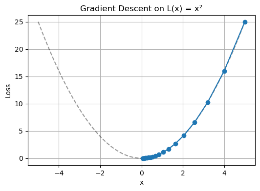

# 기울기 기반 최적화


## 완전한 기울기 유도(이층 신경망)

MNIST에 적용한 이층 모형(로지스틱 활성함수를 갖는 은닉층, 소프트맥스 출력층)의 기울기를
유도한다.

### 출력층 기울기

$\partial J/\partial \mathbf{Z}^o = \hat{\mathbf{Y}}-\mathbf{Y}$에서 출발하여 연쇄법칙을
적용하면

$$
\underset{100 \times 10}{\frac{\partial J}{\partial \mathbf{W}^o}}
= \underset{100 \times n}{\mathbf{H}^T}\;
  \bigl(\underset{n \times 10}{\hat{\mathbf{Y}}-\mathbf{Y}}\bigr)
$$

$$
\underset{1 \times 10}{\frac{\partial J}{\partial \mathbf{b}^o}}
= \underset{1 \times n}{\mathbf{1}}\;
  \bigl(\underset{n \times 10}{\hat{\mathbf{Y}}-\mathbf{Y}}\bigr)
$$

를 얻는다.

??? note "$\partial J/\partial \mathbf{W}^o$의 성분별 증명"
    $z_{ic}^o = \sum_\alpha h_{i\alpha}\,w_{\alpha c}^o + b_{1c}^o$이므로

    $$
    \frac{\partial J}{\partial w_{\alpha c}^o}
    = \sum_i \frac{\partial J}{\partial z_{ic}^o}\,\frac{\partial z_{ic}^o}{\partial w_{\alpha c}^o}
    = \sum_i (\hat{y}_{ic}-y_{ic})\,h_{i\alpha}
    = \bigl[\mathbf{H}^T(\hat{\mathbf{Y}}-\mathbf{Y})\bigr]_{\alpha c}
    $$

??? note "$\partial J/\partial \mathbf{b}^o$의 성분별 증명"

    $$
    \frac{\partial J}{\partial b_{1c}^o}
    = \sum_i (\hat{y}_{ic}-y_{ic})
    = \bigl[\mathbf{1}(\hat{\mathbf{Y}}-\mathbf{Y})\bigr]_{1c}
    $$

### 은닉층으로의 역전파

$$
\underset{n \times 100}{\frac{\partial J}{\partial \mathbf{H}}}
= \bigl(\hat{\mathbf{Y}}-\mathbf{Y}\bigr)\;\mathbf{W}^{oT}
$$

??? note "성분별 증명"

    $$
    \frac{\partial J}{\partial h_{i\alpha}}
    = \sum_c (\hat{y}_{ic}-y_{ic})\,w_{\alpha c}^o
    = \sum_c (\hat{y}_{ic}-y_{ic})\,w_{c\alpha}^{oT}
    = \bigl[(\hat{\mathbf{Y}}-\mathbf{Y})\,\mathbf{W}^{oT}\bigr]_{i\alpha}
    $$

로지스틱 활성함수 $\mathbf{H}=\operatorname{logistic}(\mathbf{Z}^h)$를 통과시키면

$$
\underset{n \times 100}{\frac{\partial J}{\partial \mathbf{Z}^h}}
= \mathbf{H}\odot(1-\mathbf{H})\odot
  \bigl[(\hat{\mathbf{Y}}-\mathbf{Y})\,\mathbf{W}^{oT}\bigr]
$$

이며, $\odot$는 성분별(아다마르) 곱이다.

### 은닉층 기울기

$$
\underset{784 \times 100}{\frac{\partial J}{\partial \mathbf{W}^h}}
= \mathbf{X}^T\;
  \bigl[\mathbf{H}\odot(1-\mathbf{H})\odot
        (\hat{\mathbf{Y}}-\mathbf{Y})\,\mathbf{W}^{oT}\bigr]
$$

$$
\underset{1 \times 100}{\frac{\partial J}{\partial \mathbf{b}^h}}
= \mathbf{1}\;
  \bigl[\mathbf{H}\odot(1-\mathbf{H})\odot
        (\hat{\mathbf{Y}}-\mathbf{Y})\,\mathbf{W}^{oT}\bigr]
$$

## 구현: NumPy로 처음부터

### 모형 함수

<div class="codebox" markdown>

#### 예제 1. 순전파와 역전파 구현 { .eg }

```python
import numpy as np

# 은닉층에는 로지스틱, 출력층에는 소프트맥스를 쓴다. 이범주의 로지스틱을
# 여러 범주로 넓힌 것이 소프트맥스다.
logistic = lambda z: 1 / (1 + np.exp(-z))
softmax  = lambda z: np.exp(z) / np.sum(np.exp(z), axis=1, keepdims=True)

def initialize_weights():
    """784 → 100 → 10 구조의 가중값을 무작위로 초기화한다.

    모두 0 으로 두면 안 된다. 같은 층의 뉴런들이 완전히 똑같이 움직여
    서로 다른 것을 배울 수 없기 때문이다.
    """
    w_h = np.random.randn(784, 100)
    b_h = np.random.randn(1, 100)
    w_o = np.random.randn(100, 10)
    b_o = np.random.randn(1, 10)
    return w_h, b_h, w_o, b_o

def feed_forward(x, y, y_cls, w_h, b_h, w_o, b_o):
    """순전파. 입력에서 출력까지 한 번 흘려 손실과 정확도를 구한다."""
    z_h = x @ w_h + b_h
    h = logistic(z_h)
    z_o = h @ w_o + b_o
    y_hat = softmax(z_o)
    y_hat_cls = np.argmax(y_hat, axis=1)
    loss = -(y * np.log(y_hat)).sum()
    accuracy = (y_cls == y_hat_cls).sum() / y_cls.size
    return h, y_hat, y_hat_cls, loss, accuracy

def back_propagation(x, y, h, y_hat, w_o):
    """역전파. 연쇄법칙을 출력에서 입력 쪽으로 거슬러 적용한다.

    첫 줄의 y_hat - y 가 이 계산 전체의 출발점이다. 소프트맥스와
    교차엔트로피를 함께 쓰면 미분이 이렇게 간단한 꼴로 떨어진다.
    로지스틱 회귀의 기울기와 같은 모양이라는 점도 눈여겨볼 만하다.
    """
    loss_grad = y_hat - y                           # n × 10
    w_o_grad  = h.T @ loss_grad                     # 100 × 10
    b_o_grad  = np.sum(loss_grad, axis=0, keepdims=True)  # 1 × 10
    h_grad    = h * (1 - h) * (loss_grad @ w_o.T)   # n × 100
    w_h_grad  = x.T @ h_grad                        # 784 × 100
    b_h_grad  = np.sum(h_grad, axis=0, keepdims=True)     # 1 × 100
    return w_h_grad, b_h_grad, w_o_grad, b_o_grad
```

</div>

!!! danger "이 코드에는 교육적 목적의 결함이 세 가지 있다"
    위 구현은 기울기 유도를 그대로 옮긴 것이라 읽기 쉽지만, 그대로 돌리기에는 문제가 있다.
    각각을 연습문제에서 다룬다.

    1. **`softmax`가 수치적으로 불안정하다.** 최댓값을 빼지 않아 큰 로짓에서 `np.exp`가
       넘친다([수치적 안정성 절](../softmax_regression/numerical_stability.md) 참조). 게다가
       `np.log(y_hat)`은 확률이 언더플로되면 `-inf`가 된다. 연습문제 2.
    2. **가중치 초기화의 척도가 잘못되었다.** `np.random.randn(784, 100)`은 은닉층 로짓의
       표준편차를 7 근처로 만들어 시그모이드를 포화시킨다. 연습문제 3.
    3. **손실이 평균이 아니라 합이다.** 따라서 실효 학습률이 배치 크기에 비례한다. 연습문제 4.

### 미니배치 학습 루프

<div class="codebox" markdown>

#### 예제 2. 학습 반복문 { .eg }

```python
def run_train_loop(x_train, y_train, y_train_cls,
                   w_h, b_h, w_o, b_o,
                   lr=1e-2, epochs=50, batch_size=100):
    """묶음 경사하강법으로 학습한다.

    세대마다 자료를 섞은 뒤 100개씩 잘라 기울기를 계산한다. 전체를 한 번에
    쓰면 정확하지만 느리고, 하나씩 쓰면 빠르지만 요동친다. 묶음은 그 사이의
    절충이다.
    """
    loss_trace, accuracy_trace = [], []
    for epoch in range(epochs):
        idx = np.arange(x_train.shape[0])
        np.random.shuffle(idx)
        x_epoch = x_train[idx]
        y_epoch = y_train[idx]
        y_cls_epoch = y_train_cls[idx]

        loss_temp, acc_temp = [], []
        for k in range(x_train.shape[0] // batch_size):
            sl = slice(k * batch_size, (k + 1) * batch_size)
            x = x_epoch[sl]
            y = y_epoch[sl]
            y_cls = y_cls_epoch[sl]

            h, y_hat, _, loss, acc = feed_forward(
                x, y, y_cls, w_h, b_h, w_o, b_o)
            grads = back_propagation(x, y, h, y_hat, w_o)
            for para, grad in zip([w_h, b_h, w_o, b_o], grads):
                para -= lr * grad
            loss_temp.append(loss)
            acc_temp.append(acc)

        loss_trace.append(np.mean(loss_temp))
        accuracy_trace.append(np.mean(acc_temp))
        print(f'{epoch+1}/{epochs}  loss {loss_trace[-1]:.1f}  '
              f'acc {accuracy_trace[-1]:.4f}')

    return w_h, b_h, w_o, b_o, loss_trace, accuracy_trace
```

</div>

### 자료 적재

<div class="codebox" markdown>

#### 예제 3. MNIST 자료 읽기 { .eg }

```python
import numpy as np
import torchvision

def load_data():
    """MNIST 를 (n, 784) 실수 배열과 원-핫 이름표로 돌려준다.

    255 로 나눠 화소값을 0~1 로 맞춘다. 이 눈금 맞추기를 빠뜨리면 로지스틱의
    입력이 너무 커져 기울기가 거의 0 이 되고, 학습이 멈춘다.
    """
    """MNIST를 (n, 784) 실수 배열과 원-핫 이름표로 돌려준다."""
    tr = torchvision.datasets.MNIST(root='./data', train=True, download=True)
    te = torchvision.datasets.MNIST(root='./data', train=False, download=True)

    x_train = tr.data.numpy().reshape(-1, 784).astype(np.float32) / 255.0
    x_test = te.data.numpy().reshape(-1, 784).astype(np.float32) / 255.0
    y_train_cls = tr.targets.numpy()
    y_test_cls = te.targets.numpy()

    y_train = np.eye(10)[y_train_cls].astype(np.float32)
    y_test = np.eye(10)[y_test_cls].astype(np.float32)
    return (x_train, y_train, y_train_cls.astype(np.int32),
            x_test,  y_test,  y_test_cls.astype(np.int32))


x_train, y_train, y_train_cls, x_test, y_test, y_test_cls = load_data()
print(x_train.shape, y_train.shape, x_test.shape)
```

출력:

```
(60000, 784) (60000, 10) (10000, 784)
```

</div>

## 경사하강의 시각화

$L(x)=x^2$에 대한 경사하강을 간단히 시각화하면 다음과 같다.

<div class="codebox" markdown>

### 예제 4. 경사하강법을 가장 단순한 함수에서 { .eg }

```python
import matplotlib.pyplot as plt

# 경사하강법이 무엇을 하는지 가장 단순한 함수에서 본다. L(x) = x^2 의
# 기울기는 2x 이므로, 갱신식은 x ← x - lr*2x = (1 - 2*lr)x 가 된다.
# lr 이 0.5 보다 크면 이 비가 -1 보다 작아져 발산한다 — 학습률이 크면
# 왜 터지는지가 이 한 줄에 들어 있다.
lr, x, steps = 0.1, 5.0, 20
xs, losses = [x], [x * x]

for _ in range(steps):
    x = x - lr * 2 * x
    xs.append(x)
    losses.append(x * x)

plt.figure(figsize=(6, 4))
t = np.linspace(-5, 5, 100)
plt.plot(t, t**2, '--k', alpha=0.4)
plt.plot(xs, losses, marker='o')
plt.xlabel('x')
plt.ylabel('Loss')
plt.title('Gradient Descent on L(x) = x²')
plt.grid(True)
plt.show()
```



</div>

## 연습문제

<div class="drillbox" markdown>

**연습문제 1.** <span class="diff med" title="중간"></span>
역전파에 등장하는 여섯 개의 행렬곱이 차원상 모두 맞는지 확인하라. 특히
$\mathbf{H}\odot(1-\mathbf{H})\odot[(\hat{\mathbf{Y}}-\mathbf{Y})\mathbf{W}^{oT}]$의 각 인자가
왜 같은 모양이어야 하는지 설명하라.

</div>

??? success "풀이"

    $n$을 배치 크기라 하고 차원을 따라가면,

    | 양 | 모양 | 계산 |
    |---|---|---|
    | $\hat{\mathbf{Y}}-\mathbf{Y}$ | $n \times 10$ | |
    | $\partial J/\partial \mathbf{W}^o$ | $100 \times 10$ | $(100 \times n)(n \times 10)$ |
    | $\partial J/\partial \mathbf{b}^o$ | $1 \times 10$ | $(1 \times n)(n \times 10)$ |
    | $(\hat{\mathbf{Y}}-\mathbf{Y})\mathbf{W}^{oT}$ | $n \times 100$ | $(n \times 10)(10 \times 100)$ |
    | $\partial J/\partial \mathbf{Z}^h$ | $n \times 100$ | 성분별 곱 |
    | $\partial J/\partial \mathbf{W}^h$ | $784 \times 100$ | $(784 \times n)(n \times 100)$ |
    | $\partial J/\partial \mathbf{b}^h$ | $1 \times 100$ | $(1 \times n)(n \times 100)$ |

    모든 기울기의 모양이 대응하는 모수의 모양과 정확히 일치한다. 이것이 역전파 구현을 검산하는
    가장 빠른 방법이다.

    **아다마르 곱이 필요한 이유.** $\mathbf{H} = \operatorname{logistic}(\mathbf{Z}^h)$는
    **성분별** 함수다. 즉 $h_{i\alpha}$는 오직 $z_{i\alpha}^h$에만 의존하므로 야코비가
    대각행렬이고, 야코비를 곱하는 일이 성분별 곱으로 환원된다. 세 인자
    $\mathbf{H}$, $1-\mathbf{H}$, $(\hat{\mathbf{Y}}-\mathbf{Y})\mathbf{W}^{oT}$가 모두
    $n \times 100$인 것은 이 때문이다.

    소프트맥스는 사정이 다르다. $\hat y_{ic}$가 행 전체의 로짓에 의존하므로 야코비가 대각이
    아니고, 원칙적으로는 성분별 곱으로 처리할 수 없다. 그럼에도 출력층 기울기가 단순한
    $\hat{\mathbf{Y}}-\mathbf{Y}$가 되는 것은 교차엔트로피와의 소거 덕분이다. $\square$

<div class="drillbox" markdown>

**연습문제 2.** <span class="diff med" title="중간"></span>
위 `softmax` 람다와 손실 계산이 수치적으로 불안정한 이유를 설명하고, 두 함수를 모두 안정적으로
고쳐 쓰라.

</div>

??? success "풀이"

    **문제.** `np.exp(z)`는 $z \gtrsim 709$에서 넘친다. 학습 초기에 가중치가 크면 로짓이 쉽게
    수백에 이르므로 `inf/inf = nan`이 된다. 또 `np.log(y_hat)`은 확률이 언더플로되어 정확히
    0이 되면 `-inf`를 낸다. 이때 손실이 `inf`가 되고, 기울기 $\hat{\mathbf{Y}}-\mathbf{Y}$는
    유한하지만 학습 곡선이 무의미해진다.

    **수정.**

    ```python
    import numpy as np

    def softmax(z):
        z = z - np.max(z, axis=1, keepdims=True)
        e = np.exp(z)
        return e / np.sum(e, axis=1, keepdims=True)

    def log_softmax(z):
        z = z - np.max(z, axis=1, keepdims=True)
        return z - np.log(np.sum(np.exp(z), axis=1, keepdims=True))

    # 로짓이 큰 경우: 순진한 방법은 넘치고 안정한 방법은 견딘다
    z_o = np.array([[800.0, 0.0, -800.0]])
    y = np.array([[0.0, 0.0, 1.0]])

    with np.errstate(over="ignore", invalid="ignore", divide="ignore"):
        naive = np.exp(z_o) / np.exp(z_o).sum(axis=1, keepdims=True)
        print("naive softmax     :", naive)
        print("naive loss        :", -(y * np.log(naive)).sum())

    # feed_forward 에서는 확률이 아니라 로짓으로부터 손실을 계산한다
    loss = -(y * log_softmax(z_o)).sum()
    y_hat = softmax(z_o)          # still needed for the gradient
    print("stable softmax    :", y_hat)
    print("stable loss       :", loss)
    ```

    출력:

    ```
    naive softmax     : [[nan  0.  0.]]
    naive loss        : nan
    stable softmax    : [[1. 0. 0.]]
    stable loss       : 1600.0
    ```

    핵심은 손실을 **확률이 아니라 로짓에서** 계산하는 것이다. `softmax`를 먼저 계산하고
    `log`를 취하면 지수화 단계에서 소실된 정보를 되살릴 수 없다. `log_softmax`는 두 단계를
    대수적으로 합쳐 그 소실을 피한다.

    기울기 계산에는 여전히 $\hat{\mathbf{Y}}$가 필요하지만, 기울기 자체는
    $\hat{\mathbf{Y}}-\mathbf{Y}$로 $[-1, 1]$에 갇혀 있어 확률이 언더플로되어도 안전하다.
    문제가 되는 것은 오직 손실값의 보고다. $\square$

<div class="drillbox" markdown>

**연습문제 3.** <span class="diff med" title="중간"></span>
`np.random.randn(784, 100)`으로 초기화하면 은닉층 로짓의 표준편차가 얼마가 되는지 추정하고,
그 결과가 학습에 미치는 영향을 설명하라. 올바른 척도는 무엇인가?

</div>

??? success "풀이"

    **표준편차 추정.** $z^h_{i\alpha} = \sum_{j=1}^{784} x_{ij} w^h_{j\alpha} + b^h_\alpha$
    이고 가중치가 독립인 $N(0,1)$이므로

    $$
    \operatorname{Var}(z^h) \approx 784 \cdot \mathbb{E}[x^2] \cdot \operatorname{Var}(w) + \operatorname{Var}(b)
    $$

    이다. $[0,1]$로 척도화한 MNIST 화소는 $\mathbb{E}[x^2] \approx 0.07$이므로
    $\operatorname{Var}(z^h) \approx 784 \times 0.07 = 55$, 표준편차는 약 $7.4$다.

    MNIST와 비슷한 희소 입력으로 모의실험하면 실제로 다음을 얻는다.

    | 초기화 | $\operatorname{sd}(z^h)$ | 평균 $h(1-h)$ | $|z^h| > 6$인 비율 |
    |---|---|---|---|
    | `randn(784, 100)` | $7.10$ | $0.054$ | $0.397$ |
    | `randn(784, 100)/np.sqrt(784)` | $0.26$ | $0.246$ | $0.000$ |

    **학습에 미치는 영향.** 은닉 단위의 40%가 포화되어 $h(1-h) \approx 0$이 된다. 은닉층
    기울기가 $\mathbf{H}\odot(1-\mathbf{H})$를 곱하므로, 포화된 단위로는 기울기가 거의 흐르지
    않는다. 평균으로 보면 건강한 값 $0.25$의 5분의 1 수준이라 학습이 그만큼 느려지고, 극단적으로
    포화된 단위는 사실상 죽는다.

    **올바른 척도.** 시그모이드나 tanh 활성함수에는 **자비에(글로로) 초기화**를 쓴다.

    $$
    w \sim N\!\left(0, \frac{1}{n_{\text{in}}}\right)
    \quad\text{또는}\quad
    w \sim N\!\left(0, \frac{2}{n_{\text{in}} + n_{\text{out}}}\right)
    $$

    ReLU에는 **허 초기화** $w \sim N(0, 2/n_{\text{in}})$을 쓴다. 어느 쪽이든 핵심은
    $\operatorname{Var}(z)$를 $n_{\text{in}}$과 무관하게 $O(1)$로 유지하는 것이다.

    편향도 마찬가지다. `np.random.randn(1, 100)`으로 초기화할 이유가 없다. 0으로 두는 것이
    표준이다. $\square$

<div class="drillbox" markdown>

**연습문제 4.** <span class="diff med" title="중간"></span>
`feed_forward`의 손실이 배치에 대한 **합**이라는 사실이 실효 학습률에 어떤 영향을 주는지
설명하라. `batch_size`를 100에서 200으로 바꾸면 `lr`을 어떻게 조정해야 하는가?

</div>

??? success "풀이"

    손실이 $J = \sum_{i=1}^{B} \ell_i$(합)이면 기울기도 $\nabla J = \sum_i \nabla \ell_i$로
    배치 크기 $B$에 비례한다. 따라서 갱신량

    $$
    \Delta \theta = -\eta \nabla J = -\eta B \cdot \overline{\nabla \ell}
    $$

    은 $B$에 비례한다. 즉 **실효 학습률이 $\eta B$다.**

    `lr=1e-2`, `batch_size=100`이면 실효 학습률은 $10^{-2} \times 100 = 1$로, 표본당 평균
    기울기에 대해 학습률 1을 쓰는 셈이다. 상당히 공격적인 값이다.

    `batch_size`를 200으로 바꾸면 기울기가 두 배가 되므로 같은 갱신 크기를 유지하려면
    `lr`을 절반인 $5 \times 10^{-3}$으로 줄여야 한다.

    **더 나은 관행:** 손실을 평균으로 정의한다.

    ```python
    x = np.zeros((100, 784))       # 배치 크기 100을 가정
    z_o = np.zeros((100, 10))
    y = np.eye(10)[np.zeros(100, dtype=int)]

    loss_sum = -(y * log_softmax(z_o)).sum()
    loss = -(y * log_softmax(z_o)).sum() / x.shape[0]
    # 기울기도 모두 x.shape[0] 으로 나눈다
    print(f"합 기준 손실: {loss_sum:.4f},  평균 기준 손실: {loss:.4f}")
    ```

    출력:

    ```
    합 기준 손실: 230.2585,  평균 기준 손실: 2.3026
    ```

    그러면 학습률이 배치 크기와 분리되어 배치 크기를 바꿔도 학습률을 다시 조율할 필요가 없다.
    PyTorch의 `nn.CrossEntropyLoss`가 기본으로 `reduction='mean'`을 쓰는 이유가 이것이다.

    (미묘한 점: 배치가 커지면 기울기의 잡음이 줄어들므로 학습률을 오히려 **키울** 수도 있다.
    큰 배치 학습에서 널리 쓰이는 경험칙이 "$B$를 $k$배 키우면 $\eta$도 $k$배" 또는
    "$\sqrt{k}$배"인데, 이는 위의 척도 문제와는 별개의, 잡음에 관한 이야기다.) $\square$

<div class="drillbox" markdown>

**연습문제 5.** <span class="diff hard" title="어려움"></span>
$L(x) = x^2$에 대한 경사하강에서 $x_k$의 닫힌 형태를 구하라. 수렴 조건은 무엇이며,
$\eta = 0.1$, $x_0 = 5$일 때 20단계 후의 값은?

</div>

??? success "풀이"

    $L'(x) = 2x$이므로 갱신식은

    $$
    x_{k+1} = x_k - \eta \cdot 2 x_k = (1 - 2\eta)\,x_k
    $$

    이고, 따라서

    $$
    x_k = (1-2\eta)^k\, x_0
    $$

    이다.

    **수렴 조건:** $|1 - 2\eta| < 1 \iff 0 < \eta < 1$이다. 세 영역으로 나뉜다.

    | $\eta$ | 행동 |
    |---|---|
    | $0 < \eta < 1/2$ | 단조 수렴(부호 유지) |
    | $\eta = 1/2$ | 한 단계 만에 정확히 0 |
    | $1/2 < \eta < 1$ | 부호를 바꾸며 진동 수렴 |
    | $\eta = 1$ | $x_k = (-1)^k x_0$, 진동하며 수렴하지 않음 |
    | $\eta > 1$ | 발산 |

    수치로 확인하면 $\eta = 1.1$에서 20단계 후 $x = 191.7$로 발산하고, $\eta = 0.9$에서는
    $x = 0.0576$으로 $\eta = 0.1$과 같은 크기로 수렴한다($|1-2(0.9)| = |1-2(0.1)| = 0.8$이므로).

    **$\eta = 0.1$, $x_0 = 5$, 20단계:**

    $$
    x_{20} = (0.8)^{20} \times 5 = 0.011529 \times 5 = 0.057646
    $$

    **일반화.** $L$이 $\mu$-강볼록이고 $L$-평활이면 경사하강은 $\eta < 2/L$에서 수렴하고
    최적 학습률은 $\eta = 2/(\mu + L)$이다. $L(x) = x^2$은 $\mu = L = 2$이므로 최적
    $\eta = 1/2$이고, 실제로 한 단계 만에 정확히 수렴한다. $\square$

---

## 정리하며

기울기를 **연쇄법칙으로** 유도했다.

- **역전파가 연쇄법칙의 조직적 적용이다.** 출력층에서 시작해 은닉층으로 거슬러 올라가며 기울기를 전달한다.
- **출력층의 기울기가 가장 깔끔하다.** 소프트맥스와 교차엔트로피가 결합되면 $\mathbf P-\mathbf Y$ 로 떨어지며, 중간의 야코비안이 상쇄된다.
- **은닉층에서는 활성함수의 도함수가 곱해진다.** 시그모이드면 $\sigma(1-\sigma)$ 이며, 이 값이 작아 **기울기 소실**의 원인이 된다.
- **닫힌 형태가 없으므로 반복이 필요하다.** 19장의 로지스틱 회귀와 같은 이유이며, 다층이 되면 헤세행렬이 너무 커서 기울기 계열을 쓴다.
- **손실이 더 이상 볼록하지 않다.** 은닉층이 생기는 순간 지역 최적이 존재할 수 있으며, 초기값과 학습률이 중요해진다.

다음 절 **정칙화**로 넘어간다.
