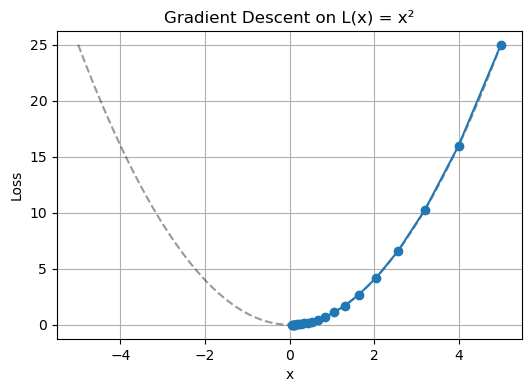

# 기울기 기반 최적화


## 완전한 기울기 유도(이층 신경망)

MNIST에 적용한 이층 모형(로지스틱 활성함수를 갖는 은닉층, 소프트맥스 출력층)의 기울기를
유도한다.

### 출력층 기울기

$\partial J/\partial \mathbf{Z}^o = \hat{\mathbf{Y}}-\mathbf{Y}$에서 출발하여 연쇄법칙을
적용하면

$$
\underset{100 \times 10}{\frac{\partial J}{\partial \mathbf{W}^o}}
= \underset{100 \times n}{\mathbf{H}^T}\;
  \bigl(\underset{n \times 10}{\hat{\mathbf{Y}}-\mathbf{Y}}\bigr)
$$

$$
\underset{1 \times 10}{\frac{\partial J}{\partial \mathbf{b}^o}}
= \underset{1 \times n}{\mathbf{1}}\;
  \bigl(\underset{n \times 10}{\hat{\mathbf{Y}}-\mathbf{Y}}\bigr)
$$

를 얻는다.

??? note "$\partial J/\partial \mathbf{W}^o$의 성분별 증명"
    $z_{ic}^o = \sum_\alpha h_{i\alpha}\,w_{\alpha c}^o + b_{1c}^o$이므로

    $$
    \frac{\partial J}{\partial w_{\alpha c}^o}
    = \sum_i \frac{\partial J}{\partial z_{ic}^o}\,\frac{\partial z_{ic}^o}{\partial w_{\alpha c}^o}
    = \sum_i (\hat{y}_{ic}-y_{ic})\,h_{i\alpha}
    = \bigl[\mathbf{H}^T(\hat{\mathbf{Y}}-\mathbf{Y})\bigr]_{\alpha c}
    $$

??? note "$\partial J/\partial \mathbf{b}^o$의 성분별 증명"

    $$
    \frac{\partial J}{\partial b_{1c}^o}
    = \sum_i (\hat{y}_{ic}-y_{ic})
    = \bigl[\mathbf{1}(\hat{\mathbf{Y}}-\mathbf{Y})\bigr]_{1c}
    $$

### 은닉층으로의 역전파

$$
\underset{n \times 100}{\frac{\partial J}{\partial \mathbf{H}}}
= \bigl(\hat{\mathbf{Y}}-\mathbf{Y}\bigr)\;\mathbf{W}^{oT}
$$

??? note "성분별 증명"

    $$
    \frac{\partial J}{\partial h_{i\alpha}}
    = \sum_c (\hat{y}_{ic}-y_{ic})\,w_{\alpha c}^o
    = \sum_c (\hat{y}_{ic}-y_{ic})\,w_{c\alpha}^{oT}
    = \bigl[(\hat{\mathbf{Y}}-\mathbf{Y})\,\mathbf{W}^{oT}\bigr]_{i\alpha}
    $$

로지스틱 활성함수 $\mathbf{H}=\operatorname{logistic}(\mathbf{Z}^h)$를 통과시키면

$$
\underset{n \times 100}{\frac{\partial J}{\partial \mathbf{Z}^h}}
= \mathbf{H}\odot(1-\mathbf{H})\odot
  \bigl[(\hat{\mathbf{Y}}-\mathbf{Y})\,\mathbf{W}^{oT}\bigr]
$$

이며, $\odot$는 성분별(아다마르) 곱이다.

### 은닉층 기울기

$$
\underset{784 \times 100}{\frac{\partial J}{\partial \mathbf{W}^h}}
= \mathbf{X}^T\;
  \bigl[\mathbf{H}\odot(1-\mathbf{H})\odot
        (\hat{\mathbf{Y}}-\mathbf{Y})\,\mathbf{W}^{oT}\bigr]
$$

$$
\underset{1 \times 100}{\frac{\partial J}{\partial \mathbf{b}^h}}
= \mathbf{1}\;
  \bigl[\mathbf{H}\odot(1-\mathbf{H})\odot
        (\hat{\mathbf{Y}}-\mathbf{Y})\,\mathbf{W}^{oT}\bigr]
$$

## 구현: NumPy로 처음부터

### 모형 함수

<div class="exbox" markdown>

**보기 1.** <span class="diff easy" title="쉬움"></span> 순전파와 역전파 구현. 위에서 유도한 네 기울기를 코드로 옮긴다.

**(1)** 손으로 유도한 기울기가 **정말 맞는지** 확인하는 방법을 적으시오. 중심차분을 쓸 때 오차는 어떻게 줄어드는가.

**(2)** 그 검사를 실제로 수행하여 해석적 기울기와 수치 기울기의 상대오차를 보이시오.

</div>

??? success "풀이"

    **(1) 기울기 검사.** 유도는 믿을 것이 못 된다. 전치 하나, 부호 하나만 틀려도 코드는 조용히 돌아가고 학습만 안 될 뿐이다. 그러므로 **수치미분과 맞춰 본다.** 모수 하나 $\theta$를 골라 $\pm\varepsilon$만큼 흔들고

    $$
    \widehat{\frac{\partial J}{\partial \theta}}
    = \frac{J(\theta + \varepsilon) - J(\theta - \varepsilon)}{2\varepsilon}
    $$

    을 역전파가 준 값과 견준다. **중심차분**을 쓰는 까닭은 테일러 전개가

    $$
    J(\theta \pm \varepsilon)
    = J(\theta) \pm \varepsilon J'(\theta)
    + \frac{\varepsilon^2}{2}J''(\theta)
    \pm \frac{\varepsilon^3}{6}J'''(\theta) + \cdots
    $$

    이라 빼면 $J''$ 항이 **소거되어** 잘림오차가 $O(\varepsilon^2)$이기 때문이다. 한쪽차분 $(J(\theta+\varepsilon) - J(\theta))/\varepsilon$은 $O(\varepsilon)$에 그친다.

    다만 $\varepsilon$을 한없이 줄일 수는 없다. 분자가 두 큰 수의 차라 **자리 잃음**이 일어나고, 그 반올림오차는 $O(\epsilon_{\text{mach}}/\varepsilon)$으로 오히려 커진다. 둘을 합친 오차 $a\varepsilon^2 + b\,\epsilon_{\text{mach}}/\varepsilon$이 가장 작아지는 자리는 $\varepsilon \sim \epsilon_{\text{mach}}^{1/3} \approx 6 \times 10^{-6}$이다. 그래서 $\varepsilon = 10^{-6}$으로 둔다. 이때 상대오차가 $10^{-7}$보다 작으면 통과로 본다.

    **(2) 수치적으로.** $n = 5$짜리 작은 배치로 네 모수에서 두 좌표씩 뽑아 검사한다. 원래 척도 `randn(784, 100)`을 그대로 쓰면 로지스틱이 포화되어($\partial J/\partial w^h \approx 0$) 검사가 무의미해지므로, 연습문제 3의 처방대로 $\sqrt{n_{\text{in}}}$으로 나눈 척도에서 잰다.

    ```python
    import numpy as np

    # 은닉층에는 로지스틱, 출력층에는 소프트맥스를 쓴다. 이범주의 로지스틱을
    # 여러 범주로 넓힌 것이 소프트맥스다.
    logistic = lambda z: 1 / (1 + np.exp(-z))
    softmax  = lambda z: np.exp(z) / np.sum(np.exp(z), axis=1, keepdims=True)

    def initialize_weights():
        """784 → 100 → 10 구조의 가중값을 무작위로 초기화한다.

        모두 0 으로 두면 안 된다. 같은 층의 뉴런들이 완전히 똑같이 움직여
        서로 다른 것을 배울 수 없기 때문이다.
        """
        w_h = np.random.randn(784, 100)
        b_h = np.random.randn(1, 100)
        w_o = np.random.randn(100, 10)
        b_o = np.random.randn(1, 10)
        return w_h, b_h, w_o, b_o

    def feed_forward(x, y, y_cls, w_h, b_h, w_o, b_o):
        """순전파. 입력에서 출력까지 한 번 흘려 손실과 정확도를 구한다."""
        z_h = x @ w_h + b_h
        h = logistic(z_h)
        z_o = h @ w_o + b_o
        y_hat = softmax(z_o)
        y_hat_cls = np.argmax(y_hat, axis=1)
        loss = -(y * np.log(y_hat)).sum()
        accuracy = (y_cls == y_hat_cls).sum() / y_cls.size
        return h, y_hat, y_hat_cls, loss, accuracy

    def back_propagation(x, y, h, y_hat, w_o):
        """역전파. 연쇄법칙을 출력에서 입력 쪽으로 거슬러 적용한다.

        첫 줄의 y_hat - y 가 이 계산 전체의 출발점이다. 소프트맥스와
        교차엔트로피를 함께 쓰면 미분이 이렇게 간단한 꼴로 떨어진다.
        로지스틱 회귀의 기울기와 같은 모양이라는 점도 눈여겨볼 만하다.
        """
        loss_grad = y_hat - y                           # n × 10
        w_o_grad  = h.T @ loss_grad                     # 100 × 10
        b_o_grad  = np.sum(loss_grad, axis=0, keepdims=True)  # 1 × 10
        h_grad    = h * (1 - h) * (loss_grad @ w_o.T)   # n × 100
        w_h_grad  = x.T @ h_grad                        # 784 × 100
        b_h_grad  = np.sum(h_grad, axis=0, keepdims=True)     # 1 × 100
        return w_h_grad, b_h_grad, w_o_grad, b_o_grad

    # === 기울기 검사 ===
    rng = np.random.default_rng(0)
    np.random.seed(0)
    n = 5
    x = rng.random((n, 784))
    y_cls = rng.integers(0, 10, n)
    y = np.eye(10)[y_cls]

    # 척도를 줄여 로지스틱이 포화되지 않게 둔다(연습문제 3 참조).
    w_h, b_h, w_o, b_o = initialize_weights()
    w_h /= np.sqrt(784)
    w_o /= np.sqrt(100)

    h, y_hat, _, loss, acc = feed_forward(x, y, y_cls, w_h, b_h, w_o, b_o)
    grads = back_propagation(x, y, h, y_hat, w_o)
    params = [w_h, b_h, w_o, b_o]
    names = ["w_h", "b_h", "w_o", "b_o"]

    print(f"손실 {loss:.6f},  기울기 모양 {[g.shape for g in grads]}")

    eps = 1e-6
    print("모수        좌표        해석적 기울기      수치 기울기      상대오차")
    for name, p, g in zip(names, params, grads):
        for _ in range(2):
            idx = tuple(rng.integers(0, s) for s in p.shape)
            orig = p[idx]
            p[idx] = orig + eps
            lp = feed_forward(x, y, y_cls, w_h, b_h, w_o, b_o)[3]
            p[idx] = orig - eps
            lm = feed_forward(x, y, y_cls, w_h, b_h, w_o, b_o)[3]
            p[idx] = orig
            num = (lp - lm) / (2 * eps)
            ana = g[idx]
            rel = abs(num - ana) / max(abs(num), abs(ana), 1e-12)
            print(f"{name:4s}  {str(idx):10s}  {ana: .9f}   {num: .9f}   {rel:.2e}")
    ```

    출력:

    ```
    손실 10.473900,  기울기 모양 [(784, 100), (1, 100), (100, 10), (1, 10)]
    모수        좌표        해석적 기울기      수치 기울기      상대오차
    w_h   (151, 79)   -0.007959425   -0.007959424   5.95e-08
    w_h   (545, 9)     0.012733875    0.012733874   8.05e-08
    b_h   (0, 60)     -0.028912338   -0.028912338   3.76e-09
    b_h   (0, 66)     -0.026029133   -0.026029133   2.54e-09
    w_o   (14, 9)      0.707775224    0.707775224   3.09e-10
    w_o   (19, 8)     -0.667064674   -0.667064674   8.76e-11
    b_o   (0, 7)       0.123503252    0.123503251   7.33e-09
    b_o   (0, 3)       0.597351092    0.597351093   2.01e-09
    ```

    **여덟 좌표 모두 통과한다.** 상대오차가 $10^{-10}$에서 $10^{-8}$ 사이로, 통과 기준 $10^{-7}$보다 작다. 절 머리에서 유도한 네 식이 코드와 일치한다는 뜻이다.

    오차가 층마다 다른 것도 읽을 거리다. 출력층 $\mathbf{W}^o$에서 $10^{-10}$으로 가장 작고 입력층 $\mathbf{W}^h$에서 $10^{-8}$로 가장 크다. 기울기 자체의 **크기**가 $0.7$ 대 $0.008$로 두 자릿수 차이 나기 때문이다. 중심차분의 반올림오차는 기울기의 크기와 무관하게 $\epsilon_{\text{mach}}/\varepsilon$ 수준이므로, 작은 기울기일수록 상대오차가 커진다. **기울기 검사에서 은닉층 쪽 숫자가 조금 지저분한 것은 정상이다.**

    기울기의 모양도 모수의 모양과 하나씩 맞는다. $(784, 100)$, $(1, 100)$, $(100, 10)$, $(1, 10)$으로 연습문제 1의 표와 같다.


!!! danger "이 코드에는 교육적 목적의 결함이 세 가지 있다"
    위 구현은 기울기 유도를 그대로 옮긴 것이라 읽기 쉽지만, 그대로 돌리기에는 문제가 있다.
    각각을 연습문제에서 다룬다.

    1. **`softmax`가 수치적으로 불안정하다.** 최댓값을 빼지 않아 큰 로짓에서 `np.exp`가
       넘친다([수치적 안정성 절](../softmax_regression/numerical_stability.md) 참조). 게다가
       `np.log(y_hat)`은 확률이 언더플로되면 `-inf`가 된다. 연습문제 2.
    2. **가중치 초기화의 척도가 잘못되었다.** `np.random.randn(784, 100)`은 은닉층 로짓의
       표준편차를 7 근처로 만들어 시그모이드를 포화시킨다. 연습문제 3.
    3. **손실이 평균이 아니라 합이다.** 따라서 실효 학습률이 배치 크기에 비례한다. 연습문제 4.

### 미니배치 학습 루프

<div class="exbox" markdown>

**보기 2.** <span class="diff easy" title="쉬움"></span> 학습 반복문. MNIST($n = 60{,}000$)에 `lr=1e-2`, `epochs=50`, `batch_size=100`으로 돌린다고 하자.

**(1)** 모수 갱신은 모두 몇 번 일어나는가. 세대마다 버려지는 자료는 몇 개인가.

**(2)** 찍히는 `loss`는 **무엇의 평균**인가. 아무것도 모르는 모형이라면 그 값이 얼마여야 하는지 구하고, 실제 첫 묶음의 값과 견주시오.

</div>

??? success "풀이"

    **(1) 갱신 횟수.** 안쪽 반복문이 `range(x_train.shape[0] // batch_size)`이므로 세대마다

    $$
    \left\lfloor \frac{60{,}000}{100} \right\rfloor = 600
    $$

    번 돌고, $50$세대이면 모두 $600 \times 50 = 30{,}000$번 갱신한다.

    버려지는 자료는 $60{,}000 \bmod 100 = 0$개다. **마침 나누어떨어져서 하나도 버리지 않는다.** 그러나 이것은 운이고, 몫 연산이 나머지를 조용히 버린다는 사실은 남아 있다. `batch_size=128`로 바꾸면 세대마다 $60{,}000 \bmod 128 = 96$개가 빠진다. 다행히 세대 머리에서 `np.random.shuffle`로 섞으므로 **매번 다른 $96$개**가 빠지고, 50세대에 걸쳐 보면 치우침은 거의 남지 않는다. 섞지 않았다면 늘 끝의 같은 $96$개만 학습에서 제외되었을 것이다.

    **(2) 손실의 눈금.** `feed_forward`의 손실은

    $$
    \texttt{loss} = -\sum_{i=1}^{B}\sum_{c} y_{ic}\log \hat y_{ic}
    $$

    로 묶음에 대한 **합**이다(평균이 아니다, 연습문제 4). `loss_trace`는 이것을 $600$개 묶음에 대해 평균한 것이므로, 결국 **표본당 손실의 $B = 100$배**다.

    모형이 아무것도 모르면 열 범주에 똑같이 $1/10$을 주므로 표본당 손실이 $-\log(1/10) = \log 10 = 2.302585$이고, 따라서

    $$
    \texttt{loss} = B \log 10 = 100 \times 2.302585 = 230.2585
    $$

    가 **"모르는 상태"의 기준선**이다. 이보다 크면 모형이 아는 것보다 못한 상태, 곧 **확신을 갖고 틀리고 있다**는 뜻이다.

    ```python
    def run_train_loop(x_train, y_train, y_train_cls,
                       w_h, b_h, w_o, b_o,
                       lr=1e-2, epochs=50, batch_size=100):
        """묶음 경사하강법으로 학습한다.

        세대마다 자료를 섞은 뒤 100개씩 잘라 기울기를 계산한다. 전체를 한 번에
        쓰면 정확하지만 느리고, 하나씩 쓰면 빠르지만 요동친다. 묶음은 그 사이의
        절충이다.
        """
        loss_trace, accuracy_trace = [], []
        for epoch in range(epochs):
            idx = np.arange(x_train.shape[0])
            np.random.shuffle(idx)
            x_epoch = x_train[idx]
            y_epoch = y_train[idx]
            y_cls_epoch = y_train_cls[idx]

            loss_temp, acc_temp = [], []
            for k in range(x_train.shape[0] // batch_size):
                sl = slice(k * batch_size, (k + 1) * batch_size)
                x = x_epoch[sl]
                y = y_epoch[sl]
                y_cls = y_cls_epoch[sl]

                h, y_hat, _, loss, acc = feed_forward(
                    x, y, y_cls, w_h, b_h, w_o, b_o)
                grads = back_propagation(x, y, h, y_hat, w_o)
                for para, grad in zip([w_h, b_h, w_o, b_o], grads):
                    para -= lr * grad
                loss_temp.append(loss)
                acc_temp.append(acc)

            loss_trace.append(np.mean(loss_temp))
            accuracy_trace.append(np.mean(acc_temp))
            print(f'{epoch+1}/{epochs}  loss {loss_trace[-1]:.1f}  '
                  f'acc {accuracy_trace[-1]:.4f}')

        return w_h, b_h, w_o, b_o, loss_trace, accuracy_trace
    ```

    **수치적으로.**

    ```python
    import numpy as np
    import torchvision

    # 자료 적재는 다음 보기에서 자세히 다룬다. 여기서는 훈련자료만 쓴다.
    tr = torchvision.datasets.MNIST(root='./data', train=True, download=True)
    x_train = tr.data.numpy().reshape(-1, 784).astype(np.float64) / 255.0
    y_train_cls = tr.targets.numpy()
    y_train = np.eye(10)[y_train_cls]

    n, B = x_train.shape[0], 100
    print(f"세대마다 갱신 {n // B}번,  50세대이면 모두 {50 * (n // B)}번")
    print(f"세대마다 버려지는 자료 {n % B}개   (batch_size=128 이면 {n % 128}개)")
    print(f"실효 학습률 = lr x B = {1e-2 * B}")
    print(f"균등 예측일 때의 loss = B log 10 = {B * np.log(10):.4f}")

    # 갱신 전 첫 묶음에서 손실을 재어 본다.
    np.random.seed(0)
    w_h, b_h, w_o, b_o = initialize_weights()
    _, _, _, loss0, acc0 = feed_forward(x_train[:B], y_train[:B], y_train_cls[:B],
                                        w_h, b_h, w_o, b_o)
    print(f"첫 묶음의 loss {loss0:.1f}  (표본당 {loss0 / B:.4f}),  acc {acc0:.4f}")

    # 세 세대만 돌려 본다.
    out = run_train_loop(x_train, y_train, y_train_cls,
                         w_h, b_h, w_o, b_o, epochs=3)
    print(f"넘긴 w_h 와 돌려받은 w_h 가 같은 객체인가: {w_h is out[0]}")
    ```

    출력:

    ```
    세대마다 갱신 600번,  50세대이면 모두 30000번
    세대마다 버려지는 자료 0개   (batch_size=128 이면 96개)
    실효 학습률 = lr x B = 1.0
    균등 예측일 때의 loss = B log 10 = 230.2585
    첫 묶음의 loss 852.7  (표본당 8.5275),  acc 0.1000
    1/3  loss 70.8  acc 0.8116
    2/3  loss 33.6  acc 0.8991
    3/3  loss 27.2  acc 0.9183
    넘긴 w_h 와 돌려받은 w_h 가 같은 객체인가: True
    ```

    **(1)은 그대로 맞고, (2)는 예상보다 나쁘다.** 갱신 횟수 $600$과 $30{,}000$, 버려지는 자료 $0$개(그리고 $128$이면 $96$개)가 모두 맞는다.

    그런데 갱신 전 첫 묶음의 손실이 $852.7$로, 기준선 $230.26$의 **$3.7$배**다. 표본당 $8.53$이니 참 범주에 평균 $e^{-8.53} = 2.0 \times 10^{-4}$의 확률을 준 셈이다. 정확도는 $0.1000$으로 정확히 찍기 수준이다. **모형이 아무것도 모르면서 아주 확신하고 있다.** 위의 경고 상자가 말한 두 번째 결함, 곧 `np.random.randn`이 로짓을 지나치게 크게 만드는 문제가 수로 드러난 것이다. 자세한 것은 연습문제 3에 있다.

    그래도 학습은 된다. 세 세대 만에 평균 손실이 $70.8 \to 33.6 \to 27.2$, 정확도가 $0.8116 \to 0.8991 \to 0.9183$이다. 여기서 한 가지 눈속임을 조심해야 한다. **첫 세대의 평균 $70.8$은 기준선 $230.26$보다 이미 작은데, 그것은 세대 안에서 $600$번 갱신이 일어난 뒤의 값들까지 함께 평균했기 때문이다.** 세대 평균은 세대 처음의 상태를 가려 버린다.

    마지막 줄도 중요하다. `para -= lr * grad`는 넘파이 배열의 **제자리 연산**이라 호출한 쪽의 배열을 직접 고친다. 그래서 돌려받은 `w_h`가 넘긴 `w_h`와 **같은 객체**다. 만일 `para = para - lr * grad`로 썼다면 지역 이름만 새 배열을 가리키게 되어 **학습이 아무 일도 하지 않은 채 조용히 끝났을 것이다.** 반복문 안에서 모수를 갱신할 때 흔히 저지르는 실수다.


### 자료 적재

<div class="exbox" markdown>

**보기 3.** <span class="diff easy" title="쉬움"></span> MNIST 자료 읽기

**(1)** `load_data`가 돌려주는 여섯 배열의 **모양**과 **자료형**을 적고, 모두 합쳐 메모리를 얼마나 쓰는지 계산하시오. `float64`로 두면 어떻게 되는가.

**(2)** 읽어서 확인하시오. 이 함수에는 **아무 일도 하지 않는 줄**이 하나 있다. 어디이며 왜 그런가.

</div>

??? success "풀이"

    **(1) 모양과 메모리.** MNIST는 $28 \times 28$ 회색조 이미지이고 $28^2 = 784$이므로 평탄화하면 길이 $784$인 벡터가 된다. 훈련 $60{,}000$장, 검정 $10{,}000$장이다.

    | 배열 | 모양 | 자료형 | 바이트 |
    |:---|:---|:---|---:|
    | `x_train` | $(60000,\ 784)$ | `float32` | $60000 \times 784 \times 4 = 188.16$ MB |
    | `y_train` | $(60000,\ 10)$ | `float32` | $2.40$ MB |
    | `y_train_cls` | $(60000,)$ | `int32` | $0.24$ MB |
    | `x_test` | $(10000,\ 784)$ | `float32` | $31.36$ MB |
    | `y_test` | $(10000,\ 10)$ | `float32` | $0.40$ MB |
    | `y_test_cls` | $(10000,)$ | `int32` | $0.04$ MB |

    합이 $222.60$ MB다. **$x$가 $219.52$ MB로 거의 전부**이며 이름표 쪽은 다 합쳐 $3.08$ MB에 지나지 않는다. 원-핫으로 펼친 `y_train`이 정수 이름표 `y_train_cls`보다 $10$배 크지만, 그래도 $x$의 $1/78.4$다. 원-핫이 메모리를 잡아먹는다는 걱정은 범주가 수만 개일 때나 할 일이다.

    `float64`로 두면 실수 배열 넷이 모두 두 배가 되어 $222.60 + 222.32 = 444.92$ MB가 된다. 화소값은 $0$에서 $255$까지의 정수를 $255$로 나눈 것이라 유효숫자가 세 자리도 못 되므로, `float32`의 일곱 자리로 넘치도록 충분하다. **`float32`를 쓰는 것이 옳다.**

    한 가지 더. $255.0$으로 나누는 것은 눈금을 $[0,1]$로 맞추기 위한 것인데, 이 한 줄이 학습에 결정적이다. 나누지 않으면 입력이 $255$배가 되어 은닉층 로짓도 그만큼 커지고, 로지스틱이 완전히 포화되어 기울기가 거의 $0$이 된다(연습문제 3).

    **(2) 아무 일도 하지 않는 줄.** 함수 본문에 문자열이 **둘** 들어 있다.

    ```
    """MNIST 를 (n, 784) 실수 배열과 원-핫 이름표로 돌려준다.
    ...
    """
    """MNIST를 (n, 784) 실수 배열과 원-핫 이름표로 돌려준다."""
    ```

    파이썬은 함수 본문의 **첫** 문자열만 설명문(`__doc__`)으로 삼는다. 둘째 문자열은 값을 쓰지 않는 평범한 식 문장이라 바이트코드에서 `NOP`으로 사라진다. 곧 **아무 일도 하지 않는다.** 오류를 내지도 않으므로 이런 중복은 조용히 남는다. 지우는 것이 맞다.

    ```python
    import numpy as np
    import torchvision

    def load_data():
        """MNIST 를 (n, 784) 실수 배열과 원-핫 이름표로 돌려준다.

        255 로 나눠 화소값을 0~1 로 맞춘다. 이 눈금 맞추기를 빠뜨리면 로지스틱의
        입력이 너무 커져 기울기가 거의 0 이 되고, 학습이 멈춘다.
        """
        tr = torchvision.datasets.MNIST(root='./data', train=True, download=True)
        te = torchvision.datasets.MNIST(root='./data', train=False, download=True)

        x_train = tr.data.numpy().reshape(-1, 784).astype(np.float32) / 255.0
        x_test = te.data.numpy().reshape(-1, 784).astype(np.float32) / 255.0
        y_train_cls = tr.targets.numpy()
        y_test_cls = te.targets.numpy()

        y_train = np.eye(10)[y_train_cls].astype(np.float32)
        y_test = np.eye(10)[y_test_cls].astype(np.float32)
        return (x_train, y_train, y_train_cls.astype(np.int32),
                x_test,  y_test,  y_test_cls.astype(np.int32))


    x_train, y_train, y_train_cls, x_test, y_test, y_test_cls = load_data()
    print(x_train.shape, y_train.shape, x_test.shape)

    arrays = [x_train, y_train, y_train_cls, x_test, y_test, y_test_cls]
    names = ["x_train", "y_train", "y_train_cls", "x_test", "y_test", "y_test_cls"]
    total = 0
    for name, a in zip(names, arrays):
        print(f"{name:12s} {str(a.shape):14s} {str(a.dtype):8s} {a.nbytes / 1e6:8.2f} MB")
        total += a.nbytes
    print(f"합계 {total / 1e6:.2f} MB")
    print(f"화소 범위 {x_train.min()} ~ {x_train.max()},"
          f"  원-핫 행합 {set(y_train.sum(axis=1).tolist())}")
    ```

    출력:

    ```
    (60000, 784) (60000, 10) (10000, 784)
    x_train      (60000, 784)   float32    188.16 MB
    y_train      (60000, 10)    float32      2.40 MB
    y_train_cls  (60000,)       int32        0.24 MB
    x_test       (10000, 784)   float32     31.36 MB
    y_test       (10000, 10)    float32      0.40 MB
    y_test_cls   (10000,)       int32        0.04 MB
    합계 222.60 MB
    화소 범위 0.0 ~ 1.0,  원-핫 행합 {1.0}
    ```

    **표의 수가 모두 맞는다.** 합계 $222.60$ MB이고 화소가 $[0, 1]$에, 원-핫의 행 합이 모두 $1$에 있다.

    !!! warning "이 블록은 자료를 내려받는다"
        `download=True`이므로 `./data`가 비어 있으면 MNIST 네 파일(약 $11$ MB)을 내려받는다. 망이 막힌 곳에서는 실패하며, 한 번 받아 두면 그다음부터는 바로 읽는다.

## 경사하강의 시각화

$L(x)=x^2$에 대한 경사하강을 간단히 시각화하면 다음과 같다.

<div class="exbox" markdown>

**보기 4.** <span class="diff easy" title="쉬움"></span> 경사하강법을 가장 단순한 함수에서. $L(x) = x^2$에 $\eta = 0.1$, $x_0 = 5$로 $20$단계 내려간다.

**(1)** $x_k$의 닫힌 꼴을 구하고 $x_{20}$과 $L(x_{20})$을 계산하시오. 그림에 찍히는 점 $21$개는 어떤 모양으로 놓이겠는가.

**(2)** 코드의 주석은 "`lr`이 $0.5$보다 크면 발산한다"고 말한다. **맞는가.** 갱신식에서 발산 조건을 바로 읽고 수로 확인하시오.

</div>

??? success "풀이"

    **(1) 닫힌 꼴.** $L'(x) = 2x$이므로 갱신식이

    $$
    x_{k+1} = x_k - \eta \cdot 2x_k = (1 - 2\eta)\,x_k
    $$

    로 **등비수열**이다. 따라서

    $$
    x_k = (1 - 2\eta)^k x_0 = (0.8)^k \times 5
    $$

    이고 손실은 그 제곱이라 공비가 $0.8^2 = 0.64$인 등비수열

    $$
    L(x_k) = 25 \times (0.64)^k
    $$

    이다. $k = 20$에서

    $$
    x_{20} = 5 \times (0.8)^{20} = 5 \times 0.01152922 = 0.05764608,
    \qquad
    L(x_{20}) = 0.00332307
    $$

    이다.

    **점들이 놓이는 모양.** 공비 $0.8$이 **양수**이므로 부호가 바뀌지 않는다. 점 $21$개가 모두 $x > 0$ 쪽, 곧 포물선의 **오른쪽 가지에만** 놓이고 $0$을 넘어가지 않는다. 그리고 이웃한 두 점의 간격이

    $$
    x_k - x_{k+1} = 2\eta\,x_k = 0.2 \times 5 (0.8)^k
    $$

    로 역시 $0.8$배씩 줄어든다. 그래서 $x = 5$ 쪽은 듬성듬성하고 **원점 가까이에서는 점들이 빽빽하게 뭉친다.** 또 $(0.8)^k$는 어떤 $k$에서도 $0$이 아니므로 **최솟값에 결코 도달하지 않는다.** 가까워질 뿐이다.

    **(2) 주석이 틀렸다.** 발산 조건은 공비의 절댓값으로 읽는다.

    $$
    \lvert 1 - 2\eta \rvert > 1
    \iff
    1 - 2\eta < -1 \ \text{ 또는 }\ 1 - 2\eta > 1
    \iff
    \eta > 1 \ \text{ 또는 }\ \eta < 0
    $$

    이므로 **$\eta > 1$이라야 발산한다.** $\eta = 0.6$이면 공비가 $1 - 1.2 = -0.2$로 절댓값이 $1$보다 한참 작아, 부호를 바꿔 가며 오히려 $\eta = 0.1$보다 **빨리** 수렴한다. $\eta = 0.5$는 공비가 $0$이라 한 단계 만에 정확히 최솟값에 닿는 최적 학습률이다.

    주석이 짚으려던 것은 아마 "$\eta$가 $0.5$를 넘으면 공비가 **음수**가 되어 진동한다"일 텐데, 진동과 발산은 다른 일이다. 이 쪽 연습문제 5의 표가 올바른 분류를 담고 있다.

    ```python
    import matplotlib.pyplot as plt

    # 경사하강법이 무엇을 하는지 가장 단순한 함수에서 본다. L(x) = x^2 의
    # 기울기는 2x 이므로, 갱신식은 x ← x - lr*2x = (1 - 2*lr)x 가 된다.
    # lr 이 0.5 보다 크면 이 비가 -1 보다 작아져 발산한다 — 학습률이 크면
    # 왜 터지는지가 이 한 줄에 들어 있다.
    lr, x, steps = 0.1, 5.0, 20
    xs, losses = [x], [x * x]

    for _ in range(steps):
        x = x - lr * 2 * x
        xs.append(x)
        losses.append(x * x)

    plt.figure(figsize=(6, 4))
    t = np.linspace(-5, 5, 100)
    plt.plot(t, t**2, '--k', alpha=0.4)
    plt.plot(xs, losses, marker='o')
    plt.xlabel('x')
    plt.ylabel('Loss')
    plt.title('Gradient Descent on L(x) = x²')
    plt.grid(True)
    plt.show()

    # (1) 과 맞추어 본다.
    print(f"점 {len(xs)}개,  모두 양수인가 {all(v > 0 for v in xs)}")
    print(f"x_20  코드 {xs[-1]:.8f}   닫힌 꼴 {5 * 0.8**20:.8f}")
    print(f"L_20  코드 {losses[-1]:.8f}   닫힌 꼴 {25 * 0.64**20:.8f}")
    print(f"이웃 간격의 비 {(xs[1] - xs[2]) / (xs[0] - xs[1]):.4f}  (= 1 - 2*lr)")

    # (2) 학습률을 바꿔 가며 20단계 뒤의 자리를 본다.
    print("\n lr    1-2lr      x_20")
    for eta in (0.1, 0.5, 0.6, 0.9, 1.0, 1.1):
        v = 5.0
        for _ in range(20):
            v -= eta * 2 * v
        print(f"{eta:4.1f}  {1 - 2 * eta:6.2f}  {v: .6g}")
    ```

    

    출력:

    ```
    점 21개,  모두 양수인가 True
    x_20  코드 0.05764608   닫힌 꼴 0.05764608
    L_20  코드 0.00332307   닫힌 꼴 0.00332307
    이웃 간격의 비 0.8000  (= 1 - 2*lr)

     lr    1-2lr      x_20
     0.1    0.80   0.0576461
     0.5    0.00   0
     0.6   -0.20   5.24288e-14
     0.9   -0.80   0.0576461
     1.0   -1.00   5
     1.1   -1.20   191.688
    ```

    **(1)의 세 값이 모두 맞는다.** $x_{20} = 0.05764608$, $L_{20} = 0.00332307$, 간격의 비 $0.8000$이다. 그림에서도 점들이 오른쪽 가지에만 놓이고 원점 가까이에서 뭉쳐 있어 손으로 읽은 모양과 같다.

    **(2)도 분명하다.** $\eta = 0.6$에서 $x_{20} = 5.2 \times 10^{-14}$로 $\eta = 0.1$의 $0.0576$보다 **훨씬 작다.** 주석이 말한 대로 발산하기는커녕 더 빨리 수렴한다. 처음 발산하는 것은 $\eta = 1.1$이고, 그 직전인 $\eta = 1.0$은 공비가 $-1$이라 $x$가 $5$와 $-5$를 영원히 오간다. $\eta = 0.9$가 $\eta = 0.1$과 똑같은 $0.0576461$을 주는 것도 공비의 절댓값이 둘 다 $0.8$이기 때문이다. **중요한 것은 공비의 부호가 아니라 절댓값이다.**

## 연습문제

<div class="drillbox" markdown>

**연습문제 1.** <span class="diff med" title="중간"></span>
역전파에 등장하는 여섯 개의 행렬곱이 차원상 모두 맞는지 확인하라. 특히
$\mathbf{H}\odot(1-\mathbf{H})\odot[(\hat{\mathbf{Y}}-\mathbf{Y})\mathbf{W}^{oT}]$의 각 인자가
왜 같은 모양이어야 하는지 설명하라.

</div>

??? success "풀이"

    $n$을 배치 크기라 하고 차원을 따라가면,

    | 양 | 모양 | 계산 |
    |---|---|---|
    | $\hat{\mathbf{Y}}-\mathbf{Y}$ | $n \times 10$ | |
    | $\partial J/\partial \mathbf{W}^o$ | $100 \times 10$ | $(100 \times n)(n \times 10)$ |
    | $\partial J/\partial \mathbf{b}^o$ | $1 \times 10$ | $(1 \times n)(n \times 10)$ |
    | $(\hat{\mathbf{Y}}-\mathbf{Y})\mathbf{W}^{oT}$ | $n \times 100$ | $(n \times 10)(10 \times 100)$ |
    | $\partial J/\partial \mathbf{Z}^h$ | $n \times 100$ | 성분별 곱 |
    | $\partial J/\partial \mathbf{W}^h$ | $784 \times 100$ | $(784 \times n)(n \times 100)$ |
    | $\partial J/\partial \mathbf{b}^h$ | $1 \times 100$ | $(1 \times n)(n \times 100)$ |

    모든 기울기의 모양이 대응하는 모수의 모양과 정확히 일치한다. 이것이 역전파 구현을 검산하는
    가장 빠른 방법이다.

    **아다마르 곱이 필요한 이유.** $\mathbf{H} = \operatorname{logistic}(\mathbf{Z}^h)$는
    **성분별** 함수다. 즉 $h_{i\alpha}$는 오직 $z_{i\alpha}^h$에만 의존하므로 야코비가
    대각행렬이고, 야코비를 곱하는 일이 성분별 곱으로 환원된다. 세 인자
    $\mathbf{H}$, $1-\mathbf{H}$, $(\hat{\mathbf{Y}}-\mathbf{Y})\mathbf{W}^{oT}$가 모두
    $n \times 100$인 것은 이 때문이다.

    소프트맥스는 사정이 다르다. $\hat y_{ic}$가 행 전체의 로짓에 의존하므로 야코비가 대각이
    아니고, 원칙적으로는 성분별 곱으로 처리할 수 없다. 그럼에도 출력층 기울기가 단순한
    $\hat{\mathbf{Y}}-\mathbf{Y}$가 되는 것은 교차엔트로피와의 소거 덕분이다. $\square$

<div class="drillbox" markdown>

**연습문제 2.** <span class="diff med" title="중간"></span>
위 `softmax` 람다와 손실 계산이 수치적으로 불안정한 이유를 설명하고, 두 함수를 모두 안정적으로
고쳐 쓰라.

</div>

??? success "풀이"

    **문제.** `np.exp(z)`는 $z \gtrsim 709$에서 넘친다. 학습 초기에 가중치가 크면 로짓이 쉽게
    수백에 이르므로 `inf/inf = nan`이 된다. 또 `np.log(y_hat)`은 확률이 언더플로되어 정확히
    0이 되면 `-inf`를 낸다. 이때 손실이 `inf`가 되고, 기울기 $\hat{\mathbf{Y}}-\mathbf{Y}$는
    유한하지만 학습 곡선이 무의미해진다.

    **수정.**

    ```python
    import numpy as np

    def softmax(z):
        z = z - np.max(z, axis=1, keepdims=True)
        e = np.exp(z)
        return e / np.sum(e, axis=1, keepdims=True)

    def log_softmax(z):
        z = z - np.max(z, axis=1, keepdims=True)
        return z - np.log(np.sum(np.exp(z), axis=1, keepdims=True))

    # 로짓이 큰 경우: 순진한 방법은 넘치고 안정한 방법은 견딘다
    z_o = np.array([[800.0, 0.0, -800.0]])
    y = np.array([[0.0, 0.0, 1.0]])

    with np.errstate(over="ignore", invalid="ignore", divide="ignore"):
        naive = np.exp(z_o) / np.exp(z_o).sum(axis=1, keepdims=True)
        print("naive softmax     :", naive)
        print("naive loss        :", -(y * np.log(naive)).sum())

    # feed_forward 에서는 확률이 아니라 로짓으로부터 손실을 계산한다
    loss = -(y * log_softmax(z_o)).sum()
    y_hat = softmax(z_o)          # still needed for the gradient
    print("stable softmax    :", y_hat)
    print("stable loss       :", loss)
    ```

    출력:

    ```
    naive softmax     : [[nan  0.  0.]]
    naive loss        : nan
    stable softmax    : [[1. 0. 0.]]
    stable loss       : 1600.0
    ```

    핵심은 손실을 **확률이 아니라 로짓에서** 계산하는 것이다. `softmax`를 먼저 계산하고
    `log`를 취하면 지수화 단계에서 소실된 정보를 되살릴 수 없다. `log_softmax`는 두 단계를
    대수적으로 합쳐 그 소실을 피한다.

    기울기 계산에는 여전히 $\hat{\mathbf{Y}}$가 필요하지만, 기울기 자체는
    $\hat{\mathbf{Y}}-\mathbf{Y}$로 $[-1, 1]$에 갇혀 있어 확률이 언더플로되어도 안전하다.
    문제가 되는 것은 오직 손실값의 보고다. $\square$

<div class="drillbox" markdown>

**연습문제 3.** <span class="diff med" title="중간"></span>
`np.random.randn(784, 100)`으로 초기화하면 은닉층 로짓의 표준편차가 얼마가 되는지 추정하고,
그 결과가 학습에 미치는 영향을 설명하라. 올바른 척도는 무엇인가?

</div>

??? success "풀이"

    **표준편차 추정.** $z^h_{i\alpha} = \sum_{j=1}^{784} x_{ij} w^h_{j\alpha} + b^h_\alpha$
    이고 가중치가 독립인 $N(0,1)$이므로

    $$
    \operatorname{Var}(z^h) \approx 784 \cdot \mathbb{E}[x^2] \cdot \operatorname{Var}(w) + \operatorname{Var}(b)
    $$

    이다. $[0,1]$로 척도화한 MNIST 화소는 $\mathbb{E}[x^2] \approx 0.07$이므로
    $\operatorname{Var}(z^h) \approx 784 \times 0.07 = 55$, 표준편차는 약 $7.4$다.

    MNIST와 비슷한 희소 입력으로 모의실험하면 실제로 다음을 얻는다.

    | 초기화 | $\operatorname{sd}(z^h)$ | 평균 $h(1-h)$ | $\lvert z^h\rvert > 6$인 비율 |
    |---|---|---|---|
    | `randn(784, 100)` | $7.10$ | $0.054$ | $0.397$ |
    | `randn(784, 100)/np.sqrt(784)` | $0.26$ | $0.246$ | $0.000$ |

    **학습에 미치는 영향.** 은닉 단위의 40%가 포화되어 $h(1-h) \approx 0$이 된다. 은닉층
    기울기가 $\mathbf{H}\odot(1-\mathbf{H})$를 곱하므로, 포화된 단위로는 기울기가 거의 흐르지
    않는다. 평균으로 보면 건강한 값 $0.25$의 5분의 1 수준이라 학습이 그만큼 느려지고, 극단적으로
    포화된 단위는 사실상 죽는다.

    **올바른 척도.** 시그모이드나 tanh 활성함수에는 **자비에(글로로) 초기화**를 쓴다.

    $$
    w \sim N\!\left(0, \frac{1}{n_{\text{in}}}\right)
    \quad\text{또는}\quad
    w \sim N\!\left(0, \frac{2}{n_{\text{in}} + n_{\text{out}}}\right)
    $$

    ReLU에는 **허 초기화** $w \sim N(0, 2/n_{\text{in}})$을 쓴다. 어느 쪽이든 핵심은
    $\operatorname{Var}(z)$를 $n_{\text{in}}$과 무관하게 $O(1)$로 유지하는 것이다.

    편향도 마찬가지다. `np.random.randn(1, 100)`으로 초기화할 이유가 없다. 0으로 두는 것이
    표준이다. $\square$

<div class="drillbox" markdown>

**연습문제 4.** <span class="diff med" title="중간"></span>
`feed_forward`의 손실이 배치에 대한 **합**이라는 사실이 실효 학습률에 어떤 영향을 주는지
설명하라. `batch_size`를 100에서 200으로 바꾸면 `lr`을 어떻게 조정해야 하는가?

</div>

??? success "풀이"

    손실이 $J = \sum_{i=1}^{B} \ell_i$(합)이면 기울기도 $\nabla J = \sum_i \nabla \ell_i$로
    배치 크기 $B$에 비례한다. 따라서 갱신량

    $$
    \Delta \theta = -\eta \nabla J = -\eta B \cdot \overline{\nabla \ell}
    $$

    은 $B$에 비례한다. 즉 **실효 학습률이 $\eta B$다.**

    `lr=1e-2`, `batch_size=100`이면 실효 학습률은 $10^{-2} \times 100 = 1$로, 표본당 평균
    기울기에 대해 학습률 1을 쓰는 셈이다. 상당히 공격적인 값이다.

    `batch_size`를 200으로 바꾸면 기울기가 두 배가 되므로 같은 갱신 크기를 유지하려면
    `lr`을 절반인 $5 \times 10^{-3}$으로 줄여야 한다.

    **더 나은 관행:** 손실을 평균으로 정의한다.

    ```python
    x = np.zeros((100, 784))       # 배치 크기 100을 가정
    z_o = np.zeros((100, 10))
    y = np.eye(10)[np.zeros(100, dtype=int)]

    loss_sum = -(y * log_softmax(z_o)).sum()
    loss = -(y * log_softmax(z_o)).sum() / x.shape[0]
    # 기울기도 모두 x.shape[0] 으로 나눈다
    print(f"합 기준 손실: {loss_sum:.4f},  평균 기준 손실: {loss:.4f}")
    ```

    출력:

    ```
    합 기준 손실: 230.2585,  평균 기준 손실: 2.3026
    ```

    그러면 학습률이 배치 크기와 분리되어 배치 크기를 바꿔도 학습률을 다시 조율할 필요가 없다.
    PyTorch의 `nn.CrossEntropyLoss`가 기본으로 `reduction='mean'`을 쓰는 이유가 이것이다.

    (미묘한 점: 배치가 커지면 기울기의 잡음이 줄어들므로 학습률을 오히려 **키울** 수도 있다.
    큰 배치 학습에서 널리 쓰이는 경험칙이 "$B$를 $k$배 키우면 $\eta$도 $k$배" 또는
    "$\sqrt{k}$배"인데, 이는 위의 척도 문제와는 별개의, 잡음에 관한 이야기다.) $\square$

<div class="drillbox" markdown>

**연습문제 5.** <span class="diff hard" title="어려움"></span>
$L(x) = x^2$에 대한 경사하강에서 $x_k$의 닫힌 형태를 구하라. 수렴 조건은 무엇이며,
$\eta = 0.1$, $x_0 = 5$일 때 20단계 후의 값은?

</div>

??? success "풀이"

    $L'(x) = 2x$이므로 갱신식은

    $$
    x_{k+1} = x_k - \eta \cdot 2 x_k = (1 - 2\eta)\,x_k
    $$

    이고, 따라서

    $$
    x_k = (1-2\eta)^k\, x_0
    $$

    이다.

    **수렴 조건:** $|1 - 2\eta| < 1 \iff 0 < \eta < 1$이다. 세 영역으로 나뉜다.

    | $\eta$ | 행동 |
    |---|---|
    | $0 < \eta < 1/2$ | 단조 수렴(부호 유지) |
    | $\eta = 1/2$ | 한 단계 만에 정확히 0 |
    | $1/2 < \eta < 1$ | 부호를 바꾸며 진동 수렴 |
    | $\eta = 1$ | $x_k = (-1)^k x_0$, 진동하며 수렴하지 않음 |
    | $\eta > 1$ | 발산 |

    수치로 확인하면 $\eta = 1.1$에서 20단계 후 $x = 191.7$로 발산하고, $\eta = 0.9$에서는
    $x = 0.0576$으로 $\eta = 0.1$과 같은 크기로 수렴한다($|1-2(0.9)| = |1-2(0.1)| = 0.8$이므로).

    **$\eta = 0.1$, $x_0 = 5$, 20단계:**

    $$
    x_{20} = (0.8)^{20} \times 5 = 0.011529 \times 5 = 0.057646
    $$

    **일반화.** $L$이 $\mu$-강볼록이고 $L$-평활이면 경사하강은 $\eta < 2/L$에서 수렴하고
    최적 학습률은 $\eta = 2/(\mu + L)$이다. $L(x) = x^2$은 $\mu = L = 2$이므로 최적
    $\eta = 1/2$이고, 실제로 한 단계 만에 정확히 수렴한다. $\square$

---

## 정리하며

기울기를 **연쇄법칙으로** 유도했다.

- **역전파가 연쇄법칙의 조직적 적용이다.** 출력층에서 시작해 은닉층으로 거슬러 올라가며 기울기를 전달한다.
- **출력층의 기울기가 가장 깔끔하다.** 소프트맥스와 교차엔트로피가 결합되면 $\mathbf P-\mathbf Y$ 로 떨어지며, 중간의 야코비안이 상쇄된다.
- **은닉층에서는 활성함수의 도함수가 곱해진다.** 시그모이드면 $\sigma(1-\sigma)$ 이며, 이 값이 작아 **기울기 소실**의 원인이 된다.
- **닫힌 형태가 없으므로 반복이 필요하다.** 19장의 로지스틱 회귀와 같은 이유이며, 다층이 되면 헤세행렬이 너무 커서 기울기 계열을 쓴다.
- **손실이 더 이상 볼록하지 않다.** 은닉층이 생기는 순간 지역 최적이 존재할 수 있으며, 초기값과 학습률이 중요해진다.

다음 절 **정칙화**로 넘어간다.
