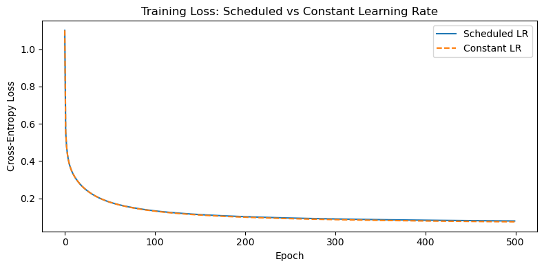

# 소프트맥스 회귀 구현

## 개요

이 절에서는 NumPy만으로 소프트맥스 회귀를 처음부터 구현한다. 소프트맥스 함수, 교차엔트로피
손실, 기울기 계산, 학습 루프까지 파이프라인의 각 구성요소를 단계별로 만든다. 앞 절들의 수학적
공식을 작동하는 코드로 연결하고, scikit-learn과 비교해 정확성을 검증하는 것이 목표다.

---

## 소프트맥스 함수

소프트맥스 함수는 실숫값 로짓 벡터 $\mathbf{z} = (z_1, \ldots, z_C)^\top$를 $C$개 범주에 대한
확률분포로 옮긴다.

$$
\hat{p}_k = \operatorname{softmax}(\mathbf{z})_k = \frac{e^{z_k}}{\sum_{j=1}^{C} e^{z_j}}, \qquad k = 1, \ldots, C
$$

순진한 구현은 `np.exp(z)`를 그대로 계산하지만 로짓이 크면 넘친다. **로그-합-지수 기법**은
소프트맥스의 평행이동 불변성을 이용해 지수화 전에 $\max_k z_k$를 뺀다.

<div class="codebox" markdown>

**예제 1.** 수치적으로 안정한 소프트맥스

```python
import numpy as np

def softmax(z):
    """수치적으로 안정한 소프트맥스.

    가장 큰 값을 빼고 나서 exp 를 씌운다. 지수가 커지면 exp 가 넘쳐
    inf 가 되는데, 모든 항에서 같은 값을 빼면 분자와 분모에서 약분되어
    결과는 그대로이면서 넘침만 막을 수 있다.
    """
    z_shifted = z - np.max(z, axis=1, keepdims=True)
    exp_z = np.exp(z_shifted)
    return exp_z / np.sum(exp_z, axis=1, keepdims=True)
```

</div>

로짓 벡터 $\mathbf{z} = (2, 1, -1)^\top$로 구현을 확인할 수 있다.

<div class="codebox" markdown>

**예제 2.** 로짓에서 확률로

```python
# 로짓의 차이가 확률의 비를 정한다. 2 와 1 의 차이가 1 이므로 첫 확률이
# 둘째의 e 배쯤 된다.
z = np.array([[2.0, 1.0, -1.0]])
print(softmax(z))
# [[0.7054  0.2595  0.0351]]
```

출력:

```
[[0.70538451 0.25949646 0.03511903]]
```

</div>

---

## 교차엔트로피 손실

원-핫 부호화된 이름표 $\mathbf{Y} \in \{0,1\}^{n \times C}$와 예측확률
$\hat{\mathbf{Y}} \in (0,1)^{n \times C}$를 갖는 관측치 $n$개에 대해 교차엔트로피 손실은

$$
J = -\frac{1}{n} \sum_{i=1}^{n} \sum_{c=1}^{C} y_{ic} \log \hat{y}_{ic}
$$

이다. $\mathbf{Y}$의 각 행이 원-핫이므로 참 범주에 해당하는 항만 살아남는다. 작은 상수
$\varepsilon$이 $\log(0)$을 막는다.

<div class="codebox" markdown>

**예제 3.** 교차엔트로피 손실

```python
def cross_entropy_loss(Y, Y_hat, eps=1e-12):
    """평균 교차엔트로피 손실.

    원-핫 이름표를 곱하므로 실제로는 "참 범주에 준 확률의 로그"만 더해진다.
    참 범주에 0 에 가까운 확률을 주면 손실이 무한대로 치솟는다.
    eps 는 로그가 발산하는 것을 막는 안전장치다.

    매개변수
    --------
    Y : (n, C) 원-핫 이름표 행렬
    Y_hat : (n, C) 예측확률 행렬
    """
    n = Y.shape[0]
    return -np.sum(Y * np.log(Y_hat + eps)) / n
```

</div>

!!! warning "$\varepsilon$ 보정은 손실값만 보호한다"
    이 $\varepsilon$ 기법은 `nan`을 막아 주지만 목적함수를 미세하게 바꾼다. 확신에 찬 오답의
    손실이 $-\log(\varepsilon) = 27.6$에서 잘리기 때문이다
    ([가능도 절](../../ch19/logistic_regression/likelihood.md)의 연습문제 4 참조). 학습 자체는
    기울기만 쓰므로 영향을 받지 않지만, 보고되는 손실값은 참값이 아니다. 로짓에서 직접
    log-softmax를 계산하는 편이 정확하다.

---

## 로짓에 대한 손실의 기울기

소프트맥스 회귀에서 가장 우아한 결과 중 하나는, 교차엔트로피 손실의 로짓행렬
$\mathbf{Z} = \mathbf{X}\mathbf{W} + \mathbf{b}^\top$에 대한 기울기가

$$
\frac{\partial J}{\partial \mathbf{Z}} = \frac{1}{n}(\hat{\mathbf{Y}} - \mathbf{Y})
$$

로 단순해진다는 것이다. 즉 각 관측치의 기울기가 예측확률과 원-핫 이름표의 차다. 가중행렬
$\mathbf{W} \in \mathbb{R}^{d \times C}$와 편향 $\mathbf{b} \in \mathbb{R}^C$에 연쇄법칙을
적용하면,

$$
\frac{\partial J}{\partial \mathbf{W}} = \frac{1}{n} \mathbf{X}^\top (\hat{\mathbf{Y}} - \mathbf{Y}), \qquad
\frac{\partial J}{\partial \mathbf{b}} = \frac{1}{n} \sum_{i=1}^{n} (\hat{\mathbf{y}}_i - \mathbf{y}_i)
$$

<div class="codebox" markdown>

**예제 4.** 기울기 계산

```python
def compute_gradients(X, Y, Y_hat):
    """교차엔트로피의 W, b 에 대한 기울기.

    소프트맥스와 교차엔트로피를 함께 쓰면 미분이 Y_hat - Y 라는 아주
    간단한 꼴로 떨어진다. 로지스틱 회귀의 기울기와 같은 모양이며,
    일반화선형모형 전체에서 되풀이되는 구조다.
    """
    n = X.shape[0]
    error = Y_hat - Y                   # (n, C)
    dW = X.T @ error / n                # (d, C)
    db = np.mean(error, axis=0)         # (C,)
    return dW, db
```

</div>

---

## 원-핫 부호화

훈련 이름표 $y_i \in \{0, 1, \ldots, C-1\}$을 원-핫 벡터로 바꿔야 한다. 이름표가 $y_i = k$이면
원-핫 벡터는 위치 $k$에 1, 나머지에 0을 갖는다.

<div class="codebox" markdown>

**예제 5.** 원-핫 변환

```python
def one_hot(y, C):
    """정수 이름표를 원-핫 행렬로 바꾼다.

    범주에 매긴 번호를 그대로 쓰면 "2가 1보다 크다" 같은 뜻이 없는 순서가
    생긴다. 원-핫은 그 순서를 지운다.
    """
    n = y.shape[0]
    Y = np.zeros((n, C))
    Y[np.arange(n), y] = 1.0
    return Y
```

</div>

---

## 전부 합치기 --- 학습 루프

이제 구성요소들을 모아 완전한 경사하강 학습 루프를 만든다.

<div class="codebox" markdown>

**예제 6.** 붓꽃 자료로 학습하기

```python
from sklearn.datasets import load_iris
from sklearn.model_selection import train_test_split
from sklearn.preprocessing import StandardScaler

# --- 자료 준비 ---
iris = load_iris()
X, y = iris.data, iris.target
C = len(np.unique(y))

X_train, X_test, y_train, y_test = train_test_split(
    X, y, test_size=0.3, random_state=42)

# 표준화는 훈련자료로만 적합하고 시험자료에는 변환만 적용한다. 시험자료의
# 평균과 표준편차까지 보고 맞추면 정보가 새어 들어간다.
scaler = StandardScaler()
X_train = scaler.fit_transform(X_train)
X_test = scaler.transform(X_test)

Y_train = one_hot(y_train, C)
Y_test = one_hot(y_test, C)

# --- 모수 초기화 ---
d = X_train.shape[1]
np.random.seed(0)
W = np.random.randn(d, C) * 0.01
b = np.zeros(C)

# --- 학습 ---
# 전체 자료로 한 번에 기울기를 구하는 순수 경사하강법이다. 자료가 105건뿐이라
# 묶음으로 나눌 까닭이 없다.
lr = 0.5
epochs = 200
loss_history = []

for epoch in range(epochs):
    Z = X_train @ W + b                 # 로짓 (n, C)
    Y_hat = softmax(Z)                  # 확률 (n, C)
    loss = cross_entropy_loss(Y_train, Y_hat)
    loss_history.append(loss)
    dW, db = compute_gradients(X_train, Y_train, Y_hat)
    W -= lr * dW
    b -= lr * db

print(f"Final training loss: {loss_history[-1]:.4f}")
```

출력:

```
Final training loss: 0.1326
```

</div>

최종 훈련 손실은 $0.1326$이다.

---

## 평가

학습 후 검정자료에 대한 예측을 계산하고 정확도를 보고한다.

<div class="codebox" markdown>

**예제 7.** 시험 정확도

```python
# 시험자료에서의 정확도. 가장 큰 확률을 가진 범주를 고른다.
Z_test = X_test @ W + b
Y_hat_test = softmax(Z_test)
y_pred = np.argmax(Y_hat_test, axis=1)
accuracy = np.mean(y_pred == y_test)
print(f"Test accuracy: {accuracy:.4f}")
```

출력:

```
Test accuracy: 1.0000
```

</div>

이 분할에서 검정 정확도는 $1.0000$이다. 검정자료가 45개뿐이고 붓꽃 자료의 세 품종이 잘
분리되어 있어 완벽한 분류가 드물지 않다. 다만 45개에서의 $100\%$는 참 정확도가 $100\%$라는
뜻이 아니다. 95% 신뢰구간(윌슨 구간)은 대략 $[92\%,\ 100\%]$로 여전히 넓다.

---

## scikit-learn과의 검증

직접 만든 구현을 scikit-learn의 `LogisticRegression`(다범주 문제에서 소프트맥스를 사용)과
비교하면 유용한 검산이 된다.

<div class="codebox" markdown>

**예제 8.** sklearn 과 맞춰 보기

```python
from sklearn.linear_model import LogisticRegression

# sklearn 과 맞춰 본다. 직접 구현한 것과 비슷하게 나오면 제대로 짠 것이다.
clf = LogisticRegression(solver='lbfgs', max_iter=1000)
clf.fit(X_train, y_train)
print(f"scikit-learn accuracy: {clf.score(X_test, y_test):.4f}")
```

출력:

```
scikit-learn accuracy: 1.0000
```

</div>

scikit-learn도 $1.0000$을 내어 두 구현이 일치한다.

!!! note "`multi_class='multinomial'`은 더 이상 필요하지 않다"
    예전 코드에서는 `LogisticRegression(multi_class='multinomial', ...)`처럼 명시하는 것이
    관례였다. 그러나 scikit-learn 0.22부터 기본값 `multi_class='auto'`가
    `solver='liblinear'`가 아닌 한 다항 방식을 고르고, 이 인자는 1.5에서 폐기 예고되어
    1.7에서 제거되었다. 최신 버전에서는 인자를 아예 쓰지 않는 것이 맞다.

---

## 해석

소프트맥스 회귀 구현에서 몇 가지 중요한 점이 드러난다.

1. **수치적 안정성이 중요하다.** 로그-합-지수 기법이 없으면 큰 로짓에서 오버플로가 발생해
   `nan`이 나온다. 이론적 세련됨이 아니라 실용적 필수 조건이다.
2. **기울기가 깔끔한 형태다.** $\partial J / \partial \mathbf{Z} = (\hat{\mathbf{Y}} - \mathbf{Y}) / n$
   덕분에 구현이 단순하고 효율적이다. 소프트맥스를 따로 미분할 필요가 없다.
3. **특성 척도화가 결정적이다.** 표준화하면 모든 차원이 로짓에 동등하게 기여하고 학습률이
   특성 전반에 균일하게 작동한다.
4. **소프트맥스 회귀는 선형 분류기다.** 소프트맥스 변환이 비선형임에도 결정경계는 특성공간의
   초평면이다. 명시적인 특성공학 없이는 비선형 관계를 포착할 수 없다.

---

## 연습문제

<div class="drillbox" markdown>

**연습문제 1.** <span class="diff hard" title="어려움"></span>
교차엔트로피 손실 $J = -\frac{1}{n}\sum_i \sum_c y_{ic}\log\hat{y}_{ic}$과 소프트맥스 정의
$\hat{y}_{ic} = e^{z_{ic}} / \sum_{j} e^{z_{ij}}$에서 출발하여, 관측치 $i$ 하나에 대해
$\partial J / \partial z_{ik} = (\hat{y}_{ik} - y_{ik})/n$을 유도하라.

</div>

??? success "풀이"
    관측치 $i$를 고정하고 명확성을 위해 $1/n$ 인자를 잠시 뺀다. 이 관측치의 손실은

    $$
    \ell_i = -\sum_c y_{ic} \log \hat{y}_{ic}
    $$

    이다. 소프트맥스 야코비는
    $\partial \hat{y}_{ic} / \partial z_{ik} = \hat{y}_{ic}(\delta_{ck} - \hat{y}_{ik})$이고
    $\delta_{ck}$는 크로네커 델타다. 연쇄법칙을 적용하면

    $$
    \frac{\partial \ell_i}{\partial z_{ik}} = -\sum_c y_{ic} \frac{1}{\hat{y}_{ic}} \cdot \hat{y}_{ic}(\delta_{ck} - \hat{y}_{ik})
    = -\sum_c y_{ic}(\delta_{ck} - \hat{y}_{ik})
    $$

    이고, 전개하면

    $$
    = -y_{ik} + \hat{y}_{ik}\sum_c y_{ic} = -y_{ik} + \hat{y}_{ik} \cdot 1 = \hat{y}_{ik} - y_{ik}
    $$

    이다. 여기서 $\sum_c y_{ic} = 1$(원-핫)을 썼다. $1/n$ 인자를 포함하면
    $\partial J / \partial z_{ik} = (\hat{y}_{ik} - y_{ik})/n$이다. $\square$

<div class="drillbox" markdown>

**연습문제 2.** <span class="diff med" title="중간"></span>
$L_2$ 정칙화 판본의 학습 루프를 구현하라. 손실에 벌점항 $\frac{\lambda}{2}\|\mathbf{W}\|_F^2$을
더하고 기울기를 그에 맞게 수정하라. $\lambda = 0.1$로 붓꽃 자료에서 학습하고 벌점 없는 판본과
검정 정확도를 비교하라.

</div>

??? success "풀이"
    정칙화 손실은

    $$
    J_{\text{reg}} = J + \frac{\lambda}{2}\|\mathbf{W}\|_F^2
    $$

    이고 $\mathbf{W}$에 대한 기울기에 항이 하나 더 붙는다.

    $$
    \frac{\partial J_{\text{reg}}}{\partial \mathbf{W}} = \frac{1}{n}\mathbf{X}^\top(\hat{\mathbf{Y}} - \mathbf{Y}) + \lambda \mathbf{W}
    $$

    편향 기울기는 그대로다(편향은 정칙화하지 않는다).

    ```python
    lam = 0.1
    np.random.seed(0)
    W_reg = np.random.randn(d, C) * 0.01
    b_reg = np.zeros(C)

    for epoch in range(200):
        Z = X_train @ W_reg + b_reg
        Y_hat = softmax(Z)
        loss = cross_entropy_loss(Y_train, Y_hat) + 0.5 * lam * np.sum(W_reg ** 2)
        dW, db = compute_gradients(X_train, Y_train, Y_hat)
        dW += lam * W_reg       # regularization gradient
        W_reg -= lr * dW
        b_reg -= lr * db

    y_pred_reg = np.argmax(softmax(X_test @ W_reg + b_reg), axis=1)
    print(f"Regularized accuracy: {np.mean(y_pred_reg == y_test):.4f}")
    ```

    출력:

    ```
    Regularized accuracy: 0.8889
    ```

    **결과: 정칙화 정확도는 $0.8889$로, 벌점 없는 $1.0000$보다 오히려 나쁘다.**

    이는 정칙화가 언제나 도움이 된다는 통념에 대한 좋은 반례다. 붓꽃 자료는 $n = 105$,
    $d = 4$, $C = 3$으로 모수가 15개뿐이고 범주가 잘 분리되어 있다. 즉 **과적합할 여지가
    애초에 거의 없다.** 이런 상황에서 $\lambda = 0.1$은 지나치게 강해 편향만 늘린다.

    구체적으로, 벌점 항의 기울기 $\lambda\mathbf{W}$가 자료의 기울기와 균형을 이루는 지점에서
    가중치가 멈추는데, 그 지점이 최적 결정경계에 도달하기 전이다. 200회 반복 안에서는 이 문제가
    더 두드러진다.

    **교훈:** $\lambda$는 반드시 교차검증으로 골라야 한다. "정칙화를 넣으면 좋아지겠지"라는
    기대로 임의의 값을 쓰면 이렇게 성능이 떨어진다. 정칙화의 이득은 $d$가 $n$에 비해 크거나
    특성에 잡음이 많을 때 나타난다. $\square$

<div class="drillbox" markdown>

**연습문제 3.** <span class="diff med" title="중간"></span>
소프트맥스는 평행이동 불변이다:
$\operatorname{softmax}(\mathbf{z} + c\mathbf{1}) = \operatorname{softmax}(\mathbf{z})$.
$\mathbf{z} = (1000, 1001, 999)^\top$에 대해 최댓값을 빼는 기법을 쓴 경우와 쓰지 않은 경우의
소프트맥스를 각각 계산하여, 순진한 판본이 `nan`을 내고 안정적인 판본은 그렇지 않음을 보이는
NumPy 실험을 작성하라.

</div>

??? success "풀이"
    ```python
    z = np.array([[1000.0, 1001.0, 999.0]])

    # Naive softmax (no shift)
    exp_z_naive = np.exp(z)
    softmax_naive = exp_z_naive / np.sum(exp_z_naive, axis=1, keepdims=True)
    print("Naive:", softmax_naive)
    # Output: [[nan nan nan]]  (because np.exp(1001) = inf)

    # Stable softmax (max subtraction)
    print("Stable:", softmax(z))
    # Output: [[0.2447  0.6652  0.0900]]
    ```

    출력:

    ```
    Naive: [[nan nan nan]]
    Stable: [[0.24472847 0.66524096 0.09003057]]
    ```

    순진한 판본은 $e^{1001}$이 float64의 최댓값($\approx 1.8 \times 10^{308}$)을 넘어 넘친다.
    안정적인 판본은 $\max(\mathbf{z}) = 1001$을 빼서 $e^{-1}, e^{0}, e^{-2}$를 계산하므로
    모두 안전하다. 평행이동 불변성에 의해 수학적 결과는 동일하다.

    실행하면 실제로 `RuntimeWarning: overflow encountered in exp`와
    `invalid value encountered in divide` 경고가 뜨고 결과가 `[[nan nan nan]]`이 된다.
    NumPy는 예외를 던지지 않고 경고만 내므로, 경고를 무시하도록 설정된 환경에서는 이 오류가
    조용히 지나갈 수 있다는 점에 유의하라.

<div class="drillbox" markdown>

**연습문제 4.** <span class="diff hard" title="어려움"></span>
소프트맥스 회귀에서 범주 $j$와 $k$ 사이의 결정경계가 초평면임을 증명하라. 즉 집합
$\{\mathbf{x} : \hat{p}_j(\mathbf{x}) = \hat{p}_k(\mathbf{x})\}$가 $\mathbb{R}^d$의
$(d-1)$차원 아핀 부분공간임을 보여라.

</div>

??? success "풀이"
    예측확률은 $\hat{p}_c(\mathbf{x}) = \operatorname{softmax}(\mathbf{W}\mathbf{x} + \mathbf{b})_c$
    이다. $\hat{p}_j = \hat{p}_k$로 놓으면

    $$
    \frac{e^{\mathbf{w}_j^\top \mathbf{x} + b_j}}{\sum_m e^{\mathbf{w}_m^\top \mathbf{x} + b_m}}
    = \frac{e^{\mathbf{w}_k^\top \mathbf{x} + b_k}}{\sum_m e^{\mathbf{w}_m^\top \mathbf{x} + b_m}}
    $$

    이고, 분모가 소거되어
    $e^{\mathbf{w}_j^\top \mathbf{x} + b_j} = e^{\mathbf{w}_k^\top \mathbf{x} + b_k}$가 된다.
    로그를 취하면

    $$
    \mathbf{w}_j^\top \mathbf{x} + b_j = \mathbf{w}_k^\top \mathbf{x} + b_k
    $$

    이고 정리하면

    $$
    (\mathbf{w}_j - \mathbf{w}_k)^\top \mathbf{x} + (b_j - b_k) = 0
    $$

    이다. 이는 법선벡터가 $\mathbf{w}_j - \mathbf{w}_k$이고 상수항이 $b_j - b_k$인 초평면의
    방정식이다. $\mathbf{w}_j \neq \mathbf{w}_k$인 한 이는 $(d-1)$차원 아핀 부분공간을 정의한다.

    **주의할 점:** 이 집합은 "두 범주의 확률이 같은 곳"이지 **결정경계 자체가 아니다.**
    실제 결정경계는 $\hat p_j$와 $\hat p_k$가 **동시에 최대**인 곳이므로, 위 초평면의 일부만
    실제 경계가 된다. 세 번째 범주 $m$이 그 초평면 위 어딘가에서 $\hat p_m$을 더 크게 만들면
    그 부분은 경계가 아니다. 그래서 소프트맥스의 결정영역은 초평면들이 잘라 만드는 **볼록
    다면체**가 되고, 두 범주 사이의 실제 경계는 초평면의 다면체 조각이다. $\square$

<div class="drillbox" markdown>

**연습문제 5.** <span class="diff med" title="중간"></span>
50 에포크마다 학습률에 감쇠인자 $\gamma = 0.95$를 곱하는 학습률 일정을 구현하라. 초기 학습률
$\eta_0 = 1.0$으로 붓꽃 자료에서 500 에포크 학습하고, 훈련 손실 곡선을 고정 학습률 판본과
비교하라.

</div>

??? success "풀이"
    ```python
    import matplotlib.pyplot as plt

    np.random.seed(0)
    W_sched = np.random.randn(d, C) * 0.01
    b_sched = np.zeros(C)
    W_const = W_sched.copy()
    b_const = b_sched.copy()

    eta0 = 1.0
    gamma = 0.95
    total_epochs = 500
    loss_sched, loss_const = [], []

    for epoch in range(total_epochs):
        # Scheduled learning rate
        lr_t = eta0 * (gamma ** (epoch // 50))

        # --- Scheduled ---
        Z = X_train @ W_sched + b_sched
        Yh = softmax(Z)
        loss_sched.append(cross_entropy_loss(Y_train, Yh))
        dW, db = compute_gradients(X_train, Y_train, Yh)
        W_sched -= lr_t * dW
        b_sched -= lr_t * db

        # --- Constant ---
        Z = X_train @ W_const + b_const
        Yh = softmax(Z)
        loss_const.append(cross_entropy_loss(Y_train, Yh))
        dW, db = compute_gradients(X_train, Y_train, Yh)
        W_const -= eta0 * dW
        b_const -= eta0 * db

    fig, ax = plt.subplots(figsize=(8, 4))
    ax.plot(loss_sched, label="Scheduled LR")
    ax.plot(loss_const, label="Constant LR", linestyle="--")
    ax.set_xlabel("Epoch")
    ax.set_ylabel("Cross-Entropy Loss")
    ax.set_title("Training Loss: Scheduled vs Constant Learning Rate")
    ax.legend()
    plt.tight_layout()
    plt.show()
    ```

    

    일정을 적용한 판본은 후반 에포크에서 더 매끄럽게 수렴하는 경향이 있다. 학습률을 크게
    고정하면 손실이 최소점 근처에서 정착하지 못하고 진동할 수 있다. 감쇠 일정은 시간이
    지날수록 보폭을 줄여 최적점 근처에서 더 미세한 단계를 밟게 한다. 붓꽃처럼 잘 정돈된
    자료에서는 두 판본의 최종 정확도가 비슷하지만, 일정을 적용한 쪽의 손실 곡선이 더
    안정적이다.

    !!! note "감쇠 일정이 항상 낫지는 않다"
        500 에포크 동안 $\gamma = 0.95$를 10번 적용하면 최종 학습률이
        $1.0 \times 0.95^{9} = 0.63$으로, 초기값의 63%에 불과하다. 감쇠가 이 정도로 완만하면
        차이가 거의 없다. 반대로 감쇠를 너무 빠르게 하면 최적점에 닿기 전에 학습률이 0에
        가까워져 **과소적합**한다. 수렴 보장을 위한 고전적 조건은
        $\sum_t \eta_t = \infty$이고 $\sum_t \eta_t^2 < \infty$인데, 지수 감쇠는 첫 조건을
        만족하지 못한다(등비급수는 수렴한다). 이론적으로는 $\eta_t = \eta_0/t$나
        $\eta_0/\sqrt{t}$가 안전한 선택이다. $\square$

---

## 정리하며

NumPy 만으로 **처음부터 구현**했다.

- **네 부품이면 된다.** 소프트맥스, 교차엔트로피, 기울기, 학습 루프.
- **로그-합-지수를 반드시 쓴다.** 최댓값을 빼지 않으면 로짓이 조금만 커져도 `exp` 가 넘친다. **구현에서 가장 흔한 실패 지점이다.**
- **기울기를 수치미분으로 검산한다.** 해석적 기울기와 유한차분이 맞는지 확인하는 것이 표준 절차이며, 역전파 구현의 버그를 잡아낸다.
- **학습률이 수렴을 좌우한다.** 너무 크면 발산하고 작으면 느리며, 손실 곡선을 그려 확인한다.
- **`sklearn` 과 대조한다.** 같은 자료에서 비슷한 정확도가 나오면 구현이 맞다는 신호다.

다음 절부터 **평가와 사례**로 넘어간다.
