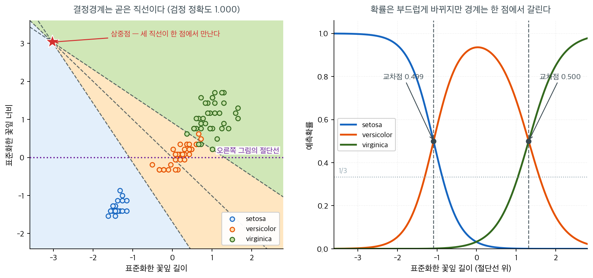
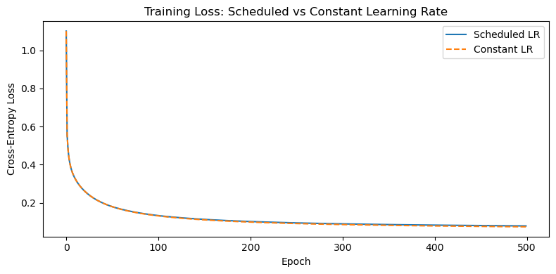

# 소프트맥스 회귀 구현

## 개요

이 절에서는 NumPy만으로 소프트맥스 회귀를 처음부터 구현한다. 소프트맥스 함수, 교차엔트로피
손실, 기울기 계산, 학습 루프까지 파이프라인의 각 구성요소를 단계별로 만든다. 앞 절들의 수학적
공식을 작동하는 코드로 연결하고, scikit-learn과 비교해 정확성을 검증하는 것이 목표다.

---

## 1. 소프트맥스 함수

소프트맥스 함수는 실숫값 로짓 벡터 $\mathbf{z} = (z_1, \ldots, z_C)^\top$를 $C$개 범주에 대한
확률분포로 옮긴다.

$$
\hat{p}_k = \operatorname{softmax}(\mathbf{z})_k = \frac{e^{z_k}}{\sum_{j=1}^{C} e^{z_j}}, \qquad k = 1, \ldots, C
$$

순진한 구현은 `np.exp(z)`를 그대로 계산하지만 로짓이 크면 넘친다. **로그-합-지수 기법**은
소프트맥스의 평행이동 불변성을 이용해 지수화 전에 $\max_k z_k$를 뺀다.

<div class="exbox" markdown>

**보기 1.** <span class="diff easy" title="쉬움"></span> 수치적으로 안정한 소프트맥스

**(1)** 최댓값을 빼도 결과가 바뀌지 않는 까닭을 보이시오. 왜 **행마다 따로** 빼야 하는가.

**(2)** `keepdims=True`를 빼면 어떻게 되는가. 입력이 **정사각 행렬**일 때 특히 조심해야 하는 이유를 수로 보이시오.

</div>

??? success "풀이"

    **(1) 평행이동 불변성.** 임의의 스칼라 $\alpha$에 대해

    $$
    \operatorname{softmax}(\mathbf{z} - \alpha\mathbf{1})_k
    = \frac{e^{z_k - \alpha}}{\sum_j e^{z_j - \alpha}}
    = \frac{e^{-\alpha}e^{z_k}}{e^{-\alpha}\sum_j e^{z_j}}
    = \operatorname{softmax}(\mathbf{z})_k
    $$

    로 $e^{-\alpha}$가 약분된다. 그러므로 $\alpha = \max_k z_k$로 두어도 답은 그대로이고, 가장 큰 지수가 $e^0 = 1$이 되어 넘침만 사라진다.

    여기서 결정적인 것은 **$\alpha$가 그 행 안에서는 모든 성분에 똑같이 적용되어야 한다**는 점이다. 약분이 일어나려면 분자와 분모의 모든 항이 같은 $e^{-\alpha}$를 가져야 하기 때문이다. 행마다 $\alpha$가 달라지는 것은 상관없다. 소프트맥스가 행마다 따로 계산되므로 각 행이 자기 $\alpha$를 쓰면 된다. 반대로 **열마다 다른 값을 빼면** 한 행 안에서 성분별로 다른 수를 빼는 것이 되어 약분이 깨지고, 답이 달라진다.

    **(2) `keepdims`의 역할.** `np.max(z, axis=1)`은 모양이 $(n,)$이고 `keepdims=True`를 주면 $(n, 1)$이다. 넘파이는 뒤축부터 맞추어 퍼뜨리므로

    - $(n, C) - (n, 1)$: 둘째 축이 $1$이라 늘어나 **행마다** 빼진다. 옳다.
    - $(n, C) - (n,)$: $(n,)$을 $(1, n)$으로 보고 $C$와 $n$을 맞추려 한다. $C \ne n$이면 `ValueError`로 **곧바로 들킨다.**
    - $(n, n) - (n,)$: 모양이 맞아 **오류 없이 통과한다.** 그런데 이때 빼지는 것은 열마다 다른 값이므로 (1)에서 본 약분이 깨진다. **조용히 틀린 답이 나온다.**

    ```python
    import numpy as np

    def softmax(z):
        """수치적으로 안정한 소프트맥스.

        가장 큰 값을 빼고 나서 exp 를 씌운다. 지수가 커지면 exp 가 넘쳐
        inf 가 되는데, 모든 항에서 같은 값을 빼면 분자와 분모에서 약분되어
        결과는 그대로이면서 넘침만 막을 수 있다.
        """
        z_shifted = z - np.max(z, axis=1, keepdims=True)
        exp_z = np.exp(z_shifted)
        return exp_z / np.sum(exp_z, axis=1, keepdims=True)

    # 하필 3x3 인 로짓. keepdims 를 빠뜨려도 오류가 나지 않는다.
    Z = np.array([[2.0, 1.0, -1.0],
                  [0.0, 3.0,  1.0],
                  [5.0, 5.0,  5.0]])

    good = softmax(Z)
    shift_wrong = np.exp(Z - np.max(Z, axis=1))
    bad = shift_wrong / np.sum(shift_wrong, axis=1, keepdims=True)

    print("keepdims=True :\n", np.round(good, 6))
    print("keepdims 뺀 것:\n", np.round(bad, 6))
    print("틀린 쪽의 행 합", bad.sum(axis=1), "  두 결과가 같은가", np.allclose(good, bad))

    # 정사각이 아니면 그 자리에서 오류가 난다.
    try:
        Zr = np.array([[2.0, 1.0, -1.0], [0.0, 3.0, 1.0]])
        np.exp(Zr - np.max(Zr, axis=1))
    except ValueError as e:
        print("정사각이 아니면:", type(e).__name__, e)
    ```

    출력:

    ```
    keepdims=True :
     [[0.705385 0.259496 0.035119]
     [0.04201  0.843795 0.114195]
     [0.333333 0.333333 0.333333]]
    keepdims 뺀 것:
     [[0.878878 0.118943 0.002179]
     [0.11731  0.866813 0.015876]
     [0.705385 0.259496 0.035119]]
    틀린 쪽의 행 합 [1. 1. 1.]  두 결과가 같은가 False
    정사각이 아니면: ValueError operands could not be broadcast together with shapes (2,3) (2,)
    ```

    **이 버그가 왜 무서운지가 여기 있다.** 틀린 결과도 행 합이 모두 정확히 $1$이다. 비음성도 만족하고 합도 $1$이니 **확률벡터로서는 흠잡을 데가 없다.** 그런데 값은 전혀 다르다. 셋째 행이 특히 선명하다. 로짓이 $(5,5,5)$로 완전히 대칭이라 답은 반드시 $(1/3, 1/3, 1/3)$이어야 하는데, 틀린 쪽은 $(0.705, 0.259, 0.035)$를 내놓는다. 그 값이 하필 첫째 행의 답과 똑같다는 것도 우연이 아니다. 열별 최댓값 $(5, 5, 5)$를 모든 행에서 빼 버렸기 때문이다.

    비정사각 입력에서는 `ValueError`가 즉시 나므로 오히려 안전하다. **위험한 것은 $n = C$가 되는 때**이고, 범주 수와 묶음 크기를 같게 잡는 일은 작은 실험에서 드물지 않다.

로짓 벡터 $\mathbf{z} = (2, 1, -1)^\top$로 구현을 확인할 수 있다.

<div class="exbox" markdown>

**보기 2.** <span class="diff easy" title="쉬움"></span> 로짓에서 확률로. $\mathbf{z} = (2, 1, -1)^\top$를 넣는다.

**(1)** 세 확률을 손으로 구하시오.

**(2)** 주석은 "$2$와 $1$의 차이가 $1$이므로 첫 확률이 둘째의 $e$배쯤 된다"고 말한다. **"쯤"이 맞는 말인가.** 확률의 비가 무엇으로 정해지는지 밝히고 수로 확인하시오.

</div>

??? success "풀이"

    **(1) 손으로.** 지수를 계산하면

    $$
    e^2 = 7.389056,
    \qquad
    e^1 = 2.718282,
    \qquad
    e^{-1} = 0.367879
    $$

    이고 합이 $10.475217$이다. 따라서

    $$
    \hat p_1 = \frac{7.389056}{10.475217} = 0.705385,
    \quad
    \hat p_2 = \frac{2.718282}{10.475217} = 0.259496,
    \quad
    \hat p_3 = \frac{0.367879}{10.475217} = 0.035119
    $$

    이다.

    **(2) "쯤"이 아니라 정확히 $e$배다.** 두 확률의 비를 보면 분모가 통째로 약분되어

    $$
    \frac{\hat p_j}{\hat p_k}
    = \frac{e^{z_j} / \sum_m e^{z_m}}{e^{z_k} / \sum_m e^{z_m}}
    = e^{z_j - z_k}
    $$

    가 된다. **확률의 비는 오직 두 로짓의 차이만으로 정해지며, 다른 범주가 무엇이든 전혀 끼어들지 않는다.** 그러므로

    $$
    \frac{\hat p_1}{\hat p_2} = e^{2-1} = e = 2.718282,
    \qquad
    \frac{\hat p_2}{\hat p_3} = e^{1-(-1)} = e^2 = 7.389056
    $$

    이고 근삿값이 아니라 **등식**이다. 로그로 쓰면 $\log(\hat p_j/\hat p_k) = z_j - z_k$로, **로짓의 차가 곧 로그오즈비**다. 이범주 로지스틱 회귀에서 계수를 로그오즈비로 읽던 해석이 그대로 이어진다.

    여기에 소프트맥스 회귀의 한 가지 성질이 들어 있다. 범주 $3$을 자료에서 빼더라도 $\hat p_1 : \hat p_2$는 $e : 1$ 그대로다. 선택이론에서 **무관한 대안으로부터의 독립**(IIA)이라 부르는 성질이며, 편리하기도 하고 때로는 모형의 한계이기도 하다.

    ```python
    # 로짓의 차이가 확률의 비를 정한다. 2 와 1 의 차이가 1 이므로 첫 확률이
    # 둘째의 e 배쯤 된다.
    z = np.array([[2.0, 1.0, -1.0]])
    print(softmax(z))
    # [[0.7054  0.2595  0.0351]]

    p = softmax(z)[0]
    print(f"분모 e^2 + e + e^-1 = {np.exp(2) + np.exp(1) + np.exp(-1):.6f}")
    print(f"p1/p2 = {p[0] / p[1]:.9f}   e   = {np.e:.9f}")
    print(f"p2/p3 = {p[1] / p[2]:.9f}   e^2 = {np.e**2:.9f}")
    ```

    출력:

    ```
    [[0.70538451 0.25949646 0.03511903]]
    분모 e^2 + e + e^-1 = 10.475217
    p1/p2 = 2.718281828   e   = 2.718281828
    p2/p3 = 7.389056099   e^2 = 7.389056099
    ```

    손으로 구한 세 확률이 그대로 나오고, 두 비가 $e$와 $e^2$와 **아홉 자리까지 같다.** 주석의 "$e$배쯤"은 사실 "정확히 $e$배"다.

---

## 2. 교차엔트로피 손실

원-핫 부호화된 이름표 $\mathbf{Y} \in \{0,1\}^{n \times C}$와 예측확률
$\hat{\mathbf{Y}} \in (0,1)^{n \times C}$를 갖는 관측치 $n$개에 대해 교차엔트로피 손실은

$$
J = -\frac{1}{n} \sum_{i=1}^{n} \sum_{c=1}^{C} y_{ic} \log \hat{y}_{ic}
$$

이다. $\mathbf{Y}$의 각 행이 원-핫이므로 참 범주에 해당하는 항만 살아남는다. 작은 상수
$\varepsilon$이 $\log(0)$을 막는다.

<div class="exbox" markdown>

**보기 3.** <span class="diff easy" title="쉬움"></span> 교차엔트로피 손실

**(1)** $\mathbf{Y}$가 원-핫이면 이 식이 무엇으로 줄어드는가. **완벽한 예측**, **균등 예측**, **가장 나쁜 예측**에서의 값을 각각 구하시오.

**(2)** $\varepsilon = 10^{-12}$이 손실에 씌우는 **상한**은 얼마인가. 완벽한 예측에서는 손실이 정확히 $0$이 되는가.

</div>

??? success "풀이"

    **(1) 원-핫이면 한 항만 남는다.** 관측치 $i$의 참 범주를 $c_i$라 하면 $y_{ic} = \mathbf{1}\{c = c_i\}$이므로 안쪽 합에서 한 항만 살아남아

    $$
    J = -\frac{1}{n}\sum_{i=1}^{n} \log \hat y_{i c_i}
    $$

    가 된다. **참 범주에 준 확률의 로그를 평균한 것에 음수를 붙인 값**이며, 다른 범주에 확률을 어떻게 나누어 주었는지는 전혀 보지 않는다.

    세 가지 경우를 재어 본다.

    | 예측 | $\hat y_{ic_i}$ | $J$ | $C = 3$에서 |
    |:---|:---:|:---:|:---:|
    | 완벽 | $1$ | $-\log 1 = 0$ | $0$ |
    | 균등 | $1/C$ | $\log C$ | $1.098612$ |
    | 가장 나쁨 | $0$ | $+\infty$ | $\varepsilon$에 잘려 $27.631$ |

    **$\log C$가 기준선이다.** 아무것도 모르는 모형의 손실이 그 값이며, 그보다 크면 모형이 확신을 갖고 틀리는 중이라는 뜻이다. $C = 3$이면 $\log 3 = 1.0986$, $C = 10$이면 $\log 10 = 2.3026$이다.

    **(2) 상한은 $-\log\varepsilon$이다.** 참 범주에 $\hat y = 0$을 주면 참값이 $+\infty$지만 코드가 더하는 $\varepsilon$ 때문에

    $$
    -\log(0 + 10^{-12}) = 12 \log 10 = 27.631021
    $$

    에서 멈춘다. 모든 관측치가 그렇다면 $J$도 $27.631$이다. **$\varepsilon$은 수치적 안전장치인 동시에 손실을 자르는 문턱**이며, 이 쪽의 경고 상자가 말하는 바가 이것이다.

    반대쪽도 공짜가 아니다. 완벽한 예측에서도 $\log(1 + 10^{-12}) = 10^{-12}$이므로

    $$
    J = -\frac{1}{n}\sum_i \log(1 + 10^{-12}) = -10^{-12}
    $$

    로 **아주 조금 음수**가 된다. 교차엔트로피는 원래 음수가 될 수 없으니, 손실 기록에 $-10^{-12}$ 같은 값이 찍히면 놀랄 일이 아니라 이 $\varepsilon$ 탓이다. 크기가 $10^{-12}$라 실무에서는 무해하지만, **$\varepsilon$을 더하는 것이 목적함수를 조금 바꾼다**는 사실은 알고 있어야 한다. 더 깔끔한 길은 확률이 아니라 로짓에서 `log_softmax`를 계산하는 것이다.

    ```python
    def cross_entropy_loss(Y, Y_hat, eps=1e-12):
        """평균 교차엔트로피 손실.

        원-핫 이름표를 곱하므로 실제로는 "참 범주에 준 확률의 로그"만 더해진다.
        참 범주에 0 에 가까운 확률을 주면 손실이 무한대로 치솟는다.
        eps 는 로그가 발산하는 것을 막는 안전장치다.

        매개변수
        --------
        Y : (n, C) 원-핫 이름표 행렬
        Y_hat : (n, C) 예측확률 행렬
        """
        n = Y.shape[0]
        return -np.sum(Y * np.log(Y_hat + eps)) / n

    Y = np.eye(3)            # 세 관측치의 참 범주가 각각 0, 1, 2
    print(f"완벽      {cross_entropy_loss(Y, Y):.6e}")
    print(f"균등      {cross_entropy_loss(Y, np.full((3, 3), 1 / 3)):.6f}"
          f"   log 3 = {np.log(3):.6f}")
    print(f"가장 나쁨 {cross_entropy_loss(Y, 1 - Y):.6f}"
          f"   -log(1e-12) = {-np.log(1e-12):.6f}")
    ```

    출력:

    ```
    완벽      -1.000089e-12
    균등      1.098612   log 3 = 1.098612
    가장 나쁨 27.631021   -log(1e-12) = 27.631021
    ```

    예고한 세 값이 모두 맞는다. 균등 예측이 정확히 $\log 3 = 1.098612$, 최악이 $27.631021$, 그리고 완벽한 예측이 $0$이 아니라 $-1.000089 \times 10^{-12}$다.

!!! warning "$\varepsilon$ 보정은 손실값만 보호한다"
    이 $\varepsilon$ 기법은 `nan`을 막아 주지만 목적함수를 미세하게 바꾼다. 확신에 찬 오답의
    손실이 $-\log(\varepsilon) = 27.6$에서 잘리기 때문이다
    ([가능도 절](../../ch19/logistic_regression/likelihood.md)의 연습문제 5 참조). 학습 자체는
    기울기만 쓰므로 영향을 받지 않지만, 보고되는 손실값은 참값이 아니다. 로짓에서 직접
    log-softmax를 계산하는 편이 정확하다.

---

## 3. 로짓에 대한 손실의 기울기

소프트맥스 회귀에서 가장 우아한 결과 중 하나는, 교차엔트로피 손실의 로짓행렬
$\mathbf{Z} = \mathbf{X}\mathbf{W} + \mathbf{b}^\top$에 대한 기울기가

$$
\frac{\partial J}{\partial \mathbf{Z}} = \frac{1}{n}(\hat{\mathbf{Y}} - \mathbf{Y})
$$

로 단순해진다는 것이다. 즉 각 관측치의 기울기가 예측확률과 원-핫 이름표의 차다. 가중행렬
$\mathbf{W} \in \mathbb{R}^{d \times C}$와 편향 $\mathbf{b} \in \mathbb{R}^C$에 연쇄법칙을
적용하면,

$$
\frac{\partial J}{\partial \mathbf{W}} = \frac{1}{n} \mathbf{X}^\top (\hat{\mathbf{Y}} - \mathbf{Y}), \qquad
\frac{\partial J}{\partial \mathbf{b}} = \frac{1}{n} \sum_{i=1}^{n} (\hat{\mathbf{y}}_i - \mathbf{y}_i)
$$

<div class="exbox" markdown>

**보기 4.** <span class="diff easy" title="쉬움"></span> 기울기 계산

**(1)** $\partial J/\partial \mathbf{W}$의 **행 합**과 $\partial J/\partial \mathbf{b}$의 **합**이 모두 $0$임을 보이시오. 이것이 소프트맥스의 과모수화와 어떤 관계인가.

**(2)** 수치미분으로 기울기를 검산하고 (1)의 등식을 확인하시오.

</div>

??? success "풀이"

    **(1) 오차행렬의 행 합이 $0$이다.** $\hat{\mathbf{Y}}$의 각 행은 확률이라 합이 $1$이고 $\mathbf{Y}$의 각 행은 원-핫이라 역시 합이 $1$이다. 그러므로 오차행렬 $\mathbf{E} = \hat{\mathbf{Y}} - \mathbf{Y}$에 대해

    $$
    \mathbf{E}\mathbf{1}_C = \hat{\mathbf{Y}}\mathbf{1}_C - \mathbf{Y}\mathbf{1}_C
    = \mathbf{1}_n - \mathbf{1}_n = \mathbf{0}
    $$

    이다. 이것 하나에서 둘이 따라 나온다.

    $$
    \frac{\partial J}{\partial \mathbf{W}}\mathbf{1}_C
    = \frac{1}{n}\mathbf{X}^\top \mathbf{E}\mathbf{1}_C = \mathbf{0},
    \qquad
    \mathbf{1}_C^\top\frac{\partial J}{\partial \mathbf{b}}
    = \frac{1}{n}\mathbf{1}_n^\top \mathbf{E}\mathbf{1}_C = 0
    $$

    곧 **기울기행렬의 행마다 $C$개 성분을 더하면 정확히 $0$이고, 편향 기울기도 더하면 $0$이다.**

    **과모수화와의 관계.** 앞 절에서 보았듯 모든 범주의 가중벡터에 같은 $\mathbf{v}$를 더해도 로짓의 차가 변하지 않아 예측이 똑같다. 곧 $\mathbf{W} \mapsto \mathbf{W} + \mathbf{v}\mathbf{1}_C^\top$ 방향으로 손실이 **완전히 평평**하다. 기울기는 평평한 방향에 성분을 가질 수 없으므로

    $$
    \left\langle \frac{\partial J}{\partial \mathbf{W}},\ \mathbf{v}\mathbf{1}_C^\top \right\rangle
    = \mathbf{v}^\top\!\left(\frac{\partial J}{\partial \mathbf{W}}\mathbf{1}_C\right) = 0
    $$

    이 모든 $\mathbf{v}$에 대해 성립해야 하고, 그것이 바로 위의 등식이다. **행 합이 $0$이라는 것은 과모수화의 다른 말이다.**

    여기서 실용적인 결론이 나온다. 경사하강은 평평한 방향으로 **한 발짝도 움직이지 못하므로**

    $$
    \sum_{c} W_{jc} \quad\text{이 학습 내내 보존된다.}
    $$

    처음에 무작위로 잡은 행 합이 $200$세대 뒤에도 그대로 남는다는 뜻이다. 벌점이 없으면 해가 유일하지 않고, 어느 해에 가는지는 **초기값이 정한다.** $L_2$ 벌점을 걸면 그 방향으로도 기울기가 생겨($\lambda\mathbf{W}$) 행 합이 $0$인 쪽으로 끌려가고 해가 유일해진다. 보기 8에서 scikit-learn의 계수로 이것을 확인한다.

    ```python
    def compute_gradients(X, Y, Y_hat):
        """교차엔트로피의 W, b 에 대한 기울기.

        소프트맥스와 교차엔트로피를 함께 쓰면 미분이 Y_hat - Y 라는 아주
        간단한 꼴로 떨어진다. 로지스틱 회귀의 기울기와 같은 모양이며,
        일반화선형모형 전체에서 되풀이되는 구조다.
        """
        n = X.shape[0]
        error = Y_hat - Y                   # (n, C)
        dW = X.T @ error / n                # (d, C)
        db = np.mean(error, axis=0)         # (C,)
        return dW, db

    def one_hot_tmp(y, C):                  # 보기 5 에서 다시 다룬다
        Y = np.zeros((y.shape[0], C))
        Y[np.arange(y.shape[0]), y] = 1.0
        return Y

    rng = np.random.default_rng(1)
    n, d, C = 7, 4, 3
    X = rng.normal(size=(n, d))
    y = rng.integers(0, C, n)
    Y = one_hot_tmp(y, C)
    W = rng.normal(size=(d, C)) * 0.5
    b = rng.normal(size=C) * 0.5

    dW, db = compute_gradients(X, Y, softmax(X @ W + b))
    print("dW 의 행 합", dW.sum(axis=1))
    print("db 의 합   ", db.sum())

    # 중심차분으로 모든 성분을 검사한다.
    eps, worst = 1e-6, 0.0
    for P, G in ((W, dW), (b, db)):
        for idx in np.ndindex(P.shape):
            o = P[idx]
            P[idx] = o + eps
            lp = cross_entropy_loss(Y, softmax(X @ W + b))
            P[idx] = o - eps
            lm = cross_entropy_loss(Y, softmax(X @ W + b))
            P[idx] = o
            num = (lp - lm) / (2 * eps)
            worst = max(worst, abs(num - G[idx]) / max(abs(num), abs(G[idx]), 1e-12))
    print(f"{W.size + b.size}개 성분 모두 검사,  최대 상대오차 {worst:.2e}")
    ```

    출력:

    ```
    dW 의 행 합 [0.00000000e+00 0.00000000e+00 0.00000000e+00 2.77555756e-17]
    db 의 합    -1.3877787807814457e-17
    15개 성분 모두 검사,  최대 상대오차 9.27e-08
    ```

    **두 가지가 함께 확인된다.** 행 합과 편향 기울기의 합이 $10^{-17}$ 수준, 곧 배정도의 반올림 한계까지 $0$이다. 그리고 $15$개 성분을 모두 중심차분과 맞춰 본 최대 상대오차가 $9.27 \times 10^{-8}$로 통과 기준 안에 든다. 유도한 $\frac1n\mathbf{X}^\top(\hat{\mathbf{Y}} - \mathbf{Y})$가 옳다.

---

## 4. 원-핫 부호화

훈련 이름표 $y_i \in \{0, 1, \ldots, C-1\}$을 원-핫 벡터로 바꿔야 한다. 이름표가 $y_i = k$이면
원-핫 벡터는 위치 $k$에 1, 나머지에 0을 갖는다.

<div class="exbox" markdown>

**보기 5.** <span class="diff easy" title="쉬움"></span> 원-핫 변환

**(1)** `one_hot`이 돌려주는 $\mathbf{Y}$에 대해 $\mathbf{Y}\mathbf{1}_C$, $\mathbf{1}_n^\top\mathbf{Y}$, $\mathbf{Y}^\top\mathbf{Y}$가 각각 무엇인지 적으시오.

**(2)** 이 구현은 이름표를 **검사하지 않는다.** $y_i = C$와 $y_i = -1$이 들어오면 각각 어떻게 되는가. 둘 중 어느 쪽이 더 위험한가.

</div>

??? success "풀이"

    **(1) 세 가지 곱.** $Y_{ic} = \mathbf{1}\{y_i = c\}$이므로

    $$
    \mathbf{Y}\mathbf{1}_C = \mathbf{1}_n,
    \qquad
    \mathbf{1}_n^\top\mathbf{Y} = (n_0, n_1, \ldots, n_{C-1}),
    \qquad
    \mathbf{Y}^\top\mathbf{Y} = \operatorname{diag}(n_0, \ldots, n_{C-1})
    $$

    이다. 차례로 **행마다 정확히 하나의 $1$**, **열 합이 범주별 개수**, 그리고 **서로 다른 두 열의 내적이 $0$**이라는 말이다. 마지막 것은 한 관측치가 두 범주에 동시에 속할 수 없다는 사실의 대수적 표현이고, 원-핫 열들이 서로 직교한다는 뜻이기도 하다.

    번호를 그대로 쓰지 않고 원-핫으로 펼치는 이유가 여기서 보인다. 번호 $0, 1, 2$를 특성으로 쓰면 "$2$와 $0$의 거리가 $2$이고 $1$과 $0$의 거리가 $1$"이라는, 범주에 없던 **순서와 간격**이 생긴다. 원-핫에서는 서로 다른 두 범주의 거리가 언제나 $\sqrt{2}$로 같다.

    **(2) 검사하지 않는다.** `Y[np.arange(n), y] = 1.0`은 넘파이의 자리 지정이라 색인 규칙을 그대로 따른다.

    - $y_i = C$(범위를 넘는 값): 열이 $C$개뿐이므로 `IndexError`가 난다. **시끄럽게 실패하니 안전하다.**
    - $y_i = -1$(음수): 넘파이는 음수 색인을 **뒤에서부터 센다.** $-1$은 마지막 열이므로 아무 오류 없이 범주 $C-1$의 원-핫이 만들어진다. **조용히 틀린다.**

    뒤의 것이 훨씬 위험하다. 결측을 $-1$로 표시하는 관행이 흔한데, 그런 자료를 그대로 넣으면 **모든 결측이 마지막 범주로 둔갑한 채** 학습이 끝까지 돌아간다. `assert y.min() >= 0 and y.max() < C` 한 줄이면 막을 수 있다.

    ```python
    def one_hot(y, C):
        """정수 이름표를 원-핫 행렬로 바꾼다.

        범주에 매긴 번호를 그대로 쓰면 "2가 1보다 크다" 같은 뜻이 없는 순서가
        생긴다. 원-핫은 그 순서를 지운다.
        """
        n = y.shape[0]
        Y = np.zeros((n, C))
        Y[np.arange(n), y] = 1.0
        return Y

    y = np.array([0, 2, 1, 2, 2])
    Y = one_hot(y, 3)
    print(Y)
    print("행 합", Y.sum(axis=1), " 열 합", Y.sum(axis=0),
          " 범주별 개수", np.bincount(y, minlength=3))
    print("Y^T Y =\n", Y.T @ Y)

    print("이름표 -1 을 넣으면:", one_hot(np.array([-1]), 3))
    try:
        one_hot(np.array([3]), 3)
    except IndexError as e:
        print("이름표 3 을 넣으면:", type(e).__name__)
    ```

    출력:

    ```
    [[1. 0. 0.]
     [0. 0. 1.]
     [0. 1. 0.]
     [0. 0. 1.]
     [0. 0. 1.]]
    행 합 [1. 1. 1. 1. 1.]  열 합 [1. 1. 3.]  범주별 개수 [1 1 3]
    Y^T Y =
     [[1. 0. 0.]
     [0. 1. 0.]
     [0. 0. 3.]]
    이름표 -1 을 넣으면: [[0. 0. 1.]]
    이름표 3 을 넣으면: IndexError
    ```

    **(1)의 세 등식이 모두 맞는다.** 행 합이 전부 $1$, 열 합 $(1, 1, 3)$이 범주별 개수와 같고, $\mathbf{Y}^\top\mathbf{Y}$가 그 개수를 대각선에 늘어놓은 행렬이다.

    그리고 (2)가 예고한 비대칭이 그대로다. 이름표 $3$은 `IndexError`로 막히지만 이름표 $-1$은 $(0, 0, 1)$, 곧 **범주 $2$의 원-핫을 아무 말 없이 돌려준다.**

---

## 5. 전부 합치기 --- 학습 루프

이제 구성요소들을 모아 완전한 경사하강 학습 루프를 만든다.

<div class="exbox" markdown>

**보기 6.** <span class="diff easy" title="쉬움"></span> 붓꽃 자료로 학습하기

**(1)** `W = np.random.randn(d, C) * 0.01`, `b = np.zeros(C)`로 출발한다. **첫 세대의 손실**이 얼마여야 하는지 미리 계산하시오.

**(2)** 돌려서 (1)을 확인하고, 보기 4에서 유도한 **행 합의 보존**이 실제로 일어나는지 보시오.

</div>

??? success "풀이"

    **(1) 거의 균등 예측에서 출발한다.** 표준화한 특성은 성분별 표준편차가 $1$이고 $d = 4$이므로, 초기 로짓

    $$
    z_{ic} = \sum_{j=1}^{4} x_{ij}W_{jc}, \qquad W_{jc} \sim 0.01 \times N(0,1)
    $$

    의 표준편차는 대략 $0.01\sqrt{4} = 0.02$다. 편향은 $0$이다. 로짓이 이렇게 $0$ 근처에 모여 있으면 소프트맥스가 거의 균등하게 $(1/3, 1/3, 1/3)$을 주므로, 보기 3의 표에서

    $$
    J_0 \approx \log C = \log 3 = 1.098612
    $$

    가 나와야 한다. 정확히 $\log 3$은 아니다. $\mathbf{W}$가 $0$이 아니므로 작은 **양의** 보정이 붙는다. 로짓이 참 범주 쪽으로 치우칠 이유가 없고 교차엔트로피는 균등점에서 최소이기 때문에, 손실은 $\log 3$보다 **크되 로짓 크기의 제곱 수준**으로만 크다. $O(0.02^2) \sim 10^{-3}$을 예상한다.

    **(2) 행 합의 보존.** 보기 4에서 $\partial J/\partial\mathbf{W}$의 행 합이 $0$임을 보였고, 갱신은 `W -= lr * dW`뿐이다. 그러므로 어떤 세대에서나

    $$
    \sum_c W_{jc}^{(t+1)} = \sum_c W_{jc}^{(t)} - \eta \sum_c \left(\frac{\partial J}{\partial \mathbf{W}}\right)_{jc} = \sum_c W_{jc}^{(t)}
    $$

    로 **행 합이 변하지 않는다.** $200$세대를 돌려도 처음 뽑은 무작위 행 합이 그대로 남아 있어야 한다. 편향도 $\mathbf{b}^{(0)} = \mathbf{0}$에서 출발하므로 합이 영원히 $0$이다.

    ```python
    from sklearn.datasets import load_iris
    from sklearn.model_selection import train_test_split
    from sklearn.preprocessing import StandardScaler

    # --- 자료 준비 ---
    iris = load_iris()
    X, y = iris.data, iris.target
    C = len(np.unique(y))

    X_train, X_test, y_train, y_test = train_test_split(
        X, y, test_size=0.3, random_state=42)

    # 표준화는 훈련자료로만 적합하고 시험자료에는 변환만 적용한다. 시험자료의
    # 평균과 표준편차까지 보고 맞추면 정보가 새어 들어간다.
    scaler = StandardScaler()
    X_train = scaler.fit_transform(X_train)
    X_test = scaler.transform(X_test)

    Y_train = one_hot(y_train, C)
    Y_test = one_hot(y_test, C)

    # --- 모수 초기화 ---
    d = X_train.shape[1]
    np.random.seed(0)
    W = np.random.randn(d, C) * 0.01
    b = np.zeros(C)
    row_sums_0 = W.sum(axis=1).copy()

    # --- 학습 ---
    # 전체 자료로 한 번에 기울기를 구하는 순수 경사하강법이다. 자료가 105건뿐이라
    # 묶음으로 나눌 까닭이 없다.
    lr = 0.5
    epochs = 200
    loss_history = []

    for epoch in range(epochs):
        Z = X_train @ W + b                 # 로짓 (n, C)
        Y_hat = softmax(Z)                  # 확률 (n, C)
        loss = cross_entropy_loss(Y_train, Y_hat)
        loss_history.append(loss)
        dW, db = compute_gradients(X_train, Y_train, Y_hat)
        W -= lr * dW
        b -= lr * db

    print(f"Final training loss: {loss_history[-1]:.4f}")
    print(f"첫 세대 손실 {loss_history[0]:.6f},  log 3 = {np.log(3):.6f},"
          f"  차이 {loss_history[0] - np.log(3):.6f}")
    print(f"손실이 매 세대 줄었는가: {bool(np.all(np.diff(loss_history) < 0))}")
    print(f"W 의 행 합  처음 {np.round(row_sums_0, 8)}")
    print(f"           나중 {np.round(W.sum(axis=1), 8)}")
    print(f"최대 차이 {np.abs(row_sums_0 - W.sum(axis=1)).max():.2e},  b 의 합 {b.sum():.1e}")
    ```

    출력:

    ```
    Final training loss: 0.1326
    첫 세대 손실 1.100430,  log 3 = 1.098612,  차이 0.001817
    손실이 매 세대 줄었는가: True
    W 의 행 합  처음 [0.03142948 0.03131173 0.00695512 0.02008916]
               나중 [0.03142948 0.03131173 0.00695512 0.02008916]
    최대 차이 1.87e-15,  b 의 합 0.0e+00
    ```

    **(1)이 맞는다.** 첫 세대 손실이 $1.100430$으로 $\log 3 = 1.098612$보다 $0.0018$만큼 크다. 예상한 $10^{-3}$ 수준이다. $200$세대를 돌면 $0.1326$까지 내려가고 손실은 한 번도 되오르지 않는다. 학습률 $0.5$가 이 문제에 과하지 않았다는 뜻이다.

    **(2)도 맞는다.** $\mathbf{W}$의 행 합 네 개가 $200$세대 전후로 소수 여덟째 자리까지 같고, 차이가 $1.87 \times 10^{-15}$로 배정도 누적오차 수준이다. **경사하강은 과모수화 방향으로 한 발짝도 가지 않는다.** 그래서 이 $\mathbf{W}$는 "여러 해 가운데 초기값이 고른 하나"이고, 다른 씨앗으로 출발하면 **같은 예측을 주는 다른 계수**가 나온다. 계수 자체를 해석하려면 벌점을 걸어야 한다. 보기 8에서 그 차이를 본다.

---

## 6. 평가

학습 후 검정자료에 대한 예측을 계산하고 정확도를 보고한다.

<div class="exbox" markdown>

**보기 7.** <span class="diff easy" title="쉬움"></span> 시험 정확도

**(1)** $45$개를 모두 맞혀 $\hat p = 1$이 나왔다. 이때 윌슨 $95\%$ 구간의 **아래끝에는 닫힌 꼴이 있다.** 구하시오.

**(2)** 값을 계산해 본문의 "$[92\%,\ 100\%]$"와 맞추고, 정확 이항구간(클로퍼-피어슨)과 견주시오.

</div>

??? success "풀이"

    **(1) 닫힌 꼴.** 윌슨 구간은

    $$
    \frac{\hat p + \dfrac{z^2}{2n} \pm z\sqrt{\dfrac{\hat p(1-\hat p)}{n} + \dfrac{z^2}{4n^2}}}{1 + \dfrac{z^2}{n}}
    $$

    인데, $\hat p = 1$이면 뿌리 안의 첫 항 $\hat p(1-\hat p)/n$이 사라져

    $$
    \sqrt{0 + \frac{z^2}{4n^2}} = \frac{z}{2n}
    $$

    가 된다. 그러면 분자에서 $\pm$의 음부호 쪽이

    $$
    1 + \frac{z^2}{2n} - z \cdot \frac{z}{2n} = 1 + \frac{z^2}{2n} - \frac{z^2}{2n} = 1
    $$

    로 **깨끗하게 $1$만 남는다.** 따라서

    $$
    \text{아래끝} = \frac{1}{1 + z^2/n},
    \qquad
    \text{위끝} = \frac{1 + z^2/n}{1 + z^2/n} = 1
    $$

    이다. $n = 45$, $z = 1.959964$를 넣으면 $z^2 = 3.841459$이고

    $$
    \frac{1}{1 + 3.841459/45} = \frac{1}{1.0853658} = 0.921348
    $$

    이다. **구간은 $[0.9213,\ 1]$이다.** 본문의 "대략 $[92\%,\ 100\%]$"가 이 수를 가리킨다.

    식 $1/(1 + z^2/n)$은 기억해 둘 만하다. 모두 맞혔을 때의 보수적인 아래끝이 **표본 크기만으로** 정해진다는 뜻이기 때문이다. $n = 10$이면 $0.7225$, $n = 100$이면 $0.9630$, $n = 1000$이면 $0.9962$이다. $45$개를 모두 맞혔다는 사실만으로는 **참 정확도가 $93\%$일 가능성조차 배제하지 못한다.**

    **(2) 정확 구간과의 견줌.** 클로퍼-피어슨 구간의 아래끝은 $x = n$일 때 $\alpha/2$ 분위에서

    $$
    p_{\text{lo}} = (\alpha/2)^{1/n} = 0.025^{1/45} = e^{\log 0.025 / 45} = 0.921295
    $$

    로 역시 닫힌 꼴이 있다. 윌슨의 $0.921348$과 **소수 넷째 자리까지 같다.** 두 구간은 유도가 전혀 다른데도 이 극단에서는 거의 겹친다. 참고로 흔히 쓰는 발드 구간 $\hat p \pm z\sqrt{\hat p(1-\hat p)/n}$은 여기서 폭이 $0$이 되어 $[1, 1]$이라는 **쓸모없는 답**을 준다. 비율이 $0$이나 $1$에 붙었을 때 발드 구간을 쓰면 안 되는 이유다.

    ```python
    from scipy import stats

    # 시험자료에서의 정확도. 가장 큰 확률을 가진 범주를 고른다.
    Z_test = X_test @ W + b
    Y_hat_test = softmax(Z_test)
    y_pred = np.argmax(Y_hat_test, axis=1)
    accuracy = np.mean(y_pred == y_test)
    print(f"Test accuracy: {accuracy:.4f}")

    n_test = len(y_test)
    z = stats.norm.ppf(0.975)
    print(f"n = {n_test},  z = {z:.6f},  z^2 = {z**2:.6f}")
    print(f"윌슨 아래끝 1/(1 + z^2/n) = {1 / (1 + z**2 / n_test):.6f}")
    print(f"클로퍼-피어슨 아래끝 0.025^(1/n) = {0.025 ** (1 / n_test):.6f}")
    for m in (10, 45, 100, 1000):
        print(f"  n = {m:4d} 을 모두 맞혔을 때의 아래끝 {1 / (1 + z**2 / m):.4f}")
    ```

    출력:

    ```
    Test accuracy: 1.0000
    n = 45,  z = 1.959964,  z^2 = 3.841459
    윌슨 아래끝 1/(1 + z^2/n) = 0.921348
    클로퍼-피어슨 아래끝 0.025^(1/n) = 0.921295
      n =   10 을 모두 맞혔을 때의 아래끝 0.7225
      n =   45 을 모두 맞혔을 때의 아래끝 0.9213
      n =  100 을 모두 맞혔을 때의 아래끝 0.9630
      n = 1000 을 모두 맞혔을 때의 아래끝 0.9962
    ```

    **유도한 식이 그대로 맞는다.** 윌슨 $0.921348$과 클로퍼-피어슨 $0.921295$의 차이가 $5 \times 10^{-5}$에 지나지 않는다. 그러므로 **"검정 정확도 $100\%$"는 "참 정확도가 적어도 $92\%$"라는 뜻**으로 읽어야 하며, 그 이상은 $45$개로 말할 수 없다.

---

## 7. scikit-learn과의 검증

직접 만든 구현을 scikit-learn의 `LogisticRegression`(다범주 문제에서 소프트맥스를 사용)과
비교하면 유용한 검산이 된다.

<div class="exbox" markdown>

**보기 8.** <span class="diff easy" title="쉬움"></span> sklearn 과 맞춰 보기

**(1)** 두 구현이 **같은 정확도**를 낸다고 해서 같은 모형인가. 목적함수가 어떻게 다른지 적고, 그 차이가 **계수에서 어떻게 드러날지** 미리 말하시오.

**(2)** 계수를 꺼내어 (1)을 확인하시오. 예측과 예측확률은 얼마나 맞는가.

</div>

??? success "풀이"

    **(1) 목적함수가 다르다.** 우리 학습 루프는 벌점 없는 교차엔트로피를 최소화한다. scikit-learn의 `LogisticRegression`은 기본값 `C=1.0`, `penalty='l2'`라 사실상

    $$
    J_{\text{sk}} = \frac{1}{2}\lVert \mathbf{W}\rVert_F^2 + C\sum_i \ell_i
    $$

    를 푼다(절편은 벌점에서 빠진다). 그러므로 **정확도가 같아도 계수는 같을 수 없다.** 두 가지가 예상된다.

    첫째, **벌점이 계수를 줄인다.** 우리 쪽 $\lVert\mathbf{W}\rVert_F$가 더 클 것이다.

    둘째, 그리고 이쪽이 더 중요한데, **벌점이 과모수화를 고정한다.** 보기 4에서 보았듯 $\mathbf{W} \mapsto \mathbf{W} + \mathbf{v}\mathbf{1}_C^\top$은 예측을 바꾸지 않는다. 벌점이 없으면 이 방향으로 손실이 평평해 경사하강이 초기값의 행 합을 그대로 들고 간다. 벌점이 있으면 사정이 다르다. 같은 예측을 주는 해들 가운데

    $$
    \min_{\mathbf{v}} \lVert \mathbf{W} + \mathbf{v}\mathbf{1}_C^\top\rVert_F^2
    = \min_{\mathbf{v}} \sum_j \sum_c (W_{jc} + v_j)^2
    $$

    을 푸는 것인데, 안쪽이 $v_j$에 대한 이차식이라 미분해 $0$으로 두면 $\sum_c (W_{jc} + v_j) = 0$, 곧

    $$
    v_j = -\frac{1}{C}\sum_c W_{jc}
    $$

    에서 최소다. 그 자리에서는 **행 합이 정확히 $0$**이다. 그러므로 **scikit-learn의 계수행렬은 범주 방향으로 더한 값이 $0$이어야 한다.** 우리 것은 그렇지 않을 것이다.

    셋째로, 예측에 쓰이는 것은 계수 자체가 아니라 **차이** $\mathbf{w}_j - \mathbf{w}_k$다. 이것은 과모수화의 영향을 받지 않으므로 두 구현에서 거의 같은 **방향**을 가리켜야 한다. 길이는 벌점 때문에 우리 쪽이 길 것이다.

    ```python
    from sklearn.linear_model import LogisticRegression

    # sklearn 과 맞춰 본다. 직접 구현한 것과 비슷하게 나오면 제대로 짠 것이다.
    clf = LogisticRegression(solver='lbfgs', max_iter=1000)
    clf.fit(X_train, y_train)
    print(f"scikit-learn accuracy: {clf.score(X_test, y_test):.4f}")

    print(f"우리 W 의 행 합      {np.round(W.sum(axis=1), 6)}")
    print(f"sklearn 의 범주 합   {np.round(clf.coef_.sum(axis=0), 12)}")
    print(f"프로베니우스 노름   우리 {np.linalg.norm(W):.4f}"
          f"   sklearn {np.linalg.norm(clf.coef_):.4f}")

    for j, k in ((0, 1), (0, 2), (1, 2)):
        a = W[:, j] - W[:, k]
        c = clf.coef_[j] - clf.coef_[k]
        cos = a @ c / np.linalg.norm(a) / np.linalg.norm(c)
        print(f"  w_{j} - w_{k}:  코사인유사도 {cos:.6f}"
              f"   길이비 {np.linalg.norm(a) / np.linalg.norm(c):.4f}")

    ours = np.argmax(softmax(X_test @ W + b), axis=1)
    print(f"45개 검정점에서 예측이 모두 같은가: {bool(np.all(ours == clf.predict(X_test)))}")
    print(f"예측확률의 최대 차이 {np.abs(softmax(X_test @ W + b) - clf.predict_proba(X_test)).max():.4f}")
    ```

    출력:

    ```
    scikit-learn accuracy: 1.0000
    우리 W 의 행 합      [0.031429 0.031312 0.006955 0.020089]
    sklearn 의 범주 합   [-0.  0. -0. -0.]
    프로베니우스 노름   우리 5.1935   sklearn 4.2964
      w_0 - w_1:  코사인유사도 0.999029   길이비 1.2699
      w_0 - w_2:  코사인유사도 0.999719   길이비 1.2030
      w_1 - w_2:  코사인유사도 0.997450   길이비 1.1921
    45개 검정점에서 예측이 모두 같은가: True
    예측확률의 최대 차이 0.0656
    ```

    **(1)의 세 예상이 모두 맞는다.**

    1. **행 합.** scikit-learn의 범주 방향 합이 네 특성 모두 $-0$ 또는 $0$으로 **정확히 영**이다. 우리 것은 $0.031429$ 등 초기값에서 물려받은 값 그대로다(보기 6에서 보존을 확인했다). 벌점이 과모수화를 고정한다는 말이 수로 보인다.
    2. **노름.** 우리 $5.1935$ 대 sklearn $4.2964$로 벌점 쪽이 작다.
    3. **방향.** 세 쌍별 차이벡터의 코사인유사도가 $0.9975$에서 $0.9997$로 거의 평행하고, 길이는 우리 쪽이 $1.19$--$1.27$배 길다. **두 모형은 같은 방향의 경계를 긋되 기울기의 가파름만 다르다.**

    그 결과 $45$개 검정점에서 **예측이 하나도 어긋나지 않는다.** 다만 예측확률은 최대 $0.0656$까지 벌어진다. 벌점을 받은 쪽이 로짓의 폭이 좁아 확신이 덜하기 때문이다. **"정확도가 같다"는 확인은 구현이 맞다는 약한 증거일 뿐**이며, 확률값까지 맞추려면 두 목적함수를 같게 맞추어야 한다. 우리 루프에 $\lambda = 1/(nC_{\text{sk}})$에 해당하는 벌점을 넣는 것이 그 길이다.

!!! note "`multi_class='multinomial'`은 더 이상 필요하지 않다"
    예전 코드에서는 `LogisticRegression(multi_class='multinomial', ...)`처럼 명시하는 것이
    관례였다. 그러나 scikit-learn 0.22부터 기본값 `multi_class='auto'`가
    `solver='liblinear'`가 아닌 한 다항 방식을 고르고, 이 인자는 1.5에서 폐기 예고되어
    1.7에서 제거되었다. 최신 버전에서는 인자를 아예 쓰지 않는 것이 맞다.

---

## 8. 학습된 모형을 눈으로 보기

정확도 $1.0000$이라는 숫자 하나로는 모형이 무엇을 배웠는지 알 수 없다. 특성 4개는 그릴 수
없으니 꽃잎 길이와 꽃잎 너비 2개만 남겨 위 학습 루프를 그대로 돌려 보자. 같은 `lr = 0.5`,
`epochs = 200`으로 최종 훈련 손실 $0.1467$, 검정 정확도 $1.0000$이 나온다.



왼쪽 그림이 "소프트맥스 회귀는 선형 분류기다"라는 말의 그림이다. 소프트맥스는 분명 비선형
함수인데도 영역을 가르는 선들은 자로 그은 듯 곧다. 이유는 간단하다. 범주 $j$와 $k$ 중
$j$를 택하는 조건은 $\hat p_j > \hat p_k$이고, 두 확률의 분모가 같으므로 이는 $z_j > z_k$,
즉 $(\mathbf{w}_j - \mathbf{w}_k)^\top\mathbf{x} + (b_j - b_k) > 0$과 같다. 지수함수가
**단조**이기 때문에 비선형성이 부등호를 통과하면서 전부 상쇄된다. 남는 것은 $\mathbf{x}$에
대한 일차부등식이고, 그 경계가 초평면이다.

세 점선이 한 점에서 만나는 것도 우연이 아니다. 별표가 찍힌 삼중점
$(-3.031,\ 3.033)$에서는 $z_1 = z_2 = z_3$이 되어 예측확률이 정확히
$(0.3333,\ 0.3333,\ 0.3333)$이다. 어느 두 직선이 만나면 그 점에서 두 로짓이 같고, 셋 중 둘씩
같으면 셋이 모두 같으므로 세 번째 직선도 반드시 그 점을 지난다. **$C$개 범주의 결정경계는
제멋대로 놓인 $\binom{C}{2}$개의 직선이 아니라, 서로 맞물린 하나의 볼록 분할이다.** 그래서
소프트맥스 회귀의 각 결정영역은 언제나 볼록다면체가 된다.

오른쪽 그림은 같은 모형을 꽃잎 너비 $0$인 가로 절단선 위에서 본 것이다. 확률 자체는 계단이
아니라 매끄러운 곡선으로 바뀐다. setosa 곡선과 versicolor 곡선은 $x = -1.086$에서 둘 다
$0.499$로 만나고, versicolor와 virginica는 $x = 1.315$에서 $0.500$으로 만난다. 이 두 지점이
왼쪽 그림에서 절단선이 점선을 가로지르는 바로 그 위치다. 가운데 구간에서 versicolor의 확률은
$x \approx 0.03$에서 $0.9357$까지만 올라간다. 양쪽에서 이웃 범주에 끼여 있는 범주는 원리적으로
확률 $1$에 도달할 수 없다. 이것이 `argmax`로 얻는 딱딱한 이름표와 소프트맥스가 내놓는 부드러운
확률의 차이이며, 확률값 자체를 쓰려면 정칙화와 보정을 함께 생각해야 하는 이유다.

---

## 9. 해석

소프트맥스 회귀 구현에서 몇 가지 중요한 점이 드러난다.

1. **수치적 안정성이 중요하다.** 로그-합-지수 기법이 없으면 큰 로짓에서 오버플로가 발생해
   `nan`이 나온다. 이론적 세련됨이 아니라 실용적 필수 조건이다.
2. **기울기가 깔끔한 형태다.** $\partial J / \partial \mathbf{Z} = (\hat{\mathbf{Y}} - \mathbf{Y}) / n$
   덕분에 구현이 단순하고 효율적이다. 소프트맥스를 따로 미분할 필요가 없다.
3. **특성 척도화가 결정적이다.** 표준화하면 모든 차원이 로짓에 동등하게 기여하고 학습률이
   특성 전반에 균일하게 작동한다.
4. **소프트맥스 회귀는 선형 분류기다.** 소프트맥스 변환이 비선형임에도 결정경계는 특성공간의
   초평면이다. 명시적인 특성공학 없이는 비선형 관계를 포착할 수 없다.

---

## 연습문제

<div class="drillbox" markdown>

**연습문제 1.** <span class="diff med" title="중간"></span>
$L_2$ 정칙화 판본의 학습 루프를 구현하라. 손실에 벌점항 $\frac{\lambda}{2}\|\mathbf{W}\|_F^2$을
더하고 기울기를 그에 맞게 수정하라. $\lambda = 0.1$로 붓꽃 자료에서 학습하고 벌점 없는 판본과
검정 정확도를 비교하라.

</div>

??? success "풀이"
    정칙화 손실은

    $$
    J_{\text{reg}} = J + \frac{\lambda}{2}\|\mathbf{W}\|_F^2
    $$

    이고 $\mathbf{W}$에 대한 기울기에 항이 하나 더 붙는다.

    $$
    \frac{\partial J_{\text{reg}}}{\partial \mathbf{W}} = \frac{1}{n}\mathbf{X}^\top(\hat{\mathbf{Y}} - \mathbf{Y}) + \lambda \mathbf{W}
    $$

    편향 기울기는 그대로다(편향은 정칙화하지 않는다).

    ```python
    lam = 0.1
    np.random.seed(0)
    W_reg = np.random.randn(d, C) * 0.01
    b_reg = np.zeros(C)

    for epoch in range(200):
        Z = X_train @ W_reg + b_reg
        Y_hat = softmax(Z)
        loss = cross_entropy_loss(Y_train, Y_hat) + 0.5 * lam * np.sum(W_reg ** 2)
        dW, db = compute_gradients(X_train, Y_train, Y_hat)
        dW += lam * W_reg       # regularization gradient
        W_reg -= lr * dW
        b_reg -= lr * db

    y_pred_reg = np.argmax(softmax(X_test @ W_reg + b_reg), axis=1)
    print(f"Regularized accuracy: {np.mean(y_pred_reg == y_test):.4f}")
    ```

    출력:

    ```
    Regularized accuracy: 0.8889
    ```

    **결과: 정칙화 정확도는 $0.8889$로, 벌점 없는 $1.0000$보다 오히려 나쁘다.**

    이는 정칙화가 언제나 도움이 된다는 통념에 대한 좋은 반례다. 붓꽃 자료는 $n = 105$,
    $d = 4$, $C = 3$으로 모수가 15개뿐이고 범주가 잘 분리되어 있다. 즉 **과적합할 여지가
    애초에 거의 없다.** 이런 상황에서 $\lambda = 0.1$은 지나치게 강해 편향만 늘린다.

    구체적으로, 벌점 항의 기울기 $\lambda\mathbf{W}$가 자료의 기울기와 균형을 이루는 지점에서
    가중치가 멈추는데, 그 지점이 최적 결정경계에 도달하기 전이다. 200회 반복 안에서는 이 문제가
    더 두드러진다.

    **교훈:** $\lambda$는 반드시 교차검증으로 골라야 한다. "정칙화를 넣으면 좋아지겠지"라는
    기대로 임의의 값을 쓰면 이렇게 성능이 떨어진다. 정칙화의 이득은 $d$가 $n$에 비해 크거나
    특성에 잡음이 많을 때 나타난다. $\square$

---

<div class="drillbox" markdown>

**연습문제 2.** <span class="diff med" title="중간"></span>
소프트맥스는 평행이동 불변이다:
$\operatorname{softmax}(\mathbf{z} + c\mathbf{1}) = \operatorname{softmax}(\mathbf{z})$.
$\mathbf{z} = (1000, 1001, 999)^\top$에 대해 최댓값을 빼는 기법을 쓴 경우와 쓰지 않은 경우의
소프트맥스를 각각 계산하여, 순진한 판본이 `nan`을 내고 안정적인 판본은 그렇지 않음을 보이는
NumPy 실험을 작성하라.

</div>

??? success "풀이"
    ```python
    z = np.array([[1000.0, 1001.0, 999.0]])

    # 순진한 소프트맥스. 최댓값을 빼지 않았다
    exp_z_naive = np.exp(z)
    softmax_naive = exp_z_naive / np.sum(exp_z_naive, axis=1, keepdims=True)
    print("Naive:", softmax_naive)
    # 출력: [[nan nan nan]] — np.exp(1001) 이 inf 가 되기 때문이다

    # 안정한 소프트맥스. 최댓값을 빼고 계산한다
    print("Stable:", softmax(z))
    # 출력: [[0.2447  0.6652  0.0900]]
    ```

    출력:

    ```
    Naive: [[nan nan nan]]
    Stable: [[0.24472847 0.66524096 0.09003057]]
    ```

    순진한 판본은 $e^{1001}$이 float64의 최댓값($\approx 1.8 \times 10^{308}$)을 넘어 넘친다.
    안정적인 판본은 $\max(\mathbf{z}) = 1001$을 빼서 $e^{-1}, e^{0}, e^{-2}$를 계산하므로
    모두 안전하다. 평행이동 불변성에 의해 수학적 결과는 동일하다.

    실행하면 실제로 `RuntimeWarning: overflow encountered in exp`와
    `invalid value encountered in divide` 경고가 뜨고 결과가 `[[nan nan nan]]`이 된다.
    NumPy는 예외를 던지지 않고 경고만 내므로, 경고를 무시하도록 설정된 환경에서는 이 오류가
    조용히 지나갈 수 있다는 점에 유의하라.

---

<div class="drillbox" markdown>

**연습문제 3.** <span class="diff med" title="중간"></span>
50 에포크마다 학습률에 감쇠인자 $\gamma = 0.95$를 곱하는 학습률 일정을 구현하라. 초기 학습률
$\eta_0 = 1.0$으로 붓꽃 자료에서 500 에포크 학습하고, 훈련 손실 곡선을 고정 학습률 판본과
비교하라.

</div>

??? success "풀이"
    ```python
    import matplotlib.pyplot as plt

    np.random.seed(0)
    W_sched = np.random.randn(d, C) * 0.01
    b_sched = np.zeros(C)
    W_const = W_sched.copy()
    b_const = b_sched.copy()

    eta0 = 1.0
    gamma = 0.95
    total_epochs = 500
    loss_sched, loss_const = [], []

    for epoch in range(total_epochs):
        # 학습률을 세대에 따라 줄여 간다
        lr_t = eta0 * (gamma ** (epoch // 50))

        # --- Scheduled ---
        Z = X_train @ W_sched + b_sched
        Yh = softmax(Z)
        loss_sched.append(cross_entropy_loss(Y_train, Yh))
        dW, db = compute_gradients(X_train, Y_train, Yh)
        W_sched -= lr_t * dW
        b_sched -= lr_t * db

        # --- Constant ---
        Z = X_train @ W_const + b_const
        Yh = softmax(Z)
        loss_const.append(cross_entropy_loss(Y_train, Yh))
        dW, db = compute_gradients(X_train, Y_train, Yh)
        W_const -= eta0 * dW
        b_const -= eta0 * db

    fig, ax = plt.subplots(figsize=(8, 4))
    ax.plot(loss_sched, label="Scheduled LR")
    ax.plot(loss_const, label="Constant LR", linestyle="--")
    ax.set_xlabel("Epoch")
    ax.set_ylabel("Cross-Entropy Loss")
    ax.set_title("Training Loss: Scheduled vs Constant Learning Rate")
    ax.legend()
    plt.tight_layout()
    plt.show()
    ```

    

    일정을 적용한 판본은 후반 에포크에서 더 매끄럽게 수렴하는 경향이 있다. 학습률을 크게
    고정하면 손실이 최소점 근처에서 정착하지 못하고 진동할 수 있다. 감쇠 일정은 시간이
    지날수록 보폭을 줄여 최적점 근처에서 더 미세한 단계를 밟게 한다. 붓꽃처럼 잘 정돈된
    자료에서는 두 판본의 최종 정확도가 비슷하지만, 일정을 적용한 쪽의 손실 곡선이 더
    안정적이다.

    !!! note "감쇠 일정이 항상 낫지는 않다"
        500 에포크 동안 $\gamma = 0.95$를 10번 적용하면 최종 학습률이
        $1.0 \times 0.95^{9} = 0.63$으로, 초기값의 63%에 불과하다. 감쇠가 이 정도로 완만하면
        차이가 거의 없다. 반대로 감쇠를 너무 빠르게 하면 최적점에 닿기 전에 학습률이 0에
        가까워져 **과소적합**한다. 수렴 보장을 위한 고전적 조건은
        $\sum_t \eta_t = \infty$이고 $\sum_t \eta_t^2 < \infty$인데, 지수 감쇠는 첫 조건을
        만족하지 못한다(등비급수는 수렴한다). 이론적으로는 $\eta_t = \eta_0/t$나
        $\eta_0/\sqrt{t}$가 안전한 선택이다. $\square$

---

<div class="drillbox" markdown>

**연습문제 4.** <span class="diff hard" title="어려움"></span>
교차엔트로피 손실 $J = -\frac{1}{n}\sum_i \sum_c y_{ic}\log\hat{y}_{ic}$과 소프트맥스 정의
$\hat{y}_{ic} = e^{z_{ic}} / \sum_{j} e^{z_{ij}}$에서 출발하여, 관측치 $i$ 하나에 대해
$\partial J / \partial z_{ik} = (\hat{y}_{ik} - y_{ik})/n$을 유도하라.

</div>

??? success "풀이"
    관측치 $i$를 고정하고 명확성을 위해 $1/n$ 인자를 잠시 뺀다. 이 관측치의 손실은

    $$
    \ell_i = -\sum_c y_{ic} \log \hat{y}_{ic}
    $$

    이다. 소프트맥스 야코비는
    $\partial \hat{y}_{ic} / \partial z_{ik} = \hat{y}_{ic}(\delta_{ck} - \hat{y}_{ik})$이고
    $\delta_{ck}$는 크로네커 델타다. 연쇄법칙을 적용하면

    $$
    \frac{\partial \ell_i}{\partial z_{ik}} = -\sum_c y_{ic} \frac{1}{\hat{y}_{ic}} \cdot \hat{y}_{ic}(\delta_{ck} - \hat{y}_{ik})
    = -\sum_c y_{ic}(\delta_{ck} - \hat{y}_{ik})
    $$

    이고, 전개하면

    $$
    = -y_{ik} + \hat{y}_{ik}\sum_c y_{ic} = -y_{ik} + \hat{y}_{ik} \cdot 1 = \hat{y}_{ik} - y_{ik}
    $$

    이다. 여기서 $\sum_c y_{ic} = 1$(원-핫)을 썼다. $1/n$ 인자를 포함하면
    $\partial J / \partial z_{ik} = (\hat{y}_{ik} - y_{ik})/n$이다. $\square$

---

<div class="drillbox" markdown>

**연습문제 5.** <span class="diff hard" title="어려움"></span>
소프트맥스 회귀에서 범주 $j$와 $k$ 사이의 결정경계가 초평면임을 증명하라. 즉 집합
$\{\mathbf{x} : \hat{p}_j(\mathbf{x}) = \hat{p}_k(\mathbf{x})\}$가 $\mathbb{R}^d$의
$(d-1)$차원 아핀 부분공간임을 보여라.

</div>

??? success "풀이"
    예측확률은 $\hat{p}_c(\mathbf{x}) = \operatorname{softmax}(\mathbf{W}\mathbf{x} + \mathbf{b})_c$
    이다. $\hat{p}_j = \hat{p}_k$로 놓으면

    $$
    \frac{e^{\mathbf{w}_j^\top \mathbf{x} + b_j}}{\sum_m e^{\mathbf{w}_m^\top \mathbf{x} + b_m}}
    = \frac{e^{\mathbf{w}_k^\top \mathbf{x} + b_k}}{\sum_m e^{\mathbf{w}_m^\top \mathbf{x} + b_m}}
    $$

    이고, 분모가 소거되어
    $e^{\mathbf{w}_j^\top \mathbf{x} + b_j} = e^{\mathbf{w}_k^\top \mathbf{x} + b_k}$가 된다.
    로그를 취하면

    $$
    \mathbf{w}_j^\top \mathbf{x} + b_j = \mathbf{w}_k^\top \mathbf{x} + b_k
    $$

    이고 정리하면

    $$
    (\mathbf{w}_j - \mathbf{w}_k)^\top \mathbf{x} + (b_j - b_k) = 0
    $$

    이다. 이는 법선벡터가 $\mathbf{w}_j - \mathbf{w}_k$이고 상수항이 $b_j - b_k$인 초평면의
    방정식이다. $\mathbf{w}_j \neq \mathbf{w}_k$인 한 이는 $(d-1)$차원 아핀 부분공간을 정의한다.

    **주의할 점:** 이 집합은 "두 범주의 확률이 같은 곳"이지 **결정경계 자체가 아니다.**
    실제 결정경계는 $\hat p_j$와 $\hat p_k$가 **동시에 최대**인 곳이므로, 위 초평면의 일부만
    실제 경계가 된다. 세 번째 범주 $m$이 그 초평면 위 어딘가에서 $\hat p_m$을 더 크게 만들면
    그 부분은 경계가 아니다. 그래서 소프트맥스의 결정영역은 초평면들이 잘라 만드는 **볼록
    다면체**가 되고, 두 범주 사이의 실제 경계는 초평면의 다면체 조각이다. $\square$

---

## 정리하며

NumPy 만으로 **처음부터 구현**했다.

- **네 부품이면 된다.** 소프트맥스, 교차엔트로피, 기울기, 학습 루프.
- **로그-합-지수를 반드시 쓴다.** 최댓값을 빼지 않으면 로짓이 조금만 커져도 `exp` 가 넘친다. **구현에서 가장 흔한 실패 지점이다.**
- **기울기를 수치미분으로 검산한다.** 해석적 기울기와 유한차분이 맞는지 확인하는 것이 표준 절차이며, 역전파 구현의 버그를 잡아낸다.
- **학습률이 수렴을 좌우한다.** 너무 크면 발산하고 작으면 느리며, 손실 곡선을 그려 확인한다.
- **`sklearn` 과 대조한다.** 같은 자료에서 비슷한 정확도가 나오면 구현이 맞다는 신호다.

다음 절부터 **평가와 사례**로 넘어간다.
