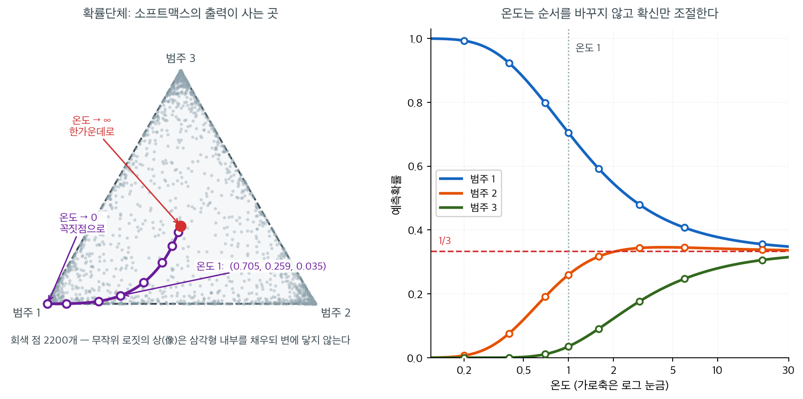

# 소프트맥스 함수와 확률단체


## 소프트맥스 함수와 그 성질

<div class="defn" markdown>

### 정의 1. 소프트맥스 함수 { .dfn }

**소프트맥스** 함수는 $C$개의 실숫값 로짓으로 이루어진 벡터
$\mathbf{z}=(z_1,\ldots,z_C)$를 확률분포로 옮긴다.

$$
\operatorname{softmax}(\mathbf{z})_c
= \frac{e^{z_c}}{\sum_{c'=1}^{C}e^{z_{c'}}},
\qquad c=1,\ldots,C
$$

</div>

### 성질

1. **비음성:** 모든 출력이 엄밀히 양수다.
2. **합이 1:** $\sum_c\operatorname{softmax}(\mathbf{z})_c = 1$.
3. **단조성:** 로짓 $z_c$가 클수록 확률도 크다.
4. **평행이동 불변성:** 임의의 스칼라 $\alpha$에 대해
   $\operatorname{softmax}(\mathbf{z}+\alpha\mathbf{1}) = \operatorname{softmax}(\mathbf{z})$.

성질 4는 수치적 안정성에 활용된다. 지수화하기 전에 $\max_c z_c$를 뺀다.

## 확률단체

소프트맥스의 출력은 **확률단체**

$$
\Delta^{C-1} = \Bigl\{\mathbf{p}\in\mathbb{R}^C : p_c\ge 0,\;
\sum_c p_c = 1\Bigr\}
$$

위에 놓인다. $C=3$이면 3차원 공간 안의 삼각형이고, $C=10$(MNIST)이면 9차원 단체다.

## 시그모이드의 일반화로서의 소프트맥스

$C=2$이고 로짓이 $(z_1,z_2)$일 때,

$$
\operatorname{softmax}(\mathbf{z})_1
= \frac{e^{z_1}}{e^{z_1}+e^{z_2}}
= \frac{1}{1+e^{-(z_1-z_2)}}
= \sigma(z_1-z_2)
$$

이다. 즉 이항 소프트맥스는 두 로짓의 차에 시그모이드를 적용한 것과 정확히 같다.

## 온도 척도화

흔히 쓰는 변형으로 온도 모수 $\tau>0$를 도입한다.

$$
\operatorname{softmax}(\mathbf{z}/\tau)_c
= \frac{e^{z_c/\tau}}{\sum_{c'}e^{z_{c'}/\tau}}
$$

$\tau\to 0$이면 분포가 $\arg\max_c z_c$에 집중된 점질량으로 수렴하고(확정적 결정),
$\tau\to\infty$이면 균등분포에 가까워진다. 온도 척도화는 모형 보정과 생성모형(예: 언어모형의
"창의성" 조절)에 쓰인다.

## 단체 위에서 보기

$C = 3$이면 확률단체가 평면 위의 정삼각형이므로 그림으로 그릴 수 있다. 꼭짓점은 각각
$(1,0,0)$, $(0,1,0)$, $(0,0,1)$이고, 삼각형 안의 한 점이 확률벡터 하나다.



왼쪽 그림의 회색 점 $2200$개는 $[-5, 5]^3$에서 무작위로 뽑은 로짓을 소프트맥스로 보낸 상이다.
삼각형 내부를 고르게 채우지만 **변이나 꼭짓점에는 한 점도 닿지 않는다.** 실제로 이 $2200$개
확률벡터의 성분 중 가장 작은 값이 $4.3 \times 10^{-5}$로, 작지만 엄밀히 양수다. 앞의 성질
1이 "비음성"이 아니라 "엄밀히 양수"였던 이유가 여기에 있다. $e^{z_c} > 0$이므로 확률이 정확히
$0$이 되려면 $z_c = -\infty$여야 하고, 유한한 가중치로는 도달할 수 없다. 소프트맥스의 상은
닫힌 단체 $\Delta^{2}$가 아니라 그 **내부**다. 이것이 분리 가능한 자료에서 가중치가 발산하는
현상의 기하학적 뿌리이기도 하다.

보라색 경로는 연습문제의 로짓 $\mathbf{z} = (2, 1, -1)$을 온도만 바꿔 가며 보낸 자취다.
온도 $1$에서는 $(0.705,\ 0.259,\ 0.035)$로 범주 1 쪽에 치우친 점이고, 온도를 $0.2$까지 낮추면
$(0.9933,\ 0.0067,\ 0.0000)$으로 꼭짓점에 거의 붙는다. 반대로 온도를 $20$까지 올리면
$(0.3556,\ 0.3383,\ 0.3061)$로 빨간 점, 즉 중심 $(1/3, 1/3, 1/3)$에 다가간다. **온도는 이
경로 위에서 점을 앞뒤로 밀 뿐이다.**

오른쪽 그림은 같은 이야기를 좌표별로 풀어 쓴 것이다. 세 곡선은 온도가 아무리 바뀌어도 서로
교차하지 않는다. 항상 범주 1 > 범주 2 > 범주 3이다. 로짓의 **순서**는 $\tau > 0$으로 나누어도
보존되기 때문이다. 그래서 온도를 바꾸어도 `argmax`가 고르는 답, 즉 예측 이름표는 결코 달라지지
않는다. 달라지는 것은 오직 확신의 정도다. 온도 척도화가 정확도는 건드리지 않으면서 보정만
고치는 도구로 쓰이는 이유가 바로 이것이다.

## NumPy 구현

<div class="exbox" markdown>

**보기 1.** <span class="diff easy" title="쉬움"></span> 소프트맥스 구현. 성질 4를 써서 넘침에 견디는 소프트맥스를 만든다.

**(1)** 최댓값을 빼지 않은 소박한 구현은 배정도에서 **정확히 어느 로짓 값부터** 망가지는가. 그 문턱을 구하고, 망가질 때 나오는 값이 무엇인지 미리 말하시오.

**(2)** $\mathbf{z} = (710, 0, -710)$과 $\mathbf{z} = (2, 1, -1)$을 두 구현에 넣어 (1)을 확인하시오. 최댓값을 뺀 뒤에도 남는 **가라앉음**(언더플로)은 왜 해롭지 않은가.

</div>

??? success "풀이"

    **(1) 문턱을 먼저 계산한다.** 배정도 부동소수점이 담을 수 있는 가장 큰 유한수는

    $$
    \max(\texttt{float64}) = (2 - 2^{-52}) \times 2^{1023} = 1.7977 \times 10^{308}
    $$

    이므로 $e^z$가 넘치지 않을 조건은 $z \le \log(1.7977 \times 10^{308}) = 709.7827$이다. 곧 $z = 709$까지는 $e^{709} = 8.2184 \times 10^{307}$로 멀쩡하고, $z = 710$에서 `inf`가 된다. **문턱은 $709.78$이다.**

    넘치면 무슨 값이 나오는가. $\mathbf{z} = (710, 0, -710)$을 소박한 식에 넣으면 분자가 $e^{710} = \infty$, 분모도 $\infty + 1 + 0 = \infty$이므로 첫 성분이 $\infty/\infty = $ `nan`이다. 둘째 성분은 $1/\infty = 0$, 셋째도 $0$이다. 그래서 $(\texttt{nan}, 0, 0)$이 나온다. **확률벡터이기를 그치는 것은 물론이고 합조차 `nan`이다.**

    **참값은 무엇인가.** 성질 4로 $\mathbf{z}$에서 $\max_c z_c = 710$을 빼면 $(0, -710, -1420)$이고

    $$
    \mathbf{p} = \frac{\bigl(e^{0},\; e^{-710},\; e^{-1420}\bigr)}{1 + e^{-710} + e^{-1420}}
    $$

    이다. $e^{-710} = 4.4763 \times 10^{-309}$이고 $e^{-1420} \approx 10^{-617}$이므로 분모는 $1$과 $10^{-309}$ 차이밖에 없다. 배정도의 기계 입실론이 $2.2 \times 10^{-16}$이니 분모는 **정확히 $1.0$으로 반올림된다.** 따라서 바르게 반올림된 답은

    $$
    \mathbf{p} = \bigl(1.0,\; 4.4763 \times 10^{-309},\; 0\bigr)
    $$

    이다. 셋째 성분의 참값 $e^{-1420}$은 배정도의 최소 양수 $4.9407 \times 10^{-324}$보다도 작아 $0$이 가장 가까운 표현 가능한 수다.

    **(2) 수치적으로.**

    ```python
    import numpy as np

    def softmax(z):
        """수치적으로 안정한 소프트맥스.

        가장 큰 값을 빼고 나서 exp 를 씌운다. 지수가 커지면 exp 가 넘쳐
        inf 가 되는데, 모든 항에서 같은 값을 빼면 분자와 분모에서 약분되어
        결과는 그대로이면서 넘침만 막을 수 있다.
        """
        z_shifted = z - np.max(z, axis=1, keepdims=True)
        exp_z = np.exp(z_shifted)
        return exp_z / np.sum(exp_z, axis=1, keepdims=True)

    def softmax_naive(z):
        """최댓값을 빼지 않은 꼴. 견주어 보려고만 둔다."""
        exp_z = np.exp(z)
        return exp_z / np.sum(exp_z, axis=1, keepdims=True)

    # 넘침과 가라앉음의 문턱을 수로 확인한다.
    big = np.finfo(np.float64).max
    tiny = np.finfo(np.float64).smallest_subnormal
    print(f"배정도 최대 유한수  {big:.4e}   log = {np.log(big):.4f}")
    print(f"배정도 최소 양수    {tiny:.4e}   log = {np.log(tiny):.4f}")

    with np.errstate(over="ignore"):
        for z in (709.0, 710.0):
            print(f"  exp({z:7.1f}) = {np.exp(z):.4e}")
    for z in (-745.0, -746.0):
        print(f"  exp({z:7.1f}) = {np.exp(z):.4e}")

    # 같은 로짓을 두 구현에 넣는다. 둘째 줄은 작아서 둘 다 잘 돈다.
    Z = np.array([[710.0, 0.0, -710.0],
                  [  2.0, 1.0,   -1.0]])
    with np.errstate(over="ignore", invalid="ignore"):
        naive = softmax_naive(Z)
    stable = softmax(Z)

    print(f"\n안정한 꼴  z=(710,0,-710) -> {stable[0]}")
    print(f"소박한 꼴  z=(710,0,-710) -> {naive[0]}")
    print(f"안정한 꼴  z=(2,1,-1)     -> {np.round(stable[1], 6)}")
    print(f"소박한 꼴  z=(2,1,-1)     -> {np.round(naive[1], 6)}")
    print(f"행별 합 (안정한 꼴) {stable.sum(axis=1)}")
    print(f"e^-710 = {np.exp(-710.0):.4e}  <- p2 의 참값")
    ```

    출력:

    ```
    배정도 최대 유한수  1.7977e+308   log = 709.7827
    배정도 최소 양수    4.9407e-324   log = -744.4401
      exp(  709.0) = 8.2184e+307
      exp(  710.0) = inf
      exp( -745.0) = 4.9407e-324
      exp( -746.0) = 0.0000e+00

    안정한 꼴  z=(710,0,-710) -> [1.00000000e+000 4.47628623e-309 0.00000000e+000]
    소박한 꼴  z=(710,0,-710) -> [nan  0.  0.]
    안정한 꼴  z=(2,1,-1)     -> [0.705385 0.259496 0.035119]
    소박한 꼴  z=(2,1,-1)     -> [0.705385 0.259496 0.035119]
    행별 합 (안정한 꼴) [1. 1.]
    e^-710 = 4.4763e-309  <- p2 의 참값
    ```

    **(1)의 예고가 모두 맞는다.** 문턱은 $709.7827$이고 $e^{709}$는 유한하지만 $e^{710}$은 `inf`다. 소박한 구현은 첫째 줄에서 $(\texttt{nan}, 0, 0)$을 내놓고, 안정한 구현은 $(1.0,\ 4.47628623\times 10^{-309},\ 0)$으로 손계산한 답과 **마지막 자리까지 같다.** 둘째 줄처럼 로짓이 $\lvert z \rvert \le 2$ 정도로 작으면 두 구현의 값이 완전히 일치하니, 최댓값을 빼는 것이 답을 바꾸는 일은 없다. 평행이동 불변성이 보장하는 바다.

    **가라앉음은 왜 해롭지 않은가.** 최댓값을 뺀 뒤 지수는 모두 $z_c - \max_c z_c \le 0$이므로 $e^{\cdot} \le 1$이고, 넘침은 **원리적으로 불가능하다.** 대신 $z_c - \max_c z_c < \log(4.9407\times10^{-324}) = -744.44$인 항은 $0$으로 가라앉는다. 출력이 보이듯 $e^{-745}$는 비정규수로 겨우 살아남고 $e^{-746}$은 $0$이 된다.

    그런데 가라앉은 항의 참값은 $e^{-744}$보다 작으니 어떤 확률과 견주어도 무시할 만하고, 더 중요한 것은 **분모가 절대 $0$이 되지 않는다**는 점이다. 최댓값에 해당하는 항이 정확히 $e^0 = 1$이므로 분모는 늘

    $$
    1 \le \sum_{c} e^{z_c - \max_{c'} z_{c'}} \le C
    $$

    사이에 있다. 그래서 $0/0$이 날 길이 없다. **최댓값을 빼는 한 줄이 치명적인 `nan`을 무해한 반올림으로 바꾼다.** 이것이 다음 절에서 다룰 로그-합-지수 기법의 전부이기도 하다.

## 연습문제

<div class="drillbox" markdown>

**연습문제 1.** <span class="diff easy" title="쉬움"></span>
소프트맥스 함수 계산

로짓 벡터가 $\mathbf{z} = (2, 1, -1)^\top$인 3범주 분류 문제를 생각하자.

**(a)** 다음 식으로 소프트맥스 확률 $\hat{p}_k = \text{softmax}(\mathbf{z})_k$
($k = 1, 2, 3$)를 계산하라.

$$
\hat{p}_k = \frac{e^{z_k}}{\sum_{j=1}^C e^{z_j}}
$$

**(b)** 확률의 합이 1이고 각각이 비음수임을 확인하라.

**(c)** 소프트맥스가 평행이동 불변임을 보여라. 즉 임의의 상수 $c$에 대해
$\text{softmax}(\mathbf{z} + c\mathbf{1}) = \text{softmax}(\mathbf{z})$임을 보이고, 이 성질이
수치적 안정성에 왜 중요한지 설명하라.

</div>

??? success "풀이"

    **(a)** 먼저 지수를 계산한다.

    $$
    e^{z_1} = e^2 \approx 7.389, \quad e^{z_2} = e^1 \approx 2.718, \quad e^{z_3} = e^{-1} \approx 0.368
    $$

    정규화 상수는

    $$
    \sum_{j=1}^3 e^{z_j} = 7.389 + 2.718 + 0.368 = 10.475
    $$

    이고, 소프트맥스 확률은

    $$
    \hat{p}_1 = \frac{7.389}{10.475} \approx 0.705, \quad \hat{p}_2 = \frac{2.718}{10.475} \approx 0.259, \quad \hat{p}_3 = \frac{0.368}{10.475} \approx 0.035
    $$

    이다.

    **(b)** $\hat{p}_1 + \hat{p}_2 + \hat{p}_3 = 0.705 + 0.259 + 0.035 \approx 1.0$이고, 지수는
    항상 양수이므로 각 확률도 양수다. 소프트맥스가 임의의 실숫값 로짓 벡터를 단체 위의 유효한
    확률분포로 옮긴다는 것을 확인해 준다.

    **(c)** 임의의 상수 $c$에 대해

    $$
    \text{softmax}(\mathbf{z} + c\mathbf{1})_k = \frac{e^{z_k + c}}{\sum_j e^{z_j + c}} = \frac{e^c \cdot e^{z_k}}{e^c \cdot \sum_j e^{z_j}} = \frac{e^{z_k}}{\sum_j e^{z_j}} = \text{softmax}(\mathbf{z})_k
    $$

    로 $e^c$ 인자가 소거된다. 이 성질이 **로그-합-지수 기법**의 핵심이다.
    $c = -\max_k z_k$로 두면 가장 큰 지수가 $e^0 = 1$이 되어 로짓이 커도 수치적 오버플로를
    막을 수 있다.

<div class="drillbox" markdown>

**연습문제 2.** <span class="diff easy" title="쉬움"></span>
소프트맥스 회귀의 가중행렬

범주 $C = 3$개, 입력 특성 $d = 2$개(그리고 편향)인 소프트맥스 회귀에서 모형은

$$
\mathbf{z} = \mathbf{W}\mathbf{x} + \mathbf{b}
$$

를 계산한다. 여기서 $\mathbf{W} \in \mathbb{R}^{3 \times 2}$이고 $\mathbf{b} \in \mathbb{R}^3$
이다.

**(a)** 학습된 모수가

$$
\mathbf{W} = \begin{pmatrix} 2 & -1 \\ -1 & 2 \\ 0 & 0 \end{pmatrix}, \quad \mathbf{b} = \begin{pmatrix} 0 \\ 0 \\ 1 \end{pmatrix}
$$

일 때, 입력 $\mathbf{x} = (1, 1)^\top$에 대한 로짓과 예측 범주를 구하라.

**(b)** 가중행렬의 기하학적 의미를 설명하라. $\mathbf{W}$의 각 행은 어떻게 선형 분류기를
정의하는가?

**(c)** 이 모형은 모수화가 중복되어 있다. 임의의 벡터 $\mathbf{v}$와 스칼라 $v_b$에 대해
$\mathbf{w}_k' = \mathbf{w}_k - \mathbf{v}$, $b_k' = b_k - v_b$로 둔 모수가 같은 소프트맥스
출력을 낸다. 이를 이용해 마지막 범주의 로짓이 항상 0이 되도록 만들어 자유 모수를 줄여라.

</div>

??? success "풀이"

    **(a)** 로짓을 계산하면

    $$
    \mathbf{z} = \begin{pmatrix} 2 & -1 \\ -1 & 2 \\ 0 & 0 \end{pmatrix} \begin{pmatrix} 1 \\ 1 \end{pmatrix} + \begin{pmatrix} 0 \\ 0 \\ 1 \end{pmatrix} = \begin{pmatrix} 1 \\ 1 \\ 0 \end{pmatrix} + \begin{pmatrix} 0 \\ 0 \\ 1 \end{pmatrix} = \begin{pmatrix} 1 \\ 1 \\ 1 \end{pmatrix}
    $$

    이다. 세 로짓이 모두 같으므로 $\text{softmax}(\mathbf{z}) = (1/3, 1/3, 1/3)^\top$이다. 어느
    범주도 선호되지 않으며 모형이 이 입력에 대해 최대로 불확실하다. 어느 범주를 예측해도
    무방하다(관례상 첫 번째 범주).

    **(b)** $\mathbf{W}$의 각 행 $\mathbf{w}_k^\top$은 선형 점수함수
    $z_k = \mathbf{w}_k^\top \mathbf{x} + b_k$를 정의한다. 기하학적으로 $\mathbf{w}_k$는 특성
    공간에서 범주 $k$의 점수가 증가하는 방향이다. 범주 $i$와 $j$ 사이의 결정경계는 $z_i = z_j$인
    초평면, 즉 $(\mathbf{w}_i - \mathbf{w}_j)^\top \mathbf{x} + (b_i - b_j) = 0$이며, 가중벡터
    $\mathbf{w}_i - \mathbf{w}_j$가 이 초평면의 법선이다.

    **(c)** 마지막 범주를 기준으로 삼는다. $\mathbf{v} = \mathbf{w}_3 = (0, 0)^\top$,
    $v_b = b_3 = 1$로 두면

    $$
    \mathbf{W}' = \begin{pmatrix} 2 & -1 \\ -1 & 2 \\ 0 & 0 \end{pmatrix}, \qquad
    \mathbf{b}' = \begin{pmatrix} 0 - 1 \\ 0 - 1 \\ 1 - 1 \end{pmatrix} = \begin{pmatrix} -1 \\ -1 \\ 0 \end{pmatrix}
    $$

    이 된다. 이제 $\mathbf{w}_3' = \mathbf{0}$, $b_3' = 0$이므로 세 번째 범주의 로짓이 항상 0인
    기준범주가 된다. 평행이동 불변성에 의해 소프트맥스 출력은 전혀 바뀌지 않는다. 자유 모수는
    $3 \times 2 + 3 = 9$개에서 $2 \times 2 + 2 = 6$개로 줄고, 모수화가 식별 가능해진다.

    !!! note "실무에서는 중복 모수화를 그대로 두는 경우가 많다"
        기준범주를 고정하면 식별 가능해지지만, 신경망 구현에서는 대개 $C$개 행을 모두 유지한다.
        이유는 두 가지다. 첫째, 구현이 대칭적이어서 단순하다. 둘째, **정칙화가 있으면 중복이
        사라진다.** $L_2$ 벌점 $\frac{\lambda}{2}\|\mathbf{W}\|_F^2$을 걸면 같은 예측을 주는
        모수 중 노름이 최소인 것이 유일하게 선택되므로 식별성이 회복된다. 벌점 없이 소프트맥스
        회귀를 적합하면 계수 자체는 유일하지 않으며, 계수를 해석할 때 이 점을 반드시 기억해야
        한다. 예측확률은 언제나 유일하다.

---

## 정리하며

소프트맥스는 **로짓 벡터를 확률분포로** 옮긴다.

$$
p_c=\frac{e^{z_c}}{\sum_{k=1}^C e^{z_k}}
$$

- **출력이 양수이고 합이 1 이다.** 그래서 확률로 읽을 수 있다.
- **평행이동에 불변이다.** $\mathbf z$ 에 상수를 더해도 결과가 같으며, 이 성질이 **수치적 안정성의 열쇠**다. 최댓값을 빼고 계산하면 지수 폭주를 막는다.
- **$C=2$ 면 시그모이드가 된다.** 두 로짓의 차이로 정리하면 확인된다.
- **"소프트" 최댓값이다.** 가장 큰 로짓에 확률이 몰리지만 다른 것도 $0$ 이 아니며, 로짓들의 격차가 클수록 하드맥스에 가까워진다.
- **온도 모수를 넣으면 날카로움을 조절**할 수 있으며, 지식 증류나 보정에서 쓰인다.

다음 절 **교차엔트로피 손실**로 넘어간다.
