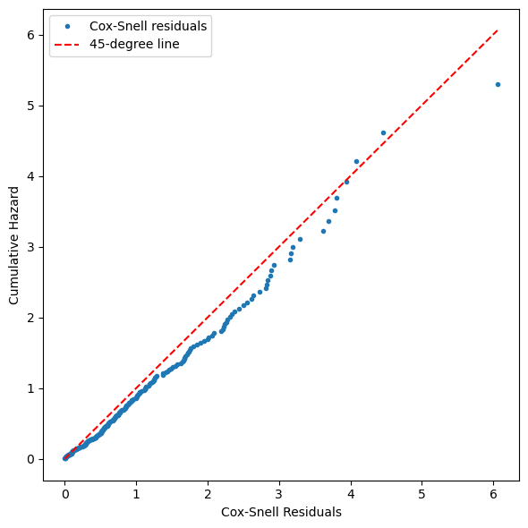

# 생존 모형 비교

## 개요

생존분석은 세 가지 모형화 패러다임을 제공한다. 비모수(카플란-마이어), 완전 모수(지수, 와이불,
로그정규), 준모수(콕스)이며 각각 가정, 강점, 출력이 다르다. 주어진 문제에 맞는 모형을 고르려면
그 절충을 이해해야 한다. 이 절에서는 체계적인 비교 틀을 제시하고, 형식적인 모형 선택 도구를
다루며, 실무적인 모형 선택 흐름을 보인다.

## 세 가지 패러다임

### 비모수적 방법

비모수적 방법은 **어떤 분포 가정도 하지 않는다.** 카플란-마이어 추정량은 $S(t)$의 계단함수
추정치를 만들고 로그순위 검정은 집단을 비교한다.

- **강점**: 분포 오지정의 위험이 없고 모형에 의존하지 않는 시각화를 준다.
- **한계**: 연속형 공변량을 보정할 수 없고, 계단함수 추정치만 주며, 통계적 효율이 낮다.

### 완전 모수 모형

모수 모형은 모수벡터(예: 지수의 $\lambda$, 와이불의 $(k, \lambda)$)로 분포를 완전히 지정한다.

$$
f(t \mid \boldsymbol{\theta}), \quad S(t \mid \boldsymbol{\theta}), \quad h(t \mid \boldsymbol{\theta})
$$

- **강점**: 매끄러운 위험·생존 추정치, 옳게 지정되면 높은 효율, 외삽 가능, AIC/BIC 기반 모형
  비교.
- **한계**: 분포 가정이 틀리면 편향되고, 표현 가능한 위험 모양이 제한된다.

### 준모수(콕스) 모형

콕스 모형은 기저의 형태를 가정하지 않고 공변량이 위험에 미치는 효과를 지정한다.

$$
h(t \mid \mathbf{x}) = h_0(t)\exp(\boldsymbol{\beta}^\top \mathbf{x})
$$

- **강점**: 기저위험의 오지정에 강건하고, 여러 공변량을 자연스럽게 다루며, 위험비가 해석 가능하다.
- **한계**: $h_0(t)$를 직접 추정하지 못하고, 비례위험 가정이 필요하며, 옳게 지정된 모수 모형보다
  효율이 낮다.

## 비교표

| 특징 | 비모수 | 모수 | 콕스 |
|:--------|:--------------:|:----------:|:---:|
| 분포 가정 | 없음 | 완전 | 기저에 대해서는 없음 |
| 공변량 보정 | 집단만 | 가능 | 가능 |
| 매끄러운 위험/생존 | 아니오 | 예 | 브레슬로를 통해서만 |
| 통계적 효율 | 가장 낮음 | 가장 높음(옳을 때) | 중간 |
| 오지정에 대한 강건성 | 가장 높음 | 가장 낮음 | 높음 |
| 외삽 | 불가 | 가능(조심스럽게) | 불가 |
| 비례위험 가정 필요 | 아니오 | 모형에 따라 | 예 |
| AIC/BIC 비교 | 해당 없음 | 가능 | 직접적으로는 불가 |

## 모형 선택 도구

### 정보기준

같은 자료에 적합한 모수 모형들을 비교할 때 쓴다.

$$
\text{AIC} = -2\hat{\ell} + 2p
$$

$$
\text{BIC} = -2\hat{\ell} + p \ln n
$$

값이 낮을수록 적합도와 복잡도의 절충이 낫다.

!!! note "AIC 대 BIC"

    AIC는 더 복잡한 모형을 선호하는 경향이 있고 예측에 적합하다. BIC는 복잡도를 더 무겁게
    벌하며 모형 선택에서 일치성을 갖는다(참 모형이 후보에 있으면 $n \to \infty$일 때 그것을
    고른다).

### 가능도비 검정

**내포된** 모형(예: $k = 1$로 두는 지수 대 와이불)에 대해,

$$
\Lambda = 2[\hat{\ell}_{\text{full}} - \hat{\ell}_{\text{reduced}}] \;\xrightarrow{d}\; \chi^2_q
$$

이며 $q$는 모수 개수의 차이다.

### 그림 진단

형식적 기준은 언제나 시각적 점검으로 보완해야 한다.

1. **KM 겹쳐 그리기**: 카플란-마이어 곡선을 적합된 각 모수적 생존곡선과 함께 그린다. 체계적인
   어긋남은 오지정을 가리킨다.
2. **로그 누적위험 그림**: 와이불 모형이라면 $\ln \hat{H}(t)$ 대 $\ln t$가 직선이어야 한다.
3. **콕스-스넬 잔차**: 모형이 옳으면 콕스-스넬 잔차가 지수(1) 분포를 따른다. 잔차의 위험에 대한
   넬슨-알렌 추정치를 잔차 자체에 대해 그리면 45도 직선에 가까워야 한다.

```python
import numpy as np
import matplotlib.pyplot as plt

def cox_snell_diagnostic(residuals):
    """
    Plot Cox-Snell residual diagnostic.

    If the model is correct, the cumulative hazard of the residuals
    should follow a unit exponential, i.e., H(r) = r.
    """
    sorted_r = np.sort(residuals)
    n = len(sorted_r)
    # Nelson-Aalen estimate for the residuals
    H_na = -np.log(1 - np.arange(1, n + 1) / (n + 1))

    fig, ax = plt.subplots(figsize=(6, 6))
    ax.plot(sorted_r, H_na, "o", markersize=3, label="Cox-Snell residuals")
    ax.plot([0, sorted_r.max()], [0, sorted_r.max()], "r--", label="45-degree line")
    ax.set_xlabel("Cox-Snell Residuals")
    ax.set_ylabel("Cumulative Hazard")
    ax.legend()
    plt.tight_layout()
    plt.show()


# 모형이 옳을 때: Cox-Snell 잔차는 단위 지수분포를 따르므로 45도선 위에 놓인다
rng = np.random.default_rng(0)
cox_snell_diagnostic(rng.exponential(1.0, 200))
```



모형이 옳을 때의 모습이다. 점들이 45도선을 따라 놓인다. 실제 자료에서 점들이 이 선에서 체계적으로 벗어나면 모형 설정이 잘못되었다는 뜻이다.

## 실무적 작업 흐름

생존 모형 선택의 체계적인 접근은 다음과 같다.

1. **탐색**: 집단마다 카플란-마이어 추정량과 넬슨-알렌 누적위험을 계산하고 자료를 시각화한다.
2. **위험 모양 평가**: 넬슨-알렌 그림을 살핀다. 위험이 일정한가($\hat{H}(t)$가 직선인가)?
   단조인가? 비단조인가?
3. **후보 적합**: 위험 모양에 근거해 적절한 모수 모형(지수, 와이불, 로그정규, 로그로지스틱)과
   콕스 모형을 적합한다.
4. **비교**: 비내포 모수 모형에는 AIC/BIC를, 내포 모형에는 가능도비 검정을 쓰고, 카플란-마이어
   곡선과 겹쳐 그린다.
5. **진단**: 콕스 모형은 비례위험 가정(쇤펠트 잔차)을, 모수 모형은 적합도(콕스-스넬 잔차)를
   점검한다.
6. **보고**: 최종 모형 결과와 함께 카플란-마이어 곡선을 비모수적 기준선으로 제시한다.

!!! tip "기본 권장안"

    판단이 서지 않으면 콕스 모형이 합당한 기본 선택이다. 분포 가정을 피하면서 공변량을
    수용한다. 다만 언제나 카플란-마이어 분석으로 보완해야 하고, 가능하면 모수 분석도 함께
    해야 한다.

## 해석

- **단 하나의 최선의 방법은 없다.** 선택은 연구 질문, 위험의 모양, 그리고 옹호할 수 있는 가정에
  달려 있다.
- **비모수적 방법**은 탐색에 언제나 적절하며 모형에 의존하지 않는 기준선을 제공한다.
- **모수 모형**은 매끄러운 추정치나 외삽이 필요하고 분포 가정이 자료로 뒷받침될 때 선호된다.
- **콕스 모형**은 공변량 효과가 주된 관심사이고 기저위험의 모양이 중요하지 않을 때 선호된다.
- 세 패러다임은 **상보적**이다. 철저한 생존분석은 대개 셋을 모두 쓴다.

## 연습문제

<div class="drillbox" markdown>

**연습문제 1.**
패러다임 선택

각 상황에서 어느 모형화 패러다임(비모수, 모수, 준모수)이 가장 적절한지 밝히고 이유를 설명하라.

**(a)** 환자 30명, 공변량 없는 탐색적 연구.

**(b)** 나이와 병기를 보정하면서 처리가 생존에 미치는 효과를 추정하는 것이 주된 목표인
임상시험.

**(c)** 관측 기간을 넘어선 고장시간을 예측하는 것이 목표인 신뢰성 연구.

</div>

??? success "풀이"

    **(a)** **비모수**(카플란-마이어). 표본이 작고 공변량이 없으므로 분포 가정이 위험하다.
    카플란-마이어 추정량이 모형에 의존하지 않는 생존곡선을 주고, 필요하면 로그순위 검정으로
    집단을 비교할 수 있다.

    **(b)** **준모수**(콕스 모형). 목표가 공변량(처리, 나이, 병기)이 위험에 미치는 효과를
    추정하는 것이다. 콕스 모형은 기저위험 분포를 지정하지 않고 여러 공변량을 다룬다.

    **(c)** **모수** 모형(예: 와이불). 관측 시간 범위를 넘어선 외삽에는 완전히 지정된 분포가
    필요하다. 비모수 모형과 콕스 모형은 외삽할 수 없다.

    !!! warning "(c)에서 \"할 수 있다\"와 \"믿을 만하다\"는 다르다"
        모수 모형만이 외삽할 수 있다는 것은 맞지만, 그렇게 얻은 예측이 신뢰할 만하다는 뜻은
        아니다. 외삽값은 전적으로 분포 가정에 달려 있고, 그 가정은 관측 구간 밖에서 검증할
        길이 없다. 21.3절에서 보았듯 로그정규와 로그로지스틱은 관측 구간에서 거의 같은 적합을
        주면서 꼬리에서 크게 갈린다.

        정직한 실무는 여러 분포족의 예측을 나란히 제시하여 가정 의존성의 크기를 드러내는
        것이다. 예측 하나만 보고하면 실제로는 없는 확실성을 만들어 내는 셈이다.

<div class="drillbox" markdown>

**연습문제 2.**
AIC 비교

관측치 150개에 모수 모형 세 개를 적합했다.

| 모형 | 모수 ($p$) | 최대 로그가능도 ($\hat{\ell}$) |
|:------|:----------------:|:---------------------------------:|
| 지수 | 1 | $-420.3$ |
| 와이불 | 2 | $-405.8$ |
| 로그로지스틱 | 2 | $-407.2$ |

**(a)** 각 모형의 AIC와 BIC를 계산하라.

**(b)** AIC는 어느 모형을 선호하는가? BIC는?

**(c)** 지수 대 와이불의 가능도비 검정을 수행하라.

</div>

??? success "풀이"

    **(a)** AIC $= -2\hat{\ell} + 2p$이고 BIC $= -2\hat{\ell} + p\ln n$이다
    ($\ln 150 = 5.011$).

    | 모형 | AIC | BIC |
    |:------|:---:|:---:|
    | 지수 | $2(420.3) + 2 = 842.6$ | $2(420.3) + 5.011 = 845.6$ |
    | 와이불 | $2(405.8) + 4 = 815.6$ | $2(405.8) + 10.022 = 821.6$ |
    | 로그로지스틱 | $2(407.2) + 4 = 818.4$ | $2(407.2) + 10.022 = 824.4$ |

    **(b)** AIC(815.6)와 BIC(821.6) 모두 와이불 모형을 선호한다. 와이불과 로그로지스틱의
    차이는 AIC와 BIC 모두에서 $2.8$로 같다. 두 모형의 모수 개수가 같아 벌점이 소거되기
    때문이며, 이 경우 AIC와 BIC의 순위는 반드시 일치한다.

    **(c)** 가능도비 검정(지수 대 와이불)은

    $$
    \Lambda = 2[-405.8 - (-420.3)] = 2 \times 14.5 = 29.0
    $$

    이다. $H_0: k = 1$ 아래에서 $\Lambda \sim \chi^2_1$이고 $\alpha = 0.05$의 임계값은
    3.84다. $29.0 \gg 3.84$이므로 지수 모형을 기각한다. 상수 위험 가정은 지지되지 않는다.

<div class="drillbox" markdown>

**연습문제 3.**
콕스-스넬 잔차

콕스-스넬 잔차가 어떻게 정의되고 전체 모형 적합도를 평가하는 데 어떻게 쓰이는지 설명하라.

</div>

??? success "풀이"

    추정된 생존함수가 $\hat{S}(t_i)$인 적합된 모수 모형에서 대상 $i$의 콕스-스넬 잔차는

    $$
    r_i = -\ln \hat{S}(t_i) = \hat{H}(t_i)
    $$

    로, 관측 시점에서의 추정 누적위험이다. 절단된 관측치에서는 $r_i$도 절단된다.

    **핵심 성질**: 모형이 옳게 지정되어 있으면 바탕 생존분포와 무관하게 콕스-스넬 잔차가
    $\text{Exp}(1)$ 분포를 따른다. $T \sim F$이면 $-\ln S(T) \sim \text{Exp}(1)$이기
    때문이다.

    이는 확률적분변환의 한 형태다. $U = F(T) \sim \text{Uniform}(0,1)$이므로
    $S(T) = 1 - U$ 역시 균등분포이고, $-\ln(\text{Uniform}(0,1)) \sim \text{Exp}(1)$이다.

    **진단**: 잔차의 누적위험에 대한 넬슨-알렌 추정치를 계산하고 잔차 자체에 대해 그린다.
    모형이 잘 맞으면 점들이 45도 직선 $H(r) = r$을 따라야 한다. 벗어나면 오지정을 가리킨다.

    다만 이 진단에는 알려진 한계가 있다. 모수를 자료에서 추정했으므로 잔차가 정확히
    $\text{Exp}(1)$을 따르지 않으며, 특히 꼬리에서 어긋난다. 큰 잔차 몇 개가 45도 직선에서
    벗어나는 것은 흔한 일이므로 그것만으로 모형을 기각하지 말라.

<div class="drillbox" markdown>

**연습문제 4.**
효율 비교

**(a)** 생존 모형 비교의 맥락에서 "통계적 효율"이 무엇을 뜻하는지 설명하라.

**(b)** 옳게 지정된 모수 모형이 카플란-마이어 추정량보다 효율적인 이유는?

**(c)** 이 효율의 이점이 단점이 되는 조건은 무엇인가?

</div>

??? success "풀이"

    **(a)** 통계적 효율은 추정의 정밀도를 뜻한다. 같은 표본 크기에서 분산이 작을수록(신뢰구간이
    좁을수록) 효율적인 추정량이다.

    **(b)** 옳게 지정된 모수 모형은 알려진 분포 형태를 이용해 모든 관측치에 걸쳐 "힘을 빌린다."
    카플란-마이어 추정량은 분포 구조를 활용하지 않고 각 사건시간을 독립적으로 다룬다. 모수
    모형의 작은 분산은 옳은 구조 가정에서 나오며, 이 가정이 추정해야 할 양의 실질적인 개수를
    줄인다.

    구체적으로, 사건이 100건인 자료에서 카플란-마이어는 100개의 조건부확률을 추정하지만
    지수 모형은 모수 하나만 추정한다. 100개의 정보가 하나로 모이므로 표준오차가
    $1/\sqrt{100}$ 수준으로 작아진다.

    **(c)** 모수 가정이 **틀리면** 효율의 이점이 단점이 된다. 잘못 지정된 모형은 비효율적일
    뿐 아니라 **편향된다.** 틀린 생존함수로 수렴한다. 카플란-마이어 추정량은 참 분포와 무관하게
    언제나 일치성을 갖는다. 즉 모수 모형의 효율 이득은 강건성을 대가로 얻는 것이다.

    더 위험한 점은 **표준오차가 이 편향을 전혀 알려 주지 않는다**는 것이다. 잘못 지정된
    모형도 좁은 신뢰구간을 보고하며, 그 구간이 참값을 포함하지 않을 뿐이다. 그림 진단이
    필수적인 이유가 여기 있다.

<div class="drillbox" markdown>

**연습문제 5.**
패러다임 결합하기

어떤 임상시험이 신약이 전체 생존에 미치는 효과를 조사한다. 세 패러다임을 모두 쓰는 완전한 분석
전략을 서술하고 각각이 무엇을 기여하는지 설명하라.

</div>

??? success "풀이"

    **1단계 --- 비모수적 탐색.** 처리군과 대조군의 카플란-마이어 생존곡선을 계산하고 95%
    신뢰띠와 함께 시각화한다. 로그순위 검정으로 예비 비교를 한다. 넬슨-알렌 누적위험 그림을
    살펴 위험의 모양(일정, 단조, 비단조)을 평가한다.

    **2단계 --- 공변량 보정을 위한 콕스 모형.** 처리 지시자, 나이, 성별, 병기를 공변량으로
    갖는 콕스 비례위험 모형을 적합한다. 위험비와 신뢰구간을 추정한다. 쇤펠트 잔차로 비례위험
    가정을 점검한다.

    **3단계 --- 예측을 위한 모수 모형.** 1단계에서 파악한 위험 모양에 근거해 후보 모수 모형을
    적합한다(예: 위험이 단조면 와이불). AIC로 비교한다. 가장 좋은 모수 모형으로 중앙 생존시간을
    외삽하고 매끄러운 생존곡선 추정치를 만든다.

    **4단계 --- 통합과 보고.** 모수적 생존곡선과 콕스 기반 브레슬로 생존 추정치를 카플란-마이어
    곡선 위에 겹쳐 그린다. 세 방법이 일치하면 결론에 대한 신뢰가 커진다. 어긋나면 오지정
    가능성을 알리는 신호다. 콕스 모형의 처리 위험비를 주된 결과로, 카플란-마이어 곡선을 모형에
    의존하지 않는 기준선으로, 모수 모형을 매끄러운 추정과 예측용으로 보고한다.

    !!! warning "분석 계획은 자료를 보기 전에 확정해야 한다"
        위 흐름에는 함정이 하나 숨어 있다. 3단계에서 "1단계의 위험 모양에 근거해" 모형을
        고른다고 했는데, 이는 같은 자료를 두 번 쓰는 것이다. 자료를 보고 모형을 고른 뒤
        그 모형의 p-값과 신뢰구간을 보고하면 선택 과정의 불확실성이 반영되지 않는다.

        임상시험처럼 확증적 분석이 필요한 상황에서는 **주된 분석(예: 로그순위 검정과 콕스
        모형의 처리 위험비)을 자료를 보기 전에 프로토콜에 명시**해야 한다. 위험 모양에 따라
        모형을 고르는 탐색적 단계는 부차적 분석으로 명확히 구분해 보고한다. 1장에서 다룬
        설계와 분석의 구분이 여기에서도 그대로 적용된다.

---

## 정리하며

세 접근을 **같은 자료에서** 나란히 적합했다.

- **카플란–마이어 곡선 위에 모수 모형의 곡선을 겹쳐 그린다.** 잘 맞으면 모수 가정이 그럴듯하다는 시각적 증거가 된다.
- **AIC 로 모수 모형들을 비교한다.** 지수·와이불·로그정규 중 어느 것이 나은지 가르며, 가능도비로 지수 대 와이불($k=1$)을 직접 검정할 수도 있다.
- **콕스 모형은 AIC 로 모수 모형과 직접 비교할 수 없다.** 부분가능도라 척도가 다르며, **같은 종류의 모형끼리만 비교해야 한다.**
- **C-index 로 예측력을 견준다.** 이것은 세 접근을 공통 척도에서 비교할 수 있는 지표다.
- **결론이 갈리면 가정을 다시 본다.** 비례위험이 깨졌거나 분포가 맞지 않는다는 신호일 수 있다.

**이것으로 21장이 끝난다.** 사건까지의 시간과 중도절단에서 시작해 생존·위험함수, 카플란–마이어와 로그순위 검정, 모수 모형과 절단 가능도, 콕스 비례위험 모형과 그 진단까지 보았다.

**그리고 이것이 이 책의 마지막 장이다.** 0장의 수학적 배경에서 출발해 확률·분포·표본분포·추정·구간·검정을 거쳐 회귀와 분류, 그리고 생존분석까지 왔다. 관통하는 물음은 처음부터 하나였다. **이 자료는 어떻게 생겨났고, 그것이 우리가 할 수 있는 말을 어떻게 제한하는가.**
