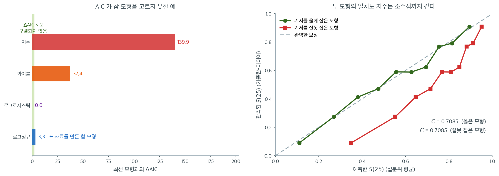

# AIC와 일치도 지수

같은 자료에 여러 생존 모형을 적합했다면 최선의 모형을 고를 객관적 기준이 필요하다. 서로를
보완하는 두 도구가 이 목적에 쓰인다. 모수 모형의 적합도와 복잡도를 저울질하는 **아카이케
정보기준(AIC)**과, 사건을 일찍 겪는 대상과 늦게 겪는 대상을 모형이 얼마나 잘 구별하는지를 재는
**일치도 지수(C-지수)**다.

이 절에서는 두 기준을 정의하고, 적용 범위와 한계를 논의하며, 추가 평가지표로 적분 브라이어
점수를 소개한다.

---

## 1. 아카이케 정보기준

로그가능도가 $\ell(\hat{\boldsymbol{\theta}})$이고 추정 모수가 $p$개인 모수적 생존 모형의
AIC는

$$
\text{AIC} = -2\ell(\hat{\boldsymbol{\theta}}) + 2p
$$

이다. AIC가 낮을수록 적합도와 복잡도의 절충이 낫다. AIC는 모수가 하나 늘 때마다 2만큼 벌점을
주어 과적합을 억제한다.

### 생존 모형에서 AIC 쓰기

AIC는 **모수적** 생존 모형(지수, 와이불, 로그정규, 로그로지스틱)에 곧바로 적용된다. 이들이 같은
가능도 틀을 공유하기 때문이다.

!!! example "모수 모형 비교"

    | 모형 | 모수 ($p$) | 로그가능도 | AIC |
    |:------|:----------------:|:--------------:|:---:|
    | 지수 | 1 | $-312.5$ | 627.0 |
    | 와이불 | 2 | $-305.8$ | 615.6 |
    | 로그정규 | 2 | $-307.1$ | 618.2 |
    | 로그로지스틱 | 2 | $-306.4$ | 616.8 |

    와이불 모형의 AIC가 615.6으로 가장 낮아 이 후보들 중 선호된다.

    다만 와이불, 로그로지스틱, 로그정규의 AIC 차이가 각각 $1.2$와 $2.6$으로 작다는 점에
    유의하라. 흔히 쓰는 경험칙은 **AIC 차이가 2 미만이면 두 모형이 실질적으로 구별되지
    않는다**는 것이다. 여기서 확실히 배제할 수 있는 것은 지수 모형뿐이다.

### 대안으로서의 BIC

베이즈 정보기준은 고정 벌점 $2p$를 표본 크기에 의존하는 벌점으로 바꾼다.

$$
\text{BIC} = -2\ell(\hat{\boldsymbol{\theta}}) + p \ln n
$$

$n > e^2 \approx 7.4$이면(실무에서는 거의 항상 그렇다) BIC가 AIC보다 복잡도를 무겁게 벌한다.
따라서 BIC는 AIC보다 단순한 모형을 고르는 경향이 있다.

### 콕스 모형에서 AIC의 한계

콕스 모형은 완전한 가능도가 아니라 **부분** 가능도를 최대화한다. 부분 로그가능도로 계산한 AIC를
실무에서 쓰기도 하지만 이론적 정당화가 모수 모형에 비해 약하다. 일부 소프트웨어가 콕스 모형에
대해 부분가능도 기반 AIC를 보고하지만, 비교는 같은 기저를 갖는 콕스 모형끼리로 제한해야 한다
(예: 같은 콕스 틀 안에서 공변량 집합만 다른 경우).

!!! warning "모형 갈래를 가로질러 AIC를 비교하지 말 것"

    와이불 모형의 AIC와 콕스 모형의 AIC는 서로 다른 가능도(완전 대 부분)에 근거하므로 직접
    비교할 수 없다. 갈래를 가로지르는 비교에는 일치도 지수를 쓰라.

---

## 2. 일치도 지수

Harrell(1982)이 제안한 **일치도 지수**(C-지수 또는 C-통계량)는 모형이 예측 위험으로 대상들의
순위를 얼마나 옳게 매기는지를 잰다. 이항 분류의 AUC에 대응하는 생존분석의 지표다.

### 정의 1. 일치도 지수 { .dfn }

관측 시간이 더 짧은 쪽이 사건을 겪은 대상 쌍 $(i, j)$를 **사용 가능한 쌍**이라 한다(그래야
순서를 알 수 있다). 사용 가능한 각 쌍에서, 위험이 더 높다고 예측된 대상(예측 생존시간이 짧거나
선형예측자가 큰 대상)이 실제로 먼저 사건을 겪었으면 모형이 그 쌍에 대해 **일치한다**고 한다.

$$
C = \frac{\text{Number of concordant pairs}}{\text{Number of usable pairs}}
$$

- $C = 1.0$: 완벽한 판별. 모형이 모든 쌍의 순위를 옳게 매긴다.
- $C = 0.5$: 무작위 추측. 판별력이 없다.
- $C < 0.5$: 모형이 체계적으로 순서를 뒤집는다(실무에서는 드물다).

### C-지수 계산하기

선형예측자가 $\hat{\eta}_i = \hat{\boldsymbol{\beta}}^\top \mathbf{x}_i$인 콕스 모형에서,

1. $t_i < t_j$이고 $\delta_i = 1$인 모든 쌍 $(i, j)$를 열거한다(대상 $i$가 먼저 사건을 겪었고
   절단되지 않았다).
2. $\hat{\eta}_i > \hat{\eta}_j$이면 그 쌍은 일치한다(먼저 사건을 겪은 대상의 예측 위험이 더
   높다).
3. $\hat{\eta}_i = \hat{\eta}_j$이면 그 쌍을 0.5로 센다.

!!! note "절단된 관측치 처리"

    시간이 더 짧은 쪽이 절단된 쌍은 순서가 모호하므로 제외한다. 시간이 더 긴 쪽이 절단된 쌍은
    절단시간이 다른 대상의 사건시간을 넘을 때만 포함한다.

    쌍을 버린다는 것은 곧 **절단이 심할수록 C-지수의 표준오차가 커진다**는 뜻이다. 사용 가능한
    쌍의 수가 유효 표본크기 역할을 한다.

### C-지수 해석

| C-지수 범위 | 해석 |
|:-------------|:---------------|
| 0.50 -- 0.60 | 판별력이 나쁨 |
| 0.60 -- 0.70 | 보통 |
| 0.70 -- 0.80 | 좋음 |
| 0.80 -- 0.90 | 뛰어남 |
| 0.90 -- 1.00 | 매우 뛰어남(실무에서는 드묾) |

19장의 AUC 등급표와 마찬가지로 이 구간들은 **관례일 뿐**이다. C-지수 0.72가 좋은지 나쁜지는
표가 아니라 문제와 기존 모형의 성능이 정한다.

### 장점과 한계

**장점:**

- **어떤** 생존 모형에도 적용된다(비모수, 모수, 콕스).
- 분포 가정을 요구하지 않는다.
- 무작위로 뽑은 한 쌍의 순위를 옳게 매길 확률로 곧바로 해석된다.

**한계:**

- **판별력**만 재고 보정(예측확률이 관측 빈도와 얼마나 맞는지)은 재지 않는다.
- 절단분포에 민감하다. 절단이 심하면 사용 가능한 쌍의 수가 줄어든다.
- 시간 지평을 반영하지 않는다. 어떤 모형이 단기 지평에서는 잘 판별하고 장기에서는 못할 수 있다.

첫 번째 한계가 특히 중요하다. C-지수는 **순위통계량**이므로 예측 위험에 어떤 단조 변환을 가해도
값이 변하지 않는다. 19장에서 AUC가 보정에 대해 아무것도 말해 주지 않던 것과 정확히 같다.
예측 생존확률 자체를 쓸 계획이라면 C-지수만으로는 부족하고 브라이어 점수를 함께 보아야 한다.

왼쪽은 로그정규에서 만든 자료($n = 500$, 절단율 $26.4\%$, 사건 368건)에 네 모수 모형을 적합하고 최선 모형과의 $\Delta$AIC를 그린 것이다. 지수 모형은 $139.9$, 와이불은 $37.4$로 확실히 밀려난다. 위험이 봉우리형인 자료를 단조 위험 모형으로 맞추려 했으니 당연하다. 그런데 남은 두 모형 중 **AIC가 고른 것은 로그로지스틱이고, 자료를 실제로 만든 로그정규는 $\Delta$AIC $= 3.3$으로 2위다.**

이것이 AIC의 정직한 모습이다. $\Delta$AIC $= 3.3$은 "2 미만이면 구별되지 않는다"는 경험칙을 살짝 넘긴 값이라 액면 그대로 읽으면 참 모형을 기각하게 된다. 21.3절에서 보았듯 로그정규와 로그로지스틱은 관측 구간에서 위험함수가 거의 포개지므로, 표본 하나의 로그가능도 차이는 표집 변동에 쉽게 흔들린다. **$\Delta$AIC가 한 자릿수일 때 승자를 확정하지 말라**는 경고는 여기서 나온다.

오른쪽은 C-지수의 더 심각한 맹점이다. 같은 콕스형 자료($n = 3{,}000$)에 두 모형을 놓았다. 하나는 기저를 옳게 잡은 모형이고, 다른 하나는 선형예측자는 똑같지만 기저 생존함수를 $S_0^{0.45}$로 잘못 잡은 모형이다. 두 모형이 매기는 **위험의 순위는 완전히 동일하므로 일치도 지수도 $C = 0.7085$로 소수점 넷째 자리까지 같다.**

그런데 $t = 25$에서의 예측을 십분위로 묶어 관측된 카플란-마이어 값과 맞춰 보면 이야기가 달라진다. 초록색은 대각선을 따라가지만, 붉은색은 **줄곧 위쪽으로 치우쳐 있다.** 가장 위험이 높은 십분위에서 옳은 모형은 $S(25) = 0.111$을 예측하고 실제 관측값은 $0.090$인 반면, 잘못 잡은 모형은 $0.349$를 예측한다. **생존율을 세 배 넘게 부풀리면서도 C-지수는 한 치도 손해 보지 않는다.**

실무적 함의는 명확하다. "이 환자가 저 환자보다 위험한가"를 묻는 **선별·우선순위 문제**라면 C-지수로 충분하다. 그러나 "이 환자가 2년을 살 확률은 몇 퍼센트인가"를 묻는 **예측확률 문제**라면 C-지수는 아무 보증도 하지 않는다. 19장에서 AUC가 보정에 대해 침묵하던 것과 같은 구조이며, 그래서 아래의 브라이어 점수와 보정 곡선이 필요하다.

---

## 3. 적분 브라이어 점수

**브라이어 점수**는 특정 시점 $t$에서 판별력과 보정을 함께 평가한다.

$$
\text{BS}(t) = \frac{1}{n} \sum_{i=1}^{n} \left[\hat{S}(t \mid \mathbf{x}_i) - \mathbf{1}(T_i > t)\right]^2 \cdot w_i(t)
$$

여기서 $w_i(t)$는 절단확률의 역수 가중치로, $t_i < t$인 절단된 대상의 참 생존 상태
$\mathbf{1}(T_i > t)$를 알 수 없다는 점을 보정한다.

**적분 브라이어 점수(IBS)**는 브라이어 점수를 여러 시점에 걸쳐 평균한다.

$$
\text{IBS} = \frac{1}{t_{\max} - t_{\min}} \int_{t_{\min}}^{t_{\max}} \text{BS}(t)\, dt
$$

IBS가 낮을수록 전체 예측 성능이 좋다.

!!! tip "각 지표를 언제 쓸 것인가"

    - **AIC**: 같은 가능도 유형을 갖는 모수 모형끼리 비교할 때.
    - **C-지수**: 어떤 모형이든 판별력을 비교할 때.
    - **IBS**: 어떤 모형이든 전체 예측정확도(판별력 + 보정)를 비교할 때.

---

## 연습문제

**연습문제 1.** 
모형 선택

대상 200명, 사건 120건인 같은 자료에 모수 모형 세 개를 적합했다.

| 모형 | 모수 ($p$) | 로그가능도 |
|:------|:----------------:|:--------------:|
| 지수 | 1 | $-458.2$ |
| 와이불 | 2 | $-441.6$ |
| 로그로지스틱 | 2 | $-443.1$ |

**(a)** 각 모형의 AIC를 계산하라.

**(b)** $\alpha = 0.05$에서 지수 대 와이불의 가능도비 검정을 수행하라.

**(c)** 같은 자료에 적합한 콕스 모형의 일치도 지수가 $C = 0.72$이고 와이불 모형은 $C = 0.74$다.
어느 모형이 더 잘 판별하는가?

??? success "풀이"

    **(a)** AIC = $-2\ell + 2p$이므로,

    - 지수: $-2(-458.2) + 2(1) = 918.4$
    - 와이불: $-2(-441.6) + 2(2) = 887.2$
    - 로그로지스틱: $-2(-443.1) + 2(2) = 890.2$

    와이불 모형의 AIC가 887.2로 가장 낮다. 와이불과 로그로지스틱의 차이는 $3.0$으로 경험칙의
    기준선 2를 넘으므로, 이 경우에는 와이불을 선호할 근거가 있다.

    **(b)** $\Lambda = 2(-441.6 - (-458.2)) = 2 \times 16.6 = 33.2$이다. $H_0$ 아래에서
    $\Lambda \sim \chi^2_1$이고 $33.2 \gg 3.84 = \chi^2_{1, 0.05}$이므로 $H_0$을 기각한다.
    와이불 모형이 지수 모형보다 유의하게 잘 맞는다. p-값은 $8.3 \times 10^{-9}$다.

    **(c)** 액면 그대로는 와이불($C = 0.74$)이 콕스($C = 0.72$)보다 조금 낫다. **그러나 이
    차이만으로 결론을 내려서는 안 된다.**

    - **불확실성이 제시되지 않았다.** C-지수에도 표집 변동이 있다. 사건 120건, 사용 가능한 쌍이
      수천 개인 자료에서 C-지수의 표준오차는 대략 $0.02$--$0.03$이다. $0.02$ 차이는 표준오차
      하나에도 못 미친다.
    - **같은 자료에서 계산했다.** 두 모형 모두 이 자료에 적합되었으므로 C-지수가 낙관적으로
      편향되어 있다. 모형이 유연할수록 편향이 크다. 공정한 비교에는 교차검증이나 별도의
      검정자료가 필요하다.
    - **판별력만 잰다.** 두 모형의 보정이 크게 다를 수 있다. 예측 생존확률을 쓸 계획이라면
      브라이어 점수나 보정 곡선을 함께 보아야 한다.

    **정직한 답:** 이 자료에서 두 모형의 판별 성능은 **구별되지 않는다.** 모형 선택의 근거는
    다른 곳에서 찾아야 한다. 위험비를 보고하려면 콕스가, 외삽이나 매끄러운 위험곡선이 필요하면
    와이불이 낫다. $\square$

---

**연습문제 2.** 
BIC 로 다시 고르기

연습문제 1 의 세 모형($n = 200$)을 BIC 로 다시 고른다.

**(a)** 세 모형의 BIC 를 구하라.

**(b)** AIC 와 BIC 의 결론이 같은가? 벌점의 차이를 수로 적어라.

**(c)** 표본이 $n = 20$으로 줄면 두 기준의 관계가 어떻게 달라지는가?

??? success "풀이"

    **(a)** $\text{BIC} = -2\ell + p\ln n$이고 $\ln 200 = 5.298$이다.

    | 모형 | $p$ | $-2\ell$ | 벌점 | BIC |
    |---|---|---|---|---|
    | 지수 | 1 | 916.4 | 5.30 | 921.7 |
    | 와이불 | 2 | 883.2 | 10.60 | 893.8 |
    | 로그로지스틱 | 2 | 886.2 | 10.60 | 896.8 |

    **(b)** 결론은 같다(와이불). 모수가 하나 늘 때 AIC 는 $2$, BIC 는 $5.30$을 물리므로
    **벌점이 2.65 배**다. 여기서는 와이불이 지수보다 $-2\ell$ 에서 $33.2$나 앞서 있어 어느
    벌점으로도 뒤집히지 않는다.

    **(c)** $\ln 20 = 3.00$이라 BIC 의 벌점이 모수당 $3.00$으로 줄어 AIC($2$)에 가까워진다.
    $n < e^2 = 7.4$이면 오히려 BIC 가 AIC 보다 **너그러워진다.** 두 기준의 차이는 표본이
    커질수록 벌어지며, 그것이 BIC 에 일치성을 주고 AIC 에서 빼앗는 바로 그 성질이다. $\square$

---

**연습문제 3.** 
델타 AIC 를 가중치로 바꾸기

본문 1절 표의 네 모형(AIC $= 627.0,\ 615.6,\ 618.2,\ 616.8$)을 쓴다.

**(a)** $\Delta$AIC 와 아카이케 가중치를 구하라.

**(b)** "와이불이 최선"이라는 보고가 얼마나 강한 주장인지 가중치로 평가하라.

**(c)** 지수 모형을 후보에서 빼면 나머지 셋의 가중치가 어떻게 되는가?

??? success "풀이"

    **(a)** 최솟값이 $615.6$(와이불)이므로 $\Delta = 11.4,\ 0,\ 2.6,\ 1.2$이고
    $w \propto e^{-\Delta/2}$를 정규화하면

    | 모형 | 지수 | 와이불 | 로그정규 | 로그로지스틱 |
    |---|---|---|---|---|
    | $\Delta$ | 11.4 | 0 | 2.6 | 1.2 |
    | $w$ | 0.002 | 0.476 | 0.130 | 0.392 |

    **(b)** 와이불의 가중치가 $0.48$로 **절반에 못 미친다.** 로그로지스틱이 $0.39$로 바짝
    붙어 있어 둘의 근거비는 $e^{-1.2/2} = 1.22$, 곧 $1.2$배에 지나지 않는다. "와이불이
    최선"이라는 보고는 **자료가 거의 가려 주지 못한 선택을 결론처럼 적는 것**이다. 확실한
    것은 지수 모형을 버려도 좋다는 것($w = 0.002$)뿐이다.

    **(c)** 지수의 몫 $0.002$를 나머지가 나눠 가지므로 각각 $1/(1-0.002) = 1.002$배가 되어
    $0.477,\ 0.130,\ 0.393$이 된다. 거의 달라지지 않는다. 가중치가 후보 집합에 의존한다는
    사실은 중요하지만, **이미 가망 없는 후보를 빼는 것은 영향이 없다.** $\square$

---

**연습문제 4.** 
중첩 모형과 가능도비 검정

지수 모형은 와이불의 형상모수를 $k = 1$로 고정한 **특수한 경우**다.

**(a)** 연습문제 1 (b)의 검정통계량 $33.2$가 자유도 $1$인 카이제곱을 따르는 근거를 적어라.

**(b)** $\Delta\text{AIC}$와 가능도비 통계량 사이의 관계식을 유도하고, "$\Delta$AIC $> 2$"가
가능도비 검정으로는 어떤 문턱에 해당하는지 구하라.

**(c)** 와이불과 로그정규는 중첩이 아니다. 이들을 가능도비 검정으로 견줄 수 없는 까닭과,
그럴 때 쓸 수 있는 방법을 말하라.

??? success "풀이"

    **(a)** 윌크스 정리에 따라, 참 모수가 귀무 모형의 모수공간 **내부**에 있고 정칙 조건이
    성립하면 $-2\ln\Lambda$가 자유도 = 제약의 수인 카이제곱으로 수렴한다. 여기서 제약은
    $k = 1$ 하나이므로 자유도가 $1$이다.

    **(b)** 모수가 $q$개 늘어난 모형에 대해

    $$
    \Delta\text{AIC} = \text{AIC}_{\text{단순}} - \text{AIC}_{\text{복잡}}
    = (-2\ell_0 + 2p) - (-2\ell_1 + 2(p+q)) = \Lambda - 2q
    $$

    이다($\Lambda = 2(\ell_1 - \ell_0)$). $q = 1$이면 $\Delta\text{AIC} > 2 \iff \Lambda > 4$다.
    $\chi^2_1$ 분포에서 $\Lambda > 4$의 꼬리확률은 $0.0455$이므로, **"$\Delta$AIC 2"는
    대략 유의수준 $0.05$ 검정과 같은 자리**다. AIC 의 경험칙이 익숙한 숫자와 맞닿는 지점이다.

    **(c)** 가능도비 검정은 한 모형이 다른 모형의 **모수 제약**으로 얻어질 때만 쓸 수 있는데,
    와이불과 로그정규는 서로의 특수한 경우가 아니다. 비중첩 모형을 견주려면

    1. **AIC·BIC** 로 순위만 매기거나(검정이 아니다),
    2. **Vuong 검정**처럼 비중첩 모형을 위해 설계된 검정을 쓰거나,
    3. 둘을 포함하는 **더 큰 모형**(일반화 감마 등)을 세워 각각을 그 특수한 경우로 만든 뒤
       중첩 검정을 한다.

    생존분석에서는 세 번째 길이 흔하다. 일반화 감마가 와이불·로그정규·지수를 모두 특수한 경우로
    품기 때문이다. $\square$

---

**연습문제 5.** 
C-지수를 손으로 세기

대상 다섯 명의 관측 시간 $t$, 사건 지시자 $\delta$, 선형예측자 $\hat\eta$가 다음과 같다.

| 대상 | A | B | C | D | E |
|---|---|---|---|---|---|
| $t$ | 2 | 4 | 5 | 7 | 9 |
| $\delta$ | 1 | 1 | 0 | 1 | 0 |
| $\hat\eta$ | 1.2 | 0.8 | 1.5 | 0.3 | 0.6 |

**(a)** 사용 가능한 쌍을 모두 열거하라.

**(b)** 일치하는 쌍을 세어 C-지수를 구하라.

**(c)** C 를 절단된 대상 때문에 버린 쌍의 수와 함께 보고해야 하는 까닭을 말하라.

??? success "풀이"

    **(a)** 시간이 짧은 쪽이 **사건을 겪은** 쌍만 쓸 수 있다. A($t=2$, 사건)와 B($t=4$, 사건)는
    각각 자기보다 뒤에 오는 모든 대상과 쌍을 이루고, C($t=5$, 절단)는 짧은 쪽이 될 수 없다.
    D($t=7$, 사건)는 E($t=9$)와 쌍을 이룬다.

    $$
    (A,B),\ (A,C),\ (A,D),\ (A,E),\ (B,C),\ (B,D),\ (B,E),\ (D,E)
    $$

    로 **8 쌍**이다. C 가 짧은 쪽인 $(C,D)$, $(C,E)$는 C 가 절단이라 순서를 알 수 없어 버린다.

    **(b)** 먼저 사건을 겪은 쪽의 $\hat\eta$가 더 커야 일치다.

    | 쌍 | 먼저 | $\hat\eta$ 비교 | 판정 |
    |---|---|---|---|
    | (A,B) | A | $1.2 > 0.8$ | 일치 |
    | (A,C) | A | $1.2 < 1.5$ | 불일치 |
    | (A,D) | A | $1.2 > 0.3$ | 일치 |
    | (A,E) | A | $1.2 > 0.6$ | 일치 |
    | (B,C) | B | $0.8 < 1.5$ | 불일치 |
    | (B,D) | B | $0.8 > 0.3$ | 일치 |
    | (B,E) | B | $0.8 > 0.6$ | 일치 |
    | (D,E) | D | $0.3 < 0.6$ | 불일치 |

    일치 5, 불일치 3 이므로 $C = 5/8 = 0.625$다.

    **(c)** 버린 쌍이 많을수록 $C$ 가 **적은 정보로 계산된 값**이기 때문이다. 여기서는
    가능한 $\binom52 = 10$ 쌍 중 8 쌍만 썼다. 절단이 심한 자료에서는 사용 가능한 쌍이 전체의
    절반 아래로 떨어지기도 하고, 그러면 $C$ 의 표준오차가 커질 뿐 아니라 **살아남은 쌍이
    특정 시간대에 치우쳐** 해석이 달라진다. 사용 가능한 쌍의 수가 사실상의 유효 표본크기다.
    $\square$

---

**연습문제 6.** 
C-지수는 단조변환에 둔감하다

본문은 기저 생존함수를 $S_0^{0.45}$로 잘못 잡아도 $C$ 가 소수점 넷째 자리까지 같았다고 했다.

**(a)** 왜 그런지 C-지수의 정의에서 설명하라.

**(b)** 선형예측자에 $\hat\eta \mapsto 3\hat\eta + 10$을 적용하면 $C$ 는 어떻게 되는가?
$\hat\eta \mapsto -\hat\eta$ 라면?

**(c)** 그런데도 두 모형이 실무에서 전혀 다른 까닭을 본문의 수($S(25)$ 예측 $0.349$ 대 관측
$0.090$)로 설명하라.

??? success "풀이"

    **(a)** $C$ 는 쌍마다 $\hat\eta_i > \hat\eta_j$ 인지만 묻는다. 기저 생존함수를 어떻게
    바꾸든 **모든 대상에 같은 변환이 걸리므로 순위가 바뀌지 않고**, 따라서 일치/불일치 판정이
    하나도 달라지지 않는다. $S_0^{0.45}$ 는 $S_0$ 의 단조변환이다.

    **(b)** $3\hat\eta + 10$ 은 강증가라 순위가 그대로이므로 $C$ 도 **그대로**다.
    $-\hat\eta$ 는 모든 쌍의 대소를 뒤집으므로 $C \mapsto 1 - C$ 가 된다. 본문에서 $C < 0.5$ 인
    모형은 예측을 뒤집으면 된다고 한 것이 이 식이다.

    **(c)** 순위가 같아도 **값이 다르기** 때문이다. 가장 위험이 높은 십분위에서 옳은 모형은
    $S(25) = 0.111$(관측 $0.090$)을 예측하는데 잘못 잡은 모형은 $0.349$를 예측한다. 환자에게
    "25 개월 생존율이 $11\%$" 라고 말하는 것과 "$35\%$" 라고 말하는 것은 전혀 다른 진료 결정을
    낳는다. **순위를 묻는 질문과 확률을 묻는 질문은 다른 질문**이고, $C$ 는 앞의 것에만 답한다.
    $\square$

---

**연습문제 7.** 
브라이어 점수의 가중치

본문 3절의 브라이어 점수에는 절단확률의 역수 가중치 $w_i(t)$가 붙는다.

**(a)** 가중치 없이 $t_i < t$ 인 절단된 대상을 그냥 빼면 어떤 편향이 생기는지 설명하라.

**(b)** 역확률 가중(IPCW)이 그 편향을 어떻게 고치는지 한 문장으로 적어라.

**(c)** 절단이 공변량에 **의존**하면(예: 위험이 높은 환자가 더 일찍 추적에서 빠진다) 이
가중치로 충분한가?

??? success "풀이"

    **(a)** $t$ 이전에 절단된 대상은 $\mathbf 1(T_i > t)$ 를 알 수 없다. 이들을 그냥 빼면
    남는 것은 **$t$ 까지 관측이 이어진 대상**들인데, 이 집단은 무작위 표본이 아니다. 추적이
    오래 이어진 쪽으로 치우치므로 생존율이 과대평가되고 브라이어 점수가 낙관적으로 나온다.

    **(b)** 각 관측에 **"그 시점까지 절단되지 않았을 확률의 역수"** 를 곱해, 살아남은 관측
    하나가 자기와 비슷한데 절단되어 사라진 관측들의 몫까지 대표하게 만든다.

    **(c)** 충분하지 않다. 표준 IPCW 는 절단확률을 카플란-마이어로 추정하면서 **절단이 공변량과
    무관하다**고 가정한다. 위험이 높은 환자가 더 일찍 빠지면 절단확률이 공변량에 의존하므로,
    공변량을 넣은 절단 모형(예: 절단을 결과로 삼는 콕스 모형)으로 가중치를 추정해야 한다.
    그렇게 해도 **절단이 관측되지 않은 요인에 의존하면(비무시 절단) 자료만으로는 고칠 수
    없고**, 민감도 분석이 유일한 대응이다. $\square$

---

**연습문제 8.** 
세 기준이 서로 다른 모형을 고를 때

같은 자료에서 세 모형을 평가했더니 다음과 같았다.

| 모형 | AIC | C-지수 | IBS |
|---|---|---|---|
| 와이불 | **615.6** | 0.701 | 0.168 |
| 로그로지스틱 | 616.8 | 0.703 | **0.141** |
| 콕스 | — | **0.712** | 0.149 |

**(a)** 콕스 모형의 AIC 칸이 비어 있는 까닭은 무엇인가?

**(b)** 세 기준이 서로 다른 모형을 가리킨다. 어떻게 결정해야 하는가?

**(c)** 이 표에서 **읽어서는 안 되는** 결론 하나를 들어라.

??? success "풀이"

    **(a)** 콕스 모형은 완전 가능도가 아니라 **부분 가능도**를 최대화하므로, 그 값으로 계산한
    AIC 는 모수 모형의 AIC 와 같은 눈금에 있지 않다. 본문의 경고대로 갈래를 가로지르는 AIC
    비교는 할 수 없고, 그래서 비워 두는 것이 정직하다.

    **(b)** **쓸 목적이 정한다.**

    - 위험 순위로 환자를 분류·선별하는 것이 목적이면 C-지수가 가장 높은 **콕스**.
    - 특정 시점의 생존확률을 숫자로 말해야 하면 IBS 가 가장 낮은 **로그로지스틱**.
    - 매끄러운 위험곡선이나 관측 범위 밖 외삽이 필요하면 모수 모형 중 AIC 가 나은 **와이불**.

    기준이 갈릴 때 "종합 점수" 를 만들어 평균하는 것은 가장 나쁜 대응이다. 서로 다른 질문에
    답하는 수들이기 때문이다.

    **(c)** **"콕스가 판별력이 가장 좋으니 전체적으로 최선"** 이라고 읽어서는 안 된다.
    $0.712$ 와 $0.703$ 의 차이는 표준오차 안쪽일 가능성이 크고(연습문제 1 (c)), IBS 로는
    로그로지스틱이 더 낫다. 차이가 작은 수들을 굵게 칠해 승자를 만드는 표 자체가 위험하다.
    **불확실성 없이 소수점 셋째 자리를 견주지 말라.** $\square$

---

**연습문제 9.** 
AIC 가 참 모형을 놓치는 장면

본문 그림의 왼쪽에서, 자료를 만든 것은 로그정규인데 AIC 는 로그로지스틱을 골랐고
$\Delta$AIC $= 3.3$이었다.

**(a)** 이것이 AIC 의 결함인가, 아니면 기대할 수 있는 거동인가? 로그가능도의 표집 변동으로
설명하라.

**(b)** $\Delta$AIC $= 3.3$ 을 "참 모형을 기각할 근거" 로 읽으면 안 되는 까닭을 연습문제 4 (b)의
관계식으로 설명하라.

**(c)** 같은 자료 생성과정을 여러 번 되풀이한다면 AIC 가 참 모형을 고르는 비율은 $n$ 이 커질
때 $1$ 로 가는가? 이유를 말하라.

??? success "풀이"

    **(a)** **기대할 수 있는 거동이다.** AIC 는 표본 하나에서 계산한 로그가능도의 함수이고,
    로그가능도 자체가 확률변수다. 로그정규와 로그로지스틱은 관측 구간에서 위험함수가 거의
    포개지므로 두 모형의 참 기대 로그가능도 차이가 애초에 작고, 그 작은 차이는 표집 변동에
    쉽게 묻힌다. 참 모형이 진 것이 아니라 **이 표본이 그렇게 나온 것**이다.

    **(b)** 두 모형은 모수 개수가 같으므로($q = 0$) $\Delta\text{AIC} = \Lambda$ 이고,
    중첩도 아니라 $\Lambda$ 가 카이제곱을 따르지도 않는다. 애초에 **검정이 아니라 순위**를
    주는 도구에 기각·채택의 언어를 붙이는 것이 잘못이다. 아카이케 가중치로 읽으면
    $e^{-3.3/2} = 0.19$, 곧 로그정규의 근거가 승자의 $19\%$ 라는 말이고, 이는 "밀렸지만
    살아 있다" 는 뜻이지 "틀렸다" 가 아니다.

    **(c)** 가지 않는다. AIC 는 모수 개수가 같은 두 모형 사이에서 $-2\ell$ 만 비교하는데,
    참 모형의 기대 로그가능도가 더 높더라도 그 차이가 **상수**인 반면 로그가능도 차이의 표준편차는
    $\sqrt n$ 에 비례해 커진다. 다만 차이의 평균도 $n$ 에 비례해 커지므로 비는 $\sqrt n$ 으로
    자라고, 이 경우에는 결국 참 모형이 이긴다. 참 모형을 놓치는 확률이 $0$ 으로 가지 않는 것은
    **참 모형이 더 단순한 모형에 중첩되어 있는 상황**(연습문제 4 의 중첩 구조)에서이며, 그때
    AIC 는 쓸모없는 모수를 넣은 모형을 일정 확률로 계속 고른다. 두 상황을 구별하는 것이 중요하다.
    $\square$

---

**연습문제 10.** 
C-지수의 낙관 편향과 그 보정

연습문제 1 (c)의 풀이는 "같은 자료에서 계산했으므로 C-지수가 낙관적으로 편향된다" 고 했다.

**(a)** 이 편향이 생기는 기전을 설명하고, 모형의 유연성과 어떤 관계가 있는지 말하라.

**(b)** 교차검증으로 보정할 때 **무엇을 접어야** 하는지 주의할 점을 적어라(변수 선택이 있는
경우를 포함하라).

**(c)** 붓스트랩 **낙관 보정**(Harrell) 의 뼈대를 적어라. 왜 단순히 붓스트랩 표본에서 $C$ 를
평균하는 것으로는 안 되는가?

??? success "풀이"

    **(a)** 모형은 **그 자료의 잡음까지 맞춘다.** 계수가 이 표본의 우연한 패턴에 맞춰져 있으므로
    같은 표본에서 잰 순위 능력이 새 자료에서의 능력보다 높게 나온다. 모형이 유연할수록(모수가
    많을수록, 변수 선택이나 조율을 많이 했을수록) 맞출 수 있는 잡음이 많아 편향이 커진다.
    사건 수가 적을 때 특히 심하며, 생존분석에서는 **사건 수 대비 모수 수**가 핵심 지표다.

    **(b)** **모형을 만드는 모든 단계를 접어야 한다.** 흔한 실수는 전체 자료로 변수를 고른 뒤
    그 변수 집합으로만 교차검증을 돌리는 것인데, 이러면 변수 선택이 이미 전체 자료를 본 뒤라
    낙관 편향이 그대로 남는다. 변수 선택·결측 대체·초모수 조율을 **훈련 폴드 안에서** 다시
    수행해야 한다. 생존자료에서는 폴드마다 사건 수가 비슷하도록 **사건 기준 층화**도 필요하다.

    **(c)** 뼈대는 이렇다.

    1. 원자료에서 모형을 적합해 $C_{\text{겉보기}}$ 를 구한다.
    2. 붓스트랩 표본 $b = 1, \dots, B$ 마다 **모형을 처음부터 다시 적합**하고
       - 그 표본에서의 $C_b^{\text{부트}}$ 와
       - 같은 모형을 **원자료**에 적용한 $C_b^{\text{원}}$ 을 구한다.
    3. 낙관도 $\widehat{\text{opt}} = \frac1B\sum_b (C_b^{\text{부트}} - C_b^{\text{원}})$ 를
       구하고 $C_{\text{보정}} = C_{\text{겉보기}} - \widehat{\text{opt}}$ 로 쓴다.

    붓스트랩 표본에서 $C$ 를 그냥 평균하면 **각 표본에서 또다시 자기 자신을 평가**하는 것이라
    같은 낙관이 되풀이될 뿐이다. 핵심은 "붓스트랩에서 적합한 모형을 **원자료에 옮겨** 성능이
    얼마나 떨어지는지" 를 재는 데 있다. 그 낙폭의 평균이 곧 낙관도이고, 교차검증보다 분산이
    작아 사건 수가 적은 생존자료에서 특히 선호된다. $\square$

---

## 정리하며

| 기준 | 적용 가능한 모형 | 측정 대상 | 강점 |
|:----------|:-----------------|:---------|:----------|
| AIC | 모수(완전 가능도) | 적합도 대 복잡도 | 이론적 근거가 있음 |
| BIC | 모수(완전 가능도) | 적합도 대 복잡도(더 강한 벌점) | 일치성 있는 모형 선택 |
| C-지수 | 전부 | 판별력 | 모형에 무관 |
| IBS | 전부 | 판별력 + 보정 | 종합적 평가 |
