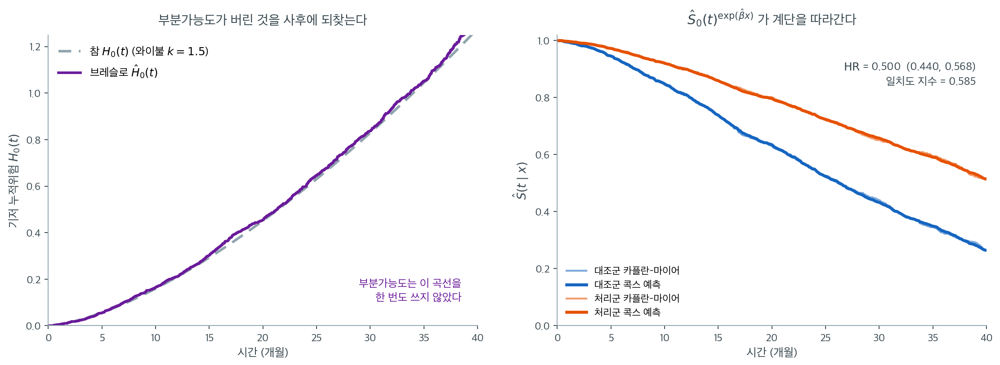

# 콕스 비례위험 실습

## 개요

콕스 비례위험 모형은 생존분석에서 가장 널리 쓰이는 회귀 틀이다. 기저위험의 모수적 형태를
지정하지 않고 공변량 효과를 위험함수에 연결하므로 준모수적 접근이다. 이 절에서는 모형을
정식화하고, 부분가능도를 유도하며, 위험비 해석을 논의하고, 비례위험 가정의 진단을 다룬다.

---

## 1. 모형 정식화

콕스 모형은 공변량 벡터 $\mathbf{x}_i = (x_{i1}, \ldots, x_{ip})^\top$를 갖는 대상 $i$의
위험을 다음과 같이 설정한다.

$$
h(t \mid \mathbf{x}_i) = h_0(t) \exp(\boldsymbol{\beta}^\top \mathbf{x}_i)
$$

여기서,

- $h_0(t)$는 **기저위험**으로, 전혀 지정되지 않은 임의의 음이 아닌 함수다.
- $\boldsymbol{\beta} = (\beta_1, \ldots, \beta_p)^\top$는 추정할 회귀계수다.
- $\exp(\boldsymbol{\beta}^\top \mathbf{x}_i)$는 대상 $i$의 상대위험 배수다.

**비례위험 성질**이 곧바로 따라온다. 임의의 두 대상 사이의 위험비가 시간에 걸쳐 일정하다.

$$
\frac{h(t \mid \mathbf{x}_i)}{h(t \mid \mathbf{x}_j)} = \exp\!\bigl(\boldsymbol{\beta}^\top(\mathbf{x}_i - \mathbf{x}_j)\bigr)
$$

비에서 기저위험 $h_0(t)$가 소거된다.

---

## 2. 부분가능도

$t_{(1)} < \cdots < t_{(K)}$를 서로 다른 $K$개의 사건시간을 크기순으로 나열한 것이라 하고,
$t_{(j)}$에서 사건을 겪는 대상을 $i_j$라 하자. $t_{(j)}$의 **위험집합**은

$$
\mathcal{R}_j = \{i : t_i \geq t_{(j)}\}
$$

이다. 부분가능도는

$$
PL(\boldsymbol{\beta}) = \prod_{j=1}^{K} \frac{\exp(\boldsymbol{\beta}^\top \mathbf{x}_{i_j})}{\sum_{l \in \mathcal{R}_j} \exp(\boldsymbol{\beta}^\top \mathbf{x}_l)}
$$

이다. 기저위험 $h_0(t_{(j)})$이 분자와 분모에 모두 나타나 소거된다. 이것이 Cox(1972)의 핵심
착상이다. $h_0(t)$를 몰라도 공변량 효과를 추정할 수 있다.

부분 로그가능도는

$$
\ell_P(\boldsymbol{\beta}) = \sum_{j=1}^{K} \left[\boldsymbol{\beta}^\top \mathbf{x}_{i_j} - \ln\!\left(\sum_{l \in \mathcal{R}_j} \exp(\boldsymbol{\beta}^\top \mathbf{x}_l)\right)\right]
$$

이다.

### 추정

MLE $\hat{\boldsymbol{\beta}}$는 뉴턴-랩슨 반복으로 $\ell_P$를 최대화하여 얻는다.

$$
\boldsymbol{\beta}^{(m+1)} = \boldsymbol{\beta}^{(m)} + \mathcal{I}(\boldsymbol{\beta}^{(m)})^{-1} U(\boldsymbol{\beta}^{(m)})
$$

여기서 $U(\boldsymbol{\beta})$는 점수벡터이고 $\mathcal{I}(\boldsymbol{\beta})$는 관측
정보행렬이다.

---

## 3. 위험비

지수화한 계수 $\exp(\hat{\beta}_j)$는 다른 공변량을 고정한 채 공변량 $x_j$가 한 단위 증가할
때의 **위험비**다.

$$
\text{HR}_j = \exp(\hat{\beta}_j)
$$

| $\text{HR}$ | 해석 |
|:------------:|:---------------|
| $> 1$ | 위험이 높음(생존이 짧음) |
| $= 1$ | 효과 없음 |
| $< 1$ | 위험이 낮음(생존이 김) |

연속형 공변량이 $c$ 단위 증가하면 위험비는 $\exp(c \cdot \hat{\beta}_j)$다.

### 신뢰구간

위험비의 $100(1 - \alpha)\%$ 신뢰구간은

$$
\text{CI}_{\text{HR}} = \bigl(\exp(\hat{\beta}_j - z_{\alpha/2} \cdot \text{se}(\hat{\beta}_j)),\; \exp(\hat{\beta}_j + z_{\alpha/2} \cdot \text{se}(\hat{\beta}_j))\bigr)
$$

이다. 구간이 1을 포함하지 않으면 그 공변량 효과는 통계적으로 유의하다.

---

## 4. 기저위험의 브레슬로 추정량

$\hat{\boldsymbol{\beta}}$를 추정한 뒤 기저 누적위험을 다음으로 추정한다.

$$
\hat{H}_0(t) = \sum_{j:\, t_{(j)} \leq t} \frac{d_j}{\sum_{l \in \mathcal{R}_j} \exp(\hat{\boldsymbol{\beta}}^\top \mathbf{x}_l)}
$$

대상별 생존함수는 그러면

$$
\hat{S}(t \mid \mathbf{x}) = \exp\!\bigl(-\hat{H}_0(t)\bigr)^{\exp(\hat{\boldsymbol{\beta}}^\top \mathbf{x})}
$$

이다.



각 집단 $1{,}000$명, 기저는 와이불 $k = 1.5$·척도 $34$, 처리 효과는 $\beta = -0.7$(곧 $\text{HR} = 0.497$)인 자료를 만들어 콕스 모형을 적합했다. 결과는 $\hat\beta = -0.694$, $\text{HR} = 0.500$(95% 신뢰구간 $0.440$--$0.568$)으로 참값을 거의 그대로 되찾는다. 기저위험의 모양을 한 번도 가정하지 않고 얻은 값이다.

왼쪽 그림이 이 절에서 가장 놀라운 부분이다. 보라색 계단이 브레슬로 추정치 $\hat H_0(t)$이고 회색 점선이 자료를 만든 참 $H_0(t) = (t/34)^{1.5}$인데, 둘이 거의 포개진다. $t = 10$에서 $0.166$ 대 $0.160$, $t = 20$에서 $0.455$ 대 $0.451$, $t = 30$에서 $0.838$ 대 $0.829$, $t = 40$에서 $1.330$ 대 $1.276$이다. **부분가능도는 이 곡선을 계산에 한 번도 쓰지 않았다.** $\hat\beta$를 먼저 구하고 나서, 각 사건시점의 사건 수를 그 시점 위험집합의 가중합으로 나누어 사후에 쌓아 올린 것이다.

이 순서가 콕스 모형의 설계다. 성가신 무한차원 모수 $h_0(t)$를 추정 단계에서는 **소거해 버리고**, 관심 모수 $\boldsymbol\beta$를 먼저 확정한 뒤, 필요하면 그때 가서 $\boldsymbol\beta$를 고정한 채 기저를 비모수적으로 채워 넣는다. 그래서 "기저를 지정하지 않는다"는 말이 "기저를 알 수 없다"는 뜻은 아니다.

오른쪽은 그렇게 얻은 $\hat S_0(t)^{\exp(\hat\beta x)}$를 집단별 카플란-마이어 위에 겹친 것이다. 굵은 선(콕스 예측)이 연한 선(카플란-마이어)을 거의 완벽히 따라간다. 모형이 옳게 지정되었을 때의 모습이며, 여기서 체계적으로 어긋난다면 비례위험이 깨졌거나 공변량의 함수 형태가 잘못된 것이다. 아래 일치도 지수는 $0.585$로, 두 집단만 구별하는 이항 공변량 하나로는 이 정도가 한계다. **$\text{HR} = 0.50$처럼 강한 효과조차 개별 대상의 순서를 맞히는 능력으로는 $0.5$(동전 던지기)에서 크게 못 벗어난다**는 사실은 21.5절에서 다시 다룬다.

---

## 5. 비례위험 가정 점검하기

비례위험(PH) 가정은 콕스 모형의 타당성에 결정적이다. 위배되면 위험비가 시간에 걸쳐 일정하지
않고 표준적 해석이 무너진다.

### 그림 방법

- **로그-로그 그림**: 집단마다 $\ln(-\ln \hat{S}(t))$를 $\ln t$에 대해 그린다. 비례위험
  아래에서는 곡선들이 대략 평행해야 한다.
- **쇤펠트 잔차**: 공변량마다 척도화된 쇤펠트 잔차를 시간에 대해 그린다. 기울기가 0이 아니면
  시간 의존 효과를 시사한다.

### 형식적 검정

그램브시-서노 검정은 척도화된 쇤펠트 잔차를 시간의 함수에 회귀시킨다. 공변량 $j$의 기울기가
유의하면 $\beta_j$가 시간에 따라 변한다는 뜻이다.

!!! warning "비례위험 위배의 결과"

    비례위험이 성립하지 않으면 추정된 위험비는 시간에 걸쳐 평균한 요약값이며 어느 특정 시점의
    효과도 정확히 나타내지 못할 수 있다. 대응책으로는 층화, 시간 의존 계수, 또는 모수적
    가속실패시간 모형으로의 전환이 있다.

---

## 6. 구현 스케치

<div class="exbox" markdown>

**보기 1.** <span class="diff easy" title="쉬움"></span> 부분로그가능도 구현. 공변량이 하나뿐인 네 명의 자료를 보자.

| 대상 | 시간 | 사건 | $x$ |
|:---:|:---:|:---:|:---:|
| A | 4 | 1 | 1 |
| B | 7 | 0 | 0 |
| C | 9 | 1 | 0 |
| D | 12 | 1 | 1 |

**(1)** 부분로그가능도 $\ell(\beta)$를 닫힌 꼴로 적고 $\hat\beta$를 구하시오. 또 $\beta = 0$에서는 $\ell(0) = -\sum_j \ln n_j$($n_j$는 위험집합 크기)임을 보이시오.

**(2)** 모든 공변량에 같은 상수를 더해도 $\ell$이 변하지 않음을 보이고, 이것이 콕스 모형에 절편이 없는 까닭임을 설명하시오. 둘 다 코드로 확인하시오.

</div>

??? success "풀이"

    **(1) 해석적으로.** 사건은 $t = 4, 9, 12$에서 일어난다. 위험집합은 각각 $\{A,B,C,D\}$, $\{C,D\}$, $\{D\}$다($B$는 $t = 7$에 절단되어 빠진다). 부분로그가능도는

    $$
    \ell(\beta) = \sum_{j} \left[\beta x_{(j)} - \ln\!\sum_{l\in\mathcal R_j} e^{\beta x_l}\right]
    $$

    이므로 세 항을 그대로 쓴다.

    $$
    \ell(\beta)
    = \big[\beta - \ln(2 + 2e^\beta)\big]
    + \big[0 - \ln(1 + e^\beta)\big]
    + \big[\beta - \ln e^\beta\big]
    $$

    마지막 항은 위험집합에 $D$ 혼자 남아 분자와 분모가 같으므로 **정확히 0이다.** 위험집합의 크기가 1이 되는 시점은 $\beta$에 대한 정보를 전혀 주지 않는다. 정리하면

    $$
    \ell(\beta) = \beta - \ln 2 - 2\ln(1 + e^\beta)
    $$

    이다. 미분하면

    $$
    \ell'(\beta) = 1 - \frac{2e^\beta}{1+e^\beta} = 0
    \quad\Longrightarrow\quad
    \frac{e^\beta}{1+e^\beta} = \frac12
    \quad\Longrightarrow\quad
    \hat\beta = 0
    $$

    이고 $\ell''(\beta) = -2e^\beta/(1+e^\beta)^2 < 0$이므로 이 정류점이 최대다. $\ell''(0) = -1/2$이니 왈드 표준오차는 $1/\sqrt{1/2} = 1.414$로, 네 명으로는 아무것도 못 가린다는 말이 된다.

    최댓값은

    $$
    \ell(0) = 0 - \ln 2 - 2\ln 2 = -3\ln 2 = -2.079442
    $$

    다. 한편 $\beta = 0$이면 모든 $e^{\beta x_l} = 1$이므로 각 항이 $-\ln n_j$가 되고

    $$
    \ell(0) = -(\ln 4 + \ln 2 + \ln 1) = -\ln 8 = -3\ln 2
    $$

    로 같은 값이 나온다. **$\beta = 0$에서의 부분가능도는 "사건을 겪은 사람이 위험집합에서 무작위로 뽑혔을 확률"의 로그일 뿐**이고 공변량 값과 무관하다. 모든 콕스 적합의 출발점이자 가능도비검정의 영모형이 이것이다.

    **(2) 해석적으로.** 공변량을 $x_i \to x_i + c$로 옮기면 각 항의 분자는 $e^{\beta(x_{(j)}+c)} = e^{\beta c}e^{\beta x_{(j)}}$, 분모는 $\sum_l e^{\beta(x_l+c)} = e^{\beta c}\sum_l e^{\beta x_l}$이 되어 **같은 인자 $e^{\beta c}$가 위아래에 똑같이 붙는다.** 비가 변하지 않으므로 $\ell$도 변하지 않는다.

    이 불변성이 뜻하는 바는 분명하다. 모든 사람에게 공통으로 걸리는 효과는 부분가능도에서 **식별되지 않는다.** 절편 $\beta_0$를 모형에 넣는다면 그것은 모두에게 같은 $c$를 더하는 것이므로 아무 영향도 주지 못한다. 공통 효과는 전부 기저위험 $h_0(t)$가 떠맡으며, 그래서 콕스 모형의 선형예측자에는 절편이 없다.

    **(1)(2) 수치적으로.**

    ```python
    import numpy as np

    def partial_log_likelihood(beta, X, times, events):
        """Cox 모형의 부분로그가능도를 계산한다.

        "부분"이라 부르는 까닭은 기저위험함수를 아예 셈에서 빼기 때문이다.
        사건이 일어난 시점마다 "그 순간 위험집합에 있던 사람들 중 하필 이
        사람에게 사건이 일어날 확률"만 곱해 나가면, 기저위험이 분자와 분모에서
        약분되어 사라진다. 그래서 위험함수의 모양을 가정하지 않고도 계수를
        추정할 수 있다.

        매개변수
        --------
        beta   : 길이 p 인 계수벡터
        X      : (n, p) 공변량 행렬
        times  : 관측된 시각
        events : 사건 지시자 (1 = 사건, 0 = 중도절단)

        돌려주는 값
        ----------
        ll : 부분로그가능도 값
        """
        # 선형예측자. exp 를 씌운 값이 그 사람의 상대적 위험이 된다.
        risk_scores = X @ beta
        exp_scores = np.exp(risk_scores)

        # 시각을 내림차순으로 정렬한다. 이러면 누적합이 곧 "그 시점 이후까지
        # 남아 있는 사람들", 곧 위험집합의 합이 된다.
        order = np.argsort(-times)
        sorted_events = events[order]
        sorted_exp = exp_scores[order]
        sorted_scores = risk_scores[order]

        # 위험집합의 합을 누적합 한 번으로 얻는다. 시점마다 집합을 다시
        # 만들면 O(n^2) 이 되는 계산이 O(n log n) 으로 끝난다.
        cumsum_exp = np.cumsum(sorted_exp)

        # 사건이 관측된 사람만 더한다. 중도절단된 사람은 위험집합에 기여할
        # 뿐 자기 항을 갖지 않는다.
        ll = np.sum(sorted_events * (sorted_scores - np.log(cumsum_exp)))
        return ll

    # --- (1) 닫힌 꼴과 맞추어 본다 ---
    times  = np.array([4., 7., 9., 12.])
    events = np.array([1, 0, 1, 1])
    X      = np.array([[1.], [0.], [0.], [1.]])

    for b in (-1.0, -0.5, 0.0, 0.5, 1.0):
        closed = b - np.log(2) - 2 * np.log(1 + np.exp(b))
        print(f"beta = {b:+.1f}   코드 {partial_log_likelihood(np.array([b]), X, times, events):.6f}"
              f"   닫힌 꼴 {closed:.6f}")

    grid = np.linspace(-3, 3, 60001)
    vals = np.array([partial_log_likelihood(np.array([b]), X, times, events) for b in grid])
    print(f"격자 최대점 beta = {grid[vals.argmax()]:.4f},  최댓값 {vals.max():.6f}")
    print(f"-3 ln 2 = {-3 * np.log(2):.6f}")

    # --- (2) 공변량을 통째로 옮겨도 값이 그대로여야 한다 ---
    for c in (0.0, 5.0, -3.7):
        print(f"x 에 {c:+.1f} 를 더하면 ll(0.3) = "
              f"{partial_log_likelihood(np.array([0.3]), X + c, times, events):.9f}")
    ```

    출력:

    ```
    beta = -1.0   코드 -2.319671   닫힌 꼴 -2.319671
    beta = -0.5   코드 -2.141301   닫힌 꼴 -2.141301
    beta = +0.0   코드 -2.079442   닫힌 꼴 -2.079442
    beta = +0.5   코드 -2.141301   닫힌 꼴 -2.141301
    beta = +1.0   코드 -2.319671   닫힌 꼴 -2.319671
    격자 최대점 beta = 0.0000,  최댓값 -2.079442
    -3 ln 2 = -2.079442
    x 에 +0.0 를 더하면 ll(0.3) = -2.101857669
    x 에 +5.0 를 더하면 ll(0.3) = -2.101857669
    x 에 -3.7 를 더하면 ll(0.3) = -2.101857669
    ```

    **다섯 점 모두 닫힌 꼴과 소수 여섯째 자리까지 같다.** 격자 최대점도 $\hat\beta = 0$이고 그 값이 $-3\ln 2 = -2.079442$로 유도와 맞는다.

    공변량을 $+5$만큼 옮기든 $-3.7$만큼 옮기든 $\ell(0.3)$이 소수 아홉째 자리까지 **똑같다.** (2)의 불변성이 확인되었고, 콕스 모형에 절편 자리가 없는 이유가 이 세 줄이다.

    표에서 $\ell(-1) = \ell(+1)$인 것도 눈에 띈다. $\ell(\beta) = \beta - \ln2 - 2\ln(1+e^\beta)$를 정리하면 $-\beta - \ln2 - 2\ln(1+e^{-\beta})$와 같으므로 $\ell$이 **0을 중심으로 대칭**이기 때문이다. 이 자료가 그만큼 균형 잡혀 있다는 뜻이고, 그래서 $\hat\beta$가 정확히 0으로 떨어졌다.

    이 구현은 대상을 시간 내림차순으로 정렬하여, 누적합으로 각 사건시간의 부분가능도 분모를 효율적으로 계산한다.

!!! warning "이 스케치는 동점을 처리하지 않는다"
    누적합 방식은 시간이 모두 서로 다를 때만 정확하다. 같은 시점에 여러 사건이 있으면 브레슬로나
    에프론 근사가 필요한데, 위 코드는 정렬 순서에 따라 임의로 하나를 먼저 처리한 셈이 되어
    결과가 정렬 방식에 의존한다. 또 사건과 절단이 같은 시점에 있으면 절단을 위험집합에 포함시키는
    관례가 지켜지지 않을 수 있다.

!!! note "실제 사용"

    실제 분석에는 동점을 처리하고(브레슬로/에프론), 표준오차를 계산하며, 진단 도구를 제공하는
    `lifelines`나 `scikit-survival` 같은 확립된 라이브러리를 쓰라.

---

## 7. 해석

- 콕스 모형은 공변량이 위험에 미치는 **상대적 효과**를 추정하며 절대 위험 수준은 추정하지
  않는다.
- 위험비는 순간 사건율의 곱셈적 변화를 정량화하며 누적확률의 변화가 아니다.
- 기저위험은 성가신 모수다. 절대 생존 예측이 필요하면 브레슬로 추정량으로 복원한다.
- 위험비를 시간에 걸쳐 일정한 효과로 해석하기 전에 언제나 비례위험 가정을 확인하라.

---

## 연습문제

<div class="drillbox" markdown>

**연습문제 1.** <span class="diff easy" title="쉬움"></span>
부분가능도 구성

대상 세 명의 자료가 다음과 같다.

| 대상 | 시간 | 사건 | $x$ |
|:-------:|:----:|:-----:|:---:|
| A | 2 | 1 | 0.5 |
| B | 3 | 0 | 1.2 |
| C | 5 | 1 | 0.8 |

이 자료의 부분가능도 $PL(\beta)$를 쓰라.

</div>

??? success "풀이"

    사건시간은 $t_{(1)} = 2$(대상 A)와 $t_{(2)} = 5$(대상 C)다.

    $t_{(1)} = 2$에서 위험집합은 $\mathcal{R}_1 = \{A, B, C\}$이므로

    $$
    \frac{\exp(0.5\beta)}{\exp(0.5\beta) + \exp(1.2\beta) + \exp(0.8\beta)}
    $$

    이다. $t_{(2)} = 5$에서는 대상 A가 $t = 2$에 사건을 겪었고 대상 B가 $t = 3$에 절단되어
    $\mathcal{R}_2 = \{C\}$이므로

    $$
    \frac{\exp(0.8\beta)}{\exp(0.8\beta)} = 1
    $$

    가 되어 이 항은 $\beta$에 대한 정보를 전혀 주지 않는다. 따라서 부분가능도는

    $$
    PL(\beta) = \frac{\exp(0.5\beta)}{\exp(0.5\beta) + \exp(1.2\beta) + \exp(0.8\beta)}
    $$

---

<div class="drillbox" markdown>

**연습문제 2.** <span class="diff easy" title="쉬움"></span>
위험비의 해석

부도까지의 시간에 대한 콕스 모형이 공변량 세 개를 포함한다.

| 공변량 | $\hat{\beta}$ | $\text{se}(\hat{\beta})$ |
|:----------|:-------------:|:------------------------:|
| 소득 대비 부채 비율 | 0.42 | 0.10 |
| 신용점수(100점 단위) | $-0.55$ | 0.12 |
| 담보대출(1 = 예) | $-0.30$ | 0.18 |

**(a)** 각 공변량의 위험비를 계산하고 해석하라.

**(b)** 5% 수준에서 유의한 공변량은 무엇인가?

</div>

??? success "풀이"

    **(a)** 위험비는 다음과 같다.

    - 소득 대비 부채 비율: $\text{HR} = e^{0.42} = 1.522$. 이 비율이 한 단위 오르면 부도
      위험이 52.2% 증가하는 것과 연관된다.
    - 신용점수: $\text{HR} = e^{-0.55} = 0.577$. 신용점수가 100점 오르면 부도 위험이 42.3%
      감소하는 것과 연관된다.
    - 담보대출: $\text{HR} = e^{-0.30} = 0.741$. 담보대출의 부도 위험이 무담보대출보다 25.9%
      낮다.

    **(b)** 왈드 검정에서 $|z| = |\hat{\beta}| / \text{se}$이므로,

    - 소득 대비 부채 비율: $|z| = 0.42/0.10 = 4.20 > 1.96$ --- 유의하다.
    - 신용점수: $|z| = 0.55/0.12 = 4.58 > 1.96$ --- 유의하다.
    - 담보대출: $|z| = 0.30/0.18 = 1.67 < 1.96$ --- 유의하지 않다.

    소득 대비 부채 비율과 신용점수가 5% 수준에서 유의하고 담보대출 지시자는 그렇지 않다.

    !!! warning "\"유의하지 않다\"가 \"효과가 없다\"는 뜻은 아니다"
        담보대출의 추정 위험비 $0.741$은 25.9% 위험 감소로 실무적으로 결코 작지 않은 크기다.
        유의하지 않은 것은 효과가 없어서가 아니라 **표준오차 $0.18$이 커서** 정밀하게
        추정되지 않았기 때문이다. 95% 신뢰구간은
        $(e^{-0.30-1.96(0.18)},\ e^{-0.30+1.96(0.18)}) = (0.521,\ 1.054)$로, 48% 감소부터
        5.5% 증가까지를 포함한다. 자료가 이 효과의 방향조차 확정하지 못한다는 뜻이지
        효과가 없다는 뜻이 아니다. 담보 대출의 표본이 적었을 가능성이 크며, 자료를 더 모으면
        유의해질 수 있다.

---

<div class="drillbox" markdown>

**연습문제 3.** <span class="diff easy" title="쉬움"></span>
브레슬로 추정량

부분가능도 추정치 $\hat{\beta} = 0.4$와 다음 자료가 주어졌다.

| $t_{(j)}$ | $d_j$ | $\mathcal{R}_j$의 대상 | 그들의 $x$ 값 |
|:----------:|:-----:|:---------------------------:|:-----------------:|
| 3 | 1 | A, B, C | 1, 0, 0.5 |
| 7 | 1 | B, C | 0, 0.5 |

브레슬로 추정치 $\hat{H}_0(7)$을 계산하라.

</div>

??? success "풀이"

    $t_{(1)} = 3$에서 분모는

    $$
    \sum_{l \in \mathcal{R}_1} e^{0.4 x_l} = e^{0.4} + e^{0} + e^{0.2} = 1.492 + 1.000 + 1.221 = 3.713
    $$

    이므로 증분은 $d_1 / 3.713 = 1/3.713 = 0.269$다.

    $t_{(2)} = 7$에서 분모는

    $$
    \sum_{l \in \mathcal{R}_2} e^{0.4 x_l} = e^{0} + e^{0.2} = 1.000 + 1.221 = 2.221
    $$

    이므로 증분은 $d_2 / 2.221 = 1/2.221 = 0.450$이고, 따라서

    $$
    \hat{H}_0(7) = 0.269 + 0.450 = 0.719
    $$

---

<div class="drillbox" markdown>

**연습문제 4.** <span class="diff med" title="중간"></span>
비례위험 점검

어떤 분석자가 처리 지시자($x = 1$이면 처리, $x = 0$이면 대조)를 갖는 콕스 모형을 적합했다.
로그-로그 생존 그림에서 두 곡선이 $t = 12$개월에서 교차한다.

**(a)** 이 교차는 비례위험 가정에 대해 무엇을 함의하는가?

**(b)** 대응책 두 가지를 제시하라.

</div>

??? success "풀이"

    **(a)** $\ln(-\ln \hat{S}(t))$ 곡선의 교차는 처리군과 대조군의 위험비가 시간에 걸쳐
    **일정하지 않다**는 뜻이다. 비례위험 가정이 위배되었다. $t = 12$ 이전에는 한 집단의 위험이
    높고 그 이후에는 다른 집단의 위험이 높다.

    **(b)** 두 가지 대응책.

    1. **시간 의존 계수**: 처리 지시자와 시간 함수의 교호작용(예: $x \cdot \ln t$)을 넣어
       $\beta(t)$를 허용한다. 위험비가 시간에 따라 변하는 것을 모형에 명시적으로 담는다.
    2. **구간을 나눈 분석**: $t = 12$를 경계로 두 구간에서 각각 위험비를 추정한다. 교차 지점이
       실질적 의미를 갖는다면(예: 수술의 초기 위험이 사라지는 시점) 해석하기 쉽다.

    !!! warning "여기서 층화는 답이 아니다"
        비례위험이 깨진 공변량으로 **층화**하면 그 공변량의 위험비를 아예 추정할 수 없다.
        처리 효과가 바로 관심사인 이 상황에서는 답해야 할 질문 자체를 포기하는 셈이다.
        층화는 처리가 아니라 **성가신 공변량**(예: 연구 기관, 병기)에서 비례위험이 깨졌을 때
        쓰는 방법이다.

        "초기 대 후기 기간으로 층화한다"는 서술도 정확하지 않다. 층화는 **시간이 아니라
        대상**을 나누는 것이다. 시간을 나누는 것은 층화가 아니라 위의 2번, 곧 구간을 나눈
        분석이다.

---

<div class="drillbox" markdown>

**연습문제 5.** <span class="diff hard" title="어려움"></span>
기저위험이 소거되는 이유

부분가능도를 구성하는 조건부확률에서 기저위험 $h_0(t)$가 소거됨을 증명하라. 구체적으로 다음을
보여라.

$$
\frac{h(t \mid \mathbf{x}_{i_j})}{\sum_{l \in \mathcal{R}_j} h(t \mid \mathbf{x}_l)} = \frac{\exp(\boldsymbol{\beta}^\top \mathbf{x}_{i_j})}{\sum_{l \in \mathcal{R}_j} \exp(\boldsymbol{\beta}^\top \mathbf{x}_l)}
$$

</div>

??? success "풀이"

    콕스 모형의 설정에 따라 시점 $t$에서 대상 $i$의 위험은

    $$
    h(t \mid \mathbf{x}_i) = h_0(t) \exp(\boldsymbol{\beta}^\top \mathbf{x}_i)
    $$

    이다. 이를 비에 대입하면

    $$
    \frac{h(t \mid \mathbf{x}_{i_j})}{\sum_{l \in \mathcal{R}_j} h(t \mid \mathbf{x}_l)} = \frac{h_0(t) \exp(\boldsymbol{\beta}^\top \mathbf{x}_{i_j})}{\sum_{l \in \mathcal{R}_j} h_0(t) \exp(\boldsymbol{\beta}^\top \mathbf{x}_l)}
    $$

    이고, 분자와 분모의 모든 항이 같은 시점 $t$에서 평가되므로 $h_0(t) > 0$을 분모의 합에서
    묶어 낼 수 있다.

    $$
    = \frac{h_0(t) \exp(\boldsymbol{\beta}^\top \mathbf{x}_{i_j})}{h_0(t) \sum_{l \in \mathcal{R}_j} \exp(\boldsymbol{\beta}^\top \mathbf{x}_l)} = \frac{\exp(\boldsymbol{\beta}^\top \mathbf{x}_{i_j})}{\sum_{l \in \mathcal{R}_j} \exp(\boldsymbol{\beta}^\top \mathbf{x}_l)}
    $$

    소거가 성립하는 것은 $h_0(t)$가 각 사건시간에서 공통의 곱셈 인자이기 때문이다. 이것이
    콕스 모형을 준모수적으로 만든다. $h_0(t)$를 지정하지 않고도 회귀계수
    $\boldsymbol{\beta}$를 추정할 수 있다. $\square$

---

## 정리하며

콕스 모형을 **실제로 적합**했다.

- **`lifelines` 의 `CoxPHFitter` 가 표준 도구다.** 시간·사건·공변량 열을 담은 데이터프레임을 넘기면 계수와 위험비, 신뢰구간이 나온다.
- **`check_assumptions()` 를 반드시 호출한다.** 쇤펠트 기반 진단을 자동으로 수행하며, 위반이 있으면 처방까지 제안한다.
- **범주형 변수는 더미로 바꾼다.** 기준 범주가 무엇인지에 따라 위험비의 해석이 달라진다.
- **기저 생존함수를 따로 얻을 수 있다.** `baseline_survival_` 로 개별 예측 곡선을 그릴 수 있으며, 부분가능도가 $h_0$ 를 쓰지 않았어도 사후에 추정된다.
- **일치도 지수(C-index)로 예측력을 본다.** 순위 기반 지표이며 AUC 의 생존분석판이다.

다음 절 **모형 비교**로 21장을 마무리한다.
