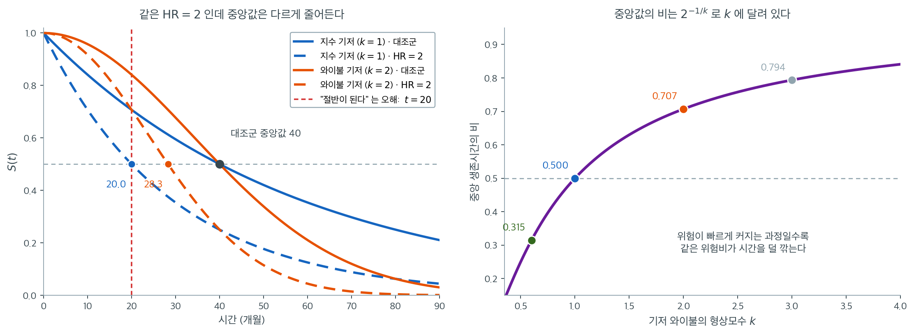

# 위험비 해석

콕스 모형은 회귀계수 $\boldsymbol{\beta}$를 추정하지만, 이 계수들은 자연스러운 척도에서 곧바로
해석되지 않는다. 표준적인 관행은 각 계수를 지수화하여 **위험비**(HR)를 얻는 것이다. 위험비는
공변량이 순간 사건율에 미치는 곱셈적 효과를 잰다.

이 절에서는 공변량 유형별로 위험비를 해석하는 방법, 신뢰구간을 구성하는 방법, 흔한 오해를
피하는 방법을 설명한다.

---

## 1. 위험비의 정의

콕스 모형을 떠올리자.

$$
h(t \mid \mathbf{x}) = h_0(t) \exp(\boldsymbol{\beta}^\top \mathbf{x})
$$

다른 공변량을 모두 고정한 채 공변량 $x_j$가 한 단위 증가할 때의 위험비는

$$
\text{HR}_j = \frac{h(t \mid x_j + 1, \mathbf{x}_{-j})}{h(t \mid x_j, \mathbf{x}_{-j})} = \exp(\beta_j)
$$

이다. 기저위험 $h_0(t)$가 소거되고 비가 $t$에 의존하지 않는다(비례위험 성질).

---

## 2. 공변량 유형별 해석

### 이항 공변량

이항 공변량(예: 처리면 $x = 1$, 대조면 $x = 0$)에 대해,

$$
\text{HR} = \exp(\hat{\beta})
$$

- $\text{HR} > 1$: 처리군의 위험이 **더 높다**(생존이 짧고 사건이 많다).
- $\text{HR} < 1$: 처리군의 위험이 **더 낮다**(생존이 길고 사건이 적다).
- $\text{HR} = 1$: 두 집단에 차이가 없다.

!!! example "생존에 대한 처리 효과"

    수술 후 생존에 대한 콕스 모형이 신약(1로 부호화) 대 표준 치료(0)에 대해
    $\hat{\beta} = -0.35$를 주었다. 위험비는 $\text{HR} = e^{-0.35} = 0.705$다. 다른
    공변량을 고정할 때 신약을 받은 환자의 사망 위험이 임의의 시점에서 29.5% 낮다.

### 연속형 공변량

연속형 공변량(예: 나이(년))에 대해 $\exp(\hat{\beta})$는 **한 단위** 증가에 대한 위험비다.
실무적 해석에는 척도가 너무 미세할 수 있다.

$c$ 단위 증가에 대한 위험비는

$$
\text{HR}_c = \exp(c \cdot \hat{\beta})
$$

이다.

!!! example "부도에 대한 나이 효과"

    대출 부도에 대한 콕스 모형이 연 단위로 $\hat{\beta}_{\text{age}} = 0.03$을 주었다.
    연 단위 HR은 $e^{0.03} = 1.030$이다(연간 위험 3.0% 증가). 10년 단위 HR은
    $e^{10 \times 0.03} = e^{0.3} = 1.350$이다(차입자 나이 10년 증가당 위험 35.0% 증가).

### 수준이 셋 이상인 범주형 공변량

수준이 $G$개인 범주형 변수는 기준범주에 대해 $G - 1$개의 가변수로 부호화된다. 각 위험비는 한
수준을 기준범주와 비교한다.

!!! example "산업 효과"

    기업 부도에 대한 콕스 모형이 세 수준의 산업을 포함한다. 제조(기준), 소매
    ($\hat{\beta}_1 = 0.45$), 기술($\hat{\beta}_2 = -0.20$).

    - 소매 대 제조: $\text{HR} = e^{0.45} = 1.57$. 소매 기업이 제조 기업의 1.57배 비율로
      부도를 낸다.
    - 기술 대 제조: $\text{HR} = e^{-0.20} = 0.82$. 기술 기업이 제조 기업의 0.82배 비율로
      부도를 낸다.

---

## 3. 위험비의 신뢰구간

$\beta_j$의 $100(1 - \alpha)\%$ 신뢰구간은

$$
\hat{\beta}_j \pm z_{\alpha/2} \cdot \text{se}(\hat{\beta}_j)
$$

이며 $\text{se}(\hat{\beta}_j) = \sqrt{[\mathcal{I}^{-1}]_{jj}}$는 관측 정보행렬의
역행렬에서 얻는다.

양 끝점을 지수화하면 위험비의 신뢰구간을 얻는다.

$$
\text{CI}_{\text{HR}} = \bigl(\exp(\hat{\beta}_j - z_{\alpha/2} \cdot \text{se}),\; \exp(\hat{\beta}_j + z_{\alpha/2} \cdot \text{se})\bigr)
$$

구간이 1을 포함하지 않으면 그 공변량은 유의수준 $\alpha$에서 통계적으로 유의한 효과를 갖는다.

---

## 4. 단일 계수의 가설검정

$H_0: \beta_j = 0$(동등하게 $\text{HR}_j = 1$)에 대한 **왈드 검정**은

$$
z = \frac{\hat{\beta}_j}{\text{se}(\hat{\beta}_j)} \;\xrightarrow{d}\; N(0, 1)
$$

이다. p-값은 $2[1 - \Phi(|z|)]$이며, $\Phi$는 표준정규 누적분포함수다. 대안으로 가능도비
검정이 그 공변량을 넣은 경우와 뺀 경우의 부분 로그가능도를 비교한다.

19장에서 보았듯 왈드 검정은 효과가 매우 클 때 힘을 잃을 수 있으므로(하우크-도너 현상),
형식적 검정에는 가능도비 검정이 더 안전하다.

---

## 5. 흔한 오해

!!! warning "위험비는 상대위험도가 아니다"

    $\text{HR} = 2$는 "사건을 겪을 가능성이 두 배"라는 뜻이 **아니다.** 모든 시점에서
    **순간율**이 두 배라는 뜻이다. 사건의 누적확률은 위험비만이 아니라 위험 궤적 전체에
    달려 있다.

!!! warning "HR가 중앙 생존시간의 단축을 뜻하지 않는다"

    $\text{HR} = 2$는 중앙 생존시간이 절반이 된다는 뜻이 아니다. 위험비와 중앙 생존시간의
    관계는 기저위험의 모양에 달려 있다. 예컨대 기저가 지수분포이면 중앙값이 정확히 절반이
    되지만, 형상 $k$인 와이불이면 $2^{-1/k}$배가 된다. $k = 2$이면 $0.707$배로 절반보다
    훨씬 덜 줄어든다.

왼쪽 그림에서 대조군 두 곡선은 기저의 모양만 다를 뿐 **중앙 생존시간이 40개월로 똑같다.** 각각에 $\text{HR} = 2$를 적용한 것이 점선이며, 비례위험 모형에서 이는 $S_1(t) = S_0(t)^2$을 뜻한다. 그런데 새 중앙값이 지수 기저에서는 $20.0$, 와이불 $k = 2$ 기저에서는 $28.3$이다. **같은 "위험이 두 배"인데 잃는 시간이 20개월과 11.7개월로 두 배 가까이 차이 난다.**

붉은 세로선이 흔한 오해의 자리다. "위험비가 2면 생존시간이 절반"이라는 계산은 기저가 지수분포일 때만 맞는다. 그 경우에만 $S_0(t) = e^{-\lambda t}$이므로 $S_0(t)^2 = e^{-2\lambda t}$가 되어 시간 척도가 정확히 절반으로 압축되기 때문이다. 다른 기저에서는 이 압축이 균일하지 않다.

오른쪽이 그 관계를 한 줄로 정리한다. 기저가 형상 $k$인 와이불이면 중앙값의 비가 $\text{HR}^{-1/k}$이므로, $\text{HR} = 2$에서 $k = 0.6$이면 $0.315$배, $k = 1$이면 $0.500$배, $k = 2$이면 $0.707$배, $k = 3$이면 $0.794$배다. **위험이 빠르게 커지는 과정일수록 같은 위험비가 시간을 덜 깎는다.** 직관적으로, 위험이 가파르게 오르는 과정에서는 곡선이 급하게 떨어지므로 위험을 두 배로 올려도 $0.5$에 닿는 시점이 조금밖에 앞당겨지지 않는다.

그래서 환자나 경영진에게 결과를 전할 때 $\text{HR}$을 "몇 배 빨리"로 옮겨 말하면 안 된다. 시간 척도의 해석이 필요하면 21.3절의 AFT 모형을 적합하거나, 제한 평균 생존시간의 차이를 "평균 몇 개월 손해"로 보고하는 편이 정직하다. 위험비는 **순간율의 비**이지 시계의 배율이 아니다.

그 밖의 함정:

- **조건부성.** HR는 다른 모든 공변량을 고정한 조건부 값이다. 다른 공변량을 조건으로 하지
  않은 주변 위험비는 교란 때문에 상당히 다를 수 있다.
- **비례위험 위배.** 비례위험 가정이 위배되면 추정된 HR는 시간에 걸쳐 평균한 요약값이며,
  어느 특정 시점의 공변량 효과도 대표하지 못할 수 있다.

---

## 6. 요약표

| 공변량 유형 | HR 공식 | 해석 |
|:---------------|:-----------|:---------------|
| 이항(0/1) | $e^{\hat{\beta}}$ | 집단 0 대비 집단 1의 위험 |
| 연속형(1단위) | $e^{\hat{\beta}}$ | 한 단위 증가당 위험 변화 |
| 연속형($c$단위) | $e^{c\hat{\beta}}$ | $c$단위 증가당 위험 변화 |
| 범주형($G$수준) | $e^{\hat{\beta}_g}$ | 수준 $g$ 대 기준수준 |

---

## 연습문제

**연습문제 1.** 
콕스 모형의 해석

직원 이직에 대한 콕스 모형이 공변량 세 개를 포함한다. 추정된 계수와 표준오차는 다음과 같다.

| 공변량 | $\hat{\beta}$ | $\text{se}(\hat{\beta})$ |
|:----------|:-------------:|:------------------------:|
| 급여(\$10k 단위) | $-0.18$ | $0.06$ |
| 재택근무(1 = 예) | $-0.42$ | $0.15$ |
| 관리자(1 = 예) | $0.31$ | $0.12$ |

**(a)** 각 공변량의 위험비를 계산하고 해석하라.

**(b)** 재택근무 위험비의 95% 신뢰구간을 계산하라.

**(c)** 5% 수준에서 유의한 공변량은 무엇인가?

??? success "풀이"

    **(a)**

    - 급여: $\text{HR} = e^{-0.18} = 0.835$. 급여가 \$10k 오를 때마다 이직 위험이 16.5%
      낮아지는 것과 연관된다.
    - 재택근무: $\text{HR} = e^{-0.42} = 0.657$. 재택근무자의 이직 위험이 출근자보다 34.3%
      낮다.
    - 관리자: $\text{HR} = e^{0.31} = 1.363$. 관리자의 이직 위험이 비관리자보다 36.3% 높다.

    **(b)** $\beta$의 신뢰구간은 $-0.42 \pm 1.96 \times 0.15 = (-0.714,\ -0.126)$이고,
    HR의 신뢰구간은 $(e^{-0.714},\ e^{-0.126}) = (0.490,\ 0.882)$다. 구간이 1을 포함하지
    않으므로 재택근무가 이직을 유의하게 줄인다.

    **(c)** 왈드 검정에서 $|z| = |\hat{\beta}|/\text{se}$이므로 급여 $3.00$, 재택근무 $2.80$,
    관리자 $2.58$이다. 셋 다 $z_{0.025} = 1.96$을 넘으므로 세 공변량 모두 5% 수준에서
    유의하다.

    !!! warning "\"연관\"이지 \"인과\"가 아니다"
        (a)의 급여 해석에서 "연관된다"라고 쓴 것에 주의하라. 이 자료는 관찰자료이므로 급여를
        올리면 이직이 줄어든다는 인과적 결론을 뒷받침하지 않는다. 성과가 좋은 직원이 급여도
        높고 이직도 적을 수 있으며(교란), 그 경우 급여 인상 자체는 효과가 없을 수 있다.
        1장에서 다룬 관찰연구의 한계가 그대로 적용된다.

        마찬가지로 관리자의 HR가 높은 것도 "승진시키면 이직한다"는 뜻이 아니다. 이직 의사가
        있는 사람이 관리자 직책을 협상 카드로 쓸 수도 있고, 관리자 직무가 외부 시장에서 더
        가치 있게 평가될 수도 있다.

---

**연습문제 2.** 
단위를 바꾸면 계수가 어떻게 되는가

본문 보기의 나이 계수는 연 단위로 $\hat\beta = 0.03$이다.

**(a)** 나이를 **10년 단위**로 다시 부호화하면 계수와 위험비는 각각 얼마가 되는가?

**(b)** 표준오차와 왈드 $z$ 값은 어떻게 되는가?

**(c)** 단위를 바꾸면 "유의성" 이 달라지는가?

??? success "풀이"

    **(a)** $x' = x/10$으로 바꾸면 $\beta' x' = \beta x$가 되어야 하므로 $\beta' = 10\beta = 0.3$
    이고 $\text{HR}' = e^{0.3} = 1.350$이다. 본문이 적은 "10년당 $35.0\%$ 증가" 와 같은 수다.

    **(b)** 표준오차도 같은 배수로 커진다. $\text{se}(\beta') = 10\,\text{se}(\beta)$다.

    **(c)** 달라지지 않는다. $z = \beta'/\text{se}(\beta') = 10\beta/(10\,\text{se}(\beta))$로
    배수가 약분되기 때문이다. **단위 선택은 읽기 편하라고 하는 것이지 증거의 세기를 바꾸지
    않는다.** 신뢰구간도 지수화 전에 같은 배수로 늘어났다가 지수화하면서 거듭제곱이 되므로,
    HR 구간은 $(\text{하한}^{10},\ \text{상한}^{10})$으로 옮겨 간다. $\square$

---

**연습문제 3.** 
기준범주를 바꾸기

본문 산업 보기에서 제조가 기준이고 소매 $\hat\beta_1 = 0.45$, 기술 $\hat\beta_2 = -0.20$이다.

**(a)** 소매 대 기술의 위험비를 구하라.

**(b)** 기준을 기술로 바꾸면 세 계수는 각각 얼마가 되는가?

**(c)** 기준을 바꾸면 모형의 적합도(로그가능도)가 달라지는가?

??? success "풀이"

    **(a)** 두 위험을 나누면 기저와 공통 항이 약분되어

    $$
    \frac{h_{\text{소매}}}{h_{\text{기술}}} = e^{0.45 - (-0.20)} = e^{0.65} = 1.916
    $$

    이다. 소매 기업이 기술 기업의 $1.92$배 비율로 부도를 낸다.

    **(b)** 새 기준이 기술이면 각 계수는 "그 수준 $-$ 기술" 이 된다.

    $$
    \beta_{\text{제조}} = 0 - (-0.20) = +0.20, \quad
    \beta_{\text{소매}} = 0.45 - (-0.20) = +0.65, \quad
    \beta_{\text{기술}} = 0
    $$

    **(c)** 전혀 달라지지 않는다. 기준범주를 바꾸는 것은 같은 $G-1$차원 공간의 **좌표만 바꾸는
    일**이라 적합값도 로그가능도도 그대로다. 바뀌는 것은 "무엇과 견주어 보고하는가" 뿐이다.
    그래서 기준범주는 통계가 아니라 **소통**의 선택이며, 보통 가장 흔하거나 가장 해석하기 쉬운
    수준을 고른다. $\square$

---

**연습문제 4.** 
위험비를 곱으로 결합하기

본문 연습문제 1의 이직 모형을 쓴다(급여 $\hat\beta = -0.18$ per \$10k, 재택 $-0.42$,
관리자 $+0.31$).

**(a)** 급여가 \$30k 높은 직원의 위험비를 구하라.

**(b)** 재택근무를 하면서 관리자인 직원과, 출근하면서 비관리자인 직원의 위험비를 구하라.

**(c)** (b)의 계산이 암묵적으로 가정하는 것은 무엇인가? 그 가정을 검사하려면 무엇을 넣어야
하는가?

??? success "풀이"

    **(a)** $e^{-0.18 \times 3} = e^{-0.54} = 0.583$이다. 위험이 $41.7\%$ 낮다. 한 단위
    효과 $0.835$를 세 번 곱한 것과 같다($0.835^3 = 0.583$).

    **(b)** 로그오즈가 아니라 로그위험이 더해지므로

    $$
    \text{HR} = e^{-0.42 + 0.31} = e^{-0.11} = 0.896
    $$

    이다. 재택근무가 낮추는 몫과 관리자가 올리는 몫이 거의 상쇄되어 $10\%$ 남짓만 낮다.

    **(c)** **교호작용이 없다**는 가정이다. 곧 재택근무의 효과가 관리자든 아니든 같다고 보는
    것이다. 실제로는 관리자에게 재택근무가 더(또는 덜) 중요할 수 있다. 검사하려면 모형에
    **교호작용 항** $x_{\text{재택}} \times x_{\text{관리자}}$를 넣고 그 계수가 $0$인지 보면
    된다. 계수가 유의하면 네 조합의 위험비를 따로 보고해야 하고, 곱으로 결합하는 위 계산은
    더 이상 쓸 수 없다. $\square$

---

**연습문제 5.** 
HR 은 시계의 배율이 아니다

본문은 기저가 형상 $k$인 와이불이면 $\text{HR}$에 대한 중앙 생존시간의 비가 $\text{HR}^{-1/k}$
임을 적었다.

**(a)** 이 관계를 $S(t) = \exp(-(\lambda t)^k)$와 $S_1 = S_0^{\text{HR}}$에서 유도하라.

**(b)** $\text{HR} = 2$, 대조군 중앙값 $40$개월일 때 $k = 1$과 $k = 2$에서의 새 중앙값을
구하라.

**(c)** $k$가 커질수록 같은 HR 이 시간을 덜 깎는 까닭을 그림의 모양으로 설명하라.

??? success "풀이"

    **(a)** 비례위험이면 $H_1(t) = \text{HR}\cdot H_0(t)$이므로
    $S_1(t) = S_0(t)^{\text{HR}}$이다. 중앙값은 $S = 1/2$인 자리이므로

    $$
    S_0(m_1)^{\text{HR}} = \tfrac12
    \quad \Longrightarrow \quad
    \exp\bigl(-\text{HR}(\lambda m_1)^k\bigr) = \tfrac12
    \quad \Longrightarrow \quad
    (\lambda m_1)^k = \frac{\ln 2}{\text{HR}}
    $$

    이고, 대조군은 $(\lambda m_0)^k = \ln 2$다. 두 식을 나누면

    $$
    \left(\frac{m_1}{m_0}\right)^k = \frac{1}{\text{HR}}
    \quad \Longrightarrow \quad
    \frac{m_1}{m_0} = \text{HR}^{-1/k}
    $$

    **(b)** $k = 1$이면 $40 \times 2^{-1} = 20.0$개월, $k = 2$이면
    $40 \times 2^{-1/2} = 28.3$개월이다. 잃는 시간이 $20$개월과 $11.7$개월로 두 배 가까이
    차이 난다.

    **(c)** $k$가 크면 위험이 가파르게 올라 생존곡선이 **급하게 떨어진다.** 곡선이 거의 절벽
    처럼 내려오면 세로로 아무리 눌러도($S \mapsto S^2$) 가로로 옮겨 가는 거리가 짧다. 반대로
    $k$가 작아 곡선이 완만하면 같은 세로 압축이 큰 가로 이동을 만든다. **시간 축의 손실은
    곡선의 기울기가 정한다**는 것이 요점이고, 그래서 위험비 하나로는 시간 척도를 말할 수 없다.
    $\square$

---

**연습문제 6.** 
그렇다면 시간으로는 어떻게 말하는가

$\text{HR} = 2$, 대조군이 지수분포이고 중앙 생존시간이 $40$개월이라 하자.

**(a)** $\tau = 40$개월까지의 **제한 평균 생존시간(RMST)** 을 두 군에서 각각 구하라
($\text{RMST} = \int_0^\tau S(t)\,dt$).

**(b)** 두 RMST 의 차이를 개월로 적고, 이것이 환자에게 무엇을 말해 주는지 적어라.

**(c)** RMST 차이를 보고할 때 반드시 함께 적어야 하는 것은 무엇인가?

??? success "풀이"

    **(a)** 지수분포이므로 $\lambda = \ln 2 / 40 = 0.017329$이고
    $S_0(t) = e^{-\lambda t}$, $S_1(t) = e^{-2\lambda t}$다.

    $$
    \text{RMST} = \int_0^\tau e^{-\lambda t}dt = \frac{1 - e^{-\lambda\tau}}{\lambda}
    $$

    에 넣으면 대조군 $\dfrac{1 - 0.5}{0.017329} = 28.85$개월, 처리군
    $\dfrac{1 - 0.25}{0.034657} = 21.64$개월이다.

    **(b)** 차이는 $7.21$개월이다. **"앞으로 $40$개월 동안 평균 $7.2$개월을 더(또는 덜)
    산다"** 는 말이고, 위험비 $2$ 보다 훨씬 이해하기 쉽다. 시간 단위라 비용·삶의 질과 곧바로
    엮인다.

    **(c)** **지평 $\tau$** 를 반드시 함께 적어야 한다. RMST 는 "$\tau$까지" 의 평균이므로
    $\tau$를 바꾸면 값이 달라진다. $\tau$를 추적 종료보다 길게 잡으면 외삽이 들어가고, 자료를
    보고 $\tau$를 고르면 다중비교 문제가 생긴다. **$\tau$는 임상적으로 뜻있는 시점으로
    미리 정한다.** $\square$

---

**연습문제 7.** 
신뢰구간을 왜 로그 척도에서 만드는가

**(a)** 본문 연습문제 1 (b)의 재택근무 HR 구간 $(0.490,\ 0.882)$가 점추정값 $0.657$에 대해
**대칭이 아님**을 확인하라.

**(b)** $\hat\beta$ 척도에서는 대칭인데 지수화하면 대칭이 깨지는 까닭을 설명하라.

**(c)** 대신 $\widehat{\text{HR}} \pm 1.96\,\text{se}(\widehat{\text{HR}})$로 구간을 만들면
어떤 문제가 생기는가?

??? success "풀이"

    **(a)** 아래쪽 폭은 $0.657 - 0.490 = 0.167$, 위쪽 폭은 $0.882 - 0.657 = 0.225$로 다르다.
    **위쪽이 더 넓다.**

    **(b)** $\hat\beta = -0.42 \pm 0.294$는 대칭이지만, 지수함수는 **볼록**이라 같은 길이의
    구간을 오른쪽에서 더 길게 늘인다. 비는 곱셈 척도의 양이므로 로그를 취해야 덧셈 척도가
    되고, 거기서 정규근사가 훨씬 잘 맞는다. $\hat\beta$의 표집분포가 정규에 가깝고
    $\widehat{\text{HR}}$의 분포는 오른쪽으로 치우쳐 있다는 사실이 바로 이것이다.

    **(c)** 두 가지가 나빠진다. 첫째, 구간의 **아래 끝이 음수**가 될 수 있는데 위험비는 양수
    여야 하므로 뜻이 없다. 둘째, $\widehat{\text{HR}}$의 분포가 치우쳐 있어 대칭 구간의
    포함률이 명목값에 못 미친다. 효과가 클수록(HR 이 $1$에서 멀수록) 어긋남이 심해진다.
    **곱셈 척도의 양은 로그에서 다루고 마지막에 지수화한다** 는 것이 원칙이고, 19장의 오즈비도
    똑같다. $\square$

---

**연습문제 8.** 
주변 위험비와 조건부 위험비

처리 효과가 두 층(위험이 높은 층과 낮은 층)에서 모두 $\text{HR} = 0.5$로 **같다**고 하자.
층을 무시하고 하나의 콕스 모형을 적합하면 어떻게 되는가.

**(a)** 시간이 흐르면서 각 층의 위험집합 구성이 어떻게 변하는지 설명하라.

**(b)** 그 결과 주변 위험비가 시간에 따라 $1$ 쪽으로 밀리는 까닭을 말하라(비붕괴성).

**(c)** 이것이 오즈비·위험비 같은 비선형 모수의 일반적 성질임을 설명하고, 선형모형의 회귀계수와
대비하라.

??? success "풀이"

    **(a)** 위험이 높은 층의 대상이 먼저 사건을 겪고 빠져나가므로, 시간이 흐를수록 위험집합은
    **위험이 낮은 층으로 치우친다.** 게다가 처리군은 위험이 절반이라 더 오래 살아남으므로,
    후반의 위험집합에서는 처리군 비중과 저위험층 비중이 함께 커진다.

    **(b)** 주변 위험비는 "그 시점의 위험집합에서 처리군과 대조군의 평균 위험의 비" 인데,
    후반으로 갈수록 대조군 쪽에 남은 사람들은 **유독 건강한 생존자들**이다. 이 선택 효과가
    대조군의 평균 위험을 낮추어 두 군의 격차를 줄인다. 그래서 층 안에서는 줄곧 $0.5$인데
    주변 위험비는 $0.5$에서 $1$ 쪽으로 밀려 올라간다. 비례위험 가정이 **층 안에서는 참인데
    주변에서는 깨지는** 상황이기도 하다.

    **(c)** 이것을 **비붕괴성**이라 한다. 오즈비도 같다. 교란이 전혀 없어도 공변량을 빼면
    조건부 값과 주변 값이 달라진다. 반면 선형모형의 회귀계수는 **붕괴한다.** 교란이 없다면
    공변량을 넣든 빼든 기울기의 기댓값이 같다. 차이는 연결함수의 비선형성에서 온다.

    실무적 결론은 하나다. **"조정했다/안 했다" 가 다른 수를 준다고 해서 반드시 교란이 있는
    것은 아니다.** 비선형 모수에서는 조정 자체가 값을 옮긴다. 교란을 판정하려면 부호의 역전
    처럼 더 강한 신호를 보거나, 인과 추론의 틀에서 주변 효과를 따로 추정해야 한다. $\square$

---

**연습문제 9.** 
왈드 검정이 힘을 잃는 자리

본문 4절은 효과가 매우 클 때 왈드 검정이 힘을 잃는다고 했다(하우크–도너 현상).

**(a)** 왈드 통계량 $z = \hat\beta/\text{se}(\hat\beta)$에서 $\hat\beta$가 커질 때
$\text{se}(\hat\beta)$가 어떻게 움직이는지 생각해, $|z|$가 오히려 작아질 수 있음을 설명하라.

**(b)** 극단으로 완전분리에 가까운 자료에서 $|z| \to 0$이 되는 장면을 그려라.

**(c)** 가능도비 검정은 왜 이 문제를 겪지 않는가? 점수검정은 어떤가?

??? success "풀이"

    **(a)** 표준오차는 관측정보의 역수 제곱근인데, 정보량은 위험집합 안 공변량 분포의 분산에
    가중치를 준 양이다. 효과가 아주 커지면 **가능도 곡면이 평평해지는 방향**이 생겨 정보량이
    줄고 $\text{se}$가 빠르게 커진다. 분자 $\hat\beta$보다 분모가 더 빨리 커지면 비 $|z|$가
    오히려 줄어든다. **증거가 강할수록 검정통계량이 작아지는** 역설이다.

    **(b)** 완전분리에 가까우면 $\hat\beta \to \infty$이면서 $\text{se} \to \infty$인데,
    후자가 더 빠르다. 소프트웨어 출력에서 $\hat\beta = 18.3$, $\text{se} = 3{,}400$,
    $z = 0.005$, $p = 0.996$ 같은 줄이 그것이다. 자료는 "이 변수가 결과를 거의 완벽히
    가른다" 고 말하는데 왈드 검정은 "아무 증거 없음" 이라고 적는다.

    **(c)** **가능도비 검정은 $\text{se}$를 쓰지 않는다.** 두 적합의 로그가능도 차이를 직접
    재므로, $\hat\beta$가 발산해도 로그가능도의 개선분은 유한하고 안정적이다. 그래서 분리
    상황에서도 올바른 방향으로 작동한다.

    점수검정은 또 다른 장점이 있다. **귀무가설 아래에서만 적합**하면 되므로 $\hat\beta$를
    아예 추정하지 않아도 되고, 따라서 발산 문제를 겪지 않는다. 다만 효과가 클 때 검정력이
    떨어진다. 실무 권고는 분명하다. **계수가 크거나 수렴 경고가 뜨면 왈드를 버리고 가능도비로
    간다.** 신뢰구간도 왈드 대신 프로파일 가능도 구간을 쓴다. $\square$

---

**연습문제 10.** 
비례위험이 깨졌을 때 보고된 HR 은 무엇인가

처리 효과가 $\beta(t)$로 시간에 따라 변하는데 상수 콕스 모형을 적합했다.

**(a)** 추정값이 $\beta(t)$의 가중평균이라는 것은 어떤 가중치를 뜻하는가? 가중치가 연구 설계에
의존한다는 점을 설명하라.

**(b)** 추적 기간을 두 배로 늘린 같은 연구가 다른 HR 을 보고하는 것이 **모순이 아닌** 까닭을
말하라.

**(c)** 메타분석에서 여러 연구의 HR 을 합치는 일이 이 성질 때문에 어떤 위험을 안는지 적고,
대안을 하나 들어라.

??? success "풀이"

    **(a)** 가중치는 각 시점의 **사건 수**와 그 시점 위험집합 안 공변량의 **분산**의 곱에
    비례한다. 사건이 많이 일어나고 두 군이 고루 섞여 있는 시간대가 평균을 지배한다. 그런데
    사건이 언제 일어나는지는 추적 기간·등록 속도·절단 양상이 정하므로, **가중치가 곧 연구
    설계의 함수**다. 자료 생성과정이 같아도 설계가 다르면 다른 가중평균이 나온다.

    **(b)** 추적을 늘리면 후반 시점의 사건이 더 쌓여 가중치가 뒤쪽으로 옮겨 간다. $\beta(t)$가
    시간에 따라 변한다면 그 가중평균도 당연히 달라진다. **두 연구는 서로 다른 양을 추정하고
    있을 뿐이고, 둘 다 자기 설계 안에서는 옳다.** 모순으로 보이는 것은 "HR 은 모집단의 고정된
    모수" 라고 가정했기 때문이다. 비례위험이 성립할 때에만 그 가정이 맞는다.

    **(c)** 메타분석은 여러 연구가 **같은 모수**를 추정한다고 보고 합친다. 비례위험이 깨져
    있으면 각 연구의 HR 이 서로 다른 가중평균이므로, 합친 값은 아무 것도 추정하지 않는
    수가 된다. 이질성 검정($I^2$)이 높게 나오겠지만, 그것을 "연구 간 차이" 로 읽으면 원인을
    놓친다. 진짜 원인은 **추적 기간의 차이**일 수 있다.

    대안은 **공통 지평에서 정의된 양을 합치는 것**이다. 예컨대 모든 연구에서 $\tau = 24$개월의
    RMST 차이나 $S(24)$의 차이를 추출해 합치면, 설계가 달라도 같은 모수를 겨냥하게 된다.
    원자료를 모을 수 있다면 시간 의존 계수를 넣은 공동 모형을 적합하는 것이 가장 낫다.
    $\square$

---

## 정리하며

계수는 **위험비**로 읽는다.

$$
\text{HR}=e^{\beta_j}
$$

- **$\text{HR}>1$ 이면 위험 증가, $<1$ 이면 감소**다. 19장의 오즈비와 같은 구조이며, 지수변환해 해석한다.
- **위험비는 시간에 걸쳐 일정하다고 가정된다.** 그것이 "비례위험"의 뜻이며, 이 가정이 깨지면 하나의 HR 로 요약하는 것 자체가 오도한다.
- **생존시간의 비가 아니다.** HR 이 $2$ 라고 생존시간이 절반이 되는 것이 아니며, 순간 위험률의 배수다. AFT 모형이라야 시간 척도의 해석을 준다.
- **교란이 여기서도 문제다.** 조정하지 않은 주변 위험비와 조정한 위험비가 크게 다를 수 있으며, 12장의 논의가 그대로 적용된다.
- **신뢰구간은 로그 척도에서 만들어 지수변환**하며, $1$ 을 포함하는지가 유의성 판정이다.

다음 절 **모형 진단**으로 넘어간다.
