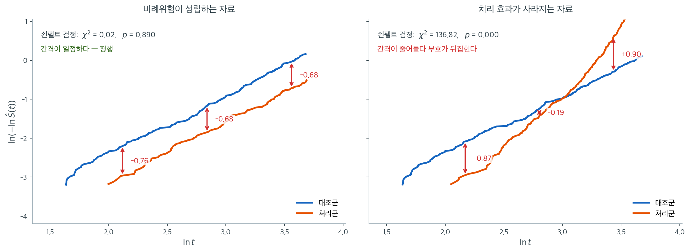

# 비례위험 가정

콕스 모형은 임의의 두 공변량 프로파일 사이의 위험비가 **시간에 걸쳐 일정하다**고 가정한다.
이것이 **비례위험(PH) 가정**이다. 이 가정이 깨지면 --- 예컨대 초기에는 보호적이지만 후반에는
해로운 처리라면 --- 추정된 위험비는 시간에 걸쳐 평균한 요약값이며 어느 특정 시점의 공변량
효과도 대표하지 못할 수 있다.

이 절에서는 비례위험 가정을 형식적으로 설명하고, 이를 점검하는 그림 방법과 통계적 방법을
제시하며, 위배되었을 때의 대응책을 논의한다.

---

## 1. 형식적 서술

콕스 모형은 다음을 설정한다.

$$
h(t \mid \mathbf{x}) = h_0(t) \exp(\boldsymbol{\beta}^\top \mathbf{x})
$$

비례위험 가정은 공변량 벡터가 $\mathbf{x}_1$과 $\mathbf{x}_2$인 임의의 두 대상에 대해

$$
\frac{h(t \mid \mathbf{x}_1)}{h(t \mid \mathbf{x}_2)} = \exp\!\bigl(\boldsymbol{\beta}^\top (\mathbf{x}_1 - \mathbf{x}_2)\bigr)
$$

가 **모든** $t \geq 0$에서 성립할 것을 요구한다. 우변은 $t$에 의존하지 않는다. 만약 의존한다면
비례위험 가정이 위배된 것이다.

---

## 2. 그림 방법

### 로그-로그 생존 그림

콕스 모형 아래에서 공변량 $\mathbf{x}$를 갖는 대상의 누적위험은

$$
H(t \mid \mathbf{x}) = H_0(t) \exp(\boldsymbol{\beta}^\top \mathbf{x})
$$

이다. 음의 로그 생존에 다시 로그를 취하면

$$
\ln\!\bigl(-\ln S(t \mid \mathbf{x})\bigr) = \ln H_0(t) + \boldsymbol{\beta}^\top \mathbf{x}
$$

이다. 두 집단(예: 처리 대 대조)에서 비례위험이 성립하면 곡선
$\ln(-\ln \hat{S}_1(t))$와 $\ln(-\ln \hat{S}_2(t))$가 시간에 걸쳐 **평행**해야 한다.
두 곡선의 수직 거리가 상수인 $\boldsymbol{\beta}^\top (\mathbf{x}_1 - \mathbf{x}_2)$와
같기 때문이다.

!!! tip "로그-로그 그림 읽는 법"

    평행한 곡선은 비례위험 가정을 뒷받침한다. 수렴하거나 발산하거나 교차하는 곡선은 비례위험이
    아님을 가리킨다. 교차하는 곡선이 위배의 가장 강력한 증거다.

    다만 위험집합이 작아지는 곡선의 양 끝에서는 두 곡선 모두 변동이 커서 평행 여부를 판단하기
    어렵다. 사건이 충분히 있는 중간 구간에서 판단하라.



두 자료 모두 각 집단 $450$명, 기저는 와이불 $k = 1.5$, 추적은 40개월에서 끊었다. 왼쪽은 처리 효과가 $\beta = -0.7$로 **시간에 걸쳐 일정한** 자료이고, 오른쪽은 $\beta(t) = -1.6 + 0.11t$로 **효과가 점점 약해지다 뒤집히는** 자료다. 양 끝의 변동이 큰 구간은 잘라 내고 사건이 충분히 쌓인 가운데 구간만 그렸다.

왼쪽에서 두 곡선의 수직 간격을 세 지점에서 재면 $-0.76$, $-0.68$, $-0.68$이다. 이 자료에 콕스 모형을 적합하면 $\hat\beta = -0.680$이 나오는데, **간격이 곧 $\hat\beta$다.** 우연이 아니라 항등식 $\ln(-\ln S(t \mid \mathbf{x})) = \ln H_0(t) + \boldsymbol{\beta}^\top\mathbf{x}$의 결과다. 기저 항 $\ln H_0(t)$가 두 집단에 공통이므로 빼면 사라지고 $\beta$만 남는다. 쇤펠트 검정도 $\chi^2 = 0.02$, $p = 0.890$으로 위배의 흔적이 없다.

오른쪽은 같은 세 지점의 간격이 $-0.87$, $-0.19$, $+0.90$이다. **부호가 바뀐다.** 초반에는 처리군의 누적위험이 대조군보다 낮지만 후반에는 높아진다는 뜻이고, 그림에서도 두 곡선이 $\ln t \approx 3.0$ 부근에서 교차한다. 쇤펠트 검정은 $\chi^2 = 136.82$, $p < 0.001$로 압도적으로 기각한다.

여기서 반드시 짚어야 할 것이 있다. 오른쪽 자료에 그냥 콕스 모형을 적합하면 $\hat\beta = +0.783$, 곧 $\text{HR} = 2.19$가 나온다. "처리가 위험을 두 배로 높인다"는 결론이다. 그런데 참 계수는 $t = 0$에서 $-1.6$(강한 보호)이고 $t = 40$에서 $+2.8$(강한 해악)이다. **$2.19$라는 수는 어느 시점의 진실도 아니며, 하필 $t \approx 22$개월 부근에서만 맞는 시간 평균값이다.** 비례위험이 깨진 자료에서 위험비 하나를 보고하는 것이 왜 위험한지가 이 숫자에 있다.

### 관측 대 기대 생존 그림

각 집단의 카플란-마이어 곡선을 콕스 모형이 예측한 생존곡선과 비교한다. 체계적인 어긋남은
모형이 잘못 지정되었음을 시사한다.

---

## 3. 쇤펠트 검정

비례위험 가정에 대한 형식적 통계검정은 **쇤펠트 잔차**에 근거한다(Grambsch and Therneau, 1994).

시점 $t_{(j)}$의 각 사건과 각 공변량 $x_k$에 대해 쇤펠트 잔차는

$$
r_{jk} = x_{i_j, k} - \bar{x}_{jk}(\hat{\boldsymbol{\beta}})
$$

이다. 여기서 $x_{i_j, k}$는 사건을 겪은 대상의 공변량 $k$의 값이고, $\bar{x}_{jk}$는 시점
$t_{(j)}$의 위험집합 가중평균이다.

비례위험 가정 아래에서 쇤펠트 잔차는 **시간에 걸쳐 체계적인 추세를 갖지 않는다.** 검정 절차는
다음과 같다.

1. 각 공변량의 척도화된 쇤펠트 잔차를 계산한다.
2. 척도화된 잔차를 시간의 함수(보통 $t$, $\ln t$, 또는 $t$의 카플란-마이어 변환)에 회귀시킨다.
3. 기울기가 0과 유의하게 다른지 검정한다.

공변량 $k$의 검정통계량은

$$
\chi^2_k = \frac{\left(\sum_{j} g(t_{(j)}) \, r_{jk}^*\right)^2}{\text{Var}\left(\sum_{j} g(t_{(j)}) \, r_{jk}^*\right)}
$$

이며 $r_{jk}^*$는 척도화된 쇤펠트 잔차이고 $g(t)$는 선택한 시간 함수다. $H_0$(비례위험 성립)
아래에서 $\chi^2_k \sim \chi^2_1$이다.

모든 공변량의 비례위험을 동시에 검정하는 **전역 검정**도 있으며 자유도는 $p$(공변량당 1)다.

!!! example "쇤펠트 검정 출력"

    공변량 두 개(나이와 처리)를 갖는 콕스 모형의 결과다.

    | 공변량 | $\chi^2$ | p-값 |
    |:----------|:--------:|:-------:|
    | 나이 | 0.82 | 0.365 |
    | 처리 | 7.45 | 0.006 |
    | 전역 | 8.31 | 0.016 |

    나이에 대해서는 비례위험 가정이 성립하지만 처리에 대해서는 위배된다. 처리 효과가 시간에
    따라 변한다.

---

## 4. 비례위험 위배에 대한 대응

어떤 공변량에서 비례위험 가정이 깨지면 몇 가지 전략을 쓸 수 있다.

### 1. 층화

문제가 된 공변량으로 기저위험을 나눈다. 두 수준을 갖는 이항변수 $z$에 대해 층화 콕스 모형은

$$
h(t \mid \mathbf{x}, z=g) = h_{0g}(t) \exp(\boldsymbol{\beta}^\top \mathbf{x})
$$

이다. 각 층 $g$가 자신의 기저위험을 갖지만 공변량 효과 $\boldsymbol{\beta}$는 공유한다.
층화를 쓰면 별도의 모형을 세우지 않고도 집단마다 위험의 모양이 다를 수 있게 된다.

**대가:** 층화에 쓴 변수의 위험비는 **더 이상 추정할 수 없다.** 그 변수의 효과가 기저위험
안으로 흡수되기 때문이다. 처리 효과 자체가 관심사라면 층화는 적절한 선택이 아니다.

### 2. 시간에 따라 변하는 계수

상수 $\beta_k$를 시간 의존 계수 $\beta_k(t)$로 바꾼다.

$$
h(t \mid \mathbf{x}) = h_0(t) \exp\!\left(\sum_{k} \beta_k(t) \, x_k\right)
$$

간단한 접근은 공변량과 시간 함수의 교호작용(예: $x_k \cdot \ln t$)을 넣는 것이다.

$$
h(t \mid \mathbf{x}) = h_0(t) \exp(\beta_k x_k + \gamma_k x_k \ln t)
$$

$\gamma_k = 0$이면 표준 콕스 모형으로 돌아간다. 따라서 $\gamma_k = 0$의 검정이 곧 비례위험
가정의 검정이기도 하다.

### 3. 조각별 콕스 모형

시간축을 구간으로 나누고 각 구간에서 별도의 콕스 모형을 적합하거나 별도의 계수를 추정한다.
미리 정한 시간창에 걸쳐 위험비가 변할 수 있게 된다.

구간의 경계는 반드시 자료를 보기 **전에** 정해야 한다. 자료를 보고 위험비가 바뀌는 지점을
고르면 그 자체가 다중비교 문제가 되어 p-값이 무효가 된다.

!!! warning "비례위험 위배를 무시하지 말 것"

    비례위험 가정이 위배되면 보고된 위험비는 오도한다. 어느 특정 시점에서도 성립하지 않을 수
    있는 시간 평균 효과를 나타내기 때문이다. 콕스 모형 결과를 해석하기 전에 반드시 가정을
    점검하라.

    다만 반대 극단도 경계하라. 표본이 아주 크면 실무적으로 무의미한 작은 위배도 쇤펠트 검정이
    유의하게 잡아낸다. p-값과 함께 척도화 잔차의 **추세 그림**을 보고 효과 변화의 크기가
    실제로 중요한지 판단해야 한다.

---

## 연습문제

<div class="drillbox" markdown>

**연습문제 1.** <span class="diff easy" title="쉬움"></span>
비례위험 가정

공변량 두 개(나이와 처리)를 갖는 콕스 모형의 쇤펠트 검정 결과다.

| 공변량 | $\chi^2$ | p-값 |
|:----------|:--------:|:-------:|
| 나이 | 1.23 | 0.267 |
| 처리 | 6.89 | 0.009 |
| 전역 | 7.54 | 0.023 |

**(a)** 어느 공변량에서 비례위험 가정이 위배된 것으로 보이는가?

**(b)** 위배에 대한 대응책 두 가지를 제시하라.

</div>

??? success "풀이"

    **(a)** 처리에 대해 비례위험 가정이 위배된다($p = 0.009 < 0.05$). 나이는 그렇지 않다
    ($p = 0.267$). 전역 검정도 기각하므로($p = 0.023$) 적어도 하나의 위배가 있음을 확인해 준다.

    **(b)** 두 가지 대응책.

    1. **층화:** 처리 집단마다 별도의 기저위험을 갖는 층화 콕스 모형을 적합하고, 나이 효과만
       회귀계수로 추정한다.
    2. **시간 의존 계수:** 처리 $\times \ln(t)$ 교호작용 항을 넣어 처리 효과가 시간에 따라
       변할 수 있게 한다.

    !!! note "무엇이 관심사인지에 따라 선택이 달라진다"
        두 대응책은 얻는 것이 다르다.

        - **층화**는 처리의 위험비를 **포기한다.** 처리 효과가 기저위험에 흡수되므로 더 이상
          $\text{HR}_{\text{처리}}$를 보고할 수 없다. 처리가 성가신 변수이고 나이 효과가
          관심사라면 이것으로 충분하고 계산도 간단하다.
        - **시간 의존 계수**는 처리 효과를 유지하되 그것이 시간의 함수임을 인정한다.
          $\beta(t) = \beta + \gamma\ln t$이므로, 예컨대 $\hat\beta = -0.8$,
          $\hat\gamma = 0.3$이면 $t = 1$에서 $\text{HR} = e^{-0.8} = 0.45$(보호적)이지만
          $t = 15$에서 $\text{HR} = e^{-0.8 + 0.3\ln 15} = e^{0.012} = 1.01$(효과 소멸)이 된다.

        임상시험처럼 처리 효과 자체가 결론인 상황에서는 시간 의존 계수를 써야 한다. 층화하면
        정작 답해야 할 질문에 답하지 못한다.

        세 번째 선택지도 있다. 비례위험을 아예 요구하지 않는 **제한 평균 생존시간(RMST)의
        차이**를 보고하는 것이다. 로그순위 절 연습문제 3에서 언급한 대로, 이 방법은 효과크기가
        "평균 생존기간의 차이(개월)"로 해석되어 소통에도 유리하다.

---

<div class="drillbox" markdown>

**연습문제 2.** <span class="diff easy" title="쉬움"></span>
로그-로그 그림에서 계수 읽기

두 집단의 로그-로그 생존곡선 $\ln(-\ln \hat S_g(t))$의 수직 간격을 세 시점에서 쟀더니
$-0.71$, $-0.68$, $-0.70$이었다.

**(a)** 비례위험 가정이 성립한다고 볼 수 있는가?

**(b)** $\hat\beta$와 위험비는 얼마로 읽히는가?

</div>

??? success "풀이"

    **(a)** 세 간격이 $-0.71 \sim -0.68$ 안에 있어 사실상 상수다. 두 곡선이 평행하다는
    뜻이므로 비례위험 가정과 어긋나지 않는다.

    **(b)** 본문의 항등식

    $$
    \ln\!\bigl(-\ln S(t \mid \mathbf{x})\bigr) = \ln H_0(t) + \boldsymbol{\beta}^\top \mathbf{x}
    $$

    에서 기저 항 $\ln H_0(t)$는 두 집단에 공통이므로 빼면 사라진다. 남는 수직 간격이 곧
    $\boldsymbol{\beta}^\top(\mathbf{x}_1 - \mathbf{x}_2)$다. 처리를 $z = 1$, 대조를
    $z = 0$으로 두면 간격이 바로 $\beta$이므로

    $$
    \hat\beta \approx -0.70, \qquad \widehat{\text{HR}} = e^{-0.70} = 0.497
    $$

    이다. 처리군의 위험이 대조군의 절반쯤이라는 뜻이다. $\square$

    간격을 **한 지점에서만** 재면 안 된다는 점도 함께 기억하라. 비례위험이 깨진 자료에서도
    어느 한 시점의 간격은 언제나 존재한다. 여러 시점에서 재어 **같은 값이 나오는지**를 보는
    것이 요점이다.

---

<div class="drillbox" markdown>

**연습문제 3.** <span class="diff easy" title="쉬움"></span>
위험비가 시간에 의존하지 않는다는 말

콕스 모형 $h(t \mid \mathbf{x}) = h_0(t)\exp(\boldsymbol\beta^\top \mathbf{x})$에서 나이
$a$(세)와 처리 $z \in \{0, 1\}$를 쓰고 $\beta_{\text{나이}} = 0.04$,
$\beta_{\text{처리}} = -0.7$이라 하자.

**(a)** 60세 처리군과 50세 대조군의 위험비를 구하고, 그 값이 $t$에 의존하지 않는 까닭을
기저위험 $h_0$의 모양을 쓰지 않고 설명하라.

**(b)** 기저위험이 와이불($h_0(t) = \lambda k t^{k-1}$)이든 상수든 (a)의 답이 달라지지
않는다. 그렇다면 비례위험 가정은 기저위험의 **무엇**을 제약하는가?

</div>

??? success "풀이"

    **(a)** 두 위험을 나누면 기저위험이 약분된다.

    $$
    \frac{h(t \mid a = 60, z = 1)}{h(t \mid a = 50, z = 0)}
    = \frac{h_0(t)\,e^{0.04 \times 60 - 0.7}}{h_0(t)\,e^{0.04 \times 50}}
    = e^{0.04 \times 10 - 0.7} = e^{-0.3} = 0.741
    $$

    $h_0(t)$가 분자와 분모에 **똑같이** 들어 있으므로 그 모양이 무엇이든 사라진다. 비례위험
    가정의 내용이 바로 이 약분이다.

    **(b)** 비례위험 가정은 기저위험의 모양을 **전혀 제약하지 않는다.** 위험이 커지든
    작아지든 들쭉날쭉하든 상관없다. 제약하는 것은 **공변량이 위험에 들어가는 방식**이다.
    공변량은 시간에 무관한 상수배 $\exp(\boldsymbol\beta^\top\mathbf{x})$로만 작용해야 한다.
    콕스 모형이 "준모수적"이라 불리는 까닭이 여기 있다. $h_0$는 자유롭게 두고
    $\boldsymbol\beta$만 모수로 두기 때문이다. $\square$

---

<div class="drillbox" markdown>

**연습문제 4.** <span class="diff med" title="중간"></span>
로그-로그 변환의 유도

$S(t \mid \mathbf{x}) = \exp\bigl(-H(t \mid \mathbf{x})\bigr)$와
$H(t \mid \mathbf{x}) = H_0(t)\exp(\boldsymbol\beta^\top\mathbf{x})$에서 출발하여
$\ln(-\ln S(t \mid \mathbf{x})) = \ln H_0(t) + \boldsymbol\beta^\top\mathbf{x}$를 유도하고,
두 공변량 프로파일의 곡선이 **수직으로 평행이동한 꼴**임을 보여라. 가로축을 $t$가 아니라
$\ln t$로 잡는 관행은 이 결론에 영향을 주는가?

</div>

??? success "풀이"

    생존함수에 로그를 취하면 $\ln S = -H$이므로 $-\ln S = H$이고, 다시 로그를 취하면

    $$
    \ln(-\ln S(t \mid \mathbf{x})) = \ln H(t \mid \mathbf{x})
    = \ln\!\bigl(H_0(t) e^{\boldsymbol\beta^\top\mathbf{x}}\bigr)
    = \ln H_0(t) + \boldsymbol\beta^\top\mathbf{x}
    $$

    이다. **곱이 합이 되는 자리**가 요점이다. 비례위험은 누적위험에 상수배로 들어가는데,
    로그가 그 상수배를 상수 **덧셈**으로 바꾼다.

    두 프로파일 $\mathbf{x}_1$, $\mathbf{x}_2$에 대해 차를 잡으면

    $$
    \ln(-\ln S_1(t)) - \ln(-\ln S_2(t)) = \boldsymbol\beta^\top(\mathbf{x}_1 - \mathbf{x}_2)
    $$

    로 $t$가 사라진다. 곧 한 곡선은 다른 곡선을 세로로 그만큼 밀어 놓은 것이다.

    **가로축을 $\ln t$로 잡아도 결론은 그대로다.** 위 차이는 $t$를 어떻게 눈금 매기든
    상수이기 때문이다. $\ln t$를 쓰는 것은 순전히 보기 위한 선택이다. 사건이 초반에 몰리는
    생존자료에서 $t$ 축을 쓰면 왼쪽이 뭉개지는데, 로그를 씌우면 그 구간이 펴져 평행 여부를
    눈으로 가리기 쉬워진다. 덤으로 기저가 와이불이면 $\ln H_0(t) = \ln\lambda + k\ln t$라
    곡선이 **직선**이 되어 판단이 한결 쉽다. $\square$

---

<div class="drillbox" markdown>

**연습문제 5.** <span class="diff med" title="중간"></span>
시간 의존 계수가 말하는 것

본문의 대응책 가운데 $\beta(t) = \beta + \gamma \ln t$ 꼴을 쓴다. 어떤 자료에서
$\hat\beta = -1.20$, $\hat\gamma = 0.45$를 얻었다(시간 단위는 개월).

**(a)** $t = 1, 6, 24$개월에서의 위험비를 구하라.

**(b)** 위험비가 $1$이 되는 시점을 구하고, 그 전후로 처리의 뜻이 어떻게 달라지는지 말하라.

**(c)** 이 모형에 비례위험 가정을 다시 씌우는 것은 어떤 귀무가설인가?

</div>

??? success "풀이"

    **(a)** $\text{HR}(t) = \exp(\hat\beta + \hat\gamma\ln t)$에 넣는다.

    $$
    \begin{aligned}
    \text{HR}(1) &= e^{-1.20 + 0.45\ln 1} = e^{-1.20} = 0.301 \\
    \text{HR}(6) &= e^{-1.20 + 0.45\ln 6} = e^{-0.394} = 0.674 \\
    \text{HR}(24) &= e^{-1.20 + 0.45\ln 24} = e^{+0.230} = 1.259
    \end{aligned}
    $$

    **(b)** $\text{HR}(t) = 1 \iff \beta + \gamma\ln t = 0 \iff t = e^{-\beta/\gamma}$이므로

    $$
    t^{*} = e^{1.20/0.45} = e^{2.667} = 14.4 \text{ 개월}
    $$

    이다. 그 전에는 처리가 **보호적**이고($\text{HR} < 1$) 그 뒤로는 **해로워진다.**
    이런 자료에 상수 위험비 하나를 보고하면 두 국면을 한 수로 뭉개게 된다.

    **(c)** $H_0: \gamma = 0$이다. $\gamma = 0$이면 $\beta(t) = \beta$로 상수가 되어 표준
    콕스 모형으로 돌아간다. 그러므로 **$\gamma$에 대한 왈드 검정이 곧 비례위험 검정**이고,
    쇤펠트 검정과 같은 질문을 다른 길로 묻는 것이다. $\square$

    $\ln t$를 쓰는 데에는 까닭이 있다. $t$를 그대로 쓰면 추적 후반의 몇 안 되는 사건이
    교호작용 항을 좌우하는데, 로그가 그 지렛대를 눌러 준다. 다만 $t < 1$에서
    $\ln t < 0$이라 시간 단위를 개월에서 일로 바꾸면 $\hat\beta$의 뜻이 달라진다는 점은
    주의해야 한다. $\hat\beta$는 언제나 **$t = 1$ 단위 시점**의 로그 위험비다.

---

<div class="drillbox" markdown>

**연습문제 6.** <span class="diff med" title="중간"></span>
층화가 포기하는 것

성별 $z \in \{\text{남}, \text{여}\}$에서 비례위험이 깨져 성별로 층화한 콕스 모형
$h(t \mid \mathbf{x}, z = g) = h_{0g}(t)\exp(\boldsymbol\beta^\top\mathbf{x})$를 적합했다.

**(a)** 이 모형의 부분가능도에서 한 사건이 기여하는 항을 쓰고, 위험집합이 어떻게 달라지는지
설명하라.

**(b)** 성별의 위험비를 추정할 수 없는 까닭을 (a)에서 읽어라.

**(c)** 층별 인원이 아주 작으면(예: 층마다 $3$명) 무엇이 문제가 되는가?

</div>

??? success "풀이"

    **(a)** 층 $g$의 시점 $t_{(j)}$에 대상 $i$가 사건을 겪었다면 그 기여는

    $$
    \frac{\exp(\boldsymbol\beta^\top\mathbf{x}_i)}{\sum_{\ell \in R_g(t_{(j)})} \exp(\boldsymbol\beta^\top\mathbf{x}_\ell)}
    $$

    이고 전체 부분가능도는 층마다 이런 항을 곱한 것이다. **위험집합 $R_g$가 같은 층 안으로
    좁혀진다**는 것이 층화의 전부다. 남성의 사건은 남성하고만, 여성의 사건은 여성하고만
    견준다.

    **(b)** 같은 층 안에서는 모든 대상이 같은 $z$ 값을 가지므로, $z$의 계수는 분자와 분모에
    똑같이 들어가 약분된다. 부분가능도가 $\beta_z$에 **전혀 의존하지 않으니** 추정할 자료가
    없는 것이다. 성별의 효과는 $h_{0\text{남}}$과 $h_{0\text{여}}$라는 두 기저위험의 차이
    안으로 들어가 버렸고, 콕스 모형은 기저위험을 추정하지 않는다.

    **(c)** 층이 잘게 쪼개지면 각 위험집합이 작아져 **쓸 수 있는 비교 쌍이 줄어든다.** 극단
    으로 층마다 사건이 하나뿐이면 그 층의 기여가 $1$에 가까워져 정보를 거의 주지 못한다.
    층화는 공짜가 아니며, 층을 늘릴수록 $\boldsymbol\beta$의 표준오차가 커진다. 연속변수로
    층화할 때 구간을 지나치게 잘게 나누지 말라는 권고가 여기서 나온다. $\square$

---

<div class="drillbox" markdown>

**연습문제 7.** <span class="diff med" title="중간"></span>
쇤펠트 잔차가 0 둘레에 머문다는 말

시점 $t_{(j)}$에서 사건을 겪은 대상의 공변량을 $x_{i_j}$, 위험집합의 가중평균을
$\bar x_j(\boldsymbol\beta) = \sum_{\ell \in R_j} x_\ell w_\ell$($w_\ell$은
$\exp(\beta x_\ell)$을 정규화한 가중치)이라 할 때 쇤펠트 잔차는
$r_j = x_{i_j} - \bar x_j(\hat{\boldsymbol\beta})$다.

**(a)** 참 $\beta$ 아래에서 $E[r_j \mid R_j] = 0$임을 보여라.

**(b)** 비례위험이 깨져 참 계수가 $\beta(t)$라면 $r_j$가 시간에 대해 어떤 추세를 보이는지
설명하라.

**(c)** 검정에서 $g(t) = t$ 대신 $g(t) = \ln t$나 카플란-마이어 변환을 쓰는 까닭은
무엇인가?

</div>

??? success "풀이"

    **(a)** 콕스 모형의 부분가능도 아래에서, 위험집합 $R_j$가 주어졌을 때 그 가운데 누가
    사건을 겪는지는 가중치 $w_\ell \propto \exp(\beta x_\ell)$을 갖는 분포를 따른다. 그러면

    $$
    E[x_{i_j} \mid R_j] = \sum_{\ell \in R_j} x_\ell w_\ell = \bar x_j(\beta)
    $$

    이므로 $E[r_j \mid R_j] = \bar x_j(\beta) - \bar x_j(\beta) = 0$이다. **잔차는 설계상
    평균이 0이다.** 쇤펠트 잔차가 점수함수(score)의 항별 분해라는 사실의 다른 표현이기도
    하다. 모든 $j$에 대해 더하면 점수방정식이 되고, $\hat\beta$는 그 합을 $0$으로 만드는
    값이다.

    **(b)** 참 계수가 $\beta(t)$인데 상수 $\hat\beta$를 끼워 넣으면, $\beta(t) > \hat\beta$
    인 시간대에서는 공변량이 큰 대상이 **기대보다 더 자주** 사건을 겪어 $r_j > 0$ 쪽으로
    쏠리고, $\beta(t) < \hat\beta$인 시간대에서는 반대로 쏠린다. 곧 $r_j$가 시간에 대해
    **체계적인 추세**를 갖는다. 척도화한 잔차에 $\hat\beta$를 더하면 $\beta(t)$의 거친
    추정값이 되므로, 잔차 그림을 "계수가 시간에 따라 어떻게 변하는가"의 그림으로 읽을 수
    있다.

    **(c)** 검정통계량은 $\sum_j g(t_{(j)}) r_j^*$ 꼴이라 **$g$가 어느 시간대에 무게를
    싣는지를 정한다.** $g(t) = t$를 쓰면 추적 후반의 몇 안 되는 사건이 통계량을 좌우해
    한두 관측값에 휘둘린다. $\ln t$나 카플란-마이어 변환은 사건이 실제로 쌓인 구간으로
    무게를 옮겨 준다. 바꾸어 말하면 **검정력이 가장 높아지는 $g$는 참 $\beta(t)$의 모양을
    닮은 $g$**이고, 그 모양을 모르니 자료가 많은 쪽에 무게를 싣는 안전한 선택을 하는
    것이다. $\square$

---

<div class="drillbox" markdown>

**연습문제 8.** <span class="diff med" title="중간"></span>
비례위험이 깨진 자료를 직접 만들어 보기

기저가 와이불($k = 1.5$, $\lambda = 0.03$)이고 집단당 $450$명, 추적을 $40$개월에서 끊는
자료를 두 벌 만든다. 하나는 효과가 $\beta = -0.7$로 일정하고, 다른 하나는
$\beta(t) = -1.6 + 0.11t$로 보호에서 해악으로 뒤집힌다.

**(a)** 두 자료에 콕스 모형을 적합해 $\hat\beta$와 쇤펠트 검정을 견주어라.

**(b)** 뒤집히는 자료에서 얻은 위험비 하나가 **어느 시점의 진실인지** 찾아라.

</div>

??? success "풀이"

    **(a)** 효과가 일정한 쪽은 역변환으로 정확히 뽑을 수 있다. $H(t) = \lambda t^k e^{\beta z}$
    이므로 $E \sim \text{Exp}(1)$에 대해 $T = (E / (\lambda e^{\beta z}))^{1/k}$다. 효과가
    시간에 따라 변하면 닫힌 꼴이 없으므로 누적위험을 잘게 쌓아 $E$를 처음 넘는 시각을 쓴다.

    ```python
    import numpy as np
    import pandas as pd
    from lifelines import CoxPHFitter
    from lifelines.statistics import proportional_hazard_test

    rng = np.random.default_rng(1)
    n, k, lam, horizon = 450, 1.5, 0.03, 40.0     # 집단당 인원, 와이불 모양·척도, 추적 종료
    z = np.r_[np.zeros(n), np.ones(n)]            # 0 = 대조, 1 = 처리

    # (1) 효과가 일정한 자료. H(t) = lam t^k e^{beta z} 를 뒤집어 정확히 뽑는다
    E = rng.exponential(size=2 * n)
    t1 = (E / (lam * np.exp(-0.7 * z))) ** (1 / k)
    e1 = (t1 <= horizon).astype(int)
    t1 = np.minimum(t1, horizon)

    # (2) 효과가 시간에 따라 뒤집히는 자료. beta(t) = -1.6 + 0.11t
    # beta 가 t 에 의존하면 닫힌 꼴 역변환이 없다. 누적위험을 잘게 쌓아
    # U ~ Exp(1) 을 처음 넘는 시각을 사건시각으로 삼는다.
    grid = np.linspace(0, horizon, 8001)
    h0 = lam * k * np.clip(grid, 1e-9, None) ** (k - 1)
    H = np.cumsum(h0 * np.exp(np.outer(z, -1.6 + 0.11 * grid)) * (grid[1] - grid[0]), axis=1)
    u = rng.exponential(size=2 * n)
    hit = H[:, -1] >= u
    t2 = np.where(hit, grid[(H >= u[:, None]).argmax(axis=1)], horizon)
    e2 = hit.astype(int)

    for name, t, e in (("효과 일정", t1, e1), ("효과 뒤집힘", t2, e2)):
        df = pd.DataFrame({"t": t, "event": e, "z": z})
        cph = CoxPHFitter().fit(df, "t", "event")
        b, se = cph.params_["z"], cph.standard_errors_["z"]
        zph = proportional_hazard_test(cph, df, time_transform="log")
        chi2 = float(np.ravel(zph.test_statistic)[0])
        p = float(np.ravel(zph.p_value)[0])
        print(f"{name:7s}  beta_hat = {b:+.3f} (se {se:.3f}, 95% CI "
              f"{b - 1.96 * se:+.3f}~{b + 1.96 * se:+.3f})  HR = {np.exp(b):.3f}")
        print(f"           쇤펠트 chi2 = {chi2:6.2f},  p = {p:.3g}")

    # 뒤집히는 자료에서 참 위험비는 시점마다 다르다
    for s in (0, 10, 20, 30, 40):
        print(f"  t = {s:2d} 개월:  참 beta(t) = {-1.6 + 0.11 * s:+.2f},  참 HR = {np.exp(-1.6 + 0.11 * s):.3f}")
    ```

    출력:

    ```
    효과 일정    beta_hat = -0.712 (se 0.070, 95% CI -0.849~-0.574)  HR = 0.491
               쇤펠트 chi2 =   1.05,  p = 0.304
    효과 뒤집힘   beta_hat = -0.399 (se 0.068, 95% CI -0.532~-0.267)  HR = 0.671
               쇤펠트 chi2 =  49.48,  p = 2.01e-12
      t =  0 개월:  참 beta(t) = -1.60,  참 HR = 0.202
      t = 10 개월:  참 beta(t) = -0.50,  참 HR = 0.607
      t = 20 개월:  참 beta(t) = +0.60,  참 HR = 1.822
      t = 30 개월:  참 beta(t) = +1.70,  참 HR = 5.474
      t = 40 개월:  참 beta(t) = +2.80,  참 HR = 16.445
    ```

    효과가 일정한 쪽은 $\hat\beta = -0.712$로 참값 $-0.7$을 신뢰구간이 넉넉히 담고, 쇤펠트
    검정도 $p = 0.304$로 아무 흔적이 없다. **모형이 맞으면 검정이 조용하다.**

    **(b)** 뒤집히는 쪽은 쇤펠트 $p = 2 \times 10^{-12}$로 압도적으로 기각한다. 그런데도
    콕스 모형은 $\hat\beta = -0.399$, 곧 $\text{HR} = 0.671$이라는 **하나의 수**를 내놓는다.
    참 $\beta(t) = -1.6 + 0.11t$가 $-0.399$와 같아지는 시점을 풀면

    $$
    -1.6 + 0.11t = -0.399 \quad \Longrightarrow \quad t = 10.9 \text{ 개월}
    $$

    이다. **$0.671$은 $11$개월 언저리에서만 맞는 수**이며, $t = 0$의 참값 $0.202$와도
    $t = 40$의 참값 $16.4$와도 전혀 다르다. 더 나쁜 것은 부호다. 이 자료를 받은 분석가는
    "처리가 위험을 $33\%$ 낮춘다"고 보고하겠지만, 실제로는 $15$개월을 넘긴 환자에게 처리가
    **해롭다.** 비례위험 검정을 건너뛰면 이런 결론이 나온다. $\square$

    왜 하필 $11$개월인가는 다음 연습문제에서 따진다. 사건이 몰린 시간대가 평균을 끌어당기기
    때문이다.

---

<div class="drillbox" markdown>

**연습문제 9.** <span class="diff hard" title="어려움"></span>
콕스 추정값은 무엇의 평균인가

참 계수가 $\beta(t)$인데 상수 $\beta$를 가정하고 적합하면 $\hat\beta$는 무엇으로 수렴하는가.
이항 공변량 $z \in \{0,1\}$에 대해 점수방정식

$$
U(\beta) = \sum_{j} \bigl(z_{i_j} - \bar z_j(\beta)\bigr) = 0
$$

에서 출발하여, $\hat\beta$가 $\beta(t)$의 **가중평균** 꼴로 결정됨을 보이고 그 가중치가
무엇에 비례하는지 말하라. 연습문제 8에서 $\hat\beta$가 $t \approx 11$개월의 참값과 같았던
까닭을 이것으로 설명하라.

</div>

??? success "풀이"

    **점수방정식을 시간으로 쪼갠다.** 사건시각 $t_{(j)}$마다 한 항씩 있으므로 합을 시간에
    대한 적분으로 보면

    $$
    U(\beta) = \int_0^\infty \bigl\{ \bar z^{\text{obs}}(t) - \bar z(\beta, t) \bigr\} \, dN(t)
    $$

    꼴이다. 여기서 $dN(t)$는 시점 $t$의 사건 수이고, $\bar z^{\text{obs}}$는 실제로 사건을
    겪은 대상의 $z$, $\bar z(\beta, t)$는 상수 $\beta$가 예측하는 위험집합 가중평균이다.

    **각 시점이 밀어붙이는 방향.** 시점 $t$ 둘레만 보면 그 자리의 자료는 국소적으로
    $\beta(t)$를 가리킨다. $\bar z(\cdot, t)$가 $\beta$에 대해 증가함수이므로, $t$ 둘레의
    항은 $\beta < \beta(t)$이면 $U$를 양으로, $\beta > \beta(t)$이면 음으로 민다. 1차
    근사로 그 기여는 $\{\beta(t) - \beta\}$에 국소 정보량

    $$
    v(t) = \operatorname{Var}\bigl(z \mid R(t)\bigr) \cdot dN(t)
    $$

    를 곱한 것이다. 모든 시점을 더해 $0$으로 놓으면

    $$
    \sum_t v(t)\{\beta(t) - \hat\beta\} = 0
    \quad \Longrightarrow \quad
    \hat\beta = \frac{\sum_t v(t)\,\beta(t)}{\sum_t v(t)}
    $$

    이다. **$\hat\beta$는 $\beta(t)$를 $v(t)$로 가중한 평균**이고, 가중치는 그 시점의
    **사건 수**와 **위험집합 안 공변량의 분산**의 곱에 비례한다.

    **연습문제 8의 $11$개월.** 가중치가 사건 수에 비례하는데, 와이불 $k = 1.5$ 자료에서
    사건은 추적 전·중반에 몰린다. $40$개월까지 살아남아 후반의 큰 $\beta(t)$에 무게를
    실어 줄 대상이 얼마 남지 않는 것이다. 게다가 처리군이 초반에 보호를 받아 오래 살아남는
    바람에 후반 위험집합은 처리군으로 치우치고, 그러면 $\operatorname{Var}(z \mid R(t))$가
    작아져 가중치가 한 번 더 깎인다. 두 효과가 겹쳐 평균이 앞쪽으로 끌려오고, 결과가
    $\beta(40) = +2.8$ 근처가 아니라 $\beta(10.9) = -0.399$가 된다.

    **실무적 함의.** $\hat\beta$는 "평균적인 효과"가 아니라 **이 연구의 추적 설계가 정한
    가중치로 평균한 효과**다. 같은 처리를 추적 기간만 바꾸어 다시 연구하면 다른 위험비가
    나온다. 비례위험이 깨진 자료에서 연구들 사이의 위험비를 견주는 일이 위험한 까닭이다.
    $\square$

---

<div class="drillbox" markdown>

**연습문제 10.** <span class="diff hard" title="어려움"></span>
경계를 자료에서 고르면 무엇이 무너지는가

조각별 콕스 모형에서 구간 경계 $\tau$를 "위험비가 바뀌어 보이는 지점"으로 고른 뒤, 그
경계로 나눈 두 구간의 계수가 같다는 가설을 검정했다고 하자.

**(a)** 비례위험이 참으로 성립하는 자료에서도 이 절차의 1종 오류율이 명목 $0.05$를 넘는
까닭을 설명하라.

**(b)** $m$개의 후보 경계 가운데 최대 통계량을 고른다면 귀무분포가 무엇으로 바뀌는지 적고,
올바른 임계값을 얻는 두 가지 길을 제시하라.

**(c)** 경계를 미리 정할 수 없는 상황에서 쓸 수 있는 대안을 하나 들고, 그것이 왜 이 문제를
피해 가는지 말하라.

</div>

??? success "풀이"

    **(a)** 비례위험이 성립해도 유한표본에서 쇤펠트 잔차는 우연히 추세처럼 보이는 구간을
    만든다. 자료를 보고 **가장 그럴듯해 보이는 지점**을 경계로 고른다는 것은 여러 후보 가운데
    통계량이 가장 큰 것을 고른다는 뜻이고, 그 다음에 그 통계량을 마치 **하나만 미리 정해
    놓고 잰 것처럼** $\chi^2_1$에 대어 보는 것이다. 최댓값의 분포는 한 개의 분포보다 오른쪽
    으로 밀려 있으므로 p-값이 작게 나온다. 고르는 행위 자체가 검정에 들어가지 않은 것이
    문제다.

    **(b)** 후보 $\tau_1, \dots, \tau_m$의 통계량을 $T_1, \dots, T_m$이라 하면 실제로 보고
    되는 것은 $T_{\max} = \max_i T_i$이고, 귀무분포는 $\chi^2_1$이 아니라 **$T_{\max}$의
    분포**다. 후보들이 독립이라면 $P(T_{\max} \le c) = F_{\chi^2_1}(c)^m$이겠지만, 이웃한
    경계의 통계량은 거의 같은 자료를 쓰므로 강하게 상관되어 있어 이 곱셈 꼴은 지나치게
    보수적이다.

    올바른 임계값을 얻는 길 둘.

    1. **순열(또는 모의) 분포.** 처리 이름표를 섞어(귀무 아래의 자료를 만들어) 같은
       "최대를 고르는" 절차를 되풀이하고 $T_{\max}$의 분포를 직접 만든다. 고르는 행위까지
       포함해 되풀이한다는 것이 핵심이다.
    2. **최대값 통계량의 이론 분포.** 경계를 옮기며 얻는 통계량 과정을 브라운 다리로 근사해
       그 상한의 분포를 쓰는 길이다(변화점 문헌의 표준 도구다). 추적 양 끝을 잘라 내고
       가운데 구간에서만 최대를 잡는 관행이 여기서 나온다.

    **(c)** 경계를 고르지 않는 방법을 쓰면 된다. **시간 의존 계수**
    $\beta(t) = \beta + \gamma g(t)$가 그 하나다. 미리 정한 매끄러운 함수 $g$(예: $\ln t$)
    하나로 변화를 기술하므로 자료에서 고를 것이 없고, 검정은 $\gamma = 0$ 하나뿐이라 자유도
    $1$이 그대로 맞는다. **제한 평균 생존시간(RMST)의 차이**도 대안이다. 비례위험을 아예
    요구하지 않고, 미리 정한 시점 $t^*$까지의 생존곡선 아래 넓이를 견주므로 경계를 고를
    일이 없다.

    둘 다 "자료를 보고 고르는 자유도"를 없애는 방식이라는 점이 같다. 다중비교 문제를 사후에
    보정하는 것보다 **애초에 고를 것을 만들지 않는 쪽**이 언제나 깔끔하다. $\square$

---

## 정리하며

| 방법 | 유형 | 무엇을 평가하는가 |
|:-------|:-----|:-----------------|
| 로그-로그 그림 | 그림 | 평행한 곡선이면 비례위험 |
| 쇤펠트 검정 | 통계적 | 잔차와 시간의 상관 |
| 층화 | 대응 | 기저위험이 다를 수 있게 함 |
| 시간 의존 계수 | 대응 | $\beta(t)$가 시간에 따라 변할 수 있게 함 |
| 조각별 모형 | 대응 | 시간 구간마다 다른 $\beta$ |
