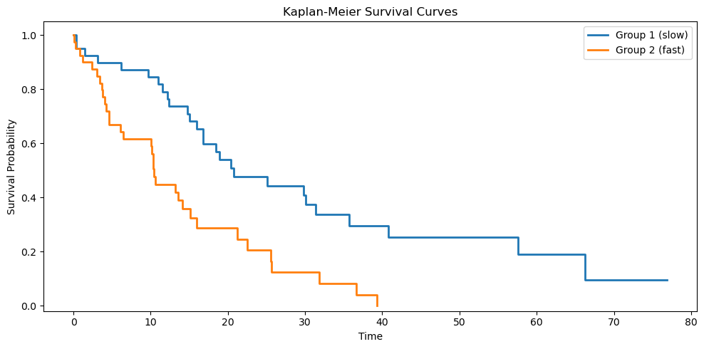

# 카플란-마이어 생존곡선과 로그순위 검정

## 개요

카플란-마이어 추정량은 절단자료에서 생존함수를 추정하는 비모수적 방법의 초석이다. 로그순위
검정과 결합하면 생존 양상을 시각화하고 집단 간 생존분포를 비교하는 완전한 도구가 된다. 이
절에서는 NumPy와 SciPy만으로 두 기법을 구현하고 계산의 각 단계를 설명한다.

## 카플란-마이어 추정량

### 수학적 기초

관측 시간과 절단 지시자를 갖는 대상 $n$명이 주어지면, 카플란-마이어 추정량은 서로 다른 각
사건시간 $t_{(j)}$에서의 조건부 생존확률의 곱으로 생존함수를 계산한다.

$$
\hat{S}(t) = \prod_{j:\, t_{(j)} \leq t} \left(1 - \frac{d_j}{n_j}\right)
$$

여기서 $d_j$는 시점 $t_{(j)}$의 사건 수이고 $n_j$는 $t_{(j)}$ 직전에 위험에 있는 대상 수다.

다음 함수가 원자료에서 카플란-마이어 생존곡선을 계산한다.

<div class="exbox" markdown>

**보기 1.** <span class="diff easy" title="쉬움"></span> 카플란-마이어 추정 구현. 여덟 명을 관측해 다음을 얻었다(+ 는 절단).

| 시각 | 3 | 5+ | 7 | 7 | 10+ | 12 | 15+ | 18 |
|:---|:-:|:-:|:-:|:-:|:-:|:-:|:-:|:-:|

**(1)** $\hat S(t)$를 손으로 계산하고, 그린우드 공식으로 $t = 12$에서의 표준오차를 구하시오.

**(2)** 절단을 무시하고 여덟 시각을 그냥 평균 내면 $9.625$다. 카플란-마이어 곡선이 말하는 값과 견주시오.

</div>

??? success "풀이"

    **(1) 해석적으로.** 사건이 일어난 시각은 $3, 7, 12, 18$이다(절단된 $5, 10, 15$는 곡선을 떨어뜨리지 않는다). 각 시점에서 위험집합 $n_j$는 **그 시각 이상인 관측의 수**다.

    | $t_{(j)}$ | $n_j$ | $d_j$ | $1 - d_j/n_j$ | $\hat S(t_{(j)})$ |
    |:---:|:---:|:---:|:---:|:---:|
    | 3 | 8 | 1 | $7/8$ | $7/8 = 0.875000$ |
    | 7 | 6 | 2 | $4/6$ | $7/12 = 0.583333$ |
    | 12 | 3 | 1 | $2/3$ | $7/18 = 0.388889$ |
    | 18 | 1 | 1 | $0/1$ | $0$ |

    $t = 7$에서 $n_2 = 6$인 것이 절단의 작동 방식을 보여 준다. $t = 3$의 사건과 $t = 5$의 절단으로 두 명이 빠져 여섯이 남았다. **절단된 사람은 곡선을 떨어뜨리지 않지만 그 뒤의 위험집합을 줄인다.**

    그린우드 공식은

    $$
    \widehat{\operatorname{Var}}\big(\hat S(t)\big)
    = \hat S(t)^2 \sum_{t_{(j)} \le t} \frac{d_j}{n_j(n_j - d_j)}
    $$

    이다. $t = 12$까지의 합은

    $$
    \frac{1}{8\cdot 7} + \frac{2}{6\cdot 4} + \frac{1}{3\cdot 2}
    = 0.017857 + 0.083333 + 0.166667 = 0.267857
    $$

    이고 $\hat S(12) = 7/18$이므로

    $$
    \operatorname{SE}\big(\hat S(12)\big) = \frac{7}{18}\sqrt{0.267857} = 0.201269
    $$

    이다. **추정값 $0.389$에 표준오차가 $0.201$이다.** 여덟 명으로는 생존확률을 거의 못 재며, 세 항 가운데 마지막 $0.167$이 전체의 $62\%$를 차지한다. 위험집합이 셋으로 줄어든 꼬리가 불확실성을 지배한다.

    **(2) 해석적으로.** 절단된 세 명의 기록은 "적어도 그때까지는 살아 있었다"는 뜻이므로, 그 값을 사건시각처럼 평균에 넣으면 생존시간을 **반드시 과소평가한다.** 카플란-마이어가 주는 짝은 곡선 아래 넓이, 곧 $18$까지의 제한평균생존시간이다.

    $$
    \int_0^{18}\hat S(t)\,dt
    = 1\cdot 3 + \tfrac78\cdot 4 + \tfrac7{12}\cdot 5 + \tfrac7{18}\cdot 6
    = 3 + 3.5 + 2.916667 + 2.333333 = 11.75
    $$

    **$9.625$ 대 $11.75$로 $22\%$ 차이다.** 절단을 무시하는 것은 자료를 조금 낭비하는 일이 아니라 답을 한 방향으로 틀리게 만드는 일이다.

    **(1)(2) 수치적으로.**

    ```python
    import numpy as np

    def kaplan_meier(times, censored):
        """카플란-마이어 생존함수 추정값을 구한다.

        사건이 일어난 시점마다 "그 직전까지 살아 있던 사람 중 그 시점을
        넘긴 비율"을 곱해 나간다. 중도절단된 사람은 절단 시점까지만
        위험집합에 남아 있다가 조용히 빠진다 — 이것이 중도절단 자료를
        버리지 않고 쓰는 방법이다.

        매개변수
        --------
        times    : 관측된 시각(사건 또는 절단)
        censored : 1 이면 중도절단, 0 이면 사건이 관측됨

        돌려주는 값
        ----------
        t_plot, s_plot : 계단그림에 쓸 시각과 생존확률
        """
        order = np.argsort(times)
        times = times[order]
        censored = censored[order]

        event_times = times[censored == 0]
        unique_events = np.unique(event_times)

        s = 1.0
        t_list = [0.0]
        s_list = [1.0]

        for t_j in unique_events:
            # 위험집합: 그 시점에 아직 사건도 절단도 겪지 않은 사람 수
            n_at_risk = np.sum(times >= t_j)
            d_j = np.sum((times == t_j) & (censored == 0))
            s *= (n_at_risk - d_j) / n_at_risk
            t_list.append(t_j)
            s_list.append(s)

        t_list.append(times.max())
        s_list.append(s_list[-1])

        return np.array(t_list), np.array(s_list)

    # --- (1) 의 표와 그린우드 표준오차를 확인한다 ---
    times = np.array([3., 5., 7., 7., 10., 12., 15., 18.])
    censored = np.array([0, 1, 0, 0, 1, 0, 1, 0])

    t, s = kaplan_meier(times, censored)
    print("t_plot =", t)
    print("s_plot =", np.round(s, 6))

    acc, S = 0.0, 1.0
    for t_j in np.unique(times[censored == 0]):
        n = int(np.sum(times >= t_j))
        d = int(np.sum((times == t_j) & (censored == 0)))
        S *= (n - d) / n
        if n > d:
            acc += d / (n * (n - d))
        print(f"  t={t_j:5.1f}  n={n}  d={d}  S={S:.6f}  "
              f"그린우드합={acc:.6f}  SE={S * np.sqrt(acc):.6f}")

    # --- (2) 절단을 무시한 평균과 곡선 아래 넓이 ---
    print(f"절단을 사건으로 보고 낸 평균 = {times.mean():.4f}")
    area = np.sum(s[:-2] * np.diff(t[:-1]))
    print(f"곡선 아래 넓이 (18 까지의 제한평균생존시간) = {area:.4f}")
    ```

    출력:

    ```
    t_plot = [ 0.  3.  7. 12. 18. 18.]
    s_plot = [1.       0.875    0.583333 0.388889 0.       0.      ]
      t=  3.0  n=8  d=1  S=0.875000  그린우드합=0.017857  SE=0.116927
      t=  7.0  n=6  d=2  S=0.583333  그린우드합=0.101190  SE=0.185561
      t= 12.0  n=3  d=1  S=0.388889  그린우드합=0.267857  SE=0.201269
      t= 18.0  n=1  d=1  S=0.000000  그린우드합=0.267857  SE=0.000000
    절단을 사건으로 보고 낸 평균 = 9.6250
    곡선 아래 넓이 (18 까지의 제한평균생존시간) = 11.7500
    ```

    **손으로 만든 표와 코드가 전부 맞는다.** $0.875$, $0.583333$, $0.388889$, $0$의 네 값과 $t = 12$의 표준오차 $0.201269$가 그대로 나왔고, 곡선 아래 넓이도 $11.75$다.

    마지막 줄의 $\operatorname{SE} = 0$은 그린우드 공식의 알려진 결함이다. 마지막 사건에서 $\hat S$가 정확히 0이 되면 공식이 $\hat S^2$을 곱하므로 분산도 0이 된다. **한 사람이 남아 있을 때의 추정이 확실할 리 없다.** 곡선의 끝부분은 신뢰구간을 믿지 말고 위험집합 크기를 함께 보아야 한다.

!!! warning "이 코드의 `censored`는 $\delta$와 부호가 반대다"
    이 페이지의 코드는 `censored == 1`이 절단, `censored == 0`이 사건을 뜻한다. 이 장의 본문
    표기 $\delta_i$는 반대로 $\delta_i = 1$이 사건이다. 두 관례가 모두 쓰이므로 코드를 옮겨
    쓸 때 반드시 확인하라. `lifelines`는 `event_observed`(사건이 1), R의 `Surv()`는
    `event`(사건이 1)를 쓴다. 이 페이지의 관례가 오히려 소수파다.

**알고리즘의 핵심 단계:**

1. 관측치를 시간순으로 **정렬**한다.
2. 서로 다른 사건시간(`censored == 0`인 시점)을 **식별**한다.
3. **각 사건시간** $t_j$에서 위험집합 크기 $n_j$($t_i \geq t_j$인 대상 수)와 사건 수 $d_j$를
   계산한다.
4. 생존확률을 **갱신**한다. $\hat{S}(t_j) = \hat{S}(t_{j-1}) \times (1 - d_j / n_j)$.
5. 곡선을 관측된 최대 시점까지 **연장**한다.

!!! note "절단된 관측치"

    절단된 대상(`censored == 1`)은 생존곡선의 하강을 일으키지 않지만 이후 사건시간의 위험집합을
    줄인다. 불완전한 관측이 담은 부분적 정보를 이렇게 반영한다.

## 로그순위 검정

### 가설

로그순위 검정은 두 생존곡선을 비교한다.

$$
H_0 : S_1(t) = S_2(t) \quad \text{for all } t \geq 0
$$

$$
H_1 : S_1(t) \neq S_2(t) \quad \text{for some } t \geq 0
$$

### 검정통계량

두 집단을 합친 서로 다른 각 사건시간 $t_{(j)}$에서 $r_{1j}$와 $r_{2j}$를 위험집합 크기,
$d_{1j}$와 $d_{2j}$를 사건 수라 하고 $r_j = r_{1j} + r_{2j}$, $d_j = d_{1j} + d_{2j}$라 하자.
영가설 아래에서 집단 1의 기대 사건 수는

$$
e_{1j} = d_j \cdot \frac{r_{1j}}{r_j}
$$

이고, $t_{(j)}$에서의 분산 기여는

$$
v_j = \frac{r_{1j} \, r_{2j} \, d_j \, (r_j - d_j)}{r_j^2 \, (r_j - 1)}
$$

이다. 검정통계량은

$$
\chi^2_{\text{LR}} = \frac{(O_1 - E_1)^2}{V_1} \;\xrightarrow{d}\; \chi^2_1
$$

이며 $O_1 = \sum d_{1j}$, $E_1 = \sum e_{1j}$, $V_1 = \sum v_j$이다.

<div class="exbox" markdown>

**보기 2.** <span class="diff easy" title="쉬움"></span> 로그순위 검정 구현. 두 집단을 다음과 같이 관측했다(+ 는 절단).

**집단 1:** 5, 8, 12+, 15.  **집단 2:** 2, 4, 6+, 10.

**(1)** $t = 2$와 $t = 8$에서 $e_{1j}$와 $v_j$를 손으로 계산하고, 로그순위 통계량이 시각의 **값이 아니라 순서에만** 의존함을 보이시오.

**(2)** 전체 통계량을 손으로 합산해 구한 뒤 코드로 확인하고, 시각을 $\log(1+t)$나 $t^3$으로 바꾸어도 답이 그대로인지 보시오.

</div>

??? success "풀이"

    **(1) 해석적으로.** 통계량에 들어가는 재료는 각 사건시각에서의 $r_{1j}, r_{2j}, d_{1j}, d_{2j}$ 넷뿐이다. 그런데 $r_{1j} = \#\{i : t_{1i} \ge t_{(j)}\}$는 **"몇 명이 아직 남아 있는가"**를 세는 양이고, $d_{1j}$는 **"그 시각에 몇 건이 일어났는가"**를 세는 양이다. 둘 다 부등식 $t_{1i} \ge t_{(j)}$와 등식 $t_{1i} = t_{(j)}$로만 정해진다.

    $g$가 **순증가함수**이면 $t_{1i} \ge t_{(j)} \iff g(t_{1i}) \ge g(t_{(j)})$이고 $t_{1i} = t_{(j)} \iff g(t_{1i}) = g(t_{(j)})$이므로, 변환 뒤에도 네 수가 모두 그대로다. 따라서 $O_1$, $E_1$, $V$가 바뀌지 않고 $\chi^2$도 바뀌지 않는다. **로그순위는 순위검정이다.** 시간을 일로 재든 달로 재든 로그로 재든 답이 같다.

    이제 두 시각을 계산한다. $t = 2$에서는 아무도 빠지지 않았으므로 $r_1 = 4$, $r_2 = 4$, $r = 8$이고 집단 2에서 한 건이 일어났으므로 $d_1 = 0$, $d = 1$이다.

    $$
    e_{11} = d\cdot\frac{r_1}{r} = \frac48 = 0.5,
    \qquad
    v_1 = \frac{4\cdot 4\cdot 1\cdot 7}{8^2\cdot 7} = \frac{16}{64} = 0.25
    $$

    $t = 8$에서는 집단 1에 $8, 12, 15$가 남아 $r_1 = 3$, 집단 2에는 $10$만 남아 $r_2 = 1$이다. $r = 4$이고 집단 1에서 한 건이 일어났으므로 $d_1 = d = 1$이다.

    $$
    e_{14} = \frac{3}{4} = 0.75,
    \qquad
    v_4 = \frac{3\cdot 1\cdot 1\cdot 3}{4^2\cdot 3} = \frac{3}{16} = 0.1875
    $$

    합친 사건시각은 $2, 4, 5, 8, 10, 15$ 여섯이고, 같은 방식으로 나머지를 채우면

    | $t_{(j)}$ | $r_1$ | $r_2$ | $d_1$ | $d$ | $e_{1j}$ | $v_j$ |
    |:---:|:---:|:---:|:---:|:---:|---:|---:|
    | 2 | 4 | 4 | 0 | 1 | $0.500000$ | $0.250000$ |
    | 4 | 4 | 3 | 0 | 1 | $0.571429$ | $0.244898$ |
    | 5 | 4 | 2 | 1 | 1 | $0.666667$ | $0.222222$ |
    | 8 | 3 | 1 | 1 | 1 | $0.750000$ | $0.187500$ |
    | 10 | 2 | 1 | 0 | 1 | $0.666667$ | $0.222222$ |
    | 15 | 1 | 0 | 1 | 1 | $1.000000$ | $0$ |

    이다. 마지막 줄의 $v_6 = 0$을 눈여겨보라. $r = 1$이면 분모의 $r-1$이 0이 되므로 코드가 $v$를 0으로 둔다. **집단 2에 아무도 남지 않은 시점은 비교할 것이 없으므로 정보를 주지 않는다.**

    합하면 $O_1 = 3$, $E_1 = 4.154762$, $V = 1.126842$이고

    $$
    \chi^2 = \frac{(3 - 4.154762)^2}{1.126842} = \frac{1.333475}{1.126842} = 1.183373
    $$

    이다. 자유도 1인 카이제곱에서 $p = 0.2767$이다. 집단 2의 사건이 먼저 몰려 있었지만 각 집단 네 명으로는 **아무것도 말할 수 없다.**

    **(2) 수치적으로.**

    ```python
    from scipy import stats

    def logrank_test(times_1, censored_1, times_2, censored_2):
        """이표본 로그순위 검정.

        사건 시점마다 2x2 분할표를 만들어 관측 사건 수와 기대 사건 수를
        비교한다. 그 차이를 모든 시점에 걸쳐 누적한 것이 통계량이다.
        두 생존곡선이 같다는 귀무가설 아래에서 자유도 1 인 카이제곱을 따른다.

        돌려주는 값
        ----------
        chi2, p_value
        """
        event_1 = times_1[censored_1 == 0]
        event_2 = times_2[censored_2 == 0]
        all_event_times = np.unique(np.concatenate([event_1, event_2]))

        O1, E1, V = 0.0, 0.0, 0.0

        for t_j in all_event_times:
            r1 = np.sum(times_1 >= t_j)
            r2 = np.sum(times_2 >= t_j)
            r  = r1 + r2

            d1 = np.sum(event_1 == t_j)
            d2 = np.sum(event_2 == t_j)
            d  = d1 + d2

            # 두 집단의 생존이 같다면, 그 시점의 사건은 위험집합 크기에
            # 비례해 나뉘어야 한다. 그것이 기대 사건 수 e1 이다.
            e1 = r1 * d / r if r > 0 else 0
            v  = r1 * r2 * d * (r - d) / (r**2 * (r - 1)) if r > 1 else 0

            O1 += d1
            E1 += e1
            V  += v

        chi2 = (O1 - E1)**2 / V if V > 0 else 0
        p_value = stats.chi2(1).sf(chi2)
        return chi2, p_value

    # --- (1) 의 합산과 순위 불변성을 확인한다 ---
    t1 = np.array([5., 8., 12., 15.]); c1 = np.array([0, 0, 1, 0])
    t2 = np.array([2., 4., 6., 10.]);  c2 = np.array([0, 0, 1, 0])

    chi2, p = logrank_test(t1, c1, t2, c2)
    print(f"chi2 = {chi2:.6f},  p = {p:.4f}")

    for name, g in [("log(1+t)", np.log1p), ("t^3", lambda x: x ** 3),
                    ("sqrt(t)", np.sqrt)]:
        c, pp = logrank_test(g(t1), c1, g(t2), c2)
        print(f"  {name:9s}: chi2 = {c:.6f}  p = {pp:.4f}")
    ```

    출력:

    ```
    chi2 = 1.183373,  p = 0.2767
      log(1+t) : chi2 = 1.183373  p = 0.2767
      t^3      : chi2 = 1.183373  p = 0.2767
      sqrt(t)  : chi2 = 1.183373  p = 0.2767
    ```

    **손으로 합산한 $\chi^2 = 1.183373$과 $p = 0.2767$이 코드와 소수 여섯째 자리까지 같다.**

    세 변환 모두 통계량을 **한 자리도 바꾸지 않는다.** $t^3$은 $15$를 $3375$로, $\sqrt t$는 $2$를 $1.414$로 보내 시각의 간격을 완전히 뒤바꾸는데도 답이 같다. (1)에서 보인 대로 $r$과 $d$가 순서로만 정해지기 때문이다.

    **이것은 로그순위의 힘이자 한계다.** 시간 눈금을 잘못 잡아도 안전하다는 것이 힘이고, 생존시간이 **얼마나** 길어졌는지는 전혀 재지 못한다는 것이 한계다. 효과의 크기를 말하려면 중앙생존시간이나 위험비 같은 다른 양이 필요하다.

    이 구현은 합쳐진 각 사건시간을 순회하며 집단 1의 관측 사건 수, 기대 사건 수, 분산을 누적한 뒤 카이제곱 통계량을 계산한다.

## 모의실험과 시각화

다음 코드는 사건율이 다른 두 집단의 생존자료를 모의로 생성하고 카플란-마이어 곡선을 그린다.

<div class="exbox" markdown>

**보기 3.** <span class="diff easy" title="쉬움"></span> 두 집단의 생존곡선 그리기. 1집단은 평균 $20$, 2집단은 평균 $12$인 지수분포에서 각각 $40$명을 뽑고 $20\%$를 절단으로 표시한다.

**(1)** 두 집단의 참 중앙생존시간과 참 위험비를 구하시오. 그런데 이 코드의 절단 방식은 관측시각을 줄이지 않고 **이름표만 바꾼다.** 그러면 카플란-마이어 추정값이 무엇으로 수렴하는가.

**(2)** 실행해 추정 중앙값과 로그순위 결과를 (1)의 값들과 견주시오.

</div>

??? success "풀이"

    **(1) 해석적으로.** 평균 $\theta$인 지수분포는 $S(t) = e^{-t/\theta}$이므로 중앙값은 $S(t) = 0.5$에서

    $$
    t_{1/2} = \theta\ln 2
    $$

    다. 따라서 1집단은 $20\ln 2 = 13.863$, 2집단은 $12\ln 2 = 8.318$이다. 위험은 $\lambda = 1/\theta$로 일정하므로 참 위험비는

    $$
    \frac{\lambda_1}{\lambda_2} = \frac{1/20}{1/12} = 0.6
    $$

    이고, 1집단의 위험이 2집단의 $60\%$다.

    이제 절단 방식을 따진다. 올바른 절단이라면 각자에게 절단시각 $C_i$가 있고 관측값이 $\min(T_i, C_i)$여야 한다. 그런데 이 코드는 $T_i$를 그대로 두고 그중 $20\%$에 "절단"이라는 이름표만 붙인다. 이는 **각 사람의 사건을 그 사건시각에 절단한 것**과 같다. 그러면 카플란-마이어가 각 시점에서 세는 $d_j$는 참 사건 수의 $(1-q)$배(여기서 $q$는 절단 비율)가 되고, 추정 위험이 참 위험의 $(1-q)$배로 줄어든다. 곧

    $$
    \hat S(t) \;\longrightarrow\; e^{-(1-q)t/\theta},
    \qquad
    \hat t_{1/2} \;\longrightarrow\; \frac{\theta\ln 2}{1-q}
    $$

    이다. **생존이 실제보다 좋아 보인다.** $q = 0.2$라면 중앙값이 $1/0.8 = 1.25$배로 부풀려져 1집단 $17.33$, 2집단 $10.40$이 된다. 위험비는 두 집단 모두 같은 비율로 줄어들면 유지되지만, 표본마다 $q$가 다르면 그것도 흔들린다.

    **(2) 수치적으로.**

    ```python
    import matplotlib.pyplot as plt

    plt.rcParams["font.sans-serif"] = ["NanumGothic", "Apple SD Gothic Neo", "Malgun Gothic"]
    plt.rcParams["font.family"] = "sans-serif"
    plt.rcParams["axes.unicode_minus"] = False

    np.random.seed(0)

    # 1집단: 사건이 늦게 일어난다(평균 20). 20%는 중도절단된다.
    # 중도절단은 "그 시점까지는 살아 있었다"는 정보를 주므로 버리지 않는다.
    n1 = 40
    times_1 = np.random.exponential(scale=20, size=n1)
    censored_1 = (np.random.rand(n1) < 0.2).astype(int)

    # 2집단: 사건이 빨리 일어난다(평균 12).
    n2 = 40
    times_2 = np.random.exponential(scale=12, size=n2)
    censored_2 = (np.random.rand(n2) < 0.2).astype(int)

    t1, s1 = kaplan_meier(times_1, censored_1)
    t2, s2 = kaplan_meier(times_2, censored_2)

    # 그림으로 확인
    fig, ax = plt.subplots(figsize=(10, 5))
    # where="post" 가 계단을 오른쪽으로 뻗게 한다. 생존함수는 사건이 일어난
    # 그 순간에 떨어지고 다음 사건까지 평평하므로, 이 설정이라야 맞다.
    ax.step(t1, s1, where="post", linewidth=2, label="Group 1 (slow)")
    ax.step(t2, s2, where="post", linewidth=2, label="Group 2 (fast)")
    ax.set_xlabel("Time")
    ax.set_ylabel("Survival Probability")
    ax.set_title("Kaplan-Meier Survival Curves")
    ax.set_ylim(-0.02, 1.05)
    ax.legend()
    plt.tight_layout()
    plt.show()

    # --- (1) 의 예측과 맞추어 본다 ---
    def km_median(t, s):
        idx = np.where(s <= 0.5)[0]
        return t[idx[0]] if len(idx) else np.nan

    q1, q2 = censored_1.mean(), censored_2.mean()
    print(f"실제 절단 비율: 1집단 {q1:.3f}, 2집단 {q2:.3f}  (설계값 0.200)")
    print(f"KM 중앙값          : 1집단 {km_median(t1, s1):6.3f}, 2집단 {km_median(t2, s2):6.3f}")
    print(f"참 중앙값 th*ln2    : 1집단 {20 * np.log(2):6.3f}, 2집단 {12 * np.log(2):6.3f}")
    print(f"이름표 절단이 뜻하는 값: 1집단 {20 * np.log(2) / (1 - q1):6.3f}, "
          f"2집단 {12 * np.log(2) / (1 - q2):6.3f}")

    chi2, p = logrank_test(times_1, censored_1, times_2, censored_2)
    print(f"로그순위: chi2 = {chi2:.4f},  p = {p:.5f}")
    ```

    출력:

    ```
    실제 절단 비율: 1집단 0.325, 2집단 0.175  (설계값 0.200)
    KM 중앙값          : 1집단 20.763, 2집단 10.446
    참 중앙값 th*ln2    : 1집단 13.863, 2집단  8.318
    이름표 절단이 뜻하는 값: 1집단 20.538, 2집단 10.082
    로그순위: chi2 = 12.6889,  p = 0.00037
    ```

    

    **추정 중앙값이 참값과 크게 어긋나며, 어긋나는 방향과 크기가 (1)의 예측과 맞는다.** 1집단의 KM 중앙값 $20.763$은 참값 $13.863$보다 $50\%$ 크지만, 이 표본의 절단 비율 $q = 0.325$를 넣은 예측값 $13.863/0.675 = 20.538$과는 $1.1\%$ 안에서 일치한다. 2집단도 $10.446$ 대 예측 $10.082$로 가깝고 참값 $8.318$과는 멀다.

    **이것은 추정량의 결함이 아니라 자료를 만든 방식의 결함이다.** 카플란-마이어는 주어진 자료에 대해 옳게 작동했다. 다만 그 자료에서 "절단"이라 표시된 사람은 실제로는 그 시각에 사건을 겪었으므로, 추정량이 보기에는 생존이 실제보다 좋아 보인다. 쪽 아래의 주의 상자가 지적하는 대로 절단은 **관측시각을 줄여야** 하며, 그렇게 만든 자료에서는 이런 치우침이 생기지 않는다.

    로그순위 쪽은 영향이 훨씬 작다. $\chi^2 = 12.69$, $p = 0.00037$로 두 집단의 차이를 또렷하게 잡아낸다. 사건이 양쪽에서 같은 비율로 지워졌다면 순위 구조가 크게 망가지지 않기 때문이다. 다만 여기서도 $q_1 = 0.325$와 $q_2 = 0.175$가 서로 달라 1집단의 사건이 더 많이 지워졌고, 그 탓에 1집단이 실제보다 더 좋아 보이는 쪽으로 검정이 조금 기울었다.

    !!! note "이 코드의 절단은 사건시간과 독립이 아니다"
        `censored_1 = (np.random.rand(n1) < 0.2)`는 관측된 시간과 **무관하게** 20%를 절단으로 표시한다. 이는 실제 절단 기제(대상마다 절단시간 $C_i$가 있고 $t = \min(T, C)$)와 다르다. 여기서는 관측 시간을 그대로 두고 이름표만 바꾸므로, 절단된 대상의 기록된 시간이 참 사건시간이다. 위에서 보았듯 그 결과로 **생존이 체계적으로 좋게 추정된다.** 21.1절의 모의실험 코드가 올바른 방식을 보여준다.

## 해석

- 카플란-마이어 곡선은 관측된 각 사건시간에서 떨어지는 **계단함수**다. 평평한 구간은 사건이
  없는 구간에 해당하며, 위험집합을 줄이는 절단된 관측치가 그 안에 있을 수 있다.
- 곡선이 더 오래 높이 머무를수록 그 집단의 **생존이 낫다**.
- **로그순위 검정**은 두 곡선의 시각적 분리가 통계적으로 유의한지를 형식적으로 평가한다. p-값이
  작으면(예: $p < 0.05$) 생존분포가 같다는 영가설을 기각한다.
- 로그순위 검정은 **비례위험** 가정이 성립할 때(집단 간 위험비가 시간에 걸쳐 대략 일정할 때)
  검정력이 가장 높다. 생존곡선이 교차하면 차이를 탐지하지 못할 수 있다.

!!! tip "로그순위 검정을 언제 쓰는가"

    공변량 보정이 필요 없을 때 두 개 이상의 집단을 비교하는 데 적절하다. 다변량 분석에는
    콕스 비례위험 모형을 쓰라.

## 연습문제

<div class="drillbox" markdown>

**연습문제 1.** <span class="diff easy" title="쉬움"></span>
카플란-마이어 계산

환자 6명의 생존자료가 다음과 같다.

| 대상 | 시간 | 상태 (0 = 사건, 1 = 절단) |
|:-------:|:----:|:--------------------------------:|
| A | 2 | 0 |
| B | 3 | 1 |
| C | 5 | 0 |
| D | 5 | 0 |
| E | 8 | 1 |
| F | 10 | 0 |

카플란-마이어 추정량으로 각 사건시간의 $\hat{S}(t)$를 계산하라.

</div>

??? success "풀이"

    서로 다른 사건시간은 $t_{(1)} = 2$, $t_{(2)} = 5$, $t_{(3)} = 10$이다.

    | $t_{(j)}$ | $n_j$ | $d_j$ | $1 - d_j/n_j$ | $\hat{S}(t_{(j)})$ |
    |:----------:|:-----:|:-----:|:--------------:|:-------------------:|
    | 2 | 6 | 1 | 5/6 = 0.833 | 0.833 |
    | 5 | 4 | 2 | 2/4 = 0.500 | 0.833 $\times$ 0.500 = 0.417 |
    | 10 | 1 | 1 | 0/1 = 0.000 | 0.417 $\times$ 0.000 = 0.000 |

    $t_{(2)} = 5$에서는 대상 A가 $t = 2$에 사건을 겪었고 대상 B가 $t = 3$에 절단되어
    $n_2 = 4$가 위험에 남는다.

<div class="drillbox" markdown>

**연습문제 2.** <span class="diff easy" title="쉬움"></span>
로그순위 검정의 설정

두 집단을 관측했다.

**집단 1:** 3, 6+, 9, 15 (+ = 절단).

**집단 2:** 1, 4, 8+, 12.

**(a)** 두 집단의 서로 다른 사건시간을 모두 나열하라.

**(b)** $t = 1$에서 집단 1의 기대 사건 수 $e_{11}$과 분산 기여 $v_1$을 계산하라.

</div>

??? success "풀이"

    **(a)** 사건시간(절단 제외)은 집단 1에서 3, 9, 15이고 집단 2에서 1, 4, 12이다. 합친 서로
    다른 사건시간은 1, 3, 4, 9, 12, 15다.

    **(b)** $t = 1$에서 $r_1 = 4$, $r_2 = 4$, $r = 8$, $d_1 = 0$, $d_2 = 1$, $d = 1$이므로

    $$
    e_{11} = d \cdot \frac{r_1}{r} = 1 \cdot \frac{4}{8} = 0.5
    $$

    $$
    v_1 = \frac{r_1 \cdot r_2 \cdot d \cdot (r - d)}{r^2 (r - 1)} = \frac{4 \cdot 4 \cdot 1 \cdot 7}{64 \cdot 7} = \frac{112}{448} = 0.25
    $$

<div class="drillbox" markdown>

**연습문제 3.** <span class="diff med" title="중간"></span>
절단의 효과

대상 10명이 모두 비율 $\lambda = 0.1$인 같은 지수분포를 따른다고 하자. 시나리오 A에서는 아무도
절단되지 않는다. 시나리오 B에서는 5명이 시점 $t = 5$에 절단된다.

**(a)** 두 시나리오에서 카플란-마이어 곡선이 어떻게 다를지 정성적으로 설명하라.

**(b)** 후반 시점에서 어느 시나리오가 더 넓은 신뢰띠를 만드는가? 이유는?

</div>

??? success "풀이"

    **(a)** 시나리오 A에서는 10명 모두가 사건을 기여하므로 카플란-마이어 곡선이 완전한 정보에
    근거하며 꾸준히 0까지 내려간다. 시나리오 B에서는 $t = 5$에 절단된 5명이 그 시점에
    위험집합에서 빠진다. 곡선은 $t = 5$까지는 시나리오 A와 같지만, $t = 5$ 이후에는 위험집합이
    작아져(절단되지 않은 5명만 남는다) 각 사건이 생존 추정치를 더 크게 떨어뜨린다.

    **(b)** 시나리오 B가 $t = 5$ 이후에 더 넓은 신뢰띠를 갖는다. 그린우드 공식에 따른
    카플란-마이어 추정량의 분산은 위험집합이 작아질수록 커진다. 원래 10명 대신 5명만 위험에
    있으면 각 사건이 추정치에 더 큰 불확실성을 기여한다.

    !!! note "곡선의 기댓값은 두 시나리오에서 같다"
        절단이 편향을 만들지 않는다는 점을 놓치지 말라. 시나리오 B의 곡선은 A보다 **덜 정확할**
        뿐 체계적으로 위나 아래로 치우치지 않는다. 절단이 $t = 5$라는 고정 시점에 일어나고
        사건시간과 무관하므로 독립 절단 가정이 성립하기 때문이다. 절단이 정보를 담고 있을 때에만
        (예: 상태가 나쁜 대상이 먼저 절단될 때) 편향이 생긴다.

<div class="drillbox" markdown>

**연습문제 4.** <span class="diff easy" title="쉬움"></span>
로그순위 검정의 해석

처리군과 대조군을 비교한 로그순위 검정이 $\chi^2_{\text{LR}} = 5.23$, $p = 0.022$를 냈다.

**(a)** 유의수준 $\alpha = 0.05$에서의 결론을 서술하라.

**(b)** 처리군의 관측 사건 수가 $O_1 = 15$이고 기대 사건 수가 $E_1 = 21.3$이었다면 효과의
방향을 해석하라.

**(c)** 로그순위 검정의 어떤 가정이 위배되면 이 결과가 오도할 수 있는가?

</div>

??? success "풀이"

    **(a)** $p = 0.022 < 0.05$이므로 5% 수준에서 $H_0$을 기각하고, 처리군과 대조군의 생존분포가
    유의하게 다르다고 결론짓는다.

    **(b)** $O_1 = 15 < E_1 = 21.3$이므로 처리군의 사건이 영가설 아래의 기대보다 적었다. 처리군의
    생존이 대조군보다 낫다(위험이 낮다)는 뜻이다.

    대략적인 위험비를 $O_1/E_1 = 15/21.3 = 0.70$으로 어림할 수도 있다. 이를 **관측/기대
    위험비**라 하며, 콕스 모형을 적합하지 않고도 효과크기를 가늠하는 데 쓰인다. 다만 어디까지나
    근사이며, 정확한 위험비와 그 신뢰구간은 콕스 모형에서 얻어야 한다.

    **(c)** 로그순위 검정은 **비례위험**을 가정한다. 집단 간 위험비가 시간에 걸쳐 일정하다는
    것이다. 생존곡선이 교차하면(예: 처리가 초기에는 이롭지만 후반에는 해로우면) 로그순위
    검정이 차이를 탐지하지 못하거나 오도하는 요약을 줄 수 있다.

<div class="drillbox" markdown>

**연습문제 5.** <span class="diff hard" title="어려움"></span>
로그순위 통계량의 분산 유도

영가설 아래에서 $d_{1j}$(시점 $t_{(j)}$의 집단 1 사건 수)가 초기하분포를 따름을 보이고 다음
식을 유도하라.

$$
v_j = \frac{r_{1j} \, r_{2j} \, d_j \, (r_j - d_j)}{r_j^2 \, (r_j - 1)}
$$

</div>

??? success "풀이"

    $H_0$ 아래에서 시점 $t_{(j)}$에 $r_j$명이 위험에 있고 그중 $r_{1j}$명이 집단 1에 속한다.
    이 $r_j$명 중에서 $d_j$개의 사건이 일어난다. 집단 1의 사건 수 $d_{1j}$는 초기하분포를
    따른다. 집단 1 소속 $r_{1j}$명을 포함한 $r_j$명의 풀에서 "사건" $d_j$개를 뽑는 것이다.

    초기하 확률변수 $X \sim \text{Hyper}(N, K, n)$의 분산은

    $$
    \text{Var}(X) = n \cdot \frac{K}{N} \cdot \frac{N - K}{N} \cdot \frac{N - n}{N - 1}
    $$

    이다. $N = r_j$, $K = r_{1j}$, $n = d_j$를 대입하면

    $$
    v_j = d_j \cdot \frac{r_{1j}}{r_j} \cdot \frac{r_j - r_{1j}}{r_j} \cdot \frac{r_j - d_j}{r_j - 1}
    $$

    이고 $r_j - r_{1j} = r_{2j}$이므로

    $$
    v_j = \frac{r_{1j} \, r_{2j} \, d_j \, (r_j - d_j)}{r_j^2 \, (r_j - 1)}
    $$

    $\square$

---

## 정리하며

카플란–마이어와 로그순위를 **함께 구현**했다.

- **자료 형식이 두 열이다.** 관측시간과 사건 지시자(1=사건, 0=절단)이며, 이 형식이 생존분석의 표준 입력이다.
- **`lifelines` 가 주력 도구다.** `KaplanMeierFitter` 로 곡선을, `logrank_test` 로 비교를 수행한다.
- **위험집합 표를 함께 그린다.** 각 시점에 남은 대상 수를 곡선 아래 표시하는 것이 관례이며, **꼬리의 신뢰도를 독자가 판단할 수 있게** 해 준다.
- **중앙생존시간을 보고한다.** $\hat S(t)=0.5$ 가 되는 시점이며, 곡선이 $0.5$ 아래로 내려가지 않으면 "도달하지 않음"으로 적는다.
- **곡선과 검정을 함께 제시한다.** $p$ 값만으로는 차이의 크기와 시점을 알 수 없다.

다음 절부터 **모수적 생존 모형**으로 넘어간다.
