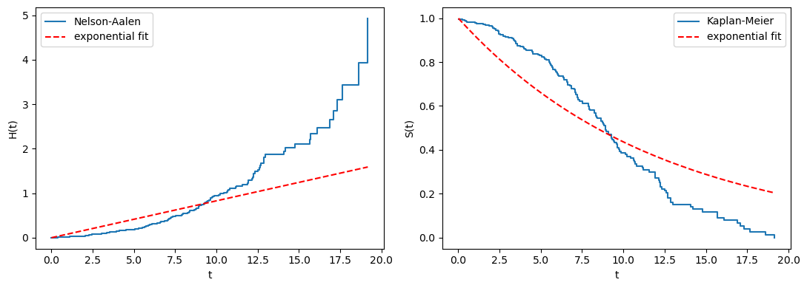

# 지수 모형

지수분포는 생존자료에 대한 가장 단순한 모수 모형이다. 위험률이 시간에 걸쳐 **일정하다**고
가정한다. 다음 순간에 사건이 일어날 위험이 대상이 이미 얼마나 오래 생존했는지에 의존하지
않는다는 것이다. 이 가정은 제약적이지만, 지수 모형은 더 유연한 모형들을 비교하는 기준선
역할을 하며 모수적 생존분석의 자연스러운 출발점이다.

이 절에서는 지수 생존 모형을 정의하고 주요 양들을 유도하며, 무기억성을 논의하고 절단자료에
대한 최대가능도 추정량을 구한다.

## 모형 설정

지수 모형은 상수 위험률인 모수 $\lambda > 0$ 하나를 갖는다. 네 가지 핵심 함수는 다음과 같다.

**위험함수:**

$$
h(t) = \lambda \qquad \text{for all } t \geq 0
$$

**누적위험:**

$$
H(t) = \lambda t
$$

**생존함수:**

$$
S(t) = \exp(-\lambda t)
$$

**밀도함수:**

$$
f(t) = \lambda \exp(-\lambda t)
$$

평균 생존시간은 $E[T] = 1/\lambda$이고 분산은 $\text{Var}(T) = 1/\lambda^2$이다.

## 무기억성

상수 위험은 **무기억성**을 함의한다. 추가로 $s$만큼 더 생존할 확률이 이미 얼마나 오래
생존했는지에 의존하지 않는다는 성질이다. 형식적으로,

$$
P(T > t + s \mid T > t) = P(T > s) \qquad \text{for all } t, s \geq 0
$$

??? proof "증명"

    생존함수를 쓰면

    $$
    P(T > t + s \mid T > t) = \frac{S(t + s)}{S(t)} = \frac{e^{-\lambda(t+s)}}{e^{-\lambda t}} = e^{-\lambda s} = S(s)
    $$

    $\square$

    이 성질을 갖는 연속분포는 지수분포가 유일하다.

!!! example "무기억성을 갖는 부도"

    대출 부도가 월 $\lambda = 0.02$인 지수 모형을 따른다면, 12개월을 버틴 대출이 다음 달에
    부도를 낼 확률은 갓 실행된 대출과 같다. 실제로는 이 가정이 자주 위배된다. 숙성된 대출은
    신규 대출과 다른 비율로 부도를 내며, 그래서 와이불을 비롯한 유연한 모형이 필요해진다.

## 최대가능도 추정

관측 시간 $t_1, \ldots, t_n$과 사건 지시자 $\delta_1, \ldots, \delta_n$을 갖는 대상 $n$명에
대해 가능도는

$$
L(\lambda) = \prod_{i=1}^{n} \bigl[f(t_i)\bigr]^{\delta_i} \bigl[S(t_i)\bigr]^{1-\delta_i} = \prod_{i=1}^{n} \bigl[\lambda e^{-\lambda t_i}\bigr]^{\delta_i} \bigl[e^{-\lambda t_i}\bigr]^{1-\delta_i}
$$

이고, 정리하면

$$
L(\lambda) = \lambda^d \exp\!\left(-\lambda \sum_{i=1}^{n} t_i\right)
$$

이다. 여기서 $d = \sum_{i=1}^{n} \delta_i$는 관측된 총 사건 수다.

로그가능도는

$$
\ell(\lambda) = d \ln \lambda - \lambda \sum_{i=1}^{n} t_i
$$

이고 $\ell'(\lambda) = 0$으로 놓으면

$$
\frac{d}{\lambda} - \sum_{i=1}^{n} t_i = 0 \implies \hat{\lambda} = \frac{d}{\sum_{i=1}^{n} t_i}
$$

이다. MLE는 사건 수를 관측된 총 인시(person-time)로 나눈 값이다.

!!! note "MLE의 해석"

    분모 $\sum_{i=1}^n t_i$는 위험에 노출된 총 **인시**다. 절단된 대상은 자신의 절단시간을
    이 합계에 기여하므로, 사건이 관측되지 않았더라도 추정에 정보를 준다.

## 분산과 신뢰구간

자료 전체에 대한 관측정보는

$$
I(\lambda) = \frac{d}{\lambda^2}
$$

이다($\ell''(\lambda) = -d/\lambda^2$을 $\hat\lambda$에서 평가한 값의 부호를 바꾼 것이다).
$\hat{\lambda}$의 점근분산은

$$
\text{Var}(\hat{\lambda}) \approx \frac{\hat{\lambda}^2}{d}
$$

이고 $\lambda$의 95% 신뢰구간은

$$
\hat{\lambda} \pm 1.96 \cdot \frac{\hat{\lambda}}{\sqrt{d}}
$$

이다. 평균 생존시간 $1/\lambda$의 신뢰구간은 양 끝점의 역수를 취해 얻는다(순서가 뒤집힌다).

## 예제

어떤 신뢰성 연구가 전구 20개를 관찰한다. 연구가 끝날 때까지 12개가 끊어졌고(사건) 8개는
여전히 작동 중이다(절단). 전구 20개 전체의 관측 시간 합계는 $\sum t_i = 5{,}000$시간이다.

**MLE:**

$$
\hat{\lambda} = \frac{12}{5000} = 0.0024 \text{ per hour}
$$

**추정된 평균 수명:** $1/\hat{\lambda} = 417$시간.

**$\lambda$의 95% 신뢰구간:**

$$
0.0024 \pm 1.96 \times \frac{0.0024}{\sqrt{12}} = 0.0024 \pm 0.00136 = (0.0010, 0.0038)
$$

**200시간에서의 추정 생존율:**

$$
\hat{S}(200) = \exp(-0.0024 \times 200) = \exp(-0.48) = 0.619
$$

## 지수 가정 점검하기

상수 위험 가정은 그림으로 평가할 수 있다.

- **누적위험 그림.** 넬슨-알렌 추정치 $\hat{H}(t)$가 원점을 지나는 직선에 가까우면 지수
  모형이 타당하다.
- **KM 대 적합값.** 모수적 생존곡선 $\hat{S}(t) = e^{-\hat{\lambda}t}$를 카플란-마이어
  추정치 위에 겹쳐 그린다. 체계적인 어긋남은 적합이 나쁘다는 뜻이다.

!!! warning "지수 모형이 정확한 경우는 드물다"

    현실의 과정 중 위험이 진정으로 일정한 것은 거의 없다. 지수 모형은 기준선으로 쓰거나,
    관심 있는 시간 범위에서 상수 위험 가정이 합당한 근사일 때 쓰는 것이 좋다. 다음 절의
    와이불 모형은 단조 증가 또는 감소 위험을 허용하는 형상모수를 더해 지수 모형을 일반화한다.

## 푸아송 과정과의 관계

독립인 지수 생존시간에서 나오는 사건들은 **푸아송 과정**을 이룬다. 각 대상이 독립인
$\text{Exp}(\lambda)$ 사건시간을 가지면, 위험에 있는 $n$명 가운데 길이 $t$인 시간구간에서
일어나는 사건 수는 근사적으로 비율 $n\lambda t$인 푸아송 분포를 따른다. 이 관계는 생존분석을
계수과정 이론과 연결하며, MLE의 점근적 성질에 이르는 또 다른 길을 제공한다.

## 연습문제

<div class="drillbox" markdown>

**연습문제 1.**
지수 모형의 MLE

어떤 신뢰성 연구가 부품 30개를 추적한다. 연구 종료 시점에 18개가 고장 났고 12개는 여전히
작동 중이다. 관측 시간의 합계(사건 + 절단)는 $\sum t_i = 4{,}200$시간이다.

**(a)** 지수 모형을 가정하고 MLE $\hat{\lambda}$를 계산하라.

**(b)** 평균 고장시간을 추정하라.

**(c)** $\lambda$의 95% 신뢰구간을 계산하라.

</div>

??? success "풀이"

    **(a)** $\hat{\lambda} = d / \sum t_i = 18/4200 = 0.004286$(시간당).

    **(b)** $1/\hat{\lambda} = 233.3$시간.

    **(c)** $\text{se}(\hat{\lambda}) = \hat{\lambda}/\sqrt{d} = 0.004286/\sqrt{18} = 0.001010$
    이므로 신뢰구간은 $0.004286 \pm 1.96 \times 0.001010 = (0.002306,\ 0.006266)$이다.

    !!! note "왜 분모가 30이 아니라 18인가"
        표준오차의 $\sqrt{d}$에 들어가는 것은 대상 수 $n = 30$이 아니라 **사건 수** $d = 18$
        이다. 절단된 관측치는 분모의 인시 합계에 기여하여 $\hat\lambda$를 개선하지만,
        정보량을 결정하는 것은 실제로 관측된 사건의 수다. 이는 생존분석 전반에 걸친 원리다.
        **표본 크기가 아니라 사건 수가 검정력을 결정한다.** 임상시험 설계에서 "환자 몇 명"이
        아니라 "사건 몇 건"을 목표로 잡는 이유다. $\square$

<div class="drillbox" markdown>

**연습문제 2.**
지수분포가 무기억성을 갖는 유일한 연속분포임을 증명하라.

</div>

??? success "풀이"

    $S(t) = P(T > t)$가 모든 $t, s \ge 0$에 대해

    $$
    S(t+s) = S(t)\,S(s)
    $$

    를 만족한다고 하자(무기억성 $P(T > t+s \mid T > t) = P(T > s)$를 다시 쓴 것이다).

    $g(t) = \ln S(t)$로 두면 이 조건은

    $$
    g(t+s) = g(t) + g(s)
    $$

    가 되어 **코시의 함수방정식**이 된다. $S$가 생존함수이므로 $g$는 단조 비증가이고, 따라서
    가측이다. 코시 방정식의 해 중 가측인 것은 선형함수뿐이므로

    $$
    g(t) = -\lambda t \quad(\text{어떤 상수 } \lambda \ge 0)
    $$

    이고, $S(t) = e^{-\lambda t}$가 된다. $S(t) \to 0$이려면 $\lambda > 0$이어야 한다.
    즉 지수분포다. $\square$

    !!! note "이산 버전은 기하분포다"
        같은 논증을 자연수 위에서 하면 $S(n) = p^n$ 꼴이 나와 **기하분포**를 얻는다. 무기억성을
        갖는 이산분포는 기하분포가 유일하다. 4장에서 다룬 지수분포와 기하분포의 대응이 여기에
        다시 나타난다.

<div class="drillbox" markdown>

**연습문제 3.**
절단이 전혀 없는 자료($\delta_i = 1$ for all $i$)에서 $\hat\lambda = n/\sum t_i$가 되어
평균의 역수임을 확인하라. 절단이 있으면 왜 이 단순한 관계가 깨지는가?

</div>

??? success "풀이"

    절단이 없으면 $d = n$이므로

    $$
    \hat\lambda = \frac{n}{\sum_i t_i} = \frac{1}{\bar t}
    $$

    이고, 추정된 평균 생존시간 $1/\hat\lambda = \bar t$가 표본평균이 된다. 지수분포의 평균이
    $1/\lambda$이므로 자연스러운 결과다.

    **절단이 있으면 깨지는 이유.** 분자는 $n$이 아니라 $d < n$이 되지만 분모의 $\sum_i t_i$는
    절단된 대상의 시간도 모두 포함한다. 따라서

    $$
    \frac{1}{\hat\lambda} = \frac{\sum_i t_i}{d} > \bar t
    $$

    가 되어 **추정된 평균이 관측된 시간의 평균보다 크다.** 이는 옳은 방향이다. 절단된 대상은
    자신의 관측 시간보다 더 오래 살 것이므로, 관측 시간의 단순 평균 $\bar t$는 참 평균을
    과소추정한다(21.1절 연습문제 2에서 모의실험으로 확인한 그대로다).

    **극단적인 경우.** 사건이 하나도 관측되지 않으면 $d = 0$이 되어 $\hat\lambda = 0$,
    $1/\hat\lambda = \infty$가 된다. 가능도 $L(\lambda) = e^{-\lambda\sum t_i}$가
    $\lambda \to 0$에서 최대가 되므로 MLE가 경계에 놓이는 것이다. 이 경우 유한한 추정치가
    존재하지 않으며, 보고할 수 있는 것은 $\lambda$의 상한(단측 신뢰구간)뿐이다. $\square$

<div class="drillbox" markdown>

**연습문제 4.**
지수 모형의 적합도를 점검하는 두 그림(누적위험 그림, KM 대 적합값)을 구현하고, 실제로는
와이불($k = 2$)에서 나온 자료에 지수 모형을 적합하면 각 그림이 어떻게 보이는지 확인하라.

</div>

??? success "풀이"

    ```python
    import numpy as np
    import matplotlib.pyplot as plt

    rng = np.random.default_rng(5)
    n = 300
    # Weibull with shape k=2, scale=10  (increasing hazard)
    T = 10.0 * rng.weibull(2.0, n)
    C = rng.exponential(15.0, n)
    t = np.minimum(T, C); d = (T <= C).astype(int)

    # exponential MLE
    lam = d.sum() / t.sum()
    print(f"lambda_hat = {lam:.5f},  mean = {1/lam:.2f}")

    # Nelson-Aalen cumulative hazard
    times = np.unique(t[d == 1])
    H, Hs = 0.0, []
    for u in times:
        H += ((t == u) & (d == 1)).sum() / (t >= u).sum()
        Hs.append(H)

    fig, ax = plt.subplots(1, 2, figsize=(11, 4))
    ax[0].step(times, Hs, where='post', label='Nelson-Aalen')
    ax[0].plot(times, lam * times, 'r--', label='exponential fit')
    ax[0].set_xlabel('t'); ax[0].set_ylabel('H(t)'); ax[0].legend()

    KM, S = [], 1.0
    for u in times:
        S *= 1 - ((t == u) & (d == 1)).sum() / (t >= u).sum()
        KM.append(S)
    ax[1].step(times, KM, where='post', label='Kaplan-Meier')
    ax[1].plot(times, np.exp(-lam * times), 'r--', label='exponential fit')
    ax[1].set_xlabel('t'); ax[1].set_ylabel('S(t)'); ax[1].legend()
    plt.tight_layout(); plt.show()
    ```

    출력:

    ```
    lambda_hat = 0.08294,  mean = 12.06
    ```

    

    **관찰되는 양상.**

    - **누적위험 그림.** 넬슨-알렌 곡선이 **위로 볼록**하게 휘어 있다. 위험이 증가하는
      자료이므로 $H(t) = (t/\lambda)^2$이 이차식이기 때문이다. 지수 적합의 직선은 초반에
      실제 위험을 과대추정하고 후반에 과소추정하며, 중간 어딘가에서 교차한다. 이 **체계적인
      휘어짐**이 상수 위험 가정 위배의 명확한 신호다.
    - **KM 대 적합값.** 지수 곡선이 초반에는 KM 아래에 있고 후반에는 위에 있다. 지수분포의
      꼬리가 와이불($k=2$)보다 훨씬 두껍기 때문이다. 지수 모형은 "오래 사는 소수"를 과도하게
      예측한다.

    **정량적 확인.** 그림이 애매하다면 21.3절의 와이불 모형을 적합해 $\hat k$의 신뢰구간이
    1을 포함하는지 보라. 포함하지 않으면 지수 모형을 기각할 근거가 된다. 두 모형이 내포
    관계이므로 가능도비 검정도 쓸 수 있다. $\square$
