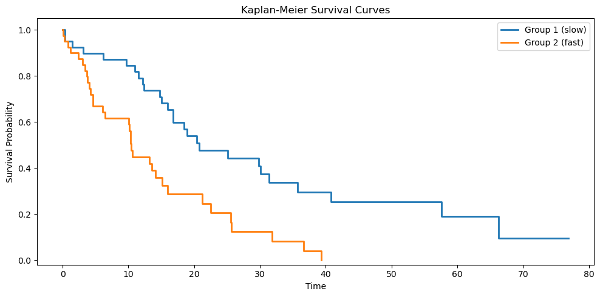

# 카플란-마이어 구현

## 개요

이 절에서는 NumPy와 SciPy만으로 카플란-마이어 생존곡선 추정량과 두 표본 로그순위 검정을
자족적으로 구현한다. 구현이 수학적 정의를 한 단계씩 그대로 따라가므로, 실무용 라이브러리로
넘어가기 전에 생존분석의 작동 원리를 익히기에 적합하다.

## 카플란-마이어 추정량

### 수학적 정의

관측 시간과 절단 지시자를 갖는 대상 $n$명이 주어지면, 생존함수의 카플란-마이어 추정량은

$$
\hat{S}(t) = \prod_{j:\, t_{(j)} \leq t} \left(1 - \frac{d_j}{n_j}\right)
$$

이다. 여기서 $t_{(1)} < t_{(2)} < \cdots < t_{(K)}$는 서로 다른 사건시간이고, $d_j$는
$t_{(j)}$의 사건 수, $n_j$는 $t_{(j)}$ 직전에 위험에 있는 대상 수다.

<div class="codebox" markdown>

**예제 1.** 카플란-마이어 추정 구현

```python
import numpy as np

def kaplan_meier(times, censored):
    """카플란-마이어 생존함수 추정값을 구한다.

    사건이 일어난 시점마다 "그 직전까지 살아 있던 사람 중 그 시점을
    넘긴 비율"을 곱해 나간다. 중도절단된 사람은 절단 시점까지만
    위험집합에 남아 있다가 조용히 빠진다 — 이것이 중도절단 자료를
    버리지 않고 쓰는 방법이다.

    매개변수
    --------
    times    : 관측된 시각(사건 또는 절단)
    censored : 1 이면 중도절단, 0 이면 사건이 관측됨

    돌려주는 값
    ----------
    t_plot, s_plot : 계단그림에 쓸 시각과 생존확률
    """
    order = np.argsort(times)
    times = times[order]
    censored = censored[order]

    event_times = times[censored == 0]
    unique_events = np.unique(event_times)

    n_total = len(times)
    s = 1.0
    t_list = [0.0]
    s_list = [1.0]

    for t_j in unique_events:
        # 위험집합: 그 시점에 아직 사건도 절단도 겪지 않은 사람 수
        n_at_risk = np.sum(times >= t_j)
        d_j = np.sum((times == t_j) & (censored == 0))
        s *= (n_at_risk - d_j) / n_at_risk
        t_list.append(t_j)
        s_list.append(s)

    t_list.append(times.max())
    s_list.append(s_list[-1])

    return np.array(t_list), np.array(s_list)
```

</div>

!!! warning "이 코드의 `censored`는 사건이 0이다"
    `censored == 1`이 절단, `censored == 0`이 사건을 뜻한다. `lifelines`의
    `event_observed`나 R의 `Surv(event=)`처럼 **사건을 1로 두는 관례가 더 널리 쓰이므로**
    코드를 옮겨 쓸 때 반드시 확인하라. 연습문제 3에서 두 관례를 비교한다.

**알고리즘 따라가기:**

1. 관측치를 시간순으로 **정렬**한다.
2. 서로 다른 사건시간(`censored == 0`인 시점)을 **추출**한다.
3. **각 사건시간** $t_j$에 대해,
     - 아직 위험에 있는 대상을 센다: $n_j = \sum \mathbf{1}(t_i \geq t_j)$.
     - 사건을 센다: $d_j = \sum \mathbf{1}(t_i = t_j \text{ 이고 사건 관측})$.
     - 갱신한다: $\hat{S} \leftarrow \hat{S} \times (1 - d_j / n_j)$.
4. 그림을 위해 곡선을 관측된 최대 시점까지 **연장**한다.

!!! note "절단된 관측치"

    절단된 대상은 $\hat{S}(t)$의 하강을 일으키지 않지만 이후 사건시간의 위험집합 $n_j$를
    줄인다. 카플란-마이어 추정량이 불완전한 관측의 부분적 정보를 반영하는 기제다.

## 로그순위 검정

### 가설

두 표본 로그순위 검정은 다음을 평가한다.

$$
H_0 : S_1(t) = S_2(t) \quad \text{for all } t \geq 0
$$

$$
H_1 : S_1(t) \neq S_2(t) \quad \text{for some } t \geq 0
$$

### 검정통계량

합쳐진 각 사건시간 $t_{(j)}$에서 $r_{1j}$, $r_{2j}$를 위험집합 크기, $d_{1j}$, $d_{2j}$를
사건 수라 하고 $r_j = r_{1j} + r_{2j}$, $d_j = d_{1j} + d_{2j}$라 하자. 집단 1의 기대
사건 수와 분산 기여는

$$
e_{1j} = d_j \cdot \frac{r_{1j}}{r_j}, \qquad v_j = \frac{r_{1j} \, r_{2j} \, d_j \, (r_j - d_j)}{r_j^2 \, (r_j - 1)}
$$

이다. 검정통계량은

$$
\chi^2_{\text{LR}} = \frac{(O_1 - E_1)^2}{V_1} \;\xrightarrow{d}\; \chi^2_1
$$

이며 $O_1 = \sum d_{1j}$, $E_1 = \sum e_{1j}$, $V_1 = \sum v_j$이다.

<div class="codebox" markdown>

**예제 2.** 로그순위 검정 구현

```python
from scipy import stats

def logrank_test(times_1, censored_1, times_2, censored_2):
    """이표본 로그순위 검정.

    사건 시점마다 2x2 분할표를 만들어 관측 사건 수와 기대 사건 수를
    비교한다. 그 차이를 모든 시점에 걸쳐 누적한 것이 통계량이다.
    두 생존곡선이 같다는 귀무가설 아래에서 자유도 1 인 카이제곱을 따른다.

    돌려주는 값
    ----------
    chi2, p_value
    """
    event_1 = times_1[censored_1 == 0]
    event_2 = times_2[censored_2 == 0]
    all_event_times = np.unique(np.concatenate([event_1, event_2]))

    O1 = 0.0
    E1 = 0.0
    V  = 0.0

    for t_j in all_event_times:
        r1 = np.sum(times_1 >= t_j)
        r2 = np.sum(times_2 >= t_j)
        r  = r1 + r2

        d1 = np.sum(event_1 == t_j)
        d2 = np.sum(event_2 == t_j)
        d  = d1 + d2

        # 두 집단의 생존이 같다면, 그 시점의 사건은 위험집합 크기에
        # 비례해 나뉘어야 한다. 그것이 기대 사건 수 e1 이다.
        e1 = r1 * d / r if r > 0 else 0
        v  = r1 * r2 * d * (r - d) / (r**2 * (r - 1)) if r > 1 else 0

        O1 += d1
        E1 += e1
        V  += v

    chi2 = (O1 - E1)**2 / V if V > 0 else 0
    p_value = stats.chi2(1).sf(chi2)
    return chi2, p_value
```

이 구현은 두 집단의 사건시간을 합친 뒤 각 사건시간을 순회하며 집단 1의 관측 사건 수, 기대
사건 수, 분산을 누적한다.

</div>

## 모의실험과 시각화

다음 코드는 모의자료를 생성하고 카플란-마이어 곡선을 그린다.

<div class="codebox" markdown>

**예제 3.** 전체 실행

```python
import matplotlib.pyplot as plt

def main():
    np.random.seed(0)

    # 1집단: 사건이 늦게 일어난다(평균 20). 20%는 중도절단된다.
    n1 = 40
    times_1 = np.random.exponential(scale=20, size=n1)
    censored_1 = (np.random.rand(n1) < 0.2).astype(int)

    # 2집단: 사건이 빨리 일어난다(평균 12).
    n2 = 40
    times_2 = np.random.exponential(scale=12, size=n2)
    censored_2 = (np.random.rand(n2) < 0.2).astype(int)

    t1, s1 = kaplan_meier(times_1, censored_1)
    t2, s2 = kaplan_meier(times_2, censored_2)

    fig, ax = plt.subplots(figsize=(10, 5))
    # where="post" 가 계단을 오른쪽으로 뻗게 한다. 생존함수는 사건이
    # 일어난 순간에 떨어지고 다음 사건까지 평평하므로 이 설정이라야 맞다.
    ax.step(t1, s1, where="post", linewidth=2, label="Group 1 (slow)")
    ax.step(t2, s2, where="post", linewidth=2, label="Group 2 (fast)")
    ax.set_xlabel("Time")
    ax.set_ylabel("Survival Probability")
    ax.set_title("Kaplan-Meier Survival Curves")
    ax.set_ylim(-0.02, 1.05)
    ax.legend()
    plt.tight_layout()
    plt.show()

    # 그림으로 본 차이가 통계적으로도 뒷받침되는지 확인한다.
    chi2, p = logrank_test(times_1, censored_1, times_2, censored_2)
    print(f"Log-Rank Test:  chi2 = {chi2:.4f},  p = {p:.4f}")


if __name__ == "__main__":
    main()
```

출력:

```
Log-Rank Test:  chi2 = 12.6889,  p = 0.0004
```



두 곡선이 뚜렷이 갈리고 로그순위 검정도 $p = 0.0004$로 유의하다. 평균 생존이 20과 12로 다른 두 지수분포에서 뽑았으므로 옳은 판정이다.

집단 1은 $\text{Exp}(\lambda = 1/20)$에서, 집단 2는 $\text{Exp}(\lambda = 1/12)$에서
뽑았고 각 집단에 약 20%의 무작위 절단이 있다. 곡선의 시각적 분리와 로그순위 p-값을 함께 보면
생존 차이가 통계적으로 유의한지 알 수 있다.

</div>

## 해석

- **계단함수 출력**: 카플란-마이어 곡선은 관측된 사건시간에서만 떨어지는 계단함수다. 평평한
  구간은 사건이 없는 구간에 해당한다.
- **중도절단**: 절단된 대상은 생존의 하강 없이 위험집합에서 빠진다. 후반부에 절단이 많으면
  신뢰구간이 넓어진다.
- **로그순위 검정**: p-값이 유의하면(예: $p < 0.05$) 생존분포가 다르다는 뜻이다. 비례위험
  아래에서 검정력이 가장 높다.
- **한계**: 카플란-마이어 추정량은 일변량이다. 공변량을 보정할 수 없다. 공변량 보정 생존분석에는
  콕스 비례위험 모형이 필요하다.

!!! warning "교차하는 생존곡선"

    두 카플란-마이어 곡선이 교차하면 곡선이 상당히 다른데도 로그순위 검정이 유의한 차이를
    탐지하지 못할 수 있다. 이런 경우 초기 사건시간에 더 큰 가중을 주는 가중 로그순위 검정
    (예: 윌콕슨)을 고려하라.

## 연습문제

<div class="drillbox" markdown>

**연습문제 1.** <span class="diff easy" title="쉬움"></span>
손으로 하는 카플란-마이어 계산

대상 8명의 자료가 다음과 같다.

| 대상 | 시간 | 절단 (1 = 예) |
|:-------:|:----:|:------------------:|
| 1 | 1 | 0 |
| 2 | 3 | 1 |
| 3 | 4 | 0 |
| 4 | 5 | 0 |
| 5 | 5 | 1 |
| 6 | 7 | 0 |
| 7 | 10 | 1 |
| 8 | 12 | 0 |

각 사건시간의 $\hat{S}(t)$를 계산하라.

</div>

??? success "풀이"

    서로 다른 사건시간은 1, 4, 5, 7, 12다.

    | $t_{(j)}$ | $n_j$ | $d_j$ | $1 - d_j/n_j$ | $\hat{S}(t_{(j)})$ |
    |:----------:|:-----:|:-----:|:--------------:|:-------------------:|
    | 1 | 8 | 1 | 7/8 = 0.875 | 0.875 |
    | 4 | 6 | 1 | 5/6 = 0.833 | 0.875 $\times$ 0.833 = 0.729 |
    | 5 | 5 | 1 | 4/5 = 0.800 | 0.729 $\times$ 0.800 = 0.583 |
    | 7 | 3 | 1 | 2/3 = 0.667 | 0.583 $\times$ 0.667 = 0.389 |
    | 12 | 1 | 1 | 0/1 = 0.000 | 0.000 |

    $t_{(2)} = 4$에서는 대상 1이 $t = 1$에 사건을 겪었고 대상 2가 $t = 3$에 절단되어 6명이
    위험에 남는다.

    $t_{(3)} = 5$에서는 대상 5가 $t = 5$에 절단되지만 위험집합에 포함된다(관례: $t_j$의
    절단은 사건 뒤에 처리한다). 따라서 $n_3 = 5$이고 $d_3 = 1$이다(대상 4만 사건을 겪었다).

<div class="drillbox" markdown>

**연습문제 2.** <span class="diff easy" title="쉬움"></span>
로그순위 검정 계산

두 집단이 있다.

**집단 A:** 2, 5, 8+ (+ = 절단)

**집단 B:** 1, 4, 6

로그순위 검정통계량 $\chi^2_{\text{LR}}$과 p-값을 계산하라.

</div>

??? success "풀이"

    합친 서로 다른 사건시간은 1, 2, 4, 5, 6이다.

    | $t_{(j)}$ | $r_{Aj}$ | $r_{Bj}$ | $r_j$ | $d_{Aj}$ | $d_{Bj}$ | $d_j$ | $e_{Aj}$ | $v_j$ |
    |:----------:|:--------:|:--------:|:-----:|:--------:|:--------:|:-----:|:--------:|:-----:|
    | 1 | 3 | 3 | 6 | 0 | 1 | 1 | 0.500 | 0.250 |
    | 2 | 3 | 2 | 5 | 1 | 0 | 1 | 0.600 | 0.240 |
    | 4 | 2 | 2 | 4 | 0 | 1 | 1 | 0.500 | 0.250 |
    | 5 | 2 | 1 | 3 | 1 | 0 | 1 | 0.667 | 0.222 |
    | 6 | 1 | 1 | 2 | 0 | 1 | 1 | 0.500 | 0.250 |

    $O_A = 2$, $E_A = 0.500 + 0.600 + 0.500 + 0.667 + 0.500 = 2.767$.

    $V_A = 0.250 + 0.240 + 0.250 + 0.222 + 0.250 = 1.212$.

    $$
    \chi^2_{\text{LR}} = \frac{(2 - 2.767)^2}{1.212} = \frac{0.589}{1.212} = 0.486
    $$

    $p = P(\chi^2_1 \geq 0.486) = 0.486$이다. p-값이 크므로 $H_0$을 기각하지 않는다.
    유의한 차이가 탐지되지 않았다(표본이 매우 작다).

    검정통계량과 p-값이 우연히 둘 다 $0.486$인 것은 순전히 우연이다. 서로 다른 양이므로
    혼동하지 말라.

<div class="drillbox" markdown>

**연습문제 3.** <span class="diff med" title="중간"></span>
절단 부호화 관례

위 구현에서 `censored = 1`은 절단, `censored = 0`은 사건 관측을 뜻한다. 많은 생존분석
패키지는 반대 관례(`event = 1`)를 쓴다.

**(a)** `event` 부호화 관례로 카플란-마이어의 핵심 루프를 다시 쓰라.

**(b)** 부호화 관례가 수학적 결과에 영향을 주지 않는 이유를 설명하라.

</div>

??? success "풀이"

    **(a)** `event` 지시자(1 = 사건, 0 = 절단)를 쓰면 다음과 같다.

    ```python
    import numpy as np

    times = np.array([5, 8, 8, 12, 15, 20, 22, 30], dtype=float)
    event = np.array([1, 1, 0, 1, 0, 1, 0, 1])   # 1 = 사건, 0 = 절단

    event_times = times[event == 1]
    unique_events = np.unique(event_times)

    s = 1.0
    for t_j in unique_events:
        n_at_risk = np.sum(times >= t_j)
        d_j = np.sum((times == t_j) & (event == 1))
        s *= (n_at_risk - d_j) / n_at_risk
        print(f"t = {t_j:5.1f}  n = {n_at_risk}  d = {d_j}  S = {s:.4f}")

    # 같은 자료를 앞의 관례(1 = 절단)로 넘겨도 결과가 같다
    t_plot, s_plot = kaplan_meier(times, 1 - event)
    print("final S:", s, "vs", s_plot[-1])
    ```

    출력:

    ```
    t =   5.0  n = 8  d = 1  S = 0.8750
    t =   8.0  n = 7  d = 1  S = 0.7500
    t =  12.0  n = 5  d = 1  S = 0.6000
    t =  20.0  n = 3  d = 1  S = 0.4000
    t =  30.0  n = 1  d = 1  S = 0.0000
    final S: 0.0 vs 0.0
    ```

    바뀌는 것은 `censored == 0`을 `event == 1`로 대체하는 것뿐이다.

    **(b)** 수학적 양 $n_j$와 $d_j$는 어느 관측치가 사건이고 어느 것이 절단인지로 정의된다.
    사건에 0을 붙이든 1을 붙이든 순전히 소프트웨어 관례다. 코드가 사건과 절단을 옳게 식별하는
    한 계산된 $\hat{S}(t)$는 동일하다.

    !!! warning "그러나 실수는 조용히 일어난다"
        관례가 결과를 바꾸지 않는다는 것은 **코드를 옳게 썼을 때**의 이야기다. 관례를 헷갈려
        지시자를 반대로 넘기면 사건과 절단이 통째로 뒤바뀌어, 오류 없이 실행되면서 완전히
        틀린 곡선이 나온다. 이런 실수는 예외를 던지지 않으므로 발견하기 어렵다.

        간단한 방어법은 결과를 검산하는 것이다. 사건 수 $d = \sum \delta_i$를 출력해 자료에서
        기대하는 값과 맞는지 확인하고, 절단율이 그럴듯한지 보라. 절단율이 90%로 나왔는데
        연구 설계상 30%여야 한다면 지시자가 뒤집혔을 가능성이 크다.

<div class="drillbox" markdown>

**연습문제 4.** <span class="diff med" title="중간"></span>
카플란-마이어 추정량의 성질

**(a)** $\hat{S}(t)$를 왜 "곱-극한" 추정량이라 부르는가?

**(b)** 절단이 없으면 카플란-마이어 추정량이 경험적 생존함수
$\hat{S}(t) = (t_i > t \text{인 개수}) / n$으로 환원됨을 보여라.

</div>

??? success "풀이"

    **(a)** $\hat{S}(t)$가 $t$까지의 모든 사건시간에 걸친 조건부 생존확률 $(1 - d_j/n_j)$의
    **곱**으로 정의되기 때문에 곱-극한 추정량이라 부른다. "극한"은 연속시간 생존과의 연결을
    가리킨다. 시간 분할이 촘촘해질수록 이산적인 곱이 연속 생존함수에 가까워진다.

    **(b)** 절단이 없으면 각 사건시간 $t_{(j)}$에서 위험에 있는 대상이 $n_j = n - j + 1$명이고
    사건은 $d_j = 1$건이다(단순함을 위해 동점이 없다고 가정한다). 그러면

    $$
    \hat{S}(t_{(j)}) = \prod_{k=1}^{j} \frac{n - k + 1 - 1}{n - k + 1} = \prod_{k=1}^{j} \frac{n - k}{n - k + 1}
    $$

    이며, 이는 망원급수형 곱이다.

    $$
    \hat{S}(t_{(j)}) = \frac{n-1}{n} \cdot \frac{n-2}{n-1} \cdots \frac{n-j}{n-j+1} = \frac{n - j}{n}
    $$

    $n - j$가 $t_i > t_{(j)}$인 대상의 수이므로
    $\hat{S}(t_{(j)}) = (t_i > t_{(j)} \text{인 개수}) / n$이고, 이는 경험적 생존함수다.
    $\square$

<div class="drillbox" markdown>

**연습문제 5.** <span class="diff med" title="중간"></span>
카플란-마이어 추정량의 분산

그린우드 공식이 $\hat{S}(t)$의 분산을 준다.

$$
\widehat{\text{Var}}(\hat{S}(t)) = \hat{S}(t)^2 \sum_{j:\, t_{(j)} \leq t} \frac{d_j}{n_j(n_j - d_j)}
$$

**(a)** 연습문제 1의 자료에서 $\widehat{\text{Var}}(\hat{S}(5))$를 계산하라.

**(b)** 로그-로그 변환으로 $S(5)$의 95% 신뢰구간을 구성하라.

</div>

??? success "풀이"

    **(a)** 연습문제 1에서 $\hat{S}(5) = 0.583$이다. 5까지의 사건시간에 걸친
    $d_j / [n_j(n_j - d_j)]$의 합은

    - $t = 1$: $1 / (8 \times 7) = 1/56 = 0.01786$
    - $t = 4$: $1 / (6 \times 5) = 1/30 = 0.03333$
    - $t = 5$: $1 / (5 \times 4) = 1/20 = 0.05000$

    이므로 합은 $0.01786 + 0.03333 + 0.05000 = 0.10119$다.

    $$
    \widehat{\text{Var}}(\hat{S}(5)) = 0.583^2 \times 0.10119 = 0.3399 \times 0.10119 = 0.0344
    $$

    **(b)** 로그-로그 변환 신뢰구간은 $\theta = \ln(-\ln \hat{S}(t))$를 쓰며 근사 표준오차는

    $$
    \text{se}(\theta) = \frac{1}{|\ln \hat{S}(t)|} \cdot \frac{\sqrt{\widehat{\text{Var}}(\hat{S}(t))}}{\hat{S}(t)}
    $$

    이다. $\ln \hat{S}(5) = \ln 0.583 = -0.539$이므로 $|\ln \hat{S}(5)| = 0.539$다.

    $$
    \text{se}(\theta) = \frac{1}{0.539} \cdot \frac{\sqrt{0.0344}}{0.583} = \frac{1}{0.539} \cdot \frac{0.1855}{0.583} = 1.855 \times 0.318 = 0.590
    $$

    $\theta = \ln(0.539) = -0.618$이다.

    $\theta$의 신뢰구간은 $-0.618 \pm 1.96 \times 0.590 = (-1.774,\ 0.538)$이다.

    역변환은 $S = \exp(-\exp(\theta))$이며, **$\theta$가 커지면 $S$는 작아지므로 상하가
    뒤바뀐다.**

    - $\theta$의 **상**한 $0.538$에서: $S$의 **하**한 $= \exp(-\exp(0.538)) = \exp(-1.713) = 0.180$.
    - $\theta$의 **하**한 $-1.774$에서: $S$의 **상**한 $= \exp(-\exp(-1.774)) = \exp(-0.170) = 0.844$.

    따라서 $S(5)$의 95% 신뢰구간은 약 $(0.180,\ 0.844)$다. 표본이 8명뿐이라 구간의 폭이
    $0.664$로 매우 넓다. 점추정치 $0.583$이 이 구간 안 어디에 있어도 자료와 모순되지 않는다는
    뜻이며, 이런 표본 크기에서 생존율을 논하는 것이 얼마나 무의미한지 보여준다.
